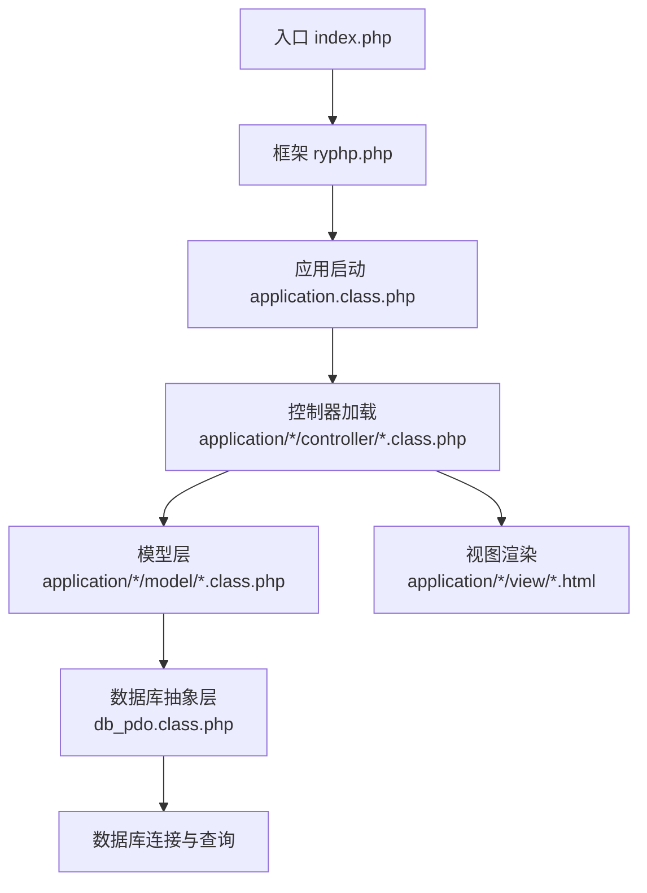
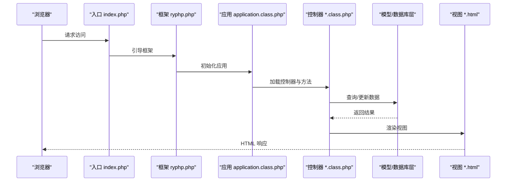
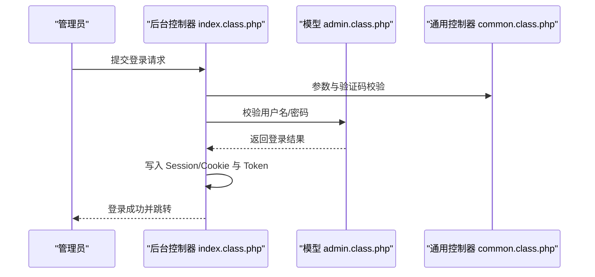
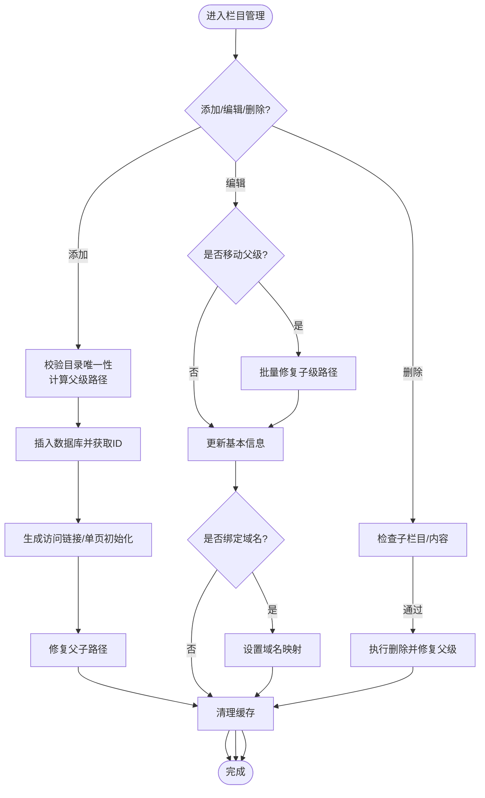
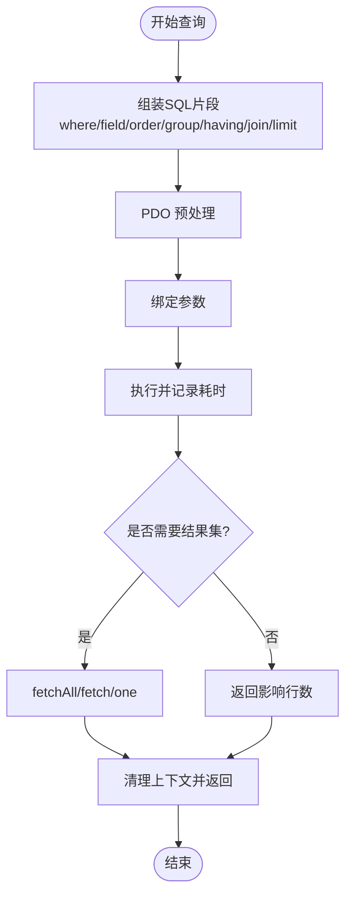
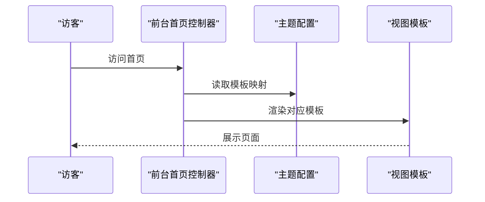
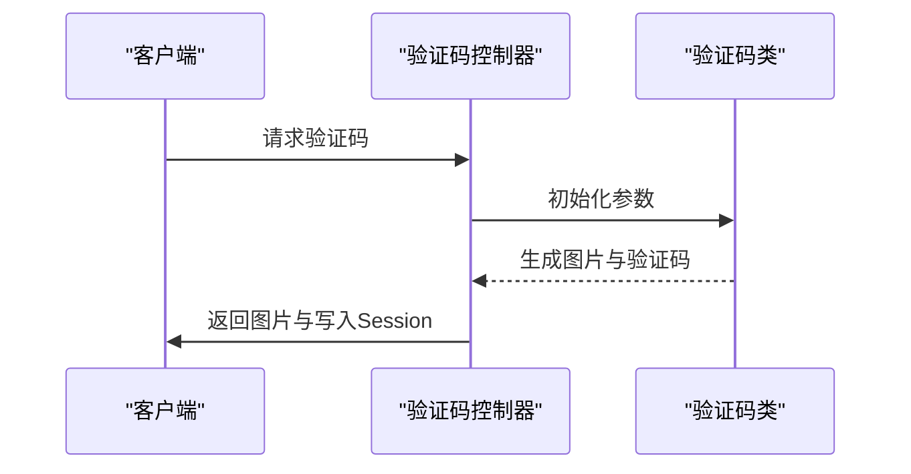
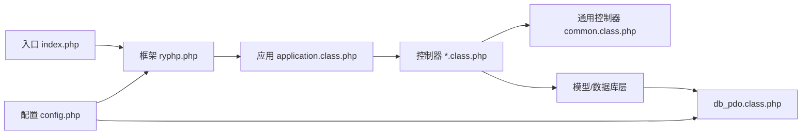

# 内容管理

<cite>
**本文引用的文件**
- [index.php](file://index.php)
- [README.md](file://README.md)
- [config.php](file://common/config/config.php)
- [ryphp.php](file://ryphp/ryphp.php)
- [application.class.php](file://ryphp/core/class/application.class.php)
- [db_pdo.class.php](file://ryphp/core/class/db_pdo.class.php)
- [index.class.php（前台首页）](file://application/index/controller/index.class.php)
- [index.class.php（后台首页）](file://application/lry_admin_center/controller/index.class.php)
- [common.class.php（后台通用控制器）](file://application/lry_admin_center/controller/common.class.php)
- [admin.class.php（后台管理员模型）](file://application/lry_admin_center/model/admin.class.php)
- [category.class.php（后台栏目管理）](file://application/lry_admin_center/controller/category.class.php)
- [content.class.php（后台内容管理）](file://application/lry_admin_center/controller/content.class.php)
- [index.html（后台首页视图）](file://application/lry_admin_center/view/index.html)
- [config.php（主题配置）](file://application/index/view/rongyao/config.php)
- [index.class.php（API验证码）](file://application/api/controller/index.class.php)
</cite>

## 目录
1. [简介](#简介)
2. [项目结构](#项目结构)
3. [核心组件](#核心组件)
4. [架构总览](#架构总览)
5. [详细组件分析](#详细组件分析)
6. [依赖关系分析](#依赖关系分析)
7. [性能考虑](#性能考虑)
8. [故障排查指南](#故障排查指南)
9. [结论](#结论)

## 简介
本项目为一个基于自研 RYPHP 框架的内容管理系统（CMS），提供前台展示与后台内容管理能力。系统采用 MVC 架构，支持多站点、多模型、多模板主题，具备完善的权限控制、缓存与数据库抽象层。

## 项目结构
- 应用入口与框架
  - 入口文件：index.php
  - 框架核心：ryphp/（含核心类、函数、消息模板）
  - 配置中心：common/config/config.php
- 前台应用：application/index/（控制器、模型、视图）
- 后台应用：application/lry_admin_center/（控制器、模型、视图）
- API 应用：application/api/（验证码等接口）
- 公共静态资源：common/static/（CSS、JS、插件）
- 缓存目录：cache/cache_file/

图表来源
- [index.php:1-18](file://index.php#L1-L18)
- [ryphp.php:83-202](file://ryphp/ryphp.php#L83-L202)
- [application.class.php:24-65](file://ryphp/core/class/application.class.php#L24-L65)
- [db_pdo.class.php:44-52](file://ryphp/core/class/db_pdo.class.php#L44-L52)

章节来源
- [index.php:1-18](file://index.php#L1-L18)
- [README.md:1-6](file://README.md#L1-L6)
- [config.php:1-88](file://common/config/config.php#L1-L88)

## 核心组件
- 框架引导与路由
  - 入口文件定义调试开关、根路径、URL 模式，并调用框架初始化。
  - 框架定义常量、加载公共函数与版本信息，提供类加载与控制器/模型加载机制。
  - 应用启动类负责路由参数解析与控制器方法调度。
- 数据库抽象层
  - PDO 实现提供链式查询构造器、预处理语句、事务、字段/表检测等能力。
- 后台管理
  - 登录鉴权、权限校验、Token 校验、锁屏/解锁、日志记录、模板路径解析。
  - 栏目管理：增删改查、排序、模板选择、域名绑定、父子关系修复。
  - 内容管理：内容模型加载、分页、搜索等基础支撑。
- 前台展示
  - 主题配置与模板映射，支持多种频道/列表/内容页模板。
- API 接口
  - 验证码生成与校验，支持宽高、长度、字体大小等参数。

章节来源
- [ryphp.php:83-202](file://ryphp/ryphp.php#L83-L202)
- [application.class.php:9-40](file://ryphp/core/class/application.class.php#L9-L40)
- [db_pdo.class.php:100-124](file://ryphp/core/class/db_pdo.class.php#L100-L124)
- [common.class.php:5-18](file://application/lry_admin_center/controller/common.class.php#L5-L18)
- [category.class.php:16-150](file://application/lry_admin_center/controller/category.class.php#L16-L150)
- [content.class.php:7-20](file://application/lry_admin_center/controller/content.class.php#L7-L20)
- [config.php（主题配置）:1-29](file://application/index/view/rongyao/config.php#L1-L29)
- [index.class.php（API验证码）:4-17](file://application/api/controller/index.class.php#L4-L17)

## 架构总览
系统采用“入口文件 → 框架引导 → 应用启动 → 控制器调度 → 模型查询 → 视图渲染”的标准 MVC 流程。数据库访问通过统一的抽象层实现，支持多站点、多模型与多模板主题。

图表来源
- [index.php:10-18](file://index.php#L10-L18)
- [ryphp.php:88-90](file://ryphp/ryphp.php#L88-L90)
- [application.class.php:24-40](file://ryphp/core/class/application.class.php#L24-L40)

## 详细组件分析

### 组件A：后台登录与权限控制
- 功能要点
  - 登录流程：参数校验、验证码校验、用户信息校验、成功后写入 Session/Cookie 并生成 Token。
  - 权限控制：基于角色的控制器/动作授权检查；白名单与公共动作放行。
  - 安全措施：Referer 校验、IP 黑名单、Token 防 CSRF、锁屏/解锁、后台日志记录。
- 关键流程

图表来源
- [index.class.php（后台首页）:19-38](file://application/lry_admin_center/controller/index.class.php#L19-L38)
- [admin.class.php:4-27](file://application/lry_admin_center/model/admin.class.php#L4-L27)
- [common.class.php:56-62](file://application/lry_admin_center/controller/common.class.php#L56-L62)

章节来源
- [index.class.php（后台首页）:19-38](file://application/lry_admin_center/controller/index.class.php#L19-L38)
- [admin.class.php:4-96](file://application/lry_admin_center/model/admin.class.php#L4-L96)
- [common.class.php:56-131](file://application/lry_admin_center/controller/common.class.php#L56-L131)

### 组件B：栏目管理（增删改查与模板选择）
- 功能要点
  - 添加/批量添加：校验目录唯一性、计算父级路径、生成访问链接、维护子级路径。
  - 编辑：支持移动到其他父级、批量修复子级路径、更新链接与域名。
  - 删除：校验是否有子栏目与内容，避免破坏性删除。
  - 列表：树形展示、展开/收起状态持久化、状态切换按钮、排序。
  - 模板选择：按模型与主题动态匹配可用模板。
- 关键流程

图表来源
- [category.class.php:16-150](file://application/lry_admin_center/controller/category.class.php#L16-L150)
- [category.class.php:219-237](file://application/lry_admin_center/controller/category.class.php#L219-L237)
- [category.class.php:250-334](file://application/lry_admin_center/controller/category.class.php#L250-L334)
- [category.class.php:362-495](file://application/lry_admin_center/controller/category.class.php#L362-L495)

章节来源
- [category.class.php:16-150](file://application/lry_admin_center/controller/category.class.php#L16-L150)
- [category.class.php:219-237](file://application/lry_admin_center/controller/category.class.php#L219-L237)
- [category.class.php:250-334](file://application/lry_admin_center/controller/category.class.php#L250-L334)
- [category.class.php:362-495](file://application/lry_admin_center/controller/category.class.php#L362-L495)

### 组件C：数据库抽象层（PDO）
- 功能要点
  - 链式查询：where/field/order/group/having/join/limit 等组合。
  - 预处理与绑定：防止注入，支持复杂条件与函数回调。
  - 常用操作：insert/update/delete/select/find/one/total。
  - 事务支持：start_transaction/commit/rollback。
  - 工具方法：获取主键、字段、表存在性、版本信息等。
- 关键流程

图表来源
- [db_pdo.class.php:134-221](file://ryphp/core/class/db_pdo.class.php#L134-L221)
- [db_pdo.class.php:365-396](file://ryphp/core/class/db_pdo.class.php#L365-L396)
- [db_pdo.class.php:513-520](file://ryphp/core/class/db_pdo.class.php#L513-L520)

章节来源
- [db_pdo.class.php:100-124](file://ryphp/core/class/db_pdo.class.php#L100-L124)
- [db_pdo.class.php:365-396](file://ryphp/core/class/db_pdo.class.php#L365-L396)
- [db_pdo.class.php:513-520](file://ryphp/core/class/db_pdo.class.php#L513-L520)

### 组件D：前台首页与主题模板
- 功能要点
  - 前台首页控制器当前演示为调试输出分类数据。
  - 主题配置文件定义频道、列表、内容页模板映射。
  - 视图层通过模板路径解析与主题切换实现多主题支持。
- 关键流程

图表来源
- [index.class.php（前台首页）:14-17](file://application/index/controller/index.class.php#L14-L17)
- [config.php（主题配置）:1-29](file://application/index/view/rongyao/config.php#L1-L29)

章节来源
- [index.class.php（前台首页）:14-17](file://application/index/controller/index.class.php#L14-L17)
- [config.php（主题配置）:1-29](file://application/index/view/rongyao/config.php#L1-L29)

### 组件E：API 验证码
- 功能要点
  - 动态生成验证码图片，支持宽高、长度、字体大小参数。
  - 将验证码写入 Session，供登录时校验。
- 关键流程

图表来源
- [index.class.php（API验证码）:6-17](file://application/api/controller/index.class.php#L6-L17)

章节来源
- [index.class.php（API验证码）:6-17](file://application/api/controller/index.class.php#L6-L17)

## 依赖关系分析
- 入口依赖框架引导，框架负责常量定义、类加载与应用启动。
- 控制器依赖通用控制器进行鉴权与安全校验，业务控制器再依赖模型与视图。
- 模型层依赖数据库抽象层，统一查询与事务处理。
- 配置文件贯穿全局，决定数据库、缓存、URL、上传等行为。

图表来源
- [index.php:10-18](file://index.php#L10-L18)
- [ryphp.php:88-90](file://ryphp/ryphp.php#L88-L90)
- [application.class.php:24-40](file://ryphp/core/class/application.class.php#L24-L40)
- [common.class.php:5-18](file://application/lry_admin_center/controller/common.class.php#L5-L18)
- [db_pdo.class.php:44-52](file://ryphp/core/class/db_pdo.class.php#L44-L52)
- [config.php:1-88](file://common/config/config.php#L1-L88)

章节来源
- [index.php:10-18](file://index.php#L10-L18)
- [ryphp.php:88-90](file://ryphp/ryphp.php#L88-L90)
- [application.class.php:24-40](file://ryphp/core/class/application.class.php#L24-L40)
- [common.class.php:5-18](file://application/lry_admin_center/controller/common.class.php#L5-L18)
- [db_pdo.class.php:44-52](file://ryphp/core/class/db_pdo.class.php#L44-L52)
- [config.php:1-88](file://common/config/config.php#L1-L88)

## 性能考虑
- 数据库层
  - 使用预处理语句与参数绑定，降低注入风险并提升执行效率。
  - 提供事务支持，确保批量操作一致性。
- 缓存与配置
  - 支持文件/Redis/Memcache 缓存类型，配合缓存清理策略减少重复查询。
  - URL 伪静态后缀与路由映射可优化 SEO 与访问性能。
- 前台模板
  - 主题与模板分离，便于静态资源优化与 CDN 部署。

## 故障排查指南
- 登录失败
  - 检查验证码是否正确、用户名/密码格式是否符合要求、账户是否被锁定。
  - 查看后台登录日志与错误日志定位问题。
- 权限不足
  - 确认角色权限是否包含目标控制器/动作；检查 Token 是否一致。
- 栏目异常
  - 父子关系修复失败或删除受限：确认是否存在子栏目或内容；必要时手动清理缓存。
- 数据库连接
  - 检查数据库配置、字符集与表前缀；查看错误日志与调试信息。

章节来源
- [admin.class.php:29-95](file://application/lry_admin_center/model/admin.class.php#L29-L95)
- [common.class.php:56-131](file://application/lry_admin_center/controller/common.class.php#L56-L131)
- [category.class.php:219-237](file://application/lry_admin_center/controller/category.class.php#L219-L237)
- [db_pdo.class.php:492-505](file://ryphp/core/class/db_pdo.class.php#L492-L505)

## 结论
本系统以 RYPHP 框架为基础，实现了清晰的 MVC 分层与完善的后台管理能力。通过数据库抽象层与模板系统，兼顾了扩展性与易用性。建议在生产环境中启用缓存、完善日志与监控，并持续优化模板与静态资源以提升用户体验。