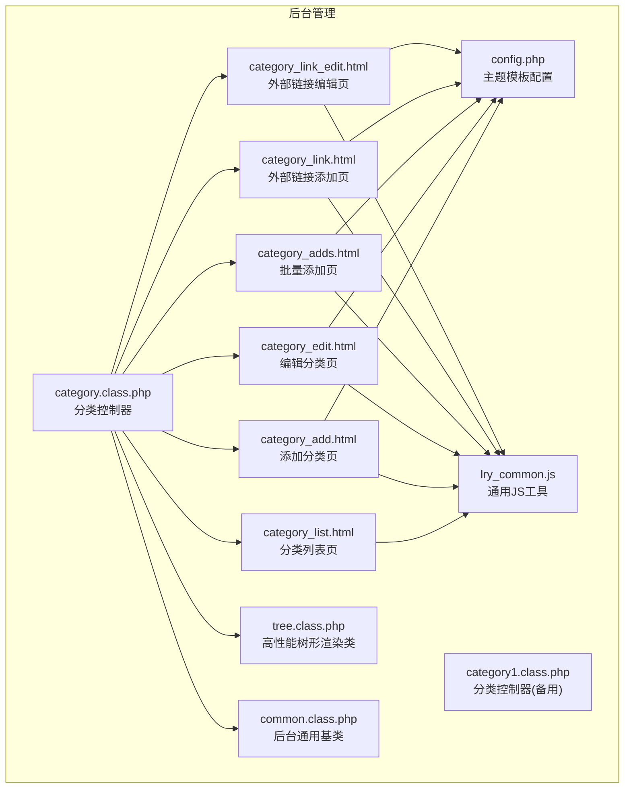
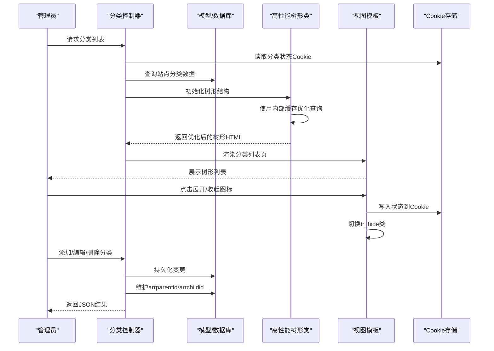
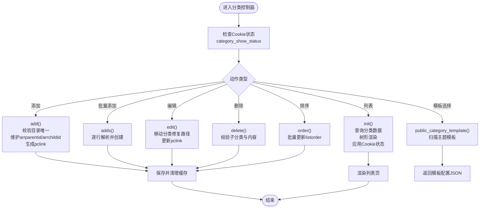
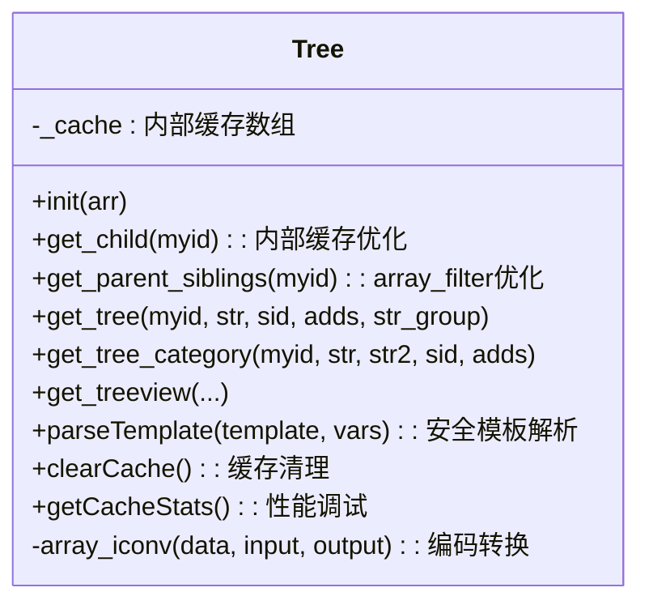
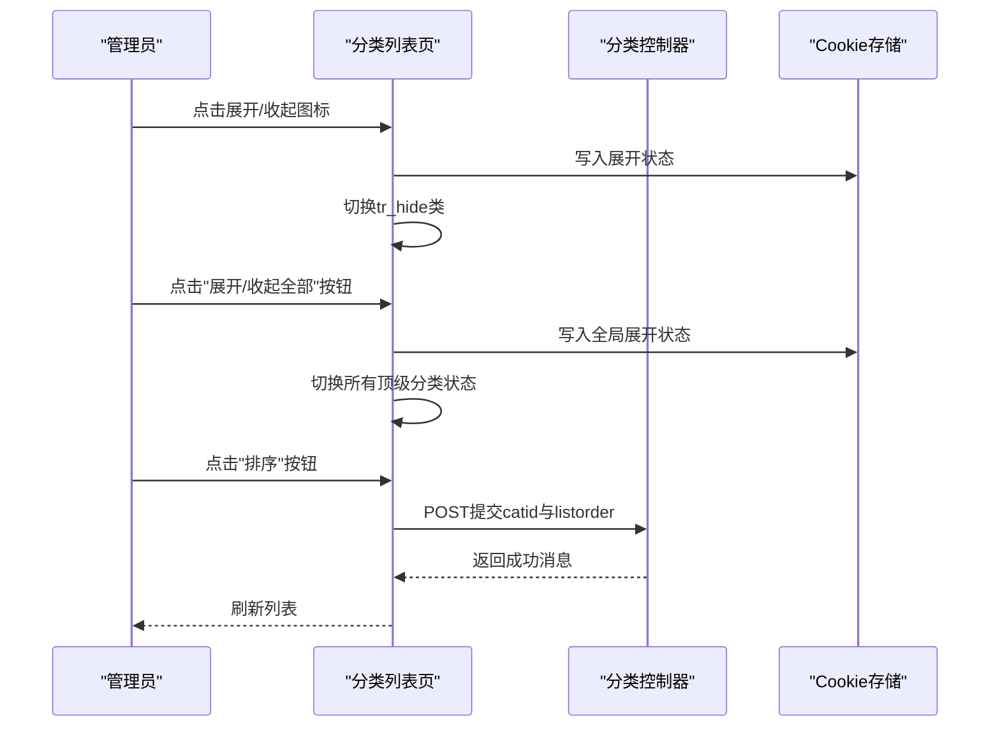
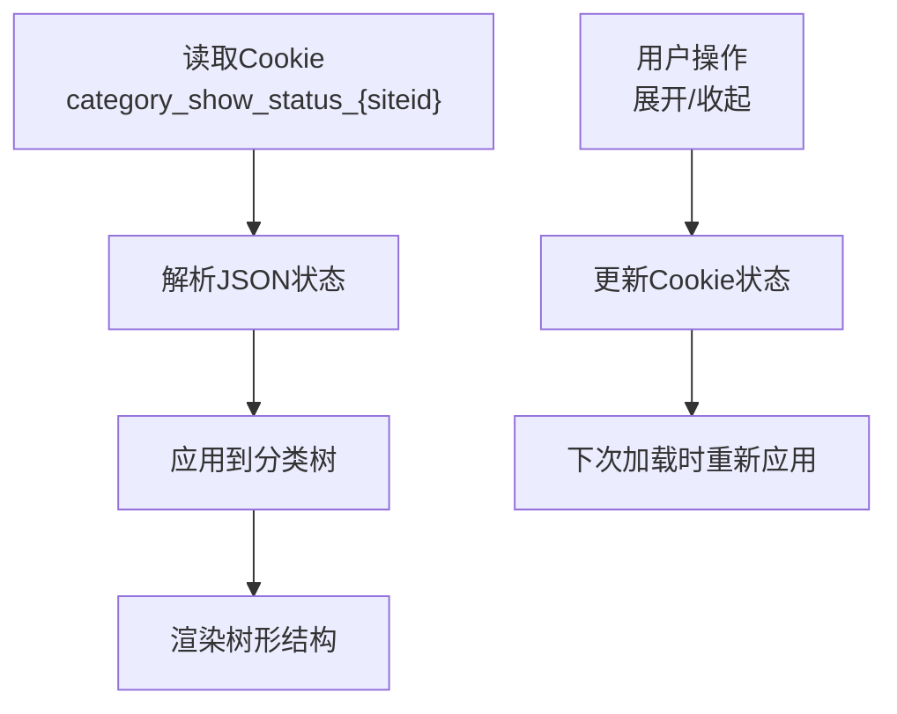
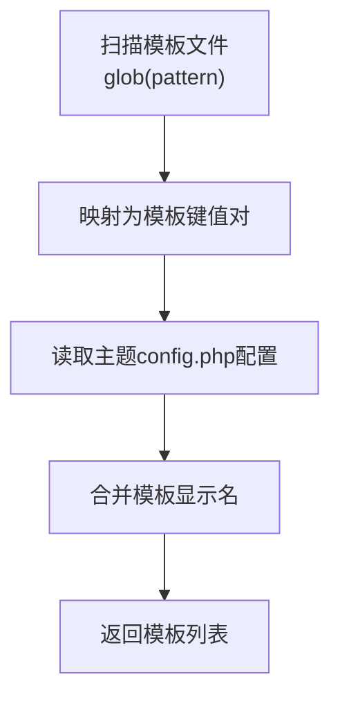
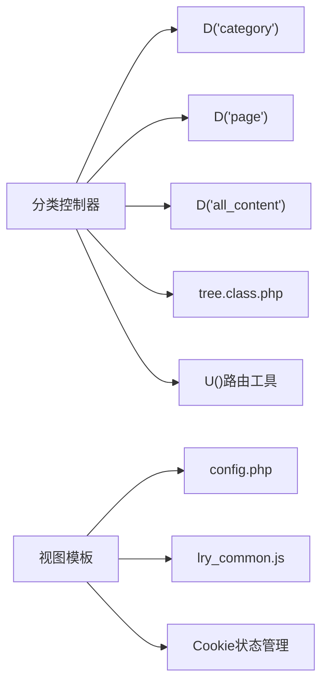

# 分类管理

<cite>
**本文引用的文件**
- [category.class.php](file://application/lry_admin_center/controller/category.class.php)
- [category1.class.php](file://application/lry_admin_center/controller/category1.class.php)
- [category_list.html](file://application/lry_admin_center/view/category_list.html)
- [category_add.html](file://application/lry_admin_center/view/category_add.html)
- [category_edit.html](file://application/lry_admin_center/view/category_edit.html)
- [category_adds.html](file://application/lry_admin_center/view/category_adds.html)
- [category_link.html](file://application/lry_admin_center/view/category_link.html)
- [category_link_edit.html](file://application/lry_admin_center/view/category_link_edit.html)
- [tree.class.php](file://ryphp/core/class/tree.class.php)
- [config.php](file://application/index/view/rongyao/config.php)
- [common.class.php](file://application/lry_admin_center/controller/common.class.php)
- [lry_common.js](file://common/static/js/lry_common.js)
</cite>

## 更新摘要
**变更内容**
- tree.class.php 性能优化：新增内部缓存机制，使用 array_filter() 优化 ancestor retrieval method 和 child node extraction method，替代传统 foreach 循环，显著提升代码质量和性能
- parseTemplate 方法安全改进：完全替换了不安全的 eval() 调用，使用安全的模板解析方法，动态处理数组中的所有键值对，完全模拟 @extract() 的行为
- Cookie 状态持久化：新增基于 Cookie 的分类状态持久化功能，实现用户展开/收起状态的跨页面保持
- 缓存管理：新增 clearCache() 和 getCacheStats() 方法，提供缓存清理和性能调试功能
- 字符编码兼容：新增 array_iconv() 方法，提供字符编码转换兼容功能

## 目录
1. [简介](#简介)
2. [项目结构](#项目结构)
3. [核心组件](#核心组件)
4. [架构总览](#架构总览)
5. [详细组件分析](#详细组件分析)
6. [依赖分析](#依赖分析)
7. [性能考虑](#性能考虑)
8. [故障排查指南](#故障排查指南)
9. [结论](#结论)
10. [附录](#附录)

## 简介
本技术文档围绕 LRYBlog 的分类管理系统，系统化梳理分类的创建、编辑、删除与层级管理的实现机制，重点分析控制器与模板的协作流程、树形结构渲染、父子关系维护、排序算法、模板选择与 SEO 设置、分类与文章的关联关系、分类链接管理以及使用指南与最佳实践。

**更新** 新增基于 Cookie 的分类状态持久化功能，实现用户展开/收起状态的跨页面保持，显著提升用户体验和操作效率。tree.class.php 经过全面性能优化，使用内部缓存机制和 array_filter() 优化查询性能，同时完全替换了不安全的 eval() 调用为安全的 parseTemplate 方法，提升了代码质量和安全性。

## 项目结构
分类管理涉及后台控制器、视图模板与通用树形渲染类，形成"控制器-模板-树形类"的分层架构：
- 控制器层：负责业务逻辑与数据持久化，提供分类列表、增删改、排序、模板选择等接口
- 视图层：提供分类管理界面，包含列表、添加、编辑、批量添加、链接管理等页面
- 树形渲染：通用树形类负责将扁平数据构造成树形结构并输出 HTML，现已具备高性能缓存机制



**图表来源**
- [category.class.php:1-601](file://application/lry_admin_center/controller/category.class.php#L1-L601)
- [category_list.html:1-116](file://application/lry_admin_center/view/category_list.html#L1-L116)
- [category_add.html:1-329](file://application/lry_admin_center/view/category_add.html#L1-L329)
- [category_edit.html:1-308](file://application/lry_admin_center/view/category_edit.html#L1-L308)
- [category_adds.html:1-237](file://application/lry_admin_center/view/category_adds.html#L1-L237)
- [category_link.html:1-125](file://application/lry_admin_center/view/category_link.html#L1-L125)
- [category_link_edit.html:1-127](file://application/lry_admin_center/view/category_link_edit.html#L1-L127)
- [tree.class.php:1-478](file://ryphp/core/class/tree.class.php#L1-L478)
- [config.php:1-29](file://application/index/view/rongyao/config.php#L1-L29)
- [common.class.php:1-153](file://application/lry_admin_center/controller/common.class.php#L1-L153)
- [lry_common.js:1-365](file://common/static/js/lry_common.js#L1-L365)

**章节来源**
- [category.class.php:1-601](file://application/lry_admin_center/controller/category.class.php#L1-L601)
- [category_list.html:1-116](file://application/lry_admin_center/view/category_list.html#L1-L116)
- [tree.class.php:1-478](file://ryphp/core/class/tree.class.php#L1-L478)

## 核心组件
- 分类控制器（category.class.php）：提供分类列表、添加、批量添加、编辑、删除、排序、模板选择等完整 CRUD 与树形管理能力；负责父子关系路径 arrparentid/arrchildid 的维护与修复；**新增**：集成 Cookie 状态持久化机制，实现展开/收起状态的跨页面保持
- 树形渲染类（tree.class.php）：将扁平数组构造成树形结构，支持图标、缩进、递归渲染，提供多种 get_tree_* 方法。**更新**：经过全面性能优化，新增内部缓存机制，使用 array_filter() 优化查询性能，完全替换了不安全的 eval() 调用为安全的 parseTemplate 方法
- 分类管理视图：包含列表页、添加/编辑页、批量添加页、外部链接添加/编辑页，配合 JS 实现展开/收起、排序、状态切换等交互；**新增**：Cookie 状态管理，实现用户偏好记忆
- 主题模板配置（config.php）：定义频道页、列表页、内容页模板集合，供分类模板选择使用
- 后台通用基类（common.class.php）：统一鉴权、权限校验、CSRF Token 校验、日志记录等

**章节来源**
- [category.class.php:1-601](file://application/lry_admin_center/controller/category.class.php#L1-L601)
- [tree.class.php:1-478](file://ryphp/core/class/tree.class.php#L1-L478)
- [config.php:1-29](file://application/index/view/rongyao/config.php#L1-L29)
- [common.class.php:1-153](file://application/lry_admin_center/controller/common.class.php#L1-L153)

## 架构总览
分类管理采用 MVC 架构：
- 控制器接收请求，组装数据，调用模型与树形类，渲染视图；**新增**：集成 Cookie 状态读取与持久化逻辑
- 视图负责用户交互与模板选择，通过 AJAX 与控制器交互；**新增**：Cookie 状态管理，实现用户偏好记忆
- 树形类负责将分类数据构造成树形 HTML，支持展开/收起与层级缩进。**更新**：内部使用 array_filter() 优化查询性能，新增缓存机制提升整体性能



**图表来源**
- [category.class.php:27-160](file://application/lry_admin_center/controller/category.class.php#L27-L160)
- [tree.class.php:61-194](file://ryphp/core/class/tree.class.php#L61-L194)

## 详细组件分析

### 分类控制器（category.class.php）分析
- 列表页 init：从数据库读取分类数据，结合 Cookie 状态决定展开/收起，使用树形类生成树形 HTML，并渲染列表页
- 添加 add：支持普通分类、单页面、外部链接三种类型；校验目录唯一性；维护 arrparentid/arrchildid；生成访问链接 pclink；必要时创建单页面内容
- 批量添加 adds：按行解析"名称|目录"格式，逐条创建并维护路径
- 编辑 edit：支持移动分类（调整父级）、修复路径 arrparentid；维护 pclink；更新缓存
- 删除 delete：校验是否有子分类与内容，避免误删；删除后修复父级路径
- 排序 order：批量更新 listorder 并清理缓存
- 模板选择 public_category_template：根据模型别名扫描主题模板并返回配置
- **新增**：Cookie 状态管理：读取并处理分类展开/收起状态，维护状态数组
- 辅助方法：delcache、repairs、repair、get_arrchildid、select_template、get_category_url、set_domain



**图表来源**
- [category.class.php:27-601](file://application/lry_admin_center/controller/category.class.php#L27-L601)

**章节来源**
- [category.class.php:27-601](file://application/lry_admin_center/controller/category.class.php#L27-L601)

### 树形结构与层级管理（tree.class.php）
- 核心方法：init、get_child、get_tree、get_tree_category、get_treeview、parseTemplate
- **更新**：经过全面性能优化，新增内部缓存机制提升查询性能，使用 array_filter() 优化 ancestor retrieval method 和 child node extraction method
- **新增**：parseTemplate 方法完全替换了不安全的 eval() 调用，使用安全的模板解析方法，动态处理数组中的所有键值对，完全模拟 @extract() 的行为
- **新增**：clearCache() 和 getCacheStats() 方法，提供缓存管理和性能调试功能
- **新增**：array_iconv() 方法，提供字符编码转换兼容功能
- 分类专用：get_tree_category 用于分类树渲染，支持 spacer 缩进与图标
- 使用场景：分类列表页将二维数组注入树形类，按模板字符串生成带层级缩进的 HTML

**更新** tree.class.php 经过全面性能优化，使用内部缓存机制和 array_filter() 优化查询性能：

```php
// 优化前的实现（传统 foreach 循环）
public function get_child($myid){
    $newarr = array();
    if(is_array($this->arr)){
        foreach($this->arr as $id => $a){
            if($a['parentid'] == $myid) $newarr[$id] = $a;
        }
    }
    return $newarr ? $newarr : false;
}

// 优化后的实现（使用内部缓存）
public function get_child($myid){
    // 检查缓存
    if(isset($this->_cache['child_' . $myid])) {
        return $this->_cache['child_' . $myid];
    }

    $newarr = array();
    if(is_array($this->arr)){
        foreach($this->arr as $id => $a){
            if($a['parentid'] == $myid) $newarr[$id] = $a;
        }
    }

    $result = $newarr ? $newarr : false;

    // 存入缓存
    $this->_cache['child_' . $myid] = $result;

    return $result;
}
```

**更新** parseTemplate 方法完全替换了不安全的 eval() 调用：

```php
/**
 * 安全的模板解析方法，替换不安全的eval()
 * 动态处理数组中的所有键值对，完全模拟 @extract() 的行为
 * @param string $template 模板字符串
 * @param array $vars 变量数组
 * @return string 解析后的字符串
 */
private function parseTemplate($template, $vars) {
    if(empty($template) || !is_array($vars)) {
        return $template;
    }

    $result = $template;

    // 动态替换所有变量，正确处理转义字符
    // 先处理转义：将 \$ 替换为临时占位符
    $placeholder = '___ESCAPED_DOLLAR___';
    $result = str_replace('\\$', $placeholder, $result);

    // 然后替换变量
    $keys = array_keys($vars);
    usort($keys, function($a, $b) { return strlen($b) - strlen($a); });
    foreach($keys as $key) {
        $value = $vars[$key];
        if(is_scalar($value) || is_null($value)) {
            $result = str_replace('$' . $key, (string)$value, $result);
        }
    }

    // 最后恢复转义字符
    $result = str_replace($placeholder, '$', $result);

    return $result;
}
```



**图表来源**
- [tree.class.php:25-478](file://ryphp/core/class/tree.class.php#L25-L478)

**章节来源**
- [tree.class.php:87-111](file://ryphp/core/class/tree.class.php#L87-L111)
- [tree.class.php:427-454](file://ryphp/core/class/tree.class.php#L427-L454)
- [tree.class.php:405-419](file://ryphp/core/class/tree.class.php#L405-L419)

### 分类列表页面（category_list.html）
- 功能点：树形列表、展开/收起、批量排序、状态切换、操作按钮（添加、编辑、删除）
- **新增**：Cookie 状态持久化：通过 lry_set_status 函数将用户展开/收起状态保存到 Cookie
- **新增**：lry_tree_toggle 全局展开/收起：一键展开或收起所有顶级分类
- 交互逻辑：通过 Cookie 记录展开/收起状态；点击图标切换子节点显隐；提交表单批量更新排序
- JS 工具：lry_tree_toggle、lry_set_cookie、lry_set_status、lry_confirm、lry_open 等



**图表来源**
- [category_list.html:46-116](file://application/lry_admin_center/view/category_list.html#L46-L116)
- [lry_common.js:72-103](file://common/static/js/lry_common.js#L72-L103)

**章节来源**
- [category_list.html:1-116](file://application/lry_admin_center/view/category_list.html#L1-L116)
- [lry_common.js:107-141](file://common/static/js/lry_common.js#L107-L141)

### Cookie 状态持久化机制
**新增功能**：分类状态持久化通过以下机制实现：

- **Cookie 命名规则**：`category_show_status_{siteid}`，其中 `{siteid}` 为当前站点 ID
- **状态存储格式**：JSON 格式的数组，键为分类 ID，值为状态码（1=收起，2=展开）
- **状态读取**：控制器在 init() 方法中读取并解析 Cookie 状态
- **状态应用**：根据 Cookie 状态决定哪些分类应该收起或展开
- **状态更新**：用户操作时通过 JavaScript 函数更新 Cookie 状态



**图表来源**
- [category.class.php:21-35](file://application/lry_admin_center/controller/category1.class.php#L21-L35)
- [category_list.html:75-81](file://application/lry_admin_center/view/category_list.html#L75-L81)

**章节来源**
- [category.class.php:21-35](file://application/lry_admin_center/controller/category1.class.php#L21-L35)
- [category_list.html:75-81](file://application/lry_admin_center/view/category_list.html#L75-L81)

### 分类页面模板管理
- 模板扫描：select_template 根据模型别名扫描主题目录下的模板文件，结合 config.php 的模板配置返回可选模板
- 模板命名规范：频道页 category_{model}.html 或 category_{model}_*.html；列表页 list_{model}.html 或 list_{model}_*.html；内容页 show_{model}.html 或 show_{model}_*.html
- 页面元素：分类添加/编辑页包含"基本选项、模板设置、SEO 设置、其他设置"四部分标签页，AJAX 获取模板列表并填充下拉框



**图表来源**
- [category.class.php:556-590](file://application/lry_admin_center/controller/category.class.php#L556-L590)
- [config.php:1-29](file://application/index/view/rongyao/config.php#L1-L29)

**章节来源**
- [category.class.php:556-590](file://application/lry_admin_center/controller/category.class.php#L556-L590)
- [category_add.html:69-121](file://application/lry_admin_center/view/category_add.html#L69-L121)
- [category_edit.html:69-122](file://application/lry_admin_center/view/category_edit.html#L69-L122)
- [config.php:1-29](file://application/index/view/rongyao/config.php#L1-L29)

### 分类与文章的关联关系
- 分类与内容的关联：分类删除前校验是否存在内容（all_content），避免误删；编辑时若移动分类需修复整棵子树的 arrparentid 路径
- 分类统计与导航：通过 arrchildid 快速获取子孙节点集合，用于统计与导航生成
- URL 生成：根据站点配置与 URL 模式生成分类访问链接（支持绑定域名）

**章节来源**
- [category.class.php:461-478](file://application/lry_admin_center/controller/category.class.php#L461-L478)
- [category.class.php:370-422](file://application/lry_admin_center/controller/category.class.php#L370-L422)
- [category.class.php:574-581](file://application/lry_admin_center/controller/category.class.php#L574-L581)
- [category.class.php:601-603](file://application/lry_admin_center/controller/category.class.php#L601-L603)

### 分类链接管理（外部链接）
- 外部链接添加/编辑：仅需填写名称、链接地址、打开方式、排序等基础信息
- 类型标识：cattype=2 表示外部链接；访问链接直接使用 pclink
- 删除校验：外部链接不涉及内容，仅校验子分类

**章节来源**
- [category_link.html:1-125](file://application/lry_admin_center/view/category_link.html#L1-L125)
- [category_link_edit.html:1-127](file://application/lry_admin_center/view/category_link_edit.html#L1-L127)
- [category.class.php:170-304](file://application/lry_admin_center/controller/category.class.php#L170-L304)
- [category.class.php:461-478](file://application/lry_admin_center/controller/category.class.php#L461-L478)

## 依赖分析
- 控制器依赖：D('category')、D('page')、D('all_content')、ryphp::load_sys_class('tree')、U() 路由工具、get_site/get_model 等辅助函数
- 视图依赖：后台公共模板、主题模板配置、静态资源与 JS 工具；**新增**：Cookie 状态管理依赖
- 树形类依赖：数组缓存、模板解析、递归遍历。**更新**：内部使用 array_filter() 优化性能，新增缓存机制



**图表来源**
- [category.class.php:1-601](file://application/lry_admin_center/controller/category.class.php#L1-L601)
- [tree.class.php:1-478](file://ryphp/core/class/tree.class.php#L1-L478)
- [config.php:1-29](file://application/index/view/rongyao/config.php#L1-L29)
- [lry_common.js:1-365](file://common/static/js/lry_common.js#L1-L365)

**章节来源**
- [category.class.php:1-601](file://application/lry_admin_center/controller/category.class.php#L1-L601)
- [tree.class.php:1-478](file://ryphp/core/class/tree.class.php#L1-L478)

## 性能考虑
- **更新**：树形渲染性能：tree.class.php 通过内部缓存减少重复查询，使用 array_filter() 优化 ancestor retrieval 和 child node extraction，完全替换了不安全的 eval() 调用为安全的 parseTemplate 方法，显著提升查询性能和代码质量
- **新增**：缓存管理：提供 clearCache() 和 getCacheStats() 方法，支持手动清理缓存和性能调试
- 批量操作：列表页支持批量排序，减少多次请求；删除前先校验子分类与内容，避免无效操作
- 缓存策略：分类增删改后清理相关缓存，确保前端展示一致性
- **新增**：Cookie 状态持久化性能：Cookie 读写操作轻量级，避免每次页面加载时重新计算展开状态

## 故障排查指南
- 无法删除分类：若提示"该分类下有子栏目/有内容"，需先删除子分类或转移内容
- 移动分类异常：编辑时若出现路径错误，检查 arrparentid 是否被正确修复，必要时调用 repairs/repair
- 模板未生效：确认主题模板命名符合规范，且 config.php 中存在对应配置项
- 排序无效：检查列表页提交的catid与listorder数组是否正确传递至 order 方法
- **新增**：Cookie 状态丢失：检查浏览器 Cookie 设置，确认 SameSite 策略兼容性，验证 lry_set_cookie 函数执行情况
- **新增**：树形渲染性能问题：如遇到大量分类数据时渲染缓慢，检查内部缓存机制是否正常工作，使用 getCacheStats() 方法查看缓存统计信息
- **新增**：parseTemplate 安全问题：如遇到模板解析异常，检查模板字符串中的变量引用是否正确，确认 parseTemplate 方法的变量替换逻辑

**章节来源**
- [category.class.php:461-478](file://application/lry_admin_center/controller/category.class.php#L461-L478)
- [category.class.php:370-422](file://application/lry_admin_center/controller/category.class.php#L370-L422)
- [category.class.php:590-598](file://application/lry_admin_center/controller/category.class.php#L590-L598)

## 结论
LRYBlog 的分类管理通过"控制器-树形类-视图"的清晰分层，实现了完整的分类 CRUD、层级管理、模板选择与 SEO 设置。其关键特性包括：
- 父子关系路径维护（arrparentid/arrchildid）与树形渲染
- 批量添加、拖拽排序与状态切换的用户体验
- 模板扫描与配置驱动的灵活主题适配
- 删除保护与路径修复保障数据一致性
- **新增**：基于 Cookie 的状态持久化机制，实现用户展开/收起状态的跨页面保持，显著提升用户体验
- **更新**：tree.class.php 经过全面性能优化，使用内部缓存机制和 array_filter() 优化查询性能，完全替换了不安全的 eval() 调用为安全的 parseTemplate 方法，大幅提升代码质量和安全性

## 附录
- 使用指南与最佳实践
  - 创建分类：优先选择合适模型，合理规划目录层级，避免过深；为重要分类配置独立模板
  - 编辑分类：移动分类时注意路径修复；外部链接无需模板，但需规范链接格式
  - 批量添加：使用"名称|目录"格式，自动补全拼音目录
  - 排序与导航：通过列表页批量排序，确保导航显示与 SEO 设置一致
  - 缓存清理：修改分类或模板后及时清理缓存，确保前台展示正确
  - **新增**：Cookie 状态管理：利用 Cookie 状态持久化功能，管理员可享受个性化的分类展开/收起偏好，系统会自动记住用户的操作习惯
  - **更新**：树形渲染优化：大量分类数据时，系统会自动使用内部缓存机制和 array_filter() 优化查询性能，显著提升渲染速度
  - **新增**：性能监控：可通过 getCacheStats() 方法查看缓存统计信息，了解树形渲染的性能表现