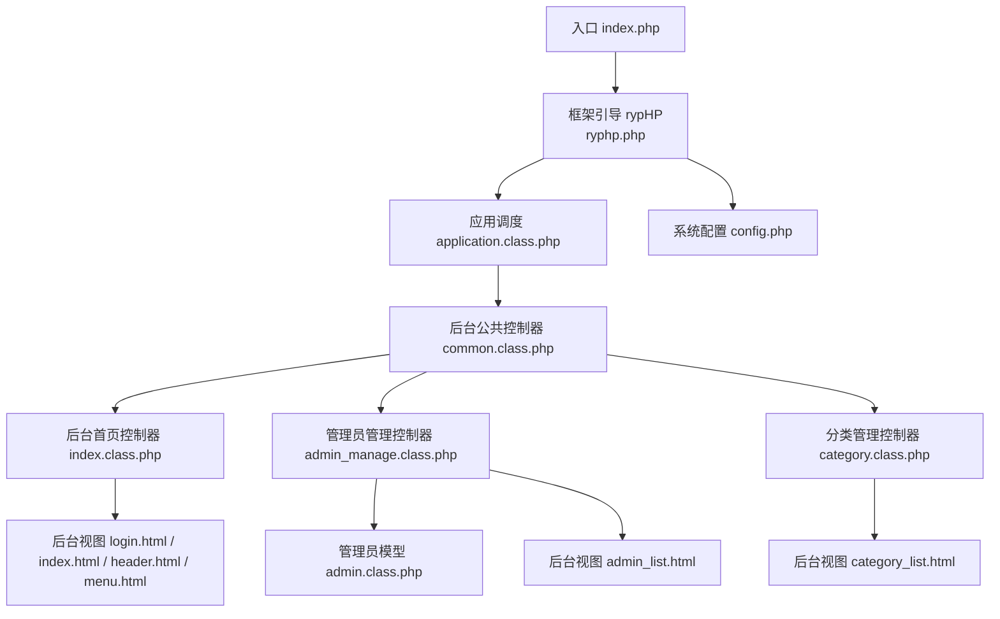
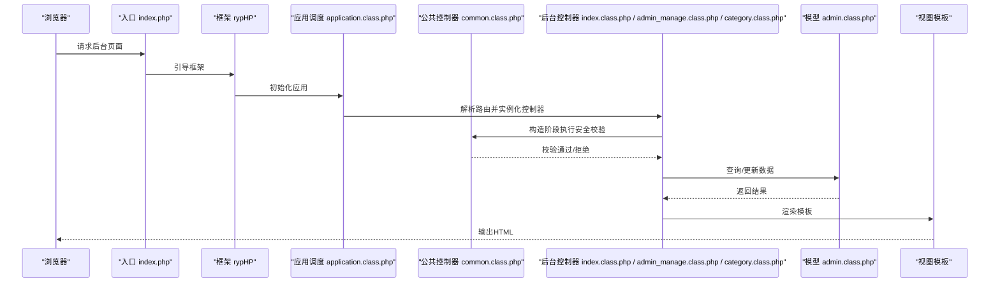
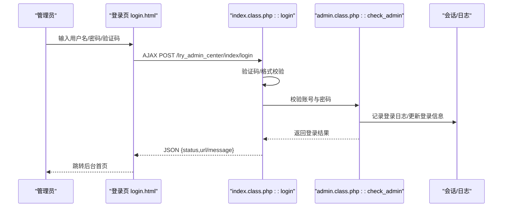
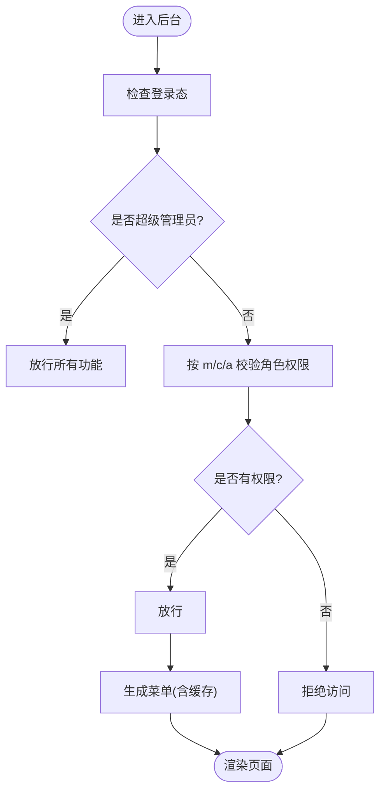
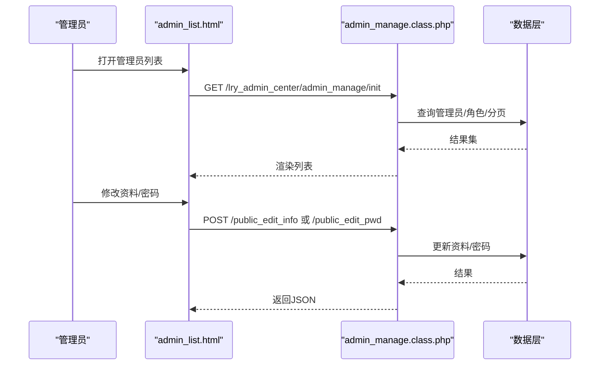
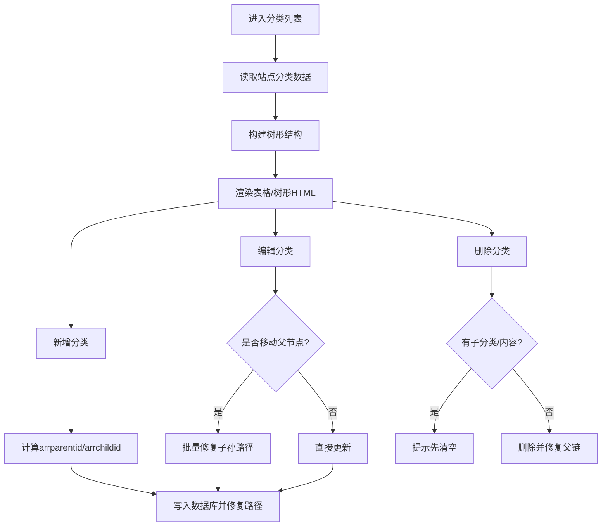
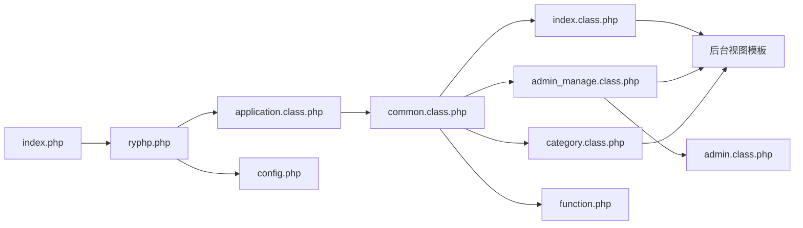

# 后台管理模块

<cite>
**本文引用的文件**
- [index.php](file://index.php)
- [ryphp.php](file://ryphp/ryphp.php)
- [application.class.php](file://ryphp/core/class/application.class.php)
- [common.class.php](file://application/lry_admin_center/controller/common.class.php)
- [index.class.php](file://application/lry_admin_center/controller/index.class.php)
- [admin_manage.class.php](file://application/lry_admin_center/controller/admin_manage.class.php)
- [category.class.php](file://application/lry_admin_center/controller/category.class.php)
- [admin.class.php](file://application/lry_admin_center/model/admin.class.php)
- [function.php](file://application/lry_admin_center/common/function/function.php)
- [login.html](file://application/lry_admin_center/view/login.html)
- [index.html](file://application/lry_admin_center/view/index.html)
- [header.html](file://application/lry_admin_center/view/header.html)
- [menu.html](file://application/lry_admin_center/view/menu.html)
- [admin_list.html](file://application/lry_admin_center/view/admin_list.html)
- [category_list.html](file://application/lry_admin_center/view/category_list.html)
- [config.php](file://common/config/config.php)
</cite>

## 目录
1. [简介](#简介)
2. [项目结构](#项目结构)
3. [核心组件](#核心组件)
4. [架构总览](#架构总览)
5. [详细组件分析](#详细组件分析)
6. [依赖关系分析](#依赖关系分析)
7. [性能考量](#性能考量)
8. [故障排除指南](#故障排除指南)
9. [结论](#结论)
10. [附录](#附录)

## 简介
本文件面向LRYBlog后台管理模块，系统性阐述其整体架构与设计理念，覆盖管理员登录验证、权限控制、内容管理（文章、分类、用户、系统配置）、模板系统、数据处理流程、安全机制与扩展开发指南，并提供实际操作案例与故障排除建议。目标读者既包括技术开发者，也包括需要理解后台工作原理的运营与管理人员。

## 项目结构
后台模块位于 application/lry_admin_center 目录，采用典型的 MVC 架构：
- 控制器：application/lry_admin_center/controller/*.class.php
- 模型：application/lry_admin_center/model/*.class.php
- 视图：application/lry_admin_center/view/*.html
- 通用函数：application/lry_admin_center/common/function/*.php
- 入口与框架：index.php、ryphp/ryphp.php、ryphp/core/class/application.class.php

**图表来源**
- [index.php:1-18](file://index.php#L1-L18)
- [ryphp.php:83-204](file://ryphp/ryphp.php#L83-L204)
- [application.class.php:4-118](file://ryphp/core/class/application.class.php#L4-L118)
- [common.class.php:1-153](file://application/lry_admin_center/controller/common.class.php#L1-L153)
- [index.class.php:1-162](file://application/lry_admin_center/controller/index.class.php#L1-L162)
- [admin_manage.class.php:1-105](file://application/lry_admin_center/controller/admin_manage.class.php#L1-L105)
- [category.class.php:1-580](file://application/lry_admin_center/controller/category.class.php#L1-L580)
- [admin.class.php:1-96](file://application/lry_admin_center/model/admin.class.php#L1-L96)
- [login.html:1-98](file://application/lry_admin_center/view/login.html#L1-L98)
- [index.html:1-112](file://application/lry_admin_center/view/index.html#L1-L112)
- [header.html:1-51](file://application/lry_admin_center/view/header.html#L1-L51)
- [menu.html:1-8](file://application/lry_admin_center/view/menu.html#L1-L8)
- [admin_list.html:1-138](file://application/lry_admin_center/view/admin_list.html#L1-L138)
- [category_list.html:1-116](file://application/lry_admin_center/view/category_list.html#L1-L116)
- [config.php:1-88](file://common/config/config.php#L1-L88)

**章节来源**
- [index.php:1-18](file://index.php#L1-L18)
- [ryphp.php:83-204](file://ryphp/ryphp.php#L83-L204)
- [application.class.php:4-118](file://ryphp/core/class/application.class.php#L4-L118)
- [config.php:1-88](file://common/config/config.php#L1-L88)

## 核心组件
- 框架入口与调度
  - 入口文件负责定义系统常量、加载框架并启动应用调度。
  - 应用调度解析路由，加载对应控制器并执行动作方法。
- 后台公共控制器
  - 统一处理登录态校验、权限校验、IP白/黑名单、Token校验、锁屏、日志记录等。
- 登录与首页控制器
  - 提供登录、退出、锁屏/解锁、错误日志清理、首页统计等能力。
- 管理员管理控制器
  - 管理员列表、搜索、角色变更；个人资料与密码修改。
- 分类管理控制器
  - 树形分类列表、增删改、批量添加、排序、模板选择、域名绑定等。
- 管理员模型
  - 登录校验、账户锁定策略、登录日志记录、会话与Cookie设置。
- 通用函数库
  - 菜单生成、配置文件写入、升级包下载与解压等。
- 视图模板
  - 登录页、后台主页、头部导航、侧边菜单、管理员列表、分类列表等。

**章节来源**
- [application.class.php:24-65](file://ryphp/core/class/application.class.php#L24-L65)
- [common.class.php:32-131](file://application/lry_admin_center/controller/common.class.php#L32-L131)
- [index.class.php:19-109](file://application/lry_admin_center/controller/index.class.php#L19-L109)
- [admin_manage.class.php:11-104](file://application/lry_admin_center/controller/admin_manage.class.php#L11-L104)
- [category.class.php:27-134](file://application/lry_admin_center/controller/category.class.php#L27-L134)
- [admin.class.php:4-95](file://application/lry_admin_center/model/admin.class.php#L4-L95)
- [function.php:35-80](file://application/lry_admin_center/common/function/function.php#L35-L80)
- [login.html:14-95](file://application/lry_admin_center/view/login.html#L14-L95)
- [index.html:7-110](file://application/lry_admin_center/view/index.html#L7-L110)
- [header.html:21-35](file://application/lry_admin_center/view/header.html#L21-L35)
- [menu.html:4-7](file://application/lry_admin_center/view/menu.html#L4-L7)
- [admin_list.html:8-96](file://application/lry_admin_center/view/admin_list.html#L8-L96)
- [category_list.html:16-44](file://application/lry_admin_center/view/category_list.html#L16-L44)

## 架构总览
后台模块遵循“入口 -> 框架 -> 路由 -> 控制器 -> 模型/视图”的标准流程。公共控制器在构造阶段完成统一安全校验，确保只有合法管理员才能进入后台功能。控制器通过D函数访问数据层，通过admin_tpl方法定位视图模板，最终渲染页面。

**图表来源**
- [index.php:14-18](file://index.php#L14-L18)
- [ryphp.php:88-90](file://ryphp/ryphp.php#L88-L90)
- [application.class.php:24-40](file://ryphp/core/class/application.class.php#L24-L40)
- [common.class.php:8-18](file://application/lry_admin_center/controller/common.class.php#L8-L18)
- [index.class.php:6-13](file://application/lry_admin_center/controller/index.class.php#L6-L13)
- [admin_manage.class.php:6-44](file://application/lry_admin_center/controller/admin_manage.class.php#L6-L44)
- [category.class.php:4-10](file://application/lry_admin_center/controller/category.class.php#L4-L10)
- [admin.class.php:4-27](file://application/lry_admin_center/model/admin.class.php#L4-L27)

## 详细组件分析

### 登录与会话安全
- 登录流程
  - 前端提交用户名、密码、验证码，AJAX调用登录接口。
  - 控制器校验验证码、用户名/密码格式，调用模型校验账号与密码。
  - 成功后写入会话与Cookie，记录登录日志，返回JSON并跳转首页。
- 账户锁定策略
  - 模型根据错误次数与最近一次失败时间计算锁定时长，超过阈值则提示等待分钟数。
- 会话与Token
  - 公共控制器在POST请求中校验lry_sey_token，防止CSRF。
  - 支持锁屏/解锁，锁屏状态下仅允许解锁或登录相关动作。

**图表来源**
- [login.html:57-94](file://application/lry_admin_center/view/login.html#L57-L94)
- [index.class.php:19-38](file://application/lry_admin_center/controller/index.class.php#L19-L38)
- [admin.class.php:4-95](file://application/lry_admin_center/model/admin.class.php#L4-L95)

**章节来源**
- [index.class.php:19-38](file://application/lry_admin_center/controller/index.class.php#L19-L38)
- [admin.class.php:4-95](file://application/lry_admin_center/model/admin.class.php#L4-L95)
- [common.class.php:126-131](file://application/lry_admin_center/controller/common.class.php#L126-L131)
- [login.html:14-95](file://application/lry_admin_center/view/login.html#L14-L95)

### 权限控制与菜单
- 权限判定
  - 超级管理员（roleid=1）拥有全部权限。
  - 普通管理员按角色授权表逐项校验，未授权动作直接拒绝。
  - 公共方法（public_*）与登录页放行。
- 菜单生成
  - 从菜单表读取一级与二级菜单，结合角色过滤，生成左侧菜单HTML。
  - 菜单HTML带缓存，减少重复查询。

**图表来源**
- [common.class.php:56-62](file://application/lry_admin_center/controller/common.class.php#L56-L62)
- [function.php:35-80](file://application/lry_admin_center/common/function/function.php#L35-L80)

**章节来源**
- [common.class.php:56-62](file://application/lry_admin_center/controller/common.class.php#L56-L62)
- [function.php:35-80](file://application/lry_admin_center/common/function/function.php#L35-L80)

### 管理员管理
- 功能点
  - 管理员列表：支持按角色、时间范围、多种字段搜索，分页展示。
  - 个人资料修改：校验邮箱格式，更新实名、昵称、邮箱并刷新会话信息。
  - 修改密码：校验旧密码、新密码格式，更新后记录日志并销毁会话。
- 安全要点
  - 密码更新后强制退出，确保凭据生效。
  - 所有敏感操作均记录后台日志（可配置开关）。

**图表来源**
- [admin_list.html:8-96](file://application/lry_admin_center/view/admin_list.html#L8-L96)
- [admin_manage.class.php:11-104](file://application/lry_admin_center/controller/admin_manage.class.php#L11-L104)

**章节来源**
- [admin_manage.class.php:11-104](file://application/lry_admin_center/controller/admin_manage.class.php#L11-L104)
- [admin_list.html:8-96](file://application/lry_admin_center/view/admin_list.html#L8-L96)

### 分类管理
- 树形分类展示
  - 读取当前站点分类，构建树形结构，支持展开/折叠状态持久化（Cookie）。
  - 为每个节点生成操作按钮（添加子类、编辑、删除），并标注类型与模板信息。
- 新增/编辑/删除
  - 新增支持普通栏目、单页、外部链接三类；自动计算arrparentid/arrchildid，修复父子路径。
  - 编辑支持移动到其他父节点，批量修正子孙路径；支持域名绑定与链接生成。
  - 删除前校验无子分类与内容，避免破坏性操作。
- 模板选择
  - 根据模型别名动态列出可用模板，支持频道页、列表页、详情页模板选择。

**图表来源**
- [category.class.php:27-134](file://application/lry_admin_center/controller/category.class.php#L27-L134)
- [category_list.html:16-44](file://application/lry_admin_center/view/category_list.html#L16-L44)

**章节来源**
- [category.class.php:27-134](file://application/lry_admin_center/controller/category.class.php#L27-L134)
- [category_list.html:16-44](file://application/lry_admin_center/view/category_list.html#L16-L44)

### 后台模板系统
- 模板组织
  - 顶部导航 header.html、左侧菜单 menu.html、登录页 login.html、后台主页 index.html、各业务页（如管理员列表、分类列表）。
- 布局与交互
  - index.html整合header、menu、iframe内容区，支持标签页、锁屏/解锁、站点切换、清除缓存等。
  - 登录页通过AJAX提交，验证码动态刷新，登录成功跳转后台首页。
- 表单处理
  - 管理员列表页支持搜索、排序、批量变更角色；分类列表页支持树形展开/折叠、批量添加、排序提交。

**章节来源**
- [header.html:1-51](file://application/lry_admin_center/view/header.html#L1-L51)
- [menu.html:1-8](file://application/lry_admin_center/view/menu.html#L1-L8)
- [login.html:1-98](file://application/lry_admin_center/view/login.html#L1-L98)
- [index.html:1-112](file://application/lry_admin_center/view/index.html#L1-L112)
- [admin_list.html:1-138](file://application/lry_admin_center/view/admin_list.html#L1-L138)
- [category_list.html:1-116](file://application/lry_admin_center/view/category_list.html#L1-L116)

### 数据处理流程
- 登录与权限
  - 登录校验 -> 账户锁定策略 -> 成功写入会话/日志 -> Token校验 -> 菜单生成。
- 管理员管理
  - 列表查询/筛选 -> 分页 -> 表单提交 -> 更新资料/密码 -> 记录日志 -> 强制退出。
- 分类管理
  - 读取/构建树 -> 展示/操作 -> 新增/编辑/删除 -> 修复路径 -> 清理缓存。
- 系统配置
  - 通过通用函数写入配置文件，支持在线升级包下载与解压。

**章节来源**
- [admin.class.php:4-95](file://application/lry_admin_center/model/admin.class.php#L4-L95)
- [common.class.php:69-82](file://application/lry_admin_center/controller/common.class.php#L69-L82)
- [admin_manage.class.php:49-104](file://application/lry_admin_center/controller/admin_manage.class.php#L49-L104)
- [category.class.php:463-492](file://application/lry_admin_center/controller/category.class.php#L463-L492)
- [function.php:89-102](file://application/lry_admin_center/common/function/function.php#L89-L102)

### 安全机制
- 身份验证
  - 登录态校验、Cookie一致性检查、Referer来源校验（部分场景）。
- 权限控制
  - 角色授权表逐项校验，超级管理员豁免。
- CSRF防护
  - POST请求必须携带lry_sey_token，公共方法与登录页放行。
- IP限制
  - 支持后台禁止登录IP名单，命中即拒绝访问。
- 日志审计
  - 可选记录后台操作日志，便于追踪与审计。

**章节来源**
- [common.class.php:32-50](file://application/lry_admin_center/controller/common.class.php#L32-L50)
- [common.class.php:86-93](file://application/lry_admin_center/controller/common.class.php#L86-L93)
- [common.class.php:111-118](file://application/lry_admin_center/controller/common.class.php#L111-L118)
- [common.class.php:126-131](file://application/lry_admin_center/controller/common.class.php#L126-L131)

### 扩展开发指南
- 新增后台功能步骤
  - 创建控制器：在 application/lry_admin_center/controller 下新增 *.class.php，继承 common。
  - 实现动作方法：在控制器中编写 init/add/edit/delete 等动作。
  - 设计视图：在 application/lry_admin_center/view 下新增 *.html，复用 header/menu 等布局。
  - 权限配置：在角色授权表中为相应角色授予 m/c/a 权限。
  - 数据访问：使用 D('表名') 访问数据层，注意字段校验与异常处理。
- 界面定制
  - 复用现有CSS/JS资源，或在 lry_admin_center/lry_admin 下新增样式与脚本。
  - 菜单可在菜单表中配置，配合角色过滤生效。
- 安全最佳实践
  - 所有POST请求均需Token校验；涉及敏感操作务必记录日志。
  - 对外链接与域名绑定需谨慎，避免SEO与安全风险。

**章节来源**
- [common.class.php:139-144](file://application/lry_admin_center/controller/common.class.php#L139-L144)
- [function.php:35-80](file://application/lry_admin_center/common/function/function.php#L35-L80)

## 依赖关系分析
- 入口与框架
  - index.php 依赖 rypHP 引导，application.class.php 负责路由与控制器加载。
- 控制器依赖
  - common.class.php 作为基类，被所有后台控制器继承，统一安全与模板路径。
  - index.class.php、admin_manage.class.php、category.class.php 分别承担首页、管理员、分类管理。
- 模型与视图
  - admin.class.php 提供登录与会话管理；各控制器通过 admin_tpl 定位视图。
- 配置与通用函数
  - config.php 提供系统配置；function.php 提供菜单与配置写入等工具。

**图表来源**
- [index.php:14-18](file://index.php#L14-L18)
- [ryphp.php:88-90](file://ryphp/ryphp.php#L88-L90)
- [application.class.php:24-40](file://ryphp/core/class/application.class.php#L24-L40)
- [common.class.php:1-19](file://application/lry_admin_center/controller/common.class.php#L1-L19)
- [index.class.php:1-13](file://application/lry_admin_center/controller/index.class.php#L1-L13)
- [admin_manage.class.php:1-6](file://application/lry_admin_center/controller/admin_manage.class.php#L1-L6)
- [category.class.php:1-4](file://application/lry_admin_center/controller/category.class.php#L1-L4)
- [admin.class.php:1-2](file://application/lry_admin_center/model/admin.class.php#L1-L2)
- [config.php:1-12](file://common/config/config.php#L1-L12)
- [function.php:1-1](file://application/lry_admin_center/common/function/function.php#L1-L1)

**章节来源**
- [index.php:14-18](file://index.php#L14-L18)
- [ryphp.php:88-90](file://ryphp/ryphp.php#L88-L90)
- [application.class.php:24-40](file://ryphp/core/class/application.class.php#L24-L40)
- [common.class.php:1-19](file://application/lry_admin_center/controller/common.class.php#L1-L19)

## 性能考量
- 菜单缓存
  - 菜单HTML生成后写入缓存，降低重复查询与拼装成本。
- 分页与索引
  - 列表查询使用分页与合理WHERE条件，避免全表扫描。
- 模板渲染
  - 视图模板尽量复用公共布局，减少重复DOM结构。
- 缓存清理
  - 分类变更后及时清理相关缓存，避免脏数据影响展示。

**章节来源**
- [function.php:56-79](file://application/lry_admin_center/common/function/function.php#L56-L79)
- [category.class.php:463-468](file://application/lry_admin_center/controller/category.class.php#L463-L468)

## 故障排除指南
- 登录失败
  - 检查验证码是否正确、用户名/密码格式是否符合要求。
  - 查看账户是否因多次错误被锁定，等待相应分钟数后重试。
- 权限不足
  - 确认角色授权表中是否存在对应 m/c/a 权限；超级管理员不受限制。
- CSRF错误
  - 确认POST请求携带lry_sey_token且与会话一致；公共方法与登录页除外。
- IP被禁止
  - 检查系统配置中的后台禁止登录IP名单，确认当前IP是否命中。
- 分类删除失败
  - 确认分类下无子分类与内容；先删除子分类或转移内容后再删除。
- 模板不生效
  - 检查模板文件命名与模型别名是否匹配，确认模板存在于站点主题目录。

**章节来源**
- [index.class.php:19-38](file://application/lry_admin_center/controller/index.class.php#L19-L38)
- [admin.class.php:40-65](file://application/lry_admin_center/model/admin.class.php#L40-L65)
- [common.class.php:126-131](file://application/lry_admin_center/controller/common.class.php#L126-L131)
- [category.class.php:435-452](file://application/lry_admin_center/controller/category.class.php#L435-L452)
- [function.php:513-544](file://application/lry_admin_center/common/function/function.php#L513-L544)

## 结论
后台管理模块以RyPHP框架为基础，采用清晰的MVC分层与统一的安全校验机制，覆盖登录认证、权限控制、内容管理与模板渲染等关键能力。通过菜单缓存、分页查询与缓存清理等手段保障性能；通过Token校验、账户锁定与日志审计强化安全。扩展开发遵循“控制器-视图-权限-数据”的标准流程即可快速落地。

## 附录
- 实际操作案例
  - 管理员登录：在登录页输入用户名/密码/验证码，成功后进入后台首页。
  - 新增分类：选择类型（普通/单页/外部链接），填写必要字段，系统自动计算路径并生成链接。
  - 修改密码：在个人中心输入旧密码与新密码，提交后系统强制退出并要求重新登录。
- 常见问题速查
  - 登录被拒：检查验证码、账户锁定状态与IP限制。
  - 无法访问某功能：确认角色授权或是否为公共方法。
  - 分类树不显示：检查Cookie中树形展开状态与分类数据完整性。