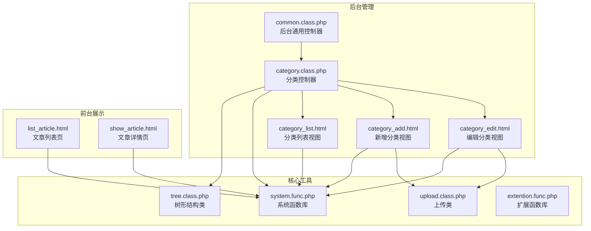
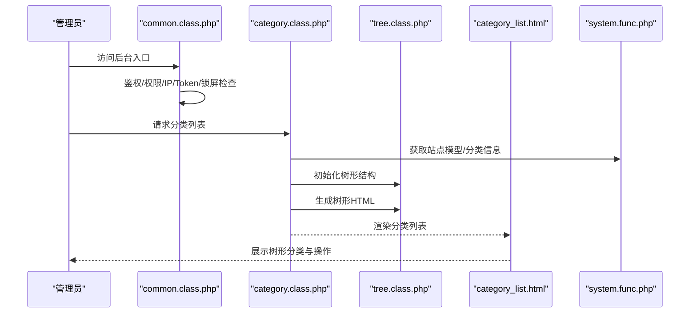
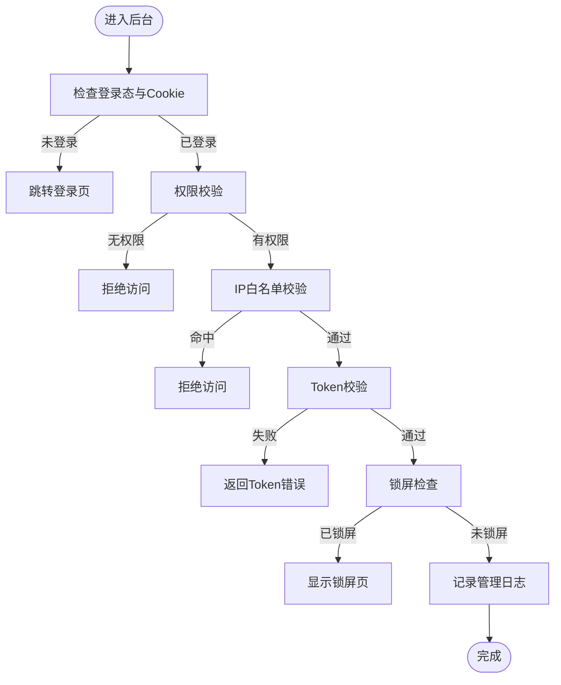
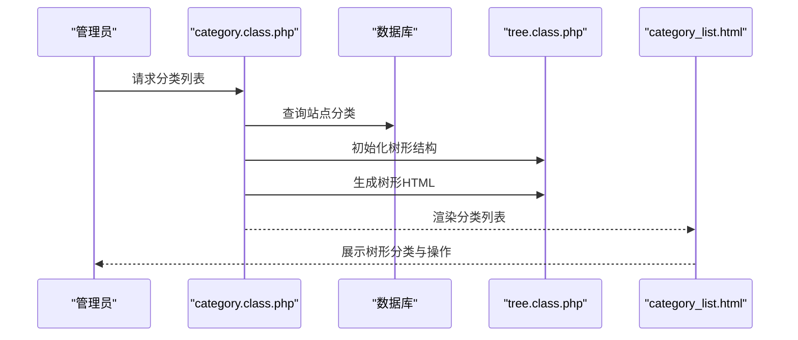
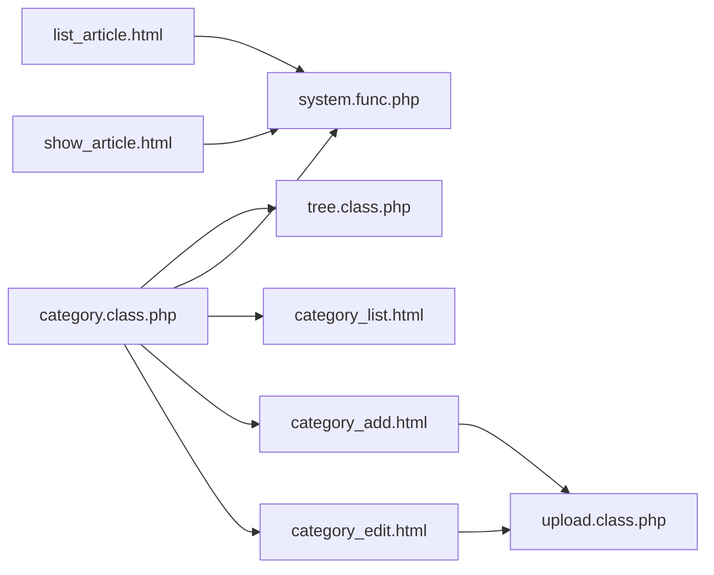

# 文章管理

<cite>
**本文引用的文件**
- [common.class.php](file://application/lry_admin_center/controller/common.class.php)
- [category.class.php](file://application/lry_admin_center/controller/category.class.php)
- [category_list.html](file://application/lry_admin_center/view/category_list.html)
- [category_add.html](file://application/lry_admin_center/view/category_add.html)
- [category_edit.html](file://application/lry_admin_center/view/category_edit.html)
- [list_article.html](file://application/index/view/rongyao/list_article.html)
- [show_article.html](file://application/index/view/rongyao/show_article.html)
- [tree.class.php](file://ryphp/core/class/tree.class.php)
- [upload.class.php](file://ryphp/core/class/upload.class.php)
- [system.func.php](file://common/function/system.func.php)
- [extention.func.php](file://common/function/extention.func.php)
</cite>

## 目录
1. [引言](#引言)
2. [项目结构](#项目结构)
3. [核心组件](#核心组件)
4. [架构总览](#架构总览)
5. [详细组件分析](#详细组件分析)
6. [依赖关系分析](#依赖关系分析)
7. [性能考量](#性能考量)
8. [故障排查指南](#故障排查指南)
9. [结论](#结论)
10. [附录](#附录)

## 引言
本技术文档围绕 LRYBlog 文章管理系统，聚焦“文章发布、编辑、删除与状态管理”的完整流程，系统性梳理后台控制器与前台视图的协作机制，深入解析文章数据验证、富文本内容处理与图片上传管理，阐述文章列表页面的搜索、筛选、排序与批量操作能力，并详解文章分类关联机制（多级分类选择与分类树形显示）、文章状态管理（草稿、发布、置顶等）及 SEO 优化（标题、描述、关键词）策略。同时提供最佳实践与性能优化建议，帮助开发者与运营人员高效、安全地维护内容生态。

## 项目结构
- 后台管理位于 application/lry_admin_center，包含控制器、模型与视图三层结构，采用 RyPHP 框架约定式开发。
- 前台展示位于 application/index/view/rongyao，包含文章列表与详情页模板，配合系统函数库实现 SEO 与内容渲染。
- 核心工具类位于 ryphp/core/class，如树形结构 tree.class.php 与上传 upload.class.php；系统函数库位于 common/function，提供 SEO、URL、附件、分类等通用能力。

图表来源
- [category.class.php:1-580](file://application/lry_admin_center/controller/category.class.php#L1-L580)
- [common.class.php:1-153](file://application/lry_admin_center/controller/common.class.php#L1-L153)
- [category_list.html:1-116](file://application/lry_admin_center/view/category_list.html#L1-L116)
- [category_add.html:1-329](file://application/lry_admin_center/view/category_add.html#L1-L329)
- [category_edit.html:1-308](file://application/lry_admin_center/view/category_edit.html#L1-L308)
- [list_article.html:1-150](file://application/index/view/rongyao/list_article.html#L1-L150)
- [show_article.html:1-518](file://application/index/view/rongyao/show_article.html#L1-L518)
- [tree.class.php:1-484](file://ryphp/core/class/tree.class.php#L1-L484)
- [upload.class.php:1-241](file://ryphp/core/class/upload.class.php#L1-L241)
- [system.func.php:1-969](file://common/function/system.func.php#L1-L969)
- [extention.func.php:1-95](file://common/function/extention.func.php#L1-L95)

章节来源
- [category.class.php:1-580](file://application/lry_admin_center/controller/category.class.php#L1-L580)
- [common.class.php:1-153](file://application/lry_admin_center/controller/common.class.php#L1-L153)
- [category_list.html:1-116](file://application/lry_admin_center/view/category_list.html#L1-L116)
- [category_add.html:1-329](file://application/lry_admin_center/view/category_add.html#L1-L329)
- [category_edit.html:1-308](file://application/lry_admin_center/view/category_edit.html#L1-L308)
- [list_article.html:1-150](file://application/index/view/rongyao/list_article.html#L1-L150)
- [show_article.html:1-518](file://application/index/view/rongyao/show_article.html#L1-L518)
- [tree.class.php:1-484](file://ryphp/core/class/tree.class.php#L1-L484)
- [upload.class.php:1-241](file://ryphp/core/class/upload.class.php#L1-L241)
- [system.func.php:1-969](file://common/function/system.func.php#L1-L969)
- [extention.func.php:1-95](file://common/function/extention.func.php#L1-L95)

## 核心组件
- 后台通用控制器 common.class.php：统一鉴权、权限校验、IP 白黑名单、Token 校验、锁屏保护、后台模板路径解析与系统信息输出。
- 分类控制器 category.class.php：负责分类的增删改查、树形结构渲染、URL 生成、模板选择、缓存清理与批量操作。
- 分类视图：category_list.html 展示树形分类与操作按钮；category_add.html 与 category_edit.html 提供表单与模板联动。
- 前台视图：list_article.html 实现文章列表页的 SEO、分页与侧边栏；show_article.html 实现文章详情页 SEO、评论与导航。
- 树形结构 tree.class.php：提供 get_tree/get_tree_category 等方法，支撑分类树形显示与下拉选择。
- 上传类 upload.class.php：封装文件上传、类型与大小校验、路径与 URL 生成。
- 系统函数库 system.func.php：提供 SEO、URL、分类、模型、附件、缓存等通用能力。
- 扩展函数库 extention.func.php：提供调试打印等辅助能力。

章节来源
- [common.class.php:1-153](file://application/lry_admin_center/controller/common.class.php#L1-L153)
- [category.class.php:1-580](file://application/lry_admin_center/controller/category.class.php#L1-L580)
- [category_list.html:1-116](file://application/lry_admin_center/view/category_list.html#L1-L116)
- [category_add.html:1-329](file://application/lry_admin_center/view/category_add.html#L1-L329)
- [category_edit.html:1-308](file://application/lry_admin_center/view/category_edit.html#L1-L308)
- [list_article.html:1-150](file://application/index/view/rongyao/list_article.html#L1-L150)
- [show_article.html:1-518](file://application/index/view/rongyao/show_article.html#L1-L518)
- [tree.class.php:1-484](file://ryphp/core/class/tree.class.php#L1-L484)
- [upload.class.php:1-241](file://ryphp/core/class/upload.class.php#L1-L241)
- [system.func.php:1-969](file://common/function/system.func.php#L1-L969)
- [extention.func.php:1-95](file://common/function/extention.func.php#L1-L95)

## 架构总览
后台通过 common.class.php 统一鉴权与安全校验，category.class.php 负责分类管理与树形渲染，结合 tree.class.php 生成 HTML 结构；表单视图（category_add.html、category_edit.html）与系统函数交互，实现模板联动与 SEO 字段填充；前台 list_article.html 与 show_article.html 通过 system.func.php 提供的 SEO、URL 与内容渲染能力，完成文章列表与详情展示。

图表来源
- [common.class.php:1-153](file://application/lry_admin_center/controller/common.class.php#L1-L153)
- [category.class.php:1-580](file://application/lry_admin_center/controller/category.class.php#L1-L580)
- [category_list.html:1-116](file://application/lry_admin_center/view/category_list.html#L1-L116)
- [tree.class.php:1-484](file://ryphp/core/class/tree.class.php#L1-L484)
- [system.func.php:1-969](file://common/function/system.func.php#L1-L969)

## 详细组件分析

### 后台通用控制器（common.class.php）
- 登录态与iframe防护：通过 session 与 cookie 校验，若不在顶层窗口则强制跳转顶层，防止被嵌套。
- 权限控制：基于路由与角色权限表校验，支持公开方法与超级管理员豁免。
- IP 白黑名单：读取配置，匹配当前 IP，命中则拒绝访问。
- Token 校验：POST 请求需携带 lry_sey_token，防 CSRF。
- 锁屏保护：开启锁屏后仅允许公共方法与登录页。
- 日志记录：除特定动作外，记录模块、控制器、管理员、请求参数、时间与 IP。
- 模板路径：admin_tpl 统一解析后台模板路径。

图表来源
- [common.class.php:1-153](file://application/lry_admin_center/controller/common.class.php#L1-L153)

章节来源
- [common.class.php:1-153](file://application/lry_admin_center/controller/common.class.php#L1-L153)

### 分类控制器（category.class.php）
- 分类列表 init：获取站点模型映射、读取 Cookie 控制树形展开状态、查询分类数据、生成树形 HTML、渲染视图。
- 新增分类 add：校验目录唯一性、处理父级 arrparentid、生成 pclink、单页类型写入 page 表、域名绑定、缓存清理。
- 批量新增 adds：逐条拆分输入，去重与去空，批量写入并生成链接。
- 编辑分类 edit：支持移动分类（批量更新子孙 arrparentid 路径）、生成新链接、单页类型同步更新、缓存修复与清理。
- 删除分类 delete：校验无子分类与无内容，删除后修复父级 arrchildid 并清理缓存。
- 模板联动：根据模型动态选择频道/列表/内容模板，支持域名绑定与 URL 生成。
- 排序 order：批量更新 listorder 并清理缓存。
- 缓存管理：delcache 清理分类相关缓存；repair/get_arrchildid 修复父子关系。

图表来源
- [category.class.php:1-580](file://application/lry_admin_center/controller/category.class.php#L1-L580)
- [category_list.html:1-116](file://application/lry_admin_center/view/category_list.html#L1-L116)
- [tree.class.php:1-484](file://ryphp/core/class/tree.class.php#L1-L484)

章节来源
- [category.class.php:1-580](file://application/lry_admin_center/controller/category.class.php#L1-L580)
- [category_list.html:1-116](file://application/lry_admin_center/view/category_list.html#L1-L116)
- [tree.class.php:1-484](file://ryphp/core/class/tree.class.php#L1-L484)

### 分类视图（category_list.html）
- 提供“添加栏目/单页/外部链接/批量添加”入口。
- 展示排序、ID、名称、类型、模型、链接、导航显示、允许投稿、操作列。
- JS 支持树形展开/收起、Cookie 记录展开状态、批量排序提交。

章节来源
- [category_list.html:1-116](file://application/lry_admin_center/view/category_list.html#L1-L116)

### 分类表单视图（category_add.html / category_edit.html）
- 基本选项：模型选择、上级分类（select_category）、栏目名称、英文目录、图片、打开方式、导航显示。
- 模板设置：频道/列表/内容模板联动选择，模板命名规则提示。
- SEO 设置：栏目标题、关键词、描述。
- 其他设置：英文标题、副标题、移动端名称、绑定域名、排序、允许投稿。
- 表单校验：目录正则、模板必选、域名格式校验、AJAX 提交与提示。

章节来源
- [category_add.html:1-329](file://application/lry_admin_center/view/category_add.html#L1-L329)
- [category_edit.html:1-308](file://application/lry_admin_center/view/category_edit.html#L1-L308)

### 前台文章列表与详情（list_article.html / show_article.html）
- 列表页 list_article.html：注入 SEO 标题、关键词、描述；调用 lists 标签渲染文章列表；分页与侧边栏。
- 详情页 show_article.html：注入 SEO 标题、关键词、描述；渲染文章标题、作者、时间、点击量、摘要与正文；标签与原文链接展示；评论区与相关推荐。

章节来源
- [list_article.html:1-150](file://application/index/view/rongyao/list_article.html#L1-L150)
- [show_article.html:1-518](file://application/index/view/rongyao/show_article.html#L1-L518)

### 树形结构类（tree.class.php）
- 提供 get_tree/get_tree_category 等方法，支持 icon、nbsp、模板变量安全替换、缓存优化与数组 iconv 兼容。
- 用于分类树形渲染与 select_category 下拉生成。

章节来源
- [tree.class.php:1-484](file://ryphp/core/class/tree.class.php#L1-L484)

### 上传类（upload.class.php）
- 封装上传路径、类型与大小校验、随机文件名生成、移动文件与错误码处理。
- 与分类表单中的图片上传联动，生成文件 URL 与路径信息。

章节来源
- [upload.class.php:1-241](file://ryphp/core/class/upload.class.php#L1-L241)

### 系统函数库（system.func.php）
- SEO：get_seo_suffix、get_site_seo、get_content_url。
- 分类：get_category、get_catname、get_childcat、get_location、select_category。
- 模型：get_model、get_default_model、get_modelinfo。
- 附件：down_remote_img、update_attachment、delete_attachment。
- 缓存：getcache/setcache。
- URL 规则与映射：get_urlrule、set_mapping。

章节来源
- [system.func.php:1-969](file://common/function/system.func.php#L1-L969)

### 扩展函数库（extention.func.php）
- 提供调试打印能力（Printarraylry/Palry），便于开发调试。

章节来源
- [extention.func.php:1-95](file://common/function/extention.func.php#L1-L95)

## 依赖关系分析
- 分类控制器依赖树形结构类与系统函数库，用于生成树形 HTML 与分类信息查询。
- 分类视图依赖系统函数库提供的 select_category 与 URL 生成。
- 前台视图依赖系统函数库提供的 SEO 注入与内容渲染标签。
- 上传类与分类表单联动，提供图片上传能力。

图表来源
- [category.class.php:1-580](file://application/lry_admin_center/controller/category.class.php#L1-L580)
- [tree.class.php:1-484](file://ryphp/core/class/tree.class.php#L1-L484)
- [system.func.php:1-969](file://common/function/system.func.php#L1-L969)
- [upload.class.php:1-241](file://ryphp/core/class/upload.class.php#L1-L241)
- [category_list.html:1-116](file://application/lry_admin_center/view/category_list.html#L1-L116)
- [category_add.html:1-329](file://application/lry_admin_center/view/category_add.html#L1-L329)
- [category_edit.html:1-308](file://application/lry_admin_center/view/category_edit.html#L1-L308)
- [list_article.html:1-150](file://application/index/view/rongyao/list_article.html#L1-L150)
- [show_article.html:1-518](file://application/index/view/rongyao/show_article.html#L1-L518)

章节来源
- [category.class.php:1-580](file://application/lry_admin_center/controller/category.class.php#L1-L580)
- [tree.class.php:1-484](file://ryphp/core/class/tree.class.php#L1-L484)
- [system.func.php:1-969](file://common/function/system.func.php#L1-L969)
- [upload.class.php:1-241](file://ryphp/core/class/upload.class.php#L1-L241)
- [category_list.html:1-116](file://application/lry_admin_center/view/category_list.html#L1-L116)
- [category_add.html:1-329](file://application/lry_admin_center/view/category_add.html#L1-L329)
- [category_edit.html:1-308](file://application/lry_admin_center/view/category_edit.html#L1-L308)
- [list_article.html:1-150](file://application/index/view/rongyao/list_article.html#L1-L150)
- [show_article.html:1-518](file://application/index/view/rongyao/show_article.html#L1-L518)

## 性能考量
- 树形渲染缓存：tree.class.php 内置缓存数组，避免重复查询，建议在高并发场景下配合 Redis/文件缓存进一步优化。
- 分类信息缓存：system.func.php 对分类信息与模型信息进行缓存，减少数据库压力；分类变更后及时清理缓存（category.class.php 中的 delcache）。
- URL 生成与映射：set_mapping 与 get_urlrule 提前生成映射规则，降低运行时解析成本。
- 上传路径与权限：upload.class.php 自动创建上传目录并校验写权限，建议将上传目录置于独立磁盘并设置合理权限。
- 前台模板：list_article.html 与 show_article.html 使用预加载与延迟加载策略，减少首屏阻塞。

[本节为通用指导，不直接分析具体文件]

## 故障排查指南
- 登录态异常：检查 common.class.php 的登录态与 Cookie 校验逻辑，确认 session 与 cookie 是否一致。
- 权限不足：核对路由与角色权限表，确认权限是否正确授予。
- IP 被拒绝：检查配置中的 admin_prohibit_ip，确认当前 IP 是否命中。
- Token 错误：确认 POST 请求携带 lry_sey_token，且与服务端一致。
- 锁屏状态：若开启锁屏，仅允许公共方法与登录页访问。
- 分类树不显示：检查 category_list.html 的 Cookie 展开状态与 JS 逻辑；确认 tree.class.php 的 icon 与 nbsp 设置。
- 图片上传失败：检查 upload.class.php 的路径创建与权限，确认允许类型与大小限制。
- SEO 未生效：确认 list_article.html 与 show_article.html 中的 SEO 注入逻辑，检查 system.func.php 的 get_site_seo 与 get_content_url。

章节来源
- [common.class.php:1-153](file://application/lry_admin_center/controller/common.class.php#L1-L153)
- [category_list.html:1-116](file://application/lry_admin_center/view/category_list.html#L1-L116)
- [upload.class.php:1-241](file://ryphp/core/class/upload.class.php#L1-L241)
- [system.func.php:1-969](file://common/function/system.func.php#L1-L969)

## 结论
LRYBlog 的文章管理以“后台通用控制器 + 分类控制器 + 树形结构 + 系统函数库 + 前台模板”为核心，形成清晰的职责边界与稳定的扩展点。通过严格的后台安全校验、完善的分类树形管理、灵活的模板联动与 SEO 注入，系统实现了从内容创建到前台展示的全链路闭环。建议在生产环境中强化缓存策略、完善上传安全与权限控制，并持续优化树形渲染与 URL 映射性能，以满足更高并发与更复杂内容场景的需求。

[本节为总结性内容，不直接分析具体文件]

## 附录
- 文章发布、编辑、删除与状态管理流程概览
  - 发布：在分类下新增内容（由分类 add 逻辑生成链接与模板），系统根据模型与模板生成内容页 URL。
  - 编辑：通过分类 edit 支持移动分类与批量修复路径，确保父子关系正确；SEO 字段可在表单中更新。
  - 删除：删除前校验无子分类与无内容，避免破坏性操作。
  - 状态管理：通过 display/allow 投稿等字段控制前台展示与投稿权限；可通过批量排序与模板选择影响 SEO 与展示效果。

章节来源
- [category.class.php:1-580](file://application/lry_admin_center/controller/category.class.php#L1-L580)
- [category_add.html:1-329](file://application/lry_admin_center/view/category_add.html#L1-L329)
- [category_edit.html:1-308](file://application/lry_admin_center/view/category_edit.html#L1-L308)
- [list_article.html:1-150](file://application/index/view/rongyao/list_article.html#L1-L150)
- [show_article.html:1-518](file://application/index/view/rongyao/show_article.html#L1-L518)