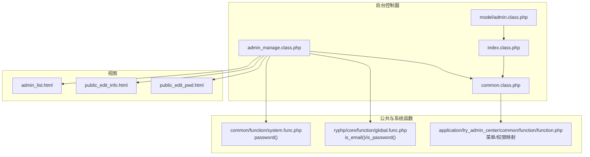
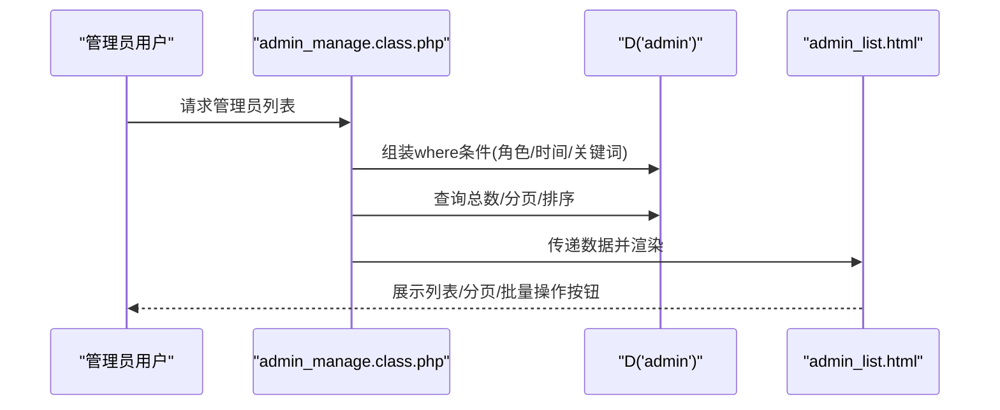
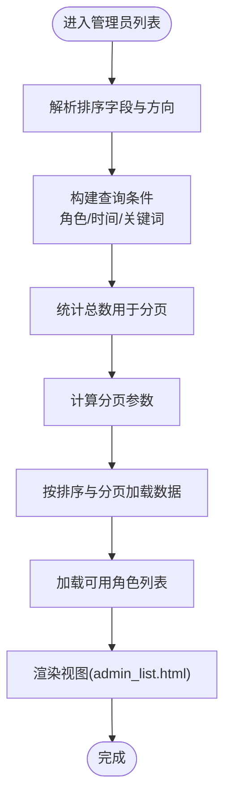
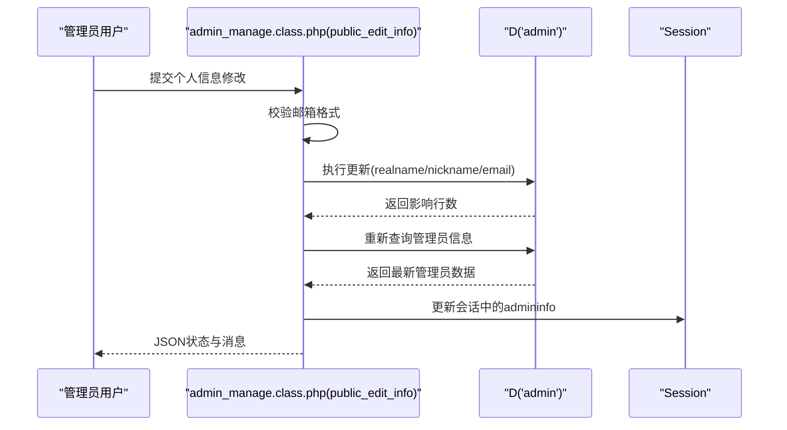
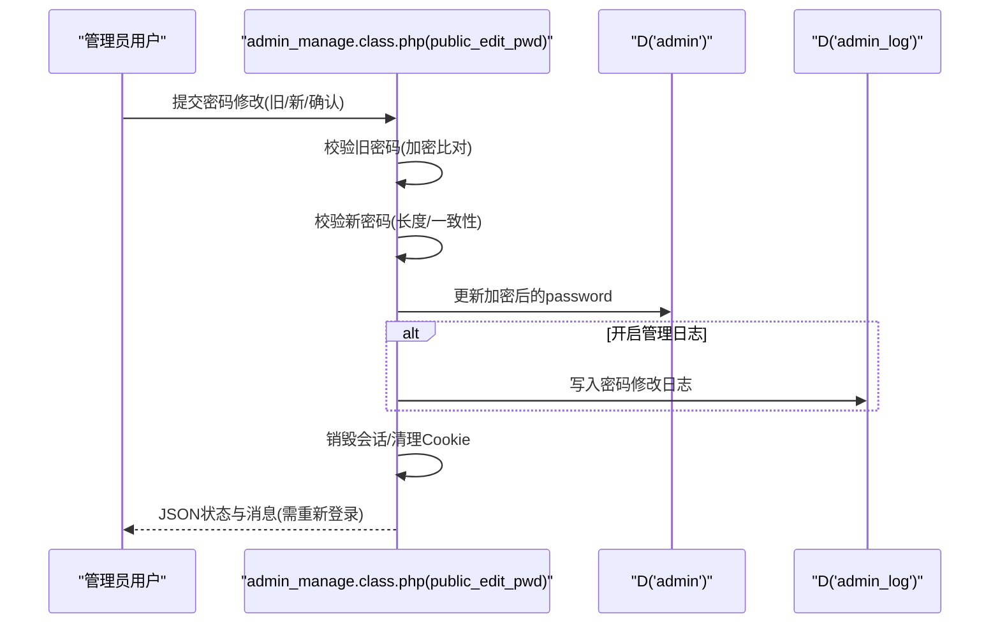
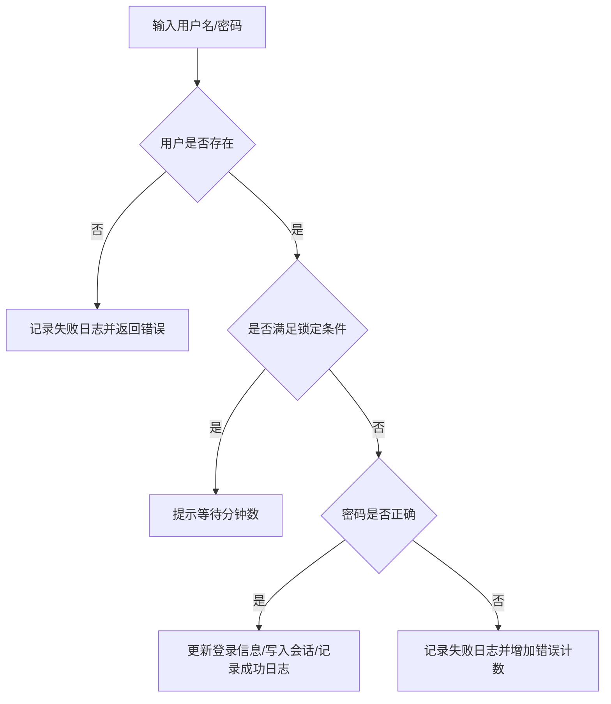
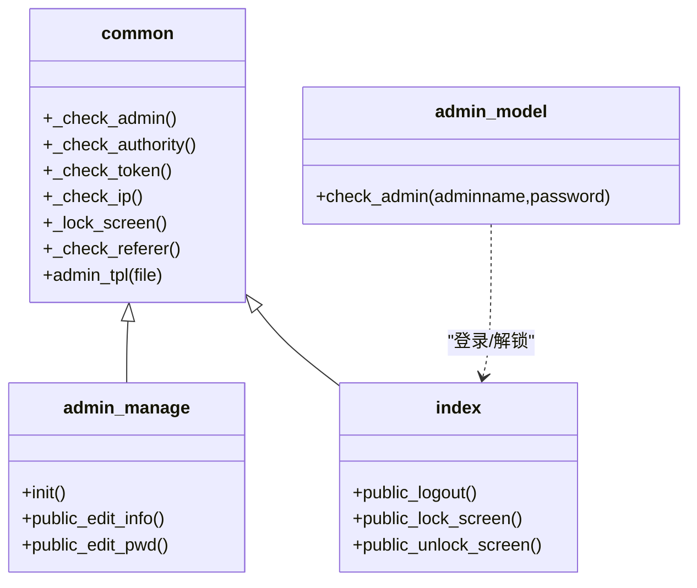
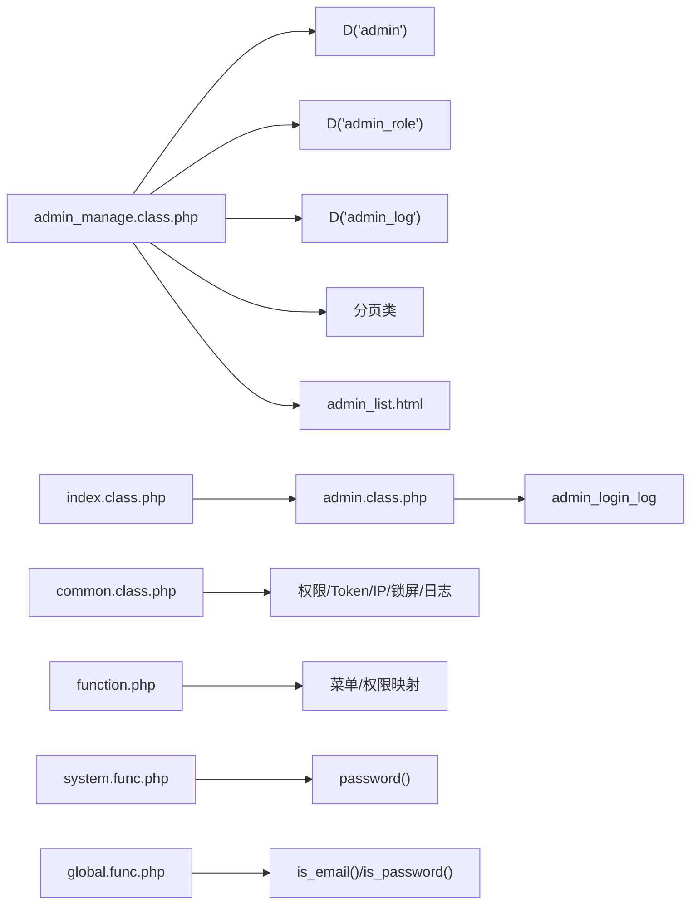

# 管理员管理

<cite>
**本文引用的文件**
- [application/lry_admin_center/controller/admin_manage.class.php](file://application/lry_admin_center/controller/admin_manage.class.php)
- [application/lry_admin_center/controller/common.class.php](file://application/lry_admin_center/controller/common.class.php)
- [application/lry_admin_center/controller/index.class.php](file://application/lry_admin_center/controller/index.class.php)
- [application/lry_admin_center/model/admin.class.php](file://application/lry_admin_center/model/admin.class.php)
- [application/lry_admin_center/view/admin_list.html](file://application/lry_admin_center/view/admin_list.html)
- [application/lry_admin_center/view/public_edit_info.html](file://application/lry_admin_center/view/public_edit_info.html)
- [application/lry_admin_center/view/public_edit_pwd.html](file://application/lry_admin_center/view/public_edit_pwd.html)
- [application/lry_admin_center/common/function/function.php](file://application/lry_admin_center/common/function/function.php)
- [common/function/system.func.php](file://common/function/system.func.php)
- [ryphp/core/function/global.func.php](file://ryphp/core/function/global.func.php)
</cite>

## 目录
1. [简介](#简介)
2. [项目结构](#项目结构)
3. [核心组件](#核心组件)
4. [架构总览](#架构总览)
5. [详细组件分析](#详细组件分析)
6. [依赖关系分析](#依赖关系分析)
7. [性能考量](#性能考量)
8. [故障排查指南](#故障排查指南)
9. [结论](#结论)
10. [附录](#附录)

## 简介
本技术文档聚焦于 LRYBlog 后台“管理员管理”模块，系统性解析管理员账户的创建、编辑、删除与权限管理实现机制；深入分析 admin_manage.class.php 控制器中的管理员 CRUD 流程、信息验证、密码加密与权限分配逻辑；说明管理员列表页面的展示、筛选、排序与批量操作；阐述个人信息与密码修改的安全实现与防护；并总结权限系统设计原理与访问控制机制。文末提供使用示例与常见问题解决方案。

## 项目结构
管理员管理相关代码主要分布在以下位置：
- 控制器：application/lry_admin_center/controller/admin_manage.class.php（管理员列表、个人信息与密码修改）
- 基类与鉴权：application/lry_admin_center/controller/common.class.php（登录态、权限、Token、IP、锁屏、日志）
- 登录与会话：application/lry_admin_center/controller/index.class.php（登录、登出、锁屏/解锁）
- 模型：application/lry_admin_center/model/admin.class.php（登录校验、账户锁定策略、会话写入）
- 视图：application/lry_admin_center/view/*.html（列表、个人信息、密码修改页面）
- 公共函数：application/lry_admin_center/common/function/function.php（菜单与权限映射）
- 系统函数：common/function/system.func.php（密码加密）、ryphp/core/function/global.func.php（邮箱/密码格式校验）

图表来源
- [application/lry_admin_center/controller/admin_manage.class.php:1-105](file://application/lry_admin_center/controller/admin_manage.class.php#L1-L105)
- [application/lry_admin_center/controller/common.class.php:1-153](file://application/lry_admin_center/controller/common.class.php#L1-L153)
- [application/lry_admin_center/controller/index.class.php:20-84](file://application/lry_admin_center/controller/index.class.php#L20-L84)
- [application/lry_admin_center/model/admin.class.php:1-96](file://application/lry_admin_center/model/admin.class.php#L1-L96)
- [application/lry_admin_center/view/admin_list.html:1-138](file://application/lry_admin_center/view/admin_list.html#L1-L138)
- [application/lry_admin_center/view/public_edit_info.html:1-50](file://application/lry_admin_center/view/public_edit_info.html#L1-L50)
- [application/lry_admin_center/view/public_edit_pwd.html:1-113](file://application/lry_admin_center/view/public_edit_pwd.html#L1-L113)
- [application/lry_admin_center/common/function/function.php:35-80](file://application/lry_admin_center/common/function/function.php#L35-L80)
- [common/function/system.func.php:963-966](file://common/function/system.func.php#L963-L966)
- [ryphp/core/function/global.func.php:937-1007](file://ryphp/core/function/global.func.php#L937-L1007)

章节来源
- [application/lry_admin_center/controller/admin_manage.class.php:1-105](file://application/lry_admin_center/controller/admin_manage.class.php#L1-L105)
- [application/lry_admin_center/controller/common.class.php:1-153](file://application/lry_admin_center/controller/common.class.php#L1-L153)
- [application/lry_admin_center/controller/index.class.php:20-84](file://application/lry_admin_center/controller/index.class.php#L20-L84)
- [application/lry_admin_center/model/admin.class.php:1-96](file://application/lry_admin_center/model/admin.class.php#L1-L96)
- [application/lry_admin_center/view/admin_list.html:1-138](file://application/lry_admin_center/view/admin_list.html#L1-L138)
- [application/lry_admin_center/view/public_edit_info.html:1-50](file://application/lry_admin_center/view/public_edit_info.html#L1-L50)
- [application/lry_admin_center/view/public_edit_pwd.html:1-113](file://application/lry_admin_center/view/public_edit_pwd.html#L1-L113)
- [application/lry_admin_center/common/function/function.php:35-80](file://application/lry_admin_center/common/function/function.php#L35-L80)
- [common/function/system.func.php:963-966](file://common/function/system.func.php#L963-L966)
- [ryphp/core/function/global.func.php:937-1007](file://ryphp/core/function/global.func.php#L937-L1007)

## 核心组件
- 管理员列表控制器：负责查询、筛选、排序、分页、角色联动与批量操作入口
- 个人信息与密码修改控制器：负责个人资料更新与密码修改流程
- 登录与会话模型：负责登录校验、账户锁定策略、会话写入与日志记录
- 权限与鉴权基类：统一处理登录态、权限、Token、IP白/黑名单、锁屏、来源校验与管理日志
- 视图层：列表页、个人信息页、密码修改页，配合前端 JS 实现交互与表单校验
- 公共函数：菜单生成与权限映射，支持按角色过滤菜单项

章节来源
- [application/lry_admin_center/controller/admin_manage.class.php:11-44](file://application/lry_admin_center/controller/admin_manage.class.php#L11-L44)
- [application/lry_admin_center/controller/admin_manage.class.php:49-104](file://application/lry_admin_center/controller/admin_manage.class.php#L49-L104)
- [application/lry_admin_center/model/admin.class.php:4-95](file://application/lry_admin_center/model/admin.class.php#L4-L95)
- [application/lry_admin_center/controller/common.class.php:56-131](file://application/lry_admin_center/controller/common.class.php#L56-L131)
- [application/lry_admin_center/common/function/function.php:35-80](file://application/lry_admin_center/common/function/function.php#L35-L80)

## 架构总览
管理员管理采用 MVC 架构：
- 控制器接收请求，组装查询条件，调用模型与数据访问层，渲染视图
- 模型封装登录与账户状态逻辑，提供会话写入与日志记录
- 视图负责展示与交互，结合 JS 完成表单提交与批量操作
- 基类统一进行登录态、权限、Token、IP、锁屏与日志等横切关注点

图表来源
- [application/lry_admin_center/controller/admin_manage.class.php:11-44](file://application/lry_admin_center/controller/admin_manage.class.php#L11-L44)
- [application/lry_admin_center/view/admin_list.html:64-91](file://application/lry_admin_center/view/admin_list.html#L64-L91)

## 详细组件分析

### 管理员列表与筛选排序
- 查询参数与安全过滤：支持按字段排序（adminid/adminname/realname/email/roleid/addtime/logintime/loginip/adpeople）与方向（ASC/DESC），默认按 ID 降序
- 筛选条件：支持角色筛选、时间范围筛选、关键词类型（用户名/邮箱/真实姓名/添加人）与内容
- 数据加载：查询总数用于分页，按排序与分页限制获取列表，同时拉取可用角色列表用于筛选与批量变更角色
- 视图渲染：展示管理员基本信息、角色、登录时间/IP、添加人等，并提供编辑/删除入口与批量变更角色按钮

图表来源
- [application/lry_admin_center/controller/admin_manage.class.php:11-44](file://application/lry_admin_center/controller/admin_manage.class.php#L11-L44)
- [application/lry_admin_center/view/admin_list.html:8-32](file://application/lry_admin_center/view/admin_list.html#L8-L32)

章节来源
- [application/lry_admin_center/controller/admin_manage.class.php:11-44](file://application/lry_admin_center/controller/admin_manage.class.php#L11-L44)
- [application/lry_admin_center/view/admin_list.html:64-91](file://application/lry_admin_center/view/admin_list.html#L64-L91)

### 个人信息修改（AJAX）
- 会话校验：仅允许已登录管理员提交
- 表单校验：邮箱格式校验，非空即校验格式
- 更新逻辑：更新真实姓名、昵称、邮箱，成功后刷新会话中的管理员信息
- 返回结果：JSON 格式状态与消息，前端弹窗提示并可关闭弹窗

图表来源
- [application/lry_admin_center/controller/admin_manage.class.php:49-64](file://application/lry_admin_center/controller/admin_manage.class.php#L49-L64)
- [application/lry_admin_center/view/public_edit_info.html:27-47](file://application/lry_admin_center/view/public_edit_info.html#L27-L47)

章节来源
- [application/lry_admin_center/controller/admin_manage.class.php:49-64](file://application/lry_admin_center/controller/admin_manage.class.php#L49-L64)
- [application/lry_admin_center/view/public_edit_info.html:1-50](file://application/lry_admin_center/view/public_edit_info.html#L1-L50)

### 密码修改（AJAX）
- 旧密码校验：必须提供旧密码，且与数据库中加密后的密码一致
- 新密码校验：长度 6-20 位，两次输入一致，前端 JS 强度提示
- 加密存储：使用系统密码加密函数对新密码进行加密后入库
- 安全处理：开启管理日志时记录日志；无论是否记录均销毁会话并清理 Cookie，要求重新登录
- 返回结果：JSON 状态与消息，前端提示并刷新页面

图表来源
- [application/lry_admin_center/controller/admin_manage.class.php:70-104](file://application/lry_admin_center/controller/admin_manage.class.php#L70-L104)
- [common/function/system.func.php:963-966](file://common/function/system.func.php#L963-L966)
- [ryphp/core/function/global.func.php:1002-1007](file://ryphp/core/function/global.func.php#L1002-L1007)

章节来源
- [application/lry_admin_center/controller/admin_manage.class.php:70-104](file://application/lry_admin_center/controller/admin_manage.class.php#L70-L104)
- [common/function/system.func.php:963-966](file://common/function/system.func.php#L963-L966)
- [ryphp/core/function/global.func.php:1002-1007](file://ryphp/core/function/global.func.php#L1002-L1007)
- [application/lry_admin_center/view/public_edit_pwd.html:35-110](file://application/lry_admin_center/view/public_edit_pwd.html#L35-L110)

### 登录与会话模型（登录校验与账户锁定）
- 用户名存在性校验：不存在则记录失败日志并返回错误
- 账户锁定策略：根据错误次数与最近一次失败时间计算锁定时长（多级限制）
- 成功登录：更新登录 IP/时间/错误计数清零，写入会话与 Cookie，并记录成功日志
- 失败登录：记录失败日志并累加错误计数（超过阈值清零）

图表来源
- [application/lry_admin_center/model/admin.class.php:4-95](file://application/lry_admin_center/model/admin.class.php#L4-L95)

章节来源
- [application/lry_admin_center/model/admin.class.php:4-95](file://application/lry_admin_center/model/admin.class.php#L4-L95)

### 权限系统与访问控制
- 登录态与来源校验：未登录或跨框架嵌套场景强制跳转登录
- 角色权限：超级管理员（roleid==1）放行；公开方法（public_ 前缀）放行；其他路由按 m/c/a 与 roleid 查询权限表进行校验
- Token 防护：POST 请求需携带有效 Token，否则拒绝
- IP 白/黑名单：可配置禁止登录 IP，命中即拒绝
- 锁屏与来源校验：锁屏状态下仅允许公开方法与登录相关方法；来源校验防止跨站请求
- 菜单与权限映射：按角色过滤菜单，确保仅显示有权限的菜单项

图表来源
- [application/lry_admin_center/controller/common.class.php:56-131](file://application/lry_admin_center/controller/common.class.php#L56-L131)
- [application/lry_admin_center/controller/admin_manage.class.php:11-104](file://application/lry_admin_center/controller/admin_manage.class.php#L11-L104)
- [application/lry_admin_center/controller/index.class.php:56-84](file://application/lry_admin_center/controller/index.class.php#L56-L84)
- [application/lry_admin_center/model/admin.class.php:4-95](file://application/lry_admin_center/model/admin.class.php#L4-L95)

章节来源
- [application/lry_admin_center/controller/common.class.php:56-131](file://application/lry_admin_center/controller/common.class.php#L56-L131)
- [application/lry_admin_center/common/function/function.php:35-80](file://application/lry_admin_center/common/function/function.php#L35-L80)

## 依赖关系分析
- 控制器依赖：
  - admin_manage.class.php 依赖 D('admin')、D('admin_role')、D('admin_log')、分页类、语言包与视图模板
  - common.class.php 提供统一鉴权、Token、IP、锁屏与日志
  - index.class.php 提供登录、登出、锁屏/解锁与首页统计
  - admin.class.php 提供登录校验与账户锁定策略
- 视图依赖：
  - admin_list.html 依赖 field_order 辅助与 laydate 时间选择器
  - public_edit_info.html 与 public_edit_pwd.html 依赖 jQuery 与 layer 弹窗
- 公共函数依赖：
  - system.func.php 的 password() 用于加密
  - global.func.php 的 is_email()/is_password() 用于格式校验
  - function.php 的 get_menu_list() 用于菜单与权限映射

图表来源
- [application/lry_admin_center/controller/admin_manage.class.php:37-43](file://application/lry_admin_center/controller/admin_manage.class.php#L37-L43)
- [application/lry_admin_center/controller/common.class.php:56-131](file://application/lry_admin_center/controller/common.class.php#L56-L131)
- [application/lry_admin_center/controller/index.class.php:20-84](file://application/lry_admin_center/controller/index.class.php#L20-L84)
- [application/lry_admin_center/model/admin.class.php:4-95](file://application/lry_admin_center/model/admin.class.php#L4-L95)
- [application/lry_admin_center/common/function/function.php:35-80](file://application/lry_admin_center/common/function/function.php#L35-L80)
- [common/function/system.func.php:963-966](file://common/function/system.func.php#L963-L966)
- [ryphp/core/function/global.func.php:937-1007](file://ryphp/core/function/global.func.php#L937-L1007)

章节来源
- [application/lry_admin_center/controller/admin_manage.class.php:37-43](file://application/lry_admin_center/controller/admin_manage.class.php#L37-L43)
- [application/lry_admin_center/controller/common.class.php:56-131](file://application/lry_admin_center/controller/common.class.php#L56-L131)
- [application/lry_admin_center/controller/index.class.php:20-84](file://application/lry_admin_center/controller/index.class.php#L20-L84)
- [application/lry_admin_center/model/admin.class.php:4-95](file://application/lry_admin_center/model/admin.class.php#L4-L95)
- [application/lry_admin_center/common/function/function.php:35-80](file://application/lry_admin_center/common/function/function.php#L35-L80)
- [common/function/system.func.php:963-966](file://common/function/system.func.php#L963-L966)
- [ryphp/core/function/global.func.php:937-1007](file://ryphp/core/function/global.func.php#L937-L1007)

## 性能考量
- 列表查询：建议在常用筛选字段（如 addtime、roleid、adminname）建立索引，避免全表扫描
- 分页：每页固定大小（15），合理设置总记录数统计，避免大偏移量导致的慢查询
- 角色下拉：限制返回数量（100），避免角色过多造成页面渲染压力
- 登录日志：频繁失败可能产生大量写入，建议定期归档或限制保留周期
- 前端交互：列表页使用 AJAX 与分页控件，减少整页刷新带来的带宽与 CPU 开销

## 故障排查指南
- 登录失败/频繁被锁定
  - 检查账户错误次数与最近失败时间是否触发锁定策略
  - 确认登录日志中“原因”字段定位具体原因
- 密码修改失败
  - 确认旧密码正确且新密码长度与格式符合要求
  - 若开启管理日志，检查日志记录是否正常
- 个人信息更新无效
  - 确认邮箱格式正确
  - 检查会话是否成功刷新（前端提示后应重新登录以获取最新信息）
- 权限不足/无法访问
  - 确认当前角色是否为超级管理员或具备对应 m/c/a 权限
  - 检查 Token 是否随 POST 请求提交
  - 检查是否命中禁止登录 IP 或来源校验失败
- 列表为空或筛选无结果
  - 检查筛选条件（角色/时间/关键词）是否正确
  - 确认排序字段与方向是否合法

章节来源
- [application/lry_admin_center/model/admin.class.php:40-65](file://application/lry_admin_center/model/admin.class.php#L40-L65)
- [application/lry_admin_center/controller/admin_manage.class.php:70-104](file://application/lry_admin_center/controller/admin_manage.class.php#L70-L104)
- [application/lry_admin_center/controller/common.class.php:56-131](file://application/lry_admin_center/controller/common.class.php#L56-L131)
- [application/lry_admin_center/view/admin_list.html:8-32](file://application/lry_admin_center/view/admin_list.html#L8-L32)

## 结论
管理员管理模块通过清晰的 MVC 分层与统一的鉴权基类，实现了管理员列表、个人信息与密码修改等核心功能。登录模型内置账户锁定策略，增强安全性；权限系统基于角色与路由进行细粒度控制；前端交互与后端校验相结合，保障了用户体验与系统安全。建议在生产环境中进一步完善索引、日志归档与安全审计，持续提升性能与可观测性。

## 附录

### 使用示例
- 管理员列表
  - 访问后台“管理员管理/管理员列表”，可按角色、时间范围、关键词筛选，支持排序与分页
  - 支持批量变更角色：勾选多条记录后点击“变更角色”，选择目标角色并确认
- 修改个人信息
  - 进入“修改个人信息”页面，填写昵称、邮箱、真实姓名，提交后刷新会话信息
- 修改密码
  - 进入“修改密码”页面，输入旧密码与新密码（6-20 位且两次一致），提交后需重新登录

章节来源
- [application/lry_admin_center/view/admin_list.html:6-32](file://application/lry_admin_center/view/admin_list.html#L6-L32)
- [application/lry_admin_center/view/public_edit_info.html:7-22](file://application/lry_admin_center/view/public_edit_info.html#L7-L22)
- [application/lry_admin_center/view/public_edit_pwd.html:14-30](file://application/lry_admin_center/view/public_edit_pwd.html#L14-L30)