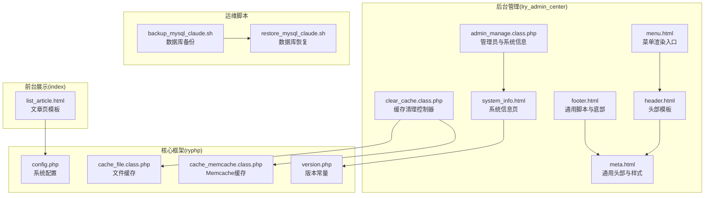
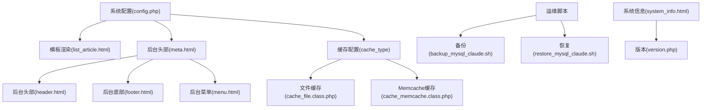
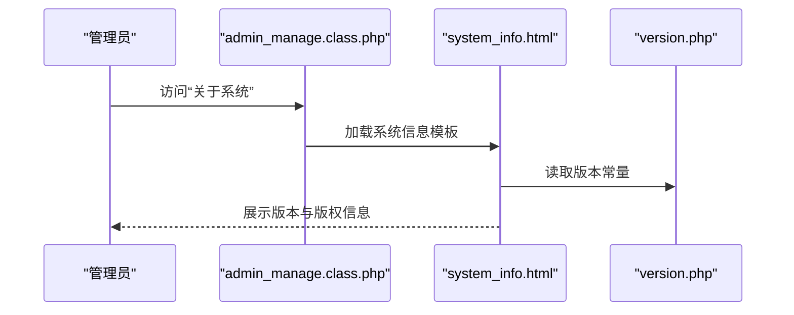
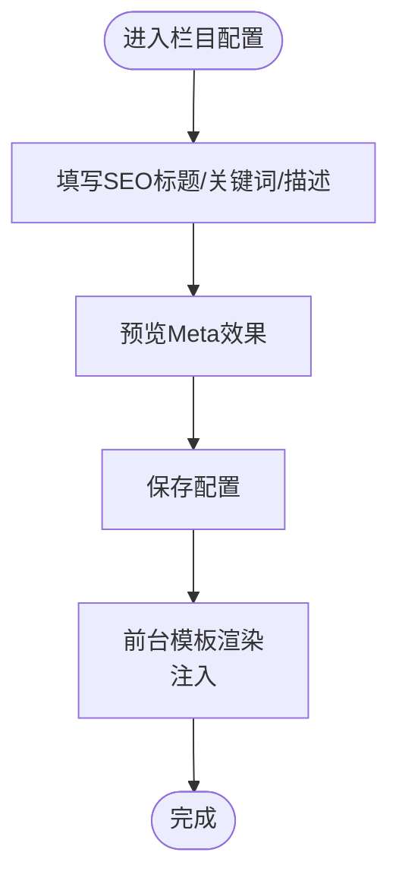
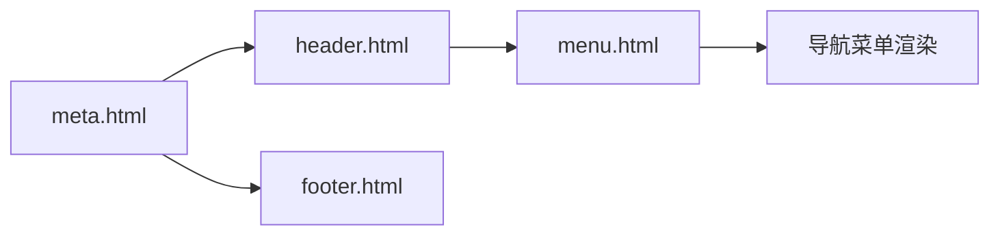
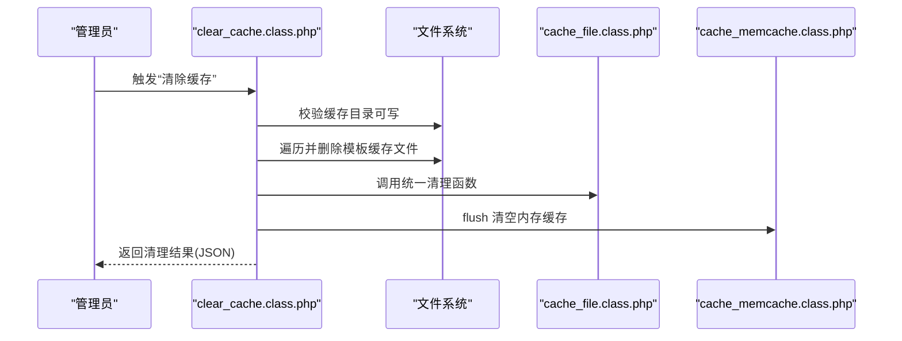
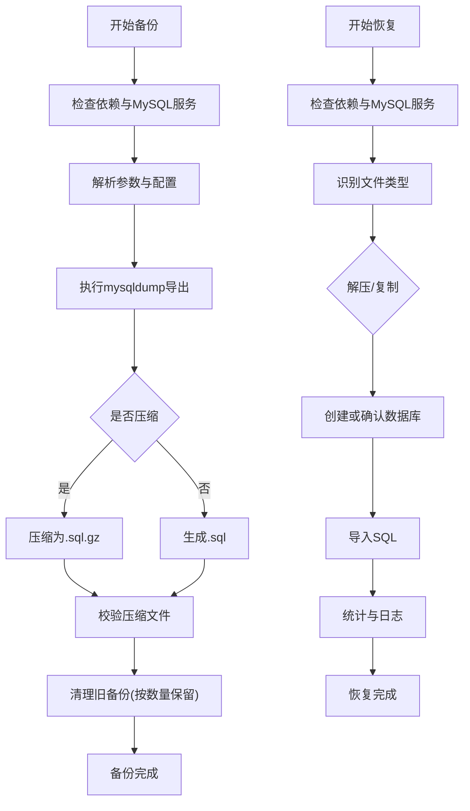
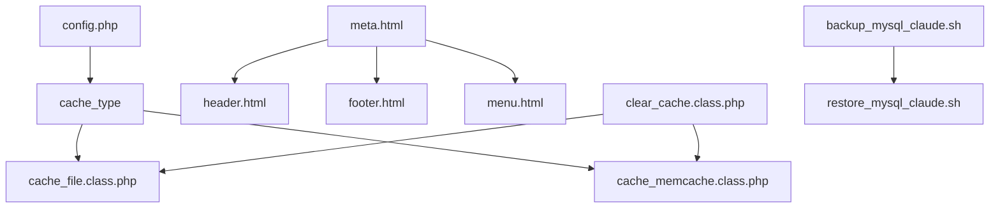

# 系统配置

<cite>
**本文引用的文件**
- [meta.html](file://application/lry_admin_center/view/meta.html)
- [system_info.html](file://application/lry_admin_center/view/system_info.html)
- [clear_cache.class.php](file://application/lry_admin_center/controller/clear_cache.class.php)
- [config.php](file://common/config/config.php)
- [header.html](file://application/lry_admin_center/view/header.html)
- [footer.html](file://application/lry_admin_center/view/footer.html)
- [menu.html](file://application/lry_admin_center/view/menu.html)
- [admin_manage.class.php](file://application/lry_admin_center/controller/admin_manage.class.php)
- [cache_file.class.php](file://ryphp/core/class/cache_file.class.php)
- [cache_memcache.class.php](file://ryphp/core/class/cache_memcache.class.php)
- [backup_mysql_claude.sh](file://backup_mysql_claude.sh)
- [restore_mysql_claude.sh](file://restore_mysql_claude.sh)
- [version.php](file://common/data/version.php)
- [list_article.html](file://application/index/view/rongyao/list_article.html)
- [category_page.html](file://application/lry_admin_center/view/category_page.html)
- [category_page_edit.html](file://application/lry_admin_center/view/category_page_edit.html)
- [category_add.html](file://application/lry_admin_center/view/category_add.html)
</cite>

## 目录
1. [简介](#简介)
2. [项目结构](#项目结构)
3. [核心组件](#核心组件)
4. [架构总览](#架构总览)
5. [详细组件分析](#详细组件分析)
6. [依赖关系分析](#依赖关系分析)
7. [性能考量](#性能考量)
8. [故障排查指南](#故障排查指南)
9. [结论](#结论)
10. [附录](#附录)

## 简介
本技术文档围绕 LRYBlog 系统的配置管理展开，重点覆盖以下方面：
- 系统基本信息配置与版本信息展示
- SEO 设置与 Meta 标签管理（网站标题、描述、关键词）
- 后台界面布局配置（头部模板、菜单、底部信息）
- 系统缓存清理（文件缓存与内存缓存）
- 系统备份与恢复（数据库备份与恢复流程）
- 最佳实践与安全建议

## 项目结构
LRYBlog 采用前后端分离的视图与控制器组织方式，后台管理界面由独立的 lry_admin_center 模块提供，前台展示由 index 模块负责；缓存与数据库等核心能力封装在 ryp_hp 框架中。

图表来源
- [meta.html:1-39](file://application/lry_admin_center/view/meta.html#L1-L39)
- [header.html:1-51](file://application/lry_admin_center/view/header.html#L1-L51)
- [footer.html:1-6](file://application/lry_admin_center/view/footer.html#L1-L6)
- [menu.html:1-8](file://application/lry_admin_center/view/menu.html#L1-L8)
- [clear_cache.class.php:1-25](file://application/lry_admin_center/controller/clear_cache.class.php#L1-L25)
- [admin_manage.class.php:1-105](file://application/lry_admin_center/controller/admin_manage.class.php#L1-L105)
- [system_info.html:1-40](file://application/lry_admin_center/view/system_info.html#L1-L40)
- [config.php:1-88](file://common/config/config.php#L1-L88)
- [cache_file.class.php:1-130](file://ryphp/core/class/cache_file.class.php#L1-L130)
- [cache_memcache.class.php:1-91](file://ryphp/core/class/cache_memcache.class.php#L1-L91)
- [version.php:1-4](file://common/data/version.php#L1-L4)
- [list_article.html:1-34](file://application/index/view/rongyao/list_article.html#L1-L34)
- [backup_mysql_claude.sh:1-392](file://backup_mysql_claude.sh#L1-L392)
- [restore_mysql_claude.sh:1-412](file://restore_mysql_claude.sh#L1-L412)

章节来源
- [meta.html:1-39](file://application/lry_admin_center/view/meta.html#L1-L39)
- [header.html:1-51](file://application/lry_admin_center/view/header.html#L1-L51)
- [footer.html:1-6](file://application/lry_admin_center/view/footer.html#L1-L6)
- [menu.html:1-8](file://application/lry_admin_center/view/menu.html#L1-L8)
- [clear_cache.class.php:1-25](file://application/lry_admin_center/controller/clear_cache.class.php#L1-L25)
- [admin_manage.class.php:1-105](file://application/lry_admin_center/controller/admin_manage.class.php#L1-L105)
- [system_info.html:1-40](file://application/lry_admin_center/view/system_info.html#L1-L40)
- [config.php:1-88](file://common/config/config.php#L1-L88)
- [cache_file.class.php:1-130](file://ryphp/core/class/cache_file.class.php#L1-L130)
- [cache_memcache.class.php:1-91](file://ryphp/core/class/cache_memcache.class.php#L1-L91)
- [version.php:1-4](file://common/data/version.php#L1-L4)
- [list_article.html:1-34](file://application/index/view/rongyao/list_article.html#L1-L34)
- [backup_mysql_claude.sh:1-392](file://backup_mysql_claude.sh#L1-L392)
- [restore_mysql_claude.sh:1-412](file://restore_mysql_claude.sh#L1-L412)

## 核心组件
- 系统配置中心：集中于系统配置数组，涵盖数据库、缓存、Cookie、路由、附件、语言等关键项。
- 后台布局：头部、菜单、底部模板统一管理，便于风格切换与功能入口整合。
- 缓存体系：支持文件缓存与 Memcache 两种实现，提供清理与刷新能力。
- 备份与恢复：提供数据库备份与恢复脚本，支持压缩与非压缩格式，具备日志与清理策略。
- SEO 与 Meta：前台模板与后台栏目配置共同决定页面 Meta 标签的最终呈现。

章节来源
- [config.php:1-88](file://common/config/config.php#L1-L88)
- [meta.html:1-39](file://application/lry_admin_center/view/meta.html#L1-L39)
- [header.html:1-51](file://application/lry_admin_center/view/header.html#L1-L51)
- [footer.html:1-6](file://application/lry_admin_center/view/footer.html#L1-L6)
- [menu.html:1-8](file://application/lry_admin_center/view/menu.html#L1-L8)
- [cache_file.class.php:1-130](file://ryphp/core/class/cache_file.class.php#L1-L130)
- [cache_memcache.class.php:1-91](file://ryphp/core/class/cache_memcache.class.php#L1-L91)
- [backup_mysql_claude.sh:1-392](file://backup_mysql_claude.sh#L1-L392)
- [restore_mysql_claude.sh:1-412](file://restore_mysql_claude.sh#L1-L412)
- [list_article.html:1-34](file://application/index/view/rongyao/list_article.html#L1-L34)

## 架构总览
系统配置管理贯穿“配置—渲染—缓存—备份”的闭环：
- 配置层：系统配置数组与版本常量提供全局参数。
- 视图层：后台 meta/header/footer/menu 与前台模板协同生成页面。
- 缓存层：文件缓存与 Memcache 提供高性能读取与清理接口。
- 运维层：备份与恢复脚本保障数据安全与可恢复性。

图表来源
- [config.php:1-88](file://common/config/config.php#L1-L88)
- [list_article.html:1-34](file://application/index/view/rongyao/list_article.html#L1-L34)
- [meta.html:1-39](file://application/lry_admin_center/view/meta.html#L1-L39)
- [header.html:1-51](file://application/lry_admin_center/view/header.html#L1-L51)
- [footer.html:1-6](file://application/lry_admin_center/view/footer.html#L1-L6)
- [menu.html:1-8](file://application/lry_admin_center/view/menu.html#L1-L8)
- [cache_file.class.php:1-130](file://ryphp/core/class/cache_file.class.php#L1-L130)
- [cache_memcache.class.php:1-91](file://ryphp/core/class/cache_memcache.class.php#L1-L91)
- [backup_mysql_claude.sh:1-392](file://backup_mysql_claude.sh#L1-L392)
- [restore_mysql_claude.sh:1-412](file://restore_mysql_claude.sh#L1-L412)
- [system_info.html:1-40](file://application/lry_admin_center/view/system_info.html#L1-L40)
- [version.php:1-4](file://common/data/version.php#L1-L4)

## 详细组件分析

### 系统基本信息与版本展示
- 版本信息：通过版本常量文件定义系统版本与更新标识，并在系统信息页展示。
- 系统信息页：整合系统版本、框架版本、官网、社区、作者信息等，便于运维与支持。
- 后台头部：统一注入静态资源与基础变量，确保各后台页面风格一致。

图表来源
- [admin_manage.class.php:1-105](file://application/lry_admin_center/controller/admin_manage.class.php#L1-L105)
- [system_info.html:1-40](file://application/lry_admin_center/view/system_info.html#L1-L40)
- [version.php:1-4](file://common/data/version.php#L1-L4)

章节来源
- [system_info.html:1-40](file://application/lry_admin_center/view/system_info.html#L1-L40)
- [version.php:1-4](file://common/data/version.php#L1-L4)
- [admin_manage.class.php:1-105](file://application/lry_admin_center/controller/admin_manage.class.php#L1-L105)

### SEO 设置与 Meta 标签管理
- 前台模板：文章页模板通过变量注入页面标题、关键词与描述，形成标准 Meta 结构。
- 后台栏目配置：栏目新增/编辑页提供 SEO 标题、关键词、描述等输入项，便于精细化 SEO 控制。
- 动态设置建议：
  - 标题：控制在 50-60 字符以内，突出品牌与核心信息。
  - 描述：控制在 120-160 字符，准确概括页面内容。
  - 关键词：精选 3-8 个核心词，避免堆砌。
  - 动态优先：优先使用页面内容动态生成 Meta，减少硬编码。

图表来源
- [category_page.html:69-100](file://application/lry_admin_center/view/category_page.html#L69-L100)
- [category_page_edit.html:72-91](file://application/lry_admin_center/view/category_page_edit.html#L72-L91)
- [category_add.html:121-151](file://application/lry_admin_center/view/category_add.html#L121-L151)
- [list_article.html:1-34](file://application/index/view/rongyao/list_article.html#L1-L34)

章节来源
- [list_article.html:1-34](file://application/index/view/rongyao/list_article.html#L1-L34)
- [category_page.html:69-100](file://application/lry_admin_center/view/category_page.html#L69-L100)
- [category_page_edit.html:72-91](file://application/lry_admin_center/view/category_page_edit.html#L72-L91)
- [category_add.html:121-151](file://application/lry_admin_center/view/category_add.html#L121-L151)

### 后台界面布局配置
- 头部模板：统一引入后台样式与图标字体，注入基础 JS 变量，保障跨页面一致性。
- 菜单配置：通过菜单入口调用通用函数渲染导航，支持站点切换与皮肤切换。
- 底部信息：统一加载 jQuery、Layer、H-ui 等脚本，提供表格包裹与提示增强。

图表来源
- [meta.html:1-39](file://application/lry_admin_center/view/meta.html#L1-L39)
- [header.html:1-51](file://application/lry_admin_center/view/header.html#L1-L51)
- [footer.html:1-6](file://application/lry_admin_center/view/footer.html#L1-L6)
- [menu.html:1-8](file://application/lry_admin_center/view/menu.html#L1-L8)

章节来源
- [meta.html:1-39](file://application/lry_admin_center/view/meta.html#L1-L39)
- [header.html:1-51](file://application/lry_admin_center/view/header.html#L1-L51)
- [footer.html:1-6](file://application/lry_admin_center/view/footer.html#L1-L6)
- [menu.html:1-8](file://application/lry_admin_center/view/menu.html#L1-L8)

### 系统缓存清理功能
- 文件缓存清理：遍历指定缓存目录下的模板缓存文件并删除，随后调用统一清理函数刷新缓存。
- 内存缓存清理：通过 Memcache 实现 flush 清空，适合生产环境快速释放内存占用。
- 权限与健壮性：清理前校验缓存目录可写，失败时返回 JSON 错误信息。

图表来源
- [clear_cache.class.php:1-25](file://application/lry_admin_center/controller/clear_cache.class.php#L1-L25)
- [cache_file.class.php:1-130](file://ryphp/core/class/cache_file.class.php#L1-L130)
- [cache_memcache.class.php:1-91](file://ryphp/core/class/cache_memcache.class.php#L1-L91)

章节来源
- [clear_cache.class.php:1-25](file://application/lry_admin_center/controller/clear_cache.class.php#L1-L25)
- [cache_file.class.php:1-130](file://ryphp/core/class/cache_file.class.php#L1-L130)
- [cache_memcache.class.php:1-91](file://ryphp/core/class/cache_memcache.class.php#L1-L91)

### 系统备份与恢复
- 备份脚本：支持全库与单库备份，可配置是否使用完整插入、压缩、扩展插入、单事务、触发器与存储过程等参数；自动清理旧备份并记录日志。
- 恢复脚本：支持压缩与非压缩备份文件，自动识别数据库名、验证文件完整性、可选择覆盖或删除重建；提供进度与统计信息。

图表来源
- [backup_mysql_claude.sh:1-392](file://backup_mysql_claude.sh#L1-L392)
- [restore_mysql_claude.sh:1-412](file://restore_mysql_claude.sh#L1-L412)

章节来源
- [backup_mysql_claude.sh:1-392](file://backup_mysql_claude.sh#L1-L392)
- [restore_mysql_claude.sh:1-412](file://restore_mysql_claude.sh#L1-L412)

## 依赖关系分析
- 配置依赖：系统配置数组被缓存与模板渲染共同依赖，决定缓存类型、数据库连接、上传与水印等行为。
- 视图依赖：后台 meta/header/footer/menu 作为公共模板被各后台页面 include，保证一致的头部与脚本加载。
- 缓存依赖：缓存清理控制器依赖具体缓存实现类，文件缓存与 Memcache 各自提供 set/get/delete/flush 能力。
- 运维依赖：备份与恢复脚本依赖系统工具链与 MySQL 配置文件，具备完善的日志与错误处理。

图表来源
- [config.php:1-88](file://common/config/config.php#L1-L88)
- [meta.html:1-39](file://application/lry_admin_center/view/meta.html#L1-L39)
- [header.html:1-51](file://application/lry_admin_center/view/header.html#L1-L51)
- [footer.html:1-6](file://application/lry_admin_center/view/footer.html#L1-L6)
- [menu.html:1-8](file://application/lry_admin_center/view/menu.html#L1-L8)
- [clear_cache.class.php:1-25](file://application/lry_admin_center/controller/clear_cache.class.php#L1-L25)
- [cache_file.class.php:1-130](file://ryphp/core/class/cache_file.class.php#L1-L130)
- [cache_memcache.class.php:1-91](file://ryphp/core/class/cache_memcache.class.php#L1-L91)
- [backup_mysql_claude.sh:1-392](file://backup_mysql_claude.sh#L1-L392)
- [restore_mysql_claude.sh:1-412](file://restore_mysql_claude.sh#L1-L412)

章节来源
- [config.php:1-88](file://common/config/config.php#L1-L88)
- [meta.html:1-39](file://application/lry_admin_center/view/meta.html#L1-L39)
- [header.html:1-51](file://application/lry_admin_center/view/header.html#L1-L51)
- [footer.html:1-6](file://application/lry_admin_center/view/footer.html#L1-L6)
- [menu.html:1-8](file://application/lry_admin_center/view/menu.html#L1-L8)
- [clear_cache.class.php:1-25](file://application/lry_admin_center/controller/clear_cache.class.php#L1-L25)
- [cache_file.class.php:1-130](file://ryphp/core/class/cache_file.class.php#L1-L130)
- [cache_memcache.class.php:1-91](file://ryphp/core/class/cache_memcache.class.php#L1-L91)
- [backup_mysql_claude.sh:1-392](file://backup_mysql_claude.sh#L1-L392)
- [restore_mysql_claude.sh:1-412](file://restore_mysql_claude.sh#L1-L412)

## 性能考量
- 缓存策略：根据业务热点选择文件缓存或 Memcache；对高并发场景优先考虑内存缓存以降低磁盘 IO。
- 模板渲染：前台模板尽量减少动态查询次数，结合缓存与静态资源预加载提升首屏性能。
- 备份策略：生产环境建议启用压缩与单事务，避免长时间锁表；定期清理旧备份，控制存储成本。
- 前端资源：后台统一加载必要脚本，避免重复引入造成带宽浪费。

## 故障排查指南
- 缓存清理失败
  - 现象：提示缓存目录不可写或清理无响应。
  - 排查：确认缓存目录权限与可写性；查看清理控制器返回的 JSON 错误信息。
  - 参考
    - [clear_cache.class.php:1-25](file://application/lry_admin_center/controller/clear_cache.class.php#L1-L25)
    - [cache_file.class.php:1-130](file://ryphp/core/class/cache_file.class.php#L1-L130)
    - [cache_memcache.class.php:1-91](file://ryphp/core/class/cache_memcache.class.php#L1-L91)
- 备份/恢复异常
  - 现象：备份失败、压缩文件损坏、恢复前数据库存在冲突。
  - 排查：检查 MySQL 服务状态与配置文件权限；确认备份文件类型与完整性；根据脚本提示选择覆盖或删除重建。
  - 参考
    - [backup_mysql_claude.sh:1-392](file://backup_mysql_claude.sh#L1-L392)
    - [restore_mysql_claude.sh:1-412](file://restore_mysql_claude.sh#L1-L412)
- SEO 标签不生效
  - 现象：页面未显示预期的标题/关键词/描述。
  - 排查：确认后台栏目配置已保存且前台模板变量已注入；检查模板中 Meta 标签拼装逻辑。
  - 参考
    - [category_page.html:69-100](file://application/lry_admin_center/view/category_page.html#L69-L100)
    - [list_article.html:1-34](file://application/index/view/rongyao/list_article.html#L1-L34)

章节来源
- [clear_cache.class.php:1-25](file://application/lry_admin_center/controller/clear_cache.class.php#L1-L25)
- [cache_file.class.php:1-130](file://ryphp/core/class/cache_file.class.php#L1-L130)
- [cache_memcache.class.php:1-91](file://ryphp/core/class/cache_memcache.class.php#L1-L91)
- [backup_mysql_claude.sh:1-392](file://backup_mysql_claude.sh#L1-L392)
- [restore_mysql_claude.sh:1-412](file://restore_mysql_claude.sh#L1-L412)
- [category_page.html:69-100](file://application/lry_admin_center/view/category_page.html#L69-L100)
- [list_article.html:1-34](file://application/index/view/rongyao/list_article.html#L1-L34)

## 结论
LRYBlog 的配置管理以“配置集中、模板统一、缓存可插拔、运维自动化”为核心设计原则。通过后台 Meta/头部/菜单模板与前台模板的协同，实现了 SEO 标签的动态管理；通过文件与内存缓存的双通道清理机制，保障了系统的稳定性与性能；借助完善的备份与恢复脚本，提升了数据安全与可维护性。建议在生产环境中结合业务特点优化缓存策略与备份频率，并持续关注版本更新与安全补丁。

## 附录
- 最佳实践
  - 配置管理：将敏感配置置于环境变量或独立文件，避免硬编码；定期审计配置项。
  - SEO 优化：遵循标题、描述、关键词长度建议；定期检查页面索引状态。
  - 缓存策略：热点数据走内存缓存，静态资源走 CDN；建立缓存失效与回源策略。
  - 备份策略：制定差异/全量备份计划，定期演练恢复流程；保留多版本备份。
- 安全建议
  - 严格控制后台访问权限与会话安全；启用 HTTPS 并合理设置 Cookie 安全属性。
  - 定期更新系统与依赖组件，修补已知漏洞；限制在线模板编辑与 SQL 执行权限。
  - 对备份文件进行加密存储与异地容灾，防止泄露与破坏。