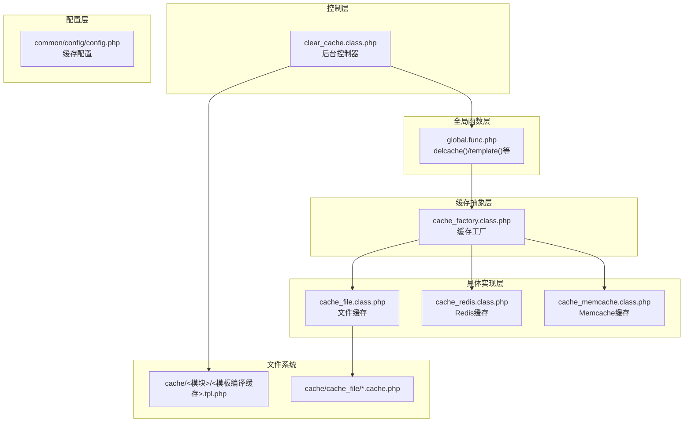
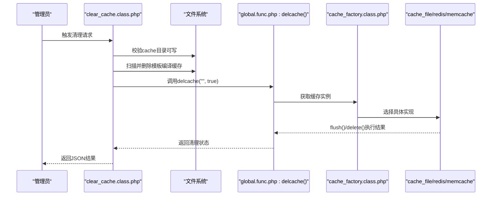
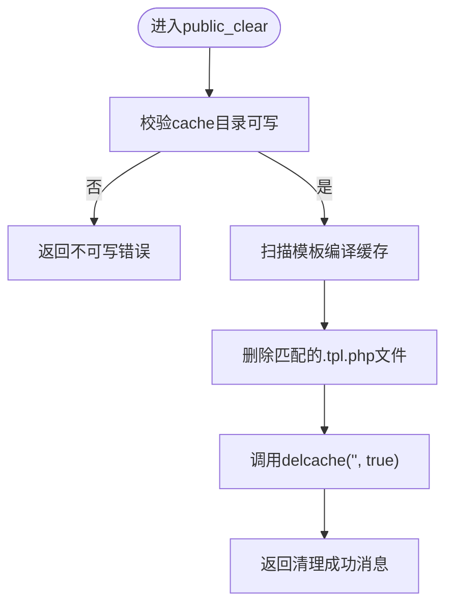
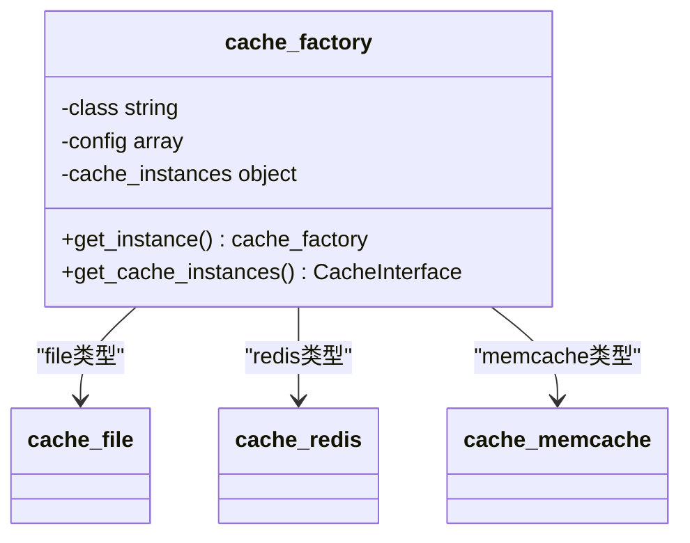
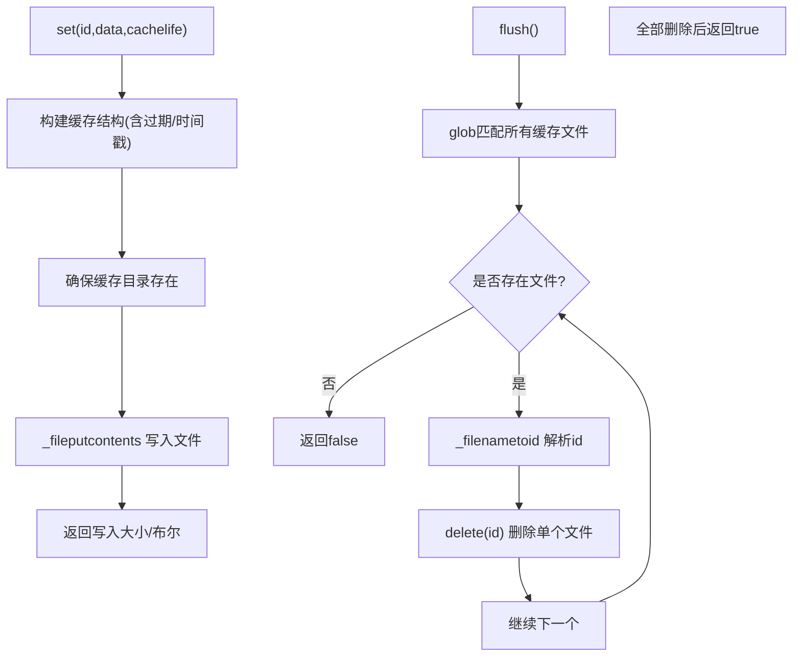
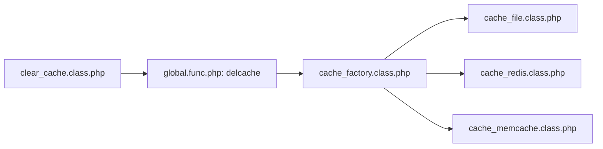

# 缓存管理

<cite>
**本文引用的文件**
- [application/lry_admin_center/controller/clear_cache.class.php](file://application/lry_admin_center/controller/clear_cache.class.php)
- [ryphp/core/class/cache_factory.class.php](file://ryphp/core/class/cache_factory.class.php)
- [ryphp/core/class/cache_file.class.php](file://ryphp/core/class/cache_file.class.php)
- [ryphp/core/class/cache_redis.class.php](file://ryphp/core/class/cache_redis.class.php)
- [ryphp/core/class/cache_memcache.class.php](file://ryphp/core/class/cache_memcache.class.php)
- [ryphp/core/function/global.func.php](file://ryphp/core/function/global.func.php)
- [common/config/config.php](file://common/config/config.php)
- [.gitignore](file://.gitignore)
</cite>

## 目录
1. [简介](#简介)
2. [项目结构](#项目结构)
3. [核心组件](#核心组件)
4. [架构总览](#架构总览)
5. [详细组件分析](#详细组件分析)
6. [依赖关系分析](#依赖关系分析)
7. [性能考量](#性能考量)
8. [故障排除指南](#故障排除指南)
9. [结论](#结论)
10. [附录](#附录)

## 简介
本文件面向 LRYBlog 的缓存管理系统，聚焦于缓存清理功能的技术实现与使用方法。文档从控制器入口、缓存工厂与具体缓存实现、全局函数接口、配置项以及文件系统组织等维度，系统性解析以下内容：
- 清理策略：文件缓存、数据库缓存、页面缓存的清理方式与边界
- 控制器逻辑：clear_cache.class.php 中的缓存扫描、删除与重建流程
- 清理类型：全量清理、增量清理、按类型清理的适用场景与差异
- 清理时机与效果：手动清理、定时清理、条件清理的建议与评估
- 性能影响与优化：清理对 IO、CPU、内存与响应时间的影响
- 故障排除：常见问题定位与修复步骤

## 项目结构
围绕缓存管理的关键目录与文件如下：
- 控制器层：后台控制器负责接收清理请求并执行清理动作
- 缓存抽象层：工厂类根据配置选择具体缓存实现（文件/Redis/Memcache）
- 具体实现层：文件缓存、Redis 缓存、Memcache 缓存的具体读写与清理逻辑
- 全局函数层：统一的缓存接口与模板编译缓存生成
- 配置层：缓存类型与各实现的参数配置
- 文件系统：模板编译缓存与文件缓存目录

图表来源
- [application/lry_admin_center/controller/clear_cache.class.php:1-25](file://application/lry_admin_center/controller/clear_cache.class.php#L1-L25)
- [ryphp/core/class/cache_factory.class.php:1-84](file://ryphp/core/class/cache_factory.class.php#L1-L84)
- [ryphp/core/class/cache_file.class.php:1-130](file://ryphp/core/class/cache_file.class.php#L1-L130)
- [ryphp/core/class/cache_redis.class.php:1-108](file://ryphp/core/class/cache_redis.class.php#L1-L108)
- [ryphp/core/class/cache_memcache.class.php:1-55](file://ryphp/core/class/cache_memcache.class.php#L1-L55)
- [ryphp/core/function/global.func.php:1518-1556](file://ryphp/core/function/global.func.php#L1518-L1556)
- [common/config/config.php:39-66](file://common/config/config.php#L39-L66)

章节来源
- [application/lry_admin_center/controller/clear_cache.class.php:1-25](file://application/lry_admin_center/controller/clear_cache.class.php#L1-L25)
- [ryphp/core/class/cache_factory.class.php:1-84](file://ryphp/core/class/cache_factory.class.php#L1-L84)
- [ryphp/core/class/cache_file.class.php:1-130](file://ryphp/core/class/cache_file.class.php#L1-L130)
- [ryphp/core/class/cache_redis.class.php:1-108](file://ryphp/core/class/cache_redis.class.php#L1-L108)
- [ryphp/core/class/cache_memcache.class.php:1-55](file://ryphp/core/class/cache_memcache.class.php#L1-L55)
- [ryphp/core/function/global.func.php:1518-1556](file://ryphp/core/function/global.func.php#L1518-L1556)
- [common/config/config.php:39-66](file://common/config/config.php#L39-L66)

## 核心组件
- 后台清理控制器：提供公开清理接口，负责校验缓存目录可写、扫描并删除模板编译缓存、调用统一清理函数进行全量或单项清理，并返回结果
- 缓存工厂：依据配置选择缓存实现，延迟加载具体缓存实例，屏蔽上层差异
- 文件缓存实现：提供 get/set/delete/flush 等能力，基于文件系统持久化，支持过期判断
- Redis/Memcache 实现：提供 set/get/delete/flush 等能力，基于远程存储
- 全局函数接口：delcache 统一删除；template 统一模板编译缓存生成
- 配置项：定义缓存类型与各实现参数

章节来源
- [application/lry_admin_center/controller/clear_cache.class.php:9-24](file://application/lry_admin_center/controller/clear_cache.class.php#L9-L24)
- [ryphp/core/class/cache_factory.class.php:36-82](file://ryphp/core/class/cache_factory.class.php#L36-L82)
- [ryphp/core/class/cache_file.class.php:17-73](file://ryphp/core/class/cache_file.class.php#L17-L73)
- [ryphp/core/class/cache_redis.class.php:60-105](file://ryphp/core/class/cache_redis.class.php#L60-L105)
- [ryphp/core/class/cache_memcache.class.php:27-55](file://ryphp/core/class/cache_memcache.class.php#L27-L55)
- [ryphp/core/function/global.func.php:1518-1523](file://ryphp/core/function/global.func.php#L1518-L1523)
- [common/config/config.php:39-66](file://common/config/config.php#L39-L66)

## 架构总览
缓存清理在系统中的交互流程如下：

图表来源
- [application/lry_admin_center/controller/clear_cache.class.php:9-24](file://application/lry_admin_center/controller/clear_cache.class.php#L9-L24)
- [ryphp/core/function/global.func.php:1518-1523](file://ryphp/core/function/global.func.php#L1518-L1523)
- [ryphp/core/class/cache_factory.class.php:36-82](file://ryphp/core/class/cache_factory.class.php#L36-L82)
- [ryphp/core/class/cache_file.class.php:61-73](file://ryphp/core/class/cache_file.class.php#L61-L73)
- [ryphp/core/class/cache_redis.class.php:103-105](file://ryphp/core/class/cache_redis.class.php#L103-L105)
- [ryphp/core/class/cache_memcache.class.php:94-105](file://ryphp/core/class/cache_memcache.class.php#L94-L105)

## 详细组件分析

### 控制器：clear_cache.class.php
- 功能职责
  - 校验缓存根目录可写性
  - 扫描并删除指定模块的模板编译缓存文件
  - 调用统一清理函数执行全量清理
  - 返回标准化的JSON结果
- 关键点
  - 使用 glob 匹配模板编译缓存文件并逐个删除
  - 调用 delcache("", true) 触发全量清理
  - 对异常情况返回带状态码的消息

图表来源
- [application/lry_admin_center/controller/clear_cache.class.php:9-24](file://application/lry_admin_center/controller/clear_cache.class.php#L9-L24)

章节来源
- [application/lry_admin_center/controller/clear_cache.class.php:9-24](file://application/lry_admin_center/controller/clear_cache.class.php#L9-L24)

### 工厂：cache_factory.class.php
- 功能职责
  - 单例工厂，根据配置选择缓存实现
  - 延迟加载具体缓存类
  - 提供统一的缓存实例获取接口
- 支持类型
  - file：文件缓存
  - redis：Redis 缓存
  - memcache：Memcache 缓存
- 关键点
  - 通过配置项决定加载哪个实现类
  - 统一对外暴露 get_cache_instances 接口

图表来源
- [ryphp/core/class/cache_factory.class.php:36-82](file://ryphp/core/class/cache_factory.class.php#L36-L82)
- [ryphp/core/class/cache_file.class.php:1-130](file://ryphp/core/class/cache_file.class.php#L1-L130)
- [ryphp/core/class/cache_redis.class.php:1-108](file://ryphp/core/class/cache_redis.class.php#L1-L108)
- [ryphp/core/class/cache_memcache.class.php:1-55](file://ryphp/core/class/cache_memcache.class.php#L1-L55)

章节来源
- [ryphp/core/class/cache_factory.class.php:36-82](file://ryphp/core/class/cache_factory.class.php#L36-L82)

### 文件缓存：cache_file.class.php
- 功能职责
  - 基于文件系统的缓存实现
  - 提供 get/set/delete/flush/has 等操作
  - 支持过期判断与内容序列化/反序列化
- 关键点
  - 缓存目录与后缀由配置决定
  - flush 会遍历目录并逐个删除对应缓存文件
  - has/get 在过期时返回 false

图表来源
- [ryphp/core/class/cache_file.class.php:34-73](file://ryphp/core/class/cache_file.class.php#L34-L73)
- [ryphp/core/class/cache_file.class.php:103-128](file://ryphp/core/class/cache_file.class.php#L103-L128)

章节来源
- [ryphp/core/class/cache_file.class.php:17-73](file://ryphp/core/class/cache_file.class.php#L17-L73)
- [ryphp/core/class/cache_file.class.php:103-128](file://ryphp/core/class/cache_file.class.php#L103-L128)

### Redis 缓存：cache_redis.class.php
- 功能职责
  - 基于 Redis 的缓存实现
  - 提供 set/get/delete/flush 等操作
- 关键点
  - 支持持久化连接、密码认证、库选择、前缀等配置
  - flushall 清空所有键空间

章节来源
- [ryphp/core/class/cache_redis.class.php:30-105](file://ryphp/core/class/cache_redis.class.php#L30-L105)

### Memcache 缓存：cache_memcache.class.php
- 功能职责
  - 基于 Memcache 的缓存实现
  - 提供 set/get/delete/flush 等操作
- 关键点
  - 支持持久化连接、超时、前缀等配置
  - flush 清空当前服务器上的所有键

章节来源
- [ryphp/core/class/cache_memcache.class.php:27-55](file://ryphp/core/class/cache_memcache.class.php#L27-L55)

### 全局函数：delcache 与模板编译
- delcache
  - 统一删除接口，支持按名称删除或全量清空
  - 基于工厂获取具体实现并调用 delete/flush
- template
  - 模板编译缓存生成与更新逻辑
  - 若目标编译文件不存在或源模板更新，则重新编译并写入

章节来源
- [ryphp/core/function/global.func.php:1518-1523](file://ryphp/core/function/global.func.php#L1518-L1523)
- [ryphp/core/function/global.func.php:1526-1556](file://ryphp/core/function/global.func.php#L1526-L1556)

## 依赖关系分析
- 控制器依赖全局函数 delcache 与文件系统
- 全局函数依赖缓存工厂
- 工厂根据配置动态加载具体缓存实现
- 不同实现之间无直接耦合，通过统一接口隔离

图表来源
- [application/lry_admin_center/controller/clear_cache.class.php:9-24](file://application/lry_admin_center/controller/clear_cache.class.php#L9-L24)
- [ryphp/core/function/global.func.php:1518-1523](file://ryphp/core/function/global.func.php#L1518-L1523)
- [ryphp/core/class/cache_factory.class.php:36-82](file://ryphp/core/class/cache_factory.class.php#L36-L82)
- [ryphp/core/class/cache_file.class.php:1-130](file://ryphp/core/class/cache_file.class.php#L1-L130)
- [ryphp/core/class/cache_redis.class.php:1-108](file://ryphp/core/class/cache_redis.class.php#L1-L108)
- [ryphp/core/class/cache_memcache.class.php:1-55](file://ryphp/core/class/cache_memcache.class.php#L1-L55)

章节来源
- [application/lry_admin_center/controller/clear_cache.class.php:9-24](file://application/lry_admin_center/controller/clear_cache.class.php#L9-L24)
- [ryphp/core/function/global.func.php:1518-1523](file://ryphp/core/function/global.func.php#L1518-L1523)
- [ryphp/core/class/cache_factory.class.php:36-82](file://ryphp/core/class/cache_factory.class.php#L36-L82)

## 性能考量
- 清理时机
  - 手动清理：适合变更后立即生效，但可能影响用户访问体验
  - 定时清理：在低峰时段批量清理，降低对业务的影响
  - 条件清理：结合版本升级、模板更新、数据迁移等事件触发
- 清理粒度
  - 全量清理：一次性清除所有缓存，恢复最干净状态，但成本较高
  - 按类型清理：针对特定模块或缓存类型，减少影响面
  - 增量清理：仅删除过期或失效的缓存条目，提升效率
- 影响因素
  - 文件系统 IO：大量小文件删除与重建会产生 IO 压力
  - 过期判断：文件缓存的 has/get 会进行过期判断，避免无效读取
  - 远程缓存：Redis/Memcache 的 flush/delete 通常更高效，但需考虑网络与锁竞争
- 评估方法
  - 统计清理前后命中率变化
  - 观察页面响应时间与 CPU 使用率
  - 监控磁盘空间与 inode 使用情况

## 故障排除指南
- 权限问题
  - 现象：清理失败并提示缓存目录不可写
  - 处理：确认 cache 目录及子目录具备写权限
- 目录结构不一致
  - 现象：模板编译缓存未被删除或清理不彻底
  - 处理：核对模板编译缓存目录结构与扫描路径
- 缓存实现未加载
  - 现象：调用 delcache 无效或报错
  - 处理：检查配置项中缓存类型与对应扩展是否启用
- 远程缓存连接失败
  - 现象：Redis/Memcache 清理失败
  - 处理：检查 host/port/password/select/prefix 等配置
- 版本与忽略规则
  - 现象：某些缓存目录被版本控制忽略
  - 处理：核对忽略规则，必要时调整以避免误删

章节来源
- [application/lry_admin_center/controller/clear_cache.class.php:10-12](file://application/lry_admin_center/controller/clear_cache.class.php#L10-L12)
- [common/config/config.php:39-66](file://common/config/config.php#L39-L66)
- [.gitignore:2-5](file://.gitignore#L2-L5)

## 结论
- LRYBlog 的缓存清理以 clear_cache.class.php 为入口，结合全局函数 delcache 与缓存工厂，实现了对模板编译缓存与各类缓存实现的统一清理
- 文件缓存通过 flush 遍历目录并逐个删除，Redis/Memcache 则通过 flush/flushall 快速清空
- 建议在低峰时段进行全量清理，日常维护采用增量或按类型清理，以平衡性能与一致性
- 遇到问题优先检查权限、配置与目录结构，确保清理流程稳定可靠

## 附录
- 配置项参考
  - 缓存类型与各实现参数位于配置文件中，工厂根据配置选择具体实现
- 目录约定
  - 模板编译缓存位于 cache/<模块>/ 下
  - 文件缓存位于 cache/cache_file/ 下

章节来源
- [common/config/config.php:39-66](file://common/config/config.php#L39-L66)
- [ryphp/core/function/global.func.php:1526-1556](file://ryphp/core/function/global.func.php#L1526-L1556)