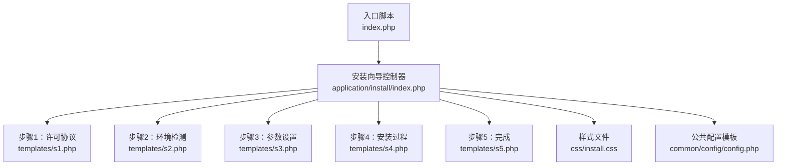
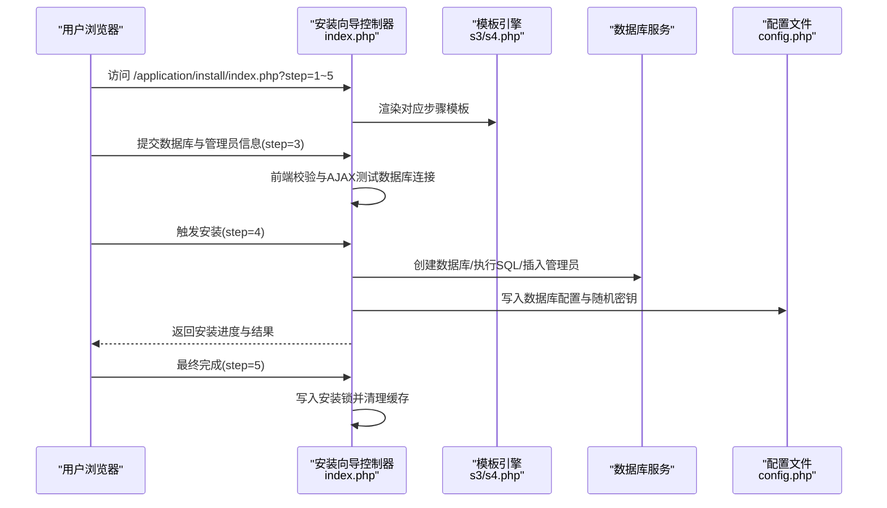
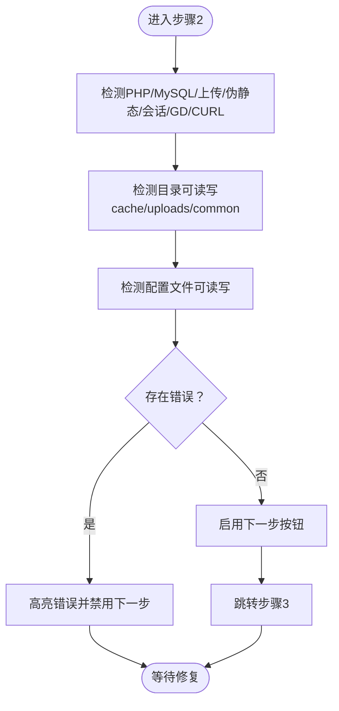
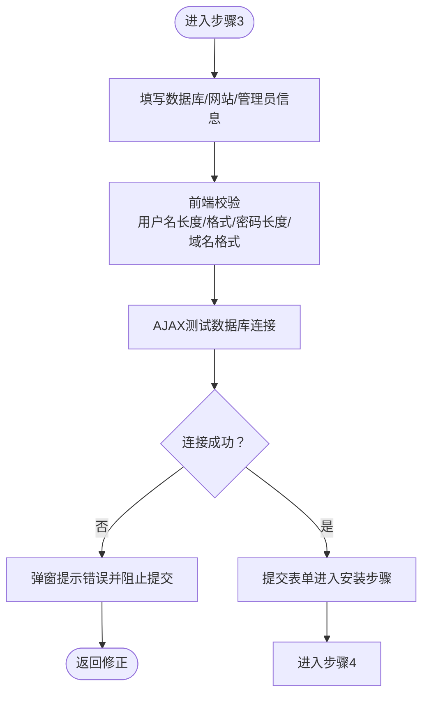
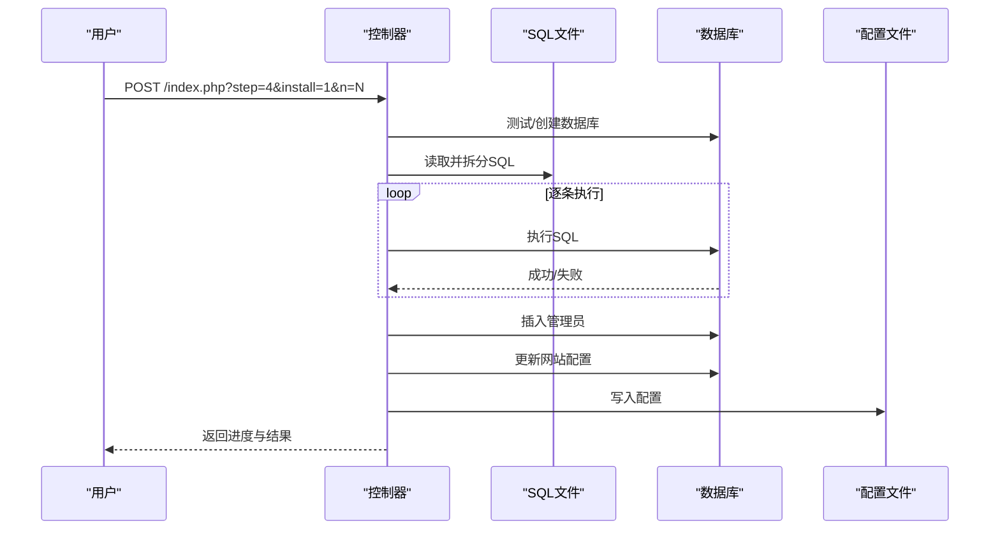
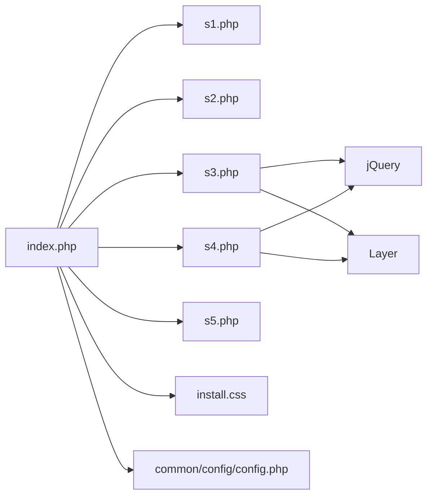

# 安装向导模块

<cite>
**本文引用的文件**
- [application/install/index.php](file://application/install/index.php)
- [application/install/templates/s1.php](file://application/install/templates/s1.php)
- [application/install/templates/s2.php](file://application/install/templates/s2.php)
- [application/install/templates/s3.php](file://application/install/templates/s3.php)
- [application/install/templates/s4.php](file://application/install/templates/s4.php)
- [application/install/templates/s5.php](file://application/install/templates/s5.php)
- [application/install/css/install.css](file://application/install/css/install.css)
- [application/install/templates/header.php](file://application/install/templates/header.php)
- [application/install/templates/footer.php](file://application/install/templates/footer.php)
- [common/config/config.php](file://common/config/config.php)
- [index.php](file://index.php)
</cite>

## 目录
1. [简介](#简介)
2. [项目结构](#项目结构)
3. [核心组件](#核心组件)
4. [架构总览](#架构总览)
5. [详细组件分析](#详细组件分析)
6. [依赖关系分析](#依赖关系分析)
7. [性能考量](#性能考量)
8. [故障排查指南](#故障排查指南)
9. [结论](#结论)
10. [附录](#附录)

## 简介
本文件面向 LRYBlog（RYCMS）安装向导模块，提供从架构设计到用户体验、从数据处理到安全机制的完整部署文档。安装向导通过五步流程（许可协议、环境检测、参数设置、安装过程、完成）简化系统部署，覆盖数据库连接测试、配置文件生成、管理员初始化、系统锁定与清理等关键环节。同时给出模板系统与界面交互说明、定制化方案、安全加固建议、常见问题与批量/自动化部署指导。

## 项目结构
安装向导位于 application/install 目录，采用“控制器 + 多步骤模板”的结构：
- 控制器：application/install/index.php，负责路由、步骤控制、环境检测、数据库安装、配置写入、安装锁与清理。
- 模板：application/install/templates/ 下的 s1~s5.php，分别对应五步界面；header.php/ footer.php 提供统一头部与页脚。
- 样式：application/install/css/install.css，定义安装界面的布局与交互样式。
- 配置：common/config/config.php，安装完成后写入数据库连接与系统参数。

**图示来源**
- [index.php:1-18](file://index.php#L1-L18)
- [application/install/index.php:1-373](file://application/install/index.php#L1-L373)
- [application/install/templates/s1.php:1-45](file://application/install/templates/s1.php#L1-L45)
- [application/install/templates/s2.php:1-135](file://application/install/templates/s2.php#L1-L135)
- [application/install/templates/s3.php:1-217](file://application/install/templates/s3.php#L1-L217)
- [application/install/templates/s4.php:1-73](file://application/install/templates/s4.php#L1-L73)
- [application/install/templates/s5.php:1-23](file://application/install/templates/s5.php#L1-L23)
- [application/install/css/install.css:1-219](file://application/install/css/install.css#L1-L219)
- [common/config/config.php:1-88](file://common/config/config.php#L1-L88)

**章节来源**
- [application/install/index.php:1-373](file://application/install/index.php#L1-L373)
- [application/install/templates/s1.php:1-45](file://application/install/templates/s1.php#L1-L45)
- [application/install/templates/s2.php:1-135](file://application/install/templates/s2.php#L1-L135)
- [application/install/templates/s3.php:1-217](file://application/install/templates/s3.php#L1-L217)
- [application/install/templates/s4.php:1-73](file://application/install/templates/s4.php#L1-L73)
- [application/install/templates/s5.php:1-23](file://application/install/templates/s5.php#L1-L23)
- [application/install/css/install.css:1-219](file://application/install/css/install.css#L1-L219)
- [common/config/config.php:1-88](file://common/config/config.php#L1-L88)
- [index.php:1-18](file://index.php#L1-L18)

## 核心组件
- 控制器与路由
  - 定义常量、计算站点根路径、判断安装锁、版本与环境校验、步骤分发 switch。
  - 提供数据库连接测试接口（AJAX）、SQL拆分与执行、配置写入函数、目录可写检测辅助函数。
- 步骤模板
  - s1：许可协议与接受按钮。
  - s2：环境检测（PHP/MYSQL/上传/伪静态/会话/GD/CURL/目录权限）。
  - s3：数据库参数、网站配置、管理员信息输入与前端校验、数据库连接测试。
  - s4：安装进度展示与异步安装流程。
  - s5：安装完成提示与后台入口链接。
- 样式与布局
  - 统一头部、版本号、页脚版权；步骤指示条、表格化信息展示、按钮与提示样式。
- 配置文件
  - 安装完成后写入 common/config/config.php，包含数据库连接、表前缀、字符集等。

**章节来源**
- [application/install/index.php:31-37](file://application/install/index.php#L31-L37)
- [application/install/index.php:45-275](file://application/install/index.php#L45-L275)
- [application/install/index.php:277-344](file://application/install/index.php#L277-L344)
- [application/install/index.php:321-335](file://application/install/index.php#L321-L335)
- [application/install/templates/s1.php:1-45](file://application/install/templates/s1.php#L1-L45)
- [application/install/templates/s2.php:1-135](file://application/install/templates/s2.php#L1-L135)
- [application/install/templates/s3.php:1-217](file://application/install/templates/s3.php#L1-L217)
- [application/install/templates/s4.php:1-73](file://application/install/templates/s4.php#L1-L73)
- [application/install/templates/s5.php:1-23](file://application/install/templates/s5.php#L1-L23)
- [application/install/css/install.css:1-219](file://application/install/css/install.css#L1-L219)
- [common/config/config.php:1-88](file://common/config/config.php#L1-L88)

## 架构总览
安装向导采用前后端分离的步骤式架构：
- 前端模板负责用户交互与表单校验；
- 后端控制器负责业务逻辑与数据处理；
- AJAX 异步推进安装步骤，避免页面跳转带来的状态丢失；
- 安装完成后写入配置文件并生成安装锁，阻止重复安装。

**图示来源**
- [application/install/index.php:45-275](file://application/install/index.php#L45-L275)
- [application/install/templates/s3.php:141-213](file://application/install/templates/s3.php#L141-L213)
- [application/install/templates/s4.php:28-69](file://application/install/templates/s4.php#L28-L69)
- [common/config/config.php:1-88](file://common/config/config.php#L1-L88)

## 详细组件分析

### 步骤1：许可协议
- 功能：展示许可协议内容，用户接受后进入步骤2。
- 交互：点击“接受”按钮跳转至步骤2。
- 设计要点：协议内容清晰、法律声明完整，引导用户理解授权与限制。

**章节来源**
- [application/install/templates/s1.php:14-40](file://application/install/templates/s1.php#L14-L40)

### 步骤2：环境检测
- 功能：检测操作系统、PHP版本、MySQL/PDO扩展、上传大小、伪静态、会话、GD、CURL、目录可写与配置文件可写。
- 交互：支持“重新检测”，当全部通过时启用“下一步”。
- 设计要点：表格化展示，使用图标区分正确/错误状态；对伪静态检测采用HTTP请求验证。

**图示来源**
- [application/install/index.php:51-114](file://application/install/index.php#L51-L114)
- [application/install/templates/s2.php:20-131](file://application/install/templates/s2.php#L20-L131)

**章节来源**
- [application/install/index.php:51-114](file://application/install/index.php#L51-L114)
- [application/install/templates/s2.php:1-135](file://application/install/templates/s2.php#L1-L135)

### 步骤3：安装参数设置
- 功能：填写数据库信息（类型、主机、端口、用户名、密码、库名、表前缀、引擎/字符集）、网站配置（名称、域名）、管理员信息（用户名、密码），并进行前端校验与数据库连接测试。
- 交互：提交表单触发校验，AJAX调用控制器进行连接测试；通过后进入安装步骤。
- 安全：对管理员用户名与密码长度与格式进行严格校验；对网站域名格式进行正则校验；数据库连接测试通过后才允许继续。

**图示来源**
- [application/install/templates/s3.php:20-136](file://application/install/templates/s3.php#L20-L136)
- [application/install/templates/s3.php:141-213](file://application/install/templates/s3.php#L141-L213)
- [application/install/index.php:116-129](file://application/install/index.php#L116-L129)

**章节来源**
- [application/install/templates/s3.php:1-217](file://application/install/templates/s3.php#L1-L217)
- [application/install/index.php:116-129](file://application/install/index.php#L116-L129)

### 步骤4：安装详细过程
- 功能：异步执行数据库初始化（创建数据库、拆分SQL、逐条执行、表引擎与字符集适配）、插入管理员、更新网站配置、写入配置文件、返回安装进度。
- 交互：页面实时显示安装日志，成功后自动跳转至完成页。
- 错误处理：捕获异常并返回错误信息，阻止继续安装。

**图示来源**
- [application/install/index.php:132-260](file://application/install/index.php#L132-L260)
- [application/install/templates/s4.php:28-69](file://application/install/templates/s4.php#L28-L69)

**章节来源**
- [application/install/index.php:132-260](file://application/install/index.php#L132-L260)
- [application/install/templates/s4.php:1-73](file://application/install/templates/s4.php#L1-L73)

### 步骤5：安装完成
- 功能：显示安装成功提示，提供后台入口链接，提醒进行URL批量更新，列出官方资源链接。
- 安全：写入安装锁文件，删除安装入口与临时缓存文件，防止重复安装与信息泄露。

**章节来源**
- [application/install/templates/s5.php:1-23](file://application/install/templates/s5.php#L1-L23)
- [application/install/index.php:265-275](file://application/install/index.php#L265-L275)

### 模板系统与布局设计
- 统一头部与页脚：header.php/footer.php 提供品牌标识与版权信息。
- 步骤指示条：三段式步骤条贯穿各步骤，清晰指引用户进度。
- 表格化信息展示：环境检测与参数输入采用表格布局，提升可读性。
- 样式规范：install.css 定义按钮、提示、列表、背景等统一风格。

**章节来源**
- [application/install/templates/header.php:1-6](file://application/install/templates/header.php#L1-L6)
- [application/install/templates/footer.php:1-2](file://application/install/templates/footer.php#L1-L2)
- [application/install/css/install.css:1-219](file://application/install/css/install.css#L1-L219)

### 数据处理机制
- 配置文件生成：set_config 函数读取模板，按键值替换并写回 common/config/config.php，同时生成随机 auth_key。
- 数据库连接测试：AJAX 使用 PDO/MySQLi 连接字符串进行连通性验证。
- 权限设置：通过 testwrite 辅助函数检测目录可写，确保安装后系统可写。
- 安装锁与清理：安装完成后创建 cache/install.lock，删除 install.php 与 index.html，清理缓存文件。

**章节来源**
- [application/install/index.php:321-335](file://application/install/index.php#L321-L335)
- [application/install/index.php:277-289](file://application/install/index.php#L277-L289)
- [application/install/index.php:265-275](file://application/install/index.php#L265-L275)

### 定制化方案
- 界面美化
  - 修改 install.css 中的颜色、阴影、圆角、背景图片与按钮样式，适配品牌风格。
  - 替换 header.php 中的品牌标识与版本号，调整 footer.php 版权信息。
- 安装流程修改
  - 在 index.php 的步骤数组中增减步骤或调整顺序；在对应模板中增删字段与校验规则。
  - 在 set_config 中增加更多配置项的写入逻辑，满足特定部署需求。
- 交互优化
  - 在 s3.php 的前端校验中增加更多字段的必填与格式校验；在 s4.php 中增加更细粒度的进度提示。

**章节来源**
- [application/install/css/install.css:1-219](file://application/install/css/install.css#L1-L219)
- [application/install/templates/header.php:1-6](file://application/install/templates/header.php#L1-L6)
- [application/install/templates/footer.php:1-2](file://application/install/templates/footer.php#L1-L2)
- [application/install/index.php:31-37](file://application/install/index.php#L31-L37)
- [application/install/index.php:321-335](file://application/install/index.php#L321-L335)

### 安全机制
- 输入验证
  - 管理员用户名长度与格式校验（字母开头、允许数字与下划线，长度3-20）。
  - 管理员密码长度校验（6-20）。
  - 网站域名格式校验（以“/”结尾的URL正则）。
- 配置安全
  - 自动生成随机 auth_key，避免硬编码。
  - 写入配置前检查目标文件可写，失败时提示权限问题。
- 安装防护
  - 安装锁文件 cache/install.lock 阻止重复安装。
  - 删除 install.php 与 index.html，清理缓存文件，降低残留风险。

**章节来源**
- [application/install/templates/s3.php:167-211](file://application/install/templates/s3.php#L167-L211)
- [application/install/index.php:321-335](file://application/install/index.php#L321-L335)
- [application/install/index.php:15-17](file://application/install/index.php#L15-L17)
- [application/install/index.php:265-275](file://application/install/index.php#L265-L275)

## 依赖关系分析
- 控制器依赖
  - PHP 版本与扩展：PDO/MySQLi、GD、CURL、Session、上传能力。
  - 目录权限：cache、uploads、common/config/config.php。
- 模板依赖
  - jQuery 与 Layer 弹层插件用于交互与提示。
- 数据依赖
  - database.sql：安装时读取并拆分执行。
  - common/config/config.php：安装后写入数据库连接与系统参数。

**图示来源**
- [application/install/index.php:1-373](file://application/install/index.php#L1-L373)
- [application/install/templates/s3.php:139-140](file://application/install/templates/s3.php#L139-L140)
- [application/install/templates/s4.php:8-9](file://application/install/templates/s4.php#L8-L9)

**章节来源**
- [application/install/index.php:1-373](file://application/install/index.php#L1-L373)
- [application/install/templates/s3.php:139-140](file://application/install/templates/s3.php#L139-L140)
- [application/install/templates/s4.php:8-9](file://application/install/templates/s4.php#L8-L9)

## 性能考量
- 安装过程采用分段执行与异步推进，避免长时间阻塞页面响应。
- SQL 执行按条进行，便于定位失败点并减少事务开销。
- 目录与文件权限检测在步骤2集中完成，减少后续错误重试成本。
- 建议在生产环境使用 InnoDB 引擎与 utf8mb4 字符集，提升兼容性与存储效率。

[本节为通用建议，无需具体文件引用]

## 故障排查指南
- PHP 版本过低
  - 现象：安装前直接报错提示版本过低。
  - 处理：升级至推荐版本以上。
- 数据库连接失败
  - 现象：步骤3中AJAX测试失败或步骤4执行SQL失败。
  - 处理：核对主机、端口、用户名、密码、库名；确认 MySQL 服务运行与网络可达；检查防火墙策略。
- 目录不可写
  - 现象：步骤2中目录或配置文件显示不可写。
  - 处理：赋予 cache、uploads、common/config/config.php 目录写权限（chmod 0777）。
- 伪静态未开启
  - 现象：步骤2中伪静态检测失败。
  - 处理：根据提示刷新或参考官方教程开启伪静态模块。
- 安装锁导致无法重新安装
  - 现象：提示已安装或无法再次安装。
  - 处理：删除 cache/install.lock 后重试（谨慎操作）。
- 安装完成后无法访问后台
  - 现象：点击后台入口无响应或404。
  - 处理：按提示进行“批量更新URL”；检查伪静态与路由配置。

**章节来源**
- [application/install/index.php:21](file://application/install/index.php#L21)
- [application/install/index.php:88-94](file://application/install/index.php#L88-L94)
- [application/install/index.php:25-28](file://application/install/index.php#L25-L28)
- [application/install/index.php:185-189](file://application/install/index.php#L185-L189)
- [application/install/index.php:15-17](file://application/install/index.php#L15-L17)
- [application/install/templates/s5.php:14-15](file://application/install/templates/s5.php#L14-L15)

## 结论
LRYBlog 安装向导通过清晰的五步流程、完善的前端校验与后端处理、严格的配置写入与安全防护，显著降低了部署门槛。结合本文的定制化与安全建议，可在不同环境中快速落地并保障稳定性与安全性。

[本节为总结，无需具体文件引用]

## 附录

### 安装后的验证步骤
- 登录后台并执行“批量更新URL”。
- 检查伪静态与路由配置是否生效。
- 验证上传目录可用与图片水印功能。
- 核对网站名称与域名配置。

**章节来源**
- [application/install/templates/s5.php:14-15](file://application/install/templates/s5.php#L14-L15)
- [common/config/config.php:1-88](file://common/config/config.php#L1-L88)

### 批量安装与自动化部署建议
- 使用数据库迁移工具在多台服务器上统一初始化数据库。
- 将 common/config/config.php 的敏感信息通过环境变量注入，避免硬编码。
- 在 CI/CD 中集成安装向导的最后阶段（生成配置与安装锁），并进行二次校验（如批量更新URL）。
- 对安装锁与缓存清理进行幂等处理，确保重复部署不会失败。

[本节为通用建议，无需具体文件引用]