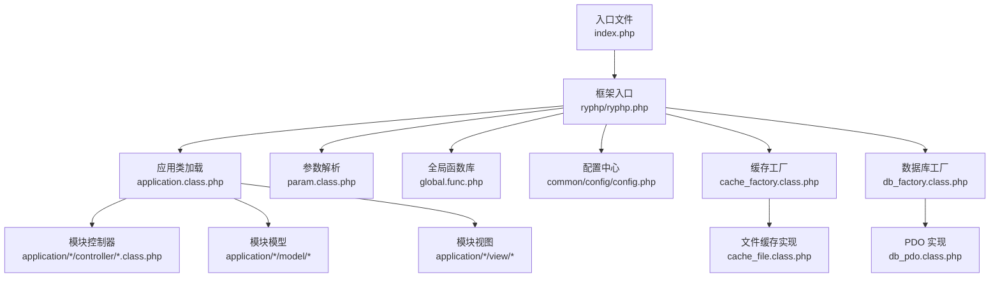
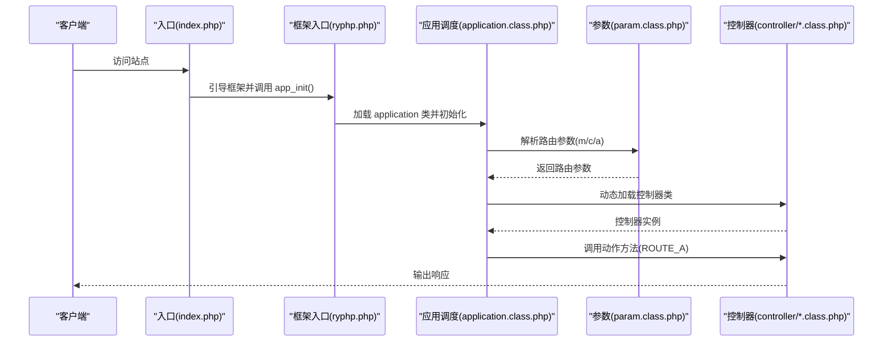
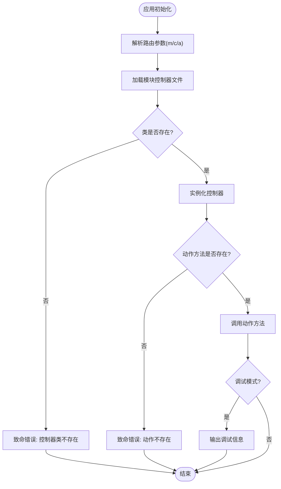
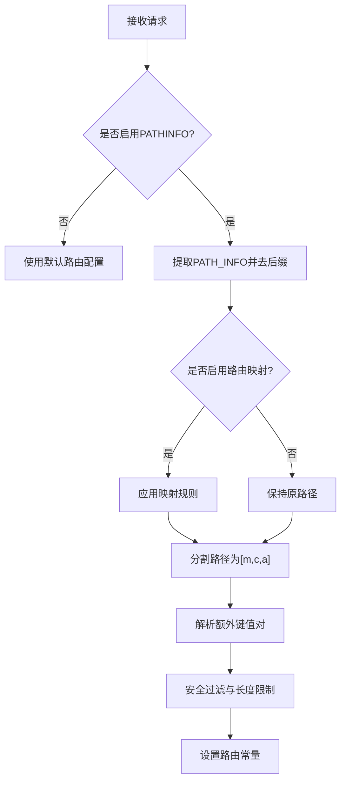
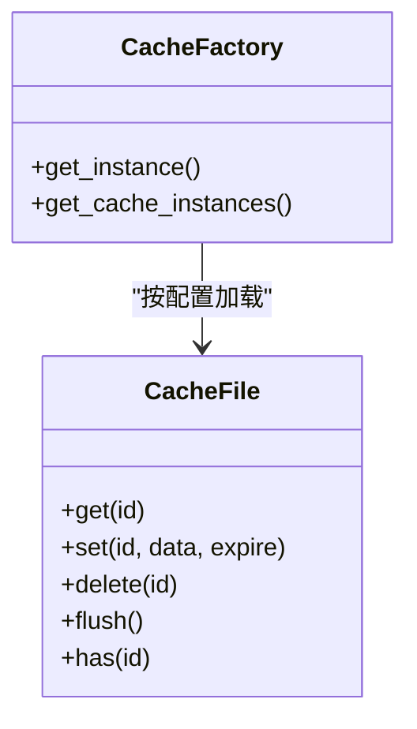
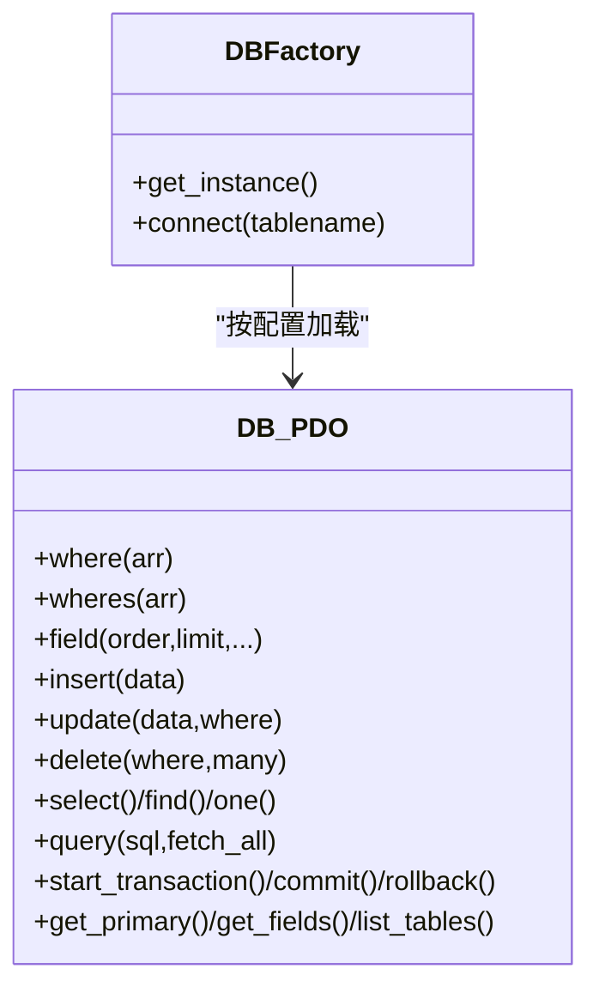
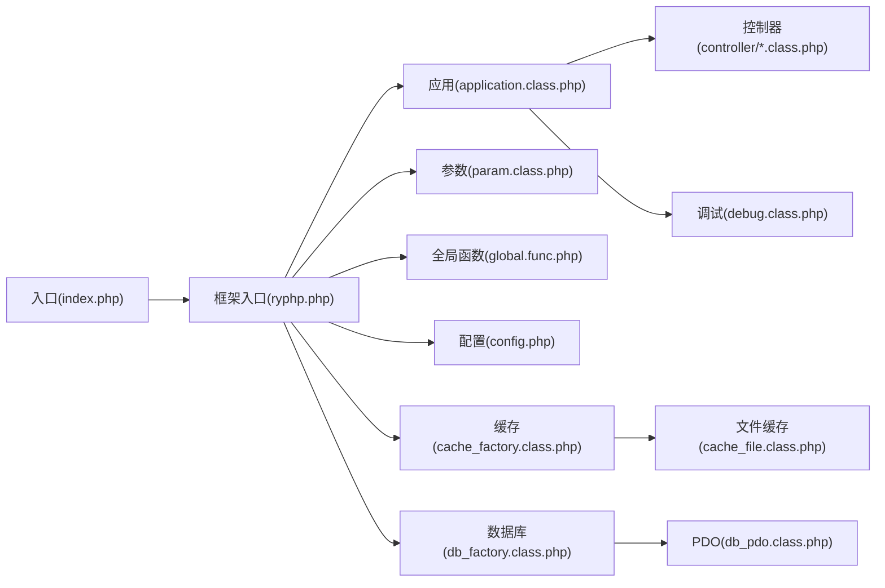

# 模块加载机制

<cite>
**本文引用的文件列表**
- [index.php](file://index.php)
- [ryphp.php](file://ryphp/ryphp.php)
- [application.class.php](file://ryphp/core/class/application.class.php)
- [param.class.php](file://ryphp/core/class/param.class.php)
- [debug.class.php](file://ryphp/core/class/debug.class.php)
- [global.func.php](file://ryphp/core/function/global.func.php)
- [config.php](file://common/config/config.php)
- [index.class.php](file://application/index/controller/index.class.php)
- [cache_factory.class.php](file://ryphp/core/class/cache_factory.class.php)
- [cache_file.class.php](file://ryphp/core/class/cache_file.class.php)
- [db_factory.class.php](file://ryphp/core/class/db_factory.class.php)
- [db_pdo.class.php](file://ryphp/core/class/db_pdo.class.php)
- [index.php](file://application/install/index.php)
</cite>

## 目录
1. [引言](#引言)
2. [项目结构](#项目结构)
3. [核心组件](#核心组件)
4. [架构总览](#架构总览)
5. [详细组件分析](#详细组件分析)
6. [依赖关系分析](#依赖关系分析)
7. [性能考量](#性能考量)
8. [故障排查指南](#故障排查指南)
9. [结论](#结论)
10. [附录](#附录)

## 引言
本技术文档围绕 LRYBlog 的模块加载机制展开，系统阐述框架如何实现模块的动态加载与调度、路由解析流程、模块生命周期与执行流程、模块间通信与资源共享、命名空间与自动加载策略、缓存与热加载机制、扩展开发方法、错误处理与异常恢复、以及调试与性能监控实践。文档面向不同层次读者，既提供高层架构视图，也给出代码级细节与可视化图示，帮助开发者快速理解并高效扩展系统。

## 项目结构
LRYBlog 采用“入口文件 + 框架内核 + 应用模块”的分层组织方式：
- 入口文件负责初始化系统常量与引导框架
- 框架内核提供类加载、路由、缓存、数据库、调试等基础设施
- 应用模块按功能划分，每个模块包含 controller、model、view、common 等子目录
- 公共配置与静态资源位于 common 与 cache 目录

图表来源
- [index.php:1-18](file://index.php#L1-L18)
- [ryphp.php:83-204](file://ryphp/ryphp.php#L83-L204)
- [application.class.php:4-118](file://ryphp/core/class/application.class.php#L4-L118)
- [param.class.php:3-195](file://ryphp/core/class/param.class.php#L3-L195)
- [global.func.php:4-26](file://ryphp/core/function/global.func.php#L4-L26)
- [config.php:1-88](file://common/config/config.php#L1-L88)
- [cache_factory.class.php:1-84](file://ryphp/core/class/cache_factory.class.php#L1-L84)
- [cache_file.class.php:1-130](file://ryphp/core/class/cache_file.class.php#L1-L130)
- [db_factory.class.php:1-50](file://ryphp/core/class/db_factory.class.php#L1-L50)
- [db_pdo.class.php:1-646](file://ryphp/core/class/db_pdo.class.php#L1-L646)

章节来源
- [index.php:1-18](file://index.php#L1-L18)
- [ryphp.php:10-32](file://ryphp/ryphp.php#L10-L32)

## 核心组件
- 入口与引导
  - 入口文件定义调试开关、根路径常量，引入框架入口并调用应用初始化
  - 框架入口定义系统常量、加载公共函数库与版本信息，并提供类加载与控制器/模型加载接口
- 应用调度器
  - 应用类负责注册错误/异常处理器、解析路由参数、加载控制器并执行动作
- 路由解析器
  - 参数类负责从 GET/POST、PATH_INFO、URL 映射中提取 m/c/a，并进行安全过滤
- 缓存与数据库
  - 缓存工厂按配置选择具体缓存实现；文件缓存提供持久化缓存能力
  - 数据库工厂按配置选择 PDO/MySQLi/MySQL 实现，统一对外接口
- 调试与错误处理
  - 调试类收集运行时信息、SQL、请求参数，支持致命错误捕获与异常处理
- 全局函数库
  - 提供配置读取、缓存读写、URL 生成、国际化语言包加载等通用能力

章节来源
- [ryphp.php:83-204](file://ryphp/ryphp.php#L83-L204)
- [application.class.php:9-40](file://ryphp/core/class/application.class.php#L9-L40)
- [param.class.php:19-60](file://ryphp/core/class/param.class.php#L19-L60)
- [cache_factory.class.php:36-82](file://ryphp/core/class/cache_factory.class.php#L36-L82)
- [cache_file.class.php:17-46](file://ryphp/core/class/cache_file.class.php#L17-L46)
- [db_factory.class.php:11-49](file://ryphp/core/class/db_factory.class.php#L11-L49)
- [debug.class.php:21-112](file://ryphp/core/class/debug.class.php#L21-L112)
- [global.func.php:4-26](file://ryphp/core/function/global.func.php#L4-L26)

## 架构总览
LRYBlog 的模块加载与调度遵循“入口引导 → 路由解析 → 控制器加载 → 动作执行 → 资源回收”的闭环流程。系统通过常量与静态类方法实现全局状态共享，通过工厂模式与单例模式实现缓存与数据库实例的延迟初始化与复用。

图表来源
- [index.php:10-18](file://index.php#L10-L18)
- [ryphp.php:88-90](file://ryphp/ryphp.php#L88-L90)
- [application.class.php:14-40](file://ryphp/core/class/application.class.php#L14-L40)
- [param.class.php:22-46](file://ryphp/core/class/param.class.php#L22-L46)

## 详细组件分析

### 入口与引导
- 入口文件设置调试常量与根路径，随后加载框架入口并触发应用初始化
- 框架入口定义系统常量（站点 URL、静态资源 URL、时区、魔术引号兼容等），加载公共函数库与版本信息，提供类加载、控制器/模型加载、公共文件加载等静态方法

章节来源
- [index.php:10-18](file://index.php#L10-L18)
- [ryphp.php:10-32](file://ryphp/ryphp.php#L10-L32)
- [ryphp.php:96-162](file://ryphp/ryphp.php#L96-L162)

### 应用调度器（application）
- 注册错误/异常处理器，初始化参数解析器并定义路由常量
- 初始化阶段加载目标模块的控制器文件，校验类是否存在，实例化后调用动作方法
- 提供错误提示与致命错误处理，支持调试模式下的详细信息展示

图表来源
- [application.class.php:14-40](file://ryphp/core/class/application.class.php#L14-L40)
- [application.class.php:48-65](file://ryphp/core/class/application.class.php#L48-L65)

章节来源
- [application.class.php:9-40](file://ryphp/core/class/application.class.php#L9-L40)
- [application.class.php:108-115](file://ryphp/core/class/application.class.php#L108-L115)

### 路由解析器（param）
- 优先从 GET/POST 获取 m/c/a，若未提供则回退至配置默认值
- 支持 PATH_INFO 模式，通过 URL 模型常量与 PATHINFO 处理函数解析路径片段
- 提供 URL 映射规则，支持将旧路径映射为新路径
- 对输入进行安全处理，去除危险字符并限制长度

图表来源
- [param.class.php:8-15](file://ryphp/core/class/param.class.php#L8-L15)
- [param.class.php:95-116](file://ryphp/core/class/param.class.php#L95-L116)
- [param.class.php:138-151](file://ryphp/core/class/param.class.php#L138-L151)
- [param.class.php:54-60](file://ryphp/core/class/param.class.php#L54-L60)

章节来源
- [param.class.php:22-46](file://ryphp/core/class/param.class.php#L22-L46)
- [param.class.php:95-116](file://ryphp/core/class/param.class.php#L95-L116)
- [param.class.php:138-151](file://ryphp/core/class/param.class.php#L138-L151)
- [param.class.php:54-60](file://ryphp/core/class/param.class.php#L54-L60)

### 控制器与动作执行
- 控制器类位于 application/<模块>/controller 下，文件名即类名
- 应用调度器根据路由常量定位模块与控制器文件，加载后实例化并调用动作方法
- 动作方法名由路由常量 a 决定，私有或以下划线开头的动作会被拒绝访问

章节来源
- [application.class.php:48-65](file://ryphp/core/class/application.class.php#L48-L65)
- [index.class.php:14-17](file://application/index/controller/index.class.php#L14-L17)

### 缓存机制（工厂 + 文件缓存）
- 缓存工厂根据配置选择具体缓存实现（file/redis/memcache），延迟初始化并提供单例缓存实例
- 文件缓存实现支持过期控制、序列化/可执行文件两种存储模式、批量清理等

图表来源
- [cache_factory.class.php:36-82](file://ryphp/core/class/cache_factory.class.php#L36-L82)
- [cache_file.class.php:17-46](file://ryphp/core/class/cache_file.class.php#L17-L46)

章节来源
- [cache_factory.class.php:36-82](file://ryphp/core/class/cache_factory.class.php#L36-L82)
- [cache_file.class.php:17-46](file://ryphp/core/class/cache_file.class.php#L17-L46)

### 数据库访问（工厂 + PDO）
- 数据库工厂根据配置选择 PDO/MySQLi/MySQL 实现，统一对外接口
- PDO 实现提供连接池、预处理绑定、SQL 组装、事务、字段/表信息查询、错误处理与重连机制

图表来源
- [db_factory.class.php:11-49](file://ryphp/core/class/db_factory.class.php#L11-L49)
- [db_pdo.class.php:100-124](file://ryphp/core/class/db_pdo.class.php#L100-L124)

章节来源
- [db_factory.class.php:11-49](file://ryphp/core/class/db_factory.class.php#L11-L49)
- [db_pdo.class.php:100-124](file://ryphp/core/class/db_pdo.class.php#L100-L124)

### 调试与错误处理
- 注册致命错误、普通错误与异常处理器，支持调试模式下详细信息展示与非调试模式下的错误日志记录
- 提供 SQL 执行耗时统计、请求参数收集、运行时耗时计算等能力

章节来源
- [application.class.php:10-14](file://ryphp/core/class/application.class.php#L10-L14)
- [debug.class.php:46-112](file://ryphp/core/class/debug.class.php#L46-L112)

### 全局函数库与配置
- 配置读取函数按需加载配置文件并缓存，支持跨模块语言包合并加载
- URL 生成函数根据 URL 模型与变量生成绝对/相对路径
- 缓存读写函数通过缓存工厂获取实例并调用对应方法

章节来源
- [global.func.php:4-26](file://ryphp/core/function/global.func.php#L4-L26)
- [global.func.php:67-79](file://ryphp/core/function/global.func.php#L67-L79)
- [global.func.php:147-151](file://ryphp/core/function/global.func.php#L147-L151)
- [global.func.php:764-800](file://ryphp/core/function/global.func.php#L764-L800)

## 依赖关系分析
- 入口文件依赖框架入口；框架入口依赖应用类、参数类、全局函数库与配置中心
- 应用类依赖参数类解析路由，依赖控制器类执行业务逻辑
- 缓存与数据库通过工厂模式解耦具体实现，便于切换与扩展
- 调试类贯穿于错误处理与性能统计环节

图表来源
- [index.php:10-18](file://index.php#L10-L18)
- [ryphp.php:83-204](file://ryphp/ryphp.php#L83-L204)
- [application.class.php:4-118](file://ryphp/core/class/application.class.php#L4-L118)
- [param.class.php:3-195](file://ryphp/core/class/param.class.php#L3-L195)
- [cache_factory.class.php:1-84](file://ryphp/core/class/cache_factory.class.php#L1-L84)
- [cache_file.class.php:1-130](file://ryphp/core/class/cache_file.class.php#L1-L130)
- [db_factory.class.php:1-50](file://ryphp/core/class/db_factory.class.php#L1-L50)
- [db_pdo.class.php:1-646](file://ryphp/core/class/db_pdo.class.php#L1-L646)
- [debug.class.php:1-147](file://ryphp/core/class/debug.class.php#L1-L147)

章节来源
- [ryphp.php:83-204](file://ryphp/ryphp.php#L83-L204)
- [application.class.php:4-118](file://ryphp/core/class/application.class.php#L4-L118)

## 性能考量
- 类加载缓存：框架通过静态数组缓存已加载类，避免重复 include，提升加载效率
- 路由解析：PATHINFO 模式下对路径进行映射与分割，减少字符串处理开销
- 缓存策略：文件缓存支持过期控制与多种存储模式，合理设置过期时间与缓存目录权限
- 数据库：PDO 预处理绑定与连接池机制降低 SQL 注入风险与连接成本
- 调试信息：调试模式下会收集 SQL 与请求信息，生产环境应关闭调试以减少输出开销

章节来源
- [ryphp.php:118-140](file://ryphp/ryphp.php#L118-L140)
- [cache_file.class.php:34-46](file://ryphp/core/class/cache_file.class.php#L34-L46)
- [db_pdo.class.php:100-124](file://ryphp/core/class/db_pdo.class.php#L100-L124)
- [debug.class.php:116-137](file://ryphp/core/class/debug.class.php#L116-L137)

## 故障排查指南
- 路由错误
  - 检查 URL 模型与 PATHINFO 设置，确认 URL 后缀与映射规则
  - 确认 m/c/a 参数是否被安全过滤器剔除或截断
- 控制器加载失败
  - 确认模块目录存在且控制器文件名与类名一致
  - 检查类文件是否包含命名空间或语法错误
- 数据库连接失败
  - 检查数据库配置与网络连通性，关注 PDO 异常信息
  - 生产环境建议开启错误日志以便定位
- 缓存异常
  - 检查缓存目录权限与磁盘空间，确认过期时间设置合理
- 调试与日志
  - 开启调试模式查看详细错误堆栈
  - 非调试模式下检查错误日志文件，定位致命错误与异常

章节来源
- [param.class.php:54-60](file://ryphp/core/class/param.class.php#L54-L60)
- [application.class.php:52-64](file://ryphp/core/class/application.class.php#L52-L64)
- [db_pdo.class.php:33-42](file://ryphp/core/class/db_pdo.class.php#L33-L42)
- [cache_file.class.php:40-46](file://ryphp/core/class/cache_file.class.php#L40-L46)
- [debug.class.php:46-112](file://ryphp/core/class/debug.class.php#L46-L112)

## 结论
LRYBlog 的模块加载机制以入口文件为起点，依托框架内核的类加载、路由解析、缓存与数据库工厂，形成清晰的模块化架构。通过参数解析器与应用调度器，系统实现了模块的动态加载与动作执行；通过工厂与单例模式，实现了缓存与数据库的灵活扩展；通过调试与错误处理机制，保障了系统的可观测性与稳定性。开发者可在此基础上快速扩展新模块、优化路由与缓存策略，并结合调试与监控手段持续改进性能与可靠性。

## 附录

### 模块扩展开发指南
- 新建模块目录
  - 在 application 下创建模块目录，包含 controller、model、view、common 子目录
- 控制器与动作
  - 控制器类文件名与类名一致，动作方法名由路由 a 决定
  - 避免以下划线开头的动作方法
- 路由配置
  - 在配置中心设置默认路由与模块映射规则
  - 如需 PATHINFO 模式，设置 URL 模型常量并启用 PATHINFO
- 缓存与数据库
  - 使用全局函数读写缓存，或通过工厂获取实例
  - 数据库访问统一通过工厂与 PDO 接口
- 安装与部署
  - 参考安装脚本进行数据库初始化与配置写入
  - 确保缓存目录可写，安装锁文件存在以防止重复安装

章节来源
- [index.class.php:4-17](file://application/index/controller/index.class.php#L4-L17)
- [config.php:23-30](file://common/config/config.php#L23-L30)
- [global.func.php:147-151](file://ryphp/core/function/global.func.php#L147-L151)
- [db_factory.class.php:11-49](file://ryphp/core/class/db_factory.class.php#L11-L49)
- [index.php:15-17](file://application/install/index.php#L15-L17)