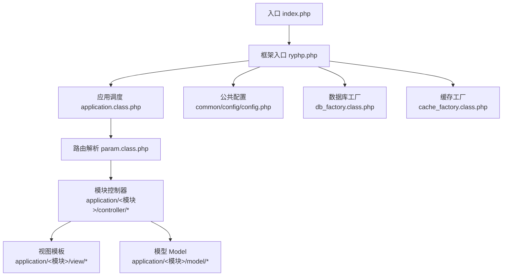
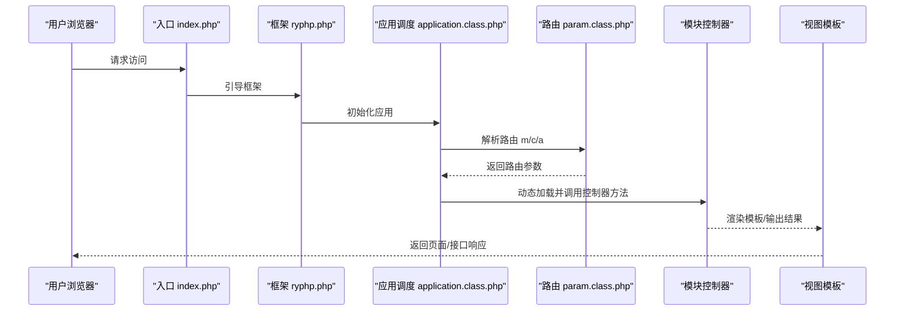
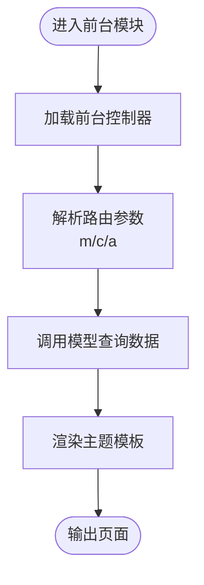
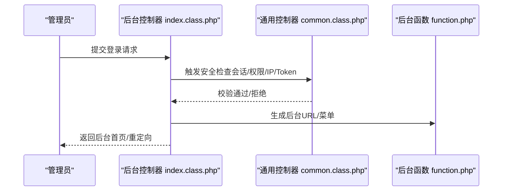
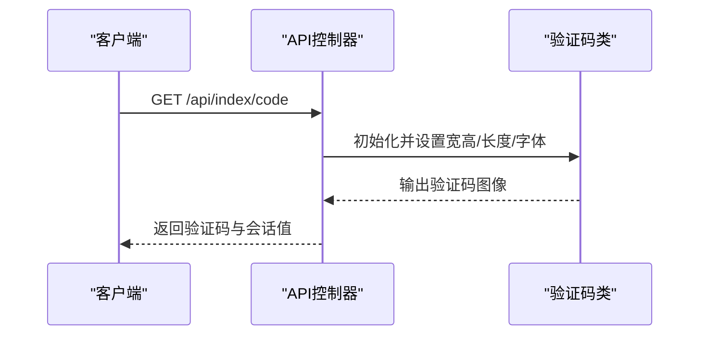
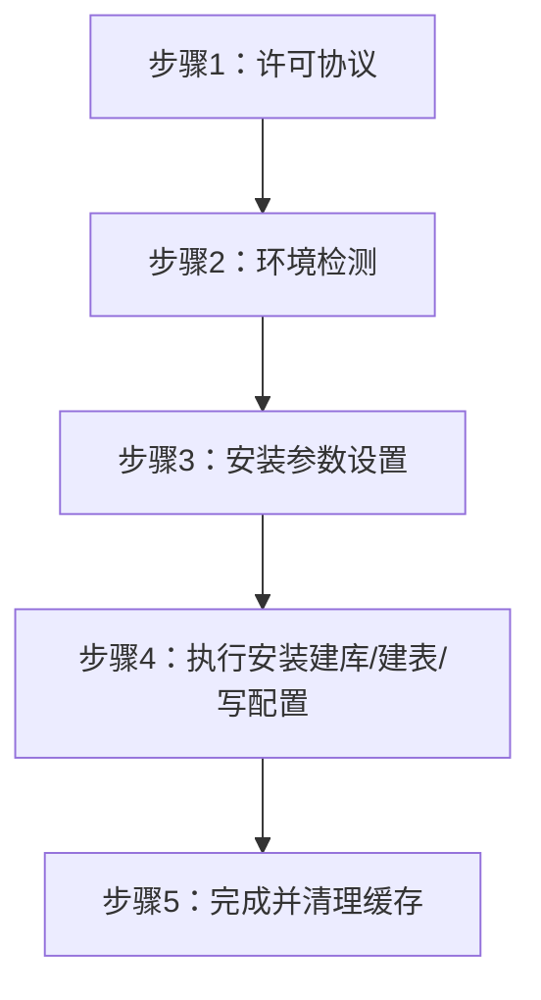
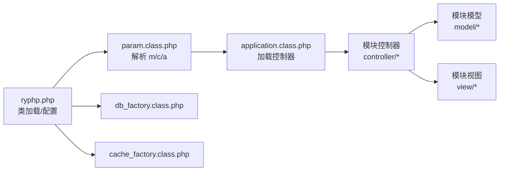
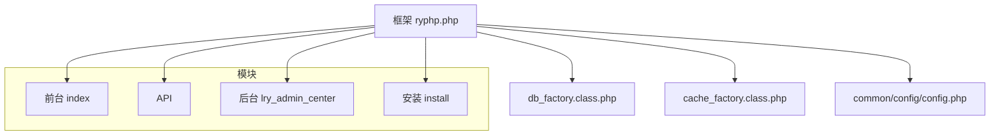

# 模块化设计

<cite>
**本文引用的文件**
- [index.php](file://index.php)
- [ryphp.php](file://ryphp/ryphp.php)
- [application.class.php](file://ryphp/core/class/application.class.php)
- [param.class.php](file://ryphp/core/class/param.class.php)
- [config.php](file://common/config/config.php)
- [index.class.php（前台首页控制器）](file://application/index/controller/index.class.php)
- [index.class.php（API验证码控制器）](file://application/api/controller/index.class.php)
- [index.class.php（后台首页控制器）](file://application/lry_admin_center/controller/index.class.php)
- [common.class.php（后台通用控制器）](file://application/lry_admin_center/controller/common.class.php)
- [function.php（后台通用函数）](file://application/lry_admin_center/common/function/function.php)
- [config.php（主题模板配置）](file://application/index/view/rongyao/config.php)
- [index.php（安装向导入口）](file://application/install/index.php)
- [db_factory.class.php](file://ryphp/core/class/db_factory.class.php)
- [cache_factory.class.php](file://ryphp/core/class/cache_factory.class.php)
</cite>

## 目录
1. [引言](#引言)
2. [项目结构](#项目结构)
3. [核心组件](#核心组件)
4. [架构总览](#架构总览)
5. [详细组件分析](#详细组件分析)
6. [依赖分析](#依赖分析)
7. [性能考虑](#性能考虑)
8. [故障排查指南](#故障排查指南)
9. [结论](#结论)
10. [附录](#附录)

## 引言
本文件围绕 LRYBlog 系统的模块化设计展开，目标是阐明系统如何通过模块化实现功能解耦与代码复用，明确前台展示、后台管理、API 接口、安装向导四大模块的职责边界与交互方式；解释模块加载机制、命名空间与路由约定、共享资源策略；总结模块化对性能、可维护性与可扩展性的积极影响，并给出模块开发最佳实践与常见问题排查建议。

## 项目结构
LRYBlog 采用“模块即目录”的组织方式，每个模块包含 controller、model、view 三层结构，配合公共资源与框架核心类，形成清晰的分层与隔离：
- 应用入口统一指向 index.php，随后由框架引导至对应模块的控制器。
- 模块目录位于 application/<模块名>/，如 application/index、application/api、application/lry_admin_center、application/install。
- 公共资源与配置位于 common/ 与 common/config/config.php。
- 框架核心位于 ryphp/，包含类加载、路由、数据库与缓存工厂等基础设施。

图表来源
- [index.php](file://index.php#L1-L18)
- [ryphp.php](file://ryphp/ryphp.php#L83-L202)
- [application.class.php](file://ryphp/core/class/application.class.php#L4-L65)
- [param.class.php](file://ryphp/core/class/param.class.php#L3-L46)
- [config.php](file://common/config/config.php#L1-L88)

章节来源
- [index.php](file://index.php#L1-L18)
- [ryphp.php](file://ryphp/ryphp.php#L1-L204)
- [application.class.php](file://ryphp/core/class/application.class.php#L1-L118)
- [param.class.php](file://ryphp/core/class/param.class.php#L1-L195)
- [config.php](file://common/config/config.php#L1-L88)

## 核心组件
- 框架入口与类加载
  - 入口文件加载框架核心，定义全局常量与路径，随后初始化应用。
  - 框架提供 load_sys_class、load_controller、load_model 等静态方法，统一类加载与单例缓存。
- 应用调度与路由
  - application.class.php 负责错误处理注册、路由参数获取与控制器加载调用。
  - param.class.php 解析 URL 参数、PATHINFO、路由映射，生成 m/c/a 三段路由。
- 配置中心
  - common/config/config.php 统一管理数据库、缓存、Cookie、URL 模式、路由映射等全局配置。
- 数据与缓存
  - db_factory.class.php 根据配置选择具体数据库实现并实例化连接。
  - cache_factory.class.php 根据配置选择 file/redis/memcache 实现并提供缓存实例。

章节来源
- [ryphp.php](file://ryphp/ryphp.php#L83-L202)
- [application.class.php](file://ryphp/core/class/application.class.php#L4-L65)
- [param.class.php](file://ryphp/core/class/param.class.php#L19-L195)
- [config.php](file://common/config/config.php#L1-L88)
- [db_factory.class.php](file://ryphp/core/class/db_factory.class.php#L1-L50)
- [cache_factory.class.php](file://ryphp/core/class/cache_factory.class.php#L1-L84)

## 架构总览
LRYBlog 的模块化架构遵循“入口统一、按模块调度、按需加载”的原则。模块之间通过约定的路由与控制器命名进行解耦，共享资源通过公共配置与工厂类集中管理。

图表来源
- [index.php](file://index.php#L1-L18)
- [ryphp.php](file://ryphp/ryphp.php#L83-L202)
- [application.class.php](file://ryphp/core/class/application.class.php#L24-L40)
- [param.class.php](file://ryphp/core/class/param.class.php#L95-L116)

## 详细组件分析

### 前台展示模块（application/index）
- 职责
  - 负责用户界面渲染与内容展示，使用主题模板（application/index/view/<主题>/）。
  - 通过控制器接收路由参数，调用模型查询数据，渲染对应模板。
- 关键点
  - 控制器入口与参数处理：[index.class.php（前台首页控制器）](file://application/index/controller/index.class.php#L1-L18)
  - 主题模板配置：[config.php（主题模板配置）](file://application/index/view/rongyao/config.php#L1-L29)
  - 模板与视图分离，便于主题切换与复用。

图表来源
- [index.class.php（前台首页控制器）](file://application/index/controller/index.class.php#L14-L17)
- [config.php（主题模板配置）](file://application/index/view/rongyao/config.php#L1-L29)

章节来源
- [index.class.php（前台首页控制器）](file://application/index/controller/index.class.php#L1-L18)
- [config.php（主题模板配置）](file://application/index/view/rongyao/config.php#L1-L29)

### 后台管理模块（application/lry_admin_center）
- 职责
  - 管理员登录、权限控制、系统配置、内容管理等后台功能。
  - 通过 common.class.php 提供统一的安全检查与模板路径解析。
- 关键点
  - 登录与权限校验：[index.class.php（后台首页控制器）](file://application/lry_admin_center/controller/index.class.php#L19-L38)
  - 安全校验与会话控制：[common.class.php（后台通用控制器）](file://application/lry_admin_center/controller/common.class.php#L32-L50)
  - URL 生成与菜单构建：[function.php（后台通用函数）](file://application/lry_admin_center/common/function/function.php#L3-L28)

图表来源
- [index.class.php（后台首页控制器）](file://application/lry_admin_center/controller/index.class.php#L19-L38)
- [common.class.php（后台通用控制器）](file://application/lry_admin_center/controller/common.class.php#L32-L50)
- [function.php（后台通用函数）](file://application/lry_admin_center/common/function/function.php#L3-L28)

章节来源
- [index.class.php（后台首页控制器）](file://application/lry_admin_center/controller/index.class.php#L1-L162)
- [common.class.php（后台通用控制器）](file://application/lry_admin_center/controller/common.class.php#L1-L153)
- [function.php（后台通用函数）](file://application/lry_admin_center/common/function/function.php#L1-L162)

### API 接口模块（application/api）
- 职责
  - 对外提供接口能力，如验证码生成等。
- 关键点
  - 接口控制器示例：[index.class.php（API验证码控制器）](file://application/api/controller/index.class.php#L1-L22)
  - 通过框架类加载与会话管理实现接口逻辑。

图表来源
- [index.class.php（API验证码控制器）](file://application/api/controller/index.class.php#L6-L17)

章节来源
- [index.class.php（API验证码控制器）](file://application/api/controller/index.class.php#L1-L22)

### 安装向导模块（application/install）
- 职责
  - 系统首次部署的安装流程，包括环境检测、数据库初始化、管理员创建、配置写入等。
- 关键点
  - 步骤化流程与模板渲染：[index.php（安装向导入口）](file://application/install/index.php#L45-L275)
  - 数据库连接与建表：[index.php（安装向导入口）](file://application/install/index.php#L157-L219)
  - 配置文件写入：[index.php（安装向导入口）](file://application/install/index.php#L255-L259)

图表来源
- [index.php（安装向导入口）](file://application/install/index.php#L31-L37)
- [index.php（安装向导入口）](file://application/install/index.php#L132-L260)

章节来源
- [index.php（安装向导入口）](file://application/install/index.php#L1-L373)

### 模块间通信与依赖关系
- 路由与调度
  - 路由参数 m/c/a 由 param.class.php 解析，application.class.php 根据模块目录加载对应控制器。
- 类加载与命名空间
  - ryphp::load_controller/load_model 通过模块名拼接路径，实现模块级隔离。
- 共享资源
  - 配置通过 C() 读取，数据库与缓存通过工厂类统一获取，避免跨模块重复实现。

图表来源
- [param.class.php](file://ryphp/core/class/param.class.php#L19-L46)
- [application.class.php](file://ryphp/core/class/application.class.php#L48-L65)
- [ryphp.php](file://ryphp/ryphp.php#L108-L202)
- [db_factory.class.php](file://ryphp/core/class/db_factory.class.php#L11-L49)
- [cache_factory.class.php](file://ryphp/core/class/cache_factory.class.php#L36-L82)

章节来源
- [param.class.php](file://ryphp/core/class/param.class.php#L1-L195)
- [application.class.php](file://ryphp/core/class/application.class.php#L1-L118)
- [ryphp.php](file://ryphp/ryphp.php#L83-L202)
- [db_factory.class.php](file://ryphp/core/class/db_factory.class.php#L1-L50)
- [cache_factory.class.php](file://ryphp/core/class/cache_factory.class.php#L1-L84)

## 依赖分析
- 模块耦合度
  - 控制器依赖于 param 路由与 ryphp 类加载；模型与视图独立于其他模块，耦合度低。
- 外部依赖
  - 数据库：通过 db_factory 适配 pdo/mysqli/mysql。
  - 缓存：通过 cache_factory 适配 file/redis/memcache。
- 循环依赖
  - 无直接循环依赖，类加载采用单例缓存避免重复实例化。

图表来源
- [ryphp.php](file://ryphp/ryphp.php#L83-L202)
- [db_factory.class.php](file://ryphp/core/class/db_factory.class.php#L1-L50)
- [cache_factory.class.php](file://ryphp/core/class/cache_factory.class.php#L1-L84)
- [config.php](file://common/config/config.php#L1-L88)

章节来源
- [ryphp.php](file://ryphp/ryphp.php#L83-L202)
- [db_factory.class.php](file://ryphp/core/class/db_factory.class.php#L1-L50)
- [cache_factory.class.php](file://ryphp/core/class/cache_factory.class.php#L1-L84)
- [config.php](file://common/config/config.php#L1-L88)

## 性能考虑
- 类加载缓存
  - 框架内部对已加载类进行缓存，减少重复 include 开销。
- 路由解析
  - PATHINFO 模式下解析成本较低，结合路由映射可进一步简化 URL。
- 数据库与缓存
  - 工厂模式按配置选择最优实现，建议生产环境优先使用 redis/memcache。
- 模板渲染
  - 主题模板与视图分离，利于缓存静态片段与压缩输出。

## 故障排查指南
- 路由错误
  - 检查 URL 模型与路由映射配置，确认 m/c/a 参数是否符合安全过滤规则。
- 控制器不存在
  - 确认模块目录与控制器文件命名一致，且类名与文件名匹配。
- 数据库连接失败
  - 核对 common/config/config.php 中数据库配置，检查 db_factory 选择的实现。
- 缓存不可用
  - 检查 cache_factory 配置与目标缓存服务可用性。
- 安装向导异常
  - 关注安装脚本中的环境检测与 SQL 执行日志，确认权限与网络可达性。

章节来源
- [application.class.php](file://ryphp/core/class/application.class.php#L108-L115)
- [param.class.php](file://ryphp/core/class/param.class.php#L54-L60)
- [config.php](file://common/config/config.php#L13-L21)
- [index.php（安装向导入口）](file://application/install/index.php#L157-L219)

## 结论
LRYBlog 的模块化设计通过“统一入口、约定路由、按模块调度、工厂抽象共享资源”实现了良好的解耦与复用。前台、后台、API、安装向导四大模块职责清晰、边界明确，配合配置中心与工厂类，既保证了开发效率，也为后续的功能扩展与维护升级提供了坚实基础。

## 附录
- 模块开发最佳实践
  - 严格遵循 m/c/a 路由约定，控制器只做调度与参数校验。
  - 模型专注数据访问与业务逻辑封装，避免在控制器中直接拼接 SQL。
  - 视图模板与逻辑分离，使用主题配置实现风格切换。
  - 使用工厂类与配置中心管理数据库与缓存，避免硬编码。
  - 后台模块统一继承通用控制器，复用安全校验与模板路径工具。
- 模块间数据传递与状态同步
  - 通过会话（Session）与 Cookie 在后台模块中保持登录状态与权限上下文。
  - 通过 URL 参数与路由映射在前台与 API 模块中传递业务参数。
  - 通过公共配置与缓存工厂在模块间共享系统级状态与资源。