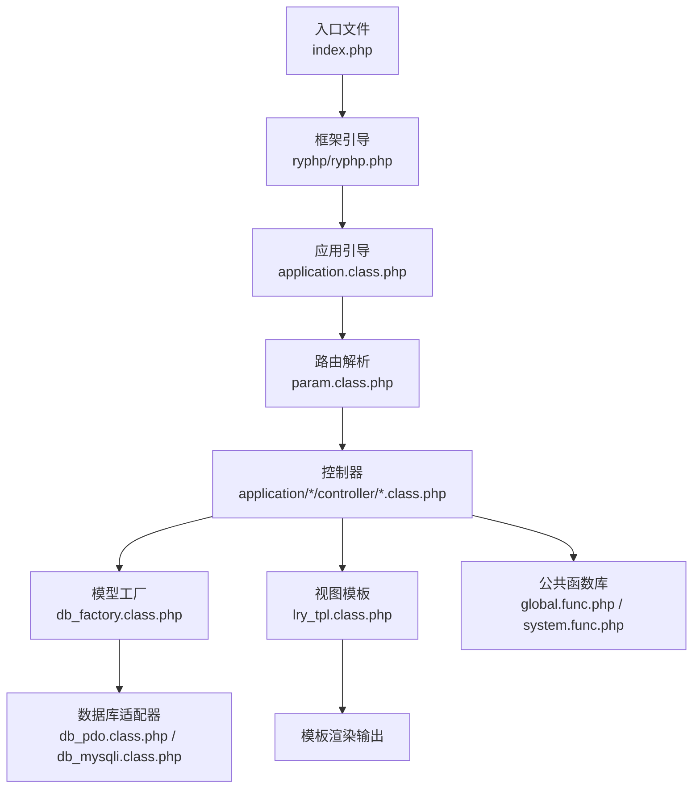
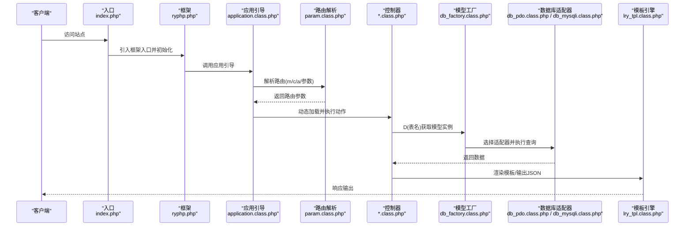
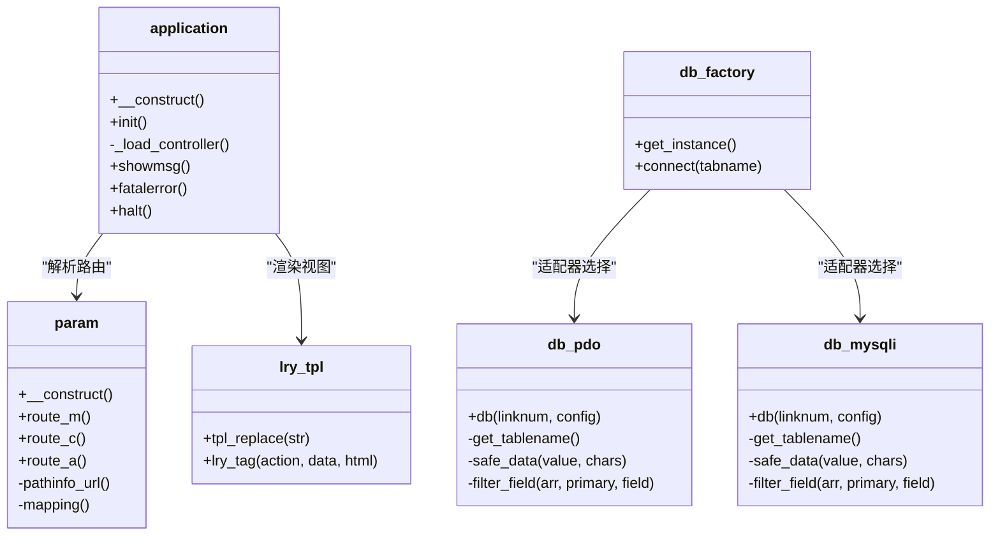
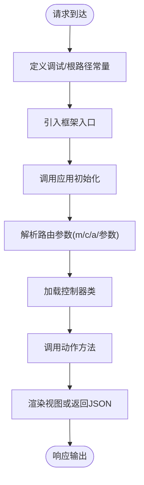
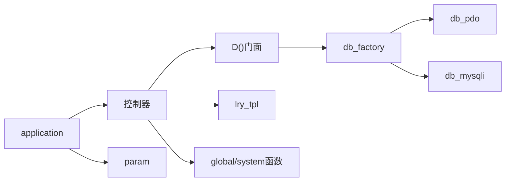
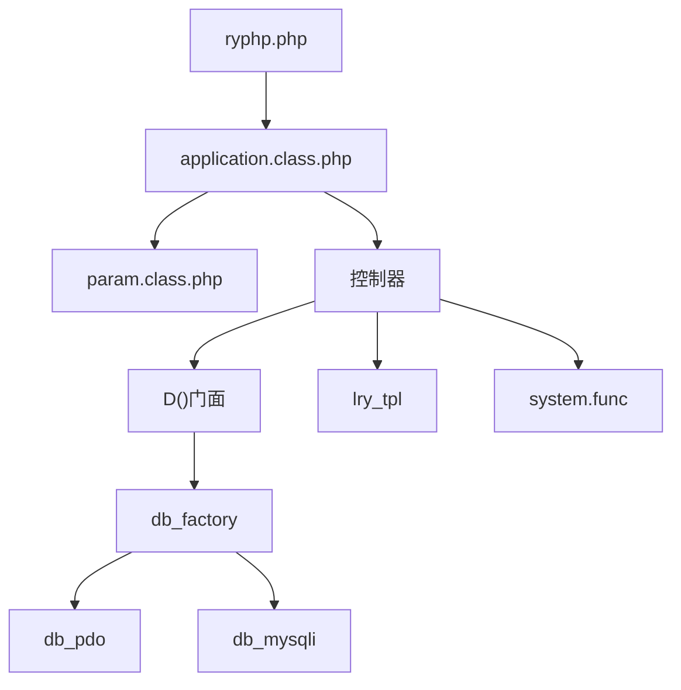

# 系统架构

<cite>
**本文引用的文件**
- [index.php](file://index.php)
- [ryphp.php](file://ryphp/ryphp.php)
- [application.class.php](file://ryphp/core/class/application.class.php)
- [param.class.php](file://ryphp/core/class/param.class.php)
- [global.func.php](file://ryphp/core/function/global.func.php)
- [system.func.php](file://common/function/system.func.php)
- [db_factory.class.php](file://ryphp/core/class/db_factory.class.php)
- [db_mysqli.class.php](file://ryphp/core/class/db_mysqli.class.php)
- [db_pdo.class.php](file://ryphp/core/class/db_pdo.class.php)
- [lry_tpl.class.php](file://ryphp/core/class/lry_tpl.class.php)
- [index.class.php（前台首页控制器）](file://application/index/controller/index.class.php)
- [index.class.php（后台首页控制器）](file://application/lry_admin_center/controller/index.class.php)
- [index.class.php（API验证码控制器）](file://application/api/controller/index.class.php)
- [index.php（安装向导入口）](file://application/install/index.php)
</cite>

## 目录
1. [引言](#引言)
2. [项目结构](#项目结构)
3. [核心组件](#核心组件)
4. [架构总览](#架构总览)
5. [详细组件分析](#详细组件分析)
6. [依赖分析](#依赖分析)
7. [性能考量](#性能考量)
8. [故障排查指南](#故障排查指南)
9. [结论](#结论)
10. [附录](#附录)

## 引言
本文件面向LRYBlog系统，围绕其基于自研RYPHP框架的MVC架构展开，系统性阐述控制器、模型、视图三层结构的设计理念与实现方式；详解从入口文件到框架引导、路由解析、请求处理与响应生成的完整流程；明确模块化设计原则与各模块职责边界；分析组件间依赖关系与数据流；总结技术决策、权衡与扩展性设计，并提供架构图与组件交互示意，帮助开发者深入理解系统内部工作机制。

## 项目结构
LRYBlog采用典型的多模块MVC组织方式：
- 入口层：index.php负责常量定义、框架引导与应用初始化
- 框架内核：ryphp/ryphp.php定义系统常量、加载器与全局函数入口
- 应用层：application/下按模块划分，每个模块包含controller/model/view/common
- 公共层：common/存放通用函数、静态资源与配置
- 安装向导：application/install/提供一键安装流程
- 视图模板：application/*/view/下按主题组织模板文件

**图表来源**
- [index.php](file://index.php#L1-L18)
- [ryphp.php](file://ryphp/ryphp.php#L1-L204)
- [application.class.php](file://ryphp/core/class/application.class.php#L1-L118)
- [param.class.php](file://ryphp/core/class/param.class.php#L1-L151)
- [db_factory.class.php](file://ryphp/core/class/db_factory.class.php#L1-L50)
- [db_pdo.class.php](file://ryphp/core/class/db_pdo.class.php#L1-L98)
- [db_mysqli.class.php](file://ryphp/core/class/db_mysqli.class.php#L1-L125)
- [lry_tpl.class.php](file://ryphp/core/class/lry_tpl.class.php#L1-L134)
- [global.func.php](file://ryphp/core/function/global.func.php#L1-L800)
- [system.func.php](file://common/function/system.func.php#L1-L969)

**章节来源**
- [index.php](file://index.php#L1-L18)
- [ryphp.php](file://ryphp/ryphp.php#L1-L204)

## 核心组件
- 入口与引导
  - index.php：定义调试与根路径常量，引入框架入口，设置URL模式并触发应用初始化
  - ryphp.php：定义系统常量、时区、路径、静态资源URL、加载系统函数与类、提供统一加载器
  - application.class.php：注册错误/异常处理器，解析路由参数，加载并执行控制器动作
  - param.class.php：解析PATH_INFO风格URL，支持路由映射与键值对参数提取
- 模型层
  - db_factory.class.php：根据配置选择数据库适配器（PDO/MySQLi/MySQL），统一连接与实例化
  - db_pdo.class.php / db_mysqli.class.php：封装查询构建、字段过滤、安全处理与连接管理
  - global.func.php中的D()：模型门面，按表名获取模型实例，复用连接与配置
- 视图与模板
  - lry_tpl.class.php：模板标签解析、循环/条件/函数调用等语法转换，最终生成PHP模板
  - system.func.php中的模板主题与SEO辅助函数：提供主题列表、URL生成、位置导航等
- 控制器层
  - application/*/controller/*.class.php：按模块组织，接收参数、调用模型、渲染视图或返回JSON

**章节来源**
- [ryphp.php](file://ryphp/ryphp.php#L1-L204)
- [application.class.php](file://ryphp/core/class/application.class.php#L1-L118)
- [param.class.php](file://ryphp/core/class/param.class.php#L1-L151)
- [db_factory.class.php](file://ryphp/core/class/db_factory.class.php#L1-L50)
- [db_pdo.class.php](file://ryphp/core/class/db_pdo.class.php#L1-L98)
- [db_mysqli.class.php](file://ryphp/core/class/db_mysqli.class.php#L1-L125)
- [lry_tpl.class.php](file://ryphp/core/class/lry_tpl.class.php#L1-L134)
- [global.func.php](file://ryphp/core/function/global.func.php#L100-L108)
- [system.func.php](file://common/function/system.func.php#L1-L969)

## 架构总览
LRYBlog采用“入口文件 → 框架引导 → 应用引导 → 路由解析 → 控制器执行 → 模型/视图 → 响应输出”的线性流水线。URL模式由常量控制，支持PATH_INFO风格与多种路由模式；控制器负责业务编排，模型负责数据访问，视图负责渲染输出。

**图表来源**
- [index.php](file://index.php#L1-L18)
- [ryphp.php](file://ryphp/ryphp.php#L83-L204)
- [application.class.php](file://ryphp/core/class/application.class.php#L9-L40)
- [param.class.php](file://ryphp/core/class/param.class.php#L7-L15)
- [db_factory.class.php](file://ryphp/core/class/db_factory.class.php#L11-L49)
- [db_pdo.class.php](file://ryphp/core/class/db_pdo.class.php#L45-L98)
- [db_mysqli.class.php](file://ryphp/core/class/db_mysqli.class.php#L64-L125)
- [lry_tpl.class.php](file://ryphp/core/class/lry_tpl.class.php#L31-L59)

## 详细组件分析

### MVC三层结构设计与实现
- 控制器（Controller）
  - 职责：接收请求参数、调用模型、渲染视图或返回JSON、处理会话与权限
  - 实现：application/*/controller/*.class.php，遵循模块化命名空间，动作方法公开可访问
  - 示例：
    - 前台首页控制器：接收分页参数，查询分类数据
    - 后台首页控制器：继承公共基类，处理登录、退出、锁屏/解锁、统计信息等
    - API验证码控制器：生成验证码图片并写入会话
- 模型（Model）
  - 职责：封装数据访问、查询构建、字段过滤与安全处理
  - 实现：db_factory按配置选择PDO/MySQLi适配器；D()门面按表名获取实例；适配器提供链式查询与安全过滤
- 视图（View）
  - 职责：模板解析、标签语法转换、输出HTML或JSON
  - 实现：lry_tpl.class.php将模板标签转换为PHP代码；system.func.php提供主题与SEO辅助函数

**图表来源**
- [application.class.php](file://ryphp/core/class/application.class.php#L4-L118)
- [param.class.php](file://ryphp/core/class/param.class.php#L1-L151)
- [db_factory.class.php](file://ryphp/core/class/db_factory.class.php#L1-L50)
- [db_pdo.class.php](file://ryphp/core/class/db_pdo.class.php#L1-L98)
- [db_mysqli.class.php](file://ryphp/core/class/db_mysqli.class.php#L1-L125)
- [lry_tpl.class.php](file://ryphp/core/class/lry_tpl.class.php#L1-L134)

**章节来源**
- [application/index/controller/index.class.php](file://application/index/controller/index.class.php#L1-L18)
- [application/lry_admin_center/controller/index.class.php](file://application/lry_admin_center/controller/index.class.php#L1-L162)
- [application/api/controller/index.class.php](file://application/api/controller/index.class.php#L1-L22)
- [db_factory.class.php](file://ryphp/core/class/db_factory.class.php#L1-L50)
- [db_pdo.class.php](file://ryphp/core/class/db_pdo.class.php#L45-L98)
- [db_mysqli.class.php](file://ryphp/core/class/db_mysqli.class.php#L64-L125)
- [lry_tpl.class.php](file://ryphp/core/class/lry_tpl.class.php#L31-L59)

### 应用启动与路由解析流程
- 启动流程
  - index.php定义常量并引入框架入口
  - ryphp::app_init()加载application类，初始化调试、错误处理与路由参数
  - application构造阶段注册错误/异常处理器，解析路由模块、控制器、动作
  - application::init()动态加载控制器类并调用动作方法
- 路由解析
  - param::pathinfo_url()处理PATH_INFO风格URL，去除HTML后缀与入口脚本，应用路由映射
  - 支持键值对参数解析，如/page/2中的page参数
  - 支持URL模式常量控制不同路由风格

**图表来源**
- [index.php](file://index.php#L10-L18)
- [ryphp.php](file://ryphp/ryphp.php#L83-L90)
- [application.class.php](file://ryphp/core/class/application.class.php#L9-L40)
- [param.class.php](file://ryphp/core/class/param.class.php#L95-L116)

**章节来源**
- [index.php](file://index.php#L1-L18)
- [ryphp.php](file://ryphp/ryphp.php#L83-L90)
- [application.class.php](file://ryphp/core/class/application.class.php#L9-L40)
- [param.class.php](file://ryphp/core/class/param.class.php#L7-L15)

### 模块化设计与职责划分
- 前台展示模块（application/index）
  - 职责：首页列表、分类展示、内容详情等前台页面
  - 关键文件：controller/index.class.php、view/*主题模板
- 后台管理模块（application/lry_admin_center）
  - 职责：登录认证、权限校验、系统配置、内容管理、统计信息等
  - 关键文件：controller/*.class.php、view/*.html
- API接口模块（application/api）
  - 职责：验证码生成、接口鉴权与数据输出
  - 关键文件：controller/index.class.php
- 安装向导模块（application/install）
  - 职责：环境检测、数据库初始化、配置写入、安装锁生成
  - 关键文件：index.php、templates/*、database.sql

**章节来源**
- [index.class.php（前台首页控制器）](file://application/index/controller/index.class.php#L1-L18)
- [index.class.php（后台首页控制器）](file://application/lry_admin_center/controller/index.class.php#L1-L162)
- [index.class.php（API验证码控制器）](file://application/api/controller/index.class.php#L1-L22)
- [index.php（安装向导入口）](file://application/install/index.php#L1-L373)

### 组件间依赖关系与数据流
- 控制器依赖模型工厂与数据库适配器，通过D()门面获取模型实例
- 控制器依赖模板引擎进行视图渲染，或直接输出JSON
- 公共函数库提供配置读取、URL生成、SEO处理、缓存等能力
- 路由解析为控制器加载提供模块、控制器、动作与参数

**图表来源**
- [global.func.php](file://ryphp/core/function/global.func.php#L100-L108)
- [db_factory.class.php](file://ryphp/core/class/db_factory.class.php#L11-L49)
- [db_pdo.class.php](file://ryphp/core/class/db_pdo.class.php#L45-L98)
- [db_mysqli.class.php](file://ryphp/core/class/db_mysqli.class.php#L64-L125)
- [lry_tpl.class.php](file://ryphp/core/class/lry_tpl.class.php#L31-L59)
- [application.class.php](file://ryphp/core/class/application.class.php#L14-L18)
- [param.class.php](file://ryphp/core/class/param.class.php#L7-L15)

**章节来源**
- [global.func.php](file://ryphp/core/function/global.func.php#L1-L800)
- [system.func.php](file://common/function/system.func.php#L1-L969)

## 依赖分析
- 框架引导与加载
  - ryphp.php提供统一加载器与常量定义，application.class.php注册错误处理与路由解析
- 路由与URL模式
  - param.class.php支持PATH_INFO风格路由与映射，URL_MODE常量控制不同模式
- 数据访问抽象
  - db_factory按配置选择PDO/MySQLi适配器，统一连接与查询接口
- 视图渲染
  - lry_tpl将模板标签转换为PHP，配合system.func.php的主题与SEO函数

**图表来源**
- [ryphp.php](file://ryphp/ryphp.php#L1-L204)
- [application.class.php](file://ryphp/core/class/application.class.php#L1-L118)
- [param.class.php](file://ryphp/core/class/param.class.php#L1-L151)
- [db_factory.class.php](file://ryphp/core/class/db_factory.class.php#L1-L50)
- [db_pdo.class.php](file://ryphp/core/class/db_pdo.class.php#L1-L98)
- [db_mysqli.class.php](file://ryphp/core/class/db_mysqli.class.php#L1-L125)
- [lry_tpl.class.php](file://ryphp/core/class/lry_tpl.class.php#L1-L134)
- [system.func.php](file://common/function/system.func.php#L1-L969)

**章节来源**
- [ryphp.php](file://ryphp/ryphp.php#L1-L204)
- [application.class.php](file://ryphp/core/class/application.class.php#L1-L118)
- [param.class.php](file://ryphp/core/class/param.class.php#L1-L151)
- [db_factory.class.php](file://ryphp/core/class/db_factory.class.php#L1-L50)

## 性能考量
- 路由解析
  - PATH_INFO模式与路由映射结合，减少冗余参数传递，提升URL可读性与SEO友好性
- 数据访问
  - 模型门面复用连接与实例，降低重复初始化成本；适配器内置字段过滤与安全处理，减少SQL注入风险
- 模板渲染
  - lry_tpl将模板标签预编译为PHP，减少运行时解析开销；配合缓存函数可进一步优化
- 配置与缓存
  - 全局配置与常用数据通过缓存函数读取，避免重复IO与计算

[本节为通用性能建议，无需特定文件引用]

## 故障排查指南
- 错误处理
  - application::halt()在非调试模式下输出自定义错误页或状态码
  - fatalerror()在致命错误时输出错误模板并终止
- 日志与调试
  - global.func.php提供调试函数与错误日志写入，便于定位问题
- 常见问题
  - 控制器不存在：检查模块/控制器/动作路径与命名
  - 路由映射无效：确认URL模式与映射规则配置
  - 数据库连接失败：检查db_factory配置与适配器选择

**章节来源**
- [application.class.php](file://ryphp/core/class/application.class.php#L77-L115)
- [global.func.php](file://ryphp/core/function/global.func.php#L477-L483)

## 结论
LRYBlog基于RYPHP框架实现了清晰的MVC分层与模块化设计，入口文件到应用引导、路由解析、控制器执行与视图渲染的流程完整且可扩展。通过模型门面与数据库适配器抽象，系统具备良好的数据访问一致性；通过模板引擎与公共函数库，提升了视图渲染与业务辅助能力。整体架构在可维护性、可扩展性与性能之间取得平衡，适合持续演进与二次开发。

## 附录
- URL模式与路由映射
  - URL_MODE常量控制路由风格；param.class.php支持PATH_INFO与映射规则
- 安装向导
  - application/install提供环境检测、数据库初始化与配置写入，安装完成后生成锁文件

**章节来源**
- [index.php](file://index.php#L16-L18)
- [param.class.php](file://ryphp/core/class/param.class.php#L95-L151)
- [index.php（安装向导入口）](file://application/install/index.php#L1-L373)