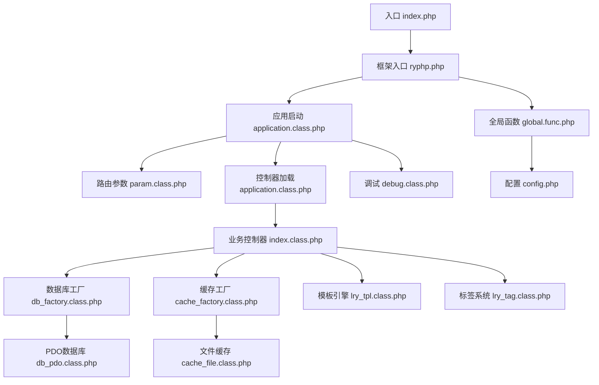
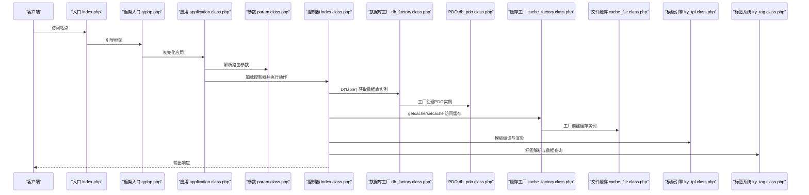
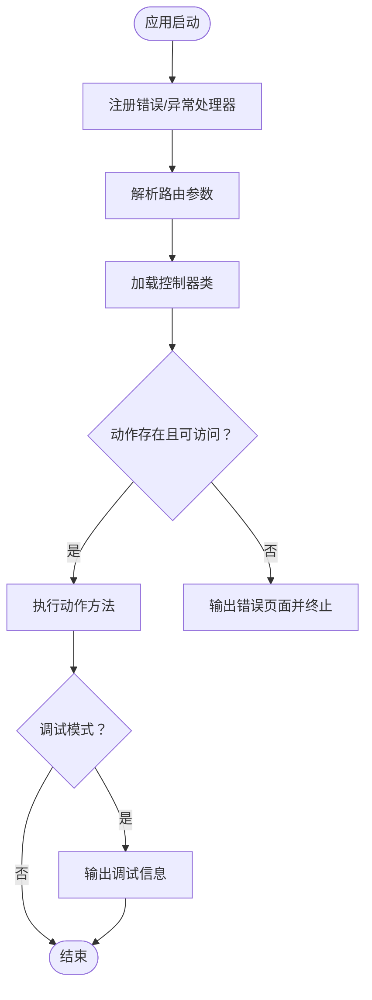
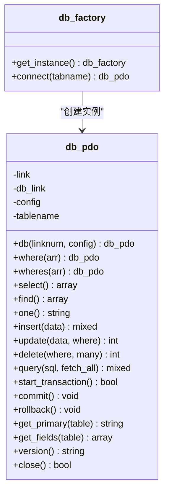
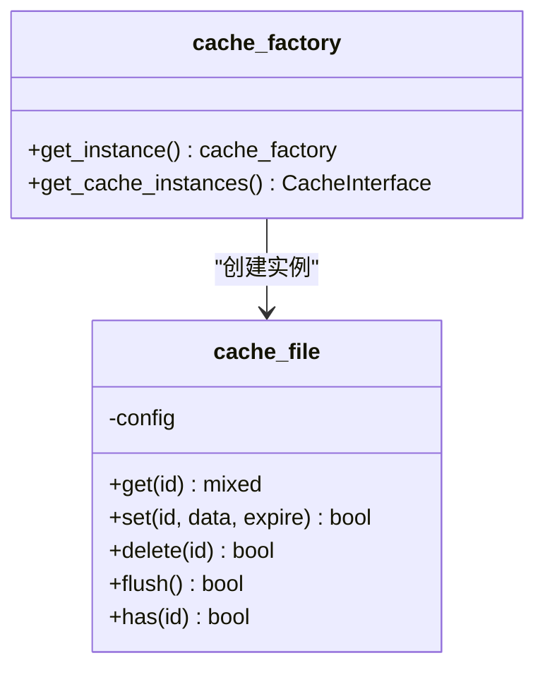
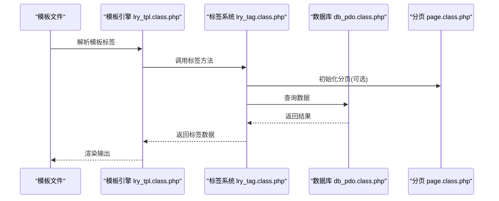
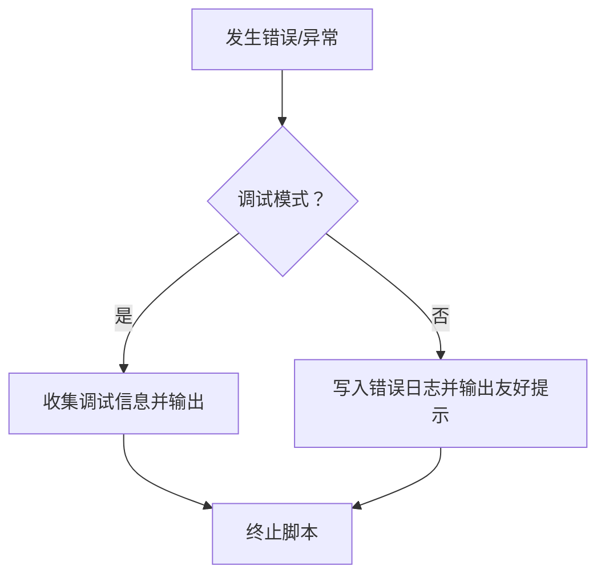
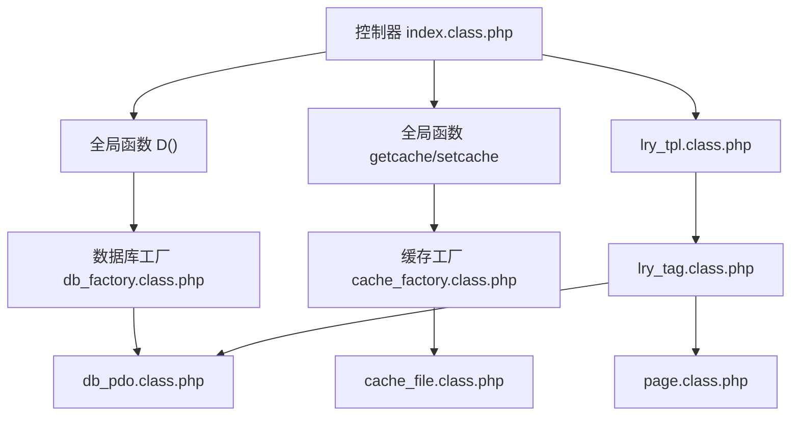

# 组件交互机制

<cite>
**本文引用的文件**
- [index.php](file://index.php)
- [ryphp.php](file://ryphp/ryphp.php)
- [application.class.php](file://ryphp/core/class/application.class.php)
- [param.class.php](file://ryphp/core/class/param.class.php)
- [db_factory.class.php](file://ryphp/core/class/db_factory.class.php)
- [db_pdo.class.php](file://ryphp/core/class/db_pdo.class.php)
- [cache_factory.class.php](file://ryphp/core/class/cache_factory.class.php)
- [cache_file.class.php](file://ryphp/core/class/cache_file.class.php)
- [lry_tpl.class.php](file://ryphp/core/class/lry_tpl.class.php)
- [lry_tag.class.php](file://ryphp/core/class/lry_tag.class.php)
- [debug.class.php](file://ryphp/core/class/debug.class.php)
- [global.func.php](file://ryphp/core/function/global.func.php)
- [config.php](file://common/config/config.php)
- [index.class.php](file://application/index/controller/index.class.php)
</cite>

## 目录
1. [引言](#引言)
2. [项目结构](#项目结构)
3. [核心组件](#核心组件)
4. [架构总览](#架构总览)
5. [详细组件分析](#详细组件分析)
6. [依赖关系分析](#依赖关系分析)
7. [性能考量](#性能考量)
8. [故障排查指南](#故障排查指南)
9. [结论](#结论)
10. [附录](#附录)

## 引言
本文件聚焦于LRYBlog系统的组件交互机制，围绕框架核心、数据库、缓存与模板引擎四大组件，系统阐述它们之间的协作关系、依赖注入与生命周期管理、工厂模式实例化、通信协议与数据交换、事件与回调机制、异步支持、性能优化策略（懒加载、缓存共享、资源池）、以及故障处理与错误传播。文档同时提供时序图与流程图，帮助开发者快速理解复杂交互。

## 项目结构
LRYBlog采用典型的MVC结构，入口文件负责引导框架初始化，框架层提供路由、控制器加载、模型与视图支持；业务层位于application目录，按模块划分控制器、模型与视图；公共配置与通用函数位于common与ryphp目录。

图表来源
- [index.php](file://index.php#L1-L18)
- [ryphp.php](file://ryphp/ryphp.php#L83-L204)
- [application.class.php](file://ryphp/core/class/application.class.php#L4-L118)
- [param.class.php](file://ryphp/core/class/param.class.php#L3-L195)
- [db_factory.class.php](file://ryphp/core/class/db_factory.class.php#L1-L50)
- [db_pdo.class.php](file://ryphp/core/class/db_pdo.class.php#L10-L646)
- [cache_factory.class.php](file://ryphp/core/class/cache_factory.class.php#L1-L84)
- [cache_file.class.php](file://ryphp/core/class/cache_file.class.php#L1-L130)
- [lry_tpl.class.php](file://ryphp/core/class/lry_tpl.class.php#L1-L134)
- [lry_tag.class.php](file://ryphp/core/class/lry_tag.class.php#L1-L492)
- [global.func.php](file://ryphp/core/function/global.func.php#L1-L800)
- [config.php](file://common/config/config.php#L1-L88)
- [debug.class.php](file://ryphp/core/class/debug.class.php#L1-L147)

章节来源
- [index.php](file://index.php#L1-L18)
- [ryphp.php](file://ryphp/ryphp.php#L83-L204)

## 核心组件
- 框架核心
  - 入口与引导：入口文件定义常量并调用框架引导，框架入口负责常量定义、函数库加载、类加载器与路由初始化。
  - 应用启动：应用类负责注册错误/异常处理器、参数解析、控制器加载与动作执行。
  - 参数解析：参数类负责路由参数提取、PATH_INFO解析、路由映射与安全处理。
- 数据库组件
  - 工厂模式：数据库工厂根据配置选择具体实现（PDO/Mysqli/MySQL），并延迟实例化数据库连接。
  - ORM风格：PDO类提供链式构建SQL、预处理绑定、事务、统计与元数据查询。
- 缓存组件
  - 工厂模式：缓存工厂根据配置选择文件/Redis/Memcache实现，并延迟实例化缓存实例。
  - 文件缓存：文件缓存提供键值存储、过期控制、序列化/可执行文件两种持久化模式。
- 模板引擎与标签系统
  - 模板引擎：模板类将自定义标签语法编译为PHP代码，支持include、php、if/for/loop、变量输出与标签回调。
  - 标签系统：标签类提供内容列表、分页、导航、链接、TAG、评论、归档等标签能力，内部复用数据库与分页组件。
- 调试与错误处理
  - 调试：统一收集信息、SQL、请求参数，支持开发模式输出与生产模式日志记录。
  - 错误处理：注册致命错误、普通错误与异常处理器，配合应用类的错误页面与状态码输出。

章节来源
- [application.class.php](file://ryphp/core/class/application.class.php#L4-L118)
- [param.class.php](file://ryphp/core/class/param.class.php#L3-L195)
- [db_factory.class.php](file://ryphp/core/class/db_factory.class.php#L1-L50)
- [db_pdo.class.php](file://ryphp/core/class/db_pdo.class.php#L10-L646)
- [cache_factory.class.php](file://ryphp/core/class/cache_factory.class.php#L1-L84)
- [cache_file.class.php](file://ryphp/core/class/cache_file.class.php#L1-L130)
- [lry_tpl.class.php](file://ryphp/core/class/lry_tpl.class.php#L1-L134)
- [lry_tag.class.php](file://ryphp/core/class/lry_tag.class.php#L1-L492)
- [debug.class.php](file://ryphp/core/class/debug.class.php#L1-L147)

## 架构总览
LRYBlog采用“入口引导—应用启动—路由解析—控制器执行”的主流程，业务控制器通过全局函数D()获取数据库实例，通过getcache/setcache访问缓存，通过模板引擎渲染视图。标签系统作为模板标签的后端实现，复用数据库与分页组件。

图表来源
- [index.php](file://index.php#L1-L18)
- [ryphp.php](file://ryphp/ryphp.php#L83-L204)
- [application.class.php](file://ryphp/core/class/application.class.php#L4-L118)
- [param.class.php](file://ryphp/core/class/param.class.php#L3-L195)
- [index.class.php](file://application/index/controller/index.class.php#L1-L18)
- [db_factory.class.php](file://ryphp/core/class/db_factory.class.php#L1-L50)
- [db_pdo.class.php](file://ryphp/core/class/db_pdo.class.php#L10-L646)
- [cache_factory.class.php](file://ryphp/core/class/cache_factory.class.php#L1-L84)
- [cache_file.class.php](file://ryphp/core/class/cache_file.class.php#L1-L130)
- [lry_tpl.class.php](file://ryphp/core/class/lry_tpl.class.php#L1-L134)
- [lry_tag.class.php](file://ryphp/core/class/lry_tag.class.php#L1-L492)

## 详细组件分析

### 框架核心组件
- 入口与引导
  - 入口文件定义调试常量、根路径，引入框架入口并调用应用初始化。
  - 框架入口定义系统常量、时区、静态URL、版本信息，注册全局函数与类加载器。
- 应用启动
  - 注册致命错误、普通错误、异常处理器，解析路由模块/控制器/动作，加载并执行对应动作。
  - 动作执行后根据调试开关输出调试信息。
- 参数解析
  - 支持GET/POST参数与PATH_INFO模式，URL后缀剥离、路由映射、键值对解析，安全过滤。

图表来源
- [application.class.php](file://ryphp/core/class/application.class.php#L4-L118)
- [param.class.php](file://ryphp/core/class/param.class.php#L3-L195)

章节来源
- [index.php](file://index.php#L1-L18)
- [ryphp.php](file://ryphp/ryphp.php#L83-L204)
- [application.class.php](file://ryphp/core/class/application.class.php#L4-L118)
- [param.class.php](file://ryphp/core/class/param.class.php#L3-L195)

### 数据库组件
- 工厂模式与延迟实例化
  - 工厂根据配置选择数据库实现，首次访问时才加载类并创建实例，后续复用。
  - 连接池：PDO类维护静态连接池，支持多连接编号，自动重连与异常恢复。
- ORM风格API
  - 链式构建：where、wheres、field、order、limit、group、having、join等。
  - 预处理与绑定：自动转义与绑定，支持调试输出SQL与执行耗时。
  - 事务：支持事务开启、提交与回滚。
  - 元数据：主键、表字段、表存在性、版本等查询。

图表来源
- [db_factory.class.php](file://ryphp/core/class/db_factory.class.php#L1-L50)
- [db_pdo.class.php](file://ryphp/core/class/db_pdo.class.php#L10-L646)

章节来源
- [db_factory.class.php](file://ryphp/core/class/db_factory.class.php#L1-L50)
- [db_pdo.class.php](file://ryphp/core/class/db_pdo.class.php#L10-L646)

### 缓存组件
- 工厂模式与延迟实例化
  - 工厂根据配置选择缓存实现（文件/Redis/Memcache），首次访问创建缓存实例并缓存。
- 文件缓存
  - 支持过期控制、内容序列化/可执行文件两种持久化模式，提供get/set/delete/flush/has等操作。

图表来源
- [cache_factory.class.php](file://ryphp/core/class/cache_factory.class.php#L1-L84)
- [cache_file.class.php](file://ryphp/core/class/cache_file.class.php#L1-L130)

章节来源
- [cache_factory.class.php](file://ryphp/core/class/cache_factory.class.php#L1-L84)
- [cache_file.class.php](file://ryphp/core/class/cache_file.class.php#L1-L130)

### 模板引擎与标签系统
- 模板引擎
  - 将自定义标签语法编译为PHP代码，支持include、php、if/for/loop、变量输出、函数调用与标签回调。
  - 标签回调中可调用全局函数与缓存接口，实现模板内数据聚合。
- 标签系统
  - 提供内容列表、分页、导航、链接、TAG、评论、归档、搜索等标签，内部通过D()与分页类完成数据查询与分页计算。

图表来源
- [lry_tpl.class.php](file://ryphp/core/class/lry_tpl.class.php#L1-L134)
- [lry_tag.class.php](file://ryphp/core/class/lry_tag.class.php#L1-L492)

章节来源
- [lry_tpl.class.php](file://ryphp/core/class/lry_tpl.class.php#L1-L134)
- [lry_tag.class.php](file://ryphp/core/class/lry_tag.class.php#L1-L492)

### 调试与错误处理
- 调试
  - 收集信息、SQL与请求参数，开发模式输出调试面板，生产模式写入日志。
- 错误处理
  - 注册致命错误、普通错误与异常处理器，配合应用类的错误页面与状态码输出。

图表来源
- [debug.class.php](file://ryphp/core/class/debug.class.php#L1-L147)
- [application.class.php](file://ryphp/core/class/application.class.php#L100-L118)

章节来源
- [debug.class.php](file://ryphp/core/class/debug.class.php#L1-L147)
- [application.class.php](file://ryphp/core/class/application.class.php#L100-L118)

## 依赖关系分析
- 组件耦合与内聚
  - 控制器通过全局函数D()与getcache/setcache间接依赖数据库与缓存工厂，降低对具体实现的耦合。
  - 模板引擎与标签系统通过全局函数与工厂解耦，便于替换实现。
- 直接与间接依赖
  - 控制器直接依赖参数解析与应用类；间接依赖数据库、缓存与模板。
  - 数据库与缓存均通过工厂间接暴露给业务层。
- 循环依赖
  - 未发现循环依赖迹象，组件职责清晰，工厂模式避免了循环引用。

图表来源
- [index.class.php](file://application/index/controller/index.class.php#L1-L18)
- [global.func.php](file://ryphp/core/function/global.func.php#L100-L151)
- [db_factory.class.php](file://ryphp/core/class/db_factory.class.php#L1-L50)
- [cache_factory.class.php](file://ryphp/core/class/cache_factory.class.php#L1-L84)
- [db_pdo.class.php](file://ryphp/core/class/db_pdo.class.php#L10-L646)
- [cache_file.class.php](file://ryphp/core/class/cache_file.class.php#L1-L130)
- [lry_tpl.class.php](file://ryphp/core/class/lry_tpl.class.php#L1-L134)
- [lry_tag.class.php](file://ryphp/core/class/lry_tag.class.php#L1-L492)

章节来源
- [global.func.php](file://ryphp/core/function/global.func.php#L100-L151)
- [db_factory.class.php](file://ryphp/core/class/db_factory.class.php#L1-L50)
- [cache_factory.class.php](file://ryphp/core/class/cache_factory.class.php#L1-L84)
- [lry_tag.class.php](file://ryphp/core/class/lry_tag.class.php#L1-L492)

## 性能考量
- 懒加载
  - 数据库与缓存工厂均采用延迟实例化，首次访问才创建实例，减少启动开销。
- 连接池与预处理
  - 数据库连接池避免频繁建立连接；预处理绑定提升安全性与执行效率。
- 缓存共享
  - 缓存工厂单例持有缓存实例，避免重复初始化；文件缓存支持可执行文件模式，减少反序列化成本。
- 资源池管理
  - 数据库连接池与静态缓存实例共同构成资源池，提高并发场景下的响应速度。
- 调试与监控
  - 开发模式下输出SQL与耗时，辅助定位性能瓶颈；生产模式记录错误日志，保障稳定性。

章节来源
- [db_pdo.class.php](file://ryphp/core/class/db_pdo.class.php#L10-L646)
- [cache_factory.class.php](file://ryphp/core/class/cache_factory.class.php#L1-L84)
- [cache_file.class.php](file://ryphp/core/class/cache_file.class.php#L1-L130)
- [debug.class.php](file://ryphp/core/class/debug.class.php#L1-L147)

## 故障排查指南
- 数据库连接失败
  - 检查配置文件中的数据库类型与连接参数；查看工厂选择的实现是否正确；关注PDO异常与重连逻辑。
- SQL执行错误
  - 查看调试面板中的SQL与耗时；确认预处理绑定参数；检查where/wheres条件构造。
- 缓存读写异常
  - 检查缓存类型与配置；确认文件缓存目录权限与磁盘空间；验证过期时间设置。
- 模板解析错误
  - 检查模板标签语法；确认标签回调中调用的全局函数可用；核对include路径。
- 错误页面与状态码
  - 生产模式下错误会被记录并返回友好提示；可通过调试开关查看详细信息。

章节来源
- [config.php](file://common/config/config.php#L1-L88)
- [db_pdo.class.php](file://ryphp/core/class/db_pdo.class.php#L10-L646)
- [cache_file.class.php](file://ryphp/core/class/cache_file.class.php#L1-L130)
- [lry_tpl.class.php](file://ryphp/core/class/lry_tpl.class.php#L1-L134)
- [application.class.php](file://ryphp/core/class/application.class.php#L100-L118)

## 结论
LRYBlog通过工厂模式与全局函数实现了组件间低耦合、高内聚的交互机制。数据库与缓存采用延迟实例化与连接池/资源池策略，提升性能与稳定性；模板引擎与标签系统通过统一接口与回调机制，实现灵活的数据聚合与渲染。调试与错误处理体系完善，有助于快速定位与解决问题。整体架构清晰、扩展性强，适合进一步演进与定制。

## 附录
- 关键配置项
  - 数据库：类型、主机、端口、用户名、密码、字符集、表前缀。
  - 缓存：类型、文件缓存目录、后缀、持久化模式、Redis/Memcache参数。
  - 路由：默认模块/控制器/动作、路由映射、URL模式与后缀。
- 全局函数
  - D()：数据库工厂入口；getcache()/setcache()：缓存访问；C()：系统配置读取；L()：语言包加载；U()：URL生成。

章节来源
- [config.php](file://common/config/config.php#L1-L88)
- [global.func.php](file://ryphp/core/function/global.func.php#L4-L26)
- [global.func.php](file://ryphp/core/function/global.func.php#L147-L151)
- [global.func.php](file://ryphp/core/function/global.func.php#L4-L26)
- [global.func.php](file://ryphp/core/function/global.func.php#L335-L354)
- [global.func.php](file://ryphp/core/function/global.func.php#L764-L800)