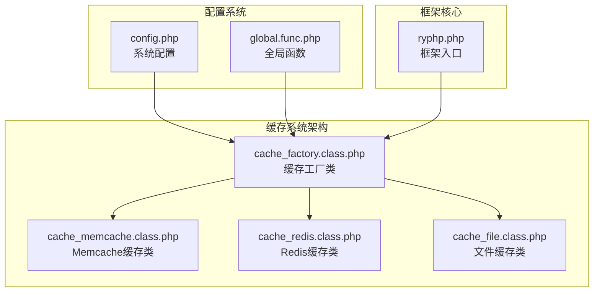
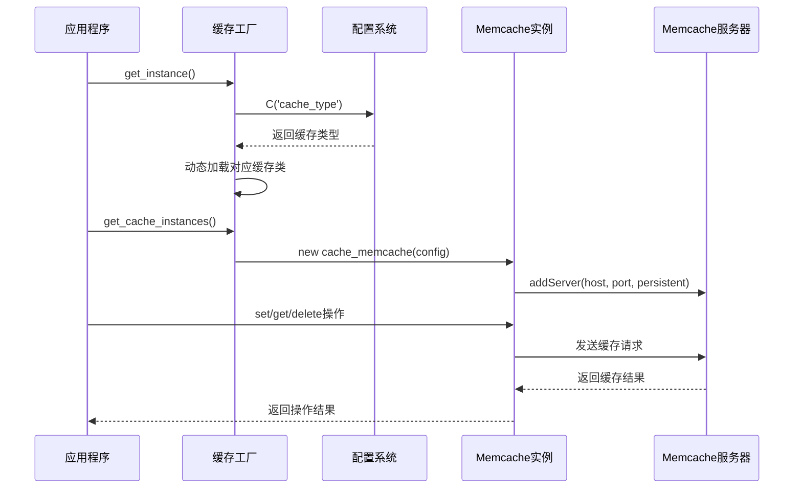
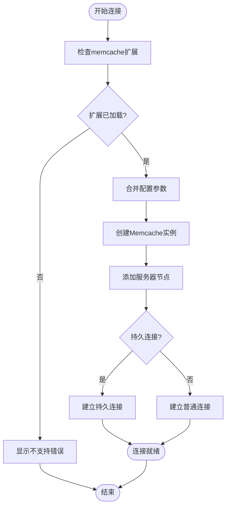
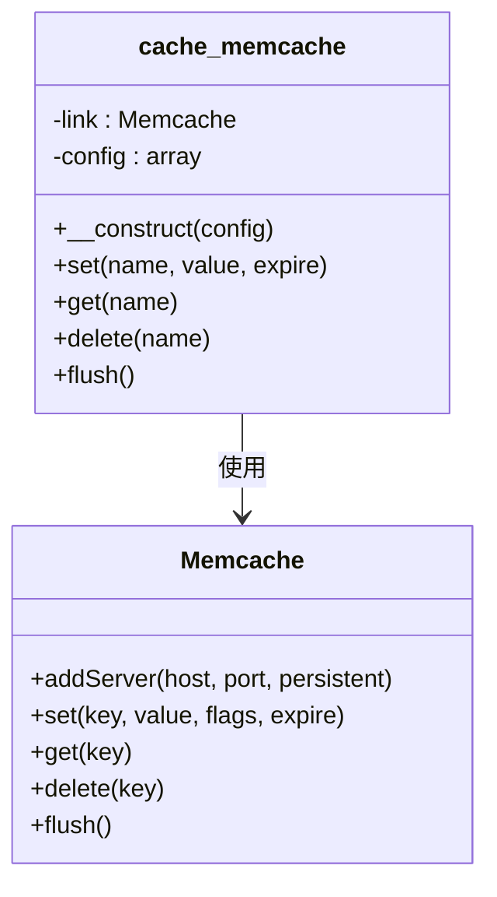
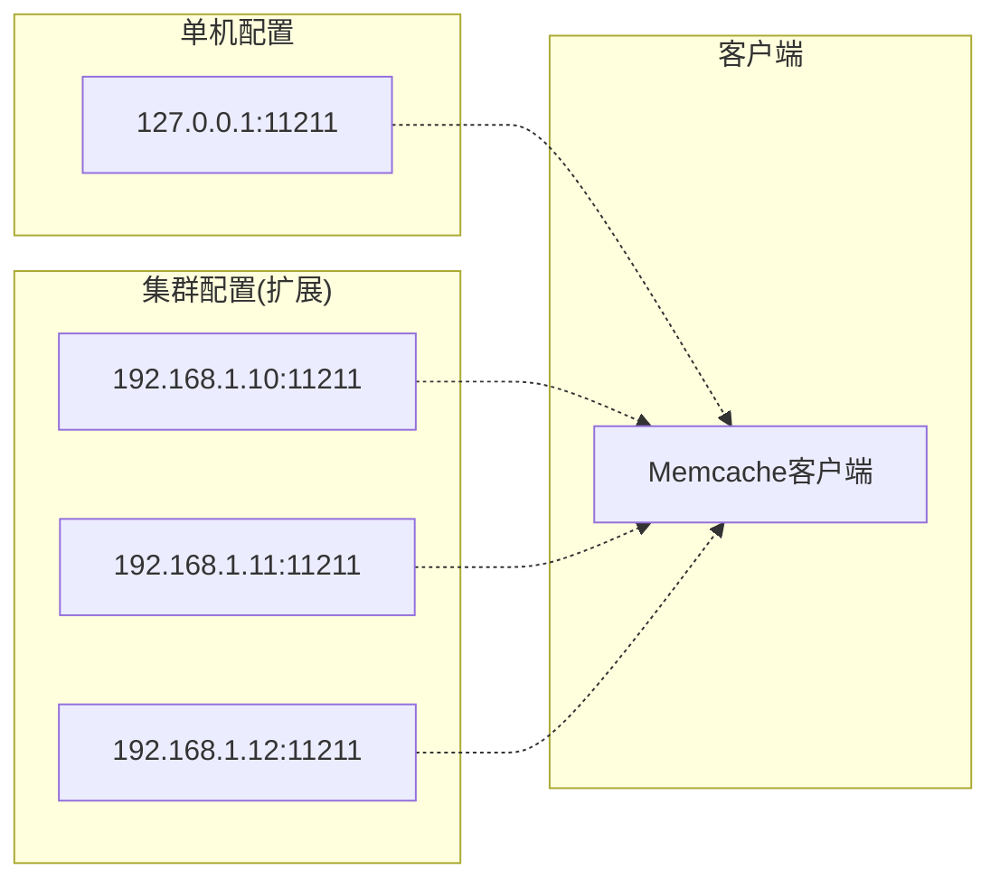
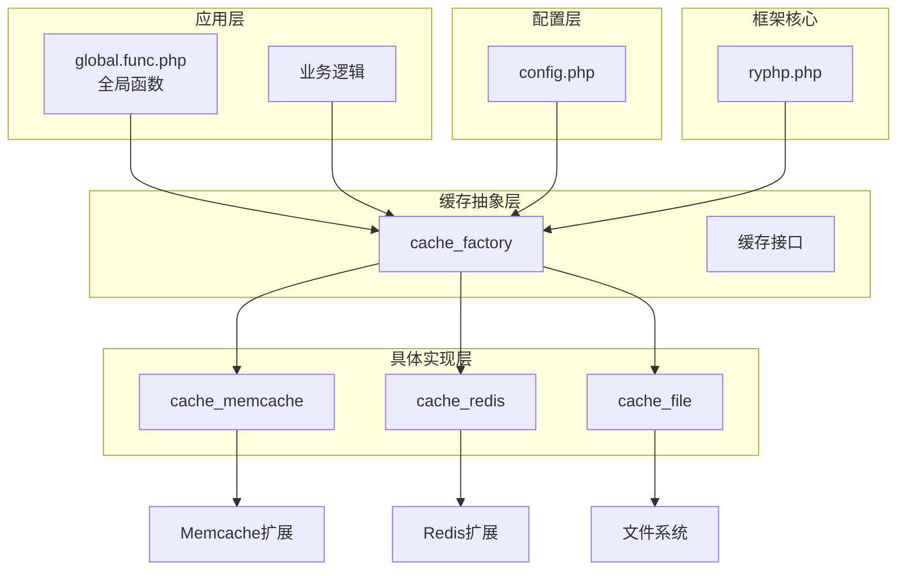
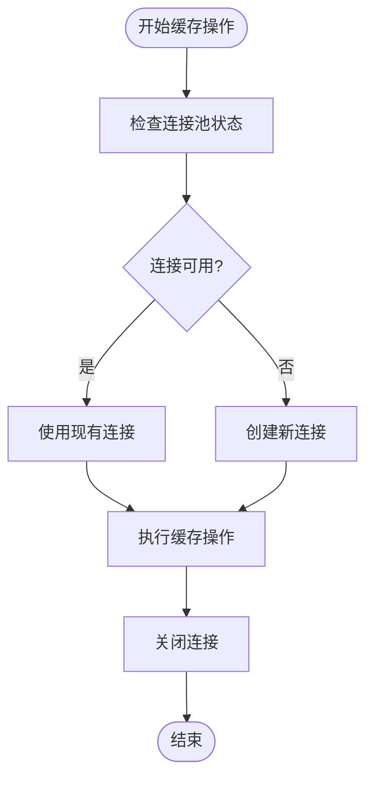
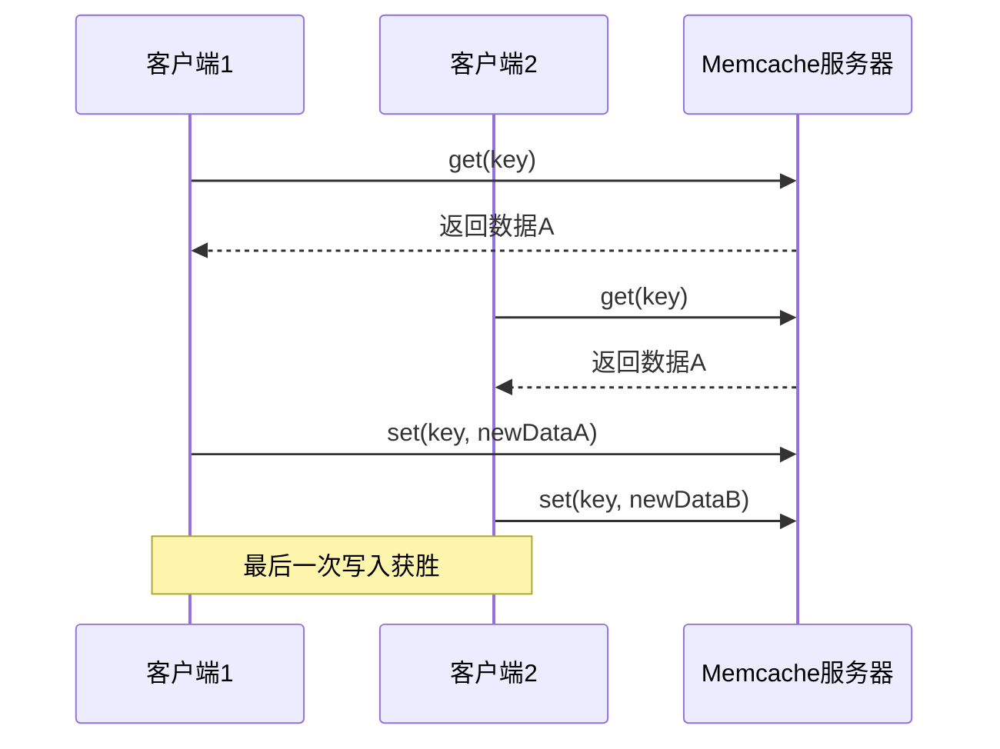

# Memcache缓存实现

<cite>
**本文档引用的文件**
- [cache_memcache.class.php](file://ryphp/core/class/cache_memcache.class.php)
- [cache_factory.class.php](file://ryphp/core/class/cache_factory.class.php)
- [config.php](file://common/config/config.php)
- [global.func.php](file://ryphp/core/function/global.func.php)
- [cache_redis.class.php](file://ryphp/core/class/cache_redis.class.php)
- [cache_file.class.php](file://ryphp/core/class/cache_file.class.php)
- [ryphp.php](file://ryphp/ryphp.php)
</cite>

## 目录
1. [简介](#简介)
2. [项目结构](#项目结构)
3. [核心组件](#核心组件)
4. [架构概览](#架构概览)
5. [详细组件分析](#详细组件分析)
6. [依赖关系分析](#依赖关系分析)
7. [性能考虑](#性能考虑)
8. [故障排除指南](#故障排除指南)
9. [结论](#结论)
10. [附录](#附录)

## 简介

LRYBlog项目采用RYPHP框架开发，其中Memcache缓存实现是系统高性能架构的重要组成部分。本文档深入分析了Memcache在LRYBlog中的完整实现，包括连接建立、连接管理、连接复用机制、数据存储原理、分布式缓存特性、内存管理机制以及性能调优方法。

Memcache作为一种高性能的分布式内存对象缓存系统，在LRYBlog中提供了快速的数据访问能力，支持键值对存储、数据序列化、过期时间管理等核心功能。通过统一的工厂模式，系统实现了多种缓存类型的无缝切换。

## 项目结构

LRYBlog项目的缓存相关文件组织结构如下：



**图表来源**
- [cache_factory.class.php](file://ryphp/core/class/cache_factory.class.php#L1-L84)
- [cache_memcache.class.php](file://ryphp/core/class/cache_memcache.class.php#L1-L91)
- [config.php](file://common/config/config.php#L39-L66)

**章节来源**
- [cache_factory.class.php](file://ryphp/core/class/cache_factory.class.php#L1-L84)
- [cache_memcache.class.php](file://ryphp/core/class/cache_memcache.class.php#L1-L91)
- [config.php](file://common/config/config.php#L39-L66)

## 核心组件

### 缓存工厂类 (cache_factory)

缓存工厂类实现了单例模式和延迟加载模式，根据配置动态选择合适的缓存实现：

- **单例模式**: 确保整个应用生命周期内只有一个工厂实例
- **延迟加载**: 按需创建具体的缓存实例
- **多态支持**: 支持file、redis、memcache三种缓存类型

### Memcache缓存类 (cache_memcache)

Memcache缓存类提供了完整的键值对操作接口：

- **连接管理**: 支持短连接和长连接模式
- **数据序列化**: 自动处理数组和对象的JSON编码
- **前缀管理**: 统一的键名前缀机制
- **过期控制**: 支持灵活的过期时间设置

**章节来源**
- [cache_factory.class.php](file://ryphp/core/class/cache_factory.class.php#L36-L82)
- [cache_memcache.class.php](file://ryphp/core/class/cache_memcache.class.php#L10-L91)

## 架构概览

LRYBlog的缓存架构采用了分层设计，通过工厂模式实现了缓存类型的解耦：



**图表来源**
- [cache_factory.class.php](file://ryphp/core/class/cache_factory.class.php#L36-L82)
- [cache_memcache.class.php](file://ryphp/core/class/cache_memcache.class.php#L27-L36)

## 详细组件分析

### Memcache连接管理

Memcache连接管理是系统性能的关键因素：

#### 连接建立流程



**图表来源**
- [cache_memcache.class.php](file://ryphp/core/class/cache_memcache.class.php#L27-L36)

#### 连接复用机制

系统支持两种连接模式：

1. **短连接模式**: 每次操作都建立新的连接，适合低频访问场景
2. **长连接模式**: 使用持久连接标识符，减少连接建立开销

**章节来源**
- [cache_memcache.class.php](file://ryphp/core/class/cache_memcache.class.php#L13-L20)
- [cache_memcache.class.php](file://ryphp/core/class/cache_memcache.class.php#L34-L36)

### 数据存储原理

#### 键值对存储结构

Memcache缓存类实现了标准的键值对存储机制：



**图表来源**
- [cache_memcache.class.php](file://ryphp/core/class/cache_memcache.class.php#L10-L91)

#### 数据序列化策略

系统采用智能的数据序列化机制：

- **数组类型**: 自动转换为JSON格式存储
- **对象类型**: 通过序列化处理
- **基本类型**: 直接存储，无需额外处理

**章节来源**
- [cache_memcache.class.php](file://ryphp/core/class/cache_memcache.class.php#L50-L53)

### 分布式缓存特性

#### 服务器集群配置

当前实现支持单一服务器配置，但具备扩展到集群的能力：



**图表来源**
- [config.php](file://common/config/config.php#L59-L66)

#### 负载均衡策略

当前实现采用简单的服务器添加方式，实际部署中可考虑：

- **一致性哈希**: 均匀分布缓存键到不同服务器
- **轮询算法**: 顺序分配请求到各服务器
- **权重分配**: 根据服务器性能分配不同权重

**章节来源**
- [cache_memcache.class.php](file://ryphp/core/class/cache_memcache.class.php#L35)
- [config.php](file://common/config/config.php#L59-L66)

### 内存管理机制

#### 内存分配策略

Memcache的内存管理由底层服务器负责，客户端主要关注：

- **数据压缩**: 对大对象进行压缩存储
- **内存回收**: 通过过期机制自动清理
- **碎片整理**: 服务器内部维护内存池

#### 内存溢出处理

系统层面的内存溢出处理：

- **过期控制**: 通过expire参数控制数据生命周期
- **容量监控**: 建议配合外部监控工具
- **优雅降级**: 当缓存不可用时回退到数据库

**章节来源**
- [cache_memcache.class.php](file://ryphp/core/class/cache_memcache.class.php#L16-L18)
- [cache_memcache.class.php](file://ryphp/core/class/cache_memcache.class.php#L49-L53)

## 依赖关系分析

### 缓存系统依赖图



**图表来源**
- [global.func.php](file://ryphp/core/function/global.func.php#L147-L151)
- [cache_factory.class.php](file://ryphp/core/class/cache_factory.class.php#L36-L82)
- [config.php](file://common/config/config.php#L39-L66)

### 关键依赖关系

1. **配置依赖**: 所有缓存实现都依赖于统一的配置系统
2. **工厂依赖**: 通过工厂模式实现缓存类型的解耦
3. **扩展依赖**: Memcache实现依赖PHP的memcache扩展
4. **框架依赖**: 通过ryphp框架的类加载机制实现

**章节来源**
- [cache_factory.class.php](file://ryphp/core/class/cache_factory.class.php#L36-L82)
- [global.func.php](file://ryphp/core/function/global.func.php#L147-L151)

## 性能考虑

### 连接数优化

#### 连接池管理

当前实现的连接管理特点：

- **单实例模式**: 每个请求使用独立的Memcache实例
- **连接复用**: 通过持久连接减少连接建立开销
- **资源控制**: 需要合理设置连接超时时间

#### 并发控制建议



### 缓冲区大小调整

#### 数据大小优化

- **小对象优化**: 适合存储小型配置数据和查询结果
- **大对象处理**: 建议在应用层进行数据压缩
- **批量操作**: 支持批量设置和获取提高效率

### 并发控制策略

#### 乐观锁机制



**章节来源**
- [cache_memcache.class.php](file://ryphp/core/class/cache_memcache.class.php#L47-L54)

## 故障排除指南

### 常见问题诊断

#### 扩展未安装

**症状**: 应用启动时报"不支持memcache"错误

**解决方案**:
1. 检查PHP是否安装memcache扩展
2. 确认扩展已正确加载
3. 重启Web服务器使配置生效

#### 连接失败

**症状**: 缓存操作超时或连接失败

**排查步骤**:
1. 验证Memcache服务器IP和端口配置
2. 检查防火墙设置
3. 确认服务器服务状态

#### 数据序列化问题

**症状**: 获取的数据格式异常

**解决方法**:
1. 检查存储数据的类型
2. 确认JSON编码/解码过程
3. 验证数据完整性

### 监控指标

#### 关键性能指标

| 指标名称 | 描述 | 目标值 |
|---------|------|--------|
| 连接成功率 | 成功建立连接的比例 | >99% |
| 命中率 | 缓存命中次数/总请求次数 | >90% |
| 响应时间 | 单次缓存操作耗时 | <10ms |
| 内存使用率 | 已用内存/总内存 | <80% |

### 调试技巧

#### 开发环境调试

1. **启用详细日志**: 在开发环境中记录缓存操作详情
2. **性能分析**: 使用Xdebug分析缓存操作性能瓶颈
3. **压力测试**: 模拟高并发场景测试系统稳定性

#### 生产环境监控

1. **健康检查**: 定期检查Memcache服务器状态
2. **容量监控**: 监控内存使用情况和连接数
3. **错误追踪**: 记录缓存操作失败的原因

**章节来源**
- [cache_memcache.class.php](file://ryphp/core/class/cache_memcache.class.php#L28-L30)
- [global.func.php](file://ryphp/core/function/global.func.php#L147-L151)

## 结论

LRYBlog中的Memcache缓存实现展现了良好的架构设计和实用性：

### 主要优势

1. **简洁高效**: 实现了最小必要功能，避免过度复杂化
2. **易于集成**: 通过工厂模式轻松切换缓存实现
3. **配置灵活**: 支持多种配置选项满足不同需求
4. **扩展性强**: 为未来功能扩展预留了空间

### 改进建议

1. **集群支持**: 增加对Memcache集群的原生支持
2. **连接池**: 实现连接池管理提升性能
3. **监控集成**: 添加内置的性能监控功能
4. **数据压缩**: 增加自动数据压缩功能

### 最佳实践

1. **合理设置过期时间**: 根据数据特性设置合适的过期策略
2. **键名规范**: 使用统一的键名前缀和命名规范
3. **错误处理**: 实现完善的错误处理和降级机制
4. **性能监控**: 建立持续的性能监控和优化流程

## 附录

### Memcache与Redis对比

| 特性 | Memcache | Redis |
|------|----------|-------|
| 数据类型 | 基础键值对 | 丰富数据结构 |
| 持久化 | 不支持 | 支持RDB/AOF |
| 集群支持 | 原生不支持 | 原生集群支持 |
| 内存效率 | 高 | 中等 |
| 复杂度 | 简单 | 复杂 |
| 适用场景 | 简单缓存 | 复杂应用场景 |

### 使用示例

#### 基本使用模式

```php
// 设置缓存
setcache('user_info', $userData, 3600);

// 获取缓存
$userInfo = getcache('user_info');

// 删除缓存
delcache('user_info');

// 清空所有缓存
delcache('', true);
```

#### 配置示例

```php
// memcache_config配置
'memcache_config' => array(
    'host' => '127.0.0.1',
    'port' => 11211,
    'timeout' => 0,
    'expire' => 3600,
    'persistent' => false,
    'prefix' => 'lryblog_'
)
```

**章节来源**
- [global.func.php](file://ryphp/core/function/global.func.php#L147-L151)
- [config.php](file://common/config/config.php#L59-L66)