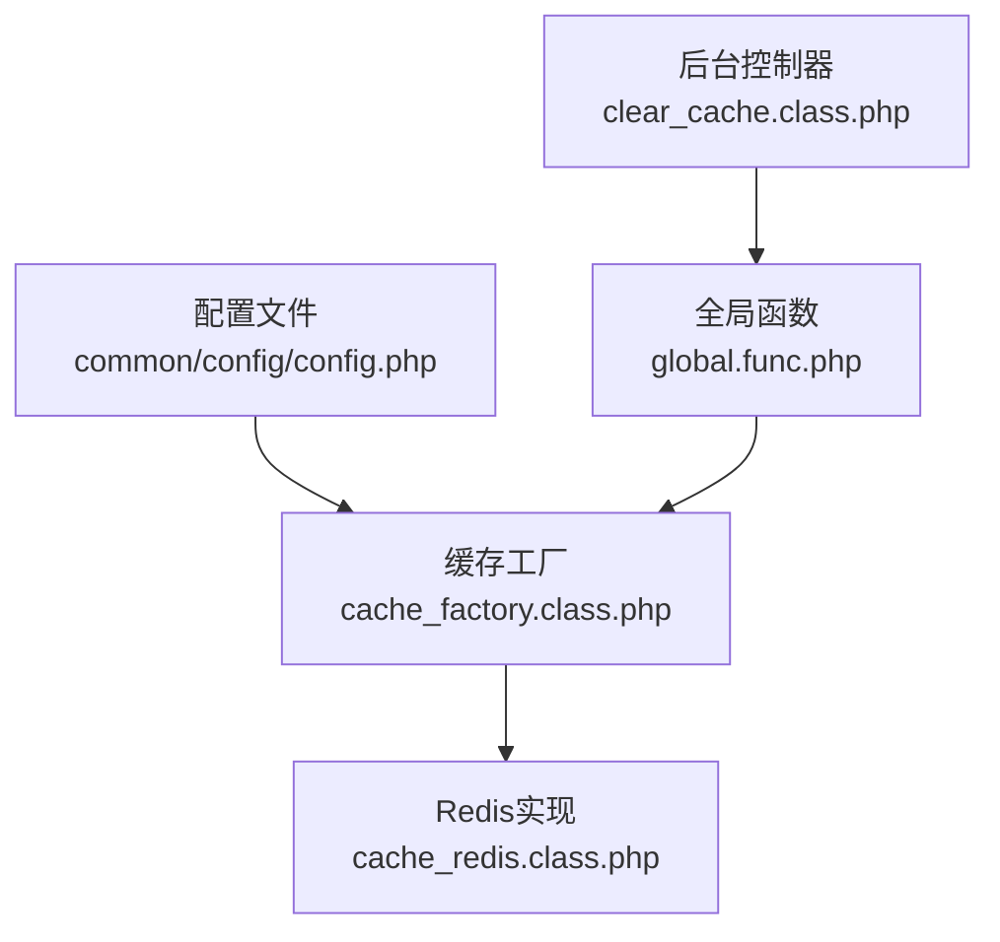
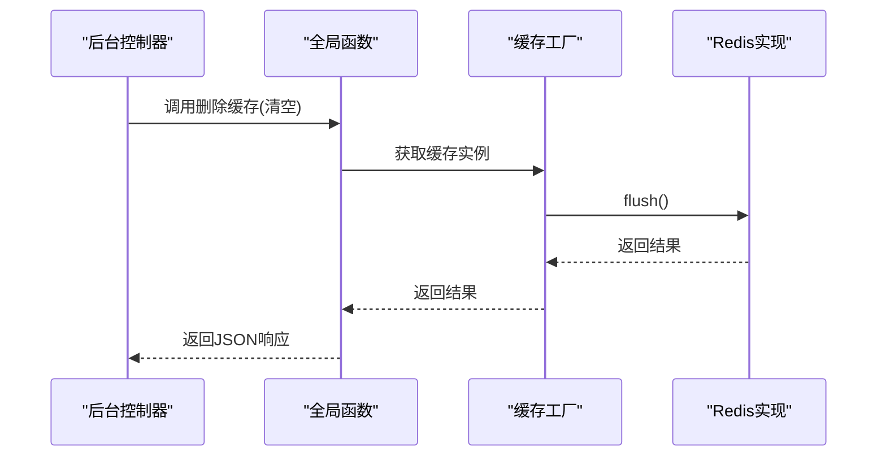
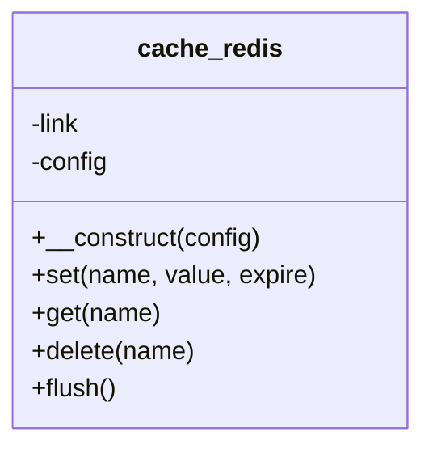
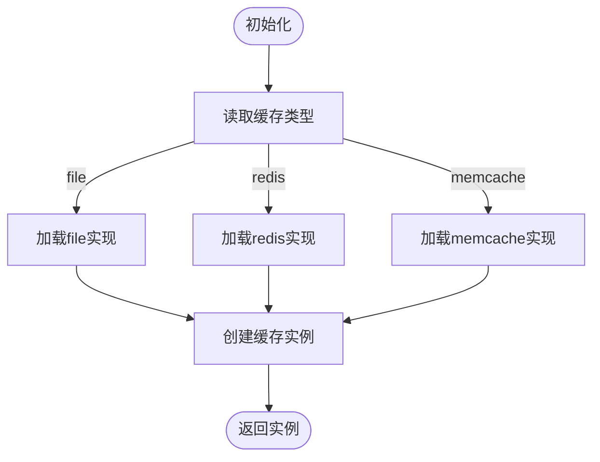
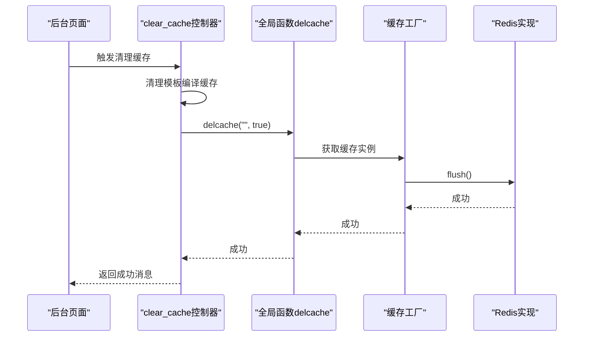
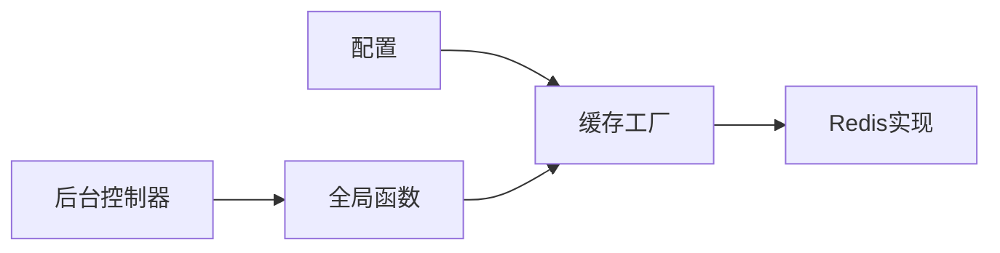

# Redis缓存集成

<cite>
**本文引用的文件**
- [cache_redis.class.php](file://ryphp/core/class/cache_redis.class.php)
- [config.php](file://common/config/config.php)
- [cache_factory.class.php](file://ryphp/core/class/cache_factory.class.php)
- [global.func.php](file://ryphp/core/function/global.func.php)
- [clear_cache.class.php](file://application/lry_admin_center/controller/clear_cache.class.php)
</cite>

## 目录
1. [简介](#简介)
2. [项目结构](#项目结构)
3. [核心组件](#核心组件)
4. [架构总览](#架构总览)
5. [组件详细分析](#组件详细分析)
6. [依赖关系分析](#依赖关系分析)
7. [性能与优化](#性能与优化)
8. [故障排查指南](#故障排查指南)
9. [结论](#结论)
10. [附录](#附录)

## 简介
本文件面向LRYBlog系统中Redis缓存的集成与运维，围绕以下目标展开：连接配置与连接池、连接超时设置；Redis数据类型在缓存场景的应用建议；持久化与内存管理策略；高可用方案（主从、哨兵、集群）；性能优化最佳实践；监控指标采集与分析；常见问题诊断与解决；以及运维部署与维护指导。  
本项目采用统一的缓存工厂模式按配置选择缓存实现，Redis作为可选实现之一，当前实现支持字符串键值存储与数组序列化。

## 项目结构
Redis缓存相关代码分布于以下模块：
- 配置层：系统配置文件定义了缓存类型与Redis配置项
- 工厂层：根据配置动态加载具体缓存实现
- 实现层：Redis缓存类封装连接、读写、删除、清空等操作
- 全局函数：提供便捷的缓存接口（如删除缓存）
- 控制器：提供后台一键清空缓存入口

图表来源
- [config.php](file://common/config/config.php#L39-L66)
- [cache_factory.class.php](file://ryphp/core/class/cache_factory.class.php#L36-L82)
- [cache_redis.class.php](file://ryphp/core/class/cache_redis.class.php#L10-L51)
- [global.func.php](file://ryphp/core/function/global.func.php#L1519-L1523)
- [clear_cache.class.php](file://application/lry_admin_center/controller/clear_cache.class.php#L9-L24)

章节来源
- [config.php](file://common/config/config.php#L39-L66)
- [cache_factory.class.php](file://ryphp/core/class/cache_factory.class.php#L36-L82)

## 核心组件
- 缓存工厂：依据系统配置选择缓存实现（file/redis/memcache），并懒加载实例
- Redis实现：封装Redis连接、认证、库选择、字符串读写、删除、清空
- 全局函数：提供删除单条缓存或清空全部缓存的便捷入口
- 后台控制器：提供一键清理缓存功能，调用全局函数触发清空

章节来源
- [cache_factory.class.php](file://ryphp/core/class/cache_factory.class.php#L36-L82)
- [cache_redis.class.php](file://ryphp/core/class/cache_redis.class.php#L10-L108)
- [global.func.php](file://ryphp/core/function/global.func.php#L1519-L1523)
- [clear_cache.class.php](file://application/lry_admin_center/controller/clear_cache.class.php#L9-L24)

## 架构总览
Redis缓存集成遵循“配置驱动 + 工厂模式 + 统一接口”的设计，系统通过配置项决定使用哪种缓存实现。Redis实现负责底层连接与数据操作，全局函数与控制器提供上层调用入口。

图表来源
- [clear_cache.class.php](file://application/lry_admin_center/controller/clear_cache.class.php#L9-L24)
- [global.func.php](file://ryphp/core/function/global.func.php#L1519-L1523)
- [cache_factory.class.php](file://ryphp/core/class/cache_factory.class.php#L77-L82)
- [cache_redis.class.php](file://ryphp/core/class/cache_redis.class.php#L103-L105)

## 组件详细分析

### Redis缓存类（cache_redis.class.php）
- 连接与认证
  - 支持短连接与长连接（pconnect），可配置超时时间
  - 支持密码认证与逻辑库选择
- 数据读写
  - set/get/delete/flush方法提供基础CRUD
  - 写入前对数组进行JSON编码，读取时尝试JSON解码还原
  - 支持键名前缀，便于命名空间隔离
- 配置项
  - host/port/password/select/timeout/expire/persistent/prefix

图表来源
- [cache_redis.class.php](file://ryphp/core/class/cache_redis.class.php#L10-L108)

章节来源
- [cache_redis.class.php](file://ryphp/core/class/cache_redis.class.php#L10-L108)

### 缓存工厂（cache_factory.class.php）
- 功能
  - 根据系统配置选择缓存实现（file/redis/memcache）
  - 懒加载缓存实例，保证单例
- 关键流程
  - get_instance：按配置加载对应实现类与配置
  - get_cache_instances：创建并返回缓存实例

图表来源
- [cache_factory.class.php](file://ryphp/core/class/cache_factory.class.php#L36-L82)

章节来源
- [cache_factory.class.php](file://ryphp/core/class/cache_factory.class.php#L36-L82)

### 全局函数与后台控制器
- 全局函数 delcache
  - 支持删除单条缓存或清空全部缓存
  - 通过缓存工厂获取实例并调用对应方法
- 后台控制器 clear_cache
  - 提供界面入口，先清理模板编译缓存，再调用delcache清空Redis

图表来源
- [clear_cache.class.php](file://application/lry_admin_center/controller/clear_cache.class.php#L9-L24)
- [global.func.php](file://ryphp/core/function/global.func.php#L1519-L1523)
- [cache_factory.class.php](file://ryphp/core/class/cache_factory.class.php#L77-L82)
- [cache_redis.class.php](file://ryphp/core/class/cache_redis.class.php#L103-L105)

章节来源
- [global.func.php](file://ryphp/core/function/global.func.php#L1519-L1523)
- [clear_cache.class.php](file://application/lry_admin_center/controller/clear_cache.class.php#L9-L24)

## 依赖关系分析
- 配置依赖：系统配置决定缓存类型与Redis参数
- 工厂依赖：工厂依赖配置与类加载机制
- 实现依赖：Redis实现依赖PHP Redis扩展
- 上层依赖：全局函数与控制器依赖工厂提供的实例

图表来源
- [config.php](file://common/config/config.php#L39-L66)
- [cache_factory.class.php](file://ryphp/core/class/cache_factory.class.php#L36-L82)
- [cache_redis.class.php](file://ryphp/core/class/cache_redis.class.php#L10-L51)
- [global.func.php](file://ryphp/core/function/global.func.php#L1519-L1523)
- [clear_cache.class.php](file://application/lry_admin_center/controller/clear_cache.class.php#L9-L24)

章节来源
- [config.php](file://common/config/config.php#L39-L66)
- [cache_factory.class.php](file://ryphp/core/class/cache_factory.class.php#L36-L82)

## 性能与优化
- 连接与超时
  - 使用长连接可降低频繁握手开销；短连接适合低并发场景
  - 超时时间应结合网络状况与业务延迟容忍度设置
- 键名前缀
  - 通过前缀隔离不同模块或环境，避免键冲突
- 序列化策略
  - 当前实现对数组进行JSON编码，注意键值大小与编码成本
- 命令选择
  - 对于带过期时间的写入，优先使用带过期的SET命令
- 内存与持久化
  - 结合业务选择合适的过期时间，避免无界增长
  - 如需持久化，建议在Redis之外配合备份策略（如快照或AOF）
- 网络优化
  - 将Redis与应用部署在同一内网或同机房，减少RTT
  - 合理设置连接池大小与超时，避免阻塞

[本节为通用性能建议，无需特定文件引用]

## 故障排查指南
- 扩展缺失
  - 若未安装Redis扩展，构造函数会直接报错提示
- 权限与认证
  - 若Redis启用密码，需在配置中正确填写
- 连接失败
  - 检查host/port/timeout/persistent配置
  - 确认Redis服务状态与防火墙策略
- 清空缓存无效
  - 确认当前缓存类型为redis
  - 检查flush权限与键前缀是否匹配
- 数组读取异常
  - 确认写入时为数组且被正确JSON编码，读取时能被JSON解码

章节来源
- [cache_redis.class.php](file://ryphp/core/class/cache_redis.class.php#L30-L51)
- [config.php](file://common/config/config.php#L47-L57)

## 结论
LRYBlog通过工厂模式实现了对Redis缓存的无缝接入，具备清晰的配置与调用路径。当前实现聚焦于字符串键值存储与数组序列化，满足基础缓存需求。若业务需要更丰富的数据结构与高级特性（如列表、集合、有序集合、事务、Lua等），可在现有实现基础上扩展Redis命令封装，并配套完善监控与高可用方案。

[本节为总结性内容，无需特定文件引用]

## 附录

### Redis数据类型在缓存场景的应用建议
- 字符串（String）
  - 适用：简单键值缓存、计数器、分布式锁
  - 注意：大对象建议压缩或分片
- 哈希（Hash）
  - 适用：对象属性缓存（如用户信息字段）
  - 注意：避免哈希过大导致单键阻塞
- 列表（List）
  - 适用：最新列表、消息队列尾部追加
  - 注意：谨慎使用头部弹出，避免阻塞
- 集合（Set）
  - 适用：去重集合、标签缓存
  - 注意：集合过大时考虑位图或基数估计算法
- 有序集合（ZSet）
  - 适用：排行榜、带分数排序的数据
  - 注意：分数更新与范围查询的成本控制

[本节为概念性建议，无需特定文件引用]

### 持久化与内存管理
- RDB（快照）
  - 优点：文件紧凑、恢复快
  - 适用：定期全量备份、容灾恢复
  - 注意：可能丢失最后一次快照后的数据
- AOF（追加文件）
  - 优点：数据更安全，可配置刷盘策略
  - 适用：对数据一致性要求高的场景
  - 注意：文件体积较大，重写开销
- 内存管理
  - 合理设置maxmemory与淘汰策略
  - 定期清理过期键，避免碎片

[本节为概念性建议，无需特定文件引用]

### 高可用方案
- 主从复制
  - 读写分离、故障切换
- 哨兵（Sentinel）
  - 自动故障检测与主从切换
- 集群（Cluster）
  - 分片与水平扩展，提升吞吐

[本节为概念性建议，无需特定文件引用]

### 监控指标与分析
- 连接与命令
  - 连接数、命中率、慢查询、命令统计
- 内存与持久化
  - used_memory、mem_fragmentation_ratio、AOF/RDB状态
- 网络与延迟
  - 网络输入/输出、平均延迟、超时次数

[本节为概念性建议，无需特定文件引用]