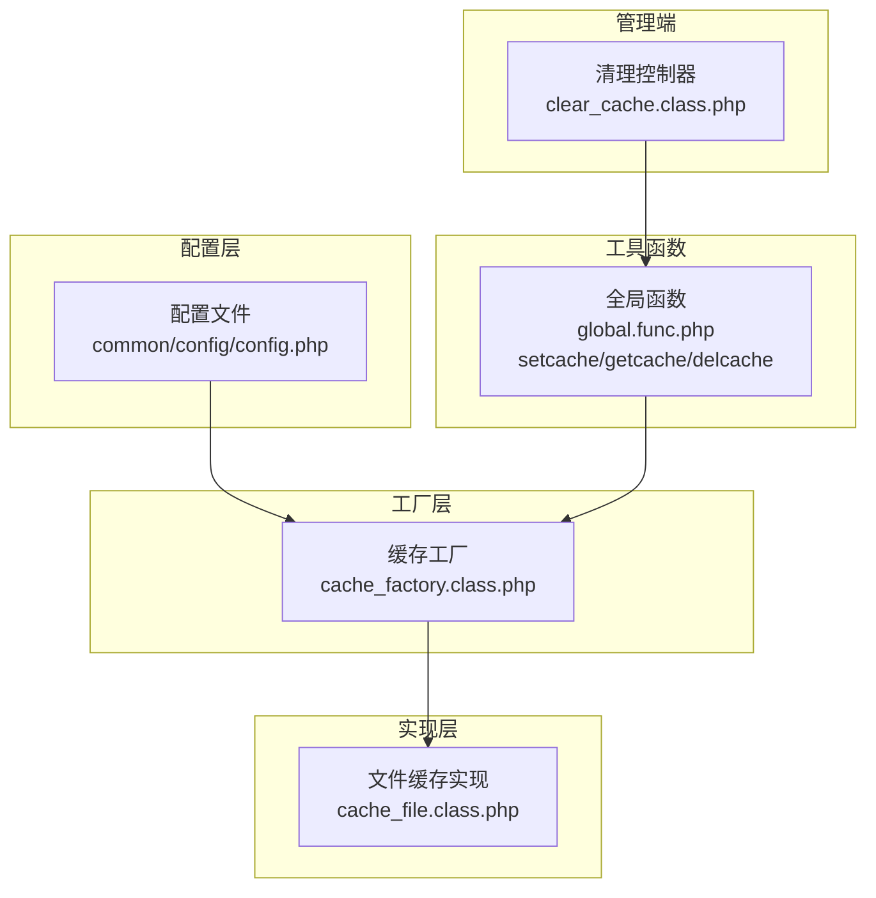
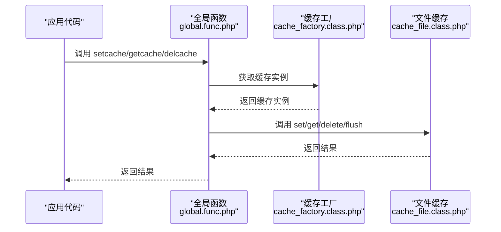
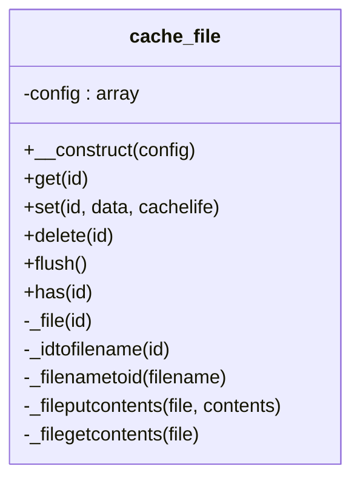
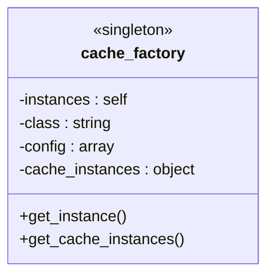
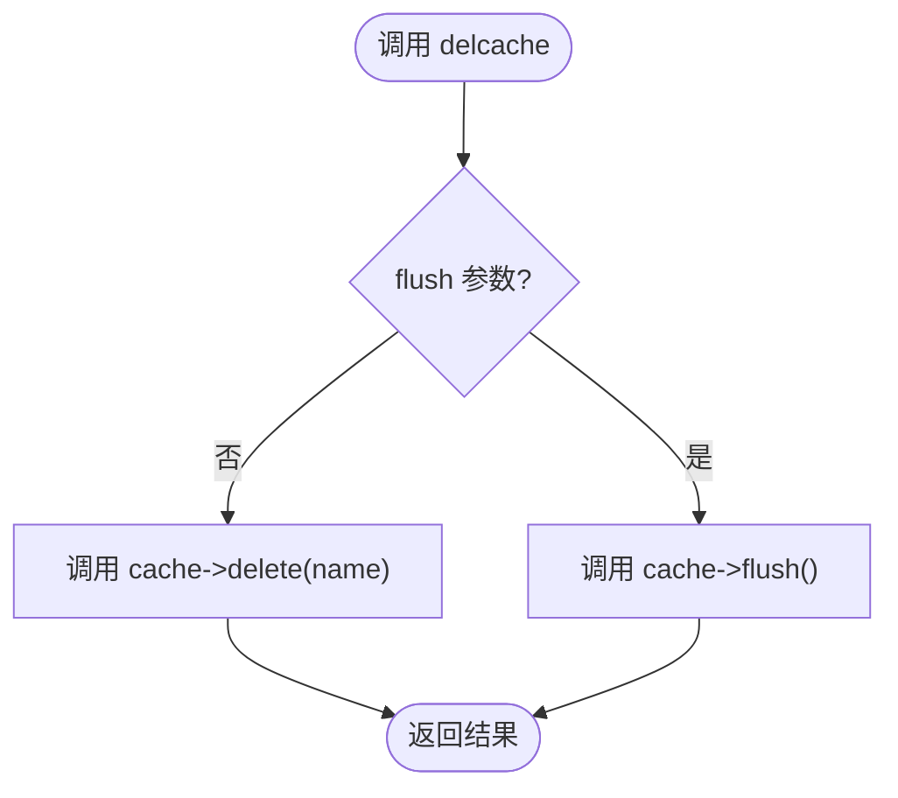
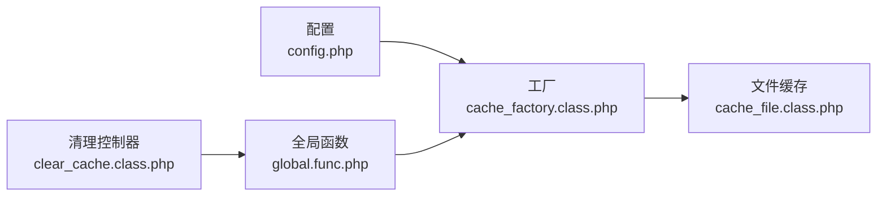

# 文件缓存实现

<cite>
**本文档引用的文件**
- [cache_file.class.php](file://ryphp/core/class/cache_file.class.php)
- [cache_factory.class.php](file://ryphp/core/class/cache_factory.class.php)
- [global.func.php](file://ryphp/core/function/global.func.php)
- [config.php](file://common/config/config.php)
- [clear_cache.class.php](file://application/lry_admin_center/controller/clear_cache.class.php)
- [.gitignore](file://.gitignore)
</cite>

## 目录
1. [简介](#简介)
2. [项目结构](#项目结构)
3. [核心组件](#核心组件)
4. [架构总览](#架构总览)
5. [详细组件分析](#详细组件分析)
6. [依赖关系分析](#依赖关系分析)
7. [性能考量](#性能考量)
8. [故障排查指南](#故障排查指南)
9. [结论](#结论)
10. [附录](#附录)

## 简介
本文件缓存实现基于文件系统，采用纯 PHP 文件作为缓存载体，支持两种序列化模式：标准序列化模式与可执行数组模式。缓存条目包含内容、过期时间与修改时间，具备基本的过期检查与自动清理能力。系统通过工厂模式按配置选择缓存类型，文件缓存默认启用。

## 项目结构
文件缓存相关代码分布于以下模块：
- 缓存实现层：ryphp/core/class/cache_file.class.php
- 工厂与配置：ryphp/core/class/cache_factory.class.php、common/config/config.php
- 工具函数：ryphp/core/function/global.func.php（setcache、getcache、delcache）
- 管理端清理：application/lry_admin_center/controller/clear_cache.class.php
- 版本控制忽略：.gitignore（忽略 cache/cache_file/）

**图表来源**
- [config.php](file://common/config/config.php#L39-L66)
- [cache_factory.class.php](file://ryphp/core/class/cache_factory.class.php#L36-L82)
- [cache_file.class.php](file://ryphp/core/class/cache_file.class.php#L1-L130)
- [global.func.php](file://ryphp/core/function/global.func.php#L585-L589)
- [clear_cache.class.php](file://application/lry_admin_center/controller/clear_cache.class.php#L9-L24)

**章节来源**
- [cache_file.class.php](file://ryphp/core/class/cache_file.class.php#L1-L130)
- [cache_factory.class.php](file://ryphp/core/class/cache_factory.class.php#L1-L84)
- [global.func.php](file://ryphp/core/function/global.func.php#L585-L589)
- [config.php](file://common/config/config.php#L39-L66)
- [.gitignore](file://.gitignore#L2)

## 核心组件
- 文件缓存类：负责缓存的增删改查、过期检查、文件读写与序列化模式切换。
- 缓存工厂：根据配置选择缓存类型（file/redis/memcache），并提供单例与延迟初始化。
- 全局函数：setcache/getcache/delcache封装对缓存实例的调用；delcache支持按键删除或整库清理。
- 配置：定义缓存类型与文件缓存的目录、后缀、序列化模式等参数。
- 管理端清理：提供后台一键清理模板缓存与文件缓存的功能入口。

**章节来源**
- [cache_file.class.php](file://ryphp/core/class/cache_file.class.php#L17-L82)
- [cache_factory.class.php](file://ryphp/core/class/cache_factory.class.php#L36-L82)
- [global.func.php](file://ryphp/core/function/global.func.php#L585-L589)
- [config.php](file://common/config/config.php#L39-L66)
- [clear_cache.class.php](file://application/lry_admin_center/controller/clear_cache.class.php#L9-L24)

## 架构总览
文件缓存的调用链路如下：
- 应用通过全局函数 setcache/getcache/delcache 访问缓存。
- 工厂根据配置选择具体缓存实现（此处为文件缓存）。
- 文件缓存类负责实际的文件读写、序列化/反序列化与过期判断。

**图表来源**
- [global.func.php](file://ryphp/core/function/global.func.php#L585-L589)
- [cache_factory.class.php](file://ryphp/core/class/cache_factory.class.php#L36-L82)
- [cache_file.class.php](file://ryphp/core/class/cache_file.class.php#L17-L82)

## 详细组件分析

### 文件缓存类（cache_file）
- 配置项
  - cache_dir：缓存根目录，默认位于 cache/cache_file/。
  - suffix：缓存文件后缀，默认 .cache.php。
  - mode：序列化模式，1 为 serialize/unserialize，2 为可执行数组 require。
- 关键方法
  - get(id)：检查文件存在与未过期，返回内容或 false。
  - set(id, data, cachelife)：写入缓存，计算 expire=mtime+cachelife。
  - delete(id)：删除指定缓存文件。
  - flush()：遍历目录下所有缓存文件并逐个删除。
  - has(id)：判断缓存是否存在。
  - _file/_idtofilename/_filenametoid：文件路径与命名规则。
  - _fileputcontents/_filegetcontents：写入与读取，含 LOCK_EX 写入与两模式读取。
- 过期机制
  - 存储时记录 mtime 与 expire。
  - 读取时比较 expire 与当前时间，0 表示永不过期。
- 并发与文件锁
  - 写入使用 LOCK_EX，减少竞态条件。
  - 读取不加锁，依赖 PHP require 或 unserialize 的原子性。
- 目录与命名
  - 目录：cache/cache_file/<id>.cache.php
  - 命名：id + 后缀，不包含路径分隔符。

**图表来源**
- [cache_file.class.php](file://ryphp/core/class/cache_file.class.php#L1-L130)

**章节来源**
- [cache_file.class.php](file://ryphp/core/class/cache_file.class.php#L5-L130)

### 缓存工厂（cache_factory）
- 功能
  - 单例：保证工厂唯一。
  - 按配置选择缓存实现：file/redis/memcache。
  - 延迟初始化：首次调用时创建具体缓存实例。
- 配置来源
  - cache_type：来自配置文件。
  - file_config/redis_config/memcache_config：对应类型配置。

**图表来源**
- [cache_factory.class.php](file://ryphp/core/class/cache_factory.class.php#L1-L84)

**章节来源**
- [cache_factory.class.php](file://ryphp/core/class/cache_factory.class.php#L36-L82)
- [config.php](file://common/config/config.php#L39-L66)

### 全局函数（setcache/getcache/delcache）
- setcache(name, data, timeout)：设置缓存，timeout 为过期秒数。
- getcache(name)：获取缓存。
- delcache(name, flush=false)：删除单个或整库清理。

**图表来源**
- [global.func.php](file://ryphp/core/function/global.func.php#L1519-L1523)

**章节来源**
- [global.func.php](file://ryphp/core/function/global.func.php#L585-L589)
- [global.func.php](file://ryphp/core/function/global.func.php#L1519-L1523)

### 配置（common/config/config.php）
- cache_type：file/redis/memcache。
- file_config：cache_dir、suffix、mode。
- redis_config/memcache_config：其他类型配置（与文件缓存无关）。

**章节来源**
- [config.php](file://common/config/config.php#L39-L66)

### 管理端清理（clear_cache）
- 清理模板缓存：扫描 cache/index、cache/member、cache/vip 等目录下 *.tpl.php 并删除。
- 清理文件缓存：调用 delcache('', true) 触发 flush。

**章节来源**
- [clear_cache.class.php](file://application/lry_admin_center/controller/clear_cache.class.php#L9-L24)

## 依赖关系分析
- 配置依赖：工厂依赖配置文件中的 cache_type 与 file_config。
- 工具函数依赖：全局函数依赖工厂获取缓存实例。
- 实现依赖：文件缓存类依赖系统时间常量 SYS_TIME 进行过期判断。
- 管理端依赖：清理控制器依赖全局函数 delcache。

**图表来源**
- [config.php](file://common/config/config.php#L39-L66)
- [cache_factory.class.php](file://ryphp/core/class/cache_factory.class.php#L36-L82)
- [cache_file.class.php](file://ryphp/core/class/cache_file.class.php#L17-L82)
- [global.func.php](file://ryphp/core/function/global.func.php#L585-L589)
- [clear_cache.class.php](file://application/lry_admin_center/controller/clear_cache.class.php#L9-L24)

**章节来源**
- [cache_factory.class.php](file://ryphp/core/class/cache_factory.class.php#L36-L82)
- [cache_file.class.php](file://ryphp/core/class/cache_file.class.php#L17-L82)
- [global.func.php](file://ryphp/core/function/global.func.php#L585-L589)
- [config.php](file://common/config/config.php#L39-L66)
- [clear_cache.class.php](file://application/lry_admin_center/controller/clear_cache.class.php#L9-L24)

## 性能考量
- 文件锁与原子性
  - 写入使用 LOCK_EX，降低竞态风险。
  - 读取采用 require 或 unserialize，避免额外解析开销。
- 序列化模式
  - 模式1：serialize/unserialize，兼容性好但略慢。
  - 模式2：可执行数组 require，读取更快，但需注意文件内容可执行性。
- 目录与命名
  - 单级目录，文件名直接拼接 id，查找 O(1)。
  - 建议避免过多缓存文件导致目录膨胀，必要时可引入子目录分片。
- 过期检查
  - 读取时即时判断，无需后台扫描，减少 CPU 开销。
- 磁盘 I/O
  - 大量小文件可能带来 inode 压力，建议定期清理与合并缓存。

[本节为通用性能建议，不直接分析具体文件]

## 故障排查指南
- 缓存目录不可写
  - 现象：set 操作失败或目录创建失败。
  - 排查：确认 cache/cache_file/ 权限与磁盘配额。
- 缓存读取异常
  - 现象：get 返回 false 或内容为空。
  - 排查：检查文件后缀、序列化模式、文件内容是否被篡改。
- 过期未生效
  - 现象：缓存长期存在。
  - 排查：确认 SYS_TIME 定义与服务器时间同步；检查 cachelife 设置。
- 并发冲突
  - 现象：偶发数据不一致。
  - 排查：确认写入使用 LOCK_EX；避免手动修改缓存文件。
- 管理端清理无效
  - 现象：清理后仍存在旧缓存。
  - 排查：确认清理控制器权限与 delcache 调用链。

**章节来源**
- [cache_file.class.php](file://ryphp/core/class/cache_file.class.php#L103-L128)
- [global.func.php](file://ryphp/core/function/global.func.php#L1519-L1523)
- [clear_cache.class.php](file://application/lry_admin_center/controller/clear_cache.class.php#L9-L24)

## 结论
该文件缓存实现简洁可靠，通过工厂模式与全局函数抽象了缓存接口，支持灵活的配置与序列化模式。其过期机制与文件锁设计满足常见场景需求。建议在生产环境中配合定期清理与监控，确保磁盘空间与性能稳定。

[本节为总结性内容，不直接分析具体文件]

## 附录

### 使用示例与配置参数
- 基本使用
  - 设置缓存：setcache('key', $data, 3600)
  - 获取缓存：getcache('key')
  - 删除缓存：delcache('key')
  - 清空缓存：delcache('', true)
- 配置参数
  - cache_type：file/redis/memcache
  - file_config.cache_dir：缓存目录
  - file_config.suffix：缓存文件后缀
  - file_config.mode：序列化模式（1/2）

**章节来源**
- [global.func.php](file://ryphp/core/function/global.func.php#L585-L589)
- [global.func.php](file://ryphp/core/function/global.func.php#L1519-L1523)
- [config.php](file://common/config/config.php#L39-L66)

### 目录与命名规范
- 目录：cache/cache_file/
- 文件命名：id + .cache.php
- 忽略规则：.gitignore 包含 cache/cache_file/

**章节来源**
- [.gitignore](file://.gitignore#L2)
- [cache_file.class.php](file://ryphp/core/class/cache_file.class.php#L84-L100)