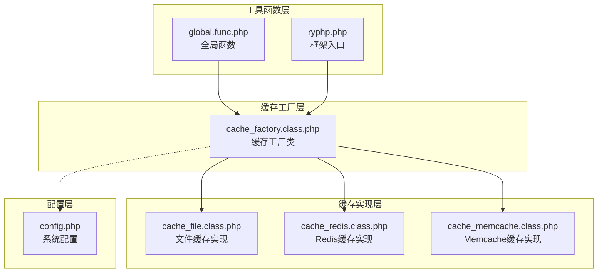
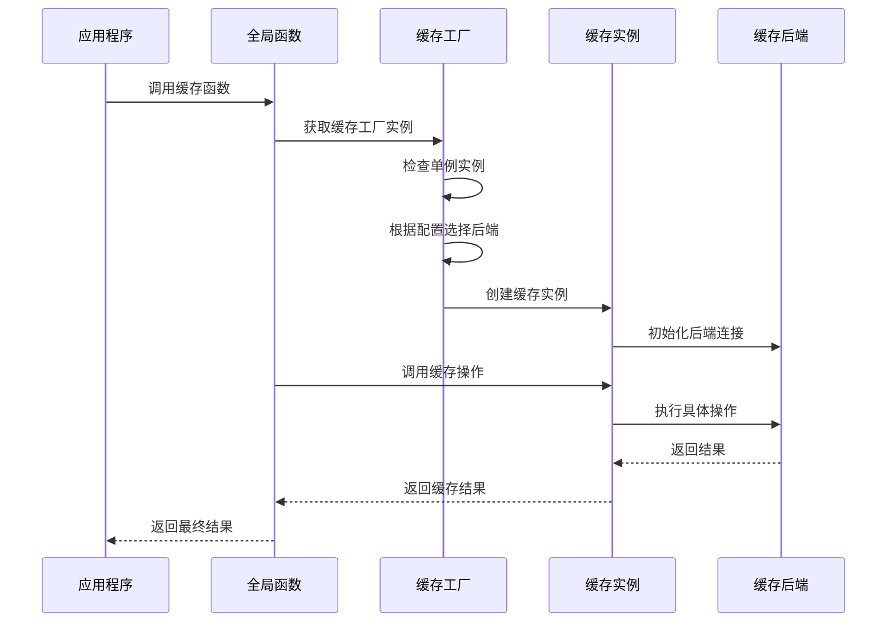
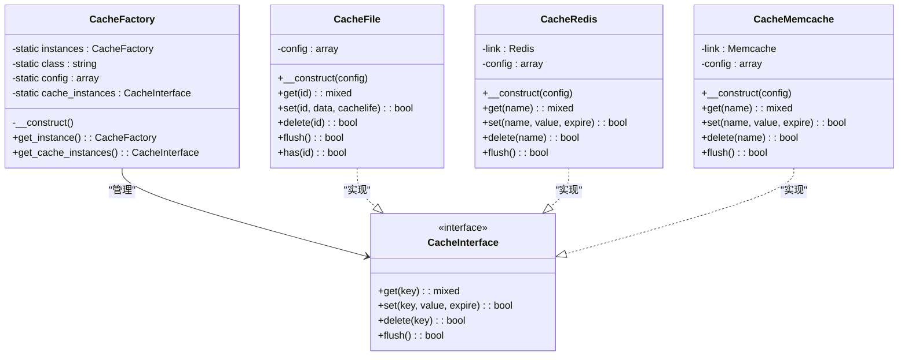
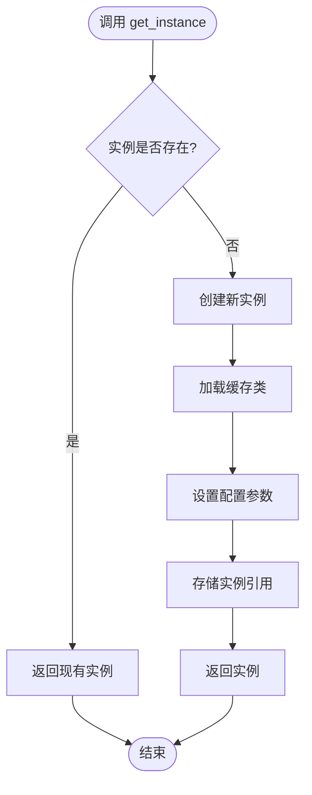
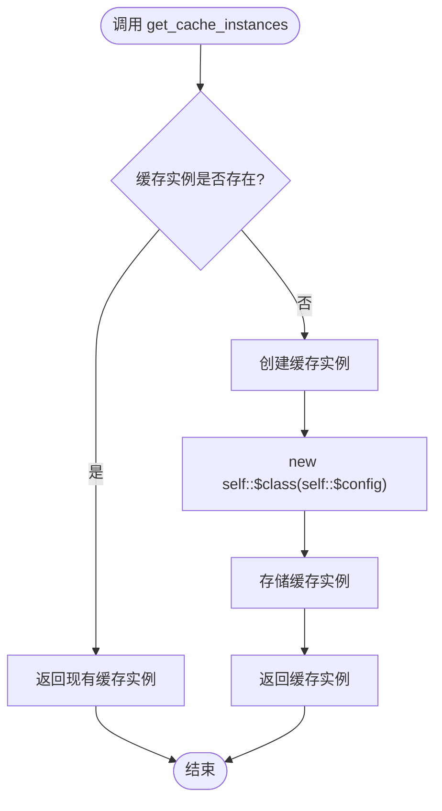
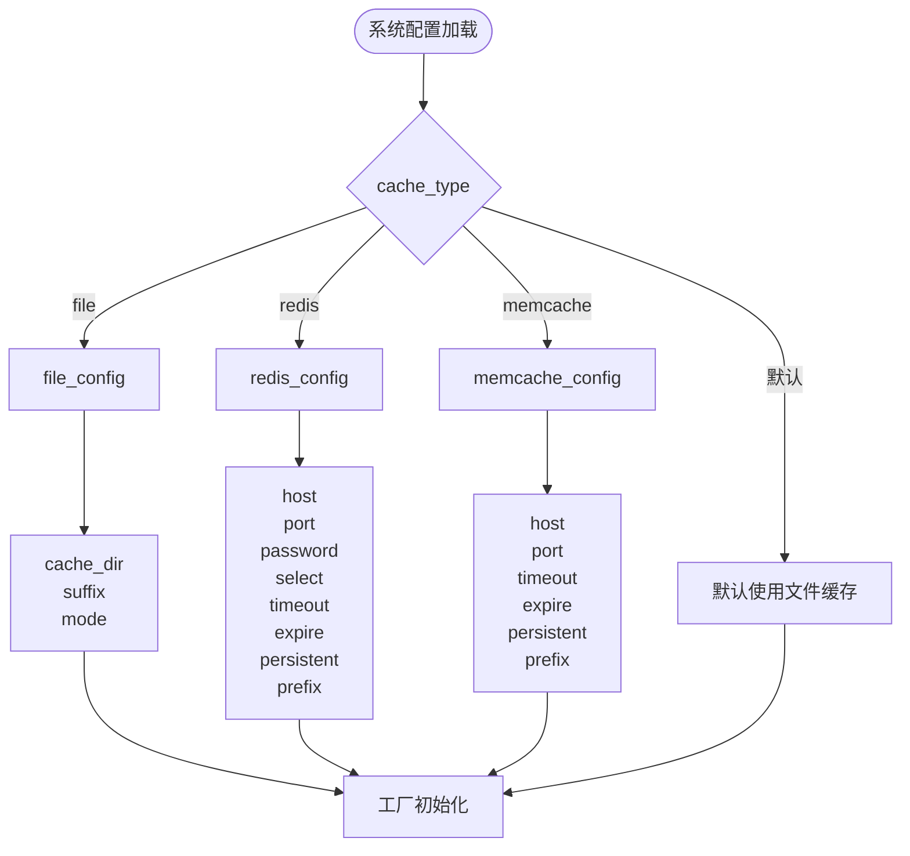
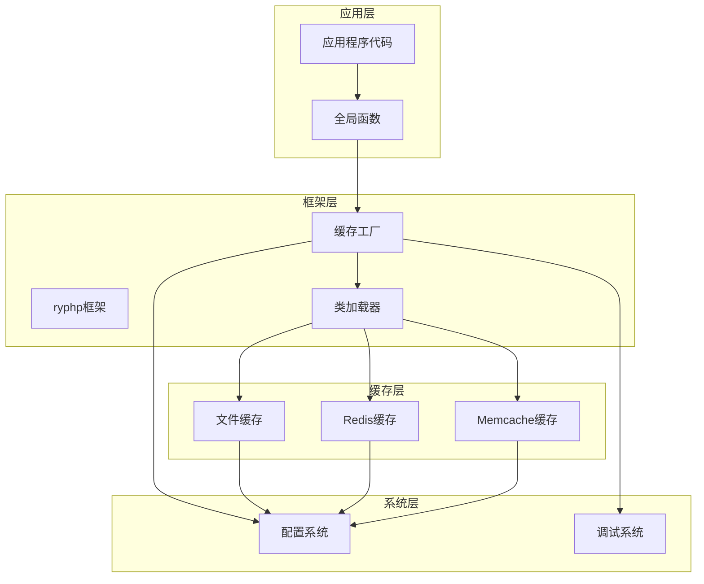
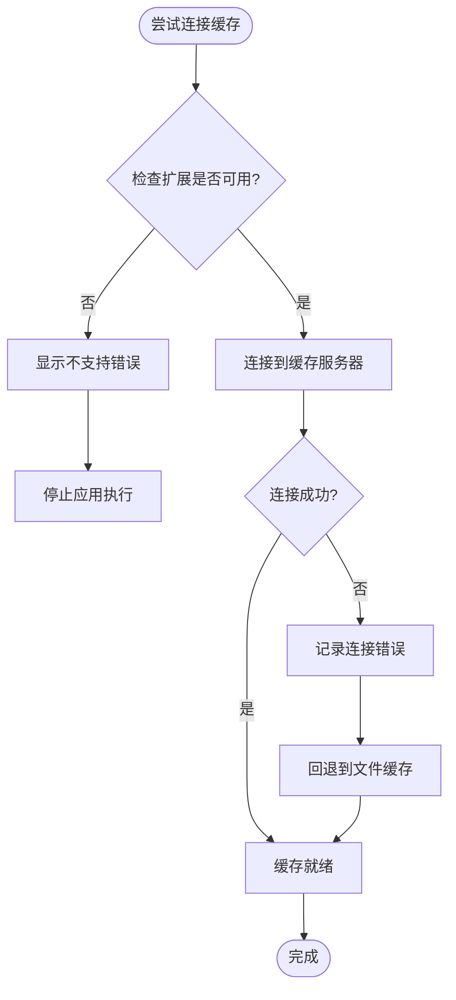
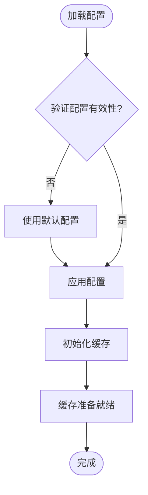

# 缓存工厂模式

<cite>
**本文档引用的文件**
- [cache_factory.class.php](file://ryphp/core/class/cache_factory.class.php)
- [cache_file.class.php](file://ryphp/core/class/cache_file.class.php)
- [cache_redis.class.php](file://ryphp/core/class/cache_redis.class.php)
- [cache_memcache.class.php](file://ryphp/core/class/cache_memcache.class.php)
- [config.php](file://common/config/config.php)
- [global.func.php](file://ryphp/core/function/global.func.php)
- [ryphp.php](file://ryphp/ryphp.php)
- [debug.class.php](file://ryphp/core/class/debug.class.php)
</cite>

## 目录
1. [简介](#简介)
2. [项目结构](#项目结构)
3. [核心组件](#核心组件)
4. [架构概览](#架构概览)
5. [详细组件分析](#详细组件分析)
6. [依赖关系分析](#依赖关系分析)
7. [性能考虑](#性能考虑)
8. [故障排除指南](#故障排除指南)
9. [结论](#结论)
10. [附录](#附录)

## 简介

缓存工厂模式是本项目中实现的一个设计模式，它结合了单例模式和工厂模式的思想，为不同类型的缓存后端提供统一的访问接口。该模式的核心目标是在运行时根据配置动态选择合适的缓存实现，同时确保缓存实例的唯一性和延迟加载特性。

本项目实现了三种缓存后端：文件缓存、Redis缓存和Memcache缓存，每种实现都遵循相同的接口规范，使得应用程序可以在不修改业务代码的情况下轻松切换缓存存储方式。

## 项目结构

缓存工厂模式在项目中的组织结构如下：



**图表来源**
- [cache_factory.class.php](file://ryphp/core/class/cache_factory.class.php#L1-L84)
- [cache_file.class.php](file://ryphp/core/class/cache_file.class.php#L1-L130)
- [cache_redis.class.php](file://ryphp/core/class/cache_redis.class.php#L1-L108)
- [cache_memcache.class.php](file://ryphp/core/class/cache_memcache.class.php#L1-L91)
- [config.php](file://common/config/config.php#L39-L66)

**章节来源**
- [cache_factory.class.php](file://ryphp/core/class/cache_factory.class.php#L1-L84)
- [config.php](file://common/config/config.php#L39-L66)

## 核心组件

缓存工厂模式由以下几个核心组件构成：

### 缓存工厂类 (cache_factory)
- 实现单例模式，确保整个应用只有一个工厂实例
- 使用延迟加载机制，在首次需要时才创建缓存实例
- 根据配置动态选择缓存后端实现
- 统一管理缓存实例的生命周期

### 缓存实现类
- **文件缓存**: 基于文件系统的持久化缓存
- **Redis缓存**: 基于内存数据库的高性能缓存
- **Memcache缓存**: 基于分布式内存对象缓存系统的缓存

### 配置管理
- 通过配置文件集中管理缓存类型和参数
- 支持运行时动态切换缓存后端
- 提供默认配置和用户自定义配置的合并机制

**章节来源**
- [cache_factory.class.php](file://ryphp/core/class/cache_factory.class.php#L36-L82)
- [config.php](file://common/config/config.php#L39-L66)

## 架构概览

缓存工厂模式采用分层架构设计，实现了关注点分离和高内聚低耦合的设计原则：



**图表来源**
- [global.func.php](file://ryphp/core/function/global.func.php#L147-L151)
- [cache_factory.class.php](file://ryphp/core/class/cache_factory.class.php#L36-L82)

该架构的关键特点：
- **抽象层**: 缓存工厂提供统一的接口抽象
- **策略层**: 不同的缓存实现作为策略对象
- **配置层**: 动态配置驱动的策略选择
- **执行层**: 具体的缓存操作实现

## 详细组件分析

### 缓存工厂类设计

缓存工厂类采用了双重检查锁定的单例模式实现：



**图表来源**
- [cache_factory.class.php](file://ryphp/core/class/cache_factory.class.php#L2-L82)
- [cache_file.class.php](file://ryphp/core/class/cache_file.class.php#L2-L130)
- [cache_redis.class.php](file://ryphp/core/class/cache_redis.class.php#L10-L108)
- [cache_memcache.class.php](file://ryphp/core/class/cache_memcache.class.php#L10-L91)

#### 单例模式实现

缓存工厂类使用静态属性实现单例模式：



**图表来源**
- [cache_factory.class.php](file://ryphp/core/class/cache_factory.class.php#L36-L62)

#### 延迟加载机制

延迟加载确保只有在真正需要时才创建缓存实例：



**图表来源**
- [cache_factory.class.php](file://ryphp/core/class/cache_factory.class.php#L77-L82)

### 缓存后端实现

#### 文件缓存实现

文件缓存是最基础的缓存实现，具有以下特点：

- **持久化存储**: 数据存储在文件系统中，重启后仍然存在
- **简单可靠**: 不依赖外部服务，部署简单
- **性能适中**: 受文件系统I/O限制
- **配置灵活**: 支持多种存储模式和文件格式

文件缓存的核心功能包括：
- 数据序列化和反序列化
- 文件路径管理和命名规则
- 过期时间检查和清理
- 目录结构优化

#### Redis缓存实现

Redis缓存提供了高性能的内存缓存解决方案：

- **高性能**: 内存存储，读写速度极快
- **丰富功能**: 支持多种数据结构和高级功能
- **持久化选项**: 支持RDB和AOF持久化
- **集群支持**: 支持主从复制和哨兵模式

Redis缓存的关键特性：
- 连接池管理
- 数据类型自动转换
- 过期时间精确控制
- 前缀命名空间隔离

#### Memcache缓存实现

Memcache缓存是经典的分布式缓存解决方案：

- **轻量级**: 内存缓存，无持久化
- **分布式**: 支持多节点集群
- **简单易用**: API简洁明了
- **高并发**: 适合高并发场景

Memcache缓存的特点：
- 多服务器支持
- 自动故障转移
- 压缩和序列化支持
- 前缀命名空间管理

**章节来源**
- [cache_file.class.php](file://ryphp/core/class/cache_file.class.php#L17-L128)
- [cache_redis.class.php](file://ryphp/core/class/cache_redis.class.php#L53-L105)
- [cache_memcache.class.php](file://ryphp/core/class/cache_memcache.class.php#L39-L89)

### 配置管理机制

缓存工厂的配置管理基于系统配置文件，支持以下配置项：



**图表来源**
- [config.php](file://common/config/config.php#L39-L66)
- [cache_factory.class.php](file://ryphp/core/class/cache_factory.class.php#L39-L59)

**章节来源**
- [config.php](file://common/config/config.php#L39-L66)

## 依赖关系分析

缓存工厂模式的依赖关系体现了清晰的层次结构：



**图表来源**
- [global.func.php](file://ryphp/core/function/global.func.php#L147-L151)
- [cache_factory.class.php](file://ryphp/core/class/cache_factory.class.php#L36-L82)
- [ryphp.php](file://ryphp/ryphp.php#L108-L140)

### 关键依赖点

1. **全局函数依赖**: `getcache()`, `setcache()`, `delcache()` 函数依赖缓存工厂
2. **类加载器依赖**: 缓存工厂依赖框架的类加载机制
3. **配置系统依赖**: 缓存工厂依赖系统配置进行初始化
4. **扩展性依赖**: 缓存工厂设计支持新的缓存后端扩展

**章节来源**
- [global.func.php](file://ryphp/core/function/global.func.php#L147-L151)
- [global.func.php](file://ryphp/core/function/global.func.php#L585-L589)
- [global.func.php](file://ryphp/core/function/global.func.php#L1519-L1523)

## 性能考虑

缓存工厂模式在性能方面具有以下特点：

### 内存使用优化
- 单例模式避免重复创建缓存实例
- 延迟加载减少初始内存占用
- 静态属性存储实例引用

### 访问性能优化
- 缓存实例的快速查找和复用
- 避免重复的配置解析
- 最小化的对象创建开销

### 扩展性考虑
- 新的缓存后端实现不影响现有代码
- 配置驱动的后端切换无需代码修改
- 支持渐进式性能优化

## 故障排除指南

### 常见问题及解决方案

#### 缓存后端不可用
当指定的缓存后端扩展未安装时，系统会抛出相应的错误信息：



**图表来源**
- [cache_redis.class.php](file://ryphp/core/class/cache_redis.class.php#L31-L33)
- [cache_memcache.class.php](file://ryphp/core/class/cache_memcache.class.php#L28-L30)

#### 配置错误处理
当配置参数无效时，系统会使用默认配置继续运行：



**图表来源**
- [cache_factory.class.php](file://ryphp/core/class/cache_factory.class.php#L55-L59)

#### 调试和错误报告
系统提供了完善的错误处理机制：

**章节来源**
- [cache_redis.class.php](file://ryphp/core/class/cache_redis.class.php#L31-L33)
- [cache_memcache.class.php](file://ryphp/core/class/cache_memcache.class.php#L28-L30)
- [debug.class.php](file://ryphp/core/class/debug.class.php#L75-L112)

## 结论

缓存工厂模式在本项目中展现了良好的设计原则和实现效果：

### 设计优势
- **灵活性**: 支持多种缓存后端的动态切换
- **可扩展性**: 易于添加新的缓存实现
- **性能**: 通过单例和延迟加载优化资源使用
- **易用性**: 为上层应用提供统一的缓存接口

### 实现特点
- 完整的单例模式实现，确保实例唯一性
- 智能的延迟加载机制，提升启动性能
- 基于配置的动态后端选择
- 统一的异常处理和错误报告

### 最佳实践建议
1. **合理选择缓存后端**: 根据应用场景选择最适合的缓存类型
2. **优化配置参数**: 根据实际需求调整缓存配置
3. **监控缓存性能**: 定期检查缓存命中率和性能指标
4. **备份重要数据**: 对关键缓存数据做好备份策略

## 附录

### 使用示例

#### 基本使用方法
```php
// 获取缓存实例
$cache = cache_factory::get_instance()->get_cache_instances();

// 设置缓存数据
$cache->set('key', 'value', 3600);

// 获取缓存数据
$value = $cache->get('key');

// 删除缓存数据
$cache->delete('key');

// 清空所有缓存
$cache->flush();
```

#### 全局函数使用
```php
// 设置缓存
setcache('key', 'value', 3600);

// 获取缓存
$value = getcache('key');

// 删除缓存
delcache('key');

// 清空缓存
delcache(null, true);
```

### 配置示例

#### 文件缓存配置
```php
'cache_type' => 'file',
'file_config' => array(
    'cache_dir' => RYPHP_ROOT.'cache/cache_file/',
    'suffix' => '.cache.php',
    'mode' => '2'
)
```

#### Redis缓存配置
```php
'cache_type' => 'redis',
'redis_config' => array(
    'host' => '127.0.0.1',
    'port' => 6379,
    'password' => '',
    'select' => 0,
    'timeout' => 0,
    'expire' => 3600,
    'persistent' => false,
    'prefix' => ''
)
```

#### Memcache缓存配置
```php
'memcache_config' => array(
    'host' => '127.0.0.1',
    'port' => 11211,
    'timeout' => 0,
    'expire' => 3600,
    'persistent' => false,
    'prefix' => ''
)
```

### 扩展指南

#### 添加新的缓存后端
1. 创建新的缓存类，实现统一的接口
2. 在缓存工厂中添加对应的配置处理逻辑
3. 更新配置文件以支持新的缓存类型
4. 测试新缓存后端的功能和性能

#### 性能优化建议
1. **连接池管理**: 对于网络缓存后端，实现连接池复用
2. **批量操作**: 支持批量的缓存读写操作
3. **压缩策略**: 对大对象进行压缩存储
4. **预热机制**: 实现缓存预热功能