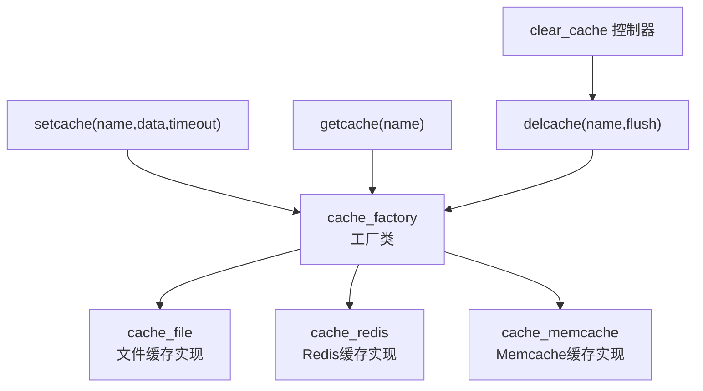
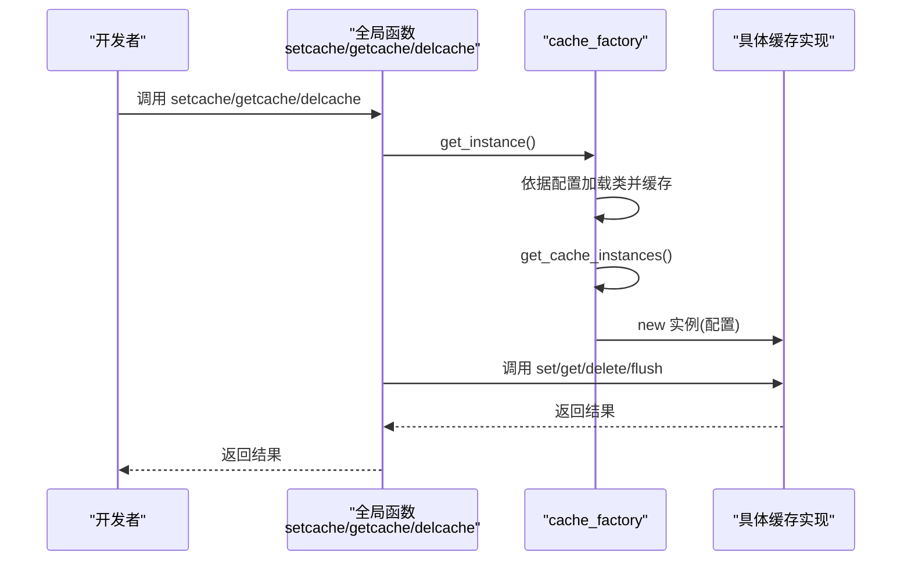
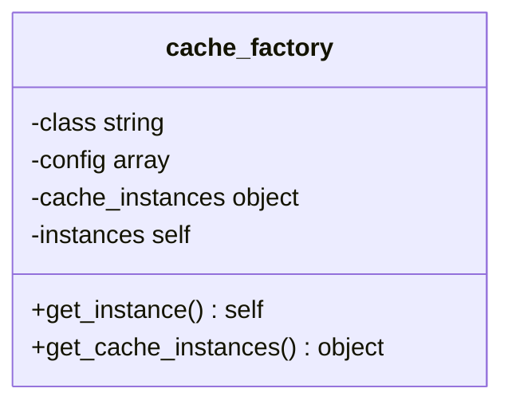
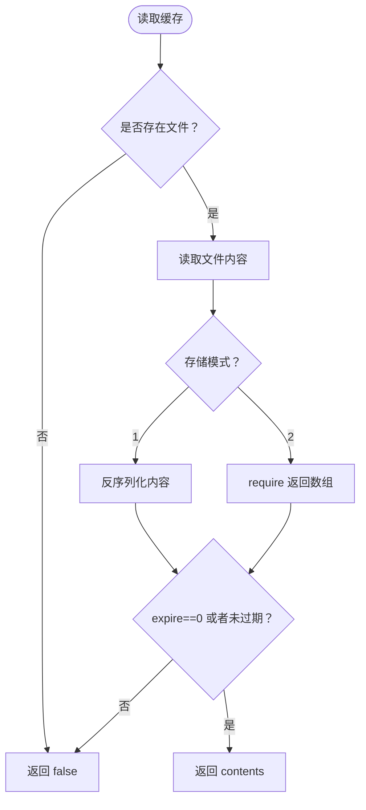
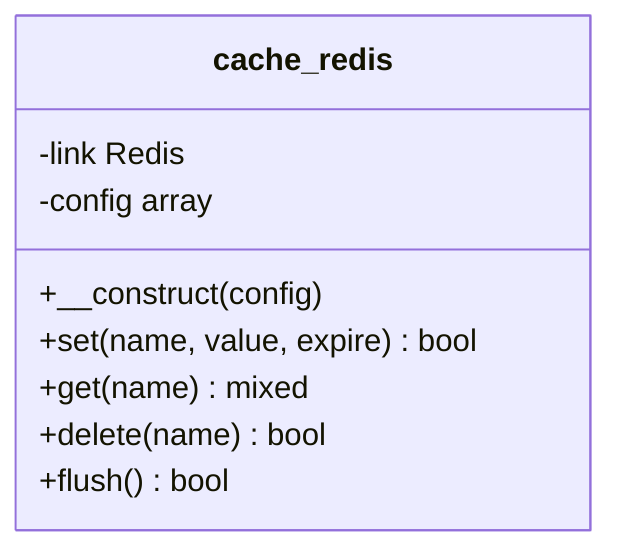
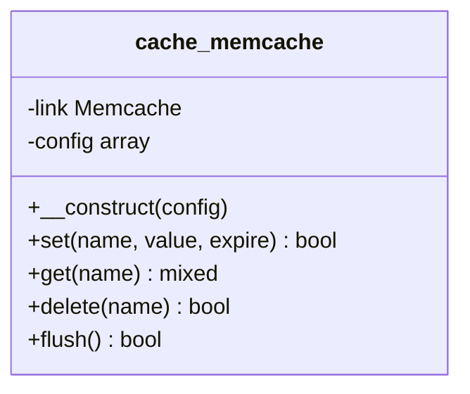
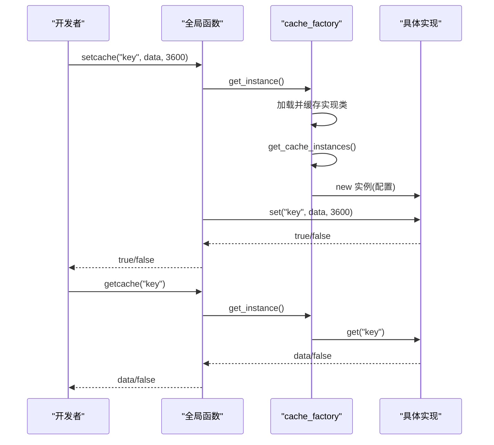
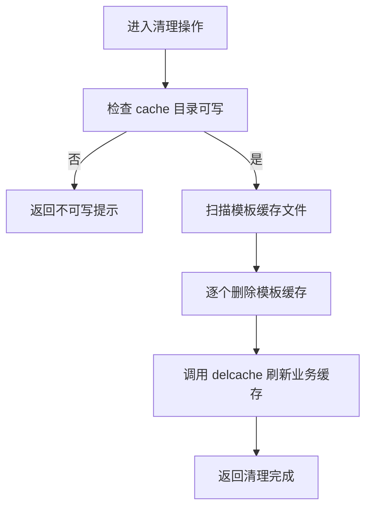
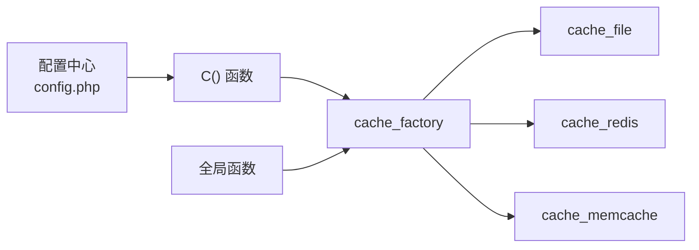

# 缓存系统

<cite>
**本文引用的文件**
- [cache_factory.class.php](file://ryphp/core/class/cache_factory.class.php)
- [cache_file.class.php](file://ryphp/core/class/cache_file.class.php)
- [cache_redis.class.php](file://ryphp/core/class/cache_redis.class.php)
- [cache_memcache.class.php](file://ryphp/core/class/cache_memcache.class.php)
- [config.php](file://common/config/config.php)
- [global.func.php](file://ryphp/core/function/global.func.php)
- [clear_cache.class.php](file://application/lry_admin_center/controller/clear_cache.class.php)
</cite>

## 目录
1. [简介](#简介)
2. [项目结构](#项目结构)
3. [核心组件](#核心组件)
4. [架构总览](#架构总览)
5. [详细组件分析](#详细组件分析)
6. [依赖关系分析](#依赖关系分析)
7. [性能考量](#性能考量)
8. [故障排除指南](#故障排除指南)
9. [结论](#结论)
10. [附录](#附录)

## 简介
本文件面向系统管理员与开发者，提供 LRYBlog 缓存系统的完整技术文档。重点涵盖：
- 工厂模式设计与实现，统一管理多种缓存后端（文件、Redis、Memcache）
- 文件缓存的存储结构、过期策略与清理机制
- Redis 与 Memcache 的集成方案（连接配置、数据序列化、持久化与前缀）
- 缓存性能优化最佳实践（粒度控制、失效策略、热点处理）
- 监控指标、故障排除与容量规划建议
- 使用示例与性能对比建议（基于仓库实现的特性）

## 项目结构
缓存系统位于框架核心层，采用“工厂 + 多实现”的架构：
- 工厂类负责根据配置选择具体缓存实现
- 三种缓存实现分别封装了各自后端的连接、序列化与过期控制
- 全局函数提供统一的 set/get/del 接口
- 管理后台提供缓存清理入口

图表来源
- [cache_factory.class.php](file://ryphp/core/class/cache_factory.class.php#L1-L84)
- [cache_file.class.php](file://ryphp/core/class/cache_file.class.php#L1-L130)
- [cache_redis.class.php](file://ryphp/core/class/cache_redis.class.php#L1-L108)
- [cache_memcache.class.php](file://ryphp/core/class/cache_memcache.class.php#L1-L91)
- [global.func.php](file://ryphp/core/function/global.func.php#L147-L151)
- [global.func.php](file://ryphp/core/function/global.func.php#L585-L589)
- [global.func.php](file://ryphp/core/function/global.func.php#L1519-L1523)
- [clear_cache.class.php](file://application/lry_admin_center/controller/clear_cache.class.php#L1-L25)

章节来源
- [cache_factory.class.php](file://ryphp/core/class/cache_factory.class.php#L1-L84)
- [config.php](file://common/config/config.php#L39-L66)
- [global.func.php](file://ryphp/core/function/global.func.php#L147-L151)
- [global.func.php](file://ryphp/core/function/global.func.php#L585-L589)
- [global.func.php](file://ryphp/core/function/global.func.php#L1519-L1523)
- [clear_cache.class.php](file://application/lry_admin_center/controller/clear_cache.class.php#L1-L25)

## 核心组件
- 工厂类：按配置动态加载并实例化具体缓存实现，支持单例与延迟初始化
- 文件缓存：基于文件系统，支持序列化与可执行数组两种存储模式
- Redis 缓存：基于 PHP Redis 扩展，支持持久连接、认证、库选择与过期
- Memcache 缓存：基于 PHP Memcache 扩展，支持持久连接与过期
- 全局接口：setcache/getcache/delcache 统一调用入口
- 管理后台：提供缓存清理能力

章节来源
- [cache_factory.class.php](file://ryphp/core/class/cache_factory.class.php#L36-L82)
- [cache_file.class.php](file://ryphp/core/class/cache_file.class.php#L34-L46)
- [cache_redis.class.php](file://ryphp/core/class/cache_redis.class.php#L30-L51)
- [cache_memcache.class.php](file://ryphp/core/class/cache_memcache.class.php#L27-L36)
- [global.func.php](file://ryphp/core/function/global.func.php#L147-L151)
- [global.func.php](file://ryphp/core/function/global.func.php#L585-L589)
- [global.func.php](file://ryphp/core/function/global.func.php#L1519-L1523)

## 架构总览
工厂模式通过配置项选择后端，全局函数封装调用，实现“统一入口、多后端适配”。

图表来源
- [global.func.php](file://ryphp/core/function/global.func.php#L147-L151)
- [global.func.php](file://ryphp/core/function/global.func.php#L585-L589)
- [global.func.php](file://ryphp/core/function/global.func.php#L1519-L1523)
- [cache_factory.class.php](file://ryphp/core/class/cache_factory.class.php#L36-L82)

## 详细组件分析

### 工厂类（cache_factory）
- 单例与延迟初始化：首次调用时根据配置加载对应实现类并缓存
- 支持的类型：file、redis、memcache；默认回退到 file
- 配置来源：C('cache_type')、C('file_config')、C('redis_config')、C('memcache_config')

图表来源
- [cache_factory.class.php](file://ryphp/core/class/cache_factory.class.php#L2-L82)

章节来源
- [cache_factory.class.php](file://ryphp/core/class/cache_factory.class.php#L36-L82)
- [config.php](file://common/config/config.php#L39-L66)

### 文件缓存（cache_file）
- 存储结构
  - 目录：由配置 cache_dir 指定，默认位于根目录 cache/cache_file
  - 文件命名：id + 后缀（默认 .cache.php）
  - 两种存储模式：
    - 模式1：文件头部带安全声明，内容为序列化数据
    - 模式2：文件为可执行数组，直接 require 返回
- 过期策略：在缓存数据中记录 expire 时间，读取时比较 SYS_TIME
- 清理机制：flush 遍历目录，逐个删除对应文件

图表来源
- [cache_file.class.php](file://ryphp/core/class/cache_file.class.php#L17-L29)
- [cache_file.class.php](file://ryphp/core/class/cache_file.class.php#L116-L128)

章节来源
- [cache_file.class.php](file://ryphp/core/class/cache_file.class.php#L3-L14)
- [cache_file.class.php](file://ryphp/core/class/cache_file.class.php#L17-L46)
- [cache_file.class.php](file://ryphp/core/class/cache_file.class.php#L61-L73)
- [cache_file.class.php](file://ryphp/core/class/cache_file.class.php#L75-L82)
- [cache_file.class.php](file://ryphp/core/class/cache_file.class.php#L103-L112)
- [cache_file.class.php](file://ryphp/core/class/cache_file.class.php#L116-L128)

### Redis 缓存（cache_redis）
- 连接配置：host、port、password、select、timeout、persistent、prefix、expire
- 序列化：数组类型使用 JSON 编码存储
- 过期控制：expire=0 不设置过期；否则使用 EX 秒过期
- 命令封装：set、get、delete、flush

图表来源
- [cache_redis.class.php](file://ryphp/core/class/cache_redis.class.php#L10-L51)
- [cache_redis.class.php](file://ryphp/core/class/cache_redis.class.php#L60-L72)
- [cache_redis.class.php](file://ryphp/core/class/cache_redis.class.php#L79-L87)
- [cache_redis.class.php](file://ryphp/core/class/cache_redis.class.php#L94-L97)
- [cache_redis.class.php](file://ryphp/core/class/cache_redis.class.php#L103-L105)

章节来源
- [cache_redis.class.php](file://ryphp/core/class/cache_redis.class.php#L13-L22)
- [cache_redis.class.php](file://ryphp/core/class/cache_redis.class.php#L30-L51)
- [cache_redis.class.php](file://ryphp/core/class/cache_redis.class.php#L60-L72)
- [cache_redis.class.php](file://ryphp/core/class/cache_redis.class.php#L79-L87)
- [cache_redis.class.php](file://ryphp/core/class/cache_redis.class.php#L94-L97)
- [cache_redis.class.php](file://ryphp/core/class/cache_redis.class.php#L103-L105)

### Memcache 缓存（cache_memcache）
- 连接配置：host、port、timeout、persistent、prefix、expire
- 序列化：数组类型使用 JSON 编码存储
- 过期控制：expire=0 使用默认过期；否则按秒设置
- 命令封装：set、get、delete、flush

图表来源
- [cache_memcache.class.php](file://ryphp/core/class/cache_memcache.class.php#L10-L36)
- [cache_memcache.class.php](file://ryphp/core/class/cache_memcache.class.php#L47-L54)
- [cache_memcache.class.php](file://ryphp/core/class/cache_memcache.class.php#L62-L70)
- [cache_memcache.class.php](file://ryphp/core/class/cache_memcache.class.php#L78-L81)
- [cache_memcache.class.php](file://ryphp/core/class/cache_memcache.class.php#L87-L89)

章节来源
- [cache_memcache.class.php](file://ryphp/core/class/cache_memcache.class.php#L13-L20)
- [cache_memcache.class.php](file://ryphp/core/class/cache_memcache.class.php#L27-L36)
- [cache_memcache.class.php](file://ryphp/core/class/cache_memcache.class.php#L47-L54)
- [cache_memcache.class.php](file://ryphp/core/class/cache_memcache.class.php#L62-L70)
- [cache_memcache.class.php](file://ryphp/core/class/cache_memcache.class.php#L78-L81)
- [cache_memcache.class.php](file://ryphp/core/class/cache_memcache.class.php#L87-L89)

### 全局函数与使用示例
- getcache(name)：读取缓存
- setcache(name, data, timeout)：写入缓存（timeout=0 表示不过期）
- delcache(name, flush=false)：删除单条或清空缓存

图表来源
- [global.func.php](file://ryphp/core/function/global.func.php#L147-L151)
- [global.func.php](file://ryphp/core/function/global.func.php#L585-L589)
- [cache_factory.class.php](file://ryphp/core/class/cache_factory.class.php#L36-L82)

章节来源
- [global.func.php](file://ryphp/core/function/global.func.php#L147-L151)
- [global.func.php](file://ryphp/core/function/global.func.php#L585-L589)
- [global.func.php](file://ryphp/core/function/global.func.php#L1519-L1523)

### 管理后台缓存清理
- 清理范围：模板编译缓存与业务缓存
- 权限校验：检查 cache 目录可写
- 清理流程：遍历模板缓存文件并删除，随后调用 delcache 刷新业务缓存

图表来源
- [clear_cache.class.php](file://application/lry_admin_center/controller/clear_cache.class.php#L9-L24)

章节来源
- [clear_cache.class.php](file://application/lry_admin_center/controller/clear_cache.class.php#L1-L25)

## 依赖关系分析
- 工厂类依赖配置中心（C 函数）与类加载机制
- 文件缓存依赖文件系统与序列化/可执行数组两种读写路径
- Redis/Memcache 依赖相应扩展与网络连接
- 全局函数依赖工厂类实现统一调用

图表来源
- [config.php](file://common/config/config.php#L39-L66)
- [global.func.php](file://ryphp/core/function/global.func.php#L4-L26)
- [cache_factory.class.php](file://ryphp/core/class/cache_factory.class.php#L39-L58)

章节来源
- [config.php](file://common/config/config.php#L39-L66)
- [global.func.php](file://ryphp/core/function/global.func.php#L4-L26)
- [cache_factory.class.php](file://ryphp/core/class/cache_factory.class.php#L39-L58)

## 性能考量
- 缓存粒度控制
  - 将大对象拆分为细粒度键，降低单键体积与序列化成本
  - 对热点键设置更短但合理的过期时间，避免长时间占用内存
- 失效策略
  - 采用“写时更新 + 定期刷新”策略，减少读放大
  - 对于频繁变更的数据，考虑使用短 TTL 并配合异步预热
- 热点数据处理
  - 将热点键复制到多个节点（若使用 Redis 集群/哨兵）
  - 使用只读副本或本地缓存（如文件缓存）作为降级
- 序列化与存储模式
  - 文件缓存模式2（可执行数组）读取更快，但需注意安全性
  - Redis/Memcache 使用 JSON 存储数组，便于跨语言读取
- 连接与并发
  - Redis 支持持久连接，减少连接开销
  - Memcache 支持持久连接，适合高并发场景
- 监控指标建议
  - 命中率、平均响应时间、内存使用率、连接数、过期键数量
  - 文件缓存：目录大小、文件数量、磁盘 IO
  - Redis/Memcache：内存使用、客户端连接数、拒绝连接数

[本节为通用性能建议，无需引用具体文件]

## 故障排除指南
- 扩展缺失
  - Redis：提示“不支持 redis”，请安装 Redis 扩展
  - Memcache：提示“不支持 memcache”，请安装 Memcache 扩展
- 权限问题
  - 文件缓存：cache 目录不可写会导致写入失败；检查目录权限与 SELinux/AppArmor
- 过期与清理
  - 文件缓存：过期判断基于 expire 字段；flush 会删除所有缓存文件
  - Redis/Memcache：flush 会清空当前库；确认 prefix 前缀是否一致
- 管理后台清理
  - 若提示 cache 目录不可写，请修正权限或 SELinux 策略
  - 清理模板缓存后，业务缓存仍需单独调用 delcache 或 flush

章节来源
- [cache_redis.class.php](file://ryphp/core/class/cache_redis.class.php#L31-L33)
- [cache_memcache.class.php](file://ryphp/core/class/cache_memcache.class.php#L28-L30)
- [cache_file.class.php](file://ryphp/core/class/cache_file.class.php#L40-L42)
- [clear_cache.class.php](file://application/lry_admin_center/controller/clear_cache.class.php#L10-L12)

## 结论
LRYBlog 的缓存系统通过工厂模式实现了对文件、Redis、Memcache 的统一接入，具备良好的可扩展性与易用性。结合合理的粒度控制、失效策略与监控指标，可在不同规模与场景下获得稳定高效的缓存表现。建议在生产环境优先评估 Redis/Memcache 的部署与运维能力，并配套完善的清理与监控机制。

[本节为总结性内容，无需引用具体文件]

## 附录

### 配置项一览（来自配置文件）
- cache_type：缓存类型（file、redis、memcache）
- file_config：文件缓存配置（cache_dir、suffix、mode）
- redis_config：Redis 配置（host、port、password、select、timeout、expire、persistent、prefix）
- memcache_config：Memcache 配置（host、port、timeout、expire、persistent、prefix）

章节来源
- [config.php](file://common/config/config.php#L39-L66)

### 全局函数使用参考
- getcache(name)：读取缓存
- setcache(name, data, timeout)：写入缓存
- delcache(name, flush=false)：删除或清空缓存

章节来源
- [global.func.php](file://ryphp/core/function/global.func.php#L147-L151)
- [global.func.php](file://ryphp/core/function/global.func.php#L585-L589)
- [global.func.php](file://ryphp/core/function/global.func.php#L1519-L1523)