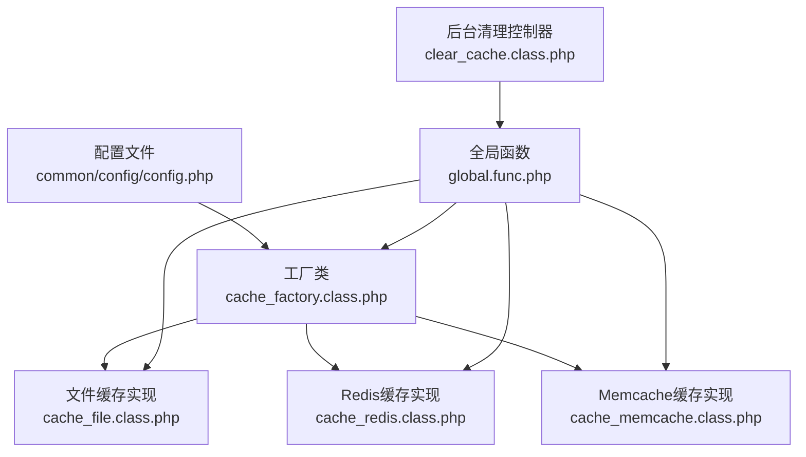
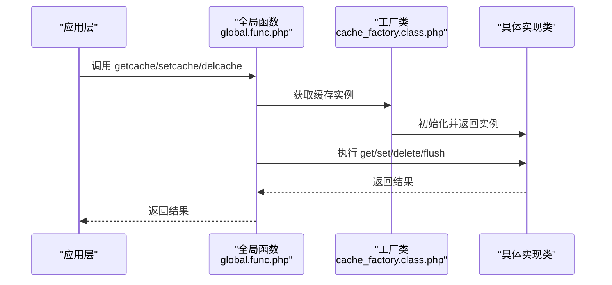
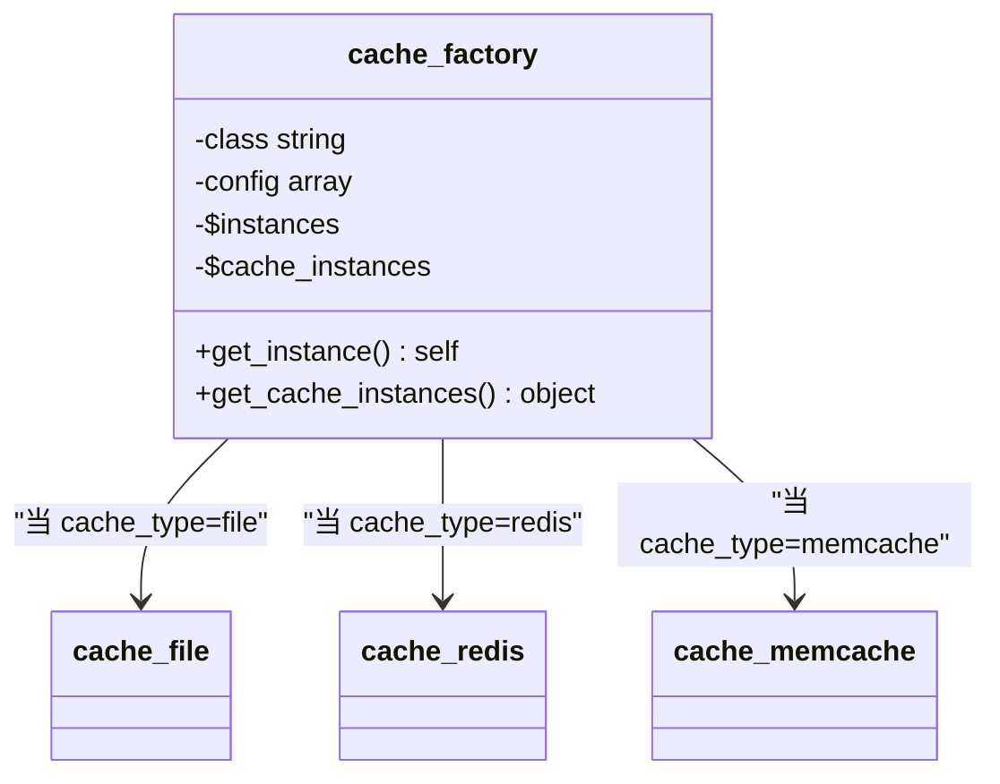
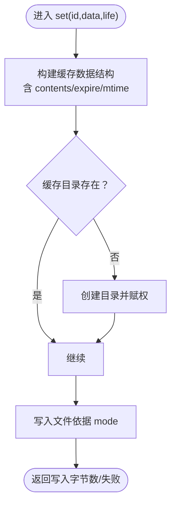
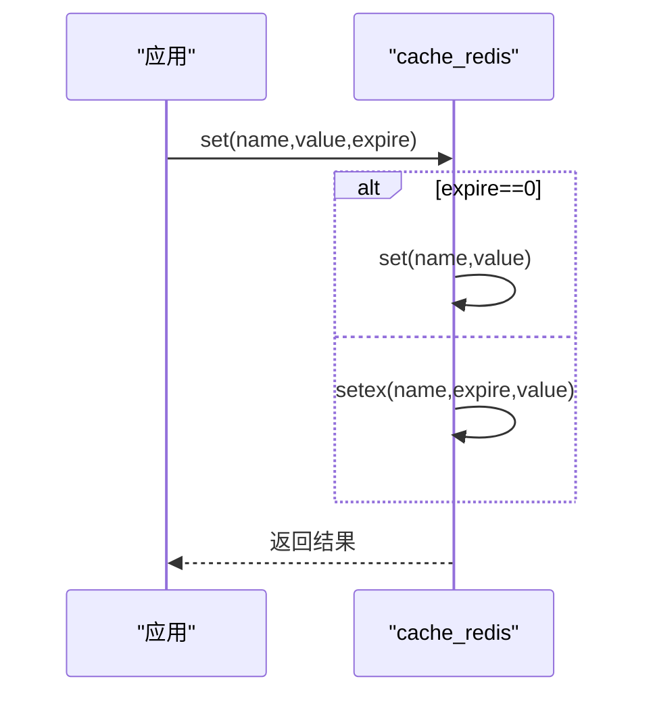
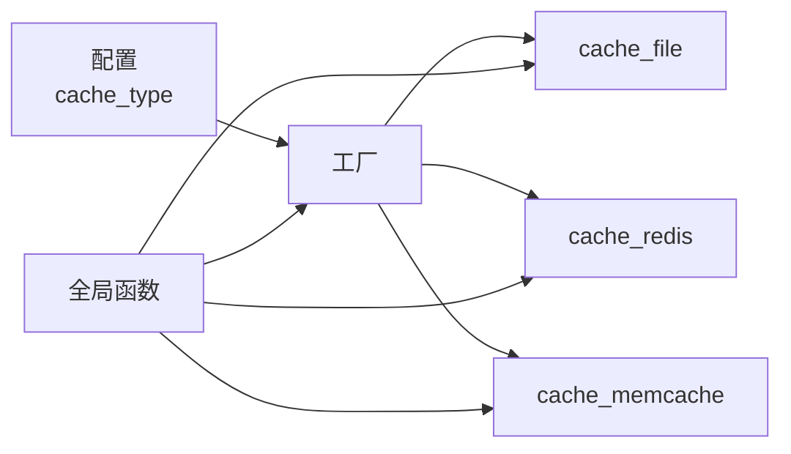

# 缓存配置管理

<cite>
**本文引用的文件**
- [common/config/config.php](file://common/config/config.php)
- [ryphp/core/class/cache_factory.class.php](file://ryphp/core/class/cache_factory.class.php)
- [ryphp/core/class/cache_file.class.php](file://ryphp/core/class/cache_file.class.php)
- [ryphp/core/class/cache_redis.class.php](file://ryphp/core/class/cache_redis.class.php)
- [ryphp/core/class/cache_memcache.class.php](file://ryphp/core/class/cache_memcache.class.php)
- [ryphp/core/function/global.func.php](file://ryphp/core/function/global.func.php)
- [application/lry_admin_center/controller/clear_cache.class.php](file://application/lry_admin_center/controller/clear_cache.class.php)
</cite>

## 目录
1. [简介](#简介)
2. [项目结构](#项目结构)
3. [核心组件](#核心组件)
4. [架构总览](#架构总览)
5. [详细组件分析](#详细组件分析)
6. [依赖关系分析](#依赖关系分析)
7. [性能考量](#性能考量)
8. [故障排查指南](#故障排查指南)
9. [结论](#结论)
10. [附录](#附录)

## 简介
本文件面向系统管理员与开发人员，系统性梳理 LRYBlog 中的缓存配置管理，涵盖缓存类型选择、文件缓存、Redis 缓存与 Memcache 缓存的配置参数、行为差异与最佳实践；并提供配置结构说明、参数取值范围、配置验证与测试方法，以及常见问题排查建议。

## 项目结构
围绕缓存配置与使用的关键文件分布如下：
- 配置入口：common/config/config.php 提供 cache_type 及三类缓存的配置项
- 工厂与适配：ryphp/core/class/cache_factory.class.php 根据配置动态加载具体缓存实现
- 实现类：cache_file.class.php、cache_redis.class.php、cache_memcache.class.php
- 全局函数：ryphp/core/function/global.func.php 提供 getcache/setcache/delcache 的便捷接口
- 后台清理：application/lry_admin_center/controller/clear_cache.class.php 提供缓存清理入口

图表来源
- [common/config/config.php](file://common/config/config.php#L39-L66)
- [ryphp/core/class/cache_factory.class.php](file://ryphp/core/class/cache_factory.class.php#L36-L82)
- [ryphp/core/class/cache_file.class.php](file://ryphp/core/class/cache_file.class.php#L1-L130)
- [ryphp/core/class/cache_redis.class.php](file://ryphp/core/class/cache_redis.class.php#L1-L108)
- [ryphp/core/class/cache_memcache.class.php](file://ryphp/core/class/cache_memcache.class.php#L1-L91)
- [ryphp/core/function/global.func.php](file://ryphp/core/function/global.func.php#L147-L151)
- [application/lry_admin_center/controller/clear_cache.class.php](file://application/lry_admin_center/controller/clear_cache.class.php#L9-L24)

章节来源
- [common/config/config.php](file://common/config/config.php#L39-L66)
- [ryphp/core/class/cache_factory.class.php](file://ryphp/core/class/cache_factory.class.php#L36-L82)

## 核心组件
- 缓存类型选择：通过配置项 cache_type 决定使用 file、redis 或 memcache
- 工厂模式：cache_factory 根据 cache_type 动态加载对应实现类，并延迟初始化单例缓存实例
- 通用接口：全局函数 getcache/setcache/delcache 封装对缓存的统一调用
- 后台清理：提供一键清理系统缓存的功能入口

章节来源
- [ryphp/core/class/cache_factory.class.php](file://ryphp/core/class/cache_factory.class.php#L36-L82)
- [ryphp/core/function/global.func.php](file://ryphp/core/function/global.func.php#L147-L151)
- [application/lry_admin_center/controller/clear_cache.class.php](file://application/lry_admin_center/controller/clear_cache.class.php#L9-L24)

## 架构总览
缓存子系统采用“配置驱动 + 工厂 + 适配器”的分层设计：
- 配置层：集中于配置文件，定义缓存类型与各实现的参数
- 工厂层：按配置选择具体实现类，负责实例化与懒加载
- 适配器层：三种缓存实现分别处理连接、序列化/编码、过期策略与清理
- 应用层：通过全局函数统一调用缓存能力，业务代码无需感知底层差异

图表来源
- [ryphp/core/function/global.func.php](file://ryphp/core/function/global.func.php#L147-L151)
- [ryphp/core/class/cache_factory.class.php](file://ryphp/core/class/cache_factory.class.php#L77-L82)
- [ryphp/core/class/cache_file.class.php](file://ryphp/core/class/cache_file.class.php#L17-L46)
- [ryphp/core/class/cache_redis.class.php](file://ryphp/core/class/cache_redis.class.php#L60-L87)
- [ryphp/core/class/cache_memcache.class.php](file://ryphp/core/class/cache_memcache.class.php#L47-L69)

## 详细组件分析

### 配置文件结构与参数说明
- cache_type：缓存类型，支持 file、redis、memcache。未配置或非法时回退为 file
- file_config：文件缓存专用配置
  - cache_dir：缓存文件根目录
  - suffix：缓存文件后缀
  - mode：缓存格式，1=序列化存储，2=可执行数组文件
- redis_config：Redis 缓存专用配置
  - host/port/password/select/timeout/expire/persistent/prefix
- memcache_config：Memcache 缓存专用配置
  - host/port/timeout/expire/persistent/prefix

章节来源
- [common/config/config.php](file://common/config/config.php#L39-L66)

### 工厂类：cache_factory
- 职责：根据配置选择实现类、加载类文件、延迟初始化单例缓存实例
- 行为要点：
  - 未配置或非法类型时默认 file
  - 使用框架加载器加载对应实现类
  - get_cache_instances 保证单例与懒加载

图表来源
- [ryphp/core/class/cache_factory.class.php](file://ryphp/core/class/cache_factory.class.php#L36-L82)

章节来源
- [ryphp/core/class/cache_factory.class.php](file://ryphp/core/class/cache_factory.class.php#L36-L82)

### 文件缓存：cache_file
- 特点：基于文件系统持久化，无需额外服务
- 关键行为：
  - get：检查文件存在与过期，返回内容或 false
  - set：写入缓存文件，支持两种存储模式（序列化/可执行数组）
  - delete/flush：删除指定或全部缓存文件
  - has：判断缓存是否存在
- 注意事项：
  - cache_dir 必须可写
  - mode=2 时文件可直接被 PHP require 执行，性能更优但需注意安全性

图表来源
- [ryphp/core/class/cache_file.class.php](file://ryphp/core/class/cache_file.class.php#L34-L46)
- [ryphp/core/class/cache_file.class.php](file://ryphp/core/class/cache_file.class.php#L103-L112)

章节来源
- [ryphp/core/class/cache_file.class.php](file://ryphp/core/class/cache_file.class.php#L17-L128)

### Redis 缓存：cache_redis
- 特点：高性能内存缓存，支持过期、前缀、持久连接
- 关键行为：
  - 连接：支持短/长连接，认证，选择库
  - set/get/delete/flush：统一接口，数组自动 JSON 编码/解码
  - expire=0 表示不过期
- 参数要点：
  - persistent=true 时使用长连接，适合高并发场景
  - prefix 用于多环境隔离
  - select 用于多 DB 场景

图表来源
- [ryphp/core/class/cache_redis.class.php](file://ryphp/core/class/cache_redis.class.php#L60-L72)

章节来源
- [ryphp/core/class/cache_redis.class.php](file://ryphp/core/class/cache_redis.class.php#L30-L51)
- [ryphp/core/class/cache_redis.class.php](file://ryphp/core/class/cache_redis.class.php#L60-L87)

### Memcache 缓存：cache_memcache
- 特点：轻量级内存缓存，语法简洁
- 关键行为：
  - 连接：支持短/长连接
  - set/get/delete/flush：统一接口，数组自动 JSON 编码/解码
- 参数要点：
  - expire=0 表示不过期
  - prefix 用于多环境隔离

章节来源
- [ryphp/core/class/cache_memcache.class.php](file://ryphp/core/class/cache_memcache.class.php#L27-L36)
- [ryphp/core/class/cache_memcache.class.php](file://ryphp/core/class/cache_memcache.class.php#L47-L69)

### 全局函数：getcache/setcache/delcache
- getcache(name)：从当前缓存实现读取
- setcache(name, data, timeout)：写入缓存，timeout 为秒
- delcache(name, flush=false)：删除单条或清空全部缓存

章节来源
- [ryphp/core/function/global.func.php](file://ryphp/core/function/global.func.php#L147-L151)
- [ryphp/core/function/global.func.php](file://ryphp/core/function/global.func.php#L1519-L1523)

### 后台清理：clear_cache 控制器
- 功能：校验缓存目录可写后，清理模板编译缓存并调用 delcache 清理业务缓存
- 适用场景：发布后强制刷新缓存

章节来源
- [application/lry_admin_center/controller/clear_cache.class.php](file://application/lry_admin_center/controller/clear_cache.class.php#L9-L24)

## 依赖关系分析
- 配置依赖：cache_type 决定工厂加载的实现类
- 工厂依赖：根据配置项选择 file_config/redis_config/memcache_config 并传入构造函数
- 实现依赖：各自依赖 PHP 扩展（redis/memcache），否则抛出错误
- 应用依赖：全局函数封装统一调用，业务代码只依赖全局函数

图表来源
- [common/config/config.php](file://common/config/config.php#L39-L66)
- [ryphp/core/class/cache_factory.class.php](file://ryphp/core/class/cache_factory.class.php#L39-L58)
- [ryphp/core/class/cache_file.class.php](file://ryphp/core/class/cache_file.class.php#L30-L46)
- [ryphp/core/class/cache_redis.class.php](file://ryphp/core/class/cache_redis.class.php#L30-L51)
- [ryphp/core/class/cache_memcache.class.php](file://ryphp/core/class/cache_memcache.class.php#L27-L36)
- [ryphp/core/function/global.func.php](file://ryphp/core/function/global.func.php#L147-L151)

章节来源
- [common/config/config.php](file://common/config/config.php#L39-L66)
- [ryphp/core/class/cache_factory.class.php](file://ryphp/core/class/cache_factory.class.php#L39-L58)

## 性能考量
- 文件缓存
  - 优点：零外部依赖、部署简单
  - 缺点：I/O 开销大、并发下锁竞争明显
  - 建议：生产环境优先考虑 Redis/Memcache
- Redis
  - 优点：高性能、支持多种数据结构、过期控制精确
  - 建议：启用持久连接（persistent=true）以降低连接开销；合理设置 expire；使用 prefix 隔离环境
- Memcache
  - 优点：轻量、易用
  - 建议：在低复杂度场景使用；注意数组自动 JSON 编码带来的体积与 CPU 开销

## 故障排查指南
- 无法加载缓存扩展
  - 现象：报错提示不支持 redis 或 memcache
  - 排查：确认 PHP 已安装并启用相应扩展
  - 参考实现：扩展检测与报错
- 缓存目录不可写
  - 现象：文件缓存写入失败或后台清理失败
  - 排查：检查 cache 目录权限与磁盘空间
  - 参考实现：后台清理控制器对目录可写的检查
- 连接失败（Redis/Memcache）
  - 现象：连接超时、认证失败、选择库失败
  - 排查：核对 host/port/password/select/timeout/persistent/prefix；确认网络连通性
- 缓存未生效或过期异常
  - 现象：读取不到缓存或过期时间不符合预期
  - 排查：确认 expire 设置；检查 prefix 是否一致；确认实现类对数组的 JSON 处理逻辑
- 清理无效
  - 现象：delcache 未删除或 flush 未清空
  - 排查：确认传参 name 与 prefix 组合；确认 flush 参数；检查实现类的 delete/flush 逻辑

章节来源
- [ryphp/core/class/cache_redis.class.php](file://ryphp/core/class/cache_redis.class.php#L31-L33)
- [ryphp/core/class/cache_memcache.class.php](file://ryphp/core/class/cache_memcache.class.php#L28-L30)
- [application/lry_admin_center/controller/clear_cache.class.php](file://application/lry_admin_center/controller/clear_cache.class.php#L10-L12)

## 结论
LRYBlog 的缓存体系通过配置驱动与工厂模式实现了对文件、Redis、Memcache 的统一封装，业务层仅依赖全局函数即可灵活切换后端。生产环境中推荐优先使用 Redis，兼顾性能与功能；文件缓存适合开发与小规模部署；Memcache 适合轻量场景。正确理解配置参数与实现细节，有助于在不同环境下获得稳定高效的缓存体验。

## 附录

### 配置参数一览与取值范围
- cache_type：file | redis | memcache
- file_config.cache_dir：绝对/相对路径（需可写）
- file_config.suffix：任意字符串（建议带点）
- file_config.mode：1 | 2
- redis_config.host：IP 或域名
- redis_config.port：整数（默认 6379）
- redis_config.password：字符串（可空）
- redis_config.select：整数（DB 索引）
- redis_config.timeout：秒（0 表示无超时）
- redis_config.expire：秒（0 表示不过期）
- redis_config.persistent：true | false
- redis_config.prefix：字符串（建议区分环境）
- memcache_config.host：IP 或域名
- memcache_config.port：整数（默认 11211）
- memcache_config.timeout：秒（0 表示无超时）
- memcache_config.expire：秒（0 表示不过期）
- memcache_config.persistent：true | false
- memcache_config.prefix：字符串（建议区分环境）

章节来源
- [common/config/config.php](file://common/config/config.php#L39-L66)

### 配置验证与测试方法
- 验证步骤
  - 修改 common/config/config.php 中 cache_type 与对应配置段
  - 在业务代码中调用 setcache/getcache/delcache 验证读写与过期
  - 使用后台清理入口触发清理流程
- 测试建议
  - 分别在 file、redis、memcache 下重复上述步骤，对比行为差异
  - 对 Redis/Memcache：验证持久连接、前缀隔离、认证与选择库

章节来源
- [ryphp/core/function/global.func.php](file://ryphp/core/function/global.func.php#L147-L151)
- [ryphp/core/function/global.func.php](file://ryphp/core/function/global.func.php#L1519-L1523)
- [application/lry_admin_center/controller/clear_cache.class.php](file://application/lry_admin_center/controller/clear_cache.class.php#L9-L24)