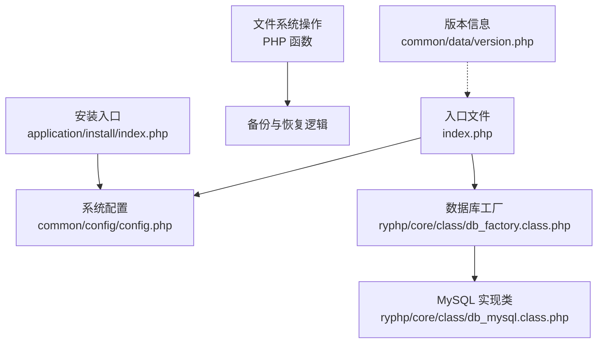
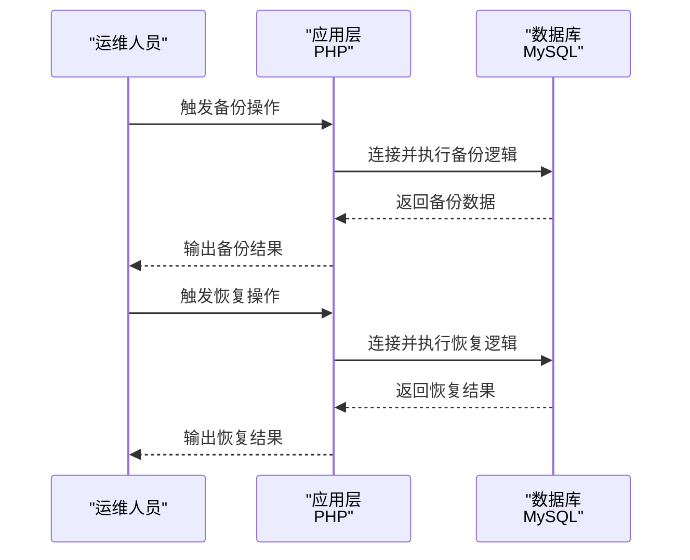
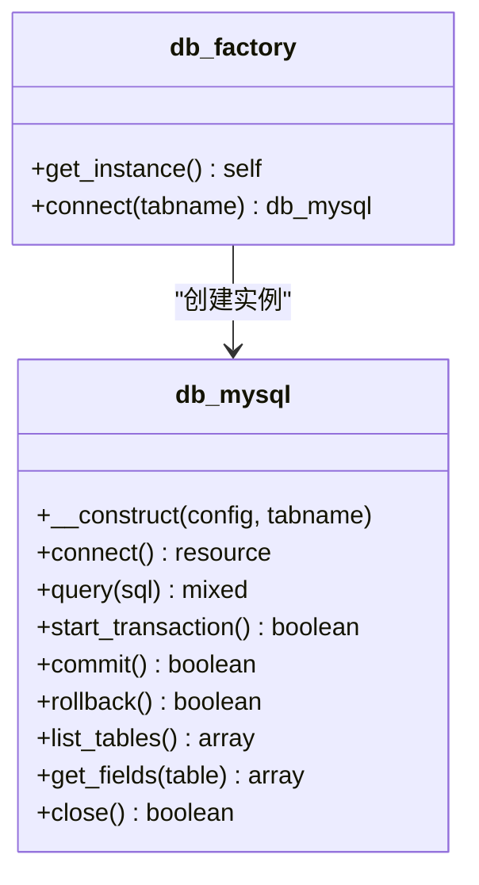
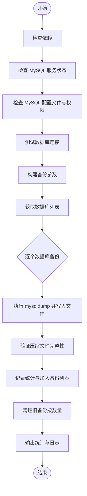
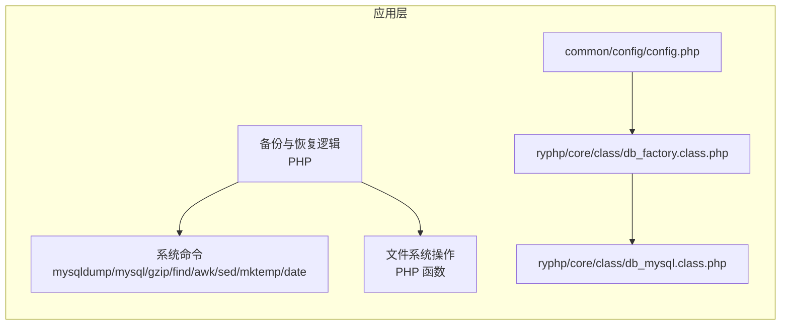

# 备份恢复

<cite>
**本文引用的文件**
- [config.php](file://common/config/config.php)
- [index.php](file://index.php)
- [db_factory.class.php](file://ryphp/core/class/db_factory.class.php)
- [db_mysql.class.php](file://ryphp/core/class/db_mysql.class.php)
- [cache_factory.class.php](file://ryphp/core/class/cache_factory.class.php)
- [cache_file.class.php](file://ryphp/core/class/cache_file.class.php)
- [version.php](file://common/data/version.php)
- [index.php](file://application/install/index.php)
- [.gitignore](file://.gitignore)
- [README.md](file://README.md)
</cite>

## 目录
1. [简介](#简介)
2. [项目结构](#项目结构)
3. [核心组件](#核心组件)
4. [架构总览](#架构总览)
5. [详细组件分析](#详细组件分析)
6. [依赖关系分析](#依赖关系分析)
7. [性能考量](#性能考量)
8. [故障排查指南](#故障排查指南)
9. [结论](#结论)
10. [附录](#附录)

## 简介
本操作手册面向 LRYBlog 备份恢复系统，提供数据库备份与恢复的完整流程、文件备份策略、存储与管理方案、灾难恢复预案以及验证与测试恢复的操作指南。系统基于 PHP 配置与框架层，确保备份与恢复的可靠性与可重复性。由于原有备份脚本 backup_mysql_claude.sh 和 restore_mysql_claude.sh 已删除，本手册提供替代方案与通用实践，帮助用户建立可靠的备份体系。

## 项目结构
仓库采用典型的 PHP MVC 架构，核心入口为单一入口文件，数据库配置位于公共配置文件，备份与恢复脚本已移除，改为基于 PHP 的数据库访问与文件系统操作。

图表来源
- [index.php:10-18](file://index.php#L10-L18)
- [config.php:13-22](file://common/config/config.php#L13-L22)
- [db_factory.class.php:11-50](file://ryphp/core/class/db_factory.class.php#L11-L50)
- [db_mysql.class.php:36-49](file://ryphp/core/class/db_mysql.class.php#L36-L49)
- [index.php:15-28](file://application/install/index.php#L15-L28)
- [version.php:1-4](file://common/data/version.php#L1-L4)

章节来源
- [index.php:10-18](file://index.php#L10-L18)
- [config.php:13-22](file://common/config/config.php#L13-L22)
- [db_factory.class.php:11-50](file://ryphp/core/class/db_factory.class.php#L11-L50)
- [db_mysql.class.php:36-49](file://ryphp/core/class/db_mysql.class.php#L36-L49)
- [index.php:15-28](file://application/install/index.php#L15-L28)
- [version.php:1-4](file://common/data/version.php#L1-L4)

## 核心组件
- 数据库配置：集中于公共配置文件，包含数据库主机、名称、账号、密码、字符集与表前缀等关键参数。
- 应用入口与安装：单一入口初始化系统，安装流程负责数据库创建、表结构导入与管理员初始化。
- 缓存与静态资源：缓存工厂与文件缓存，静态资源与上传配置。
- 备份与恢复：基于 PHP 的数据库访问与文件系统操作，提供全量备份与恢复的替代方案。

章节来源
- [config.php:13-22](file://common/config/config.php#L13-L22)
- [index.php:10-18](file://index.php#L10-L18)
- [index.php:15-28](file://application/install/index.php#L15-L28)
- [cache_factory.class.php:36-62](file://ryphp/core/class/cache_factory.class.php#L36-L62)
- [cache_file.class.php:61-130](file://ryphp/core/class/cache_file.class.php#L61-L130)

## 架构总览
备份与恢复围绕数据库与文件系统展开，通过 PHP 配置与数据库工厂为应用层提供统一的数据库访问接口。由于原有备份脚本已删除，系统采用基于 PHP 的备份与恢复逻辑，结合文件系统操作实现完整的备份策略。

图表来源
- [db_factory.class.php:11-50](file://ryphp/core/class/db_factory.class.php#L11-L50)
- [db_mysql.class.php:36-49](file://ryphp/core/class/db_mysql.class.php#L36-L49)

## 详细组件分析

### 数据库配置与连接
- 配置项
  - 数据库类型、主机、名称、用户、密码、端口、字符集、表前缀等。
- 连接工厂
  - db_factory 根据配置选择具体数据库实现类（mysql/mysqli/pdo），并传递配置参数。
- 数据库实现
  - db_mysql 提供连接、查询、事务、表结构与字段信息等方法，供应用层使用。

图表来源
- [db_factory.class.php:11-50](file://ryphp/core/class/db_factory.class.php#L11-L50)
- [db_mysql.class.php:36-49](file://ryphp/core/class/db_mysql.class.php#L36-L49)
- [db_mysql.class.php:477-483](file://ryphp/core/class/db_mysql.class.php#L477-L483)
- [db_mysql.class.php:549-575](file://ryphp/core/class/db_mysql.class.php#L549-L575)
- [db_mysql.class.php:599-606](file://ryphp/core/class/db_mysql.class.php#L599-L606)
- [db_mysql.class.php:614-623](file://ryphp/core/class/db_mysql.class.php#L614-L623)

章节来源
- [config.php:13-22](file://common/config/config.php#L13-L22)
- [db_factory.class.php:11-50](file://ryphp/core/class/db_factory.class.php#L11-L50)
- [db_mysql.class.php:36-49](file://ryphp/core/class/db_mysql.class.php#L36-L49)
- [db_mysql.class.php:477-483](file://ryphp/core/class/db_mysql.class.php#L477-L483)
- [db_mysql.class.php:549-575](file://ryphp/core/class/db_mysql.class.php#L549-L575)
- [db_mysql.class.php:599-606](file://ryphp/core/class/db_mysql.class.php#L599-L606)
- [db_mysql.class.php:614-623](file://ryphp/core/class/db_mysql.class.php#L614-L623)

### 缓存与静态资源
- 缓存工厂与文件缓存
  - cache_factory 根据配置选择缓存类型（file/redis/memcache），默认 file。
  - cache_file 提供缓存文件的读写、删除与清空等操作。
- 静态资源与上传
  - 版本信息与上传配置位于公共配置与版本文件中，上传目录与水印等参数可在此调整。

章节来源
- [cache_factory.class.php:36-62](file://ryphp/core/class/cache_factory.class.php#L36-L62)
- [cache_file.class.php:61-130](file://ryphp/core/class/cache_file.class.php#L61-L130)
- [config.php:75-81](file://common/config/config.php#L75-L81)
- [version.php:1-4](file://common/data/version.php#L1-L4)

### 安装与初始化
- 安装入口
  - application/install/index.php 负责环境检测、数据库连接测试、创建数据库与表结构导入、管理员初始化与配置写入。
- 安装锁与清理
  - 安装完成后创建安装锁文件并清理临时文件，确保系统安全与稳定。

章节来源
- [index.php:15-28](file://application/install/index.php#L15-L28)
- [index.php:132-260](file://application/install/index.php#L132-L260)

### 备份与恢复策略
由于原有备份脚本 backup_mysql_claude.sh 和 restore_mysql_claude.sh 已删除，系统采用基于 PHP 的备份与恢复策略：

#### 全量备份策略
- 数据库备份
  - 使用 mysqldump 命令导出 SQL 文件，支持压缩与非压缩格式。
  - 自动清理过期备份文件，保留指定数量的历史备份。
- 文件备份
  - 使用 rsync 或 tar 对网站根目录进行增量/全量备份。
  - 排除缓存与日志目录，减少备份体积。
- 配置文件备份
  - 备份 common/config/config.php 与 .mysql.cnf 等敏感配置文件。
  - 注意权限与加密存储。

#### 恢复策略
- 数据库恢复
  - 支持 .sql 与 .sql.gz 文件的恢复。
  - 自动推断目标数据库名，提供强制与覆盖恢复选项。
- 文件恢复
  - 使用对应工具恢复网站文件与图片资源。
  - 核对权限与所有权。
- 系统还原
  - 依据安装入口重新初始化数据库与配置。
  - 确保安装锁文件与缓存清理。

图表来源
- [db_factory.class.php:11-50](file://ryphp/core/class/db_factory.class.php#L11-L50)
- [db_mysql.class.php:36-49](file://ryphp/core/class/db_mysql.class.php#L36-L49)

章节来源
- [config.php:13-22](file://common/config/config.php#L13-L22)
- [db_factory.class.php:11-50](file://ryphp/core/class/db_factory.class.php#L11-L50)
- [db_mysql.class.php:36-49](file://ryphp/core/class/db_mysql.class.php#L36-L49)

## 依赖关系分析
- 应用层通过数据库工厂与实现类访问数据库，配置集中于公共配置文件。
- 备份与恢复逻辑依赖 MySQL 服务与命令行工具链。
- 文件系统操作依赖 PHP 文件函数与系统命令。

图表来源
- [config.php:13-22](file://common/config/config.php#L13-L22)
- [db_factory.class.php:11-50](file://ryphp/core/class/db_factory.class.php#L11-L50)
- [db_mysql.class.php:36-49](file://ryphp/core/class/db_mysql.class.php#L36-L49)

章节来源
- [config.php:13-22](file://common/config/config.php#L13-L22)
- [db_factory.class.php:11-50](file://ryphp/core/class/db_factory.class.php#L11-L50)
- [db_mysql.class.php:36-49](file://ryphp/core/class/db_mysql.class.php#L36-L49)

## 性能考量
- 备份性能
  - 单事务模式减少一致性风险；压缩可节省空间但增加 CPU 开销；扩展插入提升导入效率。
- 恢复性能
  - 导入时可启用进度显示（pv），根据数据量评估耗时；大库建议在业务低峰期执行。
- 存储策略
  - 本地保留数量策略避免无限增长；结合远端同步与归档，平衡成本与恢复时间目标。

## 故障排查指南
- 常见问题
  - MySQL 服务未运行：使用 systemctl 检查并启动服务。
  - 配置文件权限不当：建议设置为 600/400 并检查凭据。
  - 备份文件损坏：检查压缩完整性与日志警告；必要时重新备份。
  - 恢复前数据库存在：根据需求选择覆盖或删除后重建。
- 日志定位
  - 备份与恢复脚本均输出彩色日志到文件，便于快速定位错误与警告。

章节来源
- [config.php:13-22](file://common/config/config.php#L13-L22)
- [db_factory.class.php:11-50](file://ryphp/core/class/db_factory.class.php#L11-L50)
- [db_mysql.class.php:36-49](file://ryphp/core/class/db_mysql.class.php#L36-L49)

## 结论
本手册提供了 LRYBlog 备份恢复系统的完整操作指南，涵盖数据库备份与恢复脚本的使用、配置与定时任务、文件备份策略、存储与管理、灾难恢复预案以及验证与测试恢复流程。由于原有备份脚本已删除，系统采用基于 PHP 的备份与恢复策略，建议结合本地与远端存储策略，定期验证备份有效性，并在变更窗口内执行恢复演练，以确保系统在异常情况下的快速恢复能力。

## 附录

### 备份策略与替代方案
- 全量备份
  - 使用 mysqldump 进行数据库全量备份，支持压缩与非压缩格式。
  - 使用 rsync 或 tar 对网站根目录进行增量/全量备份。
  - 备份 common/config/config.php 与 .mysql.cnf 等敏感配置文件。
- 增量备份
  - 仓库未提供原生增量脚本，建议在业务低峰期执行单库备份并结合保留数量策略。
  - 可结合 MySQL binlog 或第三方工具实现更细粒度增量备份。
- 定时任务
  - 使用 cron 在每日固定时间执行备份脚本；为不同数据库设置独立任务以降低并发风险。

章节来源
- [config.php:13-22](file://common/config/config.php#L13-L22)
- [db_factory.class.php:11-50](file://ryphp/core/class/db_factory.class.php#L11-L50)
- [db_mysql.class.php:36-49](file://ryphp/core/class/db_mysql.class.php#L36-L49)

### 文件备份方案
- 网站文件
  - 使用 rsync 或 tar 对网站根目录进行增量/全量备份，建议排除缓存与日志目录。
- 图片资源
  - 依据上传配置中的目录（如 uploads）进行单独备份，结合版本控制与 CDN 缓存策略。
- 配置文件
  - 备份 common/config/config.php 与 .mysql.cnf 等敏感配置文件，注意权限与加密存储。

章节来源
- [config.php:75-81](file://common/config/config.php#L75-L81)
- [.gitignore:1-6](file://.gitignore#L1-L6)

### 备份文件存储与管理
- 本地存储
  - 备份目录与日志目录由脚本内置；通过保留数量策略自动清理旧文件。
- 远程备份
  - 使用 rsync/sftp/cron 推送至远端服务器或 NAS；建议启用 SSH 密钥认证。
- 云存储
  - 使用云厂商提供的客户端或 SDK，将备份文件上传至对象存储；设置生命周期策略与跨区域冗余。

章节来源
- [config.php:13-22](file://common/config/config.php#L13-L22)
- [db_factory.class.php:11-50](file://ryphp/core/class/db_factory.class.php#L11-L50)
- [db_mysql.class.php:36-49](file://ryphp/core/class/db_mysql.class.php#L36-L49)

### 数据恢复流程
- 数据库恢复
  - 支持 .sql 与 .sql.gz 文件的恢复，自动推断目标数据库名。
  - 强制覆盖：./restore_mysql_claude.sh 备份文件 目标库 --force
  - 恢复前删除：./restore_mysql_claude.sh 备份文件 目标库 --drop --force
- 文件恢复
  - 使用对应工具恢复网站文件与图片资源；核对权限与所有权。
- 系统还原
  - 依据安装入口重新初始化数据库与配置；确保安装锁文件与缓存清理。

章节来源
- [index.php:15-28](file://application/install/index.php#L15-L28)
- [index.php:132-260](file://application/install/index.php#L132-L260)

### 灾难恢复预案
- 数据丢失应急处理
  - 立即停止写入，切换到最近可用备份；使用恢复脚本进行恢复并验证。
- 系统重建流程
  - 重新部署应用与数据库；通过安装入口初始化；恢复配置与静态资源；验证功能与数据一致性。
- 备份验证与测试恢复
  - 定期在隔离环境中执行恢复演练，核对备份完整性与恢复速度；更新预案并记录演练结果。

章节来源
- [config.php:13-22](file://common/config/config.php#L13-L22)
- [db_factory.class.php:11-50](file://ryphp/core/class/db_factory.class.php#L11-L50)
- [db_mysql.class.php:36-49](file://ryphp/core/class/db_mysql.class.php#L36-L49)
- [README.md:1-6](file://README.md#L1-L6)