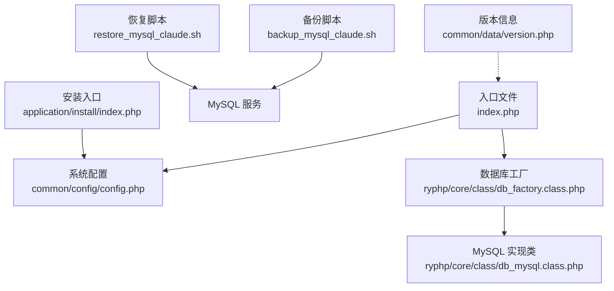
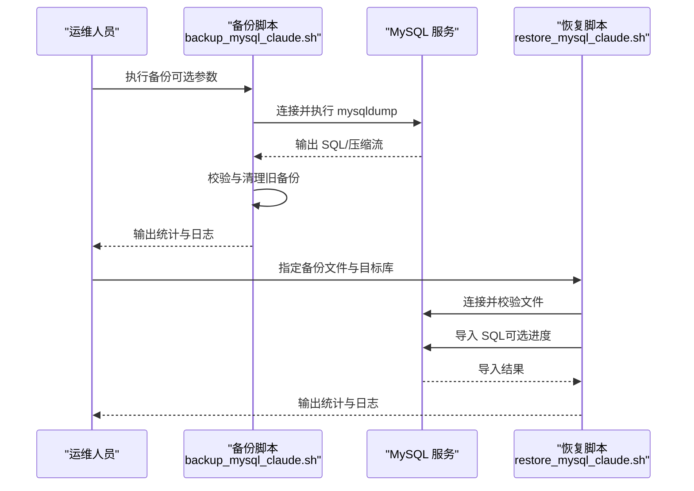
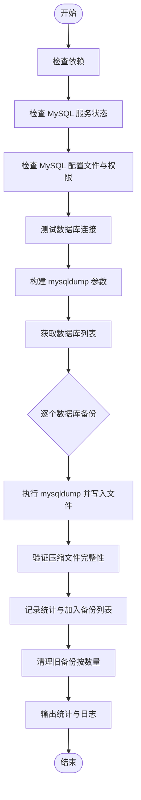
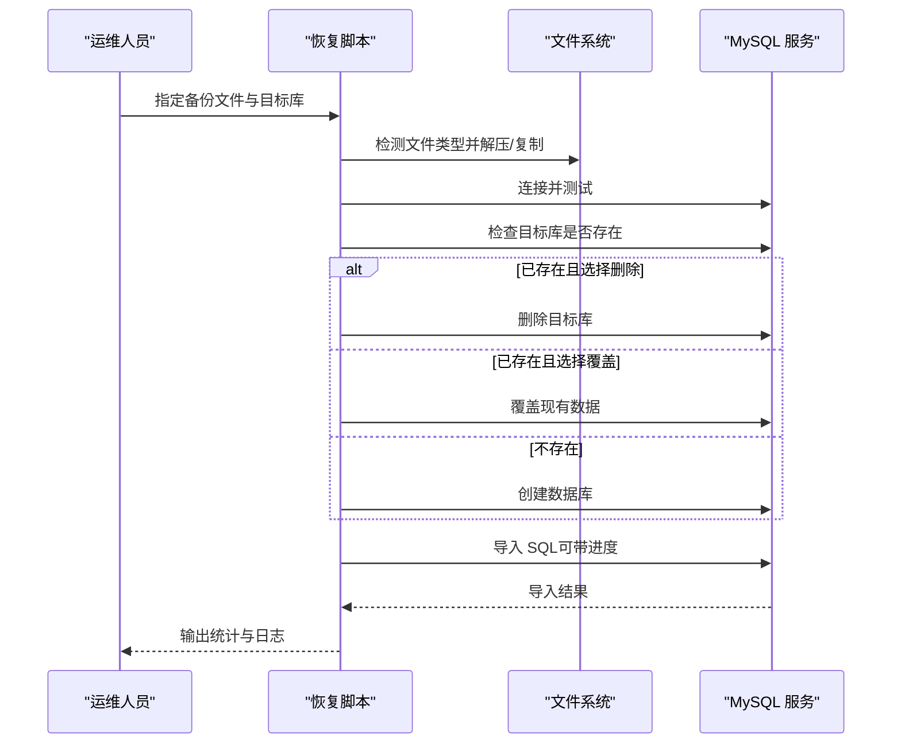
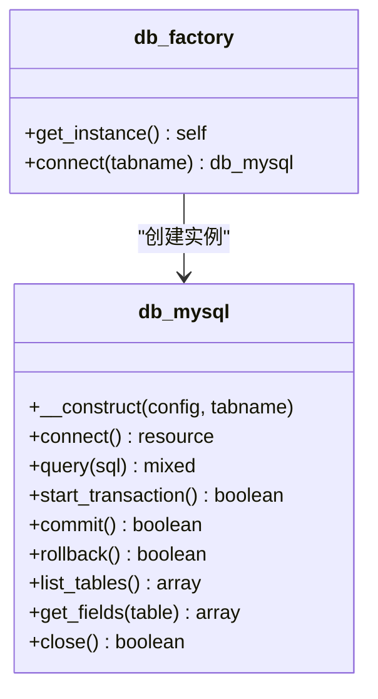
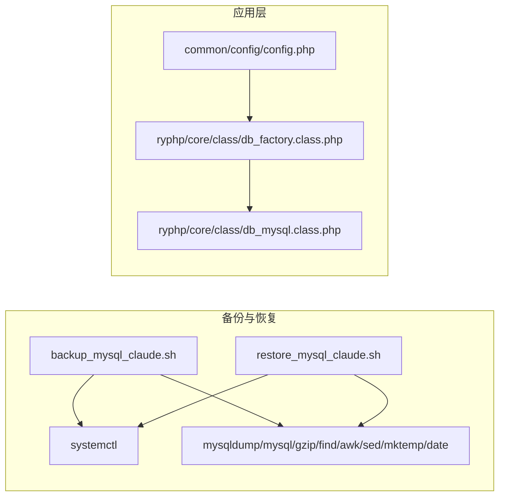

# 备份恢复

<cite>
**本文引用的文件**
- [backup_mysql_claude.sh](file://backup_mysql_claude.sh)
- [restore_mysql_claude.sh](file://restore_mysql_claude.sh)
- [config.php](file://common/config/config.php)
- [index.php](file://index.php)
- [db_factory.class.php](file://ryphp/core/class/db_factory.class.php)
- [db_mysql.class.php](file://ryphp/core/class/db_mysql.class.php)
- [cache_factory.class.php](file://ryphp/core/class/cache_factory.class.php)
- [cache_file.class.php](file://ryphp/core/class/cache_file.class.php)
- [version.php](file://common/data/version.php)
- [index.php](file://application/install/index.php)
- [.gitignore](file://.gitignore)
- [README.md](file://README.md)
</cite>

## 目录
1. [简介](#简介)
2. [项目结构](#项目结构)
3. [核心组件](#核心组件)
4. [架构总览](#架构总览)
5. [详细组件分析](#详细组件分析)
6. [依赖关系分析](#依赖关系分析)
7. [性能考量](#性能考量)
8. [故障排查指南](#故障排查指南)
9. [结论](#结论)
10. [附录](#附录)

## 简介
本操作手册面向 LRYBlog 备份恢复系统，提供数据库备份与恢复的完整流程、脚本使用方法、文件备份策略、存储与管理方案、灾难恢复预案以及验证与测试恢复的操作指南。系统基于 Bash 脚本实现数据库的全量备份与恢复，结合 PHP 配置与框架层，确保备份与恢复的可靠性与可重复性。

## 项目结构
仓库采用典型的 PHP MVC 架构，核心入口为单一入口文件，数据库配置位于公共配置文件，备份与恢复脚本位于根目录，便于直接执行与定时调度。

图表来源
- [index.php](file://index.php#L10-L18)
- [config.php](file://common/config/config.php#L13-L22)
- [db_factory.class.php](file://ryphp/core/class/db_factory.class.php#L11-L50)
- [db_mysql.class.php](file://ryphp/core/class/db_mysql.class.php#L36-L49)
- [backup_mysql_claude.sh](file://backup_mysql_claude.sh#L170-L198)
- [restore_mysql_claude.sh](file://restore_mysql_claude.sh#L210-L238)
- [index.php](file://application/install/index.php#L15-L28)
- [version.php](file://common/data/version.php#L1-L4)

章节来源
- [index.php](file://index.php#L10-L18)
- [config.php](file://common/config/config.php#L13-L22)
- [db_factory.class.php](file://ryphp/core/class/db_factory.class.php#L11-L50)
- [db_mysql.class.php](file://ryphp/core/class/db_mysql.class.php#L36-L49)
- [backup_mysql_claude.sh](file://backup_mysql_claude.sh#L170-L198)
- [restore_mysql_claude.sh](file://restore_mysql_claude.sh#L210-L238)
- [index.php](file://application/install/index.php#L15-L28)
- [version.php](file://common/data/version.php#L1-L4)

## 核心组件
- 备份脚本：提供全量数据库备份能力，支持压缩、单事务、扩展插入、存储过程与触发器等选项，自动清理旧备份并记录日志。
- 恢复脚本：支持 .sql 与 .sql.gz 的恢复，自动推断目标数据库名，提供强制与覆盖恢复选项，具备进度显示与统计信息。
- 数据库配置：集中于公共配置文件，包含数据库主机、名称、账号、密码、字符集与表前缀等关键参数。
- 应用入口与安装：单一入口初始化系统，安装流程负责数据库创建、表结构导入与管理员初始化。

章节来源
- [backup_mysql_claude.sh](file://backup_mysql_claude.sh#L83-L114)
- [restore_mysql_claude.sh](file://restore_mysql_claude.sh#L79-L107)
- [config.php](file://common/config/config.php#L13-L22)
- [index.php](file://index.php#L10-L18)
- [index.php](file://application/install/index.php#L15-L28)

## 架构总览
备份与恢复围绕 MySQL 服务展开，备份脚本通过 mysqldump 生成 SQL 文件，恢复脚本通过 mysql 或管道方式导入。系统配置与数据库工厂为应用层提供统一的数据库访问接口。

图表来源
- [backup_mysql_claude.sh](file://backup_mysql_claude.sh#L200-L256)
- [backup_mysql_claude.sh](file://backup_mysql_claude.sh#L313-L337)
- [restore_mysql_claude.sh](file://restore_mysql_claude.sh#L262-L376)

## 详细组件分析

### 备份脚本 backup_mysql_claude.sh
- 功能要点
  - 依赖检查：确保 mysqldump、mysql、gzip、find、awk、sed、mktemp、systemctl、date 等命令可用。
  - 配置参数：备份目录、日志目录、保留数量、时间戳、MySQL 配置文件路径。
  - 备份选项：完整插入、压缩、扩展插入、单事务、 routines/triggers、锁表、DROP TABLE。
  - 备份流程：构建 mysqldump 参数，遍历数据库列表（全库或单库），执行备份并验证压缩完整性，统计大小与计数，清理旧备份。
  - 日志与颜色：分离屏幕与文件日志，彩色输出便于区分级别。
- 命令参数与选项
  - 位置参数：数据库名（可选，不指定则全库备份）。
  - 选项：--no-complete、--no-compress、--extended、--no-routines、--no-triggers、--lock-tables、--no-drop。
- 定时任务建议
  - 推荐每日凌晨执行全库备份；如需增量，可在业务低峰期执行单库备份并结合保留数量策略。
- 存储与管理
  - 本地存储：脚本内置备份目录与日志目录，支持按数量清理旧备份。
  - 远程与云存储：可配合 rsync/sftp/cron + 云存储客户端在备份完成后推送至远端。

图表来源
- [backup_mysql_claude.sh](file://backup_mysql_claude.sh#L9-L27)
- [backup_mysql_claude.sh](file://backup_mysql_claude.sh#L170-L198)
- [backup_mysql_claude.sh](file://backup_mysql_claude.sh#L200-L256)
- [backup_mysql_claude.sh](file://backup_mysql_claude.sh#L275-L337)
- [backup_mysql_claude.sh](file://backup_mysql_claude.sh#L339-L376)

章节来源
- [backup_mysql_claude.sh](file://backup_mysql_claude.sh#L9-L27)
- [backup_mysql_claude.sh](file://backup_mysql_claude.sh#L170-L198)
- [backup_mysql_claude.sh](file://backup_mysql_claude.sh#L200-L256)
- [backup_mysql_claude.sh](file://backup_mysql_claude.sh#L275-L337)
- [backup_mysql_claude.sh](file://backup_mysql_claude.sh#L339-L376)

### 恢复脚本 restore_mysql_claude.sh
- 功能要点
  - 依赖检查：确保 mysql、gzip、gunzip、file、systemctl、date 等命令可用。
  - 文件类型识别：支持 .sql 与 .sql.gz，必要时通过 file 命令判断。
  - 数据库名推断：从备份文件名提取目标库名。
  - 恢复流程：解压/复制 SQL 文件，验证内容，处理已存在数据库（覆盖或删除后重建），创建数据库，导入 SQL，统计耗时与表数量。
  - 进度显示：可选使用 pv 命令显示导入进度。
- 命令参数与选项
  - 位置参数：备份文件（必填）、目标数据库名（可选）。
  - 选项：-f/--force（强制）、-d/--drop（恢复前删除数据库）。
- 恢复验证
  - 恢复后统计表数量与数据库大小，核对日志输出。

图表来源
- [restore_mysql_claude.sh](file://restore_mysql_claude.sh#L150-L186)
- [restore_mysql_claude.sh](file://restore_mysql_claude.sh#L201-L238)
- [restore_mysql_claude.sh](file://restore_mysql_claude.sh#L252-L351)
- [restore_mysql_claude.sh](file://restore_mysql_claude.sh#L357-L376)

章节来源
- [restore_mysql_claude.sh](file://restore_mysql_claude.sh#L150-L186)
- [restore_mysql_claude.sh](file://restore_mysql_claude.sh#L201-L238)
- [restore_mysql_claude.sh](file://restore_mysql_claude.sh#L252-L351)
- [restore_mysql_claude.sh](file://restore_mysql_claude.sh#L357-L376)

### 数据库配置与连接
- 配置项
  - 数据库类型、主机、名称、用户、密码、端口、字符集、表前缀等。
- 连接工厂
  - db_factory 根据配置选择具体数据库实现类（mysql/mysqli/pdo），并传递配置参数。
- 数据库实现
  - db_mysql 提供连接、查询、事务、表结构与字段信息等方法，供应用层使用。

图表来源
- [db_factory.class.php](file://ryphp/core/class/db_factory.class.php#L11-L50)
- [db_mysql.class.php](file://ryphp/core/class/db_mysql.class.php#L36-L49)
- [db_mysql.class.php](file://ryphp/core/class/db_mysql.class.php#L477-L483)
- [db_mysql.class.php](file://ryphp/core/class/db_mysql.class.php#L549-L575)
- [db_mysql.class.php](file://ryphp/core/class/db_mysql.class.php#L599-L606)
- [db_mysql.class.php](file://ryphp/core/class/db_mysql.class.php#L614-L623)

章节来源
- [config.php](file://common/config/config.php#L13-L22)
- [db_factory.class.php](file://ryphp/core/class/db_factory.class.php#L11-L50)
- [db_mysql.class.php](file://ryphp/core/class/db_mysql.class.php#L36-L49)
- [db_mysql.class.php](file://ryphp/core/class/db_mysql.class.php#L477-L483)
- [db_mysql.class.php](file://ryphp/core/class/db_mysql.class.php#L549-L575)
- [db_mysql.class.php](file://ryphp/core/class/db_mysql.class.php#L599-L606)
- [db_mysql.class.php](file://ryphp/core/class/db_mysql.class.php#L614-L623)

### 缓存与静态资源
- 缓存工厂与文件缓存
  - cache_factory 根据配置选择缓存类型（file/redis/memcache），默认 file。
  - cache_file 提供缓存文件的读写、删除与清空等操作。
- 静态资源与上传
  - 版本信息与上传配置位于公共配置与版本文件中，上传目录与水印等参数可在此调整。

章节来源
- [cache_factory.class.php](file://ryphp/core/class/cache_factory.class.php#L36-L62)
- [cache_file.class.php](file://ryphp/core/class/cache_file.class.php#L61-L130)
- [config.php](file://common/config/config.php#L75-L81)
- [version.php](file://common/data/version.php#L1-L4)

### 安装与初始化
- 安装入口
  - application/install/index.php 负责环境检测、数据库连接测试、创建数据库与表结构导入、管理员初始化与配置写入。
- 安装锁与清理
  - 安装完成后创建安装锁文件并清理临时文件，确保系统安全与稳定。

章节来源
- [index.php](file://application/install/index.php#L15-L28)
- [index.php](file://application/install/index.php#L132-L260)

## 依赖关系分析
- 备份脚本依赖 MySQL 服务与命令行工具链，通过 systemd 检测服务状态，通过配置文件进行认证。
- 恢复脚本同样依赖 MySQL 服务与工具链，支持压缩与非压缩文件，具备进度显示与统计输出。
- 应用层通过数据库工厂与实现类访问数据库，配置集中于公共配置文件。

图表来源
- [backup_mysql_claude.sh](file://backup_mysql_claude.sh#L9-L27)
- [backup_mysql_claude.sh](file://backup_mysql_claude.sh#L170-L198)
- [restore_mysql_claude.sh](file://restore_mysql_claude.sh#L9-L30)
- [restore_mysql_claude.sh](file://restore_mysql_claude.sh#L210-L238)
- [config.php](file://common/config/config.php#L13-L22)
- [db_factory.class.php](file://ryphp/core/class/db_factory.class.php#L11-L50)
- [db_mysql.class.php](file://ryphp/core/class/db_mysql.class.php#L36-L49)

章节来源
- [backup_mysql_claude.sh](file://backup_mysql_claude.sh#L9-L27)
- [backup_mysql_claude.sh](file://backup_mysql_claude.sh#L170-L198)
- [restore_mysql_claude.sh](file://restore_mysql_claude.sh#L9-L30)
- [restore_mysql_claude.sh](file://restore_mysql_claude.sh#L210-L238)
- [config.php](file://common/config/config.php#L13-L22)
- [db_factory.class.php](file://ryphp/core/class/db_factory.class.php#L11-L50)
- [db_mysql.class.php](file://ryphp/core/class/db_mysql.class.php#L36-L49)

## 性能考量
- 备份性能
  - 单事务模式减少一致性风险；压缩可节省空间但增加 CPU 开销；扩展插入提升导入效率。
- 恢复性能
  - 导入时可启用进度显示（pv），根据数据量评估耗时；大库建议在业务低峰期执行。
- 存储策略
  - 本地保留数量策略避免无限增长；结合远端同步与归档，平衡成本与恢复时间目标。

## 故障排查指南
- 常见问题
  - MySQL 服务未运行：使用 systemctl 检查并启动服务。
  - 配置文件权限不当：建议设置为 600/400 并检查凭据。
  - 备份文件损坏：检查压缩完整性与日志警告；必要时重新备份。
  - 恢复前数据库存在：根据需求选择覆盖或删除后重建。
- 日志定位
  - 备份与恢复脚本均输出彩色日志到文件，便于快速定位错误与警告。

章节来源
- [backup_mysql_claude.sh](file://backup_mysql_claude.sh#L170-L198)
- [backup_mysql_claude.sh](file://backup_mysql_claude.sh#L302-L307)
- [restore_mysql_claude.sh](file://restore_mysql_claude.sh#L210-L238)
- [restore_mysql_claude.sh](file://restore_mysql_claude.sh#L267-L276)
- [restore_mysql_claude.sh](file://restore_mysql_claude.sh#L311-L341)

## 结论
本手册提供了 LRYBlog 备份恢复系统的完整操作指南，涵盖数据库备份与恢复脚本的使用、配置与定时任务、文件备份策略、存储与管理、灾难恢复预案以及验证与测试恢复流程。建议结合本地与远端存储策略，定期验证备份有效性，并在变更窗口内执行恢复演练，以确保系统在异常情况下的快速恢复能力。

## 附录

### 备份策略与脚本使用
- 全量备份
  - 执行全库备份：./backup_mysql_claude.sh
  - 指定数据库：./backup_mysql_claude.sh 数据库名
  - 禁用压缩：./backup_mysql_claude.sh 数据库名 --no-compress
  - 使用扩展插入：./backup_mysql_claude.sh 数据库名 --extended
- 增量备份
  - 仓库未提供原生增量脚本，建议在业务低峰期执行单库备份并结合保留数量策略；如需更细粒度增量，可结合 MySQL binlog 或第三方工具。
- 定时任务
  - 使用 cron 在每日固定时间执行备份脚本；为不同数据库设置独立任务以降低并发风险。

章节来源
- [backup_mysql_claude.sh](file://backup_mysql_claude.sh#L83-L114)
- [backup_mysql_claude.sh](file://backup_mysql_claude.sh#L116-L168)

### 文件备份方案
- 网站文件
  - 使用 rsync 或 tar 对网站根目录进行增量/全量备份，建议排除缓存与日志目录。
- 图片资源
  - 依据上传配置中的目录（如 uploads）进行单独备份，结合版本控制与 CDN 缓存策略。
- 配置文件
  - 备份 common/config/config.php 与 .mysql.cnf 等敏感配置文件，注意权限与加密存储。

章节来源
- [config.php](file://common/config/config.php#L75-L81)
- [.gitignore](file://.gitignore#L1-L6)

### 备份文件存储与管理
- 本地存储
  - 备份目录与日志目录由脚本内置；通过保留数量策略自动清理旧文件。
- 远程备份
  - 使用 rsync/sftp/cron 推送至远端服务器或 NAS；建议启用 SSH 密钥认证。
- 云存储
  - 使用云厂商提供的客户端或 SDK，将备份文件上传至对象存储；设置生命周期策略与跨区域冗余。

章节来源
- [backup_mysql_claude.sh](file://backup_mysql_claude.sh#L29-L49)
- [restore_mysql_claude.sh](file://restore_mysql_claude.sh#L35-L45)

### 数据恢复流程
- 数据库恢复
  - 指定备份文件与目标库：./restore_mysql_claude.sh 备份文件 目标库
  - 强制覆盖：./restore_mysql_claude.sh 备份文件 目标库 --force
  - 恢复前删除：./restore_mysql_claude.sh 备份文件 目标库 --drop --force
- 文件恢复
  - 使用对应工具恢复网站文件与图片资源；核对权限与所有权。
- 系统还原
  - 依据安装入口重新初始化数据库与配置；确保安装锁文件与缓存清理。

章节来源
- [restore_mysql_claude.sh](file://restore_mysql_claude.sh#L79-L107)
- [restore_mysql_claude.sh](file://restore_mysql_claude.sh#L150-L186)
- [index.php](file://application/install/index.php#L265-L274)

### 灾难恢复预案
- 数据丢失应急处理
  - 立即停止写入，切换到最近可用备份；使用恢复脚本进行恢复并验证。
- 系统重建流程
  - 重新部署应用与数据库；通过安装入口初始化；恢复配置与静态资源；验证功能与数据一致性。
- 备份验证与测试恢复
  - 定期在隔离环境中执行恢复演练，核对备份完整性与恢复速度；更新预案并记录演练结果。

章节来源
- [backup_mysql_claude.sh](file://backup_mysql_claude.sh#L313-L337)
- [restore_mysql_claude.sh](file://restore_mysql_claude.sh#L395-L409)
- [README.md](file://README.md#L1-L6)