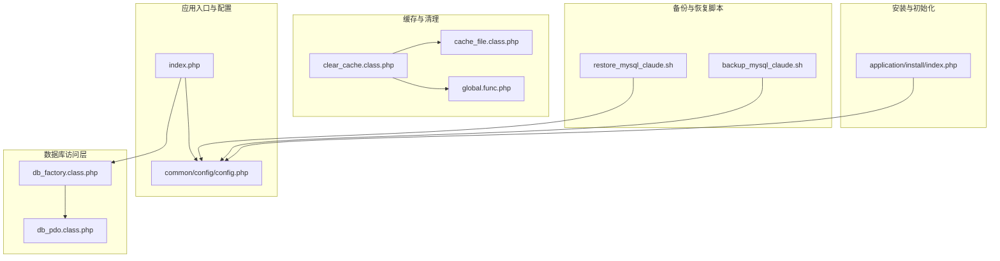
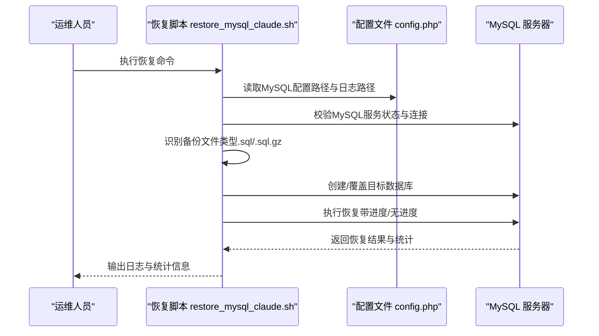
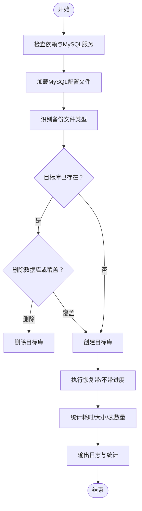
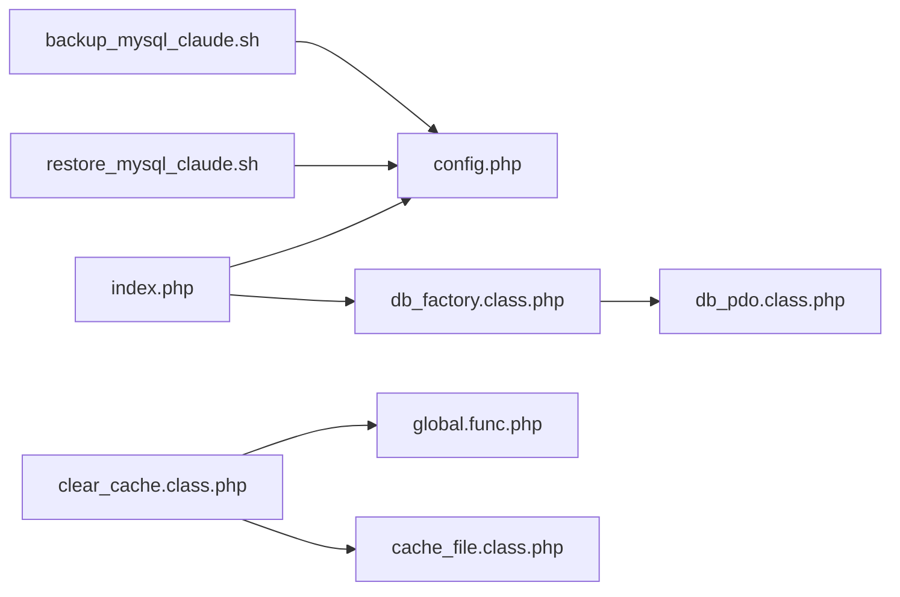

# 恢复流程

<cite>
**本文引用的文件**
- [restore_mysql_claude.sh](file://restore_mysql_claude.sh)
- [backup_mysql_claude.sh](file://backup_mysql_claude.sh)
- [config.php](file://common/config/config.php)
- [index.php](file://index.php)
- [clear_cache.class.php](file://application/lry_admin_center/controller/clear_cache.class.php)
- [db_factory.class.php](file://ryphp/core/class/db_factory.class.php)
- [db_pdo.class.php](file://ryphp/core/class/db_pdo.class.php)
- [global.func.php](file://ryphp/core/function/global.func.php)
- [cache_file.class.php](file://ryphp/core/class/cache_file.class.php)
- [index.php（安装程序）](file://application/install/index.php)
</cite>

## 目录
1. [简介](#简介)
2. [项目结构](#项目结构)
3. [核心组件](#核心组件)
4. [架构总览](#架构总览)
5. [详细组件分析](#详细组件分析)
6. [依赖关系分析](#依赖关系分析)
7. [性能考量](#性能考量)
8. [故障排查指南](#故障排查指南)
9. [结论](#结论)
10. [附录](#附录)

## 简介
本手册面向LRYBlog系统运维人员，提供数据库与网站文件的恢复操作指南。内容涵盖：
- 数据库恢复：准备、连接配置、恢复命令执行、日志与统计、验证
- 网站文件恢复：覆盖、权限、缓存清理
- 部分恢复与完整恢复的区别与适用场景
- 恢复前备份验证要点
- 常见问题与解决方案
- 恢复后系统验证方法（功能、性能、安全）

## 项目结构
LRYBlog采用PHP框架与模板引擎，数据库访问通过工厂+PDO实现，缓存采用文件缓存。安装与恢复涉及以下关键目录与文件：
- 数据库备份/恢复脚本：backup_mysql_claude.sh、restore_mysql_claude.sh
- 应用入口与配置：index.php、common/config/config.php
- 数据库访问层：ryphp/core/class/db_factory.class.php、ryphp/core/class/db_pdo.class.php
- 缓存与清理：application/lry_admin_center/controller/clear_cache.class.php、ryphp/core/class/cache_file.class.php、ryphp/core/function/global.func.php
- 安装与初始化：application/install/index.php

图表来源
- [index.php:10-18](file://index.php#L10-L18)
- [config.php:13-21](file://common/config/config.php#L13-L21)
- [db_factory.class.php:11-49](file://ryphp/core/class/db_factory.class.php#L11-L49)
- [db_pdo.class.php:32-42](file://ryphp/core/class/db_pdo.class.php#L32-L42)
- [clear_cache.class.php:9-24](file://application/lry_admin_center/controller/clear_cache.class.php#L9-L24)
- [cache_file.class.php:1-14](file://ryphp/core/class/cache_file.class.php#L1-L14)
- [global.func.php:1518-1523](file://ryphp/core/function/global.func.php#L1518-L1523)
- [backup_mysql_claude.sh:29-35](file://backup_mysql_claude.sh#L29-L35)
- [restore_mysql_claude.sh:35-38](file://restore_mysql_claude.sh#L35-L38)
- [index.php（安装程序）:15-28](file://application/install/index.php#L15-L28)

章节来源
- [index.php:10-18](file://index.php#L10-L18)
- [config.php:13-21](file://common/config/config.php#L13-L21)

## 核心组件
- 数据库配置与连接
  - 应用配置common/config/config.php提供数据库类型、主机、库名、用户、密码、端口、字符集、表前缀等。
  - 数据库工厂db_factory.class.php根据配置选择PDO/MySQLi/MySQL实现，并统一构造连接。
  - PDO实现db_pdo.class.php负责连接建立、SQL执行、事务、元数据查询等。
- 缓存与清理
  - 文件缓存cache_file.class.php管理缓存文件的读写与删除。
  - 清理控制器clear_cache.class.php遍历指定缓存目录并调用delcache全局函数清空缓存。
  - 全局函数global.func.php提供delcache(name, flush)接口，支持按名称删除或全量清空。
- 备份与恢复脚本
  - backup_mysql_claude.sh：mysqldump导出，支持单库/全库、压缩、事务一致性、例行清理。
  - restore_mysql_claude.sh：校验依赖、连接配置、文件类型识别、数据库存在性处理、恢复执行与统计。

章节来源
- [config.php:13-21](file://common/config/config.php#L13-L21)
- [db_factory.class.php:11-49](file://ryphp/core/class/db_factory.class.php#L11-L49)
- [db_pdo.class.php:32-42](file://ryphp/core/class/db_pdo.class.php#L32-L42)
- [cache_file.class.php:1-14](file://ryphp/core/class/cache_file.class.php#L1-L14)
- [clear_cache.class.php:9-24](file://application/lry_admin_center/controller/clear_cache.class.php#L9-L24)
- [global.func.php:1518-1523](file://ryphp/core/function/global.func.php#L1518-L1523)
- [backup_mysql_claude.sh:29-35](file://backup_mysql_claude.sh#L29-L35)
- [restore_mysql_claude.sh:35-38](file://restore_mysql_claude.sh#L35-L38)

## 架构总览
LRYBlog系统通过入口文件index.php加载框架核心，依据配置文件读取数据库参数，经由数据库工厂与PDO实现访问数据库；后台提供缓存清理能力；备份/恢复脚本独立于应用逻辑，直接调用mysqldump/mysql命令。

图表来源
- [restore_mysql_claude.sh:210-238](file://restore_mysql_claude.sh#L210-L238)
- [restore_mysql_claude.sh:262-376](file://restore_mysql_claude.sh#L262-L376)
- [config.php:13-21](file://common/config/config.php#L13-L21)

## 详细组件分析

### 数据库恢复流程（restore_mysql_claude.sh）
- 准备工作
  - 检查依赖命令（mysql、mysqldump、gzip、gunzip、pv等），缺失时报错并退出。
  - 检查MySQL服务状态，未运行则提示启动。
  - 检查MySQL配置文件路径与权限，建议600/400。
- 连接配置
  - 通过--defaults-file读取配置，测试连接成功后继续。
- 文件类型识别
  - 支持.sql与.sql.gz，自动识别并校验压缩文件完整性。
- 数据库处理
  - 若目标库存在且选择删除模式，则先删除再重建；否则提示覆盖。
  - 不存在则创建数据库（字符集utf8mb4，排序规则utf8mb4_unicode_ci）。
- 恢复执行
  - 使用管道方式恢复，优先使用pv显示进度（若安装）。
  - 恢复完成后统计耗时、备份文件大小、SQL文件大小、表数量、数据库大小。
- 日志与输出
  - 屏幕与日志文件分离输出，便于审计与排障。

图表来源
- [restore_mysql_claude.sh:8-30](file://restore_mysql_claude.sh#L8-L30)
- [restore_mysql_claude.sh:210-238](file://restore_mysql_claude.sh#L210-L238)
- [restore_mysql_claude.sh:262-376](file://restore_mysql_claude.sh#L262-L376)
- [restore_mysql_claude.sh:395-410](file://restore_mysql_claude.sh#L395-L410)

章节来源
- [restore_mysql_claude.sh:8-30](file://restore_mysql_claude.sh#L8-L30)
- [restore_mysql_claude.sh:210-238](file://restore_mysql_claude.sh#L210-L238)
- [restore_mysql_claude.sh:262-376](file://restore_mysql_claude.sh#L262-L376)
- [restore_mysql_claude.sh:395-410](file://restore_mysql_claude.sh#L395-L410)

### 数据库备份流程（backup_mysql_claude.sh）
- 准备与校验
  - 检查依赖命令与MySQL服务，读取配置文件并测试连接。
- 备份参数构建
  - 支持单事务、完整INSERT、扩展INSERT、触发器/存储过程、锁表等选项。
  - 可选择压缩与不压缩两种输出格式。
- 执行备份
  - 针对每个数据库执行mysqldump，记录错误日志并验证压缩文件有效性。
- 清理策略
  - 按时间戳聚合清理全库备份，或按数据库名清理单库备份，保留最近N个。

章节来源
- [backup_mysql_claude.sh:8-24](file://backup_mysql_claude.sh#L8-L24)
- [backup_mysql_claude.sh:170-198](file://backup_mysql_claude.sh#L170-L198)
- [backup_mysql_claude.sh:200-235](file://backup_mysql_claude.sh#L200-L235)
- [backup_mysql_claude.sh:275-337](file://backup_mysql_claude.sh#L275-L337)
- [backup_mysql_claude.sh:339-376](file://backup_mysql_claude.sh#L339-L376)

### 缓存清理与权限
- 清理入口
  - 后台控制器clear_cache.class.php检查cache目录可写，遍历指定缓存子目录并删除模板缓存文件，随后调用delcache全量清理。
- 缓存实现
  - cache_file.class.php负责缓存文件的创建、读取、删除与全量清空。
  - global.func.php提供delcache接口，支持按名称删除或全量flush。
- 权限要求
  - cache目录需具备写权限，脚本中对cache目录可写性进行检查。

章节来源
- [clear_cache.class.php:9-24](file://application/lry_admin_center/controller/clear_cache.class.php#L9-L24)
- [cache_file.class.php:1-14](file://ryphp/core/class/cache_file.class.php#L1-L14)
- [cache_file.class.php:61-73](file://ryphp/core/class/cache_file.class.php#L61-L73)
- [global.func.php:1518-1523](file://ryphp/core/function/global.func.php#L1518-L1523)

### 安装与初始化（与恢复的关系）
- 安装程序在首次部署或重装时创建数据库、导入初始数据、写入配置文件并生成安装锁。
- 恢复场景下，若数据库已存在且包含业务数据，应优先使用备份/恢复脚本而非安装程序。

章节来源
- [index.php（安装程序）:15-28](file://application/install/index.php#L15-L28)
- [index.php（安装程序）:132-260](file://application/install/index.php#L132-L260)

## 依赖关系分析
- 应用入口依赖配置文件提供数据库参数。
- 数据库工厂根据配置选择PDO实现，PDO负责实际连接与SQL执行。
- 缓存清理依赖全局函数与缓存类，确保模板与数据缓存被正确清除。
- 备份/恢复脚本独立于应用逻辑，直接调用mysqldump/mysql命令，但需与应用配置保持一致的数据库参数。

图表来源
- [index.php:10-18](file://index.php#L10-L18)
- [config.php:13-21](file://common/config/config.php#L13-L21)
- [db_factory.class.php:11-49](file://ryphp/core/class/db_factory.class.php#L11-L49)
- [db_pdo.class.php:32-42](file://ryphp/core/class/db_pdo.class.php#L32-L42)
- [clear_cache.class.php:9-24](file://application/lry_admin_center/controller/clear_cache.class.php#L9-L24)
- [global.func.php:1518-1523](file://ryphp/core/function/global.func.php#L1518-L1523)
- [cache_file.class.php:1-14](file://ryphp/core/class/cache_file.class.php#L1-L14)
- [restore_mysql_claude.sh:35-38](file://restore_mysql_claude.sh#L35-L38)
- [backup_mysql_claude.sh:29-35](file://backup_mysql_claude.sh#L29-L35)

## 性能考量
- 恢复性能
  - 使用管道与pv（若安装）可提升大文件恢复的可观测性与吞吐。
  - 压缩备份可显著降低磁盘占用与网络传输时间。
- 备份性能
  - 单事务模式保证一致性，适合在线备份；锁表模式可减少并发写入干扰。
  - 扩展INSERT与完整INSERT影响导入速度与文件体积，可根据场景权衡。
- 缓存清理
  - 模板缓存与数据缓存清理应在恢复后立即执行，避免陈旧缓存导致功能异常。

[本节为通用指导，无需特定文件来源]

## 故障排查指南

- 恢复前准备
  - 确认MySQL服务运行正常，配置文件存在且权限为600/400。
  - 确认备份文件类型正确且可解压（.sql/.sql.gz），必要时先验证压缩文件完整性。
- 常见问题与解决
  - 字符编码问题
    - 恢复脚本默认使用utf8mb4字符集创建数据库；若应用配置字符集为utf8，需在恢复后调整数据库/表字符集或在备份时使用对应字符集参数。
  - 权限错误
    - 恢复脚本会检查配置文件权限；同时，cache目录需具备写权限，否则缓存清理失败。
  - 文件冲突
    - 目标库存在时，选择删除模式将先删除再恢复；覆盖模式会直接覆盖现有数据，请提前评估风险。
  - 连接失败
    - 检查配置文件中的主机、端口、用户名、密码；使用--defaults-file参数确保读取正确配置。
  - 恢复中断
    - 恢复脚本会捕获错误并输出日志文件路径，检查日志定位具体SQL错误。
- 恢复后验证
  - 功能测试：登录后台、查看文章列表、发布新文章、上传附件等。
  - 性能检查：关注慢查询日志与数据库连接数。
  - 安全验证：确认缓存目录权限、配置文件权限、安装锁文件状态。

章节来源
- [restore_mysql_claude.sh:210-238](file://restore_mysql_claude.sh#L210-L238)
- [restore_mysql_claude.sh:262-376](file://restore_mysql_claude.sh#L262-L376)
- [clear_cache.class.php:9-24](file://application/lry_admin_center/controller/clear_cache.class.php#L9-L24)

## 结论
- 数据库恢复建议使用restore_mysql_claude.sh，配合备份脚本backup_mysql_claude.sh进行周期性备份与验证。
- 恢复前务必核对MySQL配置、服务状态与备份文件完整性；恢复后及时清理缓存并进行功能与安全验证。
- 对于部分恢复（仅恢复特定表）与完整恢复（全库/单库），应根据业务需求选择合适策略，并在恢复前做好数据备份与风险评估。

[本节为总结性内容，无需特定文件来源]

## 附录

### 恢复前备份验证清单
- 备份文件完整性：确认压缩文件可解压，SQL内容包含预期的CREATE/INSERT/DROP/USE等语句。
- 备份时间戳与数量：核对备份时间戳与保留策略，确保可追溯。
- 数据库一致性：在备份期间无重大写入操作，或使用单事务模式。

章节来源
- [backup_mysql_claude.sh:313-331](file://backup_mysql_claude.sh#L313-L331)

### 部分恢复与完整恢复区别
- 完整恢复
  - 恢复整个数据库，适合灾难性故障或全新部署。
  - 恢复脚本会自动创建数据库并恢复全部表。
- 部分恢复
  - 仅恢复特定表或数据片段，需在备份脚本中选择相应策略（如仅导出指定表）。
  - 恢复时注意外键约束与依赖关系，避免破坏完整性。

章节来源
- [restore_mysql_claude.sh:343-351](file://restore_mysql_claude.sh#L343-L351)
- [backup_mysql_claude.sh:237-256](file://backup_mysql_claude.sh#L237-L256)

### 恢复后系统验证方法
- 功能测试
  - 登录后台、查看文章、分类、评论、上传等核心功能。
- 性能检查
  - 关注数据库慢查询、连接数、缓冲池命中率等指标。
- 安全验证
  - 检查配置文件与缓存目录权限，确认安装锁文件状态，避免重复安装。

章节来源
- [index.php（安装程序）:265-274](file://application/install/index.php#L265-L274)
- [clear_cache.class.php:9-24](file://application/lry_admin_center/controller/clear_cache.class.php#L9-L24)