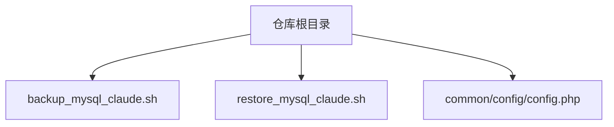
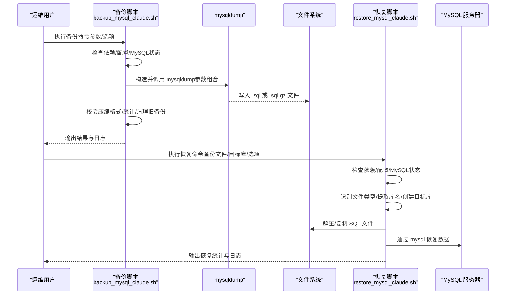
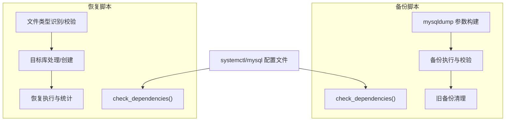

# 数据库备份

<cite>
**本文引用的文件**
- [backup_mysql_claude.sh](file://backup_mysql_claude.sh)
- [restore_mysql_claude.sh](file://restore_mysql_claude.sh)
- [config.php](file://common/config/config.php)
</cite>

## 目录
1. [简介](#简介)
2. [项目结构](#项目结构)
3. [核心组件](#核心组件)
4. [架构总览](#架构总览)
5. [详细组件分析](#详细组件分析)
6. [依赖关系分析](#依赖关系分析)
7. [性能考量](#性能考量)
8. [故障排查指南](#故障排查指南)
9. [结论](#结论)
10. [附录](#附录)

## 简介
本指南面向 LRYBlog 项目的数据库备份与恢复需求，聚焦于增强版备份脚本与配套恢复脚本的使用方法、参数说明、执行流程、mysqldump 参数配置要点、备份文件命名与存储位置、备份验证机制以及定制化配置（备份目录、日志、保留策略等）。文档同时提供常见备份场景示例与最佳实践，帮助运维人员在生产环境中稳定、可重复地执行数据库备份与恢复任务。

## 项目结构
与数据库备份直接相关的文件位于仓库根目录：
- 备份脚本：backup_mysql_claude.sh
- 恢复脚本：restore_mysql_claude.sh
- 应用配置（数据库连接信息）：common/config/config.php

图表来源
- [backup_mysql_claude.sh](file://backup_mysql_claude.sh#L1-L392)
- [restore_mysql_claude.sh](file://restore_mysql_claude.sh#L1-L412)
- [config.php](file://common/config/config.php#L1-L88)

章节来源
- [backup_mysql_claude.sh](file://backup_mysql_claude.sh#L1-L392)
- [restore_mysql_claude.sh](file://restore_mysql_claude.sh#L1-L412)
- [config.php](file://common/config/config.php#L1-L88)

## 核心组件
- 备份脚本（backup_mysql_claude.sh）
  - 功能：对 MySQL 数据库执行 mysqldump 备份，支持全库或单库、压缩与非压缩、完整/扩展插入、单事务、存储过程与触发器包含等选项，并内置日志记录与旧备份清理。
  - 关键特性：统一时间戳、颜色化日志、错误与警告捕获、备份文件完整性校验（压缩格式）、基于数量的保留策略。
- 恢复脚本（restore_mysql_claude.sh）
  - 功能：从 .sql 或 .sql.gz 备份文件恢复到目标数据库，自动识别文件类型、提取数据库名、创建/覆盖目标数据库、进度显示（可选）、错误处理与统计输出。
- 应用配置（config.php）
  - 提供应用层数据库连接参数（主机、端口、库名、用户名、密码），便于理解项目使用的数据库环境；备份脚本亦会读取 MySQL 客户端配置文件以进行认证。

章节来源
- [backup_mysql_claude.sh](file://backup_mysql_claude.sh#L1-L392)
- [restore_mysql_claude.sh](file://restore_mysql_claude.sh#L1-L412)
- [config.php](file://common/config/config.php#L13-L22)

## 架构总览
备份与恢复的整体流程如下：

图表来源
- [backup_mysql_claude.sh](file://backup_mysql_claude.sh#L170-L391)
- [restore_mysql_claude.sh](file://restore_mysql_claude.sh#L210-L410)

## 详细组件分析

### 备份脚本（backup_mysql_claude.sh）详解
- 命令与参数
  - 语法：./backup_mysql_claude.sh [数据库名] [选项]
  - 无参：备份所有用户数据库（排除系统库）
  - 单参：备份指定数据库
  - 选项：
    - --help：显示帮助
    - --no-complete：禁用完整插入语句
    - --no-compress：不压缩备份文件
    - --extended：启用扩展插入（多行合并）
    - --no-routines：不包含存储过程与函数
    - --no-triggers：不包含触发器
    - --lock-tables：锁定表进行备份（与单事务互斥）
    - --no-drop：不添加 DROP TABLE 语句
- 执行流程
  - 依赖检查（mysql、mysqldump、gzip、systemctl 等）
  - MySQL 服务状态检查与配置文件校验（权限与连通性）
  - 构建 mysqldump 参数（根据选项动态拼接）
  - 选择备份范围（全库或单库）
  - 逐库执行备份，生成带统一时间戳的文件名
  - 备份后进行压缩格式校验与大小统计
  - 清理旧备份（按数量保留）
  - 输出统计与退出码
- mysqldump 参数配置要点
  - 单事务备份：--single-transaction（保证一致性快照）
  - 完整插入语句：--complete-insert（包含列名）
  - 压缩备份：gzip 管道输出 .sql.gz
  - 扩展插入：--skip-extended-insert（默认单行，可切换）
  - 存储过程与触发器：--routines、--triggers（默认包含）
  - 锁表：--lock-tables（默认不锁定，与单事务互斥）
  - 其他：--hex-blob、--default-character-set=utf8mb4、--set-gtid-purged=OFF
- 备份文件命名与存储
  - 命名规则：{库名}_{统一时间戳}.sql 或 .sql.gz
  - 统一时间戳包含日期、时间与进程 ID，避免同批次并发冲突
  - 存储位置：脚本内配置的备份目录（默认位于 webconf/mysql/backup）
- 备份验证机制
  - 压缩文件完整性：gzip -t 校验
  - 大小统计与成功/失败计数
  - 旧备份清理：按数量保留，支持全库模式与单库模式
- 错误处理
  - 依赖缺失、MySQL 服务未运行、配置文件不存在/权限不当、mysqldump 执行失败、压缩文件损坏等均会记录错误并终止或跳过
- 定制化配置
  - 备份目录：修改 BACKUP_DIR
  - 日志目录与文件：修改 LOG_DIR、LOG_FILE
  - 保留策略：修改 MAX_BACKUPS（按数量保留）
  - 默认行为：通过布尔变量控制完整插入、压缩、单事务、 routines/triggers、扩展插入、锁表、DROP TABLE 等

章节来源
- [backup_mysql_claude.sh](file://backup_mysql_claude.sh#L6-L114)
- [backup_mysql_claude.sh](file://backup_mysql_claude.sh#L170-L391)

### 恢复脚本（restore_mysql_claude.sh）详解
- 命令与参数
  - 语法：./restore_mysql_claude.sh <备份文件> [目标数据库名] [选项]
  - 选项：
    - --help：显示帮助
    - --force：强制恢复（不交互确认）
    - --drop：恢复前先删除目标数据库（谨慎使用）
- 执行流程
  - 依赖检查（mysql、gzip、gunzip、file、pv 等）
  - MySQL 服务状态检查与配置文件校验
  - 自动识别备份文件类型（.sql 或 .sql.gz）
  - 从文件名提取数据库名（若未指定目标库）
  - 验证数据库名称格式与是否存在
  - 处理数据库存在情况（覆盖或删除重建）
  - 创建目标数据库（字符集与排序规则）
  - 通过管道恢复（可选进度显示），记录耗时与统计
- 备份文件验证
  - 压缩文件完整性校验（gzip -t）
  - SQL 内容有效性检查（包含 CREATE/INSERT/DROP/USE 等关键字）
- 错误处理
  - 文件不存在、格式不识别、MySQL 服务未运行、连接失败、SQL 内容异常、恢复失败等均有明确错误提示与退出码

章节来源
- [restore_mysql_claude.sh](file://restore_mysql_claude.sh#L6-L107)
- [restore_mysql_claude.sh](file://restore_mysql_claude.sh#L150-L410)

### 数据库连接配置（config.php）
- 该文件提供应用层数据库连接参数（主机、端口、库名、用户名、密码、字符集、表前缀等），可用于理解项目所用数据库环境。
- 备份/恢复脚本同样依赖 MySQL 客户端配置文件进行认证，建议保持一致的凭据管理策略。

章节来源
- [config.php](file://common/config/config.php#L13-L22)

## 依赖关系分析
- 备份脚本依赖
  - 系统命令：mysql、mysqldump、gzip、systemctl、date、find、du、awk、sed、mktemp
  - MySQL 服务状态与配置文件（默认 ~/.mysql.cnf）
- 恢复脚本依赖
  - 系统命令：mysql、gzip、gunzip、file、pv（可选）、systemctl、date
  - MySQL 服务状态与配置文件（默认 ~/.mysql.cnf）

图表来源
- [backup_mysql_claude.sh](file://backup_mysql_claude.sh#L9-L24)
- [restore_mysql_claude.sh](file://restore_mysql_claude.sh#L9-L30)

章节来源
- [backup_mysql_claude.sh](file://backup_mysql_claude.sh#L9-L24)
- [restore_mysql_claude.sh](file://restore_mysql_claude.sh#L9-L30)

## 性能考量
- 单事务备份（--single-transaction）可避免锁表带来的阻塞，适合在线备份，但需确保引擎支持事务（如 InnoDB）。
- 压缩备份（.sql.gz）显著降低磁盘占用与网络传输成本，但会增加 CPU 开销；可根据资源权衡选择。
- 扩展插入（--skip-extended-insert）可提升导入性能，减少单条 INSERT 的开销；默认单行更稳健，必要时可启用扩展插入。
- 锁表（--lock-tables）与单事务互斥，若业务允许，优先使用单事务以减少锁竞争。
- 大型数据库建议结合分区/增量策略与定期验证，配合保留策略控制磁盘空间。

## 故障排查指南
- 依赖缺失
  - 现象：脚本报错提示缺少命令
  - 处理：安装缺失工具（如 gzip、pv、file 等）
- MySQL 服务未运行
  - 现象：提示服务未运行
  - 处理：启动 MySQL 服务并重试
- 配置文件问题
  - 现象：提示配置文件不存在或权限不当
  - 处理：创建 ~/.mysql.cnf 并设置适当权限（建议 600），确保包含 [client]、user、password、host 等
- 连接失败
  - 现象：无法连接到数据库
  - 处理：核对用户名/密码/主机/端口，确保网络可达
- 备份失败
  - 现象：mysqldump 执行失败或生成空文件
  - 处理：查看错误日志、检查权限、确认数据库存在且可访问
- 压缩文件损坏
  - 现象：gzip -t 报错
  - 处理：重新备份或检查磁盘与 IO
- 恢复失败
  - 现象：恢复报错或 SQL 内容异常
  - 处理：确认备份文件类型与完整性，检查目标库名称与字符集，必要时使用 --force/--drop

章节来源
- [backup_mysql_claude.sh](file://backup_mysql_claude.sh#L170-L198)
- [restore_mysql_claude.sh](file://restore_mysql_claude.sh#L210-L238)

## 结论
本指南围绕 LRYBlog 的备份与恢复脚本，系统阐述了命令参数、mysqldump 选项、执行流程、文件命名与存储、验证机制与定制化配置。通过规范化的备份策略与严格的验证流程，可在生产环境中实现高可靠的数据保护与快速恢复能力。建议结合实际资源与业务需求，合理选择单事务/锁表、压缩与否、保留数量等策略，并定期演练恢复流程以确保可用性。

## 附录

### 常见备份场景示例
- 全库备份
  - 说明：备份所有用户数据库（排除系统库）
  - 示例：./backup_mysql_claude.sh
- 单库备份
  - 说明：仅备份指定数据库
  - 示例：./backup_mysql_claude.sh rycms
- 不压缩备份
  - 说明：生成 .sql 文件，便于快速审阅
  - 示例：./backup_mysql_claude.sh rycms --no-compress
- 启用扩展插入
  - 说明：提升导入性能，减少 INSERT 开销
  - 示例：./backup_mysql_claude.sh rycms --extended
- 不包含存储过程与触发器
  - 说明：减小备份体积，适用于仅需数据的场景
  - 示例：./backup_mysql_claude.sh rycms --no-routines --no-triggers
- 锁表备份（谨慎使用）
  - 说明：避免单事务带来的锁竞争，但会阻塞写入
  - 示例：./backup_mysql_claude.sh rycms --lock-tables

章节来源
- [backup_mysql_claude.sh](file://backup_mysql_claude.sh#L83-L114)
- [backup_mysql_claude.sh](file://backup_mysql_claude.sh#L200-L235)

### 备份文件命名规则与存储位置
- 命名规则：{库名}_{统一时间戳}.sql 或 .sql.gz
- 统一时间戳：包含日期、时间与进程 ID，避免同批次并发冲突
- 存储位置：脚本内配置的备份目录（默认位于 webconf/mysql/backup）

章节来源
- [backup_mysql_claude.sh](file://backup_mysql_claude.sh#L30-L36)
- [backup_mysql_claude.sh](file://backup_mysql_claude.sh#L275-L280)

### 备份验证机制
- 压缩文件完整性：gzip -t 校验
- 大小统计与成功/失败计数
- 旧备份清理：按数量保留，支持全库模式与单库模式

章节来源
- [backup_mysql_claude.sh](file://backup_mysql_claude.sh#L314-L336)
- [backup_mysql_claude.sh](file://backup_mysql_claude.sh#L339-L376)

### 定制化配置指南
- 备份目录：修改 BACKUP_DIR
- 日志配置：修改 LOG_DIR、LOG_FILE
- 保留策略：修改 MAX_BACKUPS（按数量保留）
- 默认行为：通过布尔变量控制完整插入、压缩、单事务、 routines/triggers、扩展插入、锁表、DROP TABLE 等

章节来源
- [backup_mysql_claude.sh](file://backup_mysql_claude.sh#L30-L46)
- [backup_mysql_claude.sh](file://backup_mysql_claude.sh#L339-L376)

### 恢复操作示例
- 恢复到原库名
  - 示例：./restore_mysql_claude.sh rycms_20250401_120000.sql.gz
- 指定目标库名
  - 示例：./restore_mysql_claude.sh rycms_20250401_120000.sql.gz newdb
- 强制恢复（不交互）
  - 示例：./restore_mysql_claude.sh rycms_20250401_120000.sql.gz newdb --force
- 恢复前删除目标库
  - 示例：./restore_mysql_claude.sh rycms_20250401_120000.sql.gz newdb --drop --force

章节来源
- [restore_mysql_claude.sh](file://restore_mysql_claude.sh#L79-L107)
- [restore_mysql_claude.sh](file://restore_mysql_claude.sh#L150-L186)