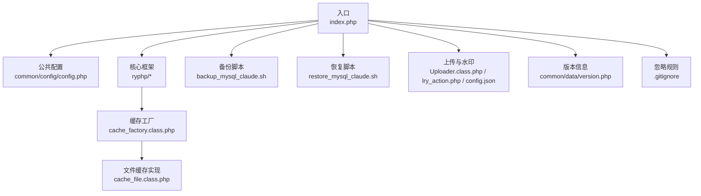
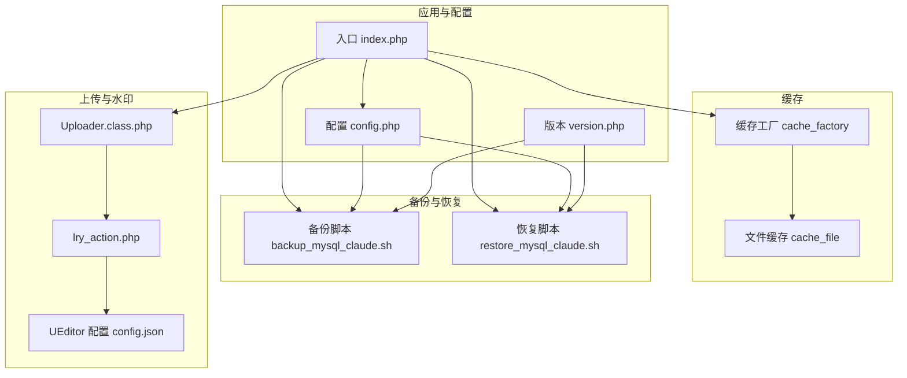
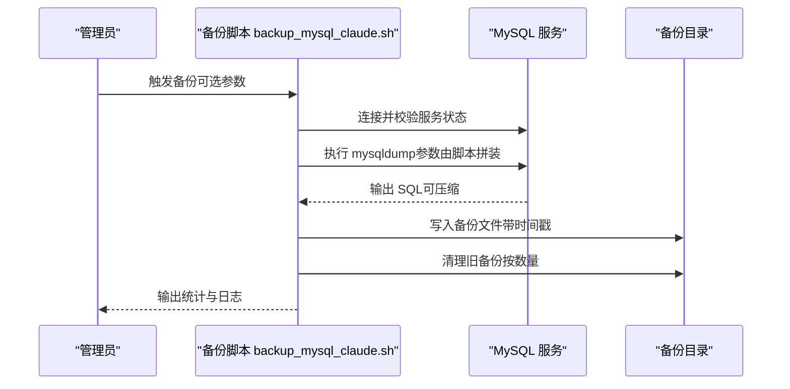
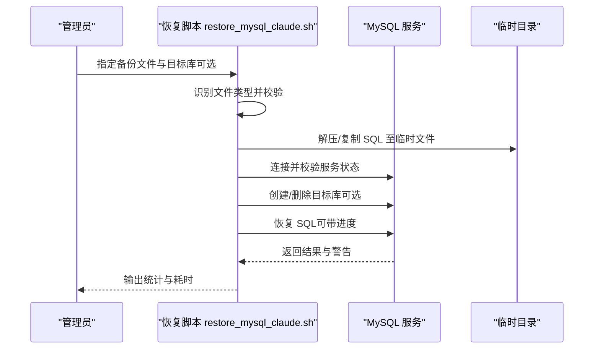
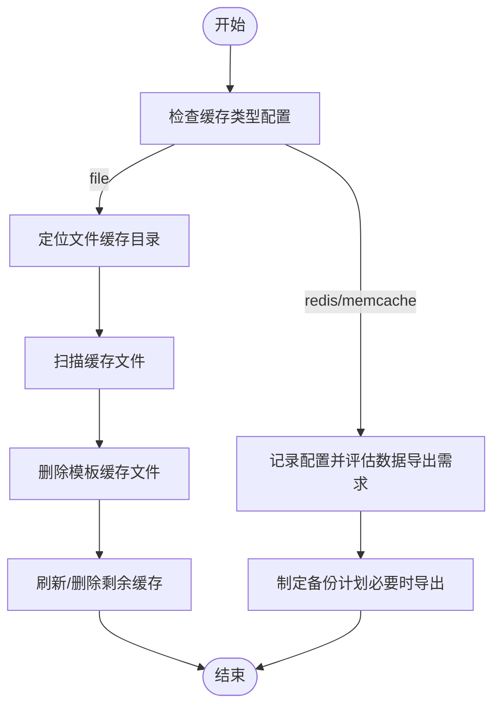
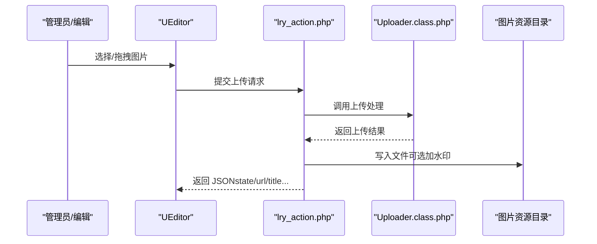
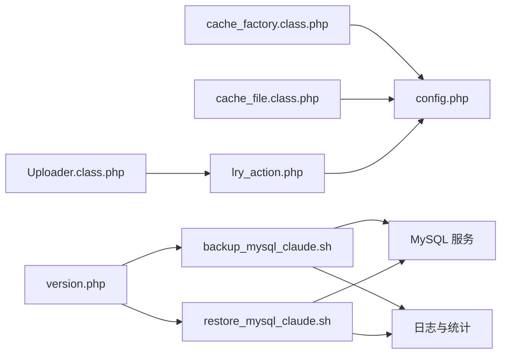

# 文件备份

<cite>
**本文引用的文件**
- [index.php](file://index.php)
- [config.php](file://common/config/config.php)
- [cache_factory.class.php](file://ryphp/core/class/cache_factory.class.php)
- [cache_file.class.php](file://ryphp/core/class/cache_file.class.php)
- [clear_cache.class.php](file://application/lry_admin_center/controller/clear_cache.class.php)
- [.gitignore](file://.gitignore)
- [backup_mysql_claude.sh](file://backup_mysql_claude.sh)
- [restore_mysql_claude.sh](file://restore_mysql_claude.sh)
- [system.func.php](file://common/function/system.func.php)
- [Uploader.class.php](file://common/static/plugin/ueditor/php/Uploader.class.php)
- [lry_action.php](file://common/static/plugin/ueditor/php/lry_action.php)
- [config.json](file://common/static/plugin/ueditor/php/config.json)
- [version.php](file://common/data/version.php)
- [README.md](file://README.md)
</cite>

## 目录
1. [简介](#简介)
2. [项目结构](#项目结构)
3. [核心组件](#核心组件)
4. [架构总览](#架构总览)
5. [详细组件分析](#详细组件分析)
6. [依赖关系分析](#依赖关系分析)
7. [性能考量](#性能考量)
8. [故障排查指南](#故障排查指南)
9. [结论](#结论)
10. [附录](#附录)

## 简介
本指南面向 LRYBlog 文件备份系统，提供一套可操作的备份策略与流程，涵盖源代码、配置、静态资源、图片与水印、缓存、数据库等全量与增量备份要点，以及备份文件的组织、存储、压缩归档与跨平台兼容性建议。文档同时结合仓库现有脚本与配置，给出可落地的实施步骤与最佳实践。

## 项目结构
LRYBlog 采用 PHP + 自研框架的单入口结构，核心目录与与备份相关的关键点如下：
- 应用层：application/（控制器、视图、模型等）
- 公共层：common/（配置、函数、静态资源、插件等）
- 核心框架：ryphp/（核心类、工厂、缓存等）
- 缓存目录：cache/cache_file/（文件型缓存）
- 备份脚本：backup_mysql_claude.sh、restore_mysql_claude.sh
- 版本信息：common/data/version.php
- 入口文件：index.php
- 配置：common/config/config.php
- Git 忽略：.gitignore

**图表来源**
- [index.php:1-18](file://index.php#L1-L18)
- [config.php:1-88](file://common/config/config.php#L1-L88)
- [cache_factory.class.php:1-84](file://ryphp/core/class/cache_factory.class.php#L1-L84)
- [cache_file.class.php:1-130](file://ryphp/core/class/cache_file.class.php#L1-L130)
- [backup_mysql_claude.sh:1-392](file://backup_mysql_claude.sh#L1-L392)
- [restore_mysql_claude.sh:1-412](file://restore_mysql_claude.sh#L1-L412)
- [Uploader.class.php:1-66](file://common/static/plugin/ueditor/php/Uploader.class.php#L1-L66)
- [lry_action.php:206-229](file://common/static/plugin/ueditor/php/lry_action.php#L206-L229)
- [config.json:1-38](file://common/static/plugin/ueditor/php/config.json#L1-L38)
- [version.php:1-4](file://common/data/version.php#L1-L4)
- [.gitignore:1-6](file://.gitignore#L1-L6)

**章节来源**
- [index.php:1-18](file://index.php#L1-L18)
- [config.php:1-88](file://common/config/config.php#L1-L88)
- [README.md:1-6](file://README.md#L1-L6)

## 核心组件
- 备份脚本（数据库）：backup_mysql_claude.sh 与 restore_mysql_claude.sh，提供 mysqldump 备份、压缩、清理、日志、校验与恢复流程。
- 缓存系统：文件型缓存（cache_file），支持缓存目录、后缀、序列化/可执行数组两种模式。
- 上传与水印：UEditor 上传类与动作处理，支持本地上传、水印开关与路径格式配置。
- 配置中心：系统配置（数据库、缓存、上传、水印等）集中于 common/config/config.php。
- 版本信息：common/data/version.php 提供版本号与更新标识。
- 忽略规则：.gitignore 指定缓存目录等不纳入版本控制。

**章节来源**
- [backup_mysql_claude.sh:1-392](file://backup_mysql_claude.sh#L1-L392)
- [restore_mysql_claude.sh:1-412](file://restore_mysql_claude.sh#L1-L412)
- [cache_file.class.php:1-130](file://ryphp/core/class/cache_file.class.php#L1-L130)
- [Uploader.class.php:1-66](file://common/static/plugin/ueditor/php/Uploader.class.php#L1-L66)
- [lry_action.php:206-229](file://common/static/plugin/ueditor/php/lry_action.php#L206-L229)
- [config.php:1-88](file://common/config/config.php#L1-L88)
- [version.php:1-4](file://common/data/version.php#L1-L4)
- [.gitignore:1-6](file://.gitignore#L1-L6)

## 架构总览
下图展示备份与缓存在系统中的交互关系，以及上传与水印对备份范围的影响。

**图表来源**
- [index.php:1-18](file://index.php#L1-L18)
- [config.php:1-88](file://common/config/config.php#L1-L88)
- [cache_factory.class.php:1-84](file://ryphp/core/class/cache_factory.class.php#L1-L84)
- [cache_file.class.php:1-130](file://ryphp/core/class/cache_file.class.php#L1-L130)
- [backup_mysql_claude.sh:1-392](file://backup_mysql_claude.sh#L1-L392)
- [restore_mysql_claude.sh:1-412](file://restore_mysql_claude.sh#L1-L412)
- [Uploader.class.php:1-66](file://common/static/plugin/ueditor/php/Uploader.class.php#L1-L66)
- [lry_action.php:206-229](file://common/static/plugin/ueditor/php/lry_action.php#L206-L229)
- [config.json:1-38](file://common/static/plugin/ueditor/php/config.json#L1-L38)
- [version.php:1-4](file://common/data/version.php#L1-L4)

## 详细组件分析

### 数据库备份与恢复（mysqldump）
- 备份脚本特性
  - 支持完整插入、扩展插入、单事务、触发器/存储过程包含、锁表、DROP TABLE 语句控制。
  - 支持压缩与非压缩两种输出，自动校验压缩文件有效性。
  - 按时间戳统一批次，按数量清理旧备份（全库模式保留最近 N 个完整备份集；单库模式仅清理该库最近 N 个）。
  - 日志分离屏幕与文件输出，便于审计与排障。
- 恢复脚本特性
  - 自动识别 .sql 与 .sql.gz，校验压缩完整性。
  - 支持目标数据库推断、强制覆盖/删除重建、进度显示（可选）。
  - 恢复后统计表数量与数据库大小，输出耗时与统计信息。

**图表来源**
- [backup_mysql_claude.sh:170-392](file://backup_mysql_claude.sh#L170-L392)

**图表来源**
- [restore_mysql_claude.sh:210-412](file://restore_mysql_claude.sh#L210-L412)

**章节来源**
- [backup_mysql_claude.sh:1-392](file://backup_mysql_claude.sh#L1-L392)
- [restore_mysql_claude.sh:1-412](file://restore_mysql_claude.sh#L1-L412)

### 缓存文件备份与清理
- 缓存类型与配置
  - 支持 file、redis、memcache 三类缓存，文件型缓存目录位于 cache/cache_file/，后缀与序列化模式可配置。
- 缓存清理
  - 控制器提供清理接口，删除指定模板缓存与全量缓存。
  - 文件型缓存实现提供 flush 刷新与按 ID 删除能力。
- 备份建议
  - 缓存属于可再生数据，优先清理再备份，避免冗余与权限问题。
  - 若启用多级缓存（如 Redis/Memcache），需同步备份其配置与数据（本仓库未提供对应脚本）。

**图表来源**
- [config.php:39-66](file://common/config/config.php#L39-L66)
- [cache_factory.class.php:36-84](file://ryphp/core/class/cache_factory.class.php#L36-L84)
- [cache_file.class.php:1-130](file://ryphp/core/class/cache_file.class.php#L1-L130)
- [clear_cache.class.php:1-25](file://application/lry_admin_center/controller/clear_cache.class.php#L1-L25)

**章节来源**
- [config.php:39-66](file://common/config/config.php#L39-L66)
- [cache_factory.class.php:1-84](file://ryphp/core/class/cache_factory.class.php#L1-L84)
- [cache_file.class.php:1-130](file://ryphp/core/class/cache_file.class.php#L1-L130)
- [clear_cache.class.php:1-25](file://application/lry_admin_center/controller/clear_cache.class.php#L1-L25)
- [.gitignore:1-6](file://.gitignore#L1-L6)

### 上传与水印资源备份
- 上传路径与水印
  - 上传根目录由配置项指定；UEditor 配置包含上传路径格式、允许类型、大小限制等。
  - 上传成功后可选加水印，水印文件名与位置由配置项控制。
- 备份范围
  - 用户上传图片、系统水印图片均属于媒体资源，应纳入备份范围。
  - 建议按月/季度归档，配合版本号与更新标识进行版本化管理。

**图表来源**
- [lry_action.php:206-229](file://common/static/plugin/ueditor/php/lry_action.php#L206-L229)
- [Uploader.class.php:1-66](file://common/static/plugin/ueditor/php/Uploader.class.php#L1-L66)
- [config.json:1-38](file://common/static/plugin/ueditor/php/config.json#L1-L38)
- [config.php:75-81](file://common/config/config.php#L75-L81)

**章节来源**
- [config.php:75-81](file://common/config/config.php#L75-L81)
- [config.json:1-38](file://common/static/plugin/ueditor/php/config.json#L1-L38)
- [lry_action.php:206-229](file://common/static/plugin/ueditor/php/lry_action.php#L206-L229)
- [Uploader.class.php:1-66](file://common/static/plugin/ueditor/php/Uploader.class.php#L1-L66)

### 静态资源与模板备份
- 静态资源
  - CSS、JS、图片、插件等位于 common/static/ 下，建议按目录结构整体备份。
- 模板
  - 模板主题列表与路径由系统函数与配置共同决定，备份时应保持主题目录与文件名一致。

**章节来源**
- [system.func.php:8-17](file://common/function/system.func.php#L8-L17)
- [config.php:9-10](file://common/config/config.php#L9-L10)

## 依赖关系分析
- 备份脚本依赖 MySQL 服务与配置文件，输出日志与统计。
- 缓存系统依赖配置中的缓存类型与文件缓存目录。
- 上传与水印依赖配置中的上传根目录、水印开关与路径格式。
- 版本信息用于标识系统版本，便于备份归档与回滚对比。

**图表来源**
- [backup_mysql_claude.sh:1-392](file://backup_mysql_claude.sh#L1-L392)
- [restore_mysql_claude.sh:1-412](file://restore_mysql_claude.sh#L1-L412)
- [cache_factory.class.php:1-84](file://ryphp/core/class/cache_factory.class.php#L1-L84)
- [cache_file.class.php:1-130](file://ryphp/core/class/cache_file.class.php#L1-L130)
- [lry_action.php:206-229](file://common/static/plugin/ueditor/php/lry_action.php#L206-L229)
- [config.php:1-88](file://common/config/config.php#L1-L88)
- [version.php:1-4](file://common/data/version.php#L1-L4)

**章节来源**
- [backup_mysql_claude.sh:1-392](file://backup_mysql_claude.sh#L1-L392)
- [restore_mysql_claude.sh:1-412](file://restore_mysql_claude.sh#L1-L412)
- [cache_factory.class.php:1-84](file://ryphp/core/class/cache_factory.class.php#L1-L84)
- [cache_file.class.php:1-130](file://ryphp/core/class/cache_file.class.php#L1-L130)
- [lry_action.php:206-229](file://common/static/plugin/ueditor/php/lry_action.php#L206-L229)
- [config.php:1-88](file://common/config/config.php#L1-L88)
- [version.php:1-4](file://common/data/version.php#L1-L4)

## 性能考量
- 备份窗口与锁表
  - 单事务模式可降低一致性风险；锁表模式适合需要一致快照的场景，但会阻塞写入。
- 压缩与传输
  - 压缩可显著节省空间与传输时间，建议生产环境默认启用压缩。
- 清理策略
  - 按数量而非天数清理，避免无限增长；全库模式按时间戳聚合清理更高效。
- 缓存清理
  - 备份前清理缓存可减少冗余与权限问题，缩短备份时间。

[本节为通用指导，无需特定文件引用]

## 故障排查指南
- 备份脚本常见问题
  - MySQL 服务未运行：检查 systemctl 状态并启动服务。
  - 配置文件权限不当：建议 600 权限，避免泄露敏感信息。
  - 备份文件损坏：脚本内置压缩格式校验，发现异常会删除并记录错误。
- 恢复脚本常见问题
  - 文件类型识别失败：确保扩展名正确或文件内容可识别。
  - 数据库存在冲突：支持删除重建或覆盖，注意数据丢失风险。
  - 进度显示缺失：安装 pv 命令可获得实时进度反馈。
- 缓存清理
  - 目录不可写：检查 cache 目录权限，确保 Web/备份进程具备写权限。
  - 清理不彻底：确认缓存类型与目录配置一致，必要时手动删除残留文件。

**章节来源**
- [backup_mysql_claude.sh:170-198](file://backup_mysql_claude.sh#L170-L198)
- [restore_mysql_claude.sh:210-238](file://restore_mysql_claude.sh#L210-L238)
- [clear_cache.class.php:10-12](file://application/lry_admin_center/controller/clear_cache.class.php#L10-L12)

## 结论
本指南基于仓库现有脚本与配置，给出了 LRYBlog 文件备份的系统化策略：数据库采用 mysqldump 全量备份并结合压缩与清理；缓存作为可再生数据优先清理；上传与水印资源纳入媒体备份；静态资源与模板按目录结构整体备份。建议结合版本信息与忽略规则，形成可追溯、可恢复的备份体系。

[本节为总结，无需特定文件引用]

## 附录

### 备份范围与优先级建议
- 高优先级
  - 数据库（mysqldump 全量备份）
  - 用户上传图片与水印图片
- 中优先级
  - 配置文件（common/config/config.php）
  - 版本信息（common/data/version.php）
- 低优先级
  - 静态资源（CSS/JS/图片/插件）
  - 模板文件（按主题目录）

**章节来源**
- [config.php:1-88](file://common/config/config.php#L1-L88)
- [version.php:1-4](file://common/data/version.php#L1-L4)
- [config.json:1-38](file://common/static/plugin/ueditor/php/config.json#L1-L38)

### 增量备份与全量备份选择
- 全量备份
  - 优点：简单可靠，恢复快速；适合数据库与关键配置。
  - 实施：mysqldump 全量 + 压缩，按时间戳命名，定期清理。
- 增量备份
  - 适用：大体量静态资源与媒体文件；可结合 rsync/snapshots。
  - 注意：需保证基线一致与索引维护，恢复复杂度较高。

**章节来源**
- [backup_mysql_claude.sh:237-256](file://backup_mysql_claude.sh#L237-L256)

### 备份频率建议
- 数据库：每日全量 + 每日增量（如适用）
- 配置与模板：变更即备份
- 静态资源与媒体：按版本发布节奏备份

[本节为通用建议，无需特定文件引用]

### 备份文件组织与存储
- 目录结构
  - 按“数据库/配置/静态/媒体/模板”分层存放，统一时间戳命名。
- 权限处理
  - 配置文件与备份目录建议最小权限原则；缓存目录在备份前清理。
- 压缩与归档
  - 生产环境默认启用压缩；跨平台建议使用 tar.gz 或 zip。

**章节来源**
- [.gitignore:1-6](file://.gitignore#L1-L6)
- [backup_mysql_claude.sh:276-280](file://backup_mysql_claude.sh#L276-L280)

### 跨平台兼容性
- 脚本语言：bash，Linux/WSL 环境；Windows 建议使用 WSL 或 Git Bash。
- 依赖工具：mysqldump、gzip、find、awk、sed、mktemp、systemctl、date 等。
- 文件路径：使用相对路径与变量，避免硬编码绝对路径。

**章节来源**
- [backup_mysql_claude.sh:8-24](file://backup_mysql_claude.sh#L8-L24)
- [restore_mysql_claude.sh:8-30](file://restore_mysql_claude.sh#L8-L30)