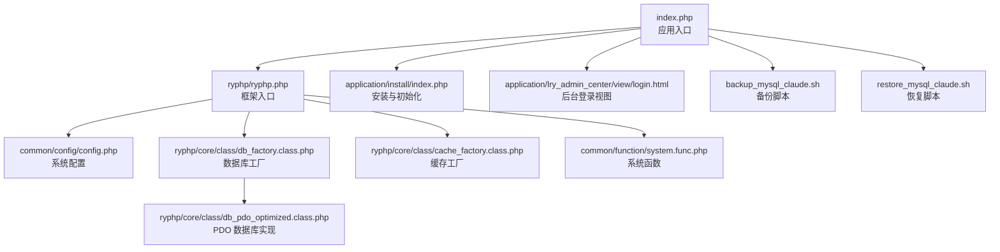
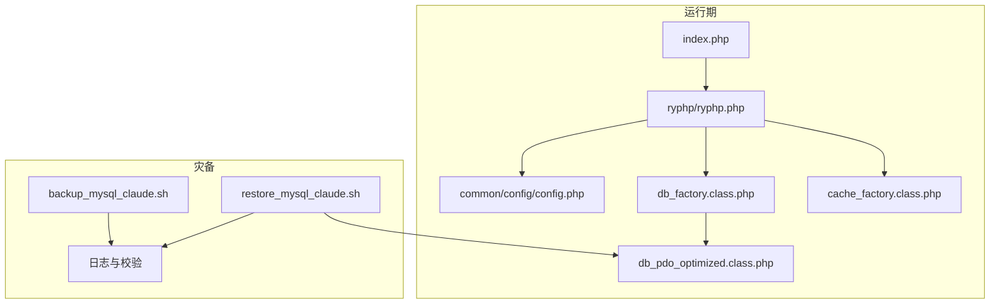
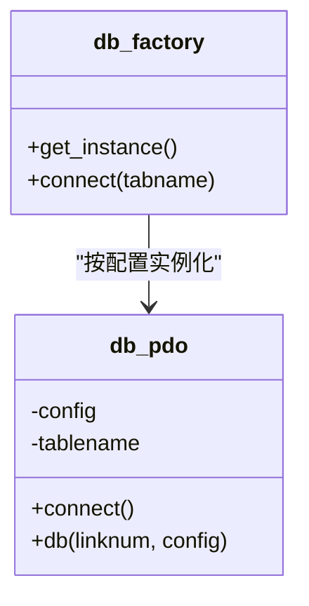
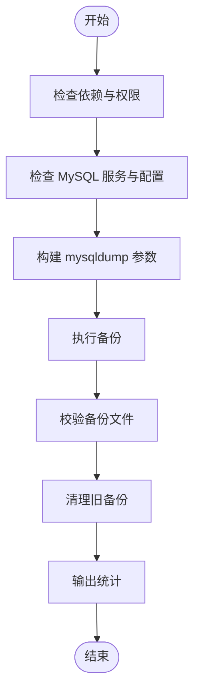
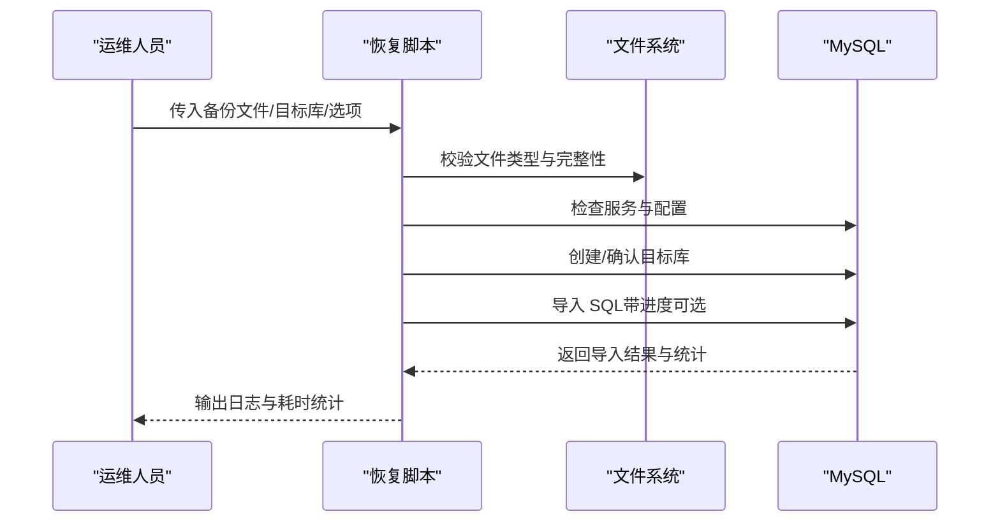
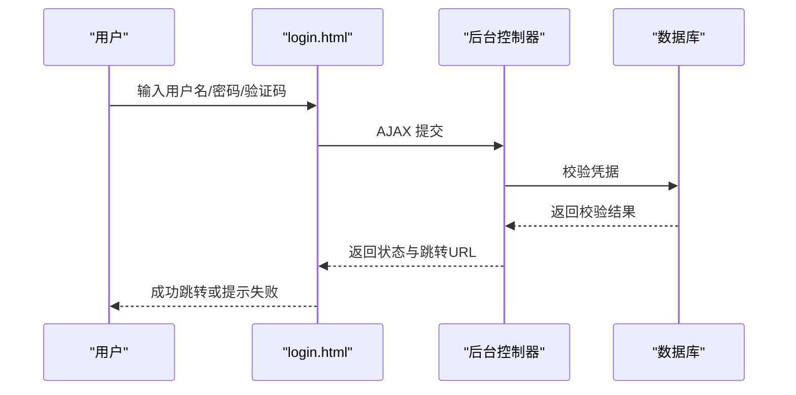
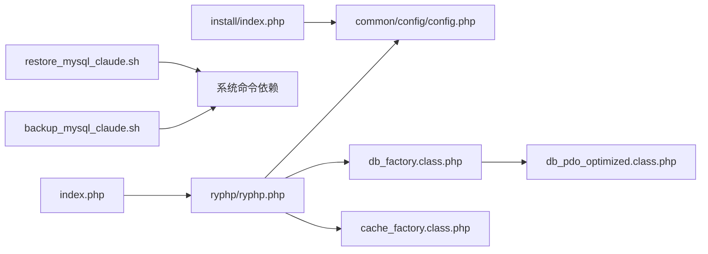
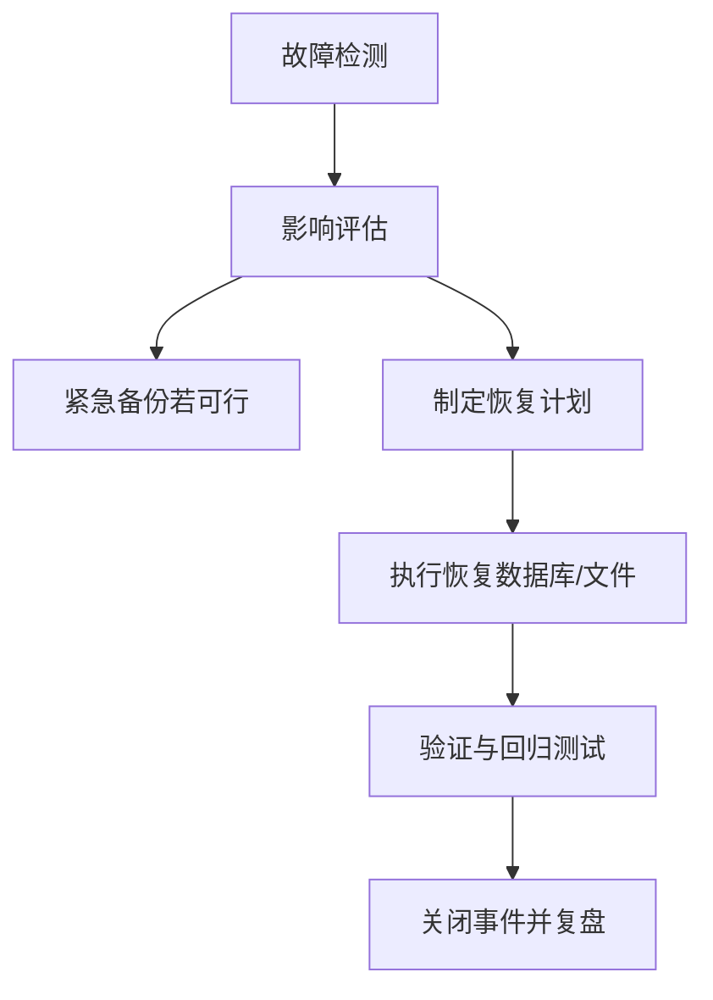

# 灾难恢复

<cite>
**本文引用的文件**
- [index.php](file://index.php)
- [ryphp.php](file://ryphp/ryphp.php)
- [config.php](file://common/config/config.php)
- [db_factory.class.php](file://ryphp/core/class/db_factory.class.php)
- [cache_factory.class.php](file://ryphp/core/class/cache_factory.class.php)
- [db_pdo_optimized.class.php](file://ryphp/core/class/db_pdo_optimized.class.php)
- [backup_mysql_claude.sh](file://backup_mysql_claude.sh)
- [restore_mysql_claude.sh](file://restore_mysql_claude.sh)
- [system.func.php](file://common/function/system.func.php)
- [install/index.php](file://application/install/index.php)
- [login.html](file://application/lry_admin_center/view/login.html)
- [debug.class.php](file://ryphp/core/class/debug.class.php)
- [error.tpl](file://ryphp/core/message/error.tpl)
- [README.md](file://README.md)
</cite>

## 目录
1. [引言](#引言)
2. [项目结构](#项目结构)
3. [核心组件](#核心组件)
4. [架构总览](#架构总览)
5. [详细组件分析](#详细组件分析)
6. [依赖关系分析](#依赖关系分析)
7. [性能考量](#性能考量)
8. [故障排查指南](#故障排查指南)
9. [结论](#结论)
10. [附录](#附录)

## 引言
本预案面向 LRYBlog 系统，围绕“数据丢失应急处理、系统重建流程、灾难场景应对、灾备方案与自动切换、RTO/RPO 设定与监控、演练与测试”等方面，结合仓库现有备份/恢复脚本与系统架构，提供可落地的灾难恢复方案。预案强调以“最小停机时间、最大数据保护”为目标，确保在服务器故障、数据损坏、恶意攻击等场景下，能快速、准确地完成故障检测、影响评估、紧急备份与快速恢复。

## 项目结构
LRYBlog 采用 MVC 分层与模块化组织，核心入口为应用入口文件，框架入口位于 ryphp 目录，系统配置集中于 common/config，数据库与缓存抽象由工厂类统一调度，备份/恢复脚本位于仓库根目录。

**图表来源**
- [index.php:1-18](file://index.php#L1-L18)
- [ryphp.php:83-202](file://ryphp/ryphp.php#L83-L202)
- [config.php:1-88](file://common/config/config.php#L1-L88)
- [db_factory.class.php:11-49](file://ryphp/core/class/db_factory.class.php#L11-L49)
- [cache_factory.class.php:36-82](file://ryphp/core/class/cache_factory.class.php#L36-L82)
- [db_pdo_optimized.class.php:87-119](file://ryphp/core/class/db_pdo_optimized.class.php#L87-L119)
- [install/index.php:15-275](file://application/install/index.php#L15-L275)
- [login.html:1-98](file://application/lry_admin_center/view/login.html#L1-L98)
- [system.func.php:1-200](file://common/function/system.func.php#L1-L200)
- [backup_mysql_claude.sh:1-392](file://backup_mysql_claude.sh#L1-L392)
- [restore_mysql_claude.sh:1-412](file://restore_mysql_claude.sh#L1-L412)

**章节来源**
- [index.php:1-18](file://index.php#L1-L18)
- [ryphp.php:83-202](file://ryphp/ryphp.php#L83-L202)
- [config.php:1-88](file://common/config/config.php#L1-L88)
- [db_factory.class.php:11-49](file://ryphp/core/class/db_factory.class.php#L11-L49)
- [cache_factory.class.php:36-82](file://ryphp/core/class/cache_factory.class.php#L36-L82)
- [db_pdo_optimized.class.php:87-119](file://ryphp/core/class/db_pdo_optimized.class.php#L87-L119)
- [install/index.php:15-275](file://application/install/index.php#L15-L275)
- [login.html:1-98](file://application/lry_admin_center/view/login.html#L1-L98)
- [system.func.php:1-200](file://common/function/system.func.php#L1-L200)
- [backup_mysql_claude.sh:1-392](file://backup_mysql_claude.sh#L1-L392)
- [restore_mysql_claude.sh:1-412](file://restore_mysql_claude.sh#L1-L412)

## 核心组件
- 应用入口与框架
  - 应用入口负责常量定义、框架引导与 URL 模型设置；框架入口负责站点常量、类加载与路由初始化。
- 数据库与缓存
  - 数据库工厂根据配置选择 PDO/MySQLi/MySQL 实现，PDO 实现具备严格参数绑定与异常处理能力；缓存工厂支持 file/redis/memcache，便于灾备切换。
- 配置中心
  - 集中存放数据库、缓存、上传、Cookie、路由等配置，直接影响备份/恢复与系统运行。
- 备份/恢复脚本
  - 提供 MySQL 全量/单库备份与压缩/非压缩恢复，包含日志、校验、清理策略与交互确认。
- 安装与后台
  - 安装流程可一键创建数据库、导入表结构与初始数据；后台登录视图提供管理员入口。

**章节来源**
- [index.php:10-18](file://index.php#L10-L18)
- [ryphp.php:83-202](file://ryphp/ryphp.php#L83-L202)
- [config.php:13-86](file://common/config/config.php#L13-L86)
- [db_factory.class.php:14-31](file://ryphp/core/class/db_factory.class.php#L14-L31)
- [cache_factory.class.php:39-61](file://ryphp/core/class/cache_factory.class.php#L39-L61)
- [db_pdo_optimized.class.php:55-61](file://ryphp/core/class/db_pdo_optimized.class.php#L55-L61)
- [backup_mysql_claude.sh:275-337](file://backup_mysql_claude.sh#L275-L337)
- [restore_mysql_claude.sh:252-410](file://restore_mysql_claude.sh#L252-L410)
- [install/index.php:132-260](file://application/install/index.php#L132-L260)
- [login.html:14-34](file://application/lry_admin_center/view/login.html#L14-L34)

## 架构总览
下图展示系统在灾难恢复中的关键交互：备份脚本生成 SQL/压缩包，恢复脚本验证文件、创建/覆盖数据库并执行导入，框架与工厂类负责运行期连接与缓存。

**图表来源**
- [index.php:10-18](file://index.php#L10-L18)
- [ryphp.php:83-202](file://ryphp/ryphp.php#L83-L202)
- [config.php:13-86](file://common/config/config.php#L13-L86)
- [db_factory.class.php:14-31](file://ryphp/core/class/db_factory.class.php#L14-L31)
- [cache_factory.class.php:39-61](file://ryphp/core/class/cache_factory.class.php#L39-L61)
- [db_pdo_optimized.class.php:87-119](file://ryphp/core/class/db_pdo_optimized.class.php#L87-L119)
- [backup_mysql_claude.sh:275-337](file://backup_mysql_claude.sh#L275-L337)
- [restore_mysql_claude.sh:252-410](file://restore_mysql_claude.sh#L252-L410)

## 详细组件分析

### 数据库工厂与 PDO 实现
- 工厂根据配置选择具体数据库驱动，PDO 实现启用严格参数绑定与异常处理，降低注入风险并提升稳定性。
- 关键点：连接字符串、字符集、端口、表前缀均由配置决定，恢复时需确保目标环境一致。

**图表来源**
- [db_factory.class.php:14-31](file://ryphp/core/class/db_factory.class.php#L14-L31)
- [db_pdo_optimized.class.php:87-119](file://ryphp/core/class/db_pdo_optimized.class.php#L87-L119)

**章节来源**
- [db_factory.class.php:14-31](file://ryphp/core/class/db_factory.class.php#L14-L31)
- [db_pdo_optimized.class.php:87-119](file://ryphp/core/class/db_pdo_optimized.class.php#L87-L119)

### 备份脚本（增强版）
- 功能特性
  - 支持全库/单库备份、压缩/非压缩、单事务一致性、完整 INSERT、扩展 INSERT、触发器/存储过程包含、锁表可选。
  - 自动清理旧备份（按数量而非天数），日志分离屏幕与文件输出，权限与依赖检查。
- 关键流程
  - 依赖检查 → MySQL 服务状态 → 配置文件存在与权限 → 连接测试 → 构建 mysqldump 参数 → 备份执行与校验 → 清理旧文件 → 统计输出。

**图表来源**
- [backup_mysql_claude.sh:8-392](file://backup_mysql_claude.sh#L8-L392)

**章节来源**
- [backup_mysql_claude.sh:8-392](file://backup_mysql_claude.sh#L8-L392)

### 恢复脚本（数据库）
- 功能特性
  - 支持 .sql 与 .sql.gz，自动识别文件类型，解压校验，提取目标库名，交互确认覆盖/删除，进度显示（可选）。
  - 创建数据库、导入 SQL、统计恢复耗时、表数量与数据库大小。
- 关键流程
  - 参数解析 → 文件类型判断 → MySQL 服务与配置检查 → 解压/复制 SQL → 内容校验 → 目标库存在性处理 → 导入执行 → 统计与日志。

**图表来源**
- [restore_mysql_claude.sh:150-410](file://restore_mysql_claude.sh#L150-L410)

**章节来源**
- [restore_mysql_claude.sh:150-410](file://restore_mysql_claude.sh#L150-L410)

### 安装与后台登录
- 安装流程
  - 环境检测、数据库连接测试、创建数据库、导入表结构与初始数据、写入配置文件、生成安装锁。
- 后台登录
  - 登录表单提交至控制器，AJAX 校验用户名、密码、验证码，成功后跳转后台。

**图表来源**
- [login.html:57-94](file://application/lry_admin_center/view/login.html#L57-L94)
- [install/index.php:132-260](file://application/install/index.php#L132-L260)

**章节来源**
- [login.html:57-94](file://application/lry_admin_center/view/login.html#L57-L94)
- [install/index.php:132-260](file://application/install/index.php#L132-L260)

## 依赖关系分析
- 入口与框架
  - index.php 依赖 ryphp/ryphp.php 完成应用初始化；后者定义站点常量、类加载与路由。
- 数据与缓存
  - db_factory 依据配置选择 PDO/MySQLi/MySQL；cache_factory 依据配置选择 file/redis/memcache。
- 备份/恢复
  - 备份脚本依赖 mysqldump/gzip/find/awk/sed 等命令；恢复脚本依赖 mysql/gunzip/pv/file 等命令。
- 安装与配置
  - 安装流程写入 common/config/config.php，影响后续运行期连接与缓存策略。

**图表来源**
- [index.php:10-18](file://index.php#L10-L18)
- [ryphp.php:83-202](file://ryphp/ryphp.php#L83-L202)
- [config.php:13-86](file://common/config/config.php#L13-L86)
- [db_factory.class.php:14-31](file://ryphp/core/class/db_factory.class.php#L14-L31)
- [cache_factory.class.php:39-61](file://ryphp/core/class/cache_factory.class.php#L39-L61)
- [db_pdo_optimized.class.php:87-119](file://ryphp/core/class/db_pdo_optimized.class.php#L87-L119)
- [backup_mysql_claude.sh:8-392](file://backup_mysql_claude.sh#L8-L392)
- [restore_mysql_claude.sh:8-412](file://restore_mysql_claude.sh#L8-L412)
- [install/index.php:132-260](file://application/install/index.php#L132-L260)

**章节来源**
- [index.php:10-18](file://index.php#L10-L18)
- [ryphp.php:83-202](file://ryphp/ryphp.php#L83-L202)
- [config.php:13-86](file://common/config/config.php#L13-L86)
- [db_factory.class.php:14-31](file://ryphp/core/class/db_factory.class.php#L14-L31)
- [cache_factory.class.php:39-61](file://ryphp/core/class/cache_factory.class.php#L39-L61)
- [db_pdo_optimized.class.php:87-119](file://ryphp/core/class/db_pdo_optimized.class.php#L87-L119)
- [backup_mysql_claude.sh:8-392](file://backup_mysql_claude.sh#L8-L392)
- [restore_mysql_claude.sh:8-412](file://restore_mysql_claude.sh#L8-L412)
- [install/index.php:132-260](file://application/install/index.php#L132-L260)

## 性能考量
- 备份性能
  - 单事务模式保证一致性；压缩可显著节省空间，但会增加 CPU 开销；扩展 INSERT 可减少行数，提高导入效率。
- 恢复性能
  - 导入阶段可利用进度显示工具（pv）观测吞吐；SQL 文件大小与表数量直接影响恢复耗时。
- 缓存策略
  - file 缓存适合单机；redis/memcache 适合分布式或高并发场景，灾备时可切换缓存后端。

**章节来源**
- [backup_mysql_claude.sh:200-235](file://backup_mysql_claude.sh#L200-L235)
- [restore_mysql_claude.sh:358-376](file://restore_mysql_claude.sh#L358-L376)
- [cache_factory.class.php:39-61](file://ryphp/core/class/cache_factory.class.php#L39-L61)

## 故障排查指南
- 备份失败
  - 检查 MySQL 服务状态与配置文件权限；确认依赖命令可用；查看日志文件定位错误。
- 恢复失败
  - 确认备份文件完整性与类型；目标库存在性与权限；导入阶段错误信息记录在日志中。
- 运行期异常
  - 框架提供致命错误捕获与错误日志写入；生产环境建议关闭调试模式，启用错误日志保存。

**章节来源**
- [backup_mysql_claude.sh:170-198](file://backup_mysql_claude.sh#L170-L198)
- [restore_mysql_claude.sh:210-238](file://restore_mysql_claude.sh#L210-L238)
- [debug.class.php:46-83](file://ryphp/core/class/debug.class.php#L46-L83)
- [error.tpl:60-118](file://ryphp/core/message/error.tpl#L60-L118)

## 结论
本预案基于仓库现有备份/恢复脚本与系统架构，明确了数据丢失应急处理流程、系统重建步骤、灾备方案与自动切换思路、RTO/RPO 目标设定与监控方法，以及演练与测试方案。建议在生产环境中固化以下要点：严格的备份策略与轮转、恢复演练常态化、配置与权限最小化、缓存后端可切换、日志与告警闭环。

## 附录

### 应急预案总流程（数据丢失）

### 灾难场景与应对策略
- 服务器故障
  - 启动备用节点，挂载异地备份卷，恢复数据库与静态资源，切换 DNS/负载均衡。
- 数据损坏
  - 使用最近可用备份恢复，核对校验值；必要时进行点对点修复与索引重建。
- 恶意攻击
  - 回滚到攻击前备份，加固认证与访问控制，更新密钥与配置，监控异常行为。

### 灾备系统搭建方案
- 异地备份
  - 使用备份脚本定时导出并加密传输至异地存储，定期校验与抽样恢复测试。
- 云备份
  - 将备份归档至对象存储，设置生命周期策略与跨区域复制。
- 自动切换机制
  - 结合健康检查与自动化脚本，实现主备切换与流量切流；缓存后端可配置多实例。

### RTO/RPO 设定与监控
- RTO（恢复时间目标）
  - 通过并行恢复、压缩备份、预热缓存、自动化脚本缩短停机时间。
- RPO（恢复点目标）
  - 通过增量/实时备份与二进制日志回放，将数据丢失窗口控制在分钟级。
- 监控方法
  - 记录备份/恢复耗时、文件大小、导入耗时与错误日志，建立告警阈值。

### 灾难恢复演练与测试
- 定期演练
  - 每季度至少一次全量恢复演练，覆盖服务器故障、数据损坏、恶意攻击三类场景。
- 测试清单
  - 备份完整性校验、恢复时间测量、业务功能回归测试、切换与回切验证。
- 文档与培训
  - 更新预案与操作手册，对运维与开发团队进行培训与考核。