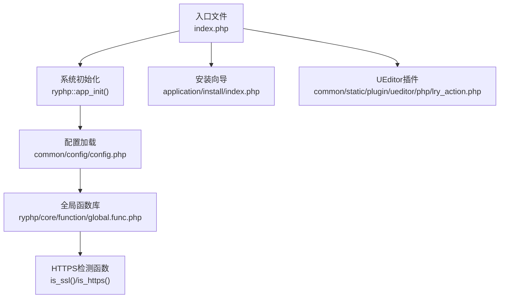
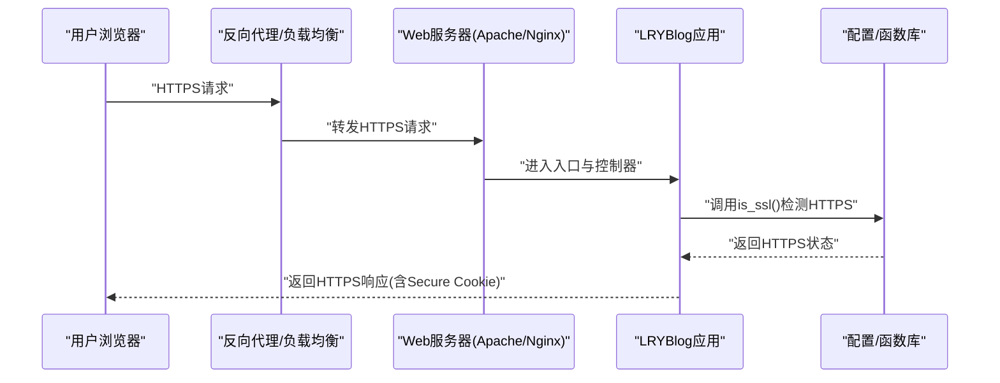
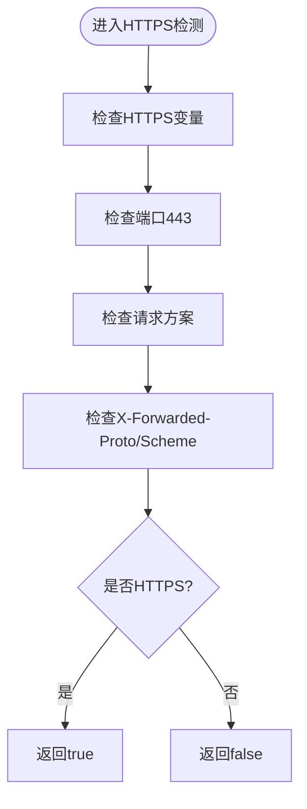
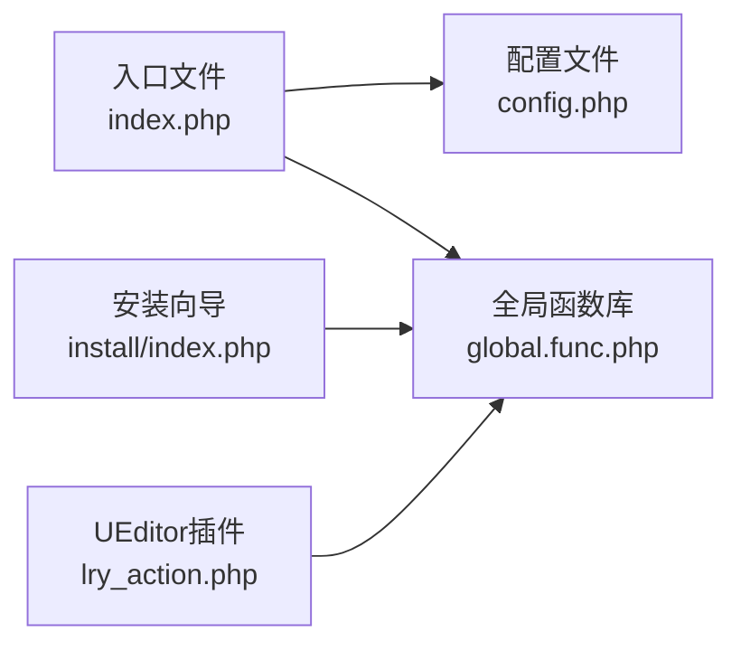

# SSL证书管理

<cite>
**本文引用的文件**
- [index.php](file://index.php)
- [config.php](file://common/config/config.php)
- [global.func.php](file://ryphp/core/function/global.func.php)
- [lry_action.php](file://common/static/plugin/ueditor/php/lry_action.php)
- [index.php（安装向导）](file://application/install/index.php)
- [README.md](file://README.md)
- [DNS_FIX.md](file://DNS_FIX.md)
- [backup_mysql_claude.sh](file://backup_mysql_claude.sh)
- [restore_mysql_claude.sh](file://restore_mysql_claude.sh)
</cite>

## 目录
1. [简介](#简介)
2. [项目结构](#项目结构)
3. [核心组件](#核心组件)
4. [架构总览](#架构总览)
5. [详细组件分析](#详细组件分析)
6. [依赖关系分析](#依赖关系分析)
7. [性能考虑](#性能考虑)
8. [故障排查指南](#故障排查指南)
9. [结论](#结论)
10. [附录](#附录)

## 简介
本指南面向LRYBlog的SSL证书管理与部署，围绕以下目标展开：
- 证书选择：免费证书（CA证书）与付费证书的适用场景与选择标准
- 服务器配置：Apache与Nginx的SSL配置要点（虚拟主机、证书链、私钥权限）
- 证书安装：证书链配置、中间证书安装、域名绑定验证
- 自动续期：Let’s Encrypt自动续期脚本设置与最佳实践
- HTTPS重定向与混合内容处理：统一走HTTPS、避免Mixed Content
- 性能与安全优化：TLS版本、加密套件、HSTS、OCSP Stapling等

本项目为PHP开发的博客系统，具备基础的HTTPS检测能力与Cookie安全配置开关，可作为SSL部署与安全加固的重要参考。

## 项目结构
LRYBlog采用典型的PHP MVC结构，入口文件负责应用初始化，系统配置集中于配置文件，全局函数提供通用能力（如HTTPS检测）。安装向导与UEditor插件也包含HTTPS检测逻辑，便于在不同模块中统一处理HTTPS场景。

图表来源
- [index.php:10-18](file://index.php#L10-L18)
- [config.php:1-88](file://common/config/config.php#L1-L88)
- [global.func.php:256-281](file://ryphp/core/function/global.func.php#L256-L281)
- [lry_action.php:141-158](file://common/static/plugin/ueditor/php/lry_action.php#L141-L158)
- [index.php（安装向导）:346-373](file://application/install/index.php#L346-L373)

章节来源
- [index.php:10-18](file://index.php#L10-L18)
- [config.php:1-88](file://common/config/config.php#L1-L88)

## 核心组件
- HTTPS检测能力：系统内置多处HTTPS检测函数，覆盖安装向导与UEditor插件，确保在反代或负载均衡场景下也能正确识别HTTPS。
- Cookie安全配置：配置文件提供Cookie Secure与HttpOnly开关，便于在启用HTTPS后提升会话安全性。
- 应用入口与初始化：入口文件定义调试开关、根目录、URL模式，并调用框架初始化，为后续SSL配置提供上下文。

章节来源
- [global.func.php:256-281](file://ryphp/core/function/global.func.php#L256-L281)
- [lry_action.php:141-158](file://common/static/plugin/ueditor/php/lry_action.php#L141-L158)
- [config.php:31-37](file://common/config/config.php#L31-L37)
- [index.php:10-18](file://index.php#L10-L18)

## 架构总览
下图展示LRYBlog在HTTPS场景下的典型交互：客户端通过HTTPS访问，服务器根据反代/负载均衡传递的协议信息正确识别HTTPS，系统据此生成绝对URL与安全Cookie。

图表来源
- [global.func.php:256-281](file://ryphp/core/function/global.func.php#L256-L281)
- [config.php:31-37](file://common/config/config.php#L31-L37)
- [index.php:10-18](file://index.php#L10-L18)

## 详细组件分析

### HTTPS检测与Cookie安全配置
- HTTPS检测：系统在多个位置提供HTTPS检测函数，综合HTTPS变量、端口、请求方案以及X-Forwarded-*头，确保在反代场景下也能准确识别HTTPS。
- Cookie安全：配置文件提供Cookie Secure与HttpOnly开关；启用HTTPS后应将Secure设为true以仅通过HTTPS传输Cookie，减少被窃听风险。

图表来源
- [global.func.php:256-281](file://ryphp/core/function/global.func.php#L256-L281)
- [lry_action.php:141-158](file://common/static/plugin/ueditor/php/lry_action.php#L141-L158)
- [index.php（安装向导）:346-373](file://application/install/index.php#L346-L373)

章节来源
- [global.func.php:256-281](file://ryphp/core/function/global.func.php#L256-L281)
- [config.php:31-37](file://common/config/config.php#L31-L37)

### URL生成与HTTPS前缀
- URL模型与HTTPS前缀：系统在生成URL时会根据当前请求方案与URL模式决定是否添加协议与域名前缀，确保在HTTPS下生成绝对URL，避免Mixed Content。
- 关键点：当URL模型为特定值或显式传入域名时，会强制添加https://与HTTP_HOST，保证资源引用的协议一致性。

章节来源
- [global.func.php:721-762](file://ryphp/core/function/global.func.php#L721-L762)

### 安装向导与HTTPS校验
- 安装向导包含HTTPS检测与URL可达性测试函数，便于在安装阶段验证HTTPS环境与网络连通性。
- 注意：测试函数中对SSL验证进行了放宽，仅用于安装阶段的连通性探测，生产环境不应沿用该做法。

章节来源
- [index.php（安装向导）:346-373](file://application/install/index.php#L346-L373)

### DNS与证书申请前置条件
- DNS解析问题：项目提供了DNS修复文档，建议将不可用的自定义DNS替换为稳定/国内可用的公共DNS，确保证书申请与域名解析正常。
- 建议：在申请证书前优先解决DNS解析问题，避免ACME挑战失败。

章节来源
- [DNS_FIX.md:1-37](file://DNS_FIX.md#L1-L37)

## 依赖关系分析
- 入口文件依赖框架初始化，配置文件提供系统级参数（含Cookie安全），全局函数库提供HTTPS检测与通用工具。
- 安装向导与UEditor插件复用HTTPS检测逻辑，体现跨模块的一致性。

图表来源
- [index.php:10-18](file://index.php#L10-L18)
- [config.php:1-88](file://common/config/config.php#L1-L88)
- [global.func.php:256-281](file://ryphp/core/function/global.func.php#L256-L281)
- [index.php（安装向导）:346-373](file://application/install/index.php#L346-L373)
- [lry_action.php:141-158](file://common/static/plugin/ueditor/php/lry_action.php#L141-L158)

章节来源
- [index.php:10-18](file://index.php#L10-L18)
- [config.php:1-88](file://common/config/config.php#L1-L88)
- [global.func.php:256-281](file://ryphp/core/function/global.func.php#L256-L281)

## 性能考虑
- TLS性能优化建议（通用实践，非仓库特有实现）：
  - 启用TLS 1.2/1.3，禁用过时协议
  - 优选现代加密套件，优先AEAD
  - 启用会话复用（Session Tickets）与ALPN
  - 启用OCSP Stapling，降低客户端OCSP查询延迟
  - 合理设置证书链顺序，减少握手开销
  - 在高并发场景下使用硬件加速或专用SSL卸载设备
- 与本项目结合：
  - HTTPS检测函数已在多处使用，确保在反代场景下行为一致
  - Cookie Secure开启后可减少因协议不一致导致的重定向循环与额外流量

## 故障排查指南
- HTTPS检测异常
  - 现象：在反代/负载均衡后，系统未能正确识别HTTPS
  - 排查：确认反代是否正确传递X-Forwarded-Proto或X-Forwarded-Scheme头；检查HTTPS检测函数的判定逻辑是否覆盖到相应头
  - 参考：多处HTTPS检测函数均包含对X-Forwarded-*头的处理
- Mixed Content
  - 现象：页面资源仍以HTTP加载
  - 排查：确保URL生成逻辑在HTTPS下添加协议前缀；检查模板与静态资源引用
  - 参考：URL生成逻辑在HTTPS下会强制添加协议与域名前缀
- Cookie安全
  - 现象：登录态在HTTPS下失效或被拦截
  - 排查：启用Cookie Secure与HttpOnly；确保浏览器支持SameSite策略
  - 参考：配置文件提供Cookie Secure与HttpOnly开关
- DNS解析失败导致证书申请失败
  - 现象：ACME挑战无法通过
  - 排查：参照DNS修复文档，更换为可用的公共DNS服务器
  - 参考：DNS修复文档提供了推荐DNS与测试命令

章节来源
- [global.func.php:256-281](file://ryphp/core/function/global.func.php#L256-L281)
- [global.func.php:721-762](file://ryphp/core/function/global.func.php#L721-L762)
- [config.php:31-37](file://common/config/config.php#L31-L37)
- [DNS_FIX.md:1-37](file://DNS_FIX.md#L1-L37)

## 结论
- LRYBlog具备完善的HTTPS检测与Cookie安全配置能力，可在反代/负载均衡环境下稳定识别HTTPS并生成安全的会话。
- 证书申请与安装需关注DNS解析质量与证书链完整性；HTTPS重定向与混合内容处理应贯穿全站。
- 自动续期建议采用Let’s Encrypt生态工具，配合本项目的HTTPS检测与Cookie安全配置，确保长期稳定运行。

## 附录

### 证书选择与申请流程
- 免费证书（CA证书）
  - 适用：个人博客、小型站点、测试环境
  - 优点：自动化程度高、成本低、支持通配符
  - 注意：需保证域名解析与ACME挑战可达
- 付费证书
  - 适用：企业官网、金融/医疗类站点、需要Extended Validation的企业信任
  - 优点：品牌信任度更高、支持更广的域名组合、SLA保障
  - 注意：需提供组织证明与域名验证材料

### Apache与Nginx SSL配置要点
- Apache
  - 虚拟主机：监听443端口，配置SSLEngine、SSLCertificateFile、SSLCertificateKeyFile、SSLCertificateChainFile
  - 证书链：确保将中间证书与根证书串联至CertificateChainFile
  - 私钥权限：私钥文件权限建议为600，仅属主可读写
- Nginx
  - 虚拟主机：listen 443 ssl，配置ssl_certificate、ssl_certificate_key、ssl_trusted_certificate
  - 证书链：将中间证书追加至ssl_certificate，根证书置于ssl_trusted_certificate
  - 私钥权限：私钥权限建议为600，仅属主可读写
  - PATHINFO支持：如需PATHINFO模式，参考配置文件中的相关说明

章节来源
- [config.php:10-11](file://common/config/config.php#L10-L11)

### 证书安装与域名绑定验证
- 安装步骤
  - 下载证书与中间证书，按服务器要求拼接证书链
  - 将证书与私钥放置到服务器可信目录，设置私钥权限为600
  - 在虚拟主机中指向证书与私钥文件
  - 重启/重载服务使配置生效
- 域名绑定验证
  - 确保域名A/AAAA记录解析到服务器IP
  - ACME挑战需可从公网访问，必要时检查防火墙与CDN回源

### Let's Encrypt自动续期
- 推荐工具：certbot（官方客户端）
- 常用命令
  - 申请：certbot certonly --webroot -w /var/www/html -d example.com
  - 续签：certbot renew
- 与本项目结合
  - 续期脚本应在HTTPS环境下运行，确保证书链与私钥权限正确
  - 生产环境建议使用独立的webroot目录，避免与应用目录权限冲突

### HTTPS重定向与混合内容处理
- 重定向
  - 将HTTP 80端口重定向至HTTPS 443，确保全站HTTPS
- 混合内容
  - 模板与静态资源引用统一使用绝对URL（在HTTPS下自动带https://）
  - 替换相对路径为绝对路径或协议无关路径（//）

### 安全与性能建议
- 安全
  - 启用Cookie Secure与HttpOnly
  - 启用HSTS（严格传输安全），提升抗降级攻击能力
  - 定期轮换私钥与证书，监控到期时间
- 性能
  - 启用TLS会话复用与ALPN
  - 启用OCSP Stapling
  - 优化证书链长度，减少握手时延