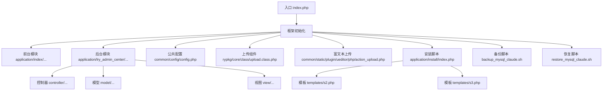
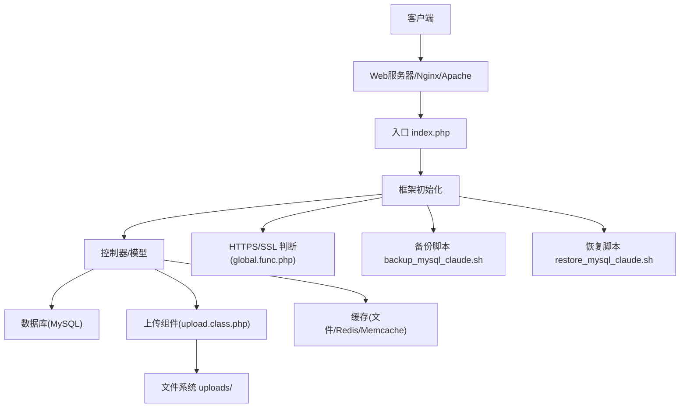
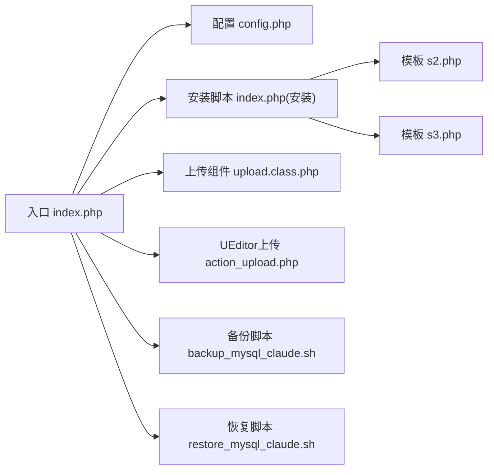

# 安全加固

<cite>
**本文引用的文件**
- [index.php](file://index.php)
- [config.php](file://common/config/config.php)
- [index.php](file://application/install/index.php)
- [s2.php](file://application/install/templates/s2.php)
- [s3.php](file://application/install/templates/s3.php)
- [admin.class.php](file://application/lry_admin_center/model/admin.class.php)
- [login.html](file://application/lry_admin_center/view/login.html)
- [global.func.php](file://ryphp/core/function/global.func.php)
- [action_upload.php](file://common/static/plugin/ueditor/php/action_upload.php)
- [upload.class.php](file://ryphp/core/class/upload.class.php)
- [backup_mysql_claude.sh](file://backup_mysql_claude.sh)
- [restore_mysql_claude.sh](file://restore_mysql_claude.sh)
- [public_edit_pwd.html](file://application/lry_admin_center/view/public_edit_pwd.html)
- [admin_manage.class.php](file://application/lry_admin_center/controller/admin_manage.class.php)
</cite>

## 目录
1. [引言](#引言)
2. [项目结构](#项目结构)
3. [核心组件](#核心组件)
4. [架构总览](#架构总览)
5. [详细组件分析](#详细组件分析)
6. [依赖关系分析](#依赖关系分析)
7. [性能考量](#性能考量)
8. [故障排查指南](#故障排查指南)
9. [结论](#结论)
10. [附录](#附录)

## 引言
本指南面向LRYBlog项目的运维与开发团队，围绕防火墙配置、SSL证书、WAF、数据库安全、文件权限、安全扫描、事件响应与持续更新等方面，提供可落地的安全加固方案。文档在不泄露具体代码的前提下，结合仓库现有实现与最佳实践，给出配置要点、流程图与检查清单，帮助在生产环境中提升整体安全性。

## 项目结构
LRYBlog采用单入口与模块化控制器/视图组织方式，核心入口负责初始化框架；后台管理位于独立模块；上传与富文本编辑器位于公共静态资源中；数据库配置集中于系统配置文件；安装脚本提供环境检测与数据库初始化能力；备份/恢复脚本提供数据库层面的灾备能力。

**图表来源**
- [index.php](file://index.php#L1-L18)
- [config.php](file://common/config/config.php#L1-L88)
- [index.php](file://application/install/index.php#L1-L373)
- [s2.php](file://application/install/templates/s2.php#L43-L92)
- [s3.php](file://application/install/templates/s3.php#L31-L217)
- [action_upload.php](file://common/static/plugin/ueditor/php/action_upload.php#L1-L65)
- [upload.class.php](file://ryphp/core/class/upload.class.php#L1-L241)
- [backup_mysql_claude.sh](file://backup_mysql_claude.sh#L1-L392)
- [restore_mysql_claude.sh](file://restore_mysql_claude.sh#L1-L412)

**章节来源**
- [index.php](file://index.php#L1-L18)
- [config.php](file://common/config/config.php#L1-L88)

## 核心组件
- 应用入口与初始化：负责常量定义、根路径与框架引导，确保后续模块加载一致。
- 系统配置中心：集中管理数据库、缓存、Cookie、上传、路由等关键参数。
- 安装与环境检测：提供PHP版本、扩展、伪静态、目录可写性等检测，保障部署前置条件。
- 后台认证与会话：包含登录尝试记录、账户锁定策略、会话与Cookie策略。
- 文件上传与校验：统一上传类与UEditor上传接口，限制类型、大小与目录权限。
- 数据库备份与恢复：提供自动化备份与恢复脚本，支持压缩与日志记录。
- SSL/HTTPS辅助：全局函数与上传接口均提供HTTPS判断逻辑，便于安全传输场景。

**章节来源**
- [index.php](file://index.php#L1-L18)
- [config.php](file://common/config/config.php#L1-L88)
- [index.php](file://application/install/index.php#L1-L373)
- [s2.php](file://application/install/templates/s2.php#L43-L92)
- [s3.php](file://application/install/templates/s3.php#L31-L217)
- [admin.class.php](file://application/lry_admin_center/model/admin.class.php#L1-L96)
- [login.html](file://application/lry_admin_center/view/login.html#L1-L32)
- [global.func.php](file://ryphp/core/function/global.func.php#L256-L293)
- [action_upload.php](file://common/static/plugin/ueditor/php/action_upload.php#L1-L65)
- [upload.class.php](file://ryphp/core/class/upload.class.php#L1-L241)
- [backup_mysql_claude.sh](file://backup_mysql_claude.sh#L1-L392)
- [restore_mysql_claude.sh](file://restore_mysql_claude.sh#L1-L412)

## 架构总览
下图展示从客户端请求到数据库与文件系统的交互路径，以及关键安全控制点（HTTPS、上传校验、会话与Cookie、备份恢复）。

**图表来源**
- [index.php](file://index.php#L1-L18)
- [global.func.php](file://ryphp/core/function/global.func.php#L256-L293)
- [upload.class.php](file://ryphp/core/class/upload.class.php#L1-L241)
- [backup_mysql_claude.sh](file://backup_mysql_claude.sh#L1-L392)
- [restore_mysql_claude.sh](file://restore_mysql_claude.sh#L1-L412)

## 详细组件分析

### 防火墙与端口管理
- 服务器端口开放策略
  - Web服务端口：80/443（HTTP/HTTPS），仅对内网或反向代理放通。
  - 数据库端口：3306（MySQL），仅限Web服务器所在主机或专用子网访问。
  - SSH端口：默认22，建议改为非标端口并配合密钥认证与IP白名单。
- IP白名单
  - 仅允许运维与业务必要来源访问管理端口（如后台、数据库、备份脚本所在主机）。
  - Web服务器与应用服务器分离，减少暴露面。
- iptables 规则建议
  - 默认策略：拒绝入站，仅允许必要的出站（DNS、HTTP/HTTPS、数据库回连）。
  - 对SSH端口仅放行特定运维网段。
  - 对443端口放行任意来源，对80端口仅放行反向代理。
  - 对3306端口仅放行Web服务器IP。
- 自动化与审计
  - 使用脚本生成/更新规则，并记录变更日志。
  - 定期巡检规则有效性与冗余条目。

[本节为通用实践说明，不直接分析具体源码文件]

### SSL证书安装与配置
- 证书申请与部署
  - 通过可信CA申请证书，优先选择自动续期方案（如ACME）。
  - 在Web服务器层启用TLS，配置强密码套件与协议版本。
  - 将证书链完整部署，避免中间证书缺失导致浏览器告警。
- 项目内HTTPS判断
  - 系统提供HTTPS判断函数，可用于强制跳转、Cookie Secure/HttpOnly设置等。
  - 上传接口同样具备HTTPS判断逻辑，确保富文本上传在安全通道下进行。
- 自动续期
  - 结合定时任务（crontab/cron）执行证书续期脚本。
  - 续期后自动重启Web服务并通知运维。

**章节来源**
- [global.func.php](file://ryphp/core/function/global.func.php#L256-L293)
- [action_upload.php](file://common/static/plugin/ueditor/php/action_upload.php#L141-L158)

### Web应用防火墙(WAF)配置
- 规则定制
  - 基于URL路径与参数的黑名单/白名单过滤（如禁止敏感路径、限制参数长度与字符集）。
  - 对常见注入攻击（SQLi、XSS、命令注入）进行拦截与记录。
  - 对上传接口增加MIME类型与文件头校验，限制可执行文件。
- 防护设置
  - 限制请求频率（速率限制），阻断暴力破解与爬虫。
  - 对后台登录接口增加验证码、登录失败次数限制与账户锁定策略。
  - 对Cookie设置Secure、HttpOnly、SameSite属性，降低会话劫持风险。
- 集成点
  - 在入口或路由层统一接入WAF中间件，对所有请求进行预检。
  - 对上传接口单独增加严格校验与沙箱隔离。

**章节来源**
- [admin.class.php](file://application/lry_admin_center/model/admin.class.php#L1-L96)
- [login.html](file://application/lry_admin_center/view/login.html#L1-L32)

### 数据库安全配置
- 用户权限管理
  - 为应用创建专用数据库账号，最小权限原则（仅授予所需表/库的读写权限）。
  - 禁止使用root账号进行线上访问，定期轮换密码。
- 访问控制
  - 通过防火墙限制数据库端口仅允许Web服务器访问。
  - 使用连接池与超时设置，避免长时间占用连接。
- 数据加密
  - 启用MySQL加密存储（如TDE）与传输加密（TLS）。
  - 敏感字段（如密码、密钥）在应用层进行哈希/加盐处理。
- 配置与连接
  - 将数据库凭据置于受控配置文件中，限制文件权限至600。
  - 使用DSN或连接字符串参数明确字符集与超时设置。

**章节来源**
- [config.php](file://common/config/config.php#L13-L21)
- [index.php](file://application/install/index.php#L116-L129)

### 文件权限管理
- 目录权限
  - 上传目录（uploads）：仅Web进程可写，禁止执行权限；定期检查可写性与归属。
  - 缓存目录（cache）：仅应用进程可写，避免公开访问。
  - 配置文件：限制为600，仅允许部署用户与Web进程读取。
- 敏感文件保护
  - 隐藏/重命名敏感文件（如配置、日志），通过Web根目录外链或内部转发访问。
  - 禁止在Web根目录存放可执行脚本或临时文件。
- 上传文件安全检查
  - 上传组件限制文件类型与大小，生成随机文件名并落盘到受控目录。
  - 富文本上传接口支持白名单扩展名与大小限制，避免恶意文件进入。
- 安装阶段权限检测
  - 安装脚本检测关键目录可写性，若不可写则提示chmod修正。

**章节来源**
- [config.php](file://common/config/config.php#L75-L81)
- [upload.class.php](file://ryphp/core/class/upload.class.php#L10-L52)
- [action_upload.php](file://common/static/plugin/ueditor/php/action_upload.php#L1-L65)
- [s2.php](file://application/install/templates/s2.php#L76-L92)

### 安全扫描与审计
- 漏洞扫描
  - 使用自动化工具（如Nikto、Nessus、OpenVAS）对Web应用与服务器进行周期性扫描。
  - 扫描前做好备份与灰度发布预案，避免误报影响线上服务。
- 安全审计
  - 审计登录日志、上传行为、数据库访问与备份恢复记录。
  - 关注异常IP、高频请求、异常文件类型与大文件上传。
- 渗透测试
  - 由专业团队在授权范围内进行渗透测试，覆盖身份认证、会话管理、上传与文件下载、业务逻辑等。
  - 输出测试报告与修复清单，形成闭环整改。

**章节来源**
- [admin_manage.class.php](file://application/lry_admin_center/controller/admin_manage.class.php#L1-L105)
- [public_edit_pwd.html](file://application/lry_admin_center/view/public_edit_pwd.html#L21-L113)

### 安全事件响应流程
- 入侵检测
  - 通过WAF、日志分析与监控告警发现异常流量与可疑行为。
- 事件处理
  - 快速隔离受影响资源（封禁IP、暂停上传、临时降级）。
  - 回溯登录日志、上传记录与数据库变更，定位攻击路径。
- 恢复措施
  - 清理恶意文件与异常配置，修复弱口令与越权问题。
  - 评估影响范围，按计划执行备份恢复与服务回切。
- 总结改进
  - 归档事件与处置过程，完善规则与预案，开展安全培训。

**章节来源**
- [admin.class.php](file://application/lry_admin_center/model/admin.class.php#L1-L96)
- [backup_mysql_claude.sh](file://backup_mysql_claude.sh#L1-L392)
- [restore_mysql_claude.sh](file://restore_mysql_claude.sh#L1-L412)

### 定期安全检查与更新策略
- 安全检查
  - 每月检查：端口开放、证书有效期、配置文件权限、上传目录与缓存清理。
  - 季度检查：WAF规则有效性、登录失败统计、备份完整性与恢复演练。
  - 年度检查：渗透测试、第三方组件安全公告、合规性评估。
- 更新策略
  - Web服务器与操作系统保持最新安全补丁。
  - PHP与数据库版本升级遵循兼容性测试与回滚预案。
  - 项目依赖与插件定期更新，关注CVE与安全通告。

**章节来源**
- [config.php](file://common/config/config.php#L1-L88)
- [backup_mysql_claude.sh](file://backup_mysql_claude.sh#L1-L392)
- [restore_mysql_claude.sh](file://restore_mysql_claude.sh#L1-L412)

## 依赖关系分析
- 入口与框架
  - 入口文件定义常量并引导框架初始化，后续模块依赖统一的配置与函数库。
- 配置与模块
  - 系统配置集中于配置文件，数据库、缓存、上传、Cookie等参数在此统一管理。
- 安装与部署
  - 安装脚本负责环境检测与数据库初始化，模板中体现目录可写性与扩展要求。
- 上传与安全
  - 上传组件与UEditor上传接口共同构成文件上传链路，需严格限制类型与大小。
- 备份与恢复
  - 备份/恢复脚本提供数据库层面的灾备能力，需配合权限与日志管理。

**图表来源**
- [index.php](file://index.php#L1-L18)
- [config.php](file://common/config/config.php#L1-L88)
- [index.php](file://application/install/index.php#L1-L373)
- [s2.php](file://application/install/templates/s2.php#L43-L92)
- [s3.php](file://application/install/templates/s3.php#L31-L217)
- [upload.class.php](file://ryphp/core/class/upload.class.php#L1-L241)
- [action_upload.php](file://common/static/plugin/ueditor/php/action_upload.php#L1-L65)
- [backup_mysql_claude.sh](file://backup_mysql_claude.sh#L1-L392)
- [restore_mysql_claude.sh](file://restore_mysql_claude.sh#L1-L412)

**章节来源**
- [index.php](file://index.php#L1-L18)
- [config.php](file://common/config/config.php#L1-L88)
- [index.php](file://application/install/index.php#L1-L373)

## 性能考量
- 上传性能
  - 合理设置上传大小上限与并发限制，避免内存与磁盘压力。
  - 使用CDN或对象存储承载静态资源，减轻服务器负载。
- 数据库性能
  - 优化查询与索引，限制备份窗口对业务的影响。
  - 使用连接池与慢查询日志，定位瓶颈。
- WAF性能
  - 规则精简与缓存命中，避免对正常请求造成明显延迟。

[本节为通用指导，不直接分析具体源码文件]

## 故障排查指南
- 安装阶段目录不可写
  - 现象：安装脚本提示目录不可写。
  - 排查：检查目录权限与归属，确保Web进程可写；根据模板提示逐项修正。
- 数据库连接失败
  - 现象：安装参数页提示连接失败。
  - 排查：核对主机、端口、用户名与密码；确认数据库服务状态与网络连通。
- 上传失败或类型被拒
  - 现象：上传后提示类型不允许或大小超限。
  - 排查：检查上传组件与UEditor配置中的允许类型与大小；确认目录权限。
- HTTPS相关问题
  - 现象：页面混合内容或Cookie未加密。
  - 排查：确认Web服务器TLS配置与系统HTTPS判断逻辑；确保Cookie Secure/HttpOnly设置生效。

**章节来源**
- [s2.php](file://application/install/templates/s2.php#L76-L92)
- [s3.php](file://application/install/templates/s3.php#L142-L211)
- [upload.class.php](file://ryphp/core/class/upload.class.php#L109-L120)
- [global.func.php](file://ryphp/core/function/global.func.php#L256-L293)

## 结论
通过在防火墙、SSL、WAF、数据库、文件权限、扫描与响应等方面的系统化加固，LRYBlog可在生产环境中显著提升安全性与稳定性。建议以本指南为基线，结合实际业务场景细化规则与流程，并建立持续的安全检查与更新机制，确保长期可控与可追溯。

## 附录
- 常用检查清单
  - 端口开放与IP白名单核对
  - 证书有效期与链完整性
  - 配置文件权限与敏感信息脱敏
  - 上传目录与缓存目录权限
  - 登录失败统计与账户锁定策略
  - 备份完整性与恢复演练
  - WAF规则有效性与告警阈值

[本节为通用附录，不直接分析具体源码文件]