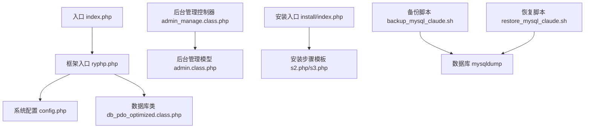
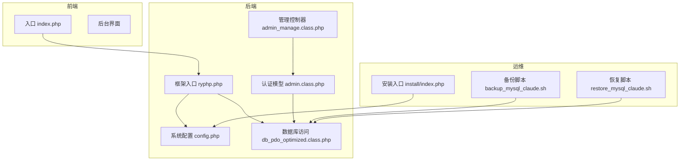
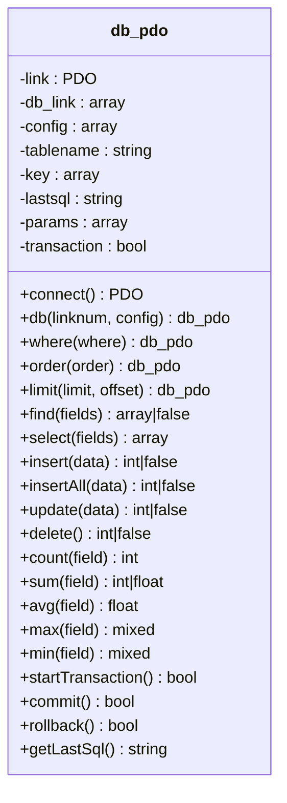
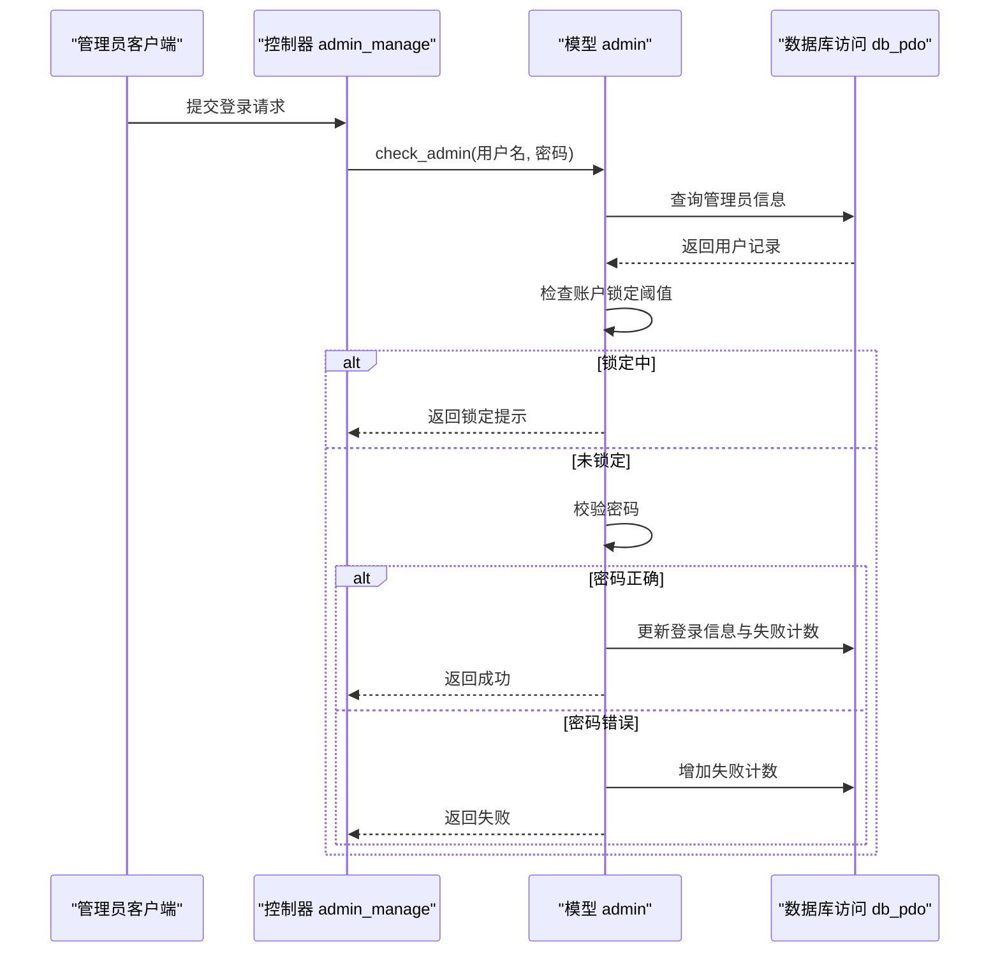
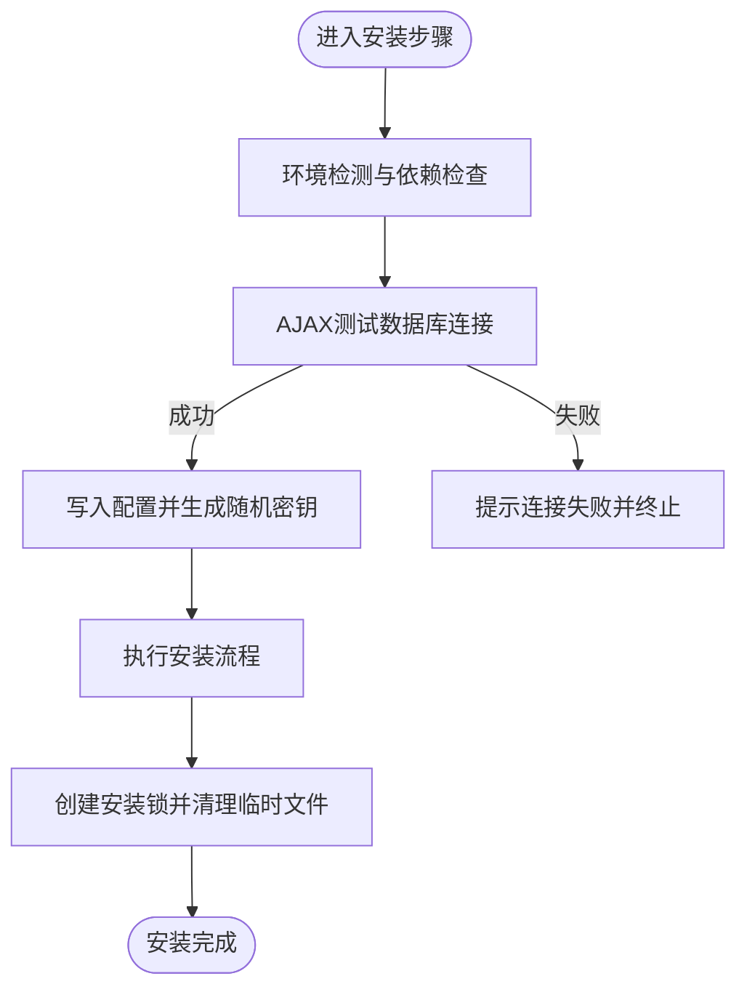
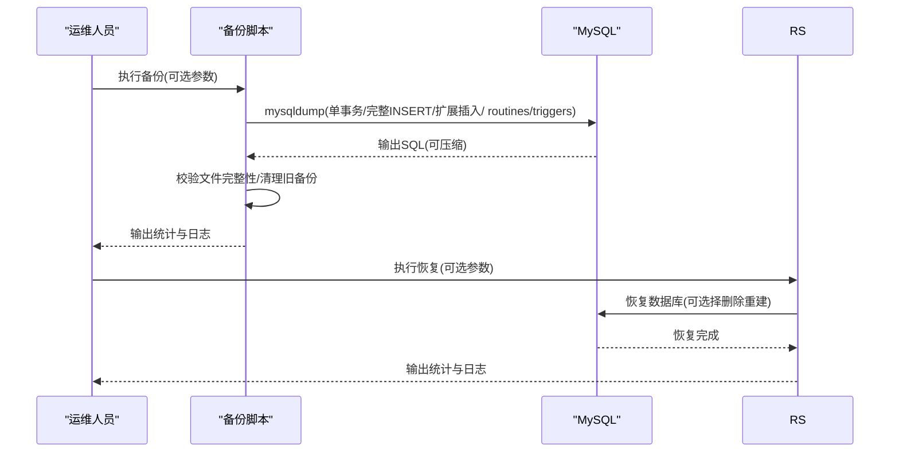
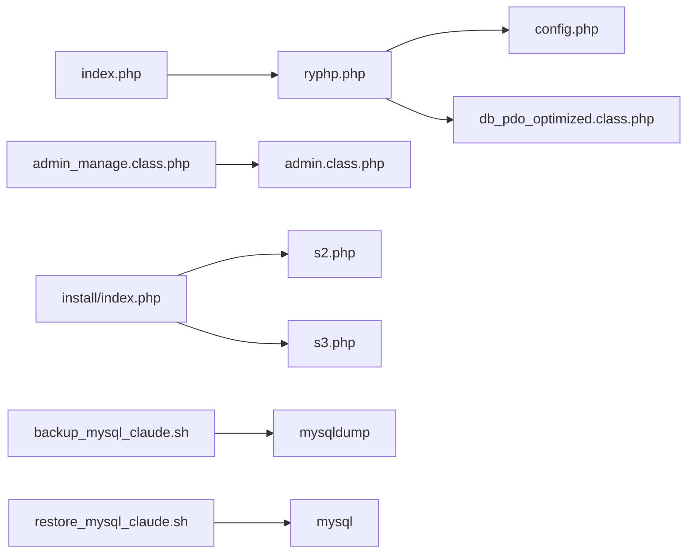

# 安全扫描与审计

<cite>
**本文引用的文件**   
- [index.php](file://index.php)
- [ryphp.php](file://ryphp/ryphp.php)
- [config.php](file://common/config/config.php)
- [db_pdo_optimized.class.php](file://ryphp/core/class/db_pdo_optimized.class.php)
- [admin.class.php](file://application/lry_admin_center/model/admin.class.php)
- [admin_manage.class.php](file://application/lry_admin_center/controller/admin_manage.class.php)
- [backup_mysql_claude.sh](file://backup_mysql_claude.sh)
- [restore_mysql_claude.sh](file://restore_mysql_claude.sh)
- [index.php](file://application/install/index.php)
- [s2.php](file://application/install/templates/s2.php)
- [s3.php](file://application/install/templates/s3.php)
- [public_edit_pwd.html](file://application/lry_admin_center/view/public_edit_pwd.html)
- [shCore.js](file://common/static/plugin/ueditor/third-party/SyntaxHighlighter/shCore.js)
- [attachment.js](file://common/static/plugin/ueditor/dialogs/attachment/attachment.js)
- [image.js](file://common/static/plugin/ueditor/dialogs/image/image.js)
- [video.js](file://common/static/plugin/ueditor/dialogs/video/video.js)
- [README.md](file://README.md)
</cite>

## 目录
1. [引言](#引言)
2. [项目结构](#项目结构)
3. [核心组件](#核心组件)
4. [架构总览](#架构总览)
5. [详细组件分析](#详细组件分析)
6. [依赖关系分析](#依赖关系分析)
7. [性能考虑](#性能考虑)
8. [故障排查指南](#故障排查指南)
9. [结论](#结论)
10. [附录](#附录)

## 引言
本指南面向LRYBlog项目的安全扫描与审计工作，围绕漏洞扫描工具（如Nessus、OpenVAS）、代码安全审计（静态分析、依赖包安全、配置文件安全）、渗透测试流程（测试计划、攻击向量、修复验证）、安全事件响应（入侵检测、事件分类、应急处置、恢复）、定期安全检查制度（月度评估、季度审计、年度审查）、以及安全日志分析与监控告警配置等方面，结合仓库现有代码与脚本，提供可操作的实践建议与可视化图示。

## 项目结构
LRYBlog采用PHP单入口与自研框架组合的结构：入口文件负责应用初始化，框架入口加载系统类与公共函数，配置文件集中管理数据库、缓存、Cookie、上传等系统参数，后台管理模块包含登录、权限与日志等功能，安装脚本提供数据库连接测试与配置写入能力，备份与恢复脚本提供数据库层面的安全保障。

**图表来源**
- [index.php:1-18](file://index.php#L1-L18)
- [ryphp.php:83-202](file://ryphp/ryphp.php#L83-L202)
- [config.php:1-88](file://common/config/config.php#L1-L88)
- [db_pdo_optimized.class.php:13-80](file://ryphp/core/class/db_pdo_optimized.class.php#L13-L80)
- [admin_manage.class.php:1-105](file://application/lry_admin_center/controller/admin_manage.class.php#L1-L105)
- [admin.class.php:1-96](file://application/lry_admin_center/model/admin.class.php#L1-L96)
- [index.php:45-275](file://application/install/index.php#L45-L275)
- [s2.php:88-135](file://application/install/templates/s2.php#L88-L135)
- [s3.php:31-217](file://application/install/templates/s3.php#L31-L217)
- [backup_mysql_claude.sh:1-392](file://backup_mysql_claude.sh#L1-L392)
- [restore_mysql_claude.sh:1-412](file://restore_mysql_claude.sh#L1-L412)

**章节来源**
- [index.php:1-18](file://index.php#L1-L18)
- [ryphp.php:83-202](file://ryphp/ryphp.php#L83-L202)
- [config.php:1-88](file://common/config/config.php#L1-L88)
- [README.md:1-6](file://README.md#L1-L6)

## 核心组件
- 应用入口与框架初始化：负责加载框架、设置时区、常量定义与应用初始化。
- 系统配置中心：集中管理数据库、缓存、Cookie、上传、队列等配置项。
- 数据库访问层：基于PDO的封装，提供安全参数绑定、事务控制与错误处理。
- 后台管理与认证：包含管理员登录校验、失败锁定策略、登录日志记录与会话管理。
- 安装与环境检测：提供数据库连接测试、目录可写性检测、配置写入与安装锁机制。
- 备份与恢复：提供数据库备份与恢复脚本，支持压缩、单事务、存储过程与触发器等选项。

**章节来源**
- [ryphp.php:83-202](file://ryphp/ryphp.php#L83-L202)
- [config.php:13-87](file://common/config/config.php#L13-L87)
- [db_pdo_optimized.class.php:87-119](file://ryphp/core/class/db_pdo_optimized.class.php#L87-L119)
- [admin.class.php:4-96](file://application/lry_admin_center/model/admin.class.php#L4-L96)
- [index.php:45-275](file://application/install/index.php#L45-L275)
- [backup_mysql_claude.sh:170-198](file://backup_mysql_claude.sh#L170-L198)
- [restore_mysql_claude.sh:210-238](file://restore_mysql_claude.sh#L210-L238)

## 架构总览
LRYBlog的安全架构围绕“配置安全、访问控制、数据保护、运维安全”四个维度展开。前端通过入口与框架加载，后端通过控制器-模型-数据库三层协作，安装与运维脚本提供数据库层面的安全保障。

**图表来源**
- [index.php:10-18](file://index.php#L10-L18)
- [ryphp.php:83-202](file://ryphp/ryphp.php#L83-L202)
- [config.php:1-88](file://common/config/config.php#L1-L88)
- [db_pdo_optimized.class.php:13-80](file://ryphp/core/class/db_pdo_optimized.class.php#L13-L80)
- [admin.class.php:1-96](file://application/lry_admin_center/model/admin.class.php#L1-L96)
- [admin_manage.class.php:1-105](file://application/lry_admin_center/controller/admin_manage.class.php#L1-L105)
- [index.php:45-275](file://application/install/index.php#L45-L275)
- [backup_mysql_claude.sh:1-392](file://backup_mysql_claude.sh#L1-L392)
- [restore_mysql_claude.sh:1-412](file://restore_mysql_claude.sh#L1-L412)

## 详细组件分析

### 数据库访问与安全
- 连接与参数：统一通过PDO构造连接，启用严格参数绑定与错误模式，避免注入风险。
- 预处理与绑定：查询构建时使用占位符与绑定数组，确保输入被正确转义。
- 事务控制：提供显式事务接口，配合回滚与提交，保证数据一致性。
- 错误处理：捕获异常并区分调试与生产环境，避免敏感信息泄露。

**图表来源**
- [db_pdo_optimized.class.php:13-767](file://ryphp/core/class/db_pdo_optimized.class.php#L13-L767)

**章节来源**
- [db_pdo_optimized.class.php:87-208](file://ryphp/core/class/db_pdo_optimized.class.php#L87-L208)
- [db_pdo_optimized.class.php:406-435](file://ryphp/core/class/db_pdo_optimized.class.php#L406-L435)
- [db_pdo_optimized.class.php:442-497](file://ryphp/core/class/db_pdo_optimized.class.php#L442-L497)
- [db_pdo_optimized.class.php:504-538](file://ryphp/core/class/db_pdo_optimized.class.php#L504-L538)
- [db_pdo_optimized.class.php:544-567](file://ryphp/core/class/db_pdo_optimized.class.php#L544-L567)
- [db_pdo_optimized.class.php:708-750](file://ryphp/core/class/db_pdo_optimized.class.php#L708-L750)

### 管理员登录与安全策略
- 登录校验：先校验用户存在性，再检查账户锁定阈值，最后验证密码。
- 失败锁定：连续失败次数达到阈值时，按阶梯规则限制登录尝试。
- 成功登录：更新登录IP、时间与失败计数，并写入会话与Cookie。
- 登录日志：记录每次登录尝试的结果与原因，便于审计。

**图表来源**
- [admin_manage.class.php:1-105](file://application/lry_admin_center/controller/admin_manage.class.php#L1-L105)
- [admin.class.php:4-96](file://application/lry_admin_center/model/admin.class.php#L4-L96)
- [db_pdo_optimized.class.php:406-435](file://ryphp/core/class/db_pdo_optimized.class.php#L406-L435)

**章节来源**
- [admin_manage.class.php:11-44](file://application/lry_admin_center/controller/admin_manage.class.php#L11-L44)
- [admin.class.php:29-96](file://application/lry_admin_center/model/admin.class.php#L29-L96)

### 安装与环境检测
- 数据库连接测试：AJAX调用安装入口进行PDO连接测试，避免明文暴露凭据。
- 目录可写性检测：对关键目录与配置文件进行可写/可读性检查，提示风险。
- 配置写入：通过正则替换写入数据库连接参数，生成随机密钥，提升安全性。

**图表来源**
- [index.php:45-275](file://application/install/index.php#L45-L275)
- [s2.php:88-135](file://application/install/templates/s2.php#L88-L135)
- [s3.php:118-129](file://application/install/templates/s3.php#L118-L129)
- [index.php:321-335](file://application/install/index.php#L321-L335)

**章节来源**
- [index.php:116-129](file://application/install/index.php#L116-L129)
- [s2.php:109-127](file://application/install/templates/s2.php#L109-L127)
- [s3.php:142-211](file://application/install/templates/s3.php#L142-L211)
- [index.php:321-335](file://application/install/index.php#L321-L335)

### 备份与恢复流程
- 备份脚本：支持单事务、完整INSERT、扩展INSERT、存储过程与触发器、压缩备份等选项；自动清理旧备份，保留最近N份。
- 恢复脚本：支持压缩与非压缩文件，自动推断数据库名，提供覆盖或删除重建选项，带进度与统计输出。

**图表来源**
- [backup_mysql_claude.sh:170-392](file://backup_mysql_claude.sh#L170-L392)
- [restore_mysql_claude.sh:210-412](file://restore_mysql_claude.sh#L210-L412)

**章节来源**
- [backup_mysql_claude.sh:170-198](file://backup_mysql_claude.sh#L170-L198)
- [backup_mysql_claude.sh:275-337](file://backup_mysql_claude.sh#L275-L337)
- [restore_mysql_claude.sh:210-238](file://restore_mysql_claude.sh#L210-L238)
- [restore_mysql_claude.sh:343-381](file://restore_mysql_claude.sh#L343-L381)

### 代码安全审计要点
- 静态代码分析：重点检查输入参数处理、SQL拼接风险、文件包含与路径遍历、XSS与CSRF防护。
- 依赖包安全：核对第三方插件与编辑器组件的版本与已知漏洞，及时更新。
- 配置文件安全：确保配置文件权限最小化，避免泄露数据库凭据与密钥；检查Cookie安全标志与上传目录权限。

**章节来源**
- [config.php:5-87](file://common/config/config.php#L5-L87)
- [shCore.js:1390-1425](file://common/static/plugin/ueditor/third-party/SyntaxHighlighter/shCore.js#L1390-L1425)
- [attachment.js:217-538](file://common/static/plugin/ueditor/dialogs/attachment/attachment.js#L217-L538)
- [image.js:440-758](file://common/static/plugin/ueditor/dialogs/image/image.js#L440-L758)
- [video.js:448-473](file://common/static/plugin/ueditor/dialogs/video/video.js#L448-L473)

## 依赖关系分析
- 入口依赖框架入口，框架入口依赖配置与公共函数；控制器依赖模型与分页类；模型依赖数据库访问层；安装入口依赖配置与模板；备份/恢复脚本依赖MySQL客户端工具。

**图表来源**
- [index.php:10-18](file://index.php#L10-L18)
- [ryphp.php:83-202](file://ryphp/ryphp.php#L83-L202)
- [config.php:1-88](file://common/config/config.php#L1-L88)
- [db_pdo_optimized.class.php:13-80](file://ryphp/core/class/db_pdo_optimized.class.php#L13-L80)
- [admin_manage.class.php:4-5](file://application/lry_admin_center/controller/admin_manage.class.php#L4-L5)
- [admin.class.php:1-2](file://application/lry_admin_center/model/admin.class.php#L1-L2)
- [index.php:45-275](file://application/install/index.php#L45-L275)
- [s2.php:88-135](file://application/install/templates/s2.php#L88-L135)
- [s3.php:31-217](file://application/install/templates/s3.php#L31-L217)
- [backup_mysql_claude.sh:1-392](file://backup_mysql_claude.sh#L1-L392)
- [restore_mysql_claude.sh:1-412](file://restore_mysql_claude.sh#L1-L412)

**章节来源**
- [ryphp.php:108-140](file://ryphp/ryphp.php#L108-L140)
- [admin_manage.class.php:4-5](file://application/lry_admin_center/controller/admin_manage.class.php#L4-L5)

## 性能考虑
- 数据库层：使用预处理与参数绑定，避免重复编译SQL；合理设置连接池与超时；事务批量写入减少往返。
- 缓存层：根据业务热点选择合适缓存类型（文件/Redis/Memcache），设置合理过期与持久化策略。
- 上传与静态资源：限制文件类型与大小，启用水印与缩略图，分离静态资源与业务逻辑。
- 安装与运维：备份脚本使用单事务与压缩，减少IO与存储占用；恢复脚本提供进度与统计，便于监控。

[本节为通用指导，无需特定文件引用]

## 故障排查指南
- 数据库连接失败：检查配置文件中的主机、端口、用户名与密码；确认MySQL服务状态与授权；使用安装入口的连接测试功能定位问题。
- 安装锁导致无法重新安装：删除缓存中的安装锁文件后重试。
- 备份/恢复失败：检查mysqldump与mysql命令可用性、配置文件权限、备份文件完整性与磁盘空间。
- 登录失败与锁定：查看登录日志与失败计数，确认是否触发锁定阈值；必要时重置失败计数或等待解锁。

**章节来源**
- [index.php:15-17](file://application/install/index.php#L15-L17)
- [backup_mysql_claude.sh:170-198](file://backup_mysql_claude.sh#L170-L198)
- [restore_mysql_claude.sh:210-238](file://restore_mysql_claude.sh#L210-L238)
- [admin.class.php:40-65](file://application/lry_admin_center/model/admin.class.php#L40-L65)

## 结论
通过对LRYBlog的入口、配置、数据库访问、后台认证、安装与运维脚本的深入分析，可以建立一套覆盖“配置安全、访问控制、数据保护、运维安全”的安全扫描与审计体系。结合定期安全检查与日志监控，能够持续降低风险并提升整体安全水平。

[本节为总结性内容，无需特定文件引用]

## 附录

### 定期安全检查制度建议
- 月度安全评估：检查配置文件权限、数据库凭据轮换、上传目录与缓存目录可写性、日志留存与轮转。
- 季度安全审计：对关键模块（认证、支付、上传）进行代码走查与依赖漏洞扫描，验证备份与恢复流程。
- 年度安全审查：组织渗透测试与红蓝对抗演练，形成整改清单与改进计划。

[本节为通用指导，无需特定文件引用]

### 渗透测试流程建议
- 测试计划：明确范围、目标、时间窗口与风险控制。
- 攻击向量：SQL注入、命令注入、文件包含、XSS、CSRF、越权访问、敏感信息泄露、暴力破解。
- 修复验证：修复后回归测试，验证修复有效性与副作用。
- 报告归档：形成测试报告与修复跟踪清单。

[本节为通用指导，无需特定文件引用]

### 安全事件响应流程建议
- 入侵检测：日志监控、异常告警、行为基线。
- 事件分类：严重、高危、中危、低危分级。
- 应急处置：隔离、取证、阻断、修复、复盘。
- 恢复措施：数据恢复、系统加固、流程完善。

[本节为通用指导，无需特定文件引用]

### 安全日志分析与监控告警配置
- 日志采集：Web服务器、应用日志、数据库慢查询与错误日志、系统安全日志。
- 分析维度：登录失败、异常请求、文件上传、数据库变更、配置修改。
- 告警策略：阈值告警、趋势告警、异常行为告警，联动通知与自动化处置。

[本节为通用指导，无需特定文件引用]