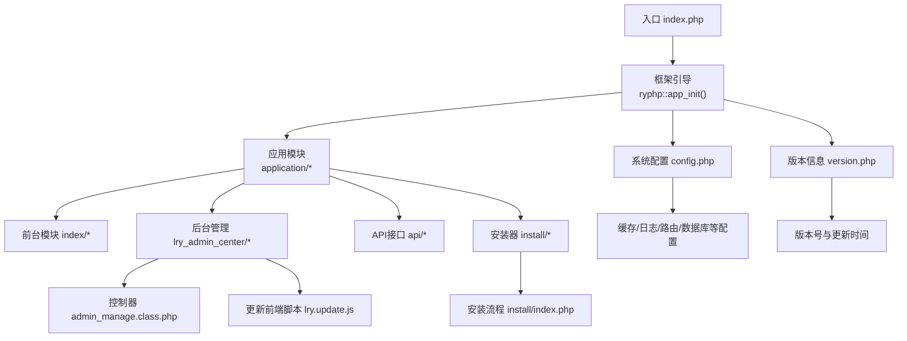
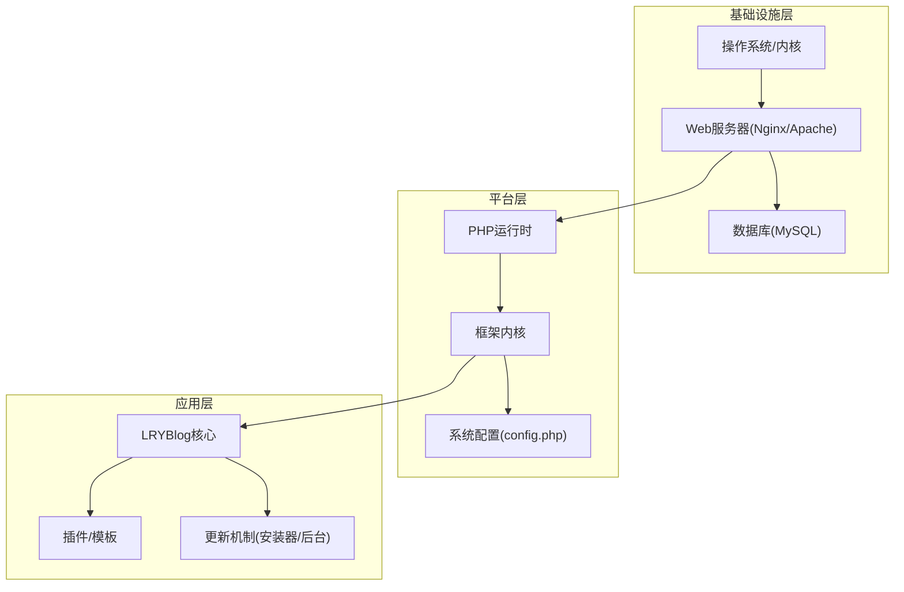
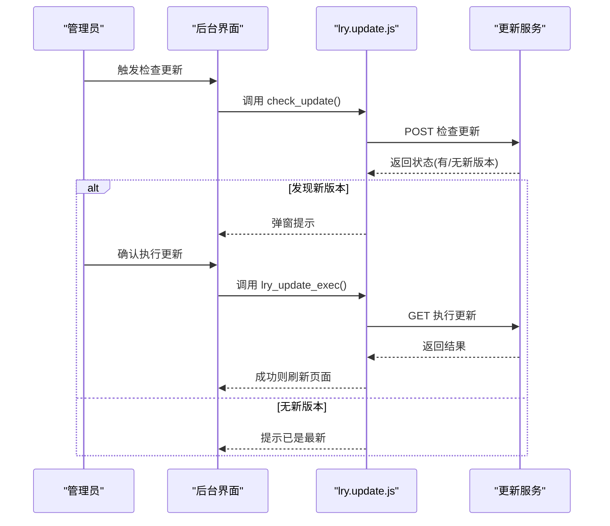
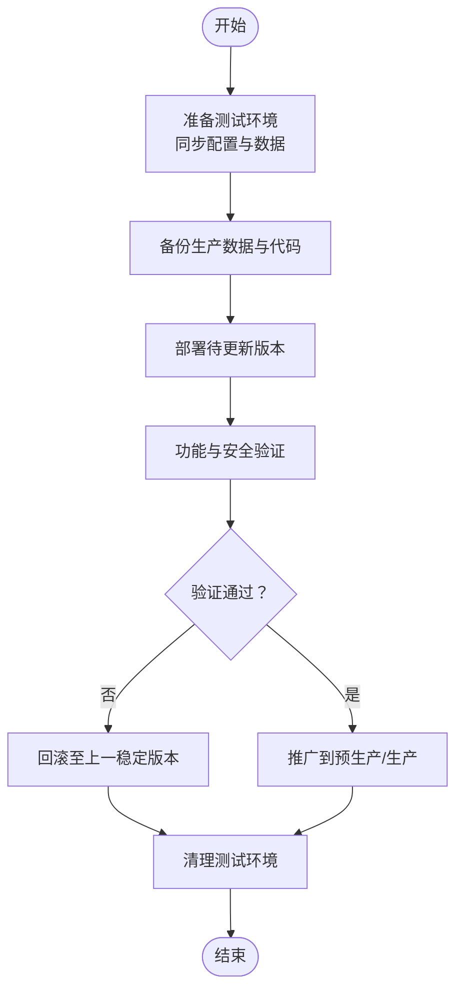
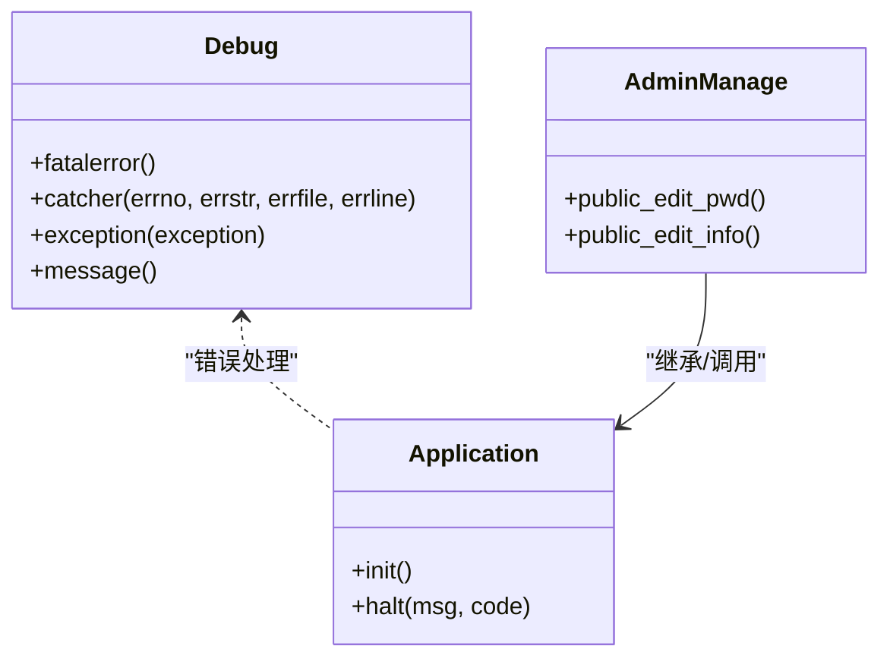
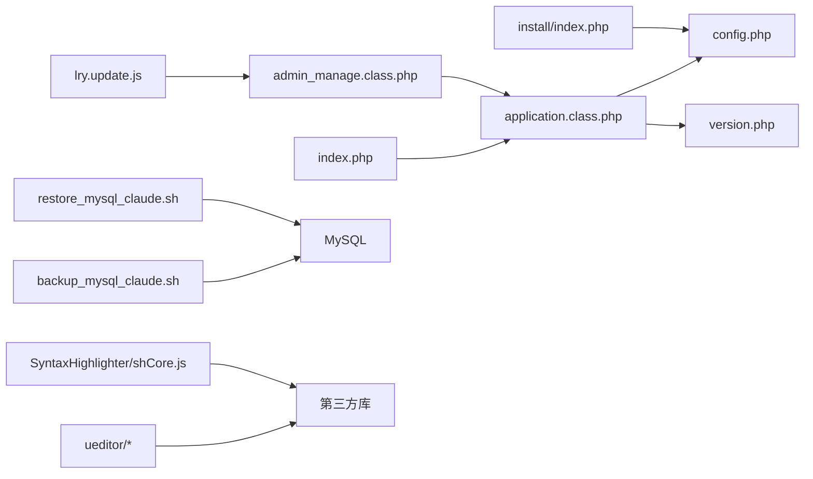

# 安全更新策略

<cite>
**本文引用的文件**   
- [README.md](file://README.md)
- [DNS_FIX.md](file://DNS_FIX.md)
- [index.php](file://index.php)
- [common/config/config.php](file://common/config/config.php)
- [common/data/version.php](file://common/data/version.php)
- [ryphp/core/class/application.class.php](file://ryphp/core/class/application.class.php)
- [ryphp/core/class/debug.class.php](file://ryphp/core/class/debug.class.php)
- [application/install/index.php](file://application/install/index.php)
- [application/lry_admin_center/controller/admin_manage.class.php](file://application/lry_admin_center/controller/admin_manage.class.php)
- [common/function/system.func.php](file://common/function/system.func.php)
- [common/static/plugin/ueditor/dialogs/wordimage/tangram.js](file://common/static/plugin/ueditor/dialogs/wordimage/tangram.js)
- [common/static/plugin/PIE_IE678.js](file://common/static/plugin/PIE_IE678.js)
- [common/static/plugin/ueditor/third-party/SyntaxHighlighter/shCore.js](file://common/static/plugin/ueditor/third-party/SyntaxHighlighter/shCore.js)
- [common/static/lry_admin_center/lry_admin/js/lry.update.js](file://common/static/lry_admin_center/lry_admin/js/lry.update.js)
- [backup_mysql_claude.sh](file://backup_mysql_claude.sh)
- [restore_mysql_claude.sh](file://restore_mysql_claude.sh)
</cite>

## 目录
1. [引言](#引言)
2. [项目结构](#项目结构)
3. [核心组件](#核心组件)
4. [架构总览](#架构总览)
5. [详细组件分析](#详细组件分析)
6. [依赖关系分析](#依赖关系分析)
7. [性能考量](#性能考量)
8. [故障排查指南](#故障排查指南)
9. [结论](#结论)
10. [附录](#附录)

## 引言
本指南面向LRYBlog系统的安全更新与运维管理，围绕系统更新流程、应用安全更新、安全公告跟踪、测试与回滚、紧急响应、更新审计等方面，结合仓库现有代码与脚本，给出可落地的策略与流程。文档同时强调可追溯性与最小化风险原则，确保每次更新可控、可验证、可回退。

## 项目结构
LRYBlog采用典型的PHP MVC结构，核心入口位于根目录，框架内核位于ryphp目录，应用层分为前台与后台管理模块，公共资源与插件位于common/static目录，安装与更新逻辑在安装器与后台管理控制器中体现，数据库备份与恢复由独立Shell脚本提供。

图表来源
- [index.php:1-18](file://index.php#L1-L18)
- [ryphp/core/class/application.class.php:1-118](file://ryphp/core/class/application.class.php#L1-L118)
- [common/config/config.php:1-88](file://common/config/config.php#L1-L88)
- [common/data/version.php:1-4](file://common/data/version.php#L1-L4)
- [application/lry_admin_center/controller/admin_manage.class.php:1-105](file://application/lry_admin_center/controller/admin_manage.class.php#L1-L105)
- [common/static/lry_admin_center/lry_admin/js/lry.update.js:1-85](file://common/static/lry_admin_center/lry_admin/js/lry.update.js#L1-L85)
- [application/install/index.php:1-373](file://application/install/index.php#L1-L373)

章节来源
- [index.php:1-18](file://index.php#L1-L18)
- [README.md:1-6](file://README.md#L1-L6)

## 核心组件
- 应用入口与引导
  - 入口文件负责常量定义、根路径与框架引导，确保后续模块加载与路由生效。
  - 关键点：调试开关、URL模式、框架初始化。
- 系统配置中心
  - 配置文件涵盖数据库、缓存、Cookie、路由、上传、语言、队列等，直接影响安全基线与运行行为。
- 版本与更新标识
  - 版本信息文件包含版本号与更新日期，用于系统更新状态识别与审计。
- 安装与更新流程
  - 安装器提供环境检测、数据库连接测试、SQL导入与配置写入；后台提供在线更新检查与执行。
- 错误与调试
  - 调试类负责致命错误捕获、异常处理与错误日志写入，保障问题可追踪。
- 数据库备份与恢复
  - 提供完整的备份与恢复脚本，支持压缩、校验、清理与日志记录，确保更新前后数据安全。

章节来源
- [index.php:10-18](file://index.php#L10-L18)
- [common/config/config.php:1-88](file://common/config/config.php#L1-L88)
- [common/data/version.php:1-4](file://common/data/version.php#L1-L4)
- [application/install/index.php:1-373](file://application/install/index.php#L1-L373)
- [ryphp/core/class/debug.class.php:1-147](file://ryphp/core/class/debug.class.php#L1-L147)
- [backup_mysql_claude.sh:1-392](file://backup_mysql_claude.sh#L1-L392)
- [restore_mysql_claude.sh:1-412](file://restore_mysql_claude.sh#L1-L412)

## 架构总览
系统更新涉及三层：基础设施层（操作系统、Web服务器、数据库）、平台层（PHP版本、框架与配置）、应用层（LRYBlog核心、插件、模板）。更新策略应遵循“最小变更、可回退、可验证”的原则，并在测试环境先行验证。

图表来源
- [common/config/config.php:1-88](file://common/config/config.php#L1-L88)
- [application/install/index.php:1-373](file://application/install/index.php#L1-L373)
- [common/static/lry_admin_center/lry_admin/js/lry.update.js:1-85](file://common/static/lry_admin_center/lry_admin/js/lry.update.js#L1-L85)

## 详细组件分析

### 系统更新流程（操作系统、PHP、Web服务器）
- 操作系统与Web服务器
  - 建议通过包管理器进行补丁管理，优先启用自动安全更新通道；对Nginx/Apache进行最小化配置，关闭不必要的模块与服务。
  - DNS解析问题可通过公共DNS替换解决，避免自定义不可达DNS导致的部署失败。
- PHP版本升级
  - 升级前在测试环境验证兼容性，关注扩展依赖（PDO、GD、cURL等）与语法差异。
  - 升级后执行安装器的环境检测流程，确保数据库扩展、会话、上传、CURL等均处于可用状态。
- Web服务器更新
  - 更新TLS证书与加密套件，启用HTTP/2与安全头；限制请求大小与超时，防止资源滥用。

章节来源
- [DNS_FIX.md:1-37](file://DNS_FIX.md#L1-L37)
- [application/install/index.php:51-114](file://application/install/index.php#L51-L114)

### 应用程序安全更新（LRYBlog核心、插件、模板）
- 核心更新
  - 通过后台更新脚本发起检查与执行，若发现新版本弹窗提示并支持忽略升级；执行后刷新页面完成更新。
  - 更新前务必备份数据库与文件，更新后验证登录、路由、模板渲染与插件功能。
- 插件与模板
  - 插件与模板属于第三方扩展，更新前应核对版本兼容性与变更日志；建议在测试环境先安装并进行功能回归。
  - 对于富文本编辑器等前端插件，注意其依赖的第三方库版本与安全补丁。

图表来源
- [common/static/lry_admin_center/lry_admin/js/lry.update.js:8-85](file://common/static/lry_admin_center/lry_admin/js/lry.update.js#L8-L85)

章节来源
- [common/static/lry_admin_center/lry_admin/js/lry.update.js:1-85](file://common/static/lry_admin_center/lry_admin/js/lry.update.js#L1-L85)

### 安全公告跟踪（CVE、威胁情报、风险评估）
- CVE与漏洞跟踪
  - 建立固定渠道订阅PHP、Web服务器、数据库与常用扩展的官方安全通告；对影响范围进行评估与优先级分级。
- 威胁情报收集
  - 结合开源威胁情报源与内部日志，识别针对LRYBlog的攻击特征（如特定UA、扫描路径、注入尝试）。
- 风险评估
  - 基于漏洞严重性与业务影响，制定修复优先级与时间窗口；对高危漏洞采取临时加固与短期修复并行。

（本节为通用实践说明，不直接分析具体文件）

### 测试环境与回滚预案
- 测试环境搭建
  - 使用与生产一致的镜像或容器，同步安装器环境检测项与配置；确保数据库、缓存、上传目录具备相同权限。
- 更新验证
  - 功能验证：登录、文章发布、模板渲染、插件加载；安全验证：错误日志、敏感信息脱敏、访问控制。
- 回滚预案
  - 保留最近N个备份集，明确回滚步骤与数据一致性检查；回滚后验证系统可用性与数据完整性。

图表来源
- [backup_mysql_claude.sh:267-337](file://backup_mysql_claude.sh#L267-L337)
- [restore_mysql_claude.sh:353-381](file://restore_mysql_claude.sh#L353-L381)

章节来源
- [backup_mysql_claude.sh:1-392](file://backup_mysql_claude.sh#L1-L392)
- [restore_mysql_claude.sh:1-412](file://restore_mysql_claude.sh#L1-L412)

### 紧急安全更新（零日漏洞响应）
- 临时修复
  - 通过Web服务器规则限制可疑请求、禁用危险函数、调整文件权限与上传白名单；在入口层增加WAF规则或CDN防护。
- 长期方案
  - 评估漏洞影响范围，准备官方补丁或替代方案；在测试环境验证后快速上线；更新安全基线与巡检清单。
- 事件记录
  - 记录事件时间、影响范围、处置步骤与恢复验证，形成知识库。

（本节为通用实践说明，不直接分析具体文件）

### 更新记录与审计跟踪
- 版本与更新标识
  - 通过版本文件记录当前版本与更新日期，便于审计与追踪。
- 错误日志与调试
  - 调试类在非调试模式下将错误写入日志，便于定位问题；生产环境建议开启错误日志保存并定期归档。
- 管理员操作审计
  - 管理员密码修改等敏感操作可记录到日志表，便于事后审计。

图表来源
- [ryphp/core/class/debug.class.php:1-147](file://ryphp/core/class/debug.class.php#L1-L147)
- [ryphp/core/class/application.class.php:1-118](file://ryphp/core/class/application.class.php#L1-L118)
- [application/lry_admin_center/controller/admin_manage.class.php:1-105](file://application/lry_admin_center/controller/admin_manage.class.php#L1-L105)

章节来源
- [common/data/version.php:1-4](file://common/data/version.php#L1-L4)
- [ryphp/core/class/debug.class.php:1-147](file://ryphp/core/class/debug.class.php#L1-L147)
- [application/lry_admin_center/controller/admin_manage.class.php:70-104](file://application/lry_admin_center/controller/admin_manage.class.php#L70-L104)

## 依赖关系分析
- 入口依赖框架引导，框架再加载模块与控制器；配置文件贯穿全局，决定缓存、数据库、路由等行为。
- 安装器与后台更新脚本分别承担首次部署与后续升级；数据库备份/恢复脚本提供数据保护。
- 第三方插件（如UEditor、SyntaxHighlighter等）引入外部依赖，需纳入安全基线与更新计划。

图表来源
- [index.php:10-18](file://index.php#L10-L18)
- [ryphp/core/class/application.class.php:1-118](file://ryphp/core/class/application.class.php#L1-L118)
- [common/config/config.php:1-88](file://common/config/config.php#L1-L88)
- [common/data/version.php:1-4](file://common/data/version.php#L1-L4)
- [application/install/index.php:1-373](file://application/install/index.php#L1-L373)
- [application/lry_admin_center/controller/admin_manage.class.php:1-105](file://application/lry_admin_center/controller/admin_manage.class.php#L1-L105)
- [common/static/lry_admin_center/lry_admin/js/lry.update.js:1-85](file://common/static/lry_admin_center/lry_admin/js/lry.update.js#L1-L85)
- [backup_mysql_claude.sh:1-392](file://backup_mysql_claude.sh#L1-L392)
- [restore_mysql_claude.sh:1-412](file://restore_mysql_claude.sh#L1-L412)
- [common/static/plugin/ueditor/dialogs/wordimage/tangram.js:1065-1084](file://common/static/plugin/ueditor/dialogs/wordimage/tangram.js#L1065-L1084)
- [common/static/plugin/PIE_IE678.js:59-60](file://common/static/plugin/PIE_IE678.js#L59-L60)
- [common/static/plugin/ueditor/third-party/SyntaxHighlighter/shCore.js:2618-3115](file://common/static/plugin/ueditor/third-party/SyntaxHighlighter/shCore.js#L2618-L3115)

章节来源
- [common/function/system.func.php:1-969](file://common/function/system.func.php#L1-L969)

## 性能考量
- 更新期间尽量避开业务高峰期，采用灰度发布与蓝绿部署策略。
- 对数据库操作进行批处理与事务控制，减少锁竞争；对大文件上传与导出任务进行限速与队列化。
- 启用缓存与静态资源压缩，降低更新对用户体验的影响。

（本节为通用指导，不直接分析具体文件）

## 故障排查指南
- 安装器常见问题
  - 数据库连接失败：检查主机、端口、账号与字符集；确认PDO或MySQLi扩展可用。
  - 伪静态/重写模块未开启：根据安装器提示检查服务器配置。
- 更新失败
  - 检查更新脚本返回状态与错误提示；必要时忽略本次更新并稍后重试。
- 数据库异常
  - 使用备份脚本验证备份文件完整性；通过恢复脚本进行回滚或修复。
- 日志与调试
  - 生产环境开启错误日志保存；利用调试类输出的调试信息定位问题。

章节来源
- [application/install/index.php:116-275](file://application/install/index.php#L116-L275)
- [common/static/lry_admin_center/lry_admin/js/lry.update.js:30-37](file://common/static/lry_admin_center/lry_admin/js/lry.update.js#L30-L37)
- [backup_mysql_claude.sh:313-336](file://backup_mysql_claude.sh#L313-L336)
- [restore_mysql_claude.sh:357-381](file://restore_mysql_claude.sh#L357-L381)
- [ryphp/core/class/debug.class.php:56-112](file://ryphp/core/class/debug.class.php#L56-L112)

## 结论
通过将操作系统、PHP与Web服务器的补丁管理与LRYBlog核心、插件、模板的更新流程相结合，配合完善的测试与回滚机制、安全公告跟踪与审计记录，可显著降低安全风险并提升系统的可维护性与可靠性。建议将上述流程固化为标准作业程序（SOP），并定期演练以确保团队熟练掌握。

## 附录
- 安全基线建议
  - 强密码策略与多因素认证；最小权限原则；定期轮换密钥与令牌。
  - 限制文件上传类型与大小，启用水印与病毒扫描；对富文本内容进行XSS过滤。
- 常用工具与脚本
  - 备份与恢复脚本提供自动化与可验证的数据保护能力，建议纳入CI/CD流水线。