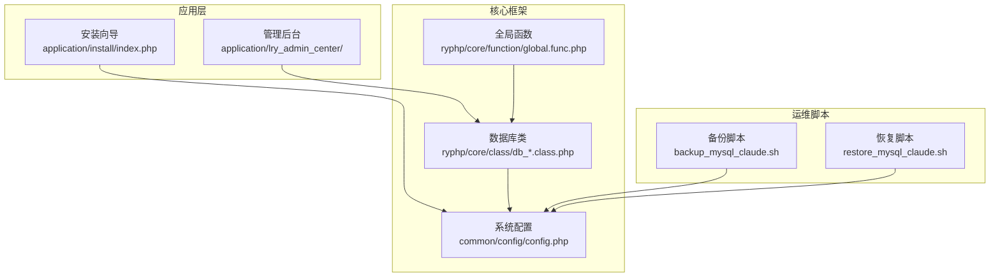
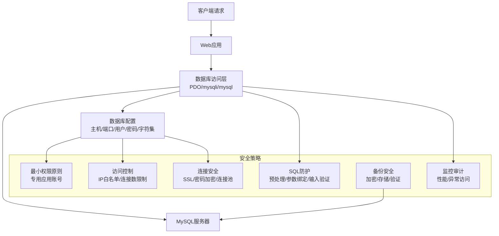
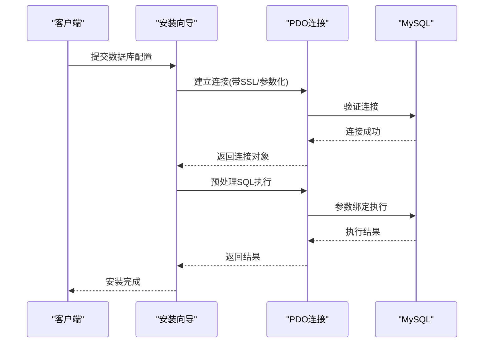
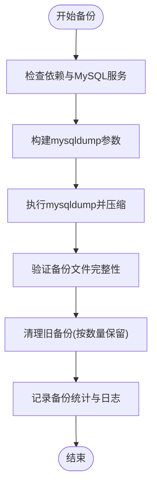
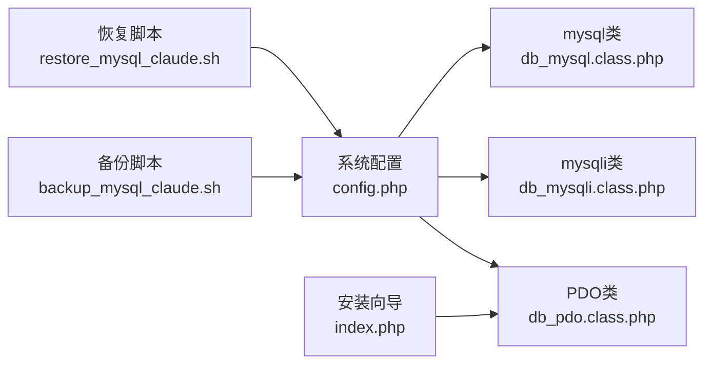

# 数据库安全

<cite>
**本文档引用的文件**
- [config.php](file://common/config/config.php)
- [db_pdo.class.php](file://ryphp/core/class/db_pdo.class.php)
- [db_mysqli.class.php](file://ryphp/core/class/db_mysqli.class.php)
- [db_mysql.class.php](file://ryphp/core/class/db_mysql.class.php)
- [backup_mysql_claude.sh](file://backup_mysql_claude.sh)
- [restore_mysql_claude.sh](file://restore_mysql_claude.sh)
- [global.func.php](file://ryphp/core/function/global.func.php)
- [common.class.php](file://application/lry_admin_center/controller/common.class.php)
- [index.php](file://application/install/index.php)
- [s3.php](file://application/install/templates/s3.php)
</cite>

## 目录
1. [简介](#简介)
2. [项目结构](#项目结构)
3. [核心组件](#核心组件)
4. [架构总览](#架构总览)
5. [详细组件分析](#详细组件分析)
6. [依赖关系分析](#依赖关系分析)
7. [性能考虑](#性能考虑)
8. [故障排除指南](#故障排除指南)
9. [结论](#结论)

## 简介
本指南面向LRYBlog项目的数据库安全配置，围绕数据库用户权限管理、访问控制、连接安全、SQL注入防护、备份安全以及性能监控与异常访问检测等方面，提供可操作的安全加固建议。文档基于仓库中现有的配置文件与数据库访问实现进行分析，并结合最佳实践给出落地建议。

## 项目结构
LRYBlog采用模块化的PHP框架结构，数据库访问通过统一的ORM封装类实现，配置集中于系统配置文件，安装流程包含数据库连接测试与初始化逻辑。整体结构有利于在统一入口处实施安全策略。

**图表来源**
- [config.php:13-21](file://common/config/config.php#L13-L21)
- [db_pdo.class.php:32-42](file://ryphp/core/class/db_pdo.class.php#L32-L42)
- [backup_mysql_claude.sh:30-36](file://backup_mysql_claude.sh#L30-L36)
- [restore_mysql_claude.sh:35-38](file://restore_mysql_claude.sh#L35-L38)

**章节来源**
- [config.php:1-88](file://common/config/config.php#L1-L88)
- [db_pdo.class.php:10-646](file://ryphp/core/class/db_pdo.class.php#L10-L646)

## 核心组件
- 数据库配置中心：系统数据库配置位于配置文件，包含主机、端口、用户名、密码、字符集、表前缀等关键参数。
- 数据库访问层：提供PDO、mysqli、mysql三种数据库访问类，统一封装查询、事务、错误处理等能力。
- 安装与连接测试：安装向导提供数据库连接测试与初始化流程，确保部署阶段的连通性与权限正确性。
- 运维脚本：提供备份与恢复脚本，包含压缩、日志、验证与清理策略。

**章节来源**
- [config.php:13-21](file://common/config/config.php#L13-L21)
- [db_pdo.class.php:10-646](file://ryphp/core/class/db_pdo.class.php#L10-L646)
- [index.php:117-129](file://application/install/index.php#L117-L129)

## 架构总览
数据库安全架构以“最小权限+强约束+可审计”为核心，通过配置层、访问层、运维层协同实现：

**图表来源**
- [config.php:13-21](file://common/config/config.php#L13-L21)
- [db_pdo.class.php:18-24](file://ryphp/core/class/db_pdo.class.php#L18-L24)
- [backup_mysql_claude.sh:30-36](file://backup_mysql_claude.sh#L30-L36)

## 详细组件分析

### 数据库用户权限管理
- 现状分析
  - 应用配置使用root用户直连数据库，缺乏最小权限隔离。
  - 安装流程直接使用提供的凭据进行连接测试与初始化。
- 安全建议
  - 回收root用户在应用侧的高危权限，创建专用应用数据库用户，仅授予必要权限（如SELECT、INSERT、UPDATE、DELETE、CREATE、INDEX、ALTER等）。
  - 为不同环境（开发、测试、生产）分别配置独立的应用用户与数据库实例，避免跨环境混淆。
  - 定期轮换应用用户密码，限制密码复杂度与有效期。
- 实施要点
  - 在配置文件中替换应用用户与密码，确保与MySQL用户权限一致。
  - 安装向导与运维脚本均应使用受限用户进行连接测试与执行。

**章节来源**
- [config.php:17-18](file://common/config/config.php#L17-L18)
- [index.php:117-129](file://application/install/index.php#L117-L129)

### 数据库访问控制配置
- IP白名单与网络访问限制
  - 在MySQL层面配置主机访问控制，仅允许应用服务器IP访问数据库端口。
  - 使用防火墙策略限制数据库端口（默认3306）对外暴露范围。
- 连接数控制
  - 通过MySQL参数限制最大连接数与并发会话数，避免资源耗尽。
  - 在应用侧合理配置连接池大小，避免过度连接。
- 管理后台IP限制
  - 利用现有后台IP限制机制，对禁止访问的IP进行拦截，降低管理面风险。

**章节来源**
- [common.class.php:86-93](file://application/lry_admin_center/controller/common.class.php#L86-L93)

### 数据库连接安全
- SSL连接配置
  - 在PDO连接参数中启用SSL/TLS，要求服务器端具备有效证书。
  - 对于外网访问，务必启用SSL；内网也建议启用以提升安全性。
- 密码加密存储
  - 应用配置中的密码建议使用加密存储或外部密钥管理服务，避免明文存储。
  - 运维脚本使用的配置文件应严格控制权限（如600），防止泄露。
- 连接池安全设置
  - 合理设置连接超时与空闲回收，避免僵尸连接占用资源。
  - 在高并发场景下，使用连接池并配合限流策略。

**章节来源**
- [db_pdo.class.php:18-24](file://ryphp/core/class/db_pdo.class.php#L18-L24)
- [backup_mysql_claude.sh:188-192](file://backup_mysql_claude.sh#L188-L192)

### SQL注入防护措施
- 预处理语句与参数绑定
  - PDO类已启用禁用模拟预处理（ATTR_EMULATE_PREPARES=false），确保参数绑定生效。
  - mysqli类通过原生接口执行预处理语句，避免字符串拼接。
- 输入验证与过滤
  - 在业务层对用户输入进行白名单校验与长度限制，减少恶意输入进入数据库层。
  - 对特殊字符进行HTML实体转义与反斜杠转义，降低注入风险。
- 安装阶段的参数化
  - 安装向导使用PDO预处理执行SQL，避免直接拼接用户输入。

**图表来源**
- [index.php:117-129](file://application/install/index.php#L117-L129)
- [db_pdo.class.php:100-124](file://ryphp/core/class/db_pdo.class.php#L100-L124)

**章节来源**
- [db_pdo.class.php:18-24](file://ryphp/core/class/db_pdo.class.php#L18-L24)
- [db_mysqli.class.php:134-150](file://ryphp/core/class/db_mysqli.class.php#L134-L150)
- [index.php:117-129](file://application/install/index.php#L117-L129)

### 数据库备份安全
- 备份文件加密与存储
  - 备份脚本支持压缩，建议在存储端进一步加密敏感备份文件。
  - 将备份文件存储在受控的物理或云存储位置，限制访问权限。
- 备份验证
  - 恢复脚本在导入前进行压缩包完整性校验与SQL内容基本验证。
  - 建议在备份完成后执行一次小规模恢复演练，确保可恢复性。
- 备份清理与保留
  - 按数量保留最近N个备份集，定期清理过期备份，避免磁盘占用。

**图表来源**
- [backup_mysql_claude.sh:170-198](file://backup_mysql_claude.sh#L170-L198)
- [backup_mysql_claude.sh:287-337](file://backup_mysql_claude.sh#L287-L337)
- [backup_mysql_claude.sh:339-376](file://backup_mysql_claude.sh#L339-L376)

**章节来源**
- [backup_mysql_claude.sh:1-392](file://backup_mysql_claude.sh#L1-L392)
- [restore_mysql_claude.sh:1-412](file://restore_mysql_claude.sh#L1-L412)

### 数据库性能监控与异常访问检测
- 性能监控
  - 通过数据库慢查询日志、连接数、缓冲池命中率等指标评估性能瓶颈。
  - 在应用层记录SQL执行时间与错误日志，辅助定位问题。
- 异常访问检测
  - 结合管理后台的IP限制与登录尝试日志，识别异常访问行为。
  - 对频繁失败的登录尝试与异常时间段访问进行告警。

**章节来源**
- [db_pdo.class.php:114-124](file://ryphp/core/class/db_pdo.class.php#L114-L124)
- [common.class.php:69-82](file://application/lry_admin_center/controller/common.class.php#L69-L82)

## 依赖关系分析
数据库访问层依赖系统配置，安装向导依赖PDO连接，运维脚本依赖MySQL客户端工具与配置文件。

**图表来源**
- [config.php:13-21](file://common/config/config.php#L13-L21)
- [db_pdo.class.php:26-31](file://ryphp/core/class/db_pdo.class.php#L26-L31)
- [index.php:117-129](file://application/install/index.php#L117-L129)
- [backup_mysql_claude.sh:30-36](file://backup_mysql_claude.sh#L30-L36)
- [restore_mysql_claude.sh:35-38](file://restore_mysql_claude.sh#L35-L38)

**章节来源**
- [config.php:13-21](file://common/config/config.php#L13-L21)
- [db_pdo.class.php:26-31](file://ryphp/core/class/db_pdo.class.php#L26-L31)
- [index.php:117-129](file://application/install/index.php#L117-L129)

## 性能考虑
- 连接池与超时：合理设置连接池大小与超时时间，避免连接泄漏与资源争用。
- 查询优化：使用索引、限制返回字段、避免N+1查询，结合慢查询日志定位热点SQL。
- 缓存策略：利用系统缓存配置降低数据库压力，注意缓存失效与一致性。
- 备份窗口：在低峰时段执行备份与恢复，避免对线上业务造成影响。

## 故障排除指南
- 连接失败
  - 检查配置文件中的主机、端口、用户名、密码是否正确。
  - 确认MySQL服务状态与防火墙策略，验证SSL配置。
- 备份/恢复异常
  - 检查备份脚本的日志输出与错误信息，确认mysqldump与mysql命令可用。
  - 对压缩包进行完整性校验，必要时重新执行备份。
- 安装向导失败
  - 使用安装向导的连接测试功能，确认凭据与网络可达性。
  - 关注PDO异常信息，核对数据库字符集与权限。

**章节来源**
- [backup_mysql_claude.sh:170-198](file://backup_mysql_claude.sh#L170-L198)
- [restore_mysql_claude.sh:210-238](file://restore_mysql_claude.sh#L210-L238)
- [index.php:117-129](file://application/install/index.php#L117-L129)

## 结论
通过对LRYBlog数据库安全的系统化梳理，建议优先落实最小权限原则、加强访问控制与连接安全、完善SQL防护与备份安全，并建立性能监控与异常访问检测机制。上述措施可在不改变现有架构的前提下，显著提升系统的整体安全性与稳定性。