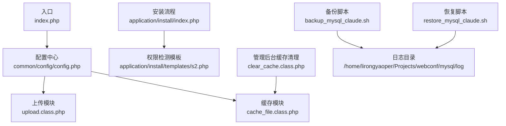
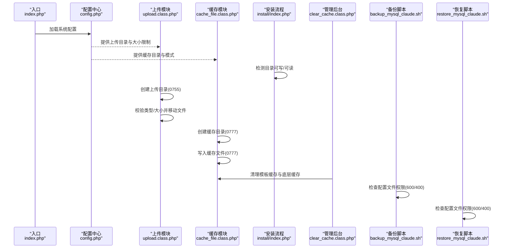
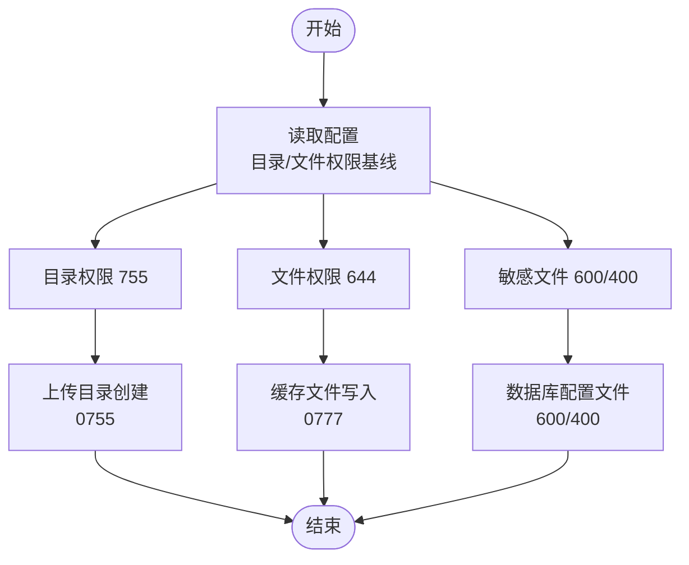
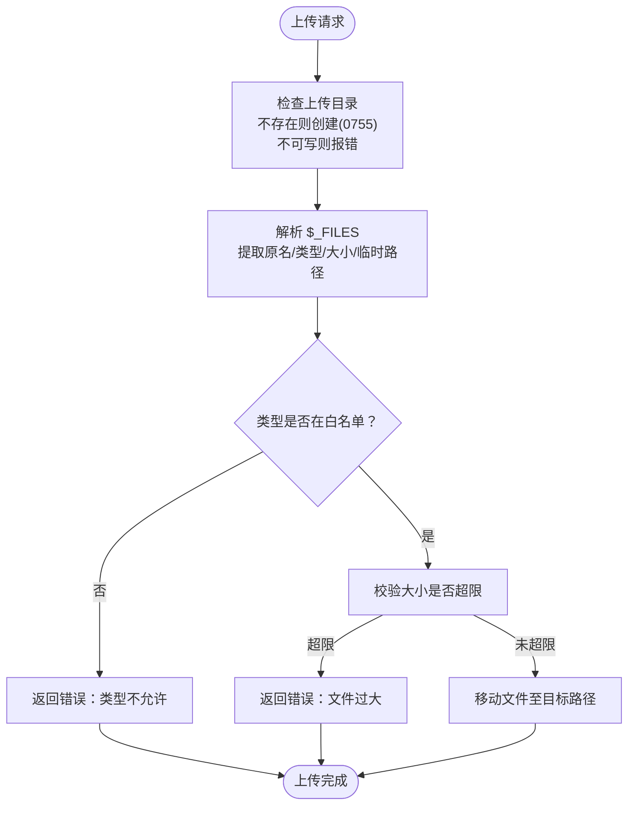
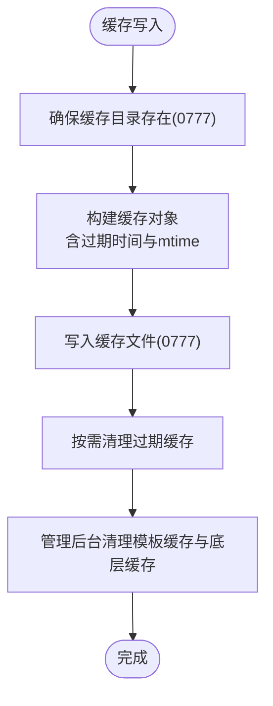
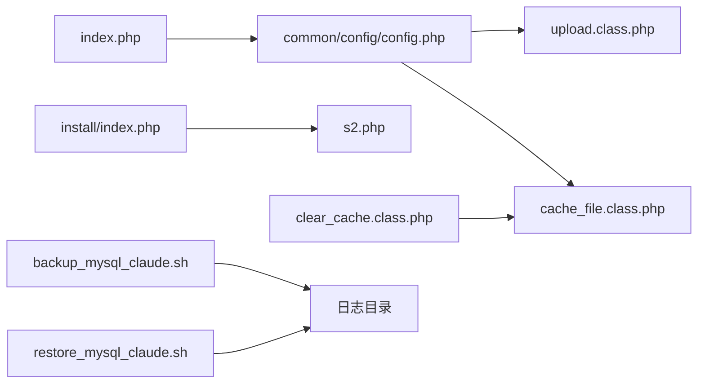

# 文件权限管理

<cite>
**本文引用的文件**
- [index.php](file://index.php)
- [common/config/config.php](file://common/config/config.php)
- [application/install/index.php](file://application/install/index.php)
- [application/install/templates/s2.php](file://application/install/templates/s2.php)
- [application/lry_admin_center/controller/clear_cache.class.php](file://application/lry_admin_center/controller/clear_cache.class.php)
- [ryphp/core/class/upload.class.php](file://ryphp/core/class/upload.class.php)
- [ryphp/core/class/cache_file.class.php](file://ryphp/core/class/cache_file.class.php)
- [backup_mysql_claude.sh](file://backup_mysql_claude.sh)
- [restore_mysql_claude.sh](file://restore_mysql_claude.sh)
</cite>

## 目录
1. [简介](#简介)
2. [项目结构](#项目结构)
3. [核心组件](#核心组件)
4. [架构总览](#架构总览)
5. [详细组件分析](#详细组件分析)
6. [依赖关系分析](#依赖关系分析)
7. [性能考量](#性能考量)
8. [故障排查指南](#故障排查指南)
9. [结论](#结论)
10. [附录](#附录)

## 简介
本指南面向 LRYBlog 的运维与开发人员，围绕 Linux 文件系统权限管理提供一套可落地的配置与实践方案。内容涵盖：
- 目录与文件标准权限（目录 755、文件 644），以及敏感文件（配置、日志、临时文件）的保护策略
- 上传文件安全检查（类型校验、大小限制、目录权限控制）
- Web 根目录权限配置（禁止执行、目录遍历防护）
- 缓存文件安全管理（缓存目录权限与过期清理）
- 文件权限监控与异常检测方法

## 项目结构
LRYBlog 的权限相关要点分布于以下区域：
- 应用入口与常量定义：入口文件负责应用初始化，涉及根路径与调试开关等
- 配置中心：系统配置集中于配置文件，包含数据库、缓存、上传等关键路径与行为
- 安装流程：安装阶段对目录可写性与可读性进行检测
- 上传模块：统一的文件上传类，负责类型、大小、目录创建与移动
- 缓存模块：文件型缓存的生成、写入与过期判断
- 管理后台：缓存清理控制器，负责清理模板缓存与底层缓存
- 备份与恢复脚本：数据库备份与恢复脚本，包含配置文件权限检查与日志记录

**图示来源**
- [index.php:1-18](file://index.php#L1-L18)
- [common/config/config.php:1-88](file://common/config/config.php#L1-L88)
- [ryphp/core/class/upload.class.php:1-241](file://ryphp/core/class/upload.class.php#L1-L241)
- [ryphp/core/class/cache_file.class.php:1-130](file://ryphp/core/class/cache_file.class.php#L1-L130)
- [application/install/index.php:1-200](file://application/install/index.php#L1-L200)
- [application/install/templates/s2.php:80-135](file://application/install/templates/s2.php#L80-L135)
- [application/lry_admin_center/controller/clear_cache.class.php:1-25](file://application/lry_admin_center/controller/clear_cache.class.php#L1-L25)
- [backup_mysql_claude.sh:1-392](file://backup_mysql_claude.sh#L1-L392)
- [restore_mysql_claude.sh:1-412](file://restore_mysql_claude.sh#L1-L412)

**章节来源**
- [index.php:1-18](file://index.php#L1-L18)
- [common/config/config.php:1-88](file://common/config/config.php#L1-L88)
- [application/install/index.php:112-114](file://application/install/index.php#L112-L114)
- [application/install/templates/s2.php:80-135](file://application/install/templates/s2.php#L80-L135)

## 核心组件
- 配置中心：集中定义数据库、缓存、上传等路径与行为，是权限策略的依据
- 上传模块：负责上传目录创建、类型与大小校验、文件移动
- 缓存模块：负责缓存目录创建、缓存文件写入与过期判断
- 安装流程：在安装阶段对关键目录进行可写/可读检测
- 管理后台缓存清理：清理模板缓存与底层缓存文件
- 备份/恢复脚本：对配置文件权限进行检查并记录日志

**章节来源**
- [common/config/config.php:39-86](file://common/config/config.php#L39-L86)
- [ryphp/core/class/upload.class.php:30-52](file://ryphp/core/class/upload.class.php#L30-L52)
- [ryphp/core/class/cache_file.class.php:5-14](file://ryphp/core/class/cache_file.class.php#L5-L14)
- [application/install/index.php:112-114](file://application/install/index.php#L112-L114)
- [application/lry_admin_center/controller/clear_cache.class.php:9-24](file://application/lry_admin_center/controller/clear_cache.class.php#L9-L24)
- [backup_mysql_claude.sh:188-192](file://backup_mysql_claude.sh#L188-L192)
- [restore_mysql_claude.sh:228-232](file://restore_mysql_claude.sh#L228-L232)

## 架构总览
下图展示权限相关的关键交互：入口加载配置，上传与缓存模块基于配置创建/写入目录与文件；安装流程检测目录权限；管理后台清理缓存；备份/恢复脚本对配置文件权限进行检查。

**图示来源**
- [index.php:10-18](file://index.php#L10-L18)
- [common/config/config.php:42-46](file://common/config/config.php#L42-L46)
- [ryphp/core/class/upload.class.php:81-94](file://ryphp/core/class/upload.class.php#L81-L94)
- [ryphp/core/class/cache_file.class.php:40-46](file://ryphp/core/class/cache_file.class.php#L40-L46)
- [application/install/index.php:112-114](file://application/install/index.php#L112-L114)
- [application/lry_admin_center/controller/clear_cache.class.php:9-24](file://application/lry_admin_center/controller/clear_cache.class.php#L9-L24)
- [backup_mysql_claude.sh:188-192](file://backup_mysql_claude.sh#L188-L192)
- [restore_mysql_claude.sh:228-232](file://restore_mysql_claude.sh#L228-L232)

## 详细组件分析

### 配置中心与权限基线
- 目录权限基线：目录采用 755（属主可读写执行，组与其他只读执行），确保 Web 用户可读取资源，避免误删改
- 文件权限基线：文件采用 644（属主可读写，组与其他只读），保证可更新但不可随意执行
- 敏感文件保护：配置文件（如数据库配置）应采用 600 或 400，仅属主可读写，防止泄露
- 上传目录：由配置提供上传根目录，上传模块会自动创建年/月/日三级目录并赋予 0755 权限
- 缓存目录：文件型缓存会在首次写入时创建目录并赋予 0777 权限，便于写入；建议结合 umask 与 SELinux/AppArmor 控制最小权限

**图示来源**
- [common/config/config.php:42-46](file://common/config/config.php#L42-L46)
- [ryphp/core/class/upload.class.php:87-94](file://ryphp/core/class/upload.class.php#L87-L94)
- [ryphp/core/class/cache_file.class.php:40-46](file://ryphp/core/class/cache_file.class.php#L40-L46)
- [backup_mysql_claude.sh:188-192](file://backup_mysql_claude.sh#L188-L192)
- [restore_mysql_claude.sh:228-232](file://restore_mysql_claude.sh#L228-L232)

**章节来源**
- [common/config/config.php:39-86](file://common/config/config.php#L39-L86)
- [ryphp/core/class/upload.class.php:81-94](file://ryphp/core/class/upload.class.php#L81-L94)
- [ryphp/core/class/cache_file.class.php:40-46](file://ryphp/core/class/cache_file.class.php#L40-L46)
- [backup_mysql_claude.sh:188-192](file://backup_mysql_claude.sh#L188-L192)
- [restore_mysql_claude.sh:228-232](file://restore_mysql_claude.sh#L228-L232)

### 上传文件安全检查
- 类型验证：上传模块内置允许类型列表，拒绝非白名单类型
- 大小限制：从配置读取最大上传大小，超限直接拒绝
- 目录权限控制：若上传目录不存在，自动创建并赋予 0755；若不可写则报错
- 移动文件：成功校验后移动至目标路径，失败返回错误信息

**图示来源**
- [ryphp/core/class/upload.class.php:81-94](file://ryphp/core/class/upload.class.php#L81-L94)
- [ryphp/core/class/upload.class.php:113-120](file://ryphp/core/class/upload.class.php#L113-L120)
- [ryphp/core/class/upload.class.php:100-107](file://ryphp/core/class/upload.class.php#L100-L107)
- [ryphp/core/class/upload.class.php:155-166](file://ryphp/core/class/upload.class.php#L155-L166)

**章节来源**
- [ryphp/core/class/upload.class.php:30-52](file://ryphp/core/class/upload.class.php#L30-L52)
- [ryphp/core/class/upload.class.php:81-94](file://ryphp/core/class/upload.class.php#L81-L94)
- [ryphp/core/class/upload.class.php:113-120](file://ryphp/core/class/upload.class.php#L113-L120)
- [ryphp/core/class/upload.class.php:100-107](file://ryphp/core/class/upload.class.php#L100-L107)
- [ryphp/core/class/upload.class.php:155-166](file://ryphp/core/class/upload.class.php#L155-L166)

### 缓存文件安全管理
- 缓存目录：首次写入时创建目录并赋予 0777，便于写入；建议结合系统 umask 与安全策略限制
- 缓存文件：写入时根据模式选择序列化或可执行数组形式，文件头部包含安全标记
- 过期清理：缓存模块支持按过期时间判断与批量删除；管理后台提供模板缓存与底层缓存的清理接口

**图示来源**
- [ryphp/core/class/cache_file.class.php:40-46](file://ryphp/core/class/cache_file.class.php#L40-L46)
- [ryphp/core/class/cache_file.class.php:103-112](file://ryphp/core/class/cache_file.class.php#L103-L112)
- [application/lry_admin_center/controller/clear_cache.class.php:9-24](file://application/lry_admin_center/controller/clear_cache.class.php#L9-L24)

**章节来源**
- [ryphp/core/class/cache_file.class.php:5-14](file://ryphp/core/class/cache_file.class.php#L5-L14)
- [ryphp/core/class/cache_file.class.php:40-46](file://ryphp/core/class/cache_file.class.php#L40-L46)
- [ryphp/core/class/cache_file.class.php:103-112](file://ryphp/core/class/cache_file.class.php#L103-L112)
- [application/lry_admin_center/controller/clear_cache.class.php:9-24](file://application/lry_admin_center/controller/clear_cache.class.php#L9-L24)

### Web 根目录权限配置
- 目录权限：Web 根目录及其子目录统一设置为 755，属主可读写执行，组与其他只读执行
- 文件权限：静态资源与模板文件设置为 644，避免被当作可执行文件执行
- 禁止执行：在 Web 服务器配置中禁用目录执行权限，避免目录索引与脚本执行
- 目录遍历防护：通过严格的路径解析与白名单机制，避免 ../ 等越权访问

[本节为通用实践说明，无需特定文件引用]

### 敏感文件保护与日志管理
- 配置文件权限：数据库配置文件采用 600/400，仅属主可读写
- 日志文件：备份与恢复脚本均将日志写入独立目录，建议设置为 644 并定期轮转
- 临时文件：上传与缓存产生的临时文件在写入后及时清理，避免残留

**章节来源**
- [backup_mysql_claude.sh:188-192](file://backup_mysql_claude.sh#L188-L192)
- [restore_mysql_claude.sh:228-232](file://restore_mysql_claude.sh#L228-L232)

### 安装阶段权限检测
- 安装流程会对关键目录（如 cache、uploads、common）进行可写/可读检测，并在模板中展示结果
- 若检测到不可写，安装流程会提示修改权限

**章节来源**
- [application/install/index.php:112-114](file://application/install/index.php#L112-L114)
- [application/install/templates/s2.php:80-135](file://application/install/templates/s2.php#L80-L135)

## 依赖关系分析
- 入口文件依赖配置中心提供系统参数
- 上传模块与缓存模块均依赖配置中心提供的路径与行为参数
- 安装流程依赖模板进行权限检测展示
- 管理后台缓存清理依赖缓存模块实现清理逻辑
- 备份/恢复脚本依赖配置文件权限检查与日志目录

**图示来源**
- [index.php:10-18](file://index.php#L10-L18)
- [common/config/config.php:42-46](file://common/config/config.php#L42-L46)
- [ryphp/core/class/upload.class.php:81-94](file://ryphp/core/class/upload.class.php#L81-L94)
- [ryphp/core/class/cache_file.class.php:40-46](file://ryphp/core/class/cache_file.class.php#L40-L46)
- [application/install/index.php:112-114](file://application/install/index.php#L112-L114)
- [application/install/templates/s2.php:80-135](file://application/install/templates/s2.php#L80-L135)
- [application/lry_admin_center/controller/clear_cache.class.php:9-24](file://application/lry_admin_center/controller/clear_cache.class.php#L9-L24)
- [backup_mysql_claude.sh:188-192](file://backup_mysql_claude.sh#L188-L192)
- [restore_mysql_claude.sh:228-232](file://restore_mysql_claude.sh#L228-L232)

**章节来源**
- [index.php:10-18](file://index.php#L10-L18)
- [common/config/config.php:42-46](file://common/config/config.php#L42-L46)
- [ryphp/core/class/upload.class.php:81-94](file://ryphp/core/class/upload.class.php#L81-L94)
- [ryphp/core/class/cache_file.class.php:40-46](file://ryphp/core/class/cache_file.class.php#L40-L46)
- [application/install/index.php:112-114](file://application/install/index.php#L112-L114)
- [application/install/templates/s2.php:80-135](file://application/install/templates/s2.php#L80-L135)
- [application/lry_admin_center/controller/clear_cache.class.php:9-24](file://application/lry_admin_center/controller/clear_cache.class.php#L9-L24)
- [backup_mysql_claude.sh:188-192](file://backup_mysql_claude.sh#L188-L192)
- [restore_mysql_claude.sh:228-232](file://restore_mysql_claude.sh#L228-L232)

## 性能考量
- 目录权限设置为 755，避免不必要的执行位导致的额外开销
- 缓存目录 0777 便于写入，但需配合系统安全策略限制最小权限
- 上传目录按日期分层，减少单目录文件数量，提升 I/O 性能
- 定期清理缓存与日志，避免磁盘空间膨胀影响性能

[本节为通用指导，无需特定文件引用]

## 故障排查指南
- 上传失败：检查上传目录是否可写（0755）、类型是否在白名单、大小是否超限
- 缓存写入失败：检查缓存目录是否存在且可写（0777），确认过期时间与模式配置
- 安装阶段权限不足：根据安装模板提示，逐项修正目录可写/可读状态
- 备份/恢复脚本告警：检查配置文件权限是否为 600/400，查看日志目录权限与磁盘空间

**章节来源**
- [ryphp/core/class/upload.class.php:57-75](file://ryphp/core/class/upload.class.php#L57-L75)
- [ryphp/core/class/cache_file.class.php:103-112](file://ryphp/core/class/cache_file.class.php#L103-L112)
- [application/install/templates/s2.php:80-135](file://application/install/templates/s2.php#L80-L135)
- [backup_mysql_claude.sh:188-192](file://backup_mysql_claude.sh#L188-L192)
- [restore_mysql_claude.sh:228-232](file://restore_mysql_claude.sh#L228-L232)

## 结论
通过统一的权限基线（目录 755、文件 644、敏感文件 600/400）与严格的上传、缓存、备份/恢复流程控制，LRYBlog 可在保障功能正常的同时显著降低安全风险。建议结合自动化巡检与日志审计，持续监控权限变更与异常行为。

[本节为总结性内容，无需特定文件引用]

## 附录
- 目录与文件权限基线
  - 目录：755
  - 文件：644
  - 敏感文件：600/400
- 上传目录权限：0755
- 缓存目录权限：0777（写入后建议结合系统策略收紧）
- 日志目录：644，定期轮转
- 临时文件：上传与缓存完成后及时清理

[本节为通用附录，无需特定文件引用]