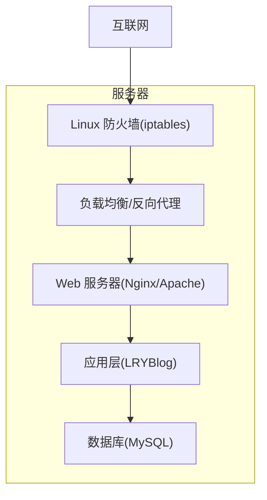
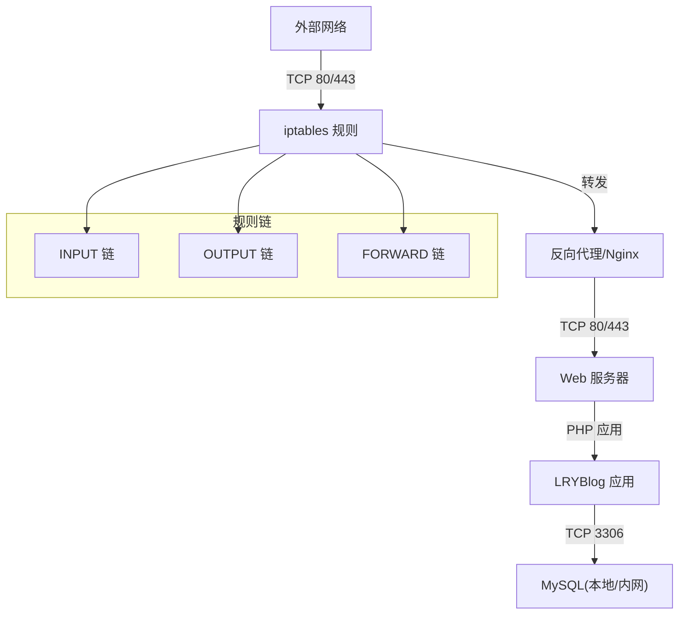
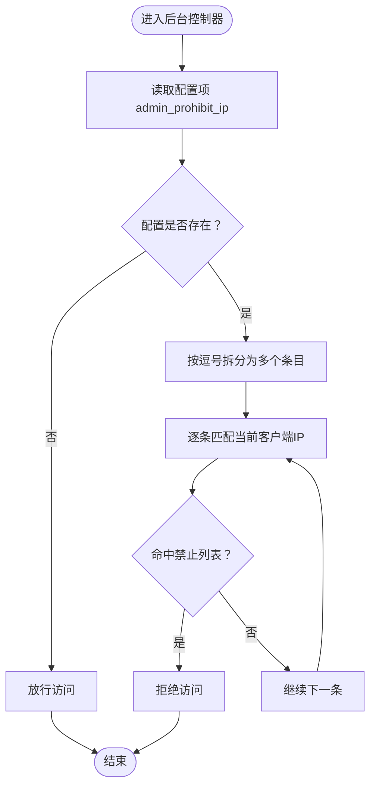
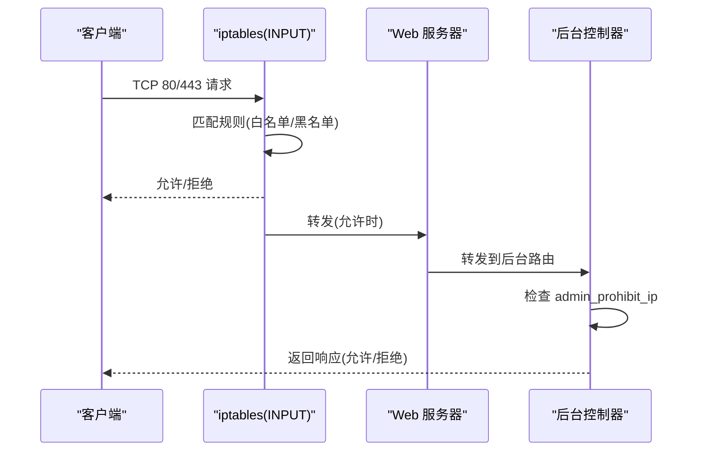
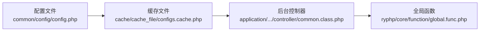

# 防火墙配置

<cite>
**本文引用的文件**
- [README.md](file://README.md)
- [common/config/config.php](file://common/config/config.php)
- [application/lry_admin_center/controller/common.class.php](file://application/lry_admin_center/controller/common.class.php)
- [ryphp/core/function/global.func.php](file://ryphp/core/function/global.func.php)
- [cache/cache_file/configs.cache.php](file://cache/cache_file/configs.cache.php)
- [DNS_FIX.md](file://DNS_FIX.md)
</cite>

## 目录
1. [简介](#简介)
2. [项目结构](#项目结构)
3. [核心组件](#核心组件)
4. [架构总览](#架构总览)
5. [详细组件分析](#详细组件分析)
6. [依赖关系分析](#依赖关系分析)
7. [性能考虑](#性能考虑)
8. [故障排查指南](#故障排查指南)
9. [结论](#结论)
10. [附录](#附录)

## 简介
本指南面向 LRYBlog 系统的防火墙配置需求，围绕 Linux 防火墙（iptables）的入站与出站规则、端口管理策略、IP 白名单与黑名单、以及 Web 服务器端口（80/443）访问控制展开。同时结合系统现有后台 IP 限制机制，给出可维护的规则备份与恢复方法，以及常见场景的最佳实践。

## 项目结构
LRYBlog 为基于 PHP 的内容管理系统，前端通过 Web 服务器对外提供 HTTP/HTTPS 服务，后台管理界面位于独立模块中。防火墙策略应覆盖：
- Web 服务器端口（80/443）的入站访问控制
- 后台管理界面的访问来源限制
- 内网服务（如数据库）的访问控制
- 出站流量的必要放行（如系统更新、CDN、邮件等）

[本图为概念性结构示意，不直接映射具体源码文件，故无图表来源]

## 核心组件
- Web 服务器端口与访问控制
  - 80/443 端口作为对外入口，需严格限制来源并启用 HTTPS
- 后台管理访问控制
  - 系统内置后台 IP 限制逻辑，支持精确 IP 与 IP 段（通配符）匹配
- 数据库访问控制
  - 默认本地回环访问，生产环境建议限制来源并启用加密通道
- 防火墙规则管理
  - 基于 iptables 的 INPUT/OUTPUT/FORWARD 链管理，结合备份与恢复流程

章节来源
- file://common/config/config.php#L13-L21
- file://application/lry_admin_center/controller/common.class.php#L86-L93
- file://ryphp/core/function/global.func.php#L34-L47

## 架构总览
下图展示防火墙在系统中的位置与交互关系：

图表来源
- [common/config/config.php](file://common/config/config.php#L13-L21)
- [application/lry_admin_center/controller/common.class.php](file://application/lry_admin_center/controller/common.class.php#L86-L93)

## 详细组件分析

### 组件A：后台访问控制与 IP 白名单
- 功能概述
  - 系统在后台控制器中实现了基于配置项的 IP 限制逻辑，支持精确 IP 与 IP 段（通配符）匹配
  - 当客户端 IP 属于禁止列表时，直接拒绝访问
- 关键点
  - 配置项键名为 admin_prohibit_ip，值为逗号分隔的 IP/IP 段
  - IP 段匹配采用通配符“*”，系统会将其转换为最小与最大边界进行范围判断
  - 实际生效由系统在请求进入后台时调用 IP 匹配函数进行判定

图表来源
- [application/lry_admin_center/controller/common.class.php](file://application/lry_admin_center/controller/common.class.php#L86-L93)
- [ryphp/core/function/global.func.php](file://ryphp/core/function/global.func.php#L34-L47)
- [cache/cache_file/configs.cache.php](file://cache/cache_file/configs.cache.php#L30)

章节来源
- file://application/lry_admin_center/controller/common.class.php#L86-L93
- file://ryphp/core/function/global.func.php#L34-L47
- file://cache/cache_file/configs.cache.php#L30

### 组件B：Linux 防火墙规则与链管理
- INPUT 链
  - 控制进入本机的入站流量
  - 建议仅开放 80/443（以及必要管理端口如 22），其余一律拒绝
- OUTPUT 链
  - 控制本机发出的出站流量
  - 建议放行必要的 DNS、系统更新、邮件等出站
- FORWARD 链
  - 控制转发流量（若服务器非网关设备，通常保持默认策略）
- 端口管理策略
  - Web 服务：仅允许 TCP 80/443；如需管理端口（如 22），限定来源 IP
  - 数据库：仅允许来自 Web 服务器所在网段的访问（如 127.0.0.1 或内网网段）
- IP 白名单设置
  - 对管理端口（如 22）与后台访问，建议仅放行受信任 IP/IP 段
  - 结合系统后台 IP 限制，形成“网络层 + 应用层”的双重防护

图表来源
- [application/lry_admin_center/controller/common.class.php](file://application/lry_admin_center/controller/common.class.php#L86-L93)
- [ryphp/core/function/global.func.php](file://ryphp/core/function/global.func.php#L34-L47)

章节来源
- file://application/lry_admin_center/controller/common.class.php#L86-L93
- file://ryphp/core/function/global.func.php#L34-L47

### 组件C：Web 服务器端口访问控制（80/443）
- 入站策略
  - 仅允许来自公网的 TCP 80/443 请求
  - 建议对频繁请求来源进行限速与连接数限制
- 后台管理访问
  - 若后台路径可被探测，建议对后台特定路径或子网进行更严格的访问控制
  - 结合系统后台 IP 限制，形成“网络层 + 应用层”的纵深防御

章节来源
- file://common/config/config.php#L13-L21

## 依赖关系分析
- 系统后台 IP 限制依赖于全局函数实现的 IP 匹配逻辑
- 配置项 admin_prohibit_ip 存储于缓存文件中，供运行时读取
- Web 服务器端口配置与数据库端口配置分别来源于系统配置文件

图表来源
- [common/config/config.php](file://common/config/config.php#L13-L21)
- [cache/cache_file/configs.cache.php](file://cache/cache_file/configs.cache.php#L30)
- [application/lry_admin_center/controller/common.class.php](file://application/lry_admin_center/controller/common.class.php#L86-L93)
- [ryphp/core/function/global.func.php](file://ryphp/core/function/global.func.php#L34-L47)

章节来源
- file://common/config/config.php#L13-L21
- file://cache/cache_file/configs.cache.php#L30
- file://application/lry_admin_center/controller/common.class.php#L86-L93
- file://ryphp/core/function/global.func.php#L34-L47

## 性能考虑
- 规则数量与匹配顺序
  - 将高频命中规则置于靠前位置，减少规则遍历开销
- 连接跟踪
  - 对于长连接（如 HTTPS）合理利用 conntrack，避免重复状态计算
- 日志与审计
  - 仅对必要规则启用日志，避免大量日志写入影响性能

[本节为通用指导，不直接分析具体文件，故无章节来源]

## 故障排查指南
- 后台无法访问
  - 检查系统配置项 admin_prohibit_ip 是否包含当前客户端 IP
  - 确认 IP 匹配逻辑是否按预期工作（支持精确 IP 与 IP 段）
- 网络层被阻断
  - 检查 iptables INPUT/OUTPUT/FORWARD 链规则，确认 80/443 与管理端口放行
  - 如使用反向代理，确认其转发链路畅通
- DNS 解析异常
  - 参考 DNS 修复文档，确保 DNS 配置正确

章节来源
- file://application/lry_admin_center/controller/common.class.php#L86-L93
- file://ryphp/core/function/global.func.php#L34-L47
- file://DNS_FIX.md#L32-L37

## 结论
通过“网络层（iptables）+ 应用层（后台 IP 限制）”的双层防护，LRYBlog 可以在保证易用性的同时显著提升安全性。建议结合实际业务场景制定严格的端口与 IP 策略，并建立规则备份与恢复机制，确保配置可维护与可追溯。

[本节为总结性内容，不直接分析具体文件，故无章节来源]

## 附录

### A. 常见防火墙配置场景与最佳实践
- 场景一：仅允许特定 IP 访问后台管理
  - 在 iptables 的 INPUT 链中为管理端口（如 22）添加白名单规则
  - 在应用层通过 admin_prohibit_ip 配置禁止可疑来源
- 场景二：Web 服务器仅对外提供 80/443
  - 仅放行 TCP 80/443；对其他端口统一拒绝
  - 对后台特定路径或子网实施额外访问控制
- 场景三：数据库仅允许内网访问
  - 限制数据库端口（默认 3306）仅允许来自 Web 服务器网段的访问
- 最佳实践
  - 优先使用 IP 段（CIDR）而非单个 IP
  - 定期审查与审计规则，及时清理失效规则
  - 对高风险端口（如 22）启用多因素认证与密钥登录

章节来源
- file://common/config/config.php#L13-L21
- file://application/lry_admin_center/controller/common.class.php#L86-L93

### B. 防火墙规则备份与恢复方法
- 备份
  - 导出当前规则集，建议包含注释与时间戳，便于回溯
- 恢复
  - 在新环境中导入备份规则，校验与测试后再上线
- 可维护性
  - 将规则变更纳入变更流程，记录每次修改的原因与责任人

[本节为通用指导，不直接分析具体文件，故无章节来源]