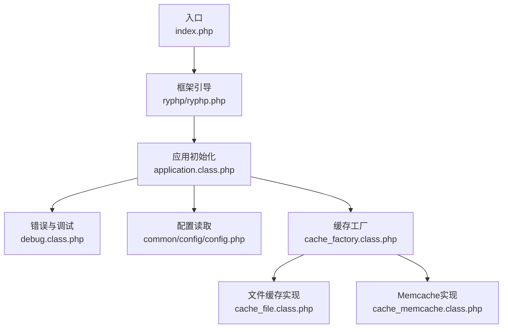
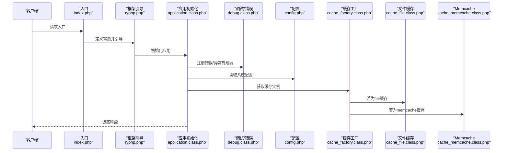
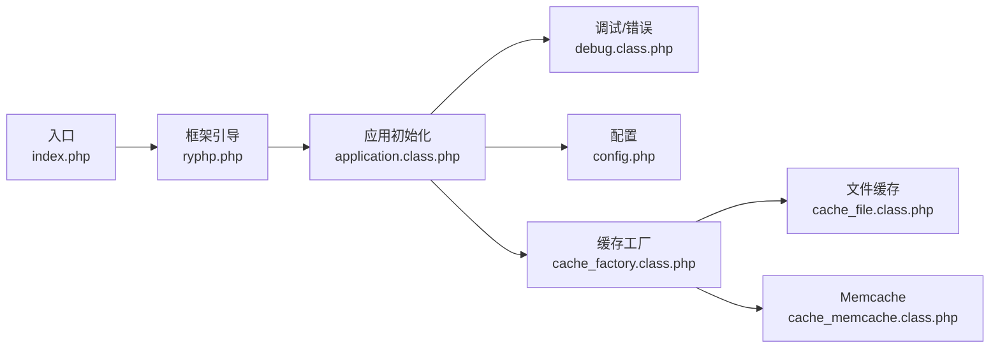

# PHP配置优化

<cite>
**本文引用的文件**
- [index.php](file://index.php)
- [ryphp.php](file://ryphp/ryphp.php)
- [config.php](file://common/config/config.php)
- [cache_factory.class.php](file://ryphp/core/class/cache_factory.class.php)
- [cache_file.class.php](file://ryphp/core/class/cache_file.class.php)
- [cache_memcache.class.php](file://ryphp/core/class/cache_memcache.class.php)
- [debug.class.php](file://ryphp/core/class/debug.class.php)
- [application.class.php](file://ryphp/core/class/application.class.php)
- [global.func.php](file://ryphp/core/function/global.func.php)
</cite>

## 目录
1. [简介](#简介)
2. [项目结构](#项目结构)
3. [核心组件](#核心组件)
4. [架构总览](#架构总览)
5. [详细组件分析](#详细组件分析)
6. [依赖关系分析](#依赖关系分析)
7. [性能考虑](#性能考虑)
8. [故障排查指南](#故障排查指南)
9. [结论](#结论)
10. [附录](#附录)

## 简介
本技术指南面向LRYBlog的PHP运行环境优化，聚焦以下方面：
- PHP-FPM配置优化：进程管理、内存限制、执行时间设置
- OPcache配置：字节码缓存、共享内存分配、预加载
- 内存管理优化：内存限制调整、垃圾回收机制、内存泄漏预防
- 错误报告级别与日志配置
- 性能监控：Xdebug与APC/APCu配置建议
- 实际配置示例与性能测试方法

说明：本指南基于仓库中现有PHP运行时与框架代码进行分析，并结合通用最佳实践给出优化建议。对于未在仓库中直接出现的配置（如PHP-FPM、OPcache、Xdebug、APCu），本指南提供通用配置要点与测试方法，便于在生产环境中落地。

## 项目结构
LRYBlog采用单入口与框架内核配合的结构：
- 入口文件负责常量定义与框架引导
- 框架内核负责应用初始化、类加载、路由与错误处理
- 配置集中于common/config，包含缓存、数据库、Cookie、URL等系统级参数
- 缓存子系统通过工厂模式按配置选择具体实现（文件、Redis、Memcache）

图表来源
- [index.php](file://index.php#L1-L18)
- [ryphp.php](file://ryphp/ryphp.php#L83-L90)
- [application.class.php](file://ryphp/core/class/application.class.php#L9-L19)
- [debug.class.php](file://ryphp/core/class/debug.class.php#L46-L69)
- [config.php](file://common/config/config.php#L1-L88)
- [cache_factory.class.php](file://ryphp/core/class/cache_factory.class.php#L36-L62)
- [cache_file.class.php](file://ryphp/core/class/cache_file.class.php#L1-L130)
- [cache_memcache.class.php](file://ryphp/core/class/cache_memcache.class.php#L1-L55)

章节来源
- [index.php](file://index.php#L1-L18)
- [ryphp.php](file://ryphp/ryphp.php#L83-L90)
- [application.class.php](file://ryphp/core/class/application.class.php#L9-L19)

## 核心组件
- 应用入口与引导
  - 定义调试开关、根路径、URL模式，并调用框架引导
  - 参考路径：[入口文件](file://index.php#L10-L17)
- 框架内核
  - 定义系统常量、时区、版本、启动时间；注册类加载与公共函数
  - 参考路径：[框架引导](file://ryphp/ryphp.php#L10-L31)
- 应用初始化与错误处理
  - 注册致命错误、错误、异常处理器；解析路由并执行动作
  - 参考路径：[应用初始化](file://ryphp/core/class/application.class.php#L9-L19)
- 配置系统
  - 统一读取配置，支持缓存类型、数据库、Cookie、URL等
  - 参考路径：[配置读取](file://ryphp/core/function/global.func.php#L4-L26)、[配置文件](file://common/config/config.php#L1-L88)
- 缓存子系统
  - 工厂模式按配置选择缓存实现；文件缓存与Memcache实现
  - 参考路径：[缓存工厂](file://ryphp/core/class/cache_factory.class.php#L36-L62)、[文件缓存](file://ryphp/core/class/cache_file.class.php#L1-L130)、[Memcache](file://ryphp/core/class/cache_memcache.class.php#L1-L55)
- 调试与日志
  - 注册错误/异常处理器；记录错误日志；在调试模式下输出详细信息
  - 参考路径：[调试类](file://ryphp/core/class/debug.class.php#L46-L69)、[全局函数](file://ryphp/core/function/global.func.php#L813-L833)

章节来源
- [index.php](file://index.php#L10-L17)
- [ryphp.php](file://ryphp/ryphp.php#L10-L31)
- [application.class.php](file://ryphp/core/class/application.class.php#L9-L19)
- [global.func.php](file://ryphp/core/function/global.func.php#L4-L26)
- [config.php](file://common/config/config.php#L1-L88)
- [cache_factory.class.php](file://ryphp/core/class/cache_factory.class.php#L36-L62)
- [cache_file.class.php](file://ryphp/core/class/cache_file.class.php#L1-L130)
- [cache_memcache.class.php](file://ryphp/core/class/cache_memcache.class.php#L1-L55)
- [debug.class.php](file://ryphp/core/class/debug.class.php#L46-L69)

## 架构总览
下图展示从入口到应用执行、错误处理与缓存的关键交互：

图表来源
- [index.php](file://index.php#L10-L17)
- [ryphp.php](file://ryphp/ryphp.php#L83-L90)
- [application.class.php](file://ryphp/core/class/application.class.php#L9-L19)
- [debug.class.php](file://ryphp/core/class/debug.class.php#L46-L69)
- [config.php](file://common/config/config.php#L1-L88)
- [cache_factory.class.php](file://ryphp/core/class/cache_factory.class.php#L36-L62)
- [cache_file.class.php](file://ryphp/core/class/cache_file.class.php#L1-L130)
- [cache_memcache.class.php](file://ryphp/core/class/cache_memcache.class.php#L1-L55)

## 详细组件分析

### PHP-FPM配置优化
- 进程管理
  - 推荐使用动态进程池（pm = dynamic），根据CPU核心数与并发需求设置：
    - pm.max_children：建议为CPU核心数×4~8
    - pm.start_servers：建议为pm.max_children的25%
    - pm.min_spare_servers：建议为pm.max_children的20%
    - pm.max_spare_servers：建议为pm.max_children的60%
  - pm.process_idle_timeout：建议设置为10s~30s，避免空闲进程占用资源
  - pm.max_requests：建议设置为500~1000，定期重启worker以释放内存碎片
- 内存限制
  - php_admin_value[memory_limit]：建议设置为512M~1G，结合业务峰值合理评估
  - php_admin_value[realpath_cache_size]：建议设置为256k~512k，减少 realpath 系统调用
- 执行时间
  - php_admin_value[max_execution_time]：建议设置为30~60s，针对后台任务可单独放宽
  - php_admin_value[max_input_time]：建议设置为60s以上，确保大请求可完成解析

### OPcache配置优化
- 字节码缓存
  - opcache.enable=1：启用OPcache
  - opcache.memory_consumption：建议设置为128M~512M，依据项目规模与类数量调整
  - opcache.interned_strings_buffer：建议设置为8M~16M
  - opcache.max_accelerated_files：建议设置为2000~6000，避免文件过多导致缓存失效
  - opcache.revalidate_freq：建议设置为2~10，平衡更新与性能
- 共享内存分配
  - opcache.use_cwd=1：启用工作目录校验，避免同名文件冲突
  - opcache.validate_timestamps=1：开发阶段启用，生产阶段可关闭
  - opcache.save_comments=1：保留注释，便于调试
- 预加载
  - opcache.preload：建议预加载核心框架文件与常用类，减少首次请求延迟

### 内存管理优化
- 内存限制调整
  - memory_limit：结合业务峰值与缓存策略设定，避免频繁触发内存不足
  - opcache.memory_consumption：与memory_limit协同，避免内存与OPcache竞争
- 垃圾回收机制
  - opcache.validate_timestamps：开发阶段启用，生产阶段关闭以提升性能
  - opcache.revalidate_freq：适当降低以减少缓存失效带来的抖动
- 内存泄漏预防
  - 避免在循环中累积大量对象
  - 使用临时变量并在使用后及时释放
  - 对大数组与字符串操作时，优先使用流式处理

### 错误报告级别与日志配置
- 错误报告级别
  - 开发环境：显示所有错误与警告（E_ALL）
  - 生产环境：仅记录致命错误（E_ERROR | E_PARSE | E_CORE_ERROR | E_COMPILE_ERROR | E_USER_ERROR）
- 日志配置
  - 错误日志写入：通过框架提供的错误日志函数记录到文件，包含时间、URL、IP、POST数据等
  - 参考路径：[错误日志函数](file://ryphp/core/function/global.func.php#L813-L833)
  - 调试模式：在调试模式下输出详细错误信息，便于定位问题
  - 参考路径：[调试类](file://ryphp/core/class/debug.class.php#L46-L69)

### 性能监控配置
- Xdebug配置（开发/性能分析）
  - xdebug.mode：建议设置为profile或trace，配合浏览器插件或远程IDE进行性能分析
  - xdebug.output_dir：建议设置为统一的分析结果目录
  - xdebug.remote_enable：开发环境启用，生产环境禁用
- APC/APCu配置（缓存加速）
  - apc.enabled：建议启用
  - apc.shm_size：建议设置为64M~256M，依据项目大小调整
  - apc.ttl：建议设置为0（永久）或较短生命周期，平衡内存与一致性
  - apc.user_ttl：用户缓存过期策略，建议与业务缓存一致

### 实际配置示例与性能测试方法
- PHP-FPM配置示例要点
  - pm = dynamic
  - pm.max_children = CPU核心数×6
  - pm.start_servers = pm.max_children × 0.25
  - pm.min_spare_servers = pm.max_children × 0.2
  - pm.max_spare_servers = pm.max_children × 0.6
  - pm.max_requests = 500
  - memory_limit = 512M
  - max_execution_time = 30
- OPcache配置示例要点
  - opcache.enable = 1
  - opcache.memory_consumption = 256M
  - opcache.interned_strings_buffer = 12M
  - opcache.max_accelerated_files = 4000
  - opcache.revalidate_freq = 6
  - opcache.preload = "/var/www/html/ryphp/ryphp.php"
- 性能测试方法
  - ab压测：ab -n 1000 -c 100 http://your-domain/
  - wrk压测：wrk -t12 -c100 -d30s http://your-domain/
  - Xdebug火焰图：生成cachegrind文件，使用WebGrind或qcachegrind查看热点函数
  - 缓存命中率：统计OPcache与业务缓存命中率，持续观察内存使用趋势

## 依赖关系分析
- 入口依赖框架引导，框架引导依赖应用初始化
- 应用初始化依赖调试/错误处理、配置读取与缓存工厂
- 缓存工厂根据配置选择具体缓存实现（文件/Redis/Memcache）

图表来源
- [index.php](file://index.php#L10-L17)
- [ryphp.php](file://ryphp/ryphp.php#L83-L90)
- [application.class.php](file://ryphp/core/class/application.class.php#L9-L19)
- [debug.class.php](file://ryphp/core/class/debug.class.php#L46-L69)
- [config.php](file://common/config/config.php#L1-L88)
- [cache_factory.class.php](file://ryphp/core/class/cache_factory.class.php#L36-L62)
- [cache_file.class.php](file://ryphp/core/class/cache_file.class.php#L1-L130)
- [cache_memcache.class.php](file://ryphp/core/class/cache_memcache.class.php#L1-L55)

章节来源
- [index.php](file://index.php#L10-L17)
- [ryphp.php](file://ryphp/ryphp.php#L83-L90)
- [application.class.php](file://ryphp/core/class/application.class.php#L9-L19)
- [cache_factory.class.php](file://ryphp/core/class/cache_factory.class.php#L36-L62)

## 性能考虑
- 缓存策略
  - 优先使用文件缓存作为默认方案，结合OPcache提升脚本执行效率
  - 对高并发场景建议引入Redis或Memcache，降低磁盘IO压力
- 内存与OPcache
  - OPcache与memory_limit需协同配置，避免相互争用
  - 合理设置opcache.revalidate_freq与validate_timestamps，平衡更新与性能
- 错误与日志
  - 生产环境仅记录致命错误，避免日志风暴影响性能
  - 使用异步日志或集中化日志收集，减少I/O阻塞

## 故障排查指南
- 错误处理流程
  - 致命错误：在脚本结束时捕获并记录，必要时输出错误页面
  - 普通错误：根据调试开关决定输出或记录
  - 异常：统一记录并提示用户
- 关键路径参考
  - 致命错误捕获与处理：[调试类](file://ryphp/core/class/debug.class.php#L46-L69)
  - 错误日志写入：[全局函数](file://ryphp/core/function/global.func.php#L813-L833)
  - 应用错误页面与状态码：[应用类](file://ryphp/core/class/application.class.php#L108-L115)

章节来源
- [debug.class.php](file://ryphp/core/class/debug.class.php#L46-L69)
- [global.func.php](file://ryphp/core/function/global.func.php#L813-L833)
- [application.class.php](file://ryphp/core/class/application.class.php#L108-L115)

## 结论
通过对入口、框架引导、应用初始化、缓存与调试模块的分析，结合PHP-FPM、OPcache、Xdebug与APCu的通用优化策略，可在LRYBlog环境中构建高性能、可维护的PHP运行时。建议以文件缓存为基线，逐步引入Redis/Memcache与OPcache，在生产环境严格控制错误日志与内存使用，配合压测工具持续验证优化效果。

## 附录
- 配置文件位置参考
  - 系统配置：[配置文件](file://common/config/config.php#L1-L88)
  - 缓存工厂：[缓存工厂](file://ryphp/core/class/cache_factory.class.php#L36-L62)
  - 文件缓存：[文件缓存](file://ryphp/core/class/cache_file.class.php#L1-L130)
  - Memcache：[Memcache](file://ryphp/core/class/cache_memcache.class.php#L1-L55)
  - 调试与错误处理：[调试类](file://ryphp/core/class/debug.class.php#L46-L69)
  - 入口与框架引导：[入口](file://index.php#L10-L17)、[框架引导](file://ryphp/ryphp.php#L83-L90)