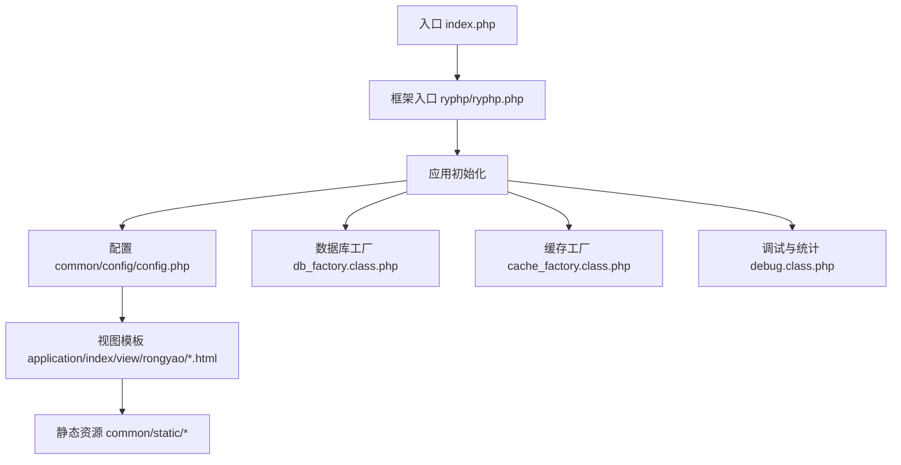
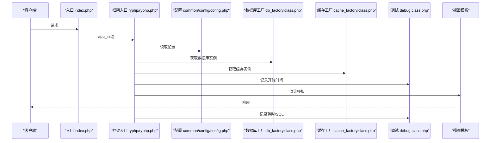
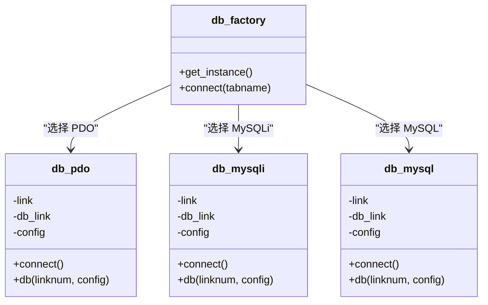
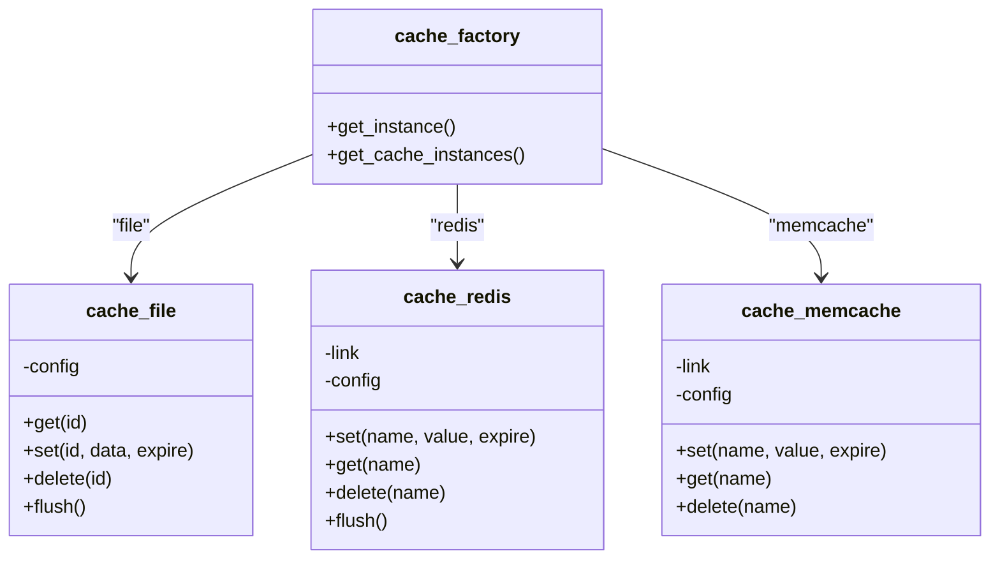
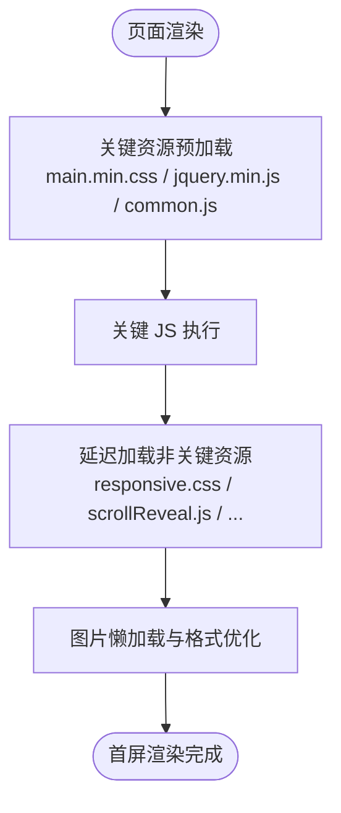
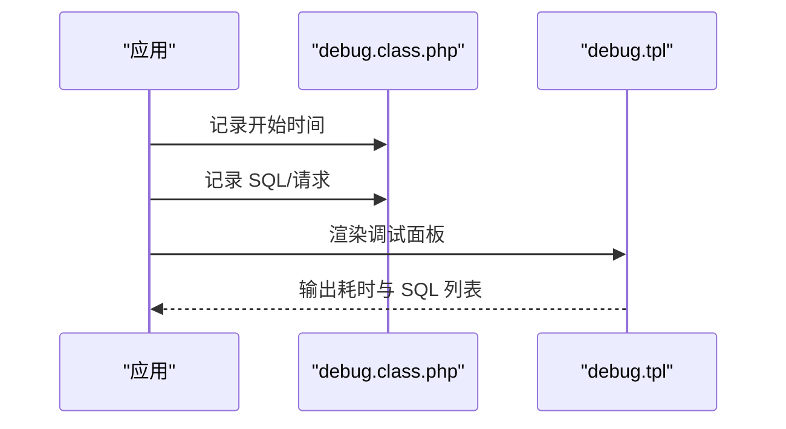
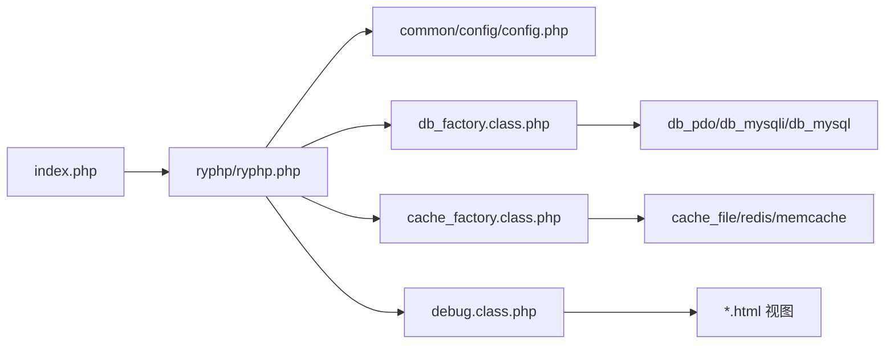

# 性能优化

<cite>
**本文引用的文件**
- [common/config/config.php](file://common/config/config.php)
- [index.php](file://index.php)
- [ryphp/ryphp.php](file://ryphp/ryphp.php)
- [ryphp/core/class/db_factory.class.php](file://ryphp/core/class/db_factory.class.php)
- [ryphp/core/class/db_pdo_optimized.class.php](file://ryphp/core/class/db_pdo_optimized.class.php)
- [ryphp/core/class/db_mysqli.class.php](file://ryphp/core/class/db_mysqli.class.php)
- [ryphp/core/class/db_mysql.class.php](file://ryphp/core/class/db_mysql.class.php)
- [ryphp/core/class/cache_factory.class.php](file://ryphp/core/class/cache_factory.class.php)
- [ryphp/core/class/cache_file.class.php](file://ryphp/core/class/cache_file.class.php)
- [ryphp/core/class/cache_redis.class.php](file://ryphp/core/class/cache_redis.class.php)
- [ryphp/core/class/cache_memcache.class.php](file://ryphp/core/class/cache_memcache.class.php)
- [ryphp/core/class/debug.class.php](file://ryphp/core/class/debug.class.php)
- [ryphp/core/message/debug.tpl](file://ryphp/core/message/debug.tpl)
- [ryphp/core/function/global.func.php](file://ryphp/core/function/global.func.php)
- [application/index/view/rongyao/category_page.html](file://application/index/view/rongyao/category_page.html)
- [application/index/view/rongyao/list_article.html](file://application/index/view/rongyao/list_article.html)
- [application/index/view/rongyao/show_article.html](file://application/index/view/rongyao/show_article.html)
</cite>

## 目录
1. [简介](#简介)
2. [项目结构](#项目结构)
3. [核心组件](#核心组件)
4. [架构总览](#架构总览)
5. [详细组件分析](#详细组件分析)
6. [依赖关系分析](#依赖关系分析)
7. [性能考量](#性能考量)
8. [故障排查指南](#故障排查指南)
9. [结论](#结论)
10. [附录](#附录)

## 简介
本指南面向运维与开发团队，围绕 LRYBlog 的性能优化进行系统化梳理，覆盖 PHP 配置优化（含 PHP-FPM、OPcache、内存限制）、数据库性能优化（查询与索引、连接池）、缓存策略（文件/Redis/Memcache）、静态资源优化（CSS/JS/图片）、CDN 集成、负载均衡与反向代理、以及性能监控与测试方法。文档以仓库现有实现为基础，结合最佳实践给出可操作的建议与图示。

## 项目结构
LRYBlog 采用 MVC 分层与单入口模式，核心入口负责框架初始化，应用模块按 index/admin 等划分，公共资源位于 common/static，缓存与数据库抽象通过工厂模式实现，模板引擎在视图层渲染。

图表来源
- [index.php](file://index.php#L1-L18)
- [ryphp/ryphp.php](file://ryphp/ryphp.php#L83-L90)
- [common/config/config.php](file://common/config/config.php#L1-L88)
- [ryphp/core/class/db_factory.class.php](file://ryphp/core/class/db_factory.class.php#L11-L50)
- [ryphp/core/class/cache_factory.class.php](file://ryphp/core/class/cache_factory.class.php#L36-L84)
- [ryphp/core/class/debug.class.php](file://ryphp/core/class/debug.class.php#L38-L41)
- [application/index/view/rongyao/category_page.html](file://application/index/view/rongyao/category_page.html#L1-L36)

章节来源
- [index.php](file://index.php#L1-L18)
- [ryphp/ryphp.php](file://ryphp/ryphp.php#L83-L90)
- [common/config/config.php](file://common/config/config.php#L1-L88)

## 核心组件
- 应用入口与框架初始化：单入口加载框架并触发应用初始化。
- 配置中心：集中管理数据库、缓存、Cookie、上传等配置。
- 数据库抽象：通过工厂选择 PDO/MySQLi/MySQL 三种实现，统一连接与查询接口。
- 缓存抽象：通过工厂选择 file/redis/memcache 实现，统一封装读写与过期控制。
- 调试与统计：记录脚本耗时、SQL 与请求信息，便于性能分析。
- 视图与静态资源：模板中引入预加载与延迟加载策略，减少首屏阻塞。

章节来源
- [ryphp/ryphp.php](file://ryphp/ryphp.php#L83-L90)
- [common/config/config.php](file://common/config/config.php#L13-L66)
- [ryphp/core/class/db_factory.class.php](file://ryphp/core/class/db_factory.class.php#L11-L50)
- [ryphp/core/class/cache_factory.class.php](file://ryphp/core/class/cache_factory.class.php#L36-L84)
- [ryphp/core/class/debug.class.php](file://ryphp/core/class/debug.class.php#L38-L41)

## 架构总览
LRYBlog 的请求生命周期从入口开始，经由框架初始化、配置加载、数据库/缓存工厂实例化，最终渲染视图输出。调试模块贯穿其中，用于记录耗时与 SQL。

图表来源
- [index.php](file://index.php#L10-L18)
- [ryphp/ryphp.php](file://ryphp/ryphp.php#L83-L90)
- [common/config/config.php](file://common/config/config.php#L13-L66)
- [ryphp/core/class/db_factory.class.php](file://ryphp/core/class/db_factory.class.php#L38-L50)
- [ryphp/core/class/cache_factory.class.php](file://ryphp/core/class/cache_factory.class.php#L77-L82)
- [ryphp/core/class/debug.class.php](file://ryphp/core/class/debug.class.php#L38-L41)

## 详细组件分析

### PHP 配置优化
- PHP-FPM
  - 建议启用 OPcache 并合理设置共享内存大小；根据并发与内存情况调整 pm.* 参数（pm.type、pm.max_children、pm.start_servers、pm.min_spare_servers、pm.max_spare_servers）。
  - 启用 PHP-FPM 慢日志，定位慢请求；设置 request_slowlog_timeout 与 slowlog 目录。
  - 针对 LRYBlog 的静态资源与模板渲染特点，建议将 pm.status_pathname 设为受控路径，避免暴露敏感信息。
- OPcache
  - 开启 opcache.enable、opcache.memory_consumption，合理设置 opcache.max_accelerated_files 与 opcache.validate_timestamps。
  - 对于开发环境可开启 validate_timestamps，生产环境建议关闭以提升性能。
- 内存限制
  - 根据站点规模与模板复杂度，适当提高 memory_limit；结合 PHP-FPM 的 pm.* 与进程数控制整体内存占用。
- 时区与字符集
  - 确保 date.timezone 与数据库字符集一致，避免编码问题导致的额外开销。

[本节为通用优化建议，不直接分析具体文件，故无章节来源]

### 数据库性能优化
- 连接与驱动
  - 工厂根据配置选择 PDO/MySQLi/MySQL 驱动，默认加载优化版 PDO 实现，具备严格参数绑定与异常处理。
  - 建议优先使用 PDO，配合预处理语句与参数绑定，降低 SQL 注入风险与解析成本。
- 连接池与复用
  - 工厂内部维护静态连接池，避免重复建立连接；生产环境建议使用持久连接（如启用 MySQLi 的持久连接）以减少握手开销。
- 查询与索引
  - 使用 EXPLAIN 分析慢查询，确保常用查询命中索引；对分页、排序字段建立复合索引。
  - 避免 SELECT *，只取必要字段；对大结果集使用 LIMIT 与分页。
- 事务与锁
  - 合理使用事务边界，缩短事务时间；避免长事务持有行锁。
- 配置要点
  - 根据 common/config/config.php 的 db_* 配置，确保字符集与端口正确；生产环境建议开启连接超时与重试策略。

图表来源
- [ryphp/core/class/db_factory.class.php](file://ryphp/core/class/db_factory.class.php#L11-L50)
- [ryphp/core/class/db_pdo_optimized.class.php](file://ryphp/core/class/db_pdo_optimized.class.php#L74-L97)
- [ryphp/core/class/db_mysqli.class.php](file://ryphp/core/class/db_mysqli.class.php#L36-L46)
- [ryphp/core/class/db_mysql.class.php](file://ryphp/core/class/db_mysql.class.php#L36-L49)

章节来源
- [ryphp/core/class/db_factory.class.php](file://ryphp/core/class/db_factory.class.php#L11-L50)
- [ryphp/core/class/db_pdo_optimized.class.php](file://ryphp/core/class/db_pdo_optimized.class.php#L74-L97)
- [ryphp/core/class/db_mysqli.class.php](file://ryphp/core/class/db_mysqli.class.php#L36-L46)
- [ryphp/core/class/db_mysql.class.php](file://ryphp/core/class/db_mysql.class.php#L36-L49)
- [common/config/config.php](file://common/config/config.php#L13-L21)

### 缓存策略配置
- 缓存类型与配置
  - 支持 file/redis/memcache 三类缓存，通过 cache_type 与对应配置项选择。
  - file 缓存支持两种存储模式（序列化/可执行数组），可配置缓存目录、后缀与过期时间。
  - redis/memcache 支持主机、端口、密码、库选择、超时、过期、持久连接与键前缀。
- 工作流程
  - 工厂根据配置动态加载对应缓存类，提供统一的 set/get/delete/flush 接口。
  - 生产环境建议优先使用 Redis，具备更好的性能与集群能力；Memcache 适合轻量场景；File 缓存适合单机与开发环境。

图表来源
- [ryphp/core/class/cache_factory.class.php](file://ryphp/core/class/cache_factory.class.php#L36-L84)
- [ryphp/core/class/cache_file.class.php](file://ryphp/core/class/cache_file.class.php#L34-L46)
- [ryphp/core/class/cache_redis.class.php](file://ryphp/core/class/cache_redis.class.php#L60-L72)
- [ryphp/core/class/cache_memcache.class.php](file://ryphp/core/class/cache_memcache.class.php#L47-L54)

章节来源
- [common/config/config.php](file://common/config/config.php#L39-L66)
- [ryphp/core/class/cache_factory.class.php](file://ryphp/core/class/cache_factory.class.php#L36-L84)
- [ryphp/core/class/cache_file.class.php](file://ryphp/core/class/cache_file.class.php#L34-L46)
- [ryphp/core/class/cache_redis.class.php](file://ryphp/core/class/cache_redis.class.php#L60-L72)
- [ryphp/core/class/cache_memcache.class.php](file://ryphp/core/class/cache_memcache.class.php#L47-L54)

### 静态资源优化
- CSS 合并与压缩
  - 视图模板中引入压缩后的 main.min.css，减少请求数与体积。
  - 建议构建阶段合并常用样式并开启 gzip/br 压缩。
- JavaScript 压缩与延迟加载
  - 关键 JS（如 jQuery、common.js）预加载，非关键 JS 延迟加载，降低首屏阻塞。
  - 建议将第三方库 CDN 化，利用浏览器缓存与并行下载。
- 图片优化
  - 使用现代格式（WebP/JPEG2000）与响应式尺寸；对图标使用矢量字体或 SVG。
  - 启用懒加载与占位图，避免大图阻塞页面渲染。
- 资源版本控制
  - 通过时间戳或哈希后缀避免缓存穿透；模板中可加入版本号或时间戳策略。

图表来源
- [application/index/view/rongyao/category_page.html](file://application/index/view/rongyao/category_page.html#L9-L30)
- [application/index/view/rongyao/list_article.html](file://application/index/view/rongyao/list_article.html#L9-L30)
- [application/index/view/rongyao/show_article.html](file://application/index/view/rongyao/show_article.html#L9-L43)

章节来源
- [application/index/view/rongyao/category_page.html](file://application/index/view/rongyao/category_page.html#L9-L30)
- [application/index/view/rongyao/list_article.html](file://application/index/view/rongyao/list_article.html#L9-L30)
- [application/index/view/rongyao/show_article.html](file://application/index/view/rongyao/show_article.html#L9-L43)

### CDN 集成方案
- 静态资源 CDN
  - 将 common/static 下的 CSS/JS/图片托管至 CDN，回源至本机或对象存储。
  - 配置缓存头（Cache-Control/ETag/Last-Modified）与压缩策略。
- 加速策略
  - 启用边缘缓存与智能压缩；对热点资源设置较长缓存周期。
  - 结合对象存储的全球分发网络，降低跨地域访问延迟。
- 动态内容
  - 动态页面不缓存或设置短缓存；对 API 接口使用独立域名与缓存策略。

[本节为通用集成建议，不直接分析具体文件，故无章节来源]

### 负载均衡与反向代理
- 多服务器部署
  - 使用 Nginx/Apache 作为反向代理，将请求分发至多个 PHP-FPM 实例。
  - 配置健康检查与故障转移，确保高可用。
- 会话与缓存
  - 使用 Redis/Memcache 统一会话与缓存，避免粘性会话带来的扩展瓶颈。
- 反向代理优化
  - 启用 gzip/br 压缩、连接复用与超时控制；对静态资源交由代理直接返回。

[本节为通用部署建议，不直接分析具体文件，故无章节来源]

### 性能监控与测试
- 框架内置调试
  - debug 类记录脚本耗时、SQL 与请求信息，模板 debug.tpl 展示运行详情。
  - 通过 spent() 获取总耗时，结合 SQL 列表定位慢查询。
- 自定义指标
  - 记录 QPS、P95/P99 延迟、缓存命中率、数据库连接池使用率等。
- 测试方法
  - 使用 ab/wrk/Loader.io 等工具进行压力测试；模拟真实用户行为（登录、浏览、评论）。
  - 定期回归测试，对比优化前后指标变化。

图表来源
- [ryphp/core/class/debug.class.php](file://ryphp/core/class/debug.class.php#L38-L41)
- [ryphp/core/class/debug.class.php](file://ryphp/core/class/debug.class.php#L116-L137)
- [ryphp/core/message/debug.tpl](file://ryphp/core/message/debug.tpl#L1-L75)

章节来源
- [ryphp/core/class/debug.class.php](file://ryphp/core/class/debug.class.php#L38-L41)
- [ryphp/core/class/debug.class.php](file://ryphp/core/class/debug.class.php#L116-L137)
- [ryphp/core/message/debug.tpl](file://ryphp/core/message/debug.tpl#L1-L75)

## 依赖关系分析
- 入口依赖框架初始化与配置加载。
- 数据库与缓存通过工厂解耦，便于替换与扩展。
- 调试模块贯穿请求生命周期，提供性能与错误信息。
- 视图模板依赖静态资源与缓存/数据库提供的数据。

图表来源
- [index.php](file://index.php#L10-L18)
- [ryphp/ryphp.php](file://ryphp/ryphp.php#L83-L90)
- [common/config/config.php](file://common/config/config.php#L13-L66)
- [ryphp/core/class/db_factory.class.php](file://ryphp/core/class/db_factory.class.php#L38-L50)
- [ryphp/core/class/cache_factory.class.php](file://ryphp/core/class/cache_factory.class.php#L77-L82)
- [ryphp/core/class/debug.class.php](file://ryphp/core/class/debug.class.php#L38-L41)

章节来源
- [index.php](file://index.php#L10-L18)
- [ryphp/ryphp.php](file://ryphp/ryphp.php#L83-L90)
- [common/config/config.php](file://common/config/config.php#L13-L66)
- [ryphp/core/class/db_factory.class.php](file://ryphp/core/class/db_factory.class.php#L38-L50)
- [ryphp/core/class/cache_factory.class.php](file://ryphp/core/class/cache_factory.class.php#L77-L82)
- [ryphp/core/class/debug.class.php](file://ryphp/core/class/debug.class.php#L38-L41)

## 性能考量
- PHP 层
  - 启用 OPcache，合理设置共享内存与文件数；关闭 validate_timestamps 以提升性能。
  - 调整 PHP-FPM 的 pm.* 参数，匹配业务并发与内存预算。
  - 严格参数绑定与预处理语句，减少解析与注入风险。
- 数据库层
  - 使用连接池与持久连接；对热点查询建立复合索引；避免全表扫描。
  - 分页与 LIMIT 控制结果集大小；事务尽量短小。
- 缓存层
  - 优先 Redis，合理设置过期时间与键空间；对热点数据做多级缓存。
  - 文件缓存注意目录权限与清理策略。
- 静态资源层
  - 合并与压缩 CSS/JS；延迟加载非关键资源；图片格式与懒加载。
  - CDN 缓存头与压缩策略配置到位。
- 监控与测试
  - 持续采集 QPS、延迟、缓存命中率与数据库连接使用率。
  - 定期压测与回归测试，形成优化闭环。

[本节为通用性能建议，不直接分析具体文件，故无章节来源]

## 故障排查指南
- 调试面板
  - 在调试模式下，debug 类会记录总耗时、SQL 列表与请求详情，便于定位性能瓶颈。
- 常见问题
  - 缓存不可用：检查扩展是否加载、配置是否正确、连接是否可达。
  - 数据库连接失败：核对 host/port/user/pwd/charset，确认防火墙与权限。
  - 静态资源 404：确认路径与 CDN 配置，检查缓存头与版本号。
- 日志与告警
  - 结合 Web 服务器与 PHP-FPM 日志，设置阈值告警；对慢查询与异常进行分级处理。

章节来源
- [ryphp/core/class/debug.class.php](file://ryphp/core/class/debug.class.php#L116-L137)
- [ryphp/core/message/debug.tpl](file://ryphp/core/message/debug.tpl#L1-L75)
- [ryphp/core/class/cache_redis.class.php](file://ryphp/core/class/cache_redis.class.php#L30-L51)
- [ryphp/core/class/cache_memcache.class.php](file://ryphp/core/class/cache_memcache.class.php#L27-L36)
- [ryphp/core/class/db_pdo_optimized.class.php](file://ryphp/core/class/db_pdo_optimized.class.php#L87-L97)

## 结论
通过对 LRYBlog 的配置、数据库、缓存、静态资源与监控体系的系统化梳理与优化建议，可在保证功能稳定的同时显著提升性能与可维护性。建议优先落地 OPcache、Redis 缓存与静态资源优化，再逐步完善数据库索引与连接池策略，并建立持续的监控与测试机制。

[本节为总结性内容，不直接分析具体文件，故无章节来源]

## 附录
- 关键配置项参考
  - 数据库：db_type/db_host/db_name/db_user/db_pwd/db_port/db_charset/db_prefix
  - 缓存：cache_type/file_config/redis_config/memcache_config
  - Cookie：cookie_domain/cookie_path/cookie_ttl/cookie_pre/cookie_secure/cookie_httponly
- 建议的性能基线
  - 首屏时间 < 1s，P95 延迟 < 200ms，缓存命中率 > 80%，数据库连接池利用率 < 85%

[本节为通用附录，不直接分析具体文件，故无章节来源]