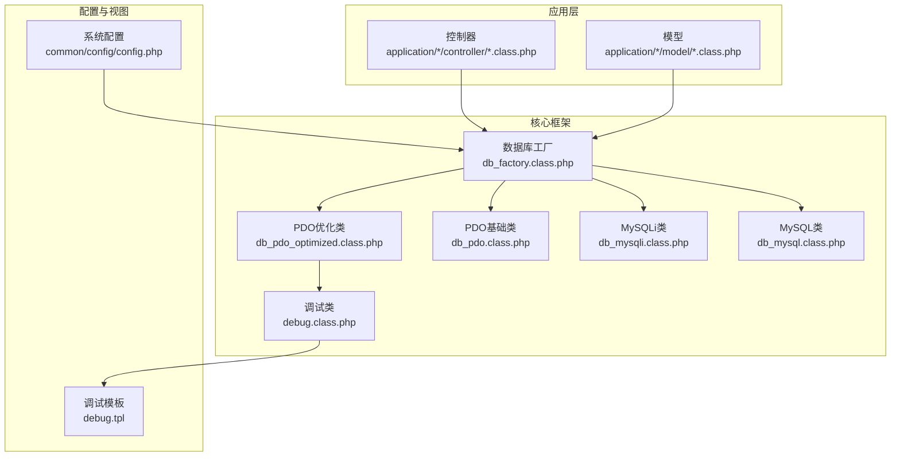
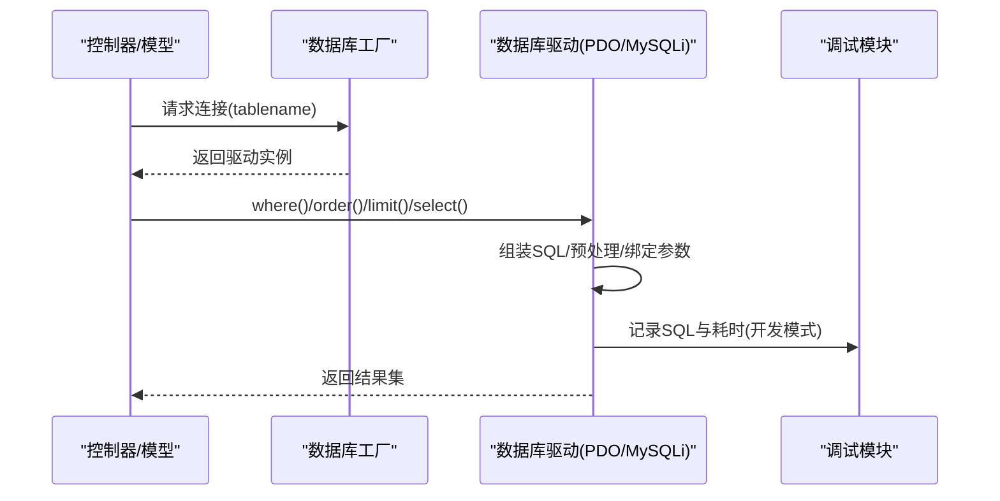
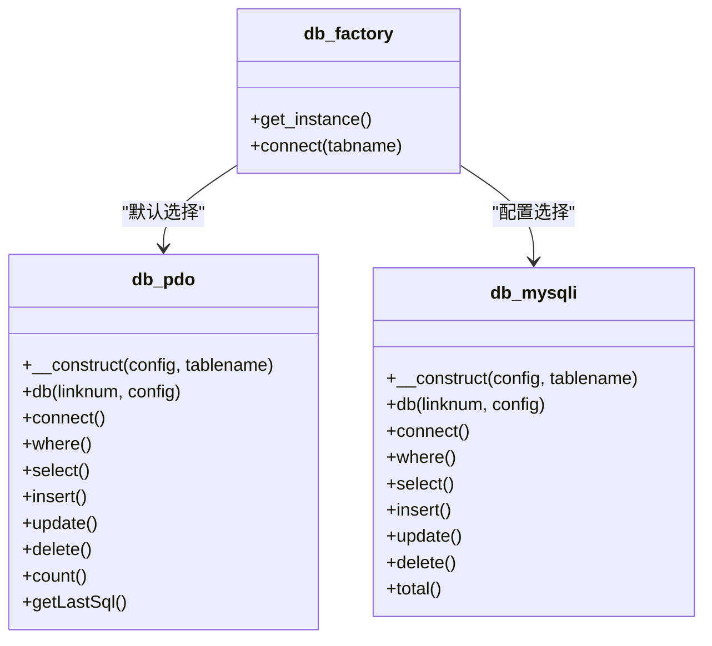
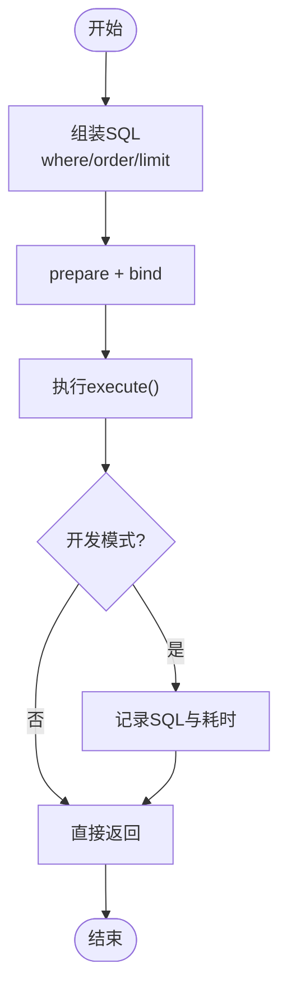
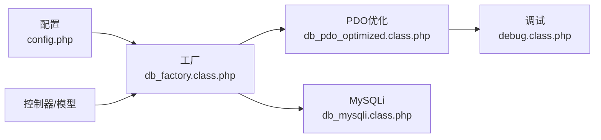
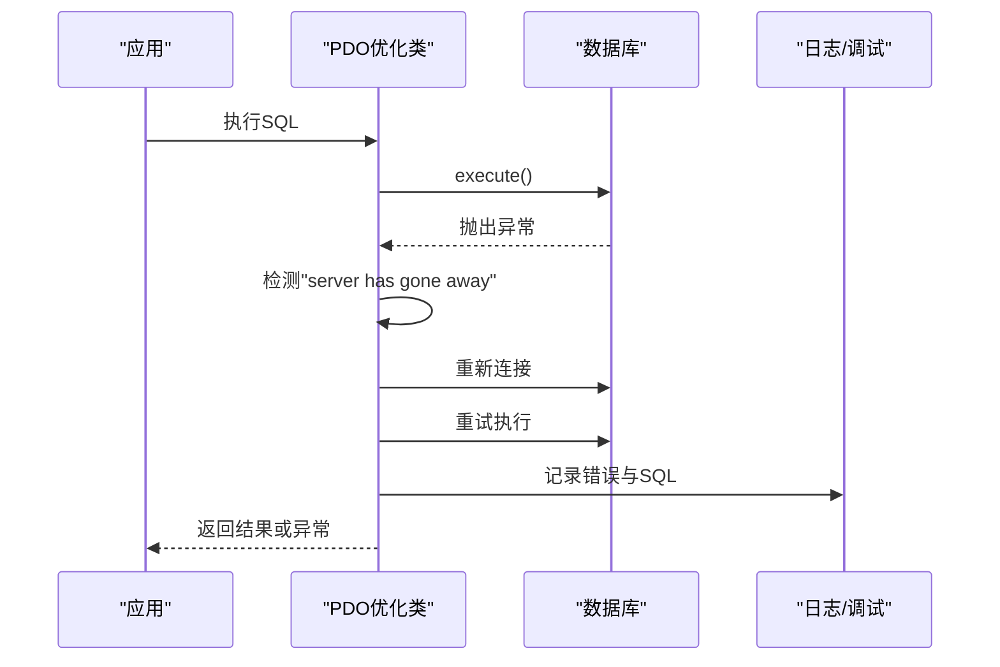

# 数据库性能优化

<cite>
**本文引用的文件**   
- [config.php](file://common/config/config.php)
- [db_factory.class.php](file://ryphp/core/class/db_factory.class.php)
- [db_pdo_optimized.class.php](file://ryphp/core/class/db_pdo_optimized.class.php)
- [db_pdo.class.php](file://ryphp/core/class/db_pdo.class.php)
- [db_mysql.class.php](file://ryphp/core/class/db_mysql.class.php)
- [db_mysqli.class.php](file://ryphp/core/class/db_mysqli.class.php)
- [debug.class.php](file://ryphp/core/class/debug.class.php)
- [debug.tpl](file://ryphp/core/message/debug.tpl)
- [index.class.php](file://application/index/controller/index.class.php)
- [admin.class.php](file://application/lry_admin_center/model/admin.class.php)
- [index.class.php](file://application/lry_admin_center/controller/index.class.php)
</cite>

## 目录
1. [简介](#简介)
2. [项目结构](#项目结构)
3. [核心组件](#核心组件)
4. [架构总览](#架构总览)
5. [详细组件分析](#详细组件分析)
6. [依赖关系分析](#依赖关系分析)
7. [性能考量](#性能考量)
8. [故障排查指南](#故障排查指南)
9. [结论](#结论)
10. [附录](#附录)

## 简介
本文件面向LRYBlog系统的数据库性能优化，围绕以下目标展开：
- 数据库查询优化策略：SQL语句优化、查询计划分析与执行效率提升
- 索引优化技术：索引设计原则、复合索引使用与索引维护策略
- 数据库连接池配置：连接复用、超时设置与并发控制
- 慢查询日志分析与性能监控方法
- 表结构优化建议：字段类型选择、范式设计与反范式应用
- 具体优化案例与性能测试工具使用指南

本文件基于仓库中的数据库抽象层、工厂类、PDO优化实现与调试工具进行分析，并结合控制器与模型中的典型查询场景给出优化建议。

## 项目结构
LRYBlog采用分层架构，数据库访问通过统一工厂类按配置选择具体驱动（PDO、mysqli、mysql），并提供ORM风格的链式查询接口；调试模块在开发模式下收集SQL执行信息，辅助定位性能瓶颈。

**图表来源**
- [db_factory.class.php:11-50](file://ryphp/core/class/db_factory.class.php#L11-L50)
- [db_pdo_optimized.class.php:13-80](file://ryphp/core/class/db_pdo_optimized.class.php#L13-L80)
- [db_pdo.class.php:26-42](file://ryphp/core/class/db_pdo.class.php#L26-L42)
- [db_mysqli.class.php:23-75](file://ryphp/core/class/db_mysqli.class.php#L23-L75)
- [db_mysql.class.php:23-50](file://ryphp/core/class/db_mysql.class.php#L23-L50)
- [debug.class.php:130-147](file://ryphp/core/class/debug.class.php#L130-L147)
- [config.php:13-22](file://common/config/config.php#L13-L22)

**章节来源**
- [db_factory.class.php:11-50](file://ryphp/core/class/db_factory.class.php#L11-L50)
- [config.php:13-22](file://common/config/config.php#L13-L22)

## 核心组件
- 数据库工厂：根据配置动态加载PDO/mysql/mysqli实现，统一对外接口
- PDO优化类：提供链式查询、预处理绑定、事务管理、错误处理与调试集成
- 调试模块：在开发模式下收集SQL执行信息，支持可视化展示
- 控制器与模型：通过D()与M()便捷调用数据库类，形成典型查询模式

**章节来源**
- [db_factory.class.php:11-50](file://ryphp/core/class/db_factory.class.php#L11-L50)
- [db_pdo_optimized.class.php:13-80](file://ryphp/core/class/db_pdo_optimized.class.php#L13-L80)
- [debug.class.php:130-147](file://ryphp/core/class/debug.class.php#L130-L147)

## 架构总览
数据库访问流程从控制器/模型发起，经由工厂类选择具体驱动，最终落到PDO或MySQLi实现；PDO优化类负责SQL拼装、预处理、执行与调试信息采集。

**图表来源**
- [db_factory.class.php:38-50](file://ryphp/core/class/db_factory.class.php#L38-L50)
- [db_pdo_optimized.class.php:180-208](file://ryphp/core/class/db_pdo_optimized.class.php#L180-L208)
- [debug.class.php:130-147](file://ryphp/core/class/debug.class.php#L130-L147)

## 详细组件分析

### 数据库工厂与驱动选择
- 工厂类依据配置选择驱动，默认使用PDO优化类
- 支持多连接池：通过db()方法按连接号切换，实现多库或多实例管理
- 驱动初始化时读取配置中的主机、端口、用户名、密码、字符集与表前缀

**图表来源**
- [db_factory.class.php:14-31](file://ryphp/core/class/db_factory.class.php#L14-L31)
- [db_pdo_optimized.class.php:74-119](file://ryphp/core/class/db_pdo_optimized.class.php#L74-L119)
- [db_mysqli.class.php:23-75](file://ryphp/core/class/db_mysqli.class.php#L23-L75)

**章节来源**
- [db_factory.class.php:11-50](file://ryphp/core/class/db_factory.class.php#L11-L50)
- [config.php:13-22](file://common/config/config.php#L13-L22)

### PDO优化类：查询构建与执行
- 链式API：where/order/limit/alias等方法组合查询条件
- 预处理与绑定：where数组自动转为占位符并绑定，避免拼接注入风险
- 调试集成：执行时记录SQL与耗时，开发模式下通过调试面板展示
- 错误处理：捕获断线重连、异常抛出与日志记录
- 事务支持：startTransaction/commit/rollback/inTransaction

**图表来源**
- [db_pdo_optimized.class.php:406-435](file://ryphp/core/class/db_pdo_optimized.class.php#L406-L435)
- [db_pdo_optimized.class.php:180-208](file://ryphp/core/class/db_pdo_optimized.class.php#L180-L208)
- [debug.class.php:130-147](file://ryphp/core/class/debug.class.php#L130-L147)

**章节来源**
- [db_pdo_optimized.class.php:328-435](file://ryphp/core/class/db_pdo_optimized.class.php#L328-L435)
- [db_pdo_optimized.class.php:180-208](file://ryphp/core/class/db_pdo_optimized.class.php#L180-L208)

### MySQLi类：传统实现与兼容性
- 支持where/wheres多种条件组装，兼容字符串条件
- 提供join、field、order、limit、group、having等链式方法
- 提供total/count统计与fetch_all/fetch_array结果集处理
- 事务通过autocommit控制

**章节来源**
- [db_mysqli.class.php:159-242](file://ryphp/core/class/db_mysqli.class.php#L159-L242)
- [db_mysqli.class.php:384-440](file://ryphp/core/class/db_mysqli.class.php#L384-L440)
- [db_mysqli.class.php:547-569](file://ryphp/core/class/db_mysqli.class.php#L547-L569)

### 调试与性能监控
- 调试类在开发模式下收集SQL列表与请求信息
- debug.tpl渲染调试面板，展示SQL与耗时
- 通过getLastSql()与调试面板可定位热点SQL

**章节来源**
- [debug.class.php:130-147](file://ryphp/core/class/debug.class.php#L130-L147)
- [debug.tpl:1-32](file://ryphp/core/message/debug.tpl#L1-L32)
- [db_pdo_optimized.class.php:764-767](file://ryphp/core/class/db_pdo_optimized.class.php#L764-L767)

### 典型查询场景与优化要点
- 控制器中常见查询模式：字段投影、条件筛选、排序与分页
- 模型中登录校验涉及多次查询与更新，注意事务与索引
- 建议：为高频条件字段建立合适索引，避免SELECT *，合理使用LIMIT

**章节来源**
- [index.class.php:14-17](file://application/index/controller/index.class.php#L14-L17)
- [admin.class.php:4-27](file://application/lry_admin_center/model/admin.class.php#L4-L27)

## 依赖关系分析
- 工厂类对驱动实现存在耦合，但对外屏蔽差异
- PDO优化类依赖调试模块进行开发期观测
- 控制器/模型通过D/M函数间接依赖工厂与驱动

**图表来源**
- [config.php:13-22](file://common/config/config.php#L13-L22)
- [db_factory.class.php:11-50](file://ryphp/core/class/db_factory.class.php#L11-L50)
- [db_pdo_optimized.class.php:13-80](file://ryphp/core/class/db_pdo_optimized.class.php#L13-L80)
- [debug.class.php:130-147](file://ryphp/core/class/debug.class.php#L130-L147)

**章节来源**
- [db_factory.class.php:11-50](file://ryphp/core/class/db_factory.class.php#L11-L50)

## 性能考量

### SQL语句优化策略
- 避免SELECT *：仅选择必要字段，减少网络与解析开销
- 合理使用LIMIT：对分页与列表查询设置上限，防止全表扫描
- 预处理绑定：利用PDO/MySQLi的绑定机制，降低SQL注入风险与编译次数
- 避免隐式类型转换：确保查询条件与索引字段类型一致

### 查询计划分析与执行效率提升
- 使用EXPLAIN分析关键SQL的执行计划，关注覆盖索引、避免全表扫描
- 识别慢查询：结合调试面板与日志，定位耗时SQL
- 分页优化：大偏移量分页成本高，考虑使用基于游标/索引的高效分页方案

### 索引优化技术
- 设计原则：高选择性、区分度高的列优先；前缀匹配与范围查询兼顾
- 复合索引：将最常用且选择性最高的列放在前面；遵循最左前缀原则
- 维护策略：定期重建/重组索引，监控索引使用率与碎片情况

### 数据库连接池配置
- 连接复用：通过工厂类的多连接号机制，实现多实例或多库管理
- 超时设置：根据业务特性调整连接超时与查询超时，避免长时间占用
- 并发控制：限制并发连接数，结合应用层限流与队列

### 慢查询日志与性能监控
- 开启慢查询日志：设定阈值，定期分析慢查询
- 监控指标：QPS、TPS、连接数、锁等待、缓冲池命中率
- 工具推荐：pt-query-digest、mysqldumpslow、Percona Toolkit

### 表结构优化建议
- 字段类型选择：优先使用更小且满足需求的类型；数值型避免使用字符串存储
- 范式设计：规范化减少冗余，但需权衡查询复杂度
- 反范式应用：对高频读场景适度冗余，配合缓存与异步更新

### 具体优化案例与工具使用
- 案例：登录模型中对adminname的唯一性检查与最近失败记录统计，建议为adminname建立唯一索引，并对登录日志表按时间分区或归档
- 工具：使用调试面板定位热点SQL，结合EXPLAIN与慢查询日志进行根因分析

**章节来源**
- [db_pdo_optimized.class.php:328-435](file://ryphp/core/class/db_pdo_optimized.class.php#L328-L435)
- [admin.class.php:4-27](file://application/lry_admin_center/model/admin.class.php#L4-L27)

## 故障排查指南
- 断线重连：PDO优化类在检测到“server has gone away”时自动重连
- 错误日志：非调试模式下写入错误日志，AJAX请求返回统一JSON结构
- 调试面板：开发模式下显示SQL与耗时，便于快速定位问题

**图表来源**
- [db_pdo_optimized.class.php:201-208](file://ryphp/core/class/db_pdo_optimized.class.php#L201-L208)
- [db_pdo_optimized.class.php:216-233](file://ryphp/core/class/db_pdo_optimized.class.php#L216-L233)

**章节来源**
- [db_pdo_optimized.class.php:201-233](file://ryphp/core/class/db_pdo_optimized.class.php#L201-L233)
- [debug.class.php:130-147](file://ryphp/core/class/debug.class.php#L130-L147)

## 结论
通过对LRYBlog数据库抽象层与工厂类的分析可知，系统已具备良好的可扩展性与可观测性。建议在现有基础上：
- 强化索引设计与维护，结合EXPLAIN与慢查询日志持续优化
- 规范SQL编写，减少全表扫描与不必要的字段读取
- 完善连接池与并发控制策略，保障高并发下的稳定性
- 将调试面板与日志体系常态化，形成闭环的性能监控与优化流程

## 附录
- 配置项参考：数据库类型、主机、端口、用户名、密码、字符集、表前缀
- 调试面板入口：在控制器中调用debug()即可在页面底部展示SQL与耗时

**章节来源**
- [config.php:13-22](file://common/config/config.php#L13-L22)
- [index.class.php:120-128](file://application/lry_admin_center/controller/index.class.php#L120-L128)