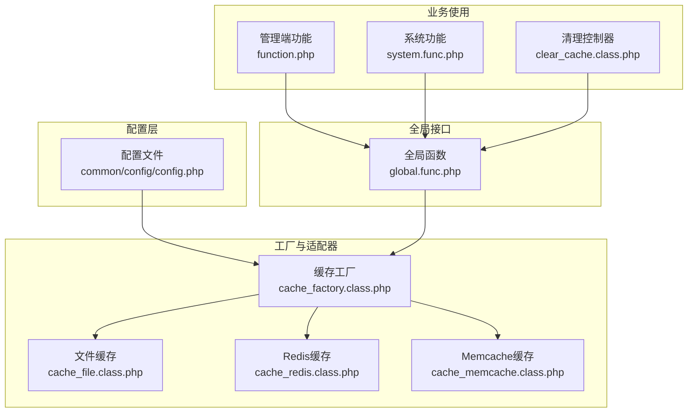
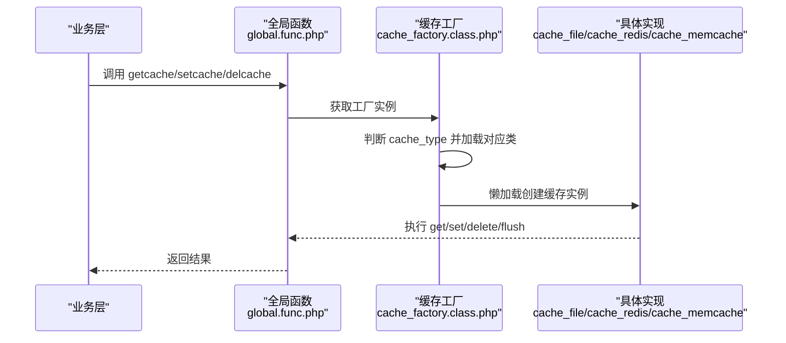
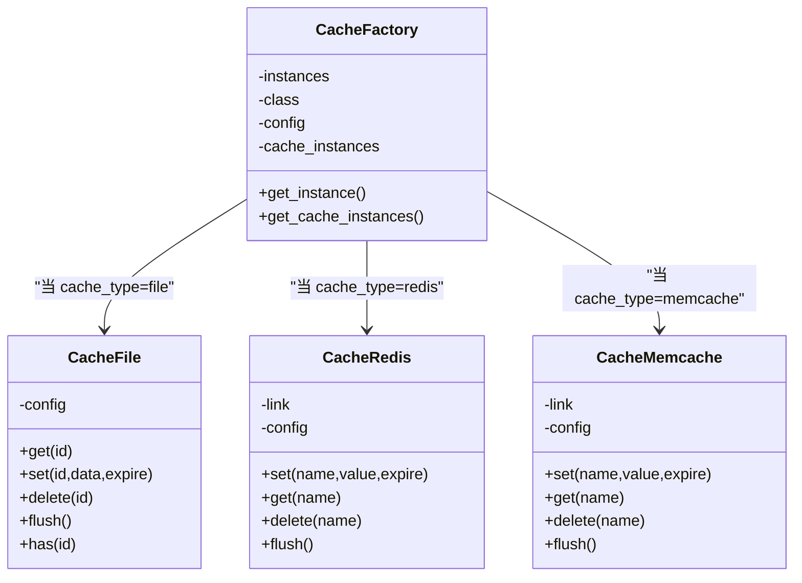
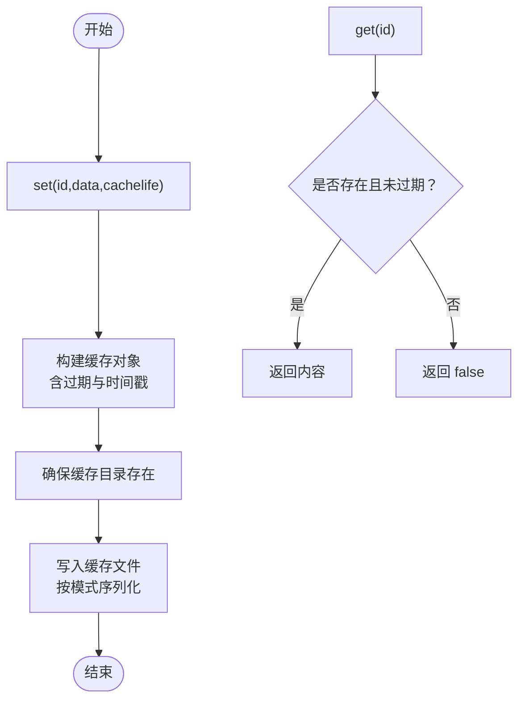
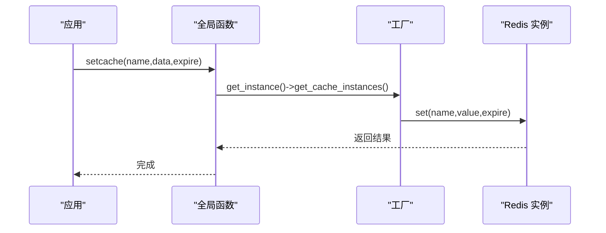
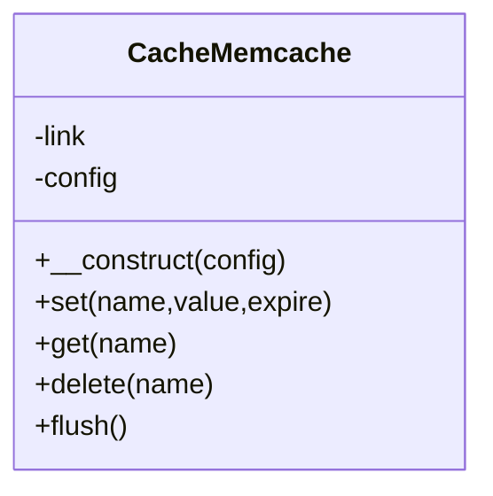
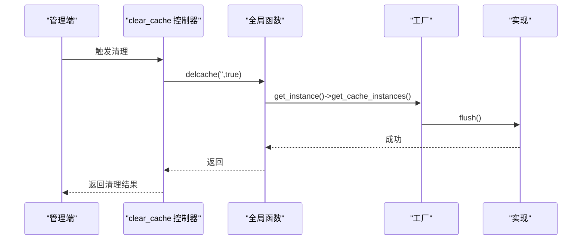
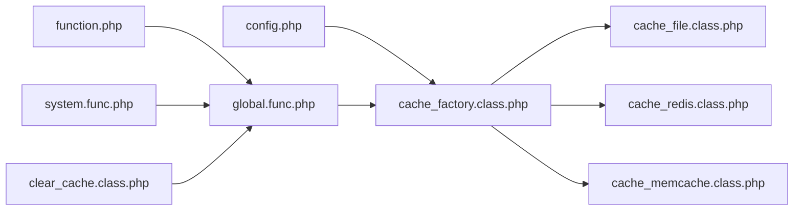

# 缓存策略配置

<cite>
**本文引用的文件**
- [cache_factory.class.php](file://ryphp/core/class/cache_factory.class.php)
- [cache_file.class.php](file://ryphp/core/class/cache_file.class.php)
- [cache_redis.class.php](file://ryphp/core/class/cache_redis.class.php)
- [cache_memcache.class.php](file://ryphp/core/class/cache_memcache.class.php)
- [config.php](file://common/config/config.php)
- [global.func.php](file://ryphp/core/function/global.func.php)
- [clear_cache.class.php](file://application/lry_admin_center/controller/clear_cache.class.php)
- [function.php](file://application/lry_admin_center/common/function/function.php)
- [system.func.php](file://common/function/system.func.php)
</cite>

## 目录
1. [简介](#简介)
2. [项目结构](#项目结构)
3. [核心组件](#核心组件)
4. [架构总览](#架构总览)
5. [组件详解](#组件详解)
6. [依赖关系分析](#依赖关系分析)
7. [性能考量](#性能考量)
8. [故障排除指南](#故障排除指南)
9. [结论](#结论)
10. [附录](#附录)

## 简介
本技术指南围绕 LRYBlog 的缓存策略配置展开，目标是帮助运维与开发人员理解并优化系统的缓存体系。文档重点覆盖：
- 工厂模式与懒加载的缓存工厂实现
- 文件缓存配置（目录、过期与清理策略）
- Redis 缓存集成（连接、内存与持久化）
- Memcache 缓存配置（集群与一致性哈希）
- 缓存命中率优化（预热、失效与更新）
- 性能监控与故障排除

## 项目结构
缓存相关代码主要分布在以下模块：
- 缓存工厂与适配器：ryphp/core/class/cache_factory.class.php、cache_file.class.php、cache_redis.class.php、cache_memcache.class.php
- 全局缓存接口：ryphp/core/function/global.func.php（getcache/setcache/delcache）
- 配置中心：common/config/config.php（cache_type、file_config、redis_config、memcache_config）
- 使用示例：application/lry_admin_center/common/function/function.php、common/function/system.func.php
- 管理端清理入口：application/lry_admin_center/controller/clear_cache.class.php

图表来源
- [config.php:39-66](file://common/config/config.php#L39-L66)
- [cache_factory.class.php:36-82](file://ryphp/core/class/cache_factory.class.php#L36-L82)
- [global.func.php:147-1521](file://ryphp/core/function/global.func.php#L147-L1523)
- [function.php:55-80](file://application/lry_admin_center/common/function/function.php#L55-L80)
- [system.func.php:120-151](file://common/function/system.func.php#L120-L151)
- [clear_cache.class.php:9-24](file://application/lry_admin_center/controller/clear_cache.class.php#L9-L24)

章节来源
- [config.php:39-66](file://common/config/config.php#L39-L66)
- [cache_factory.class.php:36-82](file://ryphp/core/class/cache_factory.class.php#L36-L82)
- [global.func.php:147-1523](file://ryphp/core/function/global.func.php#L147-L1523)

## 核心组件
- 缓存工厂（工厂模式 + 懒加载）
  - 依据配置选择具体缓存实现（file/redis/memcache）
  - 单例持有工厂实例，延迟实例化具体缓存类
- 文件缓存
  - 基于文件系统存储，支持过期时间与两种序列化模式
  - 提供 flush 清理与 has 存在性检测
- Redis 缓存
  - 支持连接、认证、库选择、前缀、过期与持久化
  - set/get/delete/flush 基础操作
- Memcache 缓存
  - 支持添加服务器、前缀、过期与持久化
  - set/get/delete/flush 基础操作
- 全局接口
  - getcache/setcache/delcache 统一调用入口
- 配置中心
  - cache_type 决定缓存类型
  - file_config/redis_config/memcache_config 分别承载各实现配置

章节来源
- [cache_factory.class.php:36-82](file://ryphp/core/class/cache_factory.class.php#L36-L82)
- [cache_file.class.php:5-130](file://ryphp/core/class/cache_file.class.php#L5-L130)
- [cache_redis.class.php:30-108](file://ryphp/core/class/cache_redis.class.php#L30-L108)
- [cache_memcache.class.php:27-91](file://ryphp/core/class/cache_memcache.class.php#L27-L91)
- [global.func.php:147-1523](file://ryphp/core/function/global.func.php#L147-L1523)
- [config.php:39-66](file://common/config/config.php#L39-L66)

## 架构总览
缓存调用链路如下：业务层通过全局函数触发缓存操作；工厂根据配置选择具体实现；实现类负责与底层存储交互。

图表来源
- [global.func.php:147-1523](file://ryphp/core/function/global.func.php#L147-L1523)
- [cache_factory.class.php:36-82](file://ryphp/core/class/cache_factory.class.php#L36-L82)
- [cache_file.class.php:17-46](file://ryphp/core/class/cache_file.class.php#L17-L46)
- [cache_redis.class.php:60-105](file://ryphp/core/class/cache_redis.class.php#L60-L105)
- [cache_memcache.class.php:47-89](file://ryphp/core/class/cache_memcache.class.php#L47-L89)

## 组件详解

### 工厂模式与懒加载
- 单例工厂
  - 类属性保存实例、类名与配置，避免重复加载
  - get_instance 在首次调用时按配置分支加载具体类
- 懒加载缓存实例
  - get_cache_instances 首次调用时才实例化具体缓存类，减少启动开销
- 配置驱动
  - cache_type 决定分支；默认回退到 file 实现

图表来源
- [cache_factory.class.php:36-82](file://ryphp/core/class/cache_factory.class.php#L36-L82)
- [cache_file.class.php:5-130](file://ryphp/core/class/cache_file.class.php#L5-L130)
- [cache_redis.class.php:30-108](file://ryphp/core/class/cache_redis.class.php#L30-L108)
- [cache_memcache.class.php:27-91](file://ryphp/core/class/cache_memcache.class.php#L27-L91)

章节来源
- [cache_factory.class.php:36-82](file://ryphp/core/class/cache_factory.class.php#L36-L82)

### 文件缓存配置与清理策略
- 配置要点
  - cache_dir：缓存根目录（默认位于 cache/cache_file/）
  - suffix：缓存文件后缀（默认 .cache.php）
  - mode：序列化模式（1 序列化；2 可执行数组文件）
- 过期机制
  - set 支持 cachelife（秒）；get 会在过期或永久有效时返回内容
- 清理策略
  - flush 遍历目录并逐个删除
  - has 用于存在性检测
- 目录权限
  - set 会自动创建目录（若不存在）

图表来源
- [cache_file.class.php:34-46](file://ryphp/core/class/cache_file.class.php#L34-L46)
- [cache_file.class.php:17-29](file://ryphp/core/class/cache_file.class.php#L17-L29)
- [cache_file.class.php:61-73](file://ryphp/core/class/cache_file.class.php#L61-L73)
- [cache_file.class.php:75-82](file://ryphp/core/class/cache_file.class.php#L75-L82)

章节来源
- [cache_file.class.php:5-130](file://ryphp/core/class/cache_file.class.php#L5-L130)
- [config.php:42-46](file://common/config/config.php#L42-L46)

### Redis 缓存集成
- 连接配置
  - host/port/password/select/timeout/persistent
- 内存与过期
  - expire：默认过期秒数
  - set 支持 expire=0（永久）与带过期的 setex
- 持久化建议
  - 生产环境建议启用 RDB/AOF 持久化策略（由 Redis 服务端配置决定）
- 前缀
  - prefix 用于隔离命名空间，避免键冲突

图表来源
- [global.func.php:585-589](file://ryphp/core/function/global.func.php#L585-L589)
- [cache_redis.class.php:30-51](file://ryphp/core/class/cache_redis.class.php#L30-L51)
- [cache_redis.class.php:60-72](file://ryphp/core/class/cache_redis.class.php#L60-L72)

章节来源
- [cache_redis.class.php:30-108](file://ryphp/core/class/cache_redis.class.php#L30-L108)
- [config.php:48-57](file://common/config/config.php#L48-L57)

### Memcache 缓存配置
- 服务器配置
  - host/port/persistent/timeout
- 过期与前缀
  - expire：默认过期秒数
  - prefix：键前缀
- 一致性哈希
  - 当前实现通过 addServer 添加单一节点；如需集群与一致性哈希，可在构造函数中多次 addServer 并结合客户端一致性哈希策略（需自行扩展）

图表来源
- [cache_memcache.class.php:27-91](file://ryphp/core/class/cache_memcache.class.php#L27-L91)

章节来源
- [cache_memcache.class.php:27-91](file://ryphp/core/class/cache_memcache.class.php#L27-L91)
- [config.php:59-66](file://common/config/config.php#L59-L66)

### 缓存使用与清理入口
- 全局接口
  - getcache：读取缓存
  - setcache：写入缓存（支持过期）
  - delcache：删除指定或清空所有
- 业务使用示例
  - 管理端菜单缓存：按角色 ID 缓存菜单 HTML 片段
  - 系统模型信息缓存：按站点 ID 缓存模型列表
- 管理端清理
  - 清理模板编译缓存与业务缓存

图表来源
- [clear_cache.class.php:9-24](file://application/lry_admin_center/controller/clear_cache.class.php#L9-L24)
- [global.func.php:1519-1523](file://ryphp/core/function/global.func.php#L1519-L1523)
- [cache_file.class.php:61-73](file://ryphp/core/class/cache_file.class.php#L61-L73)
- [cache_redis.class.php:103-105](file://ryphp/core/class/cache_redis.class.php#L103-L105)
- [cache_memcache.class.php:87-89](file://ryphp/core/class/cache_memcache.class.php#L87-L89)

章节来源
- [global.func.php:147-1523](file://ryphp/core/function/global.func.php#L147-L1523)
- [function.php:55-80](file://application/lry_admin_center/common/function/function.php#L55-L80)
- [system.func.php:120-151](file://common/function/system.func.php#L120-L151)
- [clear_cache.class.php:9-24](file://application/lry_admin_center/controller/clear_cache.class.php#L9-L24)

## 依赖关系分析
- 配置依赖
  - config.php 提供 cache_type 与各类配置数组
- 运行时依赖
  - global.func.php 依赖工厂类进行统一调度
  - 各业务模块通过全局函数间接依赖具体实现
- 清理依赖
  - clear_cache 控制器依赖全局 delcache 接口

图表来源
- [config.php:39-66](file://common/config/config.php#L39-L66)
- [cache_factory.class.php:36-82](file://ryphp/core/class/cache_factory.class.php#L36-L82)
- [global.func.php:147-1523](file://ryphp/core/function/global.func.php#L147-L1523)
- [function.php:55-80](file://application/lry_admin_center/common/function/function.php#L55-L80)
- [system.func.php:120-151](file://common/function/system.func.php#L120-L151)
- [clear_cache.class.php:9-24](file://application/lry_admin_center/controller/clear_cache.class.php#L9-L24)

章节来源
- [config.php:39-66](file://common/config/config.php#L39-L66)
- [cache_factory.class.php:36-82](file://ryphp/core/class/cache_factory.class.php#L36-L82)
- [global.func.php:147-1523](file://ryphp/core/function/global.func.php#L147-L1523)

## 性能考量
- 命中率优化
  - 缓存预热：在系统启动或低峰期批量写入热点数据（如菜单、模型信息）
  - 失效策略：采用“写后失效”或“写后刷新”，避免脏读
  - 更新机制：集中式更新入口，确保一致性（参考业务控制器中的 delcache 调用）
- 文件缓存
  - 选择合适序列化模式（mode）与缓存目录磁盘性能
  - 定期清理过期文件，避免目录膨胀
- Redis
  - 合理设置过期时间与内存上限，启用持久化
  - 使用前缀隔离不同环境与租户
- Memcache
  - 如需高可用与一致性，建议引入客户端一致性哈希或使用集群方案（需扩展实现）

## 故障排除指南
- 无法加载缓存扩展
  - Redis/Memcache 扩展未安装或未启用：工厂构造函数会抛出提示
- 权限问题
  - 文件缓存目录不可写：清理控制器会返回权限错误提示
- 连接异常
  - Redis/Memcache 主机/端口错误或网络不通：检查配置与防火墙
- 命中率低
  - 热点数据未预热、过期时间过短、键前缀冲突
- 清理无效
  - 确认调用 delcache('',true) 是否正确传递 flush 标记

章节来源
- [cache_redis.class.php:31-33](file://ryphp/core/class/cache_redis.class.php#L31-L33)
- [cache_memcache.class.php:28-30](file://ryphp/core/class/cache_memcache.class.php#L28-L30)
- [clear_cache.class.php:10-12](file://application/lry_admin_center/controller/clear_cache.class.php#L10-L12)

## 结论
LRYBlog 的缓存体系通过工厂模式与懒加载实现了对多种后端的统一抽象，配合全局接口与集中配置，既保证了灵活性，也便于运维维护。建议在生产环境中：
- 明确 cache_type 并完善对应配置
- 对热点数据实施预热与合理的过期策略
- 建立定期清理与监控机制
- 针对 Redis/Memcache 做好连接、内存与持久化规划

## 附录
- 配置项速查
  - cache_type：file/redis/memcache
  - file_config：cache_dir、suffix、mode
  - redis_config：host、port、password、select、timeout、expire、persistent、prefix
  - memcache_config：host、port、timeout、expire、persistent、prefix

章节来源
- [config.php:39-66](file://common/config/config.php#L39-L66)