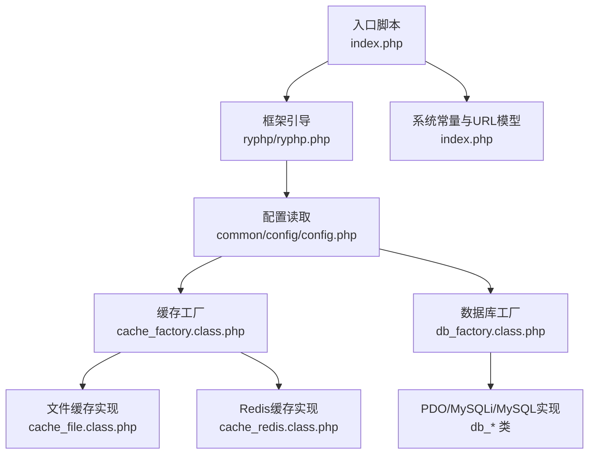
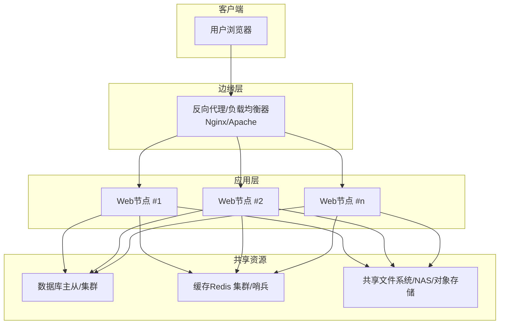
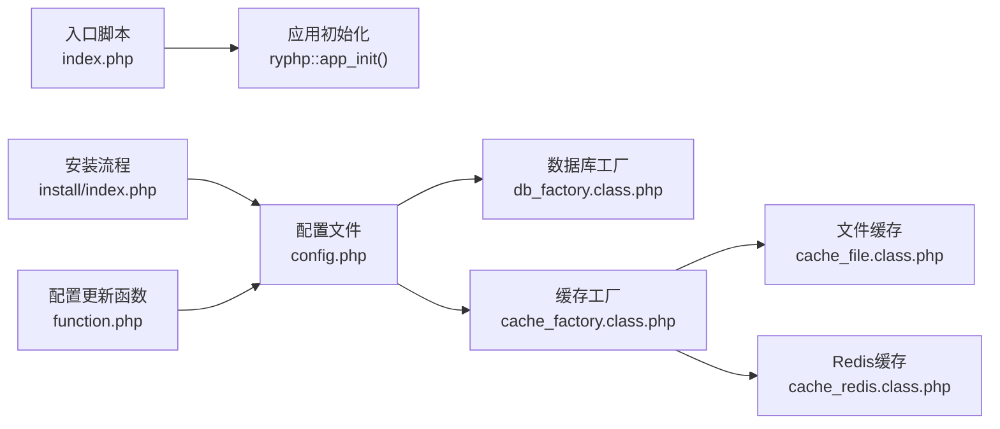

# 负载均衡配置

<cite>
**本文引用的文件**
- [index.php](file://index.php)
- [config.php](file://common/config/config.php)
- [global.func.php](file://ryphp/core/function/global.func.php)
- [cache_factory.class.php](file://ryphp/core/class/cache_factory.class.php)
- [cache_file.class.php](file://ryphp/core/class/cache_file.class.php)
- [cache_redis.class.php](file://ryphp/core/class/cache_redis.class.php)
- [db_factory.class.php](file://ryphp/core/class/db_factory.class.php)
- [function.php](file://application/lry_admin_center/common/function/function.php)
- [index.php](file://application/install/index.php)
- [lry_action.php](file://common/static/plugin/ueditor/php/lry_action.php)
- [snapscreen.html](file://common/static/plugin/ueditor/dialogs/snapscreen/snapscreen.html)
- [digg.js](file://common/static/js/digg.js)
- [DNS_FIX.md](file://DNS_FIX.md)
- [README.md](file://README.md)
</cite>

## 目录
1. [引言](#引言)
2. [项目结构](#项目结构)
3. [核心组件](#核心组件)
4. [架构总览](#架构总览)
5. [详细组件分析](#详细组件分析)
6. [依赖关系分析](#依赖关系分析)
7. [性能考虑](#性能考虑)
8. [故障排查指南](#故障排查指南)
9. [结论](#结论)
10. [附录](#附录)

## 引言
本指南面向LRYBlog在生产环境下的负载均衡与高可用部署，围绕反向代理（Nginx/Apache）、多服务器部署策略（会话共享、数据库同步、文件同步）、健康检查与自动故障转移、SSL证书与HTTPS负载均衡、水平扩展（微服务与容器化）、以及性能监控与日志分析进行系统性说明。文档基于仓库现有PHP框架与配置文件进行落地解读，帮助运维团队快速搭建稳定可靠的线上系统。

## 项目结构
LRYBlog采用单入口与模块化结构，前端通过入口脚本引导框架初始化，配置集中于common/config目录，核心运行时逻辑位于ryphp目录，管理后台与前台视图分别位于application目录。

图表来源
- [index.php:10-18](file://index.php#L10-L18)
- [config.php:13-21](file://common/config/config.php#L13-L21)
- [cache_factory.class.php:36-63](file://ryphp/core/class/cache_factory.class.php#L36-L63)
- [db_factory.class.php:11-34](file://ryphp/core/class/db_factory.class.php#L11-L34)
- [cache_file.class.php:1-130](file://ryphp/core/class/cache_file.class.php#L1-L130)
- [cache_redis.class.php:1-108](file://ryphp/core/class/cache_redis.class.php#L1-L108)

章节来源
- [index.php:10-18](file://index.php#L10-L18)
- [config.php:1-88](file://common/config/config.php#L1-L88)

## 核心组件
- 入口与引导
  - 单一入口脚本负责定义根路径、加载框架、设置URL模式并初始化应用。
- 配置中心
  - 统一存放数据库、缓存、Cookie、路由、上传等配置，支持按需切换缓存后端（file/redis/memcache）。
- 缓存层
  - 工厂模式根据配置选择具体缓存实现；文件缓存适合单机或共享存储场景；Redis适合分布式共享缓存。
- 数据访问层
  - 工厂模式根据配置选择PDO/MySQLi/MySQL实现，统一构造连接参数。
- 安装与配置变更
  - 提供安装流程中的配置写入与通用配置更新函数，便于自动化部署。

章节来源
- [index.php:10-18](file://index.php#L10-L18)
- [config.php:13-88](file://common/config/config.php#L13-L88)
- [cache_factory.class.php:36-63](file://ryphp/core/class/cache_factory.class.php#L36-L63)
- [cache_file.class.php:1-130](file://ryphp/core/class/cache_file.class.php#L1-L130)
- [cache_redis.class.php:1-108](file://ryphp/core/class/cache_redis.class.php#L1-L108)
- [db_factory.class.php:11-34](file://ryphp/core/class/db_factory.class.php#L11-L34)
- [function.php:90-102](file://application/lry_admin_center/common/function/function.php#L90-L102)
- [index.php:321-335](file://application/install/index.php#L321-L335)

## 架构总览
下图展示LRYBlog在负载均衡场景下的典型拓扑：客户端经反向代理（Nginx/Apache）分发至多个Web节点，Web节点通过统一配置访问共享数据库与共享缓存（如Redis），静态资源可由CDN或NFS共享挂载。

## 详细组件分析

### 反向代理与负载均衡（Nginx/Apache）
- Nginx
  - 建议启用轮询或IP哈希策略，结合健康检查与故障转移。
  - 对静态资源（CSS/JS/图片）设置长缓存与压缩，对动态请求转发至后端节点。
  - 在上游配置中开启keepalive以降低TCP/TLS握手开销。
- Apache
  - 使用mod_proxy_balancer与balancer-manager监控后端状态。
  - 结合ProxySet与Timeout参数控制连接与响应超时。
- 会话与Cookie
  - 若采用粘性会话（IP哈希/Cookie），需确保会话一致性；否则应使用共享缓存（Redis）存储会话数据。
  - Cookie配置建议启用安全标志位（Secure/HttpOnly），并设置SameSite策略。

[本节为概念性说明，未直接分析具体源码文件]

### 多服务器部署策略
- 会话共享
  - 使用Redis作为共享会话存储，避免粘性会话带来的单点风险。
- 数据库同步
  - 主从复制或集群（Galera/Group Replication）保障高可用与读扩展；写操作路由至主库，读请求分发至从库。
- 文件同步
  - 静态资源与上传文件建议使用共享存储（NFS/GlusterFS）或对象存储（S3兼容），确保各节点一致可见。

[本节为概念性说明，未直接分析具体源码文件]

### 健康检查与自动故障转移
- 健康检查
  - Web层：暴露轻量级探针接口（如/health），返回200即视为存活。
  - 数据库/缓存：定时探测连通性与延迟阈值。
- 故障转移
  - Nginx/Apache配置down标记与重试次数；结合外部编排（如Keepalived/K8s）实现VIP漂移或Pod替换。

[本节为概念性说明，未直接分析具体源码文件]

### SSL证书与HTTPS负载均衡
- 终端TLS
  - 在反向代理层终止TLS，统一证书管理与OCSP Stapling。
- 证书更新
  - 使用ACME客户端自动续期；结合自动化脚本与监控告警。
- 会话复用与安全
  - 启用TLS会话复用与现代密码套件；配置HSTS与安全响应头。

[本节为概念性说明，未直接分析具体源码文件]

### 水平扩展方案（微服务与容器化）
- 微服务拆分
  - 将内容管理、用户中心、评论、搜索等功能模块化，独立发布与扩缩容。
- 容器化
  - 使用Docker封装应用镜像；Kubernetes管理Pod、Service、Ingress与Helm发布。
- 配置与密钥
  - 使用ConfigMap与Secret管理配置与敏感信息；避免硬编码。

[本节为概念性说明，未直接分析具体源码文件]

### 性能监控与日志分析
- 指标采集
  - Web层：Nginx/Apache访问日志与状态页；应用层：业务埋点与APM（如Prometheus/OpenTelemetry）。
  - 数据库：慢查询日志、QPS/TPS、连接数与锁等待。
- 日志分析
  - 使用ELK/EFK收集与检索；建立告警规则（错误率、P95/P99延迟、连接池耗尽）。
- 资源监控
  - CPU/内存/磁盘IO/网络带宽；容器环境关注Pod重启与资源配额。

[本节为概念性说明，未直接分析具体源码文件]

## 依赖关系分析
LRYBlog的运行时依赖主要体现在入口脚本对框架的引导、配置读取对数据库与缓存的影响，以及安装/配置更新对配置文件的写入。

图表来源
- [index.php:10-18](file://index.php#L10-L18)
- [config.php:13-88](file://common/config/config.php#L13-L88)
- [db_factory.class.php:11-34](file://ryphp/core/class/db_factory.class.php#L11-L34)
- [cache_factory.class.php:36-63](file://ryphp/core/class/cache_factory.class.php#L36-L63)
- [cache_file.class.php:1-130](file://ryphp/core/class/cache_file.class.php#L1-L130)
- [cache_redis.class.php:1-108](file://ryphp/core/class/cache_redis.class.php#L1-L108)
- [index.php:321-335](file://application/install/index.php#L321-L335)
- [function.php:90-102](file://application/lry_admin_center/common/function/function.php#L90-L102)

章节来源
- [index.php:10-18](file://index.php#L10-L18)
- [config.php:13-88](file://common/config/config.php#L13-L88)
- [cache_factory.class.php:36-63](file://ryphp/core/class/cache_factory.class.php#L36-L63)
- [cache_file.class.php:1-130](file://ryphp/core/class/cache_file.class.php#L1-L130)
- [cache_redis.class.php:1-108](file://ryphp/core/class/cache_redis.class.php#L1-L108)
- [db_factory.class.php:11-34](file://ryphp/core/class/db_factory.class.php#L11-L34)
- [function.php:90-102](file://application/lry_admin_center/common/function/function.php#L90-L102)
- [index.php:321-335](file://application/install/index.php#L321-L335)

## 性能考虑
- 缓存策略
  - 优先使用Redis作为分布式缓存，缩短热点数据访问路径；对静态模板与查询结果进行合理过期。
- 数据库优化
  - 读写分离与索引优化；避免N+1查询；使用连接池与长连接减少开销。
- 静态资源
  - CDN加速与Gzip/Brotli压缩；浏览器缓存与ETag配合。
- 应用层
  - 合理设置超时与并发；避免阻塞I/O；使用OPcache提升PHP执行效率。

[本节为通用指导，未直接分析具体源码文件]

## 故障排查指南
- 配置写入权限
  - 配置更新函数要求目标文件具备写权限，若失败请检查文件权限与SELinux/AppArmor策略。
- 安装流程中的HTTPS检测
  - 安装脚本内置HTTPS判断逻辑，可辅助定位代理层是否正确传递协议头。
- 伪静态与PATHINFO
  - 当使用Nginx时，如需PATHINFO模式，需在配置中启用相应选项以匹配系统设置。
- DNS解析问题
  - 若遇到解析异常，可参考DNS修复文档提供的公共DNS列表与测试命令进行验证与切换。

章节来源
- [function.php:90-102](file://application/lry_admin_center/common/function/function.php#L90-L102)
- [index.php:346-373](file://application/install/index.php#L346-L373)
- [config.php:10-11](file://common/config/config.php#L10-L11)
- [DNS_FIX.md:1-37](file://DNS_FIX.md#L1-L37)

## 结论
通过在反向代理层实施合理的负载均衡策略、在应用层采用共享缓存与数据库高可用、在部署层实现文件共享与自动化配置更新，并辅以完善的健康检查与监控体系，LRYBlog可在生产环境中实现高可用、高性能与易维护的线上交付。建议结合容器化与微服务理念进一步增强弹性与可扩展性。

## 附录
- 快速检查清单
  - 反向代理：健康检查、故障转移、静态资源缓存与压缩。
  - 应用层：Redis/共享缓存、数据库读写分离、配置热更新。
  - 存储：共享文件系统/对象存储、备份与恢复演练。
  - 安全：TLS终端、证书自动续期、安全响应头与Cookie策略。
  - 监控：指标采集、日志聚合、告警与值班流程。

[本节为通用指导，未直接分析具体源码文件]