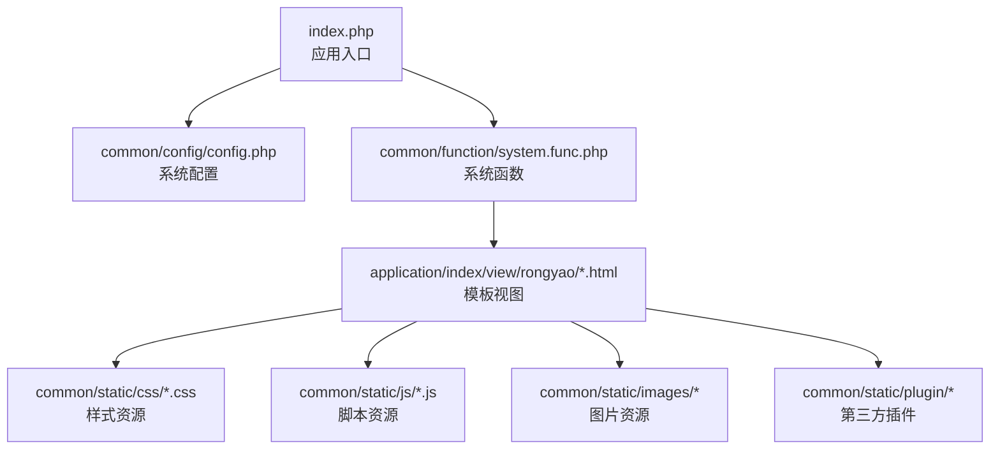
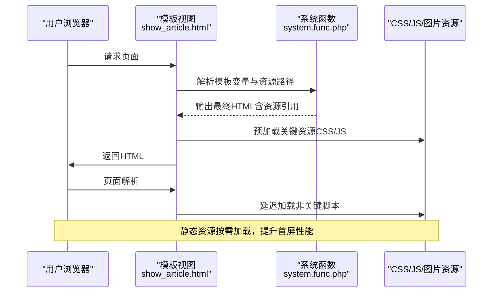
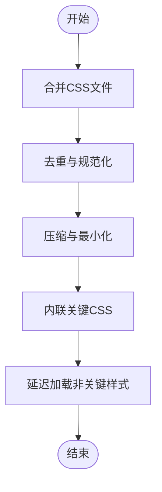
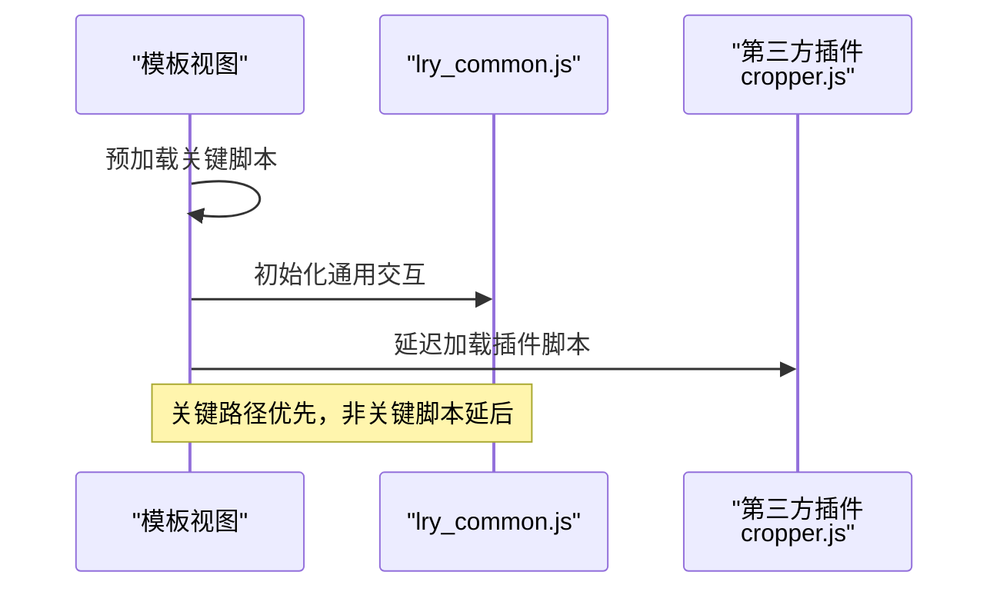
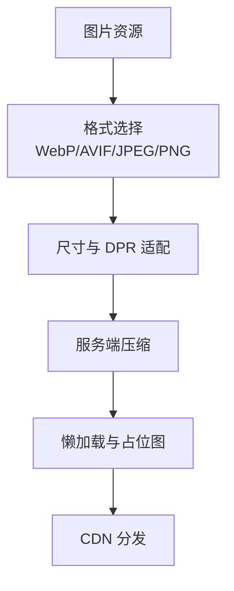
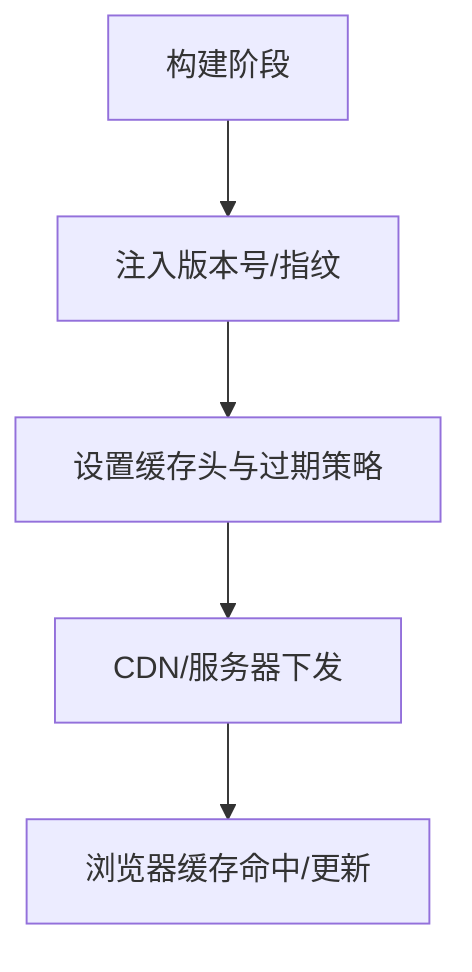
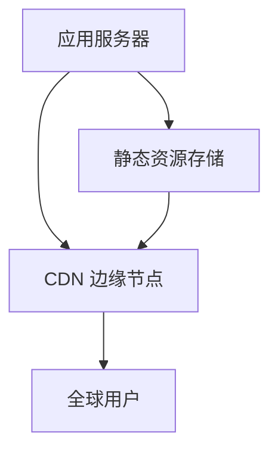
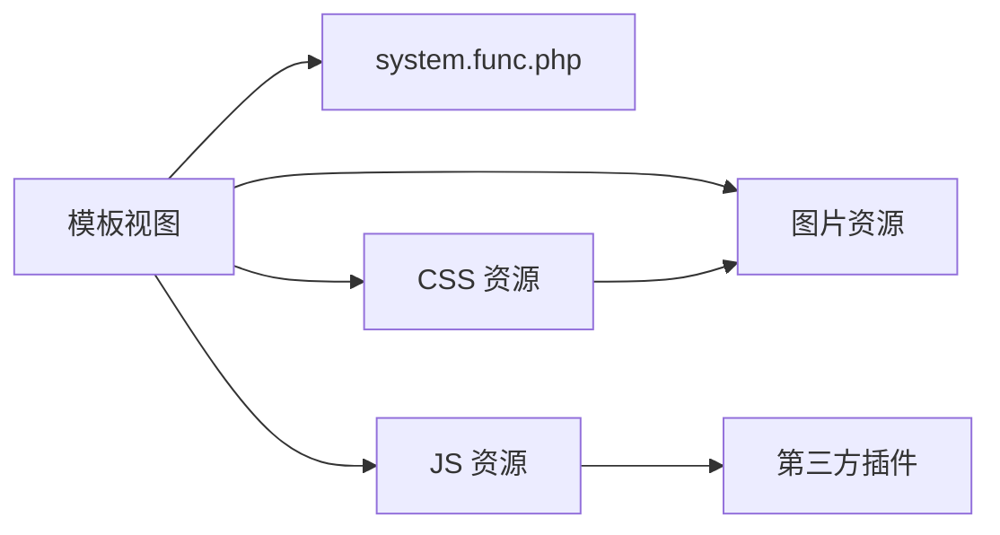

# 静态资源优化

<cite>
**本文引用的文件**   
- [index.php](file://index.php)
- [config.php](file://common/config/config.php)
- [version.php](file://common/data/version.php)
- [default_style.css](file://common/static/css/default_style.css)
- [lry-style.css](file://common/static/css/lry-style.css)
- [lry_common.js](file://common/static/js/lry_common.js)
- [system.func.php](file://common/function/system.func.php)
- [show_article.html](file://application/index/view/rongyao/show_article.html)
- [category_page.html](file://application/index/view/rongyao/category_page.html)
- [list_article.html](file://application/index/view/rongyao/list_article.html)
- [config.php（主题配置）](file://application/index/view/rongyao/config.php)
- [cropper.js](file://common/static/plugin/cropper/3.1.6/cropper.js)
- [DD_belatedPNG_0.0.8a-min.js](file://common/static/plugin/DD_belatedPNG_0.0.8a-min.js)
</cite>

## 目录
1. [引言](#引言)
2. [项目结构](#项目结构)
3. [核心组件](#核心组件)
4. [架构总览](#架构总览)
5. [详细组件分析](#详细组件分析)
6. [依赖关系分析](#依赖关系分析)
7. [性能考量](#性能考量)
8. [故障排查指南](#故障排查指南)
9. [结论](#结论)
10. [附录](#附录)

## 引言
本技术文档聚焦于 LRYBlog 的静态资源优化实践，围绕 CSS 资源优化（合并、压缩、去重）、JavaScript 资源优化（压缩、异步与延迟加载、模块化思路）、图片资源优化（格式选择、压缩与懒加载）、静态资源版本控制与缓存策略、CDN 集成方案以及前端性能监控工具使用进行系统性说明。文档旨在帮助开发者与运维人员在不改变现有业务逻辑的前提下，提升页面加载速度与用户体验。

## 项目结构
LRYBlog 采用 PHP 驱动的单入口架构，前端静态资源主要位于 common/static 目录，模板视图位于 application/index/view/{theme}。关键入口与配置如下：
- 单一入口：index.php
- 系统配置：common/config/config.php
- 版本信息：common/data/version.php
- 主题配置：application/index/view/rongyao/config.php
- 视图模板：application/index/view/rongyao/*.html（示例：show_article.html、category_page.html、list_article.html）

**图表来源**
- [index.php:1-18](file://index.php#L1-L18)
- [config.php:1-88](file://common/config/config.php#L1-L88)
- [system.func.php:1-800](file://common/function/system.func.php#L1-L800)
- [show_article.html:1-27](file://application/index/view/rongyao/show_article.html#L1-L27)
- [category_page.html:1-36](file://application/index/view/rongyao/category_page.html#L1-L36)
- [list_article.html:1-34](file://application/index/view/rongyao/list_article.html#L1-L34)

**章节来源**
- [index.php:1-18](file://index.php#L1-L18)
- [config.php:1-88](file://common/config/config.php#L1-L88)
- [system.func.php:1-800](file://common/function/system.func.php#L1-L800)
- [show_article.html:1-27](file://application/index/view/rongyao/show_article.html#L1-L27)
- [category_page.html:1-36](file://application/index/view/rongyao/category_page.html#L1-L36)
- [list_article.html:1-34](file://application/index/view/rongyao/list_article.html#L1-L34)

## 核心组件
- CSS 资源：default_style.css、lry-style.css 等，覆盖首页、列表页、内容页等场景的基础样式与布局。
- JS 资源：lry_common.js 提供通用交互与工具函数；模板中通过预加载与延迟加载策略区分关键与非关键脚本。
- 图片资源：common/static/images 及各模板中使用的背景图与图标。
- 第三方插件：如 cropper.js、DD_belatedPNG_0.0.8a-min.js 等，用于特定功能与兼容性支持。
- 主题与视图：通过 application/index/view/rongyao 下的模板文件组织页面结构与资源引用。

**章节来源**
- [default_style.css:1-234](file://common/static/css/default_style.css#L1-L234)
- [lry-style.css:1-233](file://common/static/css/lry-style.css#L1-L233)
- [lry_common.js:1-365](file://common/static/js/lry_common.js#L1-L365)
- [cropper.js:257-355](file://common/static/plugin/cropper/3.1.6/cropper.js#L257-L355)
- [DD_belatedPNG_0.0.8a-min.js:1-12](file://common/static/plugin/DD_belatedPNG_0.0.8a-min.js#L1-L12)
- [config.php（主题配置）:1-29](file://application/index/view/rongyao/config.php#L1-L29)

## 架构总览
静态资源在模板层面被组织与加载，系统通过统一入口与配置文件控制运行环境与缓存策略。模板中对关键与非关键资源采用预加载与延迟加载策略，结合第三方插件与图片资源，形成完整的前端性能优化闭环。

**图表来源**
- [show_article.html:9-30](file://application/index/view/rongyao/show_article.html#L9-L30)
- [system.func.php:1-800](file://common/function/system.func.php#L1-L800)

**章节来源**
- [show_article.html:9-30](file://application/index/view/rongyao/show_article.html#L9-L30)
- [system.func.php:1-800](file://common/function/system.func.php#L1-L800)

## 详细组件分析

### CSS 资源优化策略
- 样式合并与去重
  - 将多个小 CSS 文件合并为更少的大文件，减少 HTTP 请求次数。
  - 在模板中优先引入合并后的主样式文件，避免重复引用相同样式。
  - 对重复出现的样式规则进行归并，保留唯一声明，减少冗余。
- 压缩与最小化
  - 移除注释、空白与换行，降低文件体积。
  - 合理使用 CSS 预处理器（如 SCSS/Less）进行变量与嵌套管理，编译后输出压缩版。
- 资源内联与关键路径
  - 将首屏关键 CSS 内联至 <head>，缩短关键渲染路径。
  - 非关键样式采用<link rel="prefetch"/"preload">或延迟加载。
- 图片与字体优化
  - 使用现代格式（WebP/AVIF）与合适的尺寸，配合 object-fit 控制显示。
  - 对背景图与图标使用雪碧图或 SVG，减少请求与提高渲染效率。

**图表来源**
- [default_style.css:1-234](file://common/static/css/default_style.css#L1-L234)
- [lry-style.css:1-233](file://common/static/css/lry-style.css#L1-L233)

**章节来源**
- [default_style.css:1-234](file://common/static/css/default_style.css#L1-L234)
- [lry-style.css:1-233](file://common/static/css/lry-style.css#L1-L233)

### JavaScript 资源优化策略
- 压缩与混淆
  - 使用构建工具对 JS 进行压缩与混淆，减小体积。
  - 合理拆分模块，按需打包，避免一次性加载过多代码。
- 异步与延迟加载
  - 关键脚本（如 jQuery、基础交互）采用预加载策略。
  - 非关键脚本（如动画、第三方插件）通过 setTimeout 或 IntersectionObserver 延迟加载。
- 模块化与 Tree Shaking
  - 将通用函数抽离为独立模块，启用构建工具的 Tree Shaking，剔除未使用代码。
  - 对模板中的动态脚本加载，采用动态 import 或按需 require。

**图表来源**
- [lry_common.js:1-365](file://common/static/js/lry_common.js#L1-L365)
- [cropper.js:257-355](file://common/static/plugin/cropper/3.1.6/cropper.js#L257-L355)
- [show_article.html:18-30](file://application/index/view/rongyao/show_article.html#L18-L30)

**章节来源**
- [lry_common.js:1-365](file://common/static/js/lry_common.js#L1-L365)
- [cropper.js:257-355](file://common/static/plugin/cropper/3.1.6/cropper.js#L257-L355)
- [show_article.html:18-30](file://application/index/view/rongyao/show_article.html#L18-L30)

### 图片资源优化策略
- 格式选择与尺寸控制
  - 优先使用 WebP/AVIF，降级回 JPEG/PNG，确保兼容性。
  - 使用 object-fit: cover 控制图片填充，避免额外布局计算。
- 压缩与懒加载
  - 服务端压缩与 CDN 加速结合，减少带宽占用。
  - 使用 loading="lazy" 与 IntersectionObserver 实现懒加载，降低首屏压力。
- 兼容性处理
  - 对旧版 IE 使用 DD_belatedPNG_0.0.8a-min.js 等补丁，保证 PNG 透明度显示。

**图表来源**
- [lry-style.css:13,32,47,68,100,140,160,220-233:13-233](file://common/static/css/lry-style.css#L13-L233)
- [DD_belatedPNG_0.0.8a-min.js:1-12](file://common/static/plugin/DD_belatedPNG_0.0.8a-min.js#L1-L12)

**章节来源**
- [lry-style.css:13,32,47,68,100,140,160,220-233:13-233](file://common/static/css/lry-style.css#L13-L233)
- [DD_belatedPNG_0.0.8a-min.js:1-12](file://common/static/plugin/DD_belatedPNG_0.0.8a-min.js#L1-L12)

### 静态资源版本控制与缓存策略
- 版本号与指纹
  - 使用版本号（RYCMS_VERSION、RYCMS_UPDATE）与文件指纹（如 .min.js/.min.css）实现强缓存与更新控制。
  - 在模板中通过版本号拼接资源 URL，避免浏览器缓存旧版本。
- 缓存配置
  - 依据系统配置（common/config/config.php）设置静态资源缓存头与过期策略。
  - 对不同资源类型（CSS/JS/图片）设置差异化缓存策略，确保长期缓存与及时更新的平衡。

**图表来源**
- [version.php:1-4](file://common/data/version.php#L1-L4)
- [config.php:1-88](file://common/config/config.php#L1-L88)

**章节来源**
- [version.php:1-4](file://common/data/version.php#L1-L4)
- [config.php:1-88](file://common/config/config.php#L1-L88)

### CDN 集成方案
- 资源分发与全球加速
  - 将静态资源托管至 CDN，利用就近节点与边缘缓存提升访问速度。
  - 对图片、JS/CSS 设置独立域名，规避 Cookie 带宽浪费。
- 动态资源与缓存协同
  - 通过版本号与指纹实现增量缓存，CDN 边缘节点快速响应。
  - 对模板中的资源引用统一走 CDN 域名，确保一致性与稳定性。

[此图为概念性示意，无需图表来源]

## 依赖关系分析
- 模板依赖系统函数与配置
  - 模板通过 system.func.php 中的函数解析变量与生成 URL，间接影响静态资源的加载路径。
- 资源加载顺序与依赖
  - 关键 CSS/JS 优先加载，非关键资源延迟加载，第三方插件按需引入，避免阻塞主线程。
- 第三方插件与兼容性
  - cropper.js、DD_belatedPNG_0.0.8a-min.js 等插件与图片资源共同构成前端功能与兼容性保障。

**图表来源**
- [system.func.php:1-800](file://common/function/system.func.php#L1-L800)
- [show_article.html:9-30](file://application/index/view/rongyao/show_article.html#L9-L30)
- [cropper.js:257-355](file://common/static/plugin/cropper/3.1.6/cropper.js#L257-L355)
- [DD_belatedPNG_0.0.8a-min.js:1-12](file://common/static/plugin/DD_belatedPNG_0.0.8a-min.js#L1-L12)

**章节来源**
- [system.func.php:1-800](file://common/function/system.func.php#L1-L800)
- [show_article.html:9-30](file://application/index/view/rongyao/show_article.html#L9-L30)
- [cropper.js:257-355](file://common/static/plugin/cropper/3.1.6/cropper.js#L257-L355)
- [DD_belatedPNG_0.0.8a-min.js:1-12](file://common/static/plugin/DD_belatedPNG_0.0.8a-min.js#L1-L12)

## 性能考量
- 关键渲染路径优化
  - 内联关键 CSS，避免阻塞渲染；将非关键样式与脚本延迟加载。
- 资源体积与请求数
  - 合并与压缩 CSS/JS，合理拆分模块，减少请求数与体积。
- 图片与媒体
  - 使用现代格式与懒加载，控制尺寸与 DPR，减少带宽与内存占用。
- 缓存与版本
  - 强缓存与版本控制相结合，确保长期缓存与及时更新。
- 兼容性
  - 对旧版浏览器提供必要的补丁与降级方案，保证可用性。

[本节为通用指导，无需章节来源]

## 故障排查指南
- 资源加载失败
  - 检查模板中资源路径是否正确，确认 system.func.php 生成的 URL 与实际部署路径一致。
  - 核对版本号与指纹是否匹配，避免缓存污染。
- 性能异常
  - 使用浏览器开发者工具分析关键渲染路径与资源瀑布图，定位阻塞资源。
  - 对非关键脚本进行延迟加载验证，观察首屏时间变化。
- 兼容性问题
  - IE 环境检查 DD_belatedPNG_0.0.8a-min.js 是否生效，确认 PNG 透明度显示正常。
  - 第三方插件（如 cropper.js）加载失败时，检查跨域与 CDN 配置。

**章节来源**
- [system.func.php:1-800](file://common/function/system.func.php#L1-L800)
- [DD_belatedPNG_0.0.8a-min.js:1-12](file://common/static/plugin/DD_belatedPNG_0.0.8a-min.js#L1-L12)
- [cropper.js:257-355](file://common/static/plugin/cropper/3.1.6/cropper.js#L257-L355)

## 结论
通过对 CSS 合并与压缩、JS 压缩与延迟加载、图片格式与懒加载、版本控制与缓存策略、CDN 集成以及前端性能监控的系统化优化，LRYBlog 可显著提升页面加载性能与用户体验。建议在现有模板与系统函数基础上，进一步完善构建流程与监控体系，持续迭代优化。

[本节为总结，无需章节来源]

## 附录
- 前端性能监控工具使用
  - PageSpeed Insights：输入站点 URL，查看性能评分与优化建议，重点关注首屏加载、资源压缩与缓存策略。
  - WebPageTest：多节点测试，分析瀑布图与关键指标（TTFB、FCP、LCP、TTI），定位瓶颈并验证优化效果。
- 模板与资源引用参考
  - 模板中关键与非关键资源的引用方式可参考 show_article.html、category_page.html、list_article.html 的实现。

**章节来源**
- [show_article.html:9-30](file://application/index/view/rongyao/show_article.html#L9-L30)
- [category_page.html:9-30](file://application/index/view/rongyao/category_page.html#L9-L30)
- [list_article.html:9-30](file://application/index/view/rongyao/list_article.html#L9-L30)