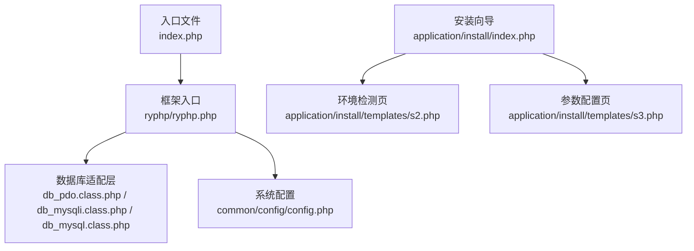
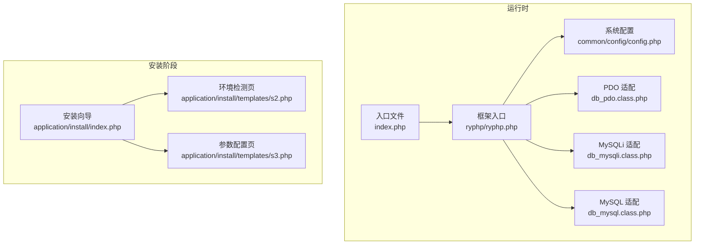
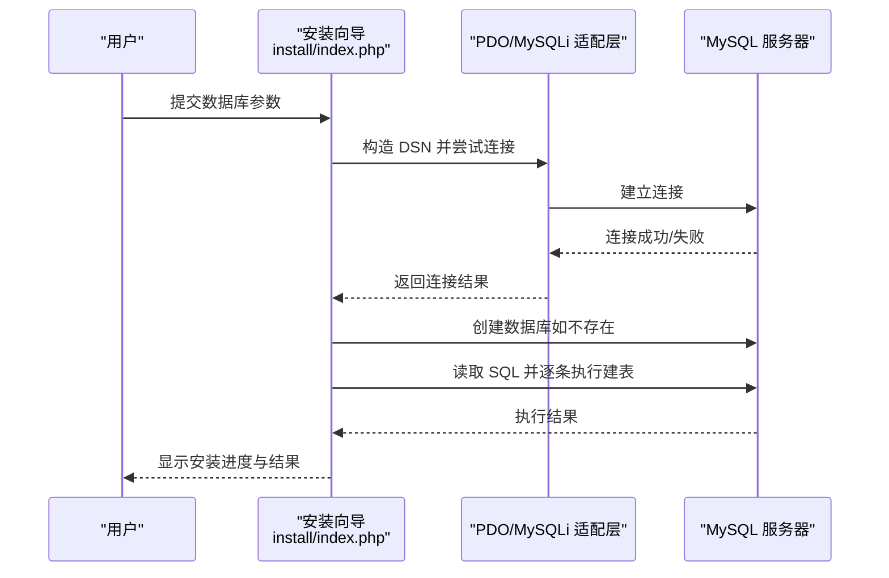
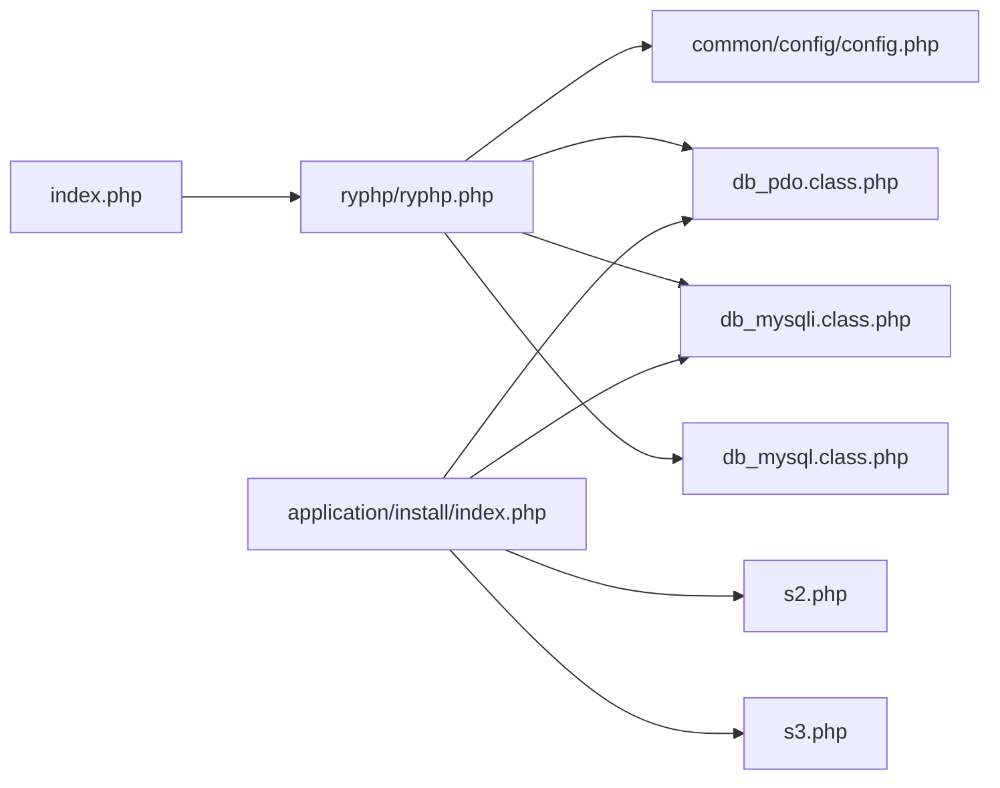

# 环境准备

<cite>
**本文引用的文件列表**
- [index.php](file://index.php)
- [ryphp.php](file://ryphp/ryphp.php)
- [config.php](file://common/config/config.php)
- [db_pdo.class.php](file://ryphp/core/class/db_pdo.class.php)
- [db_mysqli.class.php](file://ryphp/core/class/db_mysqli.class.php)
- [db_mysql.class.php](file://ryphp/core/class/db_mysql.class.php)
- [install/index.php](file://application/install/index.php)
- [install/s2.php](file://application/install/templates/s2.php)
- [install/s3.php](file://application/install/templates/s3.php)
- [public_home.html](file://application/lry_admin_center/view/public_home.html)
</cite>

## 目录
1. [简介](#简介)
2. [项目结构](#项目结构)
3. [核心组件](#核心组件)
4. [架构总览](#架构总览)
5. [详细组件分析](#详细组件分析)
6. [依赖关系分析](#依赖关系分析)
7. [性能考虑](#性能考虑)
8. [故障排查指南](#故障排查指南)
9. [结论](#结论)
10. [附录](#附录)

## 简介
本技术文档面向 LRYBlog 环境准备，聚焦于服务器硬件配置、PHP 版本与扩展兼容性、Web 服务器配置要点、数据库环境要求、操作系统兼容性以及环境检测与依赖检查清单。文档基于仓库中的安装脚本、框架入口与数据库适配层进行归纳总结，帮助运维人员快速验证与部署。

## 项目结构
- 应用入口位于根目录的入口文件，负责初始化框架与路由。
- 框架核心位于 ryphp 目录，包含入口类、数据库适配层与通用函数库。
- 安装流程位于 application/install，包含环境检测、参数配置、数据库初始化与安装完成页。
- 系统配置位于 common/config/config.php，包含数据库、缓存、路由、Cookie、上传等全局配置。

**图表来源**
- [index.php](file://index.php#L1-L18)
- [ryphp.php](file://ryphp/ryphp.php#L1-L204)
- [db_pdo.class.php](file://ryphp/core/class/db_pdo.class.php#L1-L646)
- [db_mysqli.class.php](file://ryphp/core/class/db_mysqli.class.php#L1-L660)
- [db_mysql.class.php](file://ryphp/core/class/db_mysql.class.php#L1-L667)
- [config.php](file://common/config/config.php#L1-L88)
- [install/index.php](file://application/install/index.php#L1-L373)
- [install/s2.php](file://application/install/templates/s2.php#L1-L135)
- [install/s3.php](file://application/install/templates/s3.php#L1-L217)

**章节来源**
- [index.php](file://index.php#L1-L18)
- [ryphp.php](file://ryphp/ryphp.php#L1-L204)
- [config.php](file://common/config/config.php#L1-L88)
- [install/index.php](file://application/install/index.php#L1-L373)

## 核心组件
- 入口与框架初始化：入口文件定义调试开关、根路径常量并加载框架入口；框架入口设置时区、加载公共函数与类加载器，并根据配置初始化应用。
- 数据库适配层：提供 PDO、MySQLi、MySQL 三种数据库驱动的统一封装，支持连接、查询、事务、表与字段元信息查询等。
- 安装与环境检测：安装向导包含环境检测页（s2.php）、参数配置页（s3.php）与安装执行逻辑，覆盖 PHP 版本、GD/CURL、伪静态、目录权限、数据库连通性等。
- 系统配置：集中管理数据库、缓存、路由、Cookie、上传、队列等配置项。

**章节来源**
- [ryphp.php](file://ryphp/ryphp.php#L1-L204)
- [db_pdo.class.php](file://ryphp/core/class/db_pdo.class.php#L1-L646)
- [db_mysqli.class.php](file://ryphp/core/class/db_mysqli.class.php#L1-L660)
- [db_mysql.class.php](file://ryphp/core/class/db_mysql.class.php#L1-L667)
- [install/s2.php](file://application/install/templates/s2.php#L1-L135)
- [install/s3.php](file://application/install/templates/s3.php#L1-L217)
- [config.php](file://common/config/config.php#L1-L88)

## 架构总览
LRYBlog 的运行时架构围绕“入口文件 → 框架入口 → 数据库适配层 → 系统配置”的主线展开，安装向导贯穿环境检测与数据库初始化阶段。

**图表来源**
- [index.php](file://index.php#L1-L18)
- [ryphp.php](file://ryphp/ryphp.php#L1-L204)
- [config.php](file://common/config/config.php#L1-L88)
- [db_pdo.class.php](file://ryphp/core/class/db_pdo.class.php#L1-L646)
- [db_mysqli.class.php](file://ryphp/core/class/db_mysqli.class.php#L1-L660)
- [db_mysql.class.php](file://ryphp/core/class/db_mysql.class.php#L1-L667)
- [install/index.php](file://application/install/index.php#L1-L373)
- [install/s2.php](file://application/install/templates/s2.php#L1-L135)
- [install/s3.php](file://application/install/templates/s3.php#L1-L217)

## 详细组件分析

### PHP 版本与扩展兼容性
- PHP 版本要求
  - 安装向导在环境检测页明确要求 PHP 版本不低于 5.4.0；在安装执行页对 PHP 版本进行二次校验，若低于 5.4.0 则拒绝安装。
  - 框架入口在特定条件下会检测 PHP 版本并设置魔术引号常量，表明对 PHP 5.4–7.x 的兼容策略。
- 必需扩展与功能
  - GD 扩展：安装向导检测 GD 扩展是否启用，用于图片处理。
  - PDO 或 MySQLi：安装向导优先检测 PDO 扩展，若未安装则回退至 MySQLi；两者均未安装则视为不满足要求。
  - CURL：安装向导检测 CURL 扩展是否启用，用于网络请求与健康检查。
  - SESSION：安装向导检测 SESSION 是否可用。
  - 伪静态（Rewrite）：安装向导检测伪静态模块是否开启，通过访问后台管理入口进行探测。
  - 上传限制：读取并显示上传大小限制。
- 推荐配置
  - 环境检测页推荐 PHP 版本为 7.x，MySQL 版本为 5.x 以上，伪静态开启，GD/CURL 扩展开启，目录具备读写权限。

**章节来源**
- [install/s2.php](file://application/install/templates/s2.php#L35-L75)
- [install/index.php](file://application/install/index.php#L21-L111)
- [ryphp.php](file://ryphp/ryphp.php#L66-L74)

### Web 服务器配置要点
- 伪静态（Rewrite）
  - 安装向导通过访问后台管理入口并结合 HTTP 状态码判断伪静态是否生效；若未开启，将提示“未开启”，并引导刷新或查阅教程。
  - 系统配置中提供 Nginx 下 PATHINFO 支持的开关项，便于在 Nginx 环境下启用 PATHINFO 模式。
- 访问入口
  - 入口文件通过常量定义站点 URL 与静态资源路径，确保在不同 Web 服务器环境下路径解析一致。
- 建议
  - Apache/Nginx 均可运行，需确保伪静态模块开启或按框架提供的 PATHINFO 开关进行配置。

**章节来源**
- [install/index.php](file://application/install/index.php#L88-L94)
- [config.php](file://common/config/config.php#L10-L11)
- [index.php](file://index.php#L16-L18)

### 数据库环境要求
- 驱动与连接
  - 安装向导支持 PDO_MYSQL、MYSQLI 两种数据库驱动；框架提供 PDO、MySQLi、MySQL 三类适配层，统一接口。
  - 数据库连接参数来自系统配置，包括主机、端口、数据库名、用户名、密码、字符集、表前缀等。
- 字符集与存储引擎
  - 安装向导允许选择字符集（utf8/utf8mb4）与存储引擎（MyISAM/InnoDB），并在创建表时根据选择替换字符集与引擎。
  - 系统配置默认字符集为 utf8。
- 事务与元信息
  - 适配层均支持事务控制与 SHOW COLUMNS/SHOW TABLES 等元信息查询，便于框架内部维护与诊断。

**图表来源**
- [install/index.php](file://application/install/index.php#L119-L259)
- [db_pdo.class.php](file://ryphp/core/class/db_pdo.class.php#L32-L42)
- [db_mysqli.class.php](file://ryphp/core/class/db_mysqli.class.php#L36-L46)

**章节来源**
- [install/s3.php](file://application/install/templates/s3.php#L30-L83)
- [install/index.php](file://application/install/index.php#L119-L259)
- [config.php](file://common/config/config.php#L13-L21)
- [db_pdo.class.php](file://ryphp/core/class/db_pdo.class.php#L32-L42)
- [db_mysqli.class.php](file://ryphp/core/class/db_mysqli.class.php#L36-L46)

### 操作系统兼容性
- 环境检测页显示服务器操作系统信息，表明系统可在 Linux 环境下运行。
- 安装向导在检测页中明确“操作系统：Linux”，并展示 PHP 版本、MySQL 版本、GD/CURL 等信息。
- 管理后台页面显示服务器操作系统与内核版本，进一步佐证 Linux 兼容性。

**章节来源**
- [install/s2.php](file://application/install/templates/s2.php#L29-L32)
- [public_home.html](file://application/lry_admin_center/view/public_home.html#L106-L108)

### 目录与文件权限
- 安装向导对 cache、uploads、common 三个目录进行可写/可读性检测，并对 common/config/config.php 的可写/可读进行单独检查。
- 安装完成后，安装向导会在缓存目录生成锁文件以标记安装完成状态。

**章节来源**
- [install/s2.php](file://application/install/templates/s2.php#L77-L128)
- [install/index.php](file://application/install/index.php#L256-L274)

## 依赖关系分析
- 入口文件依赖框架入口；框架入口依赖系统配置与数据库适配层。
- 安装向导依赖环境检测页与参数配置页，最终通过 PDO/MySQLi 适配层与数据库交互。
- 数据库适配层统一对外暴露查询、事务、元信息等能力，降低上层耦合度。

**图表来源**
- [index.php](file://index.php#L1-L18)
- [ryphp.php](file://ryphp/ryphp.php#L1-L204)
- [config.php](file://common/config/config.php#L1-L88)
- [db_pdo.class.php](file://ryphp/core/class/db_pdo.class.php#L1-L646)
- [db_mysqli.class.php](file://ryphp/core/class/db_mysqli.class.php#L1-L660)
- [db_mysql.class.php](file://ryphp/core/class/db_mysql.class.php#L1-L667)
- [install/index.php](file://application/install/index.php#L1-L373)
- [install/s2.php](file://application/install/templates/s2.php#L1-L135)
- [install/s3.php](file://application/install/templates/s3.php#L1-L217)

**章节来源**
- [index.php](file://index.php#L1-L18)
- [ryphp.php](file://ryphp/ryphp.php#L1-L204)
- [install/index.php](file://application/install/index.php#L1-L373)

## 性能考虑
- 数据库驱动选择
  - 安装向导推荐使用 PDO_MYSQL；PDO 在预处理与错误处理方面更稳健，适合生产环境。
- 字符集与存储引擎
  - 若需更好的 UTF-8 多字节支持，可选择 utf8mb4；InnoDB 提供更强的一致性与崩溃恢复能力。
- 缓存与上传
  - 系统配置支持 file/redis/memcache 三种缓存类型；上传目录与水印配置可按业务规模调整。

**章节来源**
- [install/s3.php](file://application/install/templates/s3.php#L72-L83)
- [config.php](file://common/config/config.php#L39-L87)

## 故障排查指南
- PHP 版本过低
  - 症状：安装向导直接提示版本过低并终止安装。
  - 处理：升级至 5.4.0 或更高版本；若为生产环境，建议使用 7.x。
- GD/CURL 未启用
  - 症状：环境检测页显示未开启。
  - 处理：启用相应扩展并重启 Web 服务器。
- 伪静态未开启
  - 症状：检测页提示“未开启”，安装向导无法通过后台入口探测。
  - 处理：开启伪静态模块或在系统配置中启用 PATHINFO 支持。
- 目录权限不足
  - 症状：cache、uploads、common 等目录不可写。
  - 处理：赋予相应目录写权限，并确保 common/config/config.php 可写。
- 数据库连接失败
  - 症状：安装向导提示连接失败。
  - 处理：核对主机、端口、用户名、密码、字符集与存储引擎设置；确认数据库服务可达且防火墙放行。

**章节来源**
- [install/index.php](file://application/install/index.php#L21-L111)
- [install/s2.php](file://application/install/templates/s2.php#L35-L75)
- [install/s3.php](file://application/install/templates/s3.php#L142-L211)
- [config.php](file://common/config/config.php#L13-L21)

## 结论
LRYBlog 对 PHP 版本与扩展有明确要求，推荐使用 7.x 与 PDO_MYSQL 驱动；Web 服务器需开启伪静态或启用 PATHINFO 支持；数据库字符集与存储引擎可按需选择；安装向导提供了完善的环境检测与依赖检查机制。遵循本文档的硬件与软件要求，可显著提升部署成功率与运行稳定性。

## 附录

### 环境检测与依赖检查清单
- PHP 版本：≥5.4.0（推荐 7.x）
- 必需扩展：GD、CURL
- 数据库驱动：PDO_MYSQL 或 MySQLi（二选一）
- 伪静态：开启（或在系统配置中启用 PATHINFO 支持）
- 目录权限：cache、uploads、common 可写；common/config/config.php 可写
- 上传限制：满足业务需求（安装向导显示当前限制）

**章节来源**
- [install/s2.php](file://application/install/templates/s2.php#L35-L75)
- [install/index.php](file://application/install/index.php#L21-L111)
- [config.php](file://common/config/config.php#L10-L11)