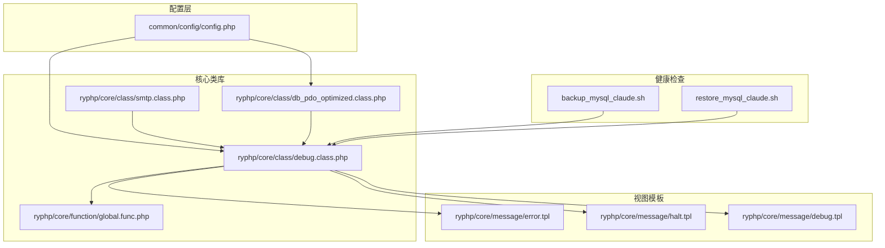
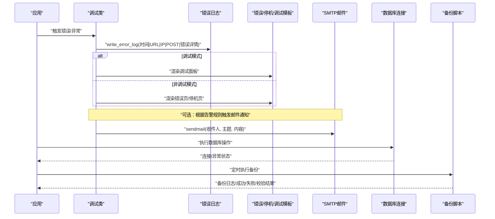
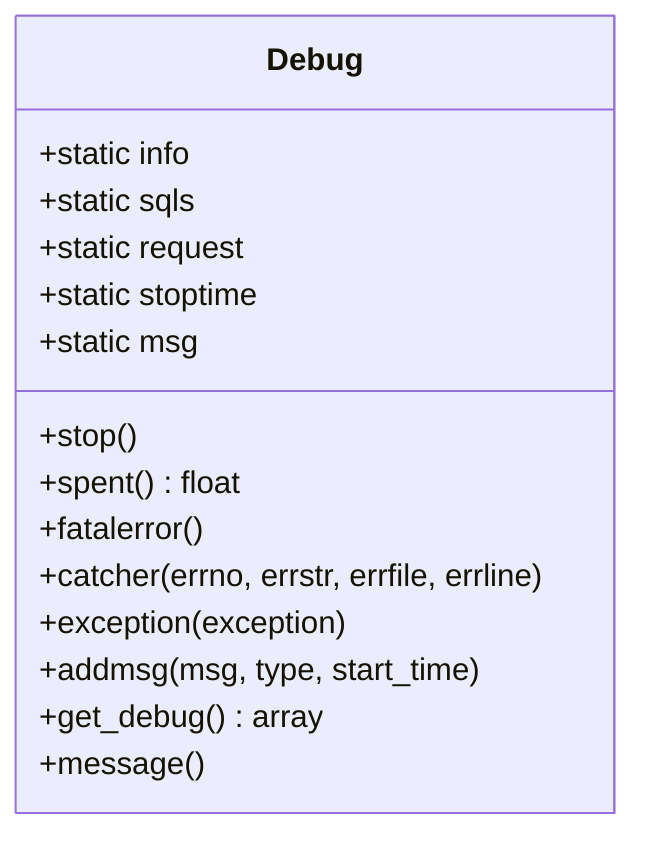
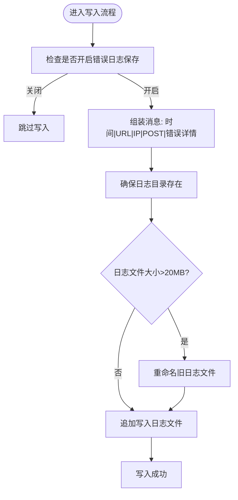
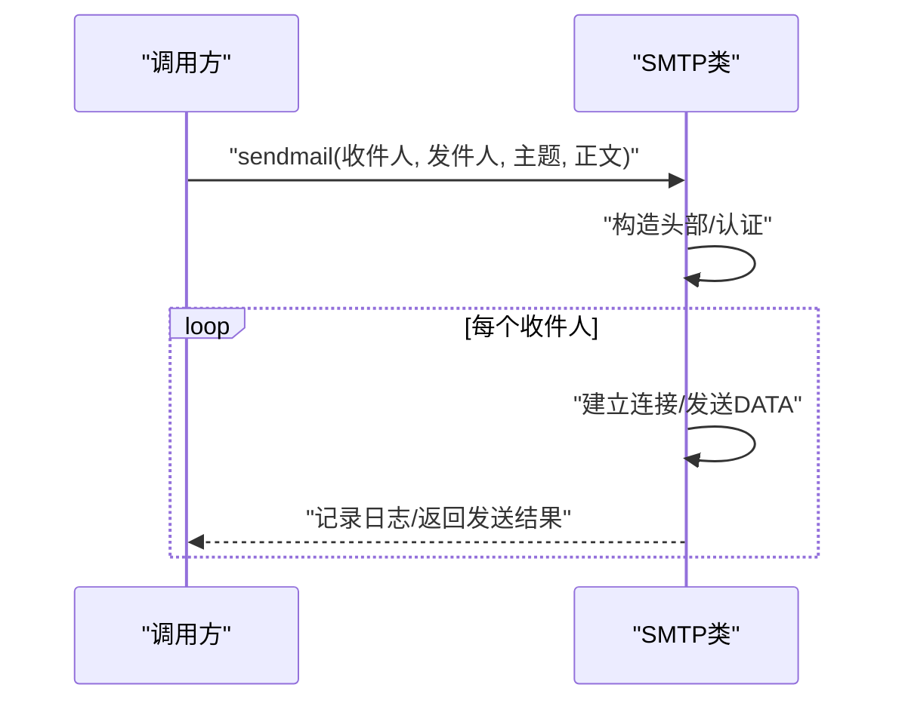
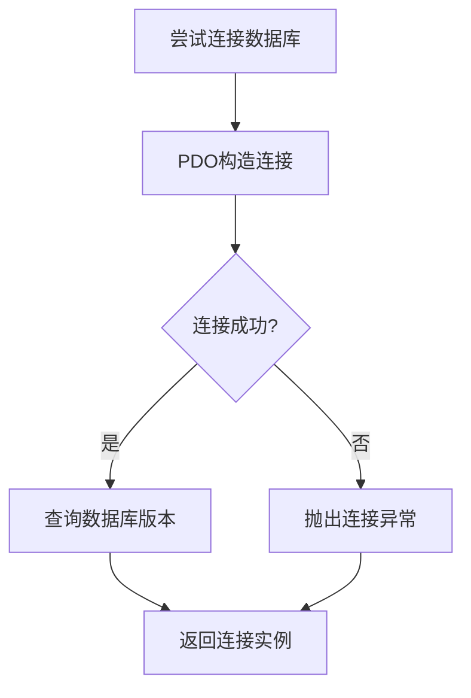
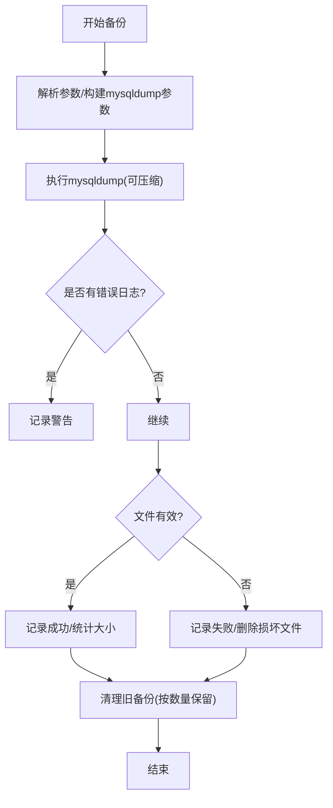
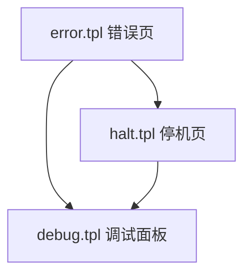
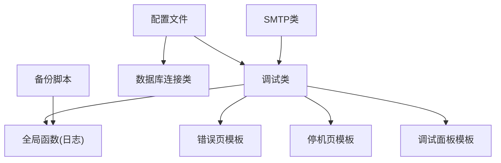

# 告警机制

<cite>
**本文引用的文件**
- [common/config/config.php](file://common/config/config.php)
- [ryphp/core/class/debug.class.php](file://ryphp/core/class/debug.class.php)
- [ryphp/core/class/smtp.class.php](file://ryphp/core/class/smtp.class.php)
- [ryphp/core/function/global.func.php](file://ryphp/core/function/global.func.php)
- [ryphp/core/message/error.tpl](file://ryphp/core/message/error.tpl)
- [ryphp/core/message/halt.tpl](file://ryphp/core/message/halt.tpl)
- [ryphp/core/message/debug.tpl](file://ryphp/core/message/debug.tpl)
- [ryphp/core/class/db_pdo_optimized.class.php](file://ryphp/core/class/db_pdo_optimized.class.php)
- [backup_mysql_claude.sh](file://backup_mysql_claude.sh)
- [restore_mysql_claude.sh](file://restore_mysql_claude.sh)
- [application/lry_admin_center/view/system_info.html](file://application/lry_admin_center/view/system_info.html)
</cite>

## 目录
1. [简介](#简介)
2. [项目结构](#项目结构)
3. [核心组件](#核心组件)
4. [架构总览](#架构总览)
5. [详细组件分析](#详细组件分析)
6. [依赖关系分析](#依赖关系分析)
7. [性能考量](#性能考量)
8. [故障排查指南](#故障排查指南)
9. [结论](#结论)
10. [附录](#附录)

## 简介
本指南面向LRYBlog系统的运维与开发人员，围绕现有代码能力，提供一套可落地的告警机制配置与实践方案。文档聚焦以下方面：
- 告警触发条件设置：基于系统错误日志、数据库连接状态与备份脚本执行结果等指标，设计性能阈值、错误频率与系统状态异常的触发规则。
- 告警通知方式配置：利用内置SMTP邮件发送能力，结合系统错误页与调试信息展示，实现邮件通知与可视化告警呈现。
- 系统健康检查机制：通过数据库连接检测、备份脚本执行日志与文件系统可用性检查，形成基础健康度评估。
- 告警级别分类：结合错误日志记录与模板渲染，给出紧急、重要、一般三类告警的处理流程建议。
- 告警日志记录与跟踪：规范错误日志写入、模板化错误页与调试面板，支撑事件记录、状态更新与历史查询。
- 告警优化策略与噪音控制：通过阈值与频率控制、日志聚合与分级显示，降低无效告警对运维的干扰。

## 项目结构
LRYBlog采用经典的PHP MVC结构，告警相关能力主要分布在以下模块：
- 配置层：系统配置集中于配置文件，包含数据库、缓存、队列、语言等关键参数。
- 核心类库：调试类负责错误捕获与日志写入；SMTP类负责邮件发送；全局函数提供日志写入与通用校验。
- 视图模板：错误页、停机页与调试面板模板用于错误与告警信息的可视化展示。
- 健康检查：数据库连接类与备份脚本共同构成健康检查与恢复验证的基础。

**图表来源**
- [common/config/config.php:1-88](file://common/config/config.php#L1-L88)
- [ryphp/core/class/debug.class.php:1-147](file://ryphp/core/class/debug.class.php#L1-L147)
- [ryphp/core/class/smtp.class.php:1-261](file://ryphp/core/class/smtp.class.php#L1-L261)
- [ryphp/core/function/global.func.php:813-1012](file://ryphp/core/function/global.func.php#L813-L1012)
- [ryphp/core/message/error.tpl:1-118](file://ryphp/core/message/error.tpl#L1-L118)
- [ryphp/core/message/halt.tpl:1-45](file://ryphp/core/message/halt.tpl#L1-L45)
- [ryphp/core/message/debug.tpl:1-10](file://ryphp/core/message/debug.tpl#L1-L10)
- [ryphp/core/class/db_pdo_optimized.class.php:75-319](file://ryphp/core/class/db_pdo_optimized.class.php#L75-L319)
- [backup_mysql_claude.sh:1-200](file://backup_mysql_claude.sh#L1-L200)
- [restore_mysql_claude.sh:104-152](file://restore_mysql_claude.sh#L104-L152)

**章节来源**
- [common/config/config.php:1-88](file://common/config/config.php#L1-L88)
- [ryphp/core/class/debug.class.php:1-147](file://ryphp/core/class/debug.class.php#L1-L147)
- [ryphp/core/class/smtp.class.php:1-261](file://ryphp/core/class/smtp.class.php#L1-L261)
- [ryphp/core/function/global.func.php:813-1012](file://ryphp/core/function/global.func.php#L813-L1012)
- [ryphp/core/message/error.tpl:1-118](file://ryphp/core/message/error.tpl#L1-L118)
- [ryphp/core/message/halt.tpl:1-45](file://ryphp/core/message/halt.tpl#L1-L45)
- [ryphp/core/message/debug.tpl:1-10](file://ryphp/core/message/debug.tpl#L1-L10)
- [ryphp/core/class/db_pdo_optimized.class.php:75-319](file://ryphp/core/class/db_pdo_optimized.class.php#L75-L319)
- [backup_mysql_claude.sh:1-200](file://backup_mysql_claude.sh#L1-L200)
- [restore_mysql_claude.sh:104-152](file://restore_mysql_claude.sh#L104-L152)

## 核心组件
- 错误与调试管理：调试类负责捕获致命错误、普通错误与异常，支持在调试模式下直接渲染调试信息，非调试模式下写入错误日志并统一展示错误页。
- 错误日志写入：全局函数提供错误日志写入能力，自动创建目录、按大小轮转与写入时间、URL、IP、POST数据与错误详情。
- 邮件通知：SMTP类封装邮件发送流程，支持认证、头部构造与日志记录，便于在告警触发时发送邮件通知。
- 数据库连接：PDO优化类负责数据库连接、异常抛出与版本查询，为健康检查提供连接可用性判断。
- 备份与恢复：备份脚本记录备份过程日志、统计成功/失败数量、验证备份文件有效性；恢复脚本解析备份文件并执行恢复流程。
- 视图模板：错误页、停机页与调试面板模板用于错误与告警信息的可视化展示，便于快速定位问题。

**章节来源**
- [ryphp/core/class/debug.class.php:46-112](file://ryphp/core/class/debug.class.php#L46-L112)
- [ryphp/core/function/global.func.php:835-858](file://ryphp/core/function/global.func.php#L835-L858)
- [ryphp/core/class/smtp.class.php:45-89](file://ryphp/core/class/smtp.class.php#L45-L89)
- [ryphp/core/class/db_pdo_optimized.class.php:87-96](file://ryphp/core/class/db_pdo_optimized.class.php#L87-L96)
- [backup_mysql_claude.sh:275-367](file://backup_mysql_claude.sh#L275-L367)
- [restore_mysql_claude.sh:104-152](file://restore_mysql_claude.sh#L104-L152)
- [ryphp/core/message/error.tpl:58-118](file://ryphp/core/message/error.tpl#L58-L118)
- [ryphp/core/message/halt.tpl:1-45](file://ryphp/core/message/halt.tpl#L1-L45)
- [ryphp/core/message/debug.tpl:1-10](file://ryphp/core/message/debug.tpl#L1-L10)

## 架构总览
下图展示了从错误产生到告警呈现与通知的关键流程，以及与数据库连接、备份脚本的交互关系。

**图表来源**
- [ryphp/core/class/debug.class.php:46-112](file://ryphp/core/class/debug.class.php#L46-L112)
- [ryphp/core/function/global.func.php:835-858](file://ryphp/core/function/global.func.php#L835-L858)
- [ryphp/core/class/smtp.class.php:45-89](file://ryphp/core/class/smtp.class.php#L45-L89)
- [ryphp/core/class/db_pdo_optimized.class.php:87-96](file://ryphp/core/class/db_pdo_optimized.class.php#L87-L96)
- [backup_mysql_claude.sh:275-367](file://backup_mysql_claude.sh#L275-L367)

## 详细组件分析

### 组件A：错误与调试管理（debug.class.php）
- 错误捕获：支持致命错误、普通错误与异常捕获，分别决定是否渲染调试信息或写入错误日志并展示错误页。
- 调试信息收集：记录请求耗时、SQL执行明细与请求参数，便于定位性能与逻辑问题。
- 消息类型：内置多种错误消息类型标识，便于区分不同级别的告警来源。

**图表来源**
- [ryphp/core/class/debug.class.php:3-147](file://ryphp/core/class/debug.class.php#L3-L147)

**章节来源**
- [ryphp/core/class/debug.class.php:46-112](file://ryphp/core/class/debug.class.php#L46-L112)
- [ryphp/core/class/debug.class.php:116-137](file://ryphp/core/class/debug.class.php#L116-L137)

### 组件B：错误日志写入（global.func.php）
- 写入策略：在非调试模式下，将时间、URL、IP、POST数据与错误详情写入日志文件，自动创建目录并在达到阈值时轮转。
- 文件保护：日志文件首行包含退出语句，防止直接访问。
- 触发条件：受配置项控制，可在配置中开启/关闭错误日志保存。

**图表来源**
- [ryphp/core/function/global.func.php:835-858](file://ryphp/core/function/global.func.php#L835-L858)

**章节来源**
- [ryphp/core/function/global.func.php:813-858](file://ryphp/core/function/global.func.php#L813-L858)

### 组件C：邮件通知（smtp.class.php）
- 发送流程：构建头部、认证、逐个收件人发送、记录日志与断开连接。
- 日志记录：在调试或启用日志时，记录连接、认证、发送与错误信息。
- 集成点：可与告警规则结合，在满足阈值或异常类型时触发邮件通知。

**图表来源**
- [ryphp/core/class/smtp.class.php:45-89](file://ryphp/core/class/smtp.class.php#L45-L89)
- [ryphp/core/class/smtp.class.php:228-235](file://ryphp/core/class/smtp.class.php#L228-L235)

**章节来源**
- [ryphp/core/class/smtp.class.php:45-134](file://ryphp/core/class/smtp.class.php#L45-L134)
- [ryphp/core/class/smtp.class.php:228-235](file://ryphp/core/class/smtp.class.php#L228-L235)

### 组件D：数据库连接健康检查（db_pdo_optimized.class.php）
- 连接建立：通过PDO连接数据库，捕获异常并抛出自定义异常类型，便于上层识别连接失败。
- 异常处理：在调试模式下返回详细错误信息，否则返回通用提示，避免敏感信息泄露。
- 健康指标：连接成功与否、版本查询可用于系统健康度评估。

**图表来源**
- [ryphp/core/class/db_pdo_optimized.class.php:87-96](file://ryphp/core/class/db_pdo_optimized.class.php#L87-L96)
- [ryphp/core/class/db_pdo_optimized.class.php:310-312](file://ryphp/core/class/db_pdo_optimized.class.php#L310-L312)

**章节来源**
- [ryphp/core/class/db_pdo_optimized.class.php:87-96](file://ryphp/core/class/db_pdo_optimized.class.php#L87-L96)
- [ryphp/core/class/db_pdo_optimized.class.php:310-312](file://ryphp/core/class/db_pdo_optimized.class.php#L310-L312)

### 组件E：备份与恢复健康检查（backup_mysql_claude.sh, restore_mysql_claude.sh）
- 备份流程：生成时间戳、执行mysqldump、可选压缩、统计成功/失败、验证文件有效性、清理旧备份。
- 恢复流程：解析备份文件类型与数据库名、选择解压方式、执行恢复并记录结果。
- 健康指标：备份成功率、文件大小、压缩格式有效性、清理策略执行情况。

**图表来源**
- [backup_mysql_claude.sh:275-367](file://backup_mysql_claude.sh#L275-L367)

**章节来源**
- [backup_mysql_claude.sh:275-367](file://backup_mysql_claude.sh#L275-L367)
- [restore_mysql_claude.sh:104-152](file://restore_mysql_claude.sh#L104-L152)

### 组件F：告警可视化与模板（error.tpl, halt.tpl, debug.tpl）
- 错误页：统一错误展示样式，包含错误类型、消息与细节区域，便于快速定位。
- 停机页：在致命错误时展示停机提示，引导用户等待或联系管理员。
- 调试面板：在调试模式下展示运行信息、SQL执行与请求参数，辅助性能与逻辑分析。

**图表来源**
- [ryphp/core/message/error.tpl:58-118](file://ryphp/core/message/error.tpl#L58-L118)
- [ryphp/core/message/halt.tpl:1-45](file://ryphp/core/message/halt.tpl#L1-L45)
- [ryphp/core/message/debug.tpl:1-10](file://ryphp/core/message/debug.tpl#L1-L10)

**章节来源**
- [ryphp/core/message/error.tpl:58-118](file://ryphp/core/message/error.tpl#L58-L118)
- [ryphp/core/message/halt.tpl:1-45](file://ryphp/core/message/halt.tpl#L1-L45)
- [ryphp/core/message/debug.tpl:1-10](file://ryphp/core/message/debug.tpl#L1-L10)

## 依赖关系分析
- 配置依赖：系统配置影响错误日志保存开关、数据库连接参数与缓存类型，进而影响告警与健康检查行为。
- 类间依赖：调试类依赖全局函数进行日志写入；SMTP类可被告警规则调用；数据库连接类为健康检查提供连接状态；备份脚本独立运行但与日志系统协同。
- 视图依赖：错误页、停机页与调试面板模板依赖调试类提供的数据进行渲染。

**图表来源**
- [common/config/config.php:1-88](file://common/config/config.php#L1-L88)
- [ryphp/core/class/debug.class.php:46-112](file://ryphp/core/class/debug.class.php#L46-L112)
- [ryphp/core/function/global.func.php:835-858](file://ryphp/core/function/global.func.php#L835-L858)
- [ryphp/core/class/smtp.class.php:45-89](file://ryphp/core/class/smtp.class.php#L45-L89)
- [ryphp/core/class/db_pdo_optimized.class.php:87-96](file://ryphp/core/class/db_pdo_optimized.class.php#L87-L96)
- [backup_mysql_claude.sh:275-367](file://backup_mysql_claude.sh#L275-L367)

**章节来源**
- [common/config/config.php:1-88](file://common/config/config.php#L1-L88)
- [ryphp/core/class/debug.class.php:46-112](file://ryphp/core/class/debug.class.php#L46-L112)
- [ryphp/core/function/global.func.php:835-858](file://ryphp/core/function/global.func.php#L835-L858)
- [ryphp/core/class/smtp.class.php:45-89](file://ryphp/core/class/smtp.class.php#L45-L89)
- [ryphp/core/class/db_pdo_optimized.class.php:87-96](file://ryphp/core/class/db_pdo_optimized.class.php#L87-L96)
- [backup_mysql_claude.sh:275-367](file://backup_mysql_claude.sh#L275-L367)

## 性能考量
- 日志写入：日志文件超过固定阈值会触发轮转，避免磁盘占用过高；建议结合系统磁盘监控与日志清理策略。
- 数据库连接：连接异常抛出与版本查询可用于快速判断数据库健康状况；建议在高并发场景下增加连接池或重连策略。
- 备份性能：压缩与单事务模式可提升备份效率与一致性；建议在业务低峰期执行全量备份，并监控备份时长与文件大小。

[本节为通用指导，无需列出具体文件来源]

## 故障排查指南
- 错误日志定位：检查错误日志文件是否存在、是否被轮转、是否包含POST数据与堆栈信息。
- 调试面板：在调试模式下查看运行耗时、SQL执行明细与请求参数，定位性能瓶颈与参数异常。
- 邮件通知：确认SMTP配置、认证信息与日志记录，验证邮件是否成功发送。
- 数据库连接：通过连接类的异常信息判断连接失败原因，核对数据库服务状态与网络连通性。
- 备份与恢复：查看备份脚本日志，确认mysqldump执行状态、压缩格式有效性与清理策略执行情况；恢复脚本需正确解析备份文件并执行恢复。

**章节来源**
- [ryphp/core/function/global.func.php:835-858](file://ryphp/core/function/global.func.php#L835-L858)
- [ryphp/core/message/debug.tpl:1-10](file://ryphp/core/message/debug.tpl#L1-L10)
- [ryphp/core/class/smtp.class.php:228-235](file://ryphp/core/class/smtp.class.php#L228-L235)
- [ryphp/core/class/db_pdo_optimized.class.php:87-96](file://ryphp/core/class/db_pdo_optimized.class.php#L87-L96)
- [backup_mysql_claude.sh:275-367](file://backup_mysql_claude.sh#L275-L367)
- [restore_mysql_claude.sh:104-152](file://restore_mysql_claude.sh#L104-L152)

## 结论
LRYBlog现有代码提供了完善的错误捕获、日志写入与模板化展示能力，结合SMTP邮件发送与数据库连接、备份脚本，可构建一套基础的告警机制。建议在此基础上引入阈值与频率控制、分级告警与通知渠道扩展，以进一步提升告警的准确性与可维护性。

[本节为总结性内容，无需列出具体文件来源]

## 附录

### 告警触发条件设置（建议）
- 性能阈值：基于调试面板中的运行耗时与SQL执行时间，设定阈值触发“重要”告警。
- 错误频率：统计单位时间内错误日志条目数量，超过阈值触发“紧急”告警。
- 系统状态异常：数据库连接失败、备份脚本执行失败或文件校验失败，触发“紧急”告警；备份清理失败触发“重要”告警。

[本节为概念性内容，无需列出具体文件来源]

### 告警通知方式配置（建议）
- 邮件通知：在满足紧急/重要告警规则时，调用SMTP类发送邮件至运维/值班邮箱。
- 即时通讯工具：可扩展HTTP接口或脚本，将告警事件推送至企业微信/钉钉/飞书等平台。
- 短信告警：可接入短信网关接口，针对紧急级别告警触发短信通知。

[本节为概念性内容，无需列出具体文件来源]

### 系统健康检查机制（建议）
- 数据库连接监控：定期执行数据库连接测试，记录连接状态与响应时间。
- 文件系统监控：监控日志目录空间、备份目录容量与权限，异常时触发告警。
- 备份状态检查：每日检查备份任务执行日志，统计成功率与失败原因，验证备份文件完整性。

[本节为概念性内容，无需列出具体文件来源]

### 告警级别分类与处理流程（建议）
- 紧急告警：系统不可用、数据库连接失败、备份失败等，立即邮件+短信通知，值班人员30分钟内响应。
- 重要告警：性能严重下降、错误频率异常、备份清理失败等，邮件通知，运维人员2小时内处理。
- 一般告警：轻微错误、调试信息等，记录日志，按周汇总分析。

[本节为概念性内容，无需列出具体文件来源]

### 告警日志记录与跟踪（建议）
- 告警事件记录：统一记录时间、类型、级别、描述、关联资源与处理状态。
- 处理状态更新：在工单系统或内部平台更新告警状态（待处理/处理中/已解决）。
- 历史查询：按时间、级别、类型筛选历史告警，生成周报/月报用于趋势分析。

[本节为概念性内容，无需列出具体文件来源]

### 告警优化策略与噪音减少技巧（建议）
- 阈值与频率控制：为不同类型的错误设置独立阈值，避免单一高频错误淹没其他告警。
- 告警收敛：对短时间内重复告警进行聚合，减少噪音。
- 分级显示：在调试面板与错误页中按级别高亮显示，便于快速识别紧急问题。
- 周期性回顾：定期回顾告警规则与阈值，剔除无效规则，优化告警质量。

[本节为概念性内容，无需列出具体文件来源]