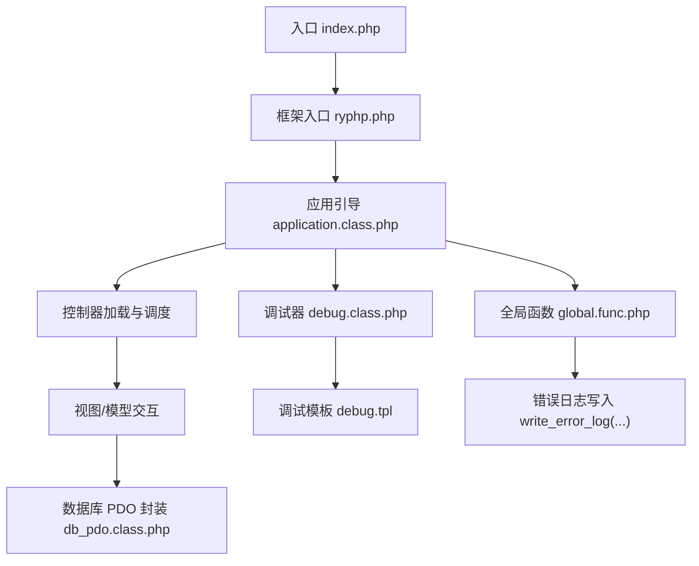
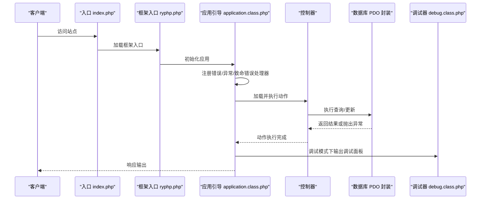
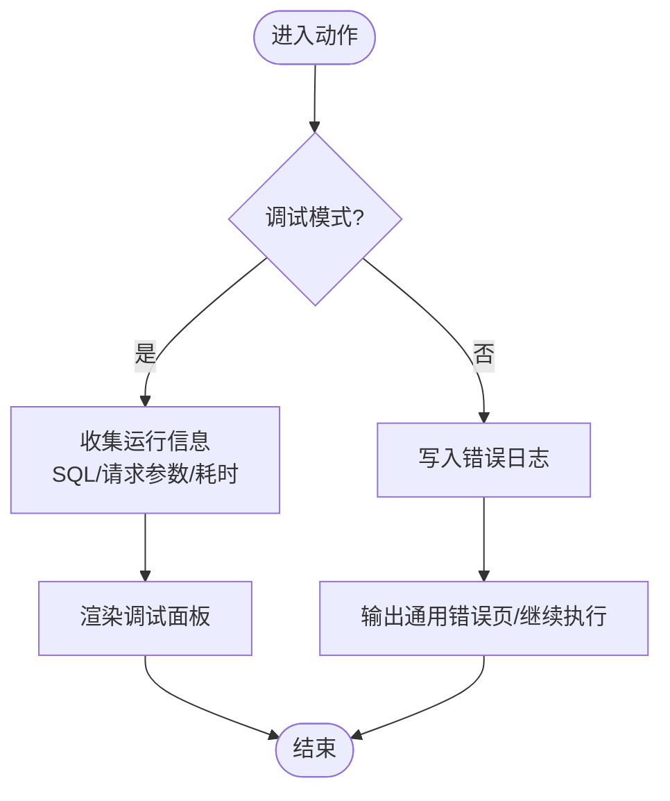
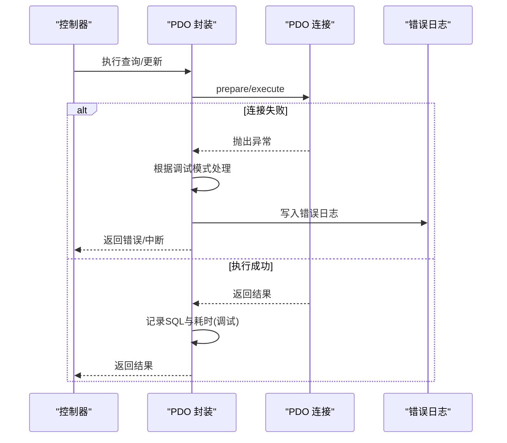
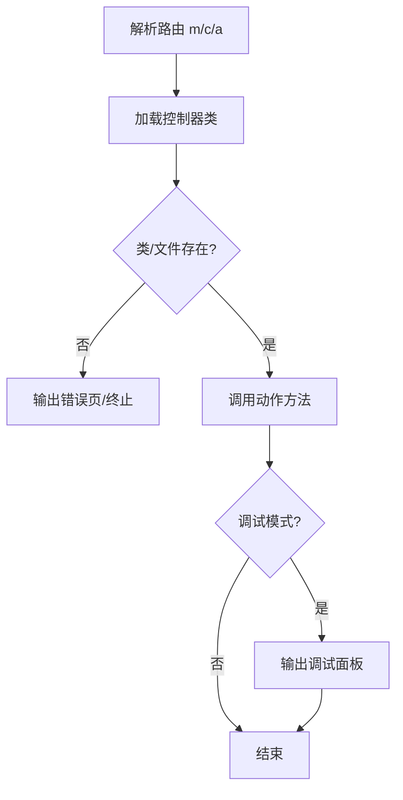
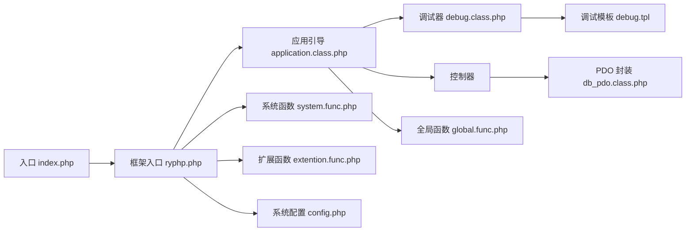

# 故障诊断

<cite>
**本文引用的文件**   
- [入口文件 index.php](file://index.php)
- [框架入口 ryphp.php](file://ryphp/ryphp.php)
- [应用引导 application.class.php](file://ryphp/core/class/application.class.php)
- [调试器 debug.class.php](file://ryphp/core/class/debug.class.php)
- [调试模板 debug.tpl](file://ryphp/core/message/debug.tpl)
- [PDO 数据库类 db_pdo.class.php](file://ryphp/core/class/db_pdo.class.php)
- [数据库异常类 DbException.class.php](file://ryphp/core/class/DbException.class.php)
- [系统配置 config.php](file://common/config/config.php)
- [全局函数 global.func.php](file://ryphp/core/function/global.func.php)
- [系统函数 system.func.php](file://common/function/system.func.php)
- [扩展函数 extention.func.php](file://common/function/extention.func.php)
- [后台控制器 index.class.php](file://application/lry_admin_center/controller/index.class.php)
- [备份脚本 backup_mysql_claude.sh](file://backup_mysql_claude.sh)
- [恢复脚本 restore_mysql_claude.sh](file://restore_mysql_claude.sh)
</cite>

## 目录
1. [引言](#引言)
2. [项目结构](#项目结构)
3. [核心组件](#核心组件)
4. [架构总览](#架构总览)
5. [详细组件分析](#详细组件分析)
6. [依赖关系分析](#依赖关系分析)
7. [性能考量](#性能考量)
8. [故障排查指南](#故障排查指南)
9. [结论](#结论)
10. [附录](#附录)

## 引言
本指南面向 LRYBlog 的运维与开发人员，提供一套系统化的故障诊断方法论与实操步骤。内容覆盖错误日志分析、调试信息查看、性能瓶颈识别、根因分析流程、常见问题排查、调试工具使用、故障恢复策略以及预防性维护与预警机制。文档基于仓库实际代码进行分析，确保每一步都可落地到具体文件与实现。

## 项目结构
LRYBlog 采用 MVC 分层与单入口设计，前端通过入口文件加载框架核心，再由框架引导到对应模块/控制器/动作，数据库访问通过 PDO 封装类完成，调试与错误日志由框架内置组件统一管理。

图表来源
- [入口文件 index.php:1-18](file://index.php#L1-L18)
- [框架入口 ryphp.php:1-204](file://ryphp/ryphp.php#L1-L204)
- [应用引导 application.class.php:1-118](file://ryphp/core/class/application.class.php#L1-L118)
- [调试器 debug.class.php:1-147](file://ryphp/core/class/debug.class.php#L1-L147)
- [调试模板 debug.tpl:1-75](file://ryphp/core/message/debug.tpl#L1-L75)
- [PDO 数据库类 db_pdo.class.php:1-646](file://ryphp/core/class/db_pdo.class.php#L1-L646)
- [全局函数 global.func.php](file://ryphp/core/function/global.func.php)

章节来源
- [入口文件 index.php:1-18](file://index.php#L1-L18)
- [框架入口 ryphp.php:1-204](file://ryphp/ryphp.php#L1-L204)

## 核心组件
- 单一入口与框架初始化：入口文件定义调试开关与根路径，并加载框架入口；框架入口定义常量、时区、静态资源路径，并加载系统函数与类加载器。
- 应用引导与路由：应用引导注册错误/异常处理器，解析路由模块、控制器、动作，加载控制器并执行动作方法；在调试模式下输出调试面板。
- 调试与错误日志：调试器捕获 PHP 错误、异常与致命错误，支持在调试模式下展示运行信息、SQL、请求参数；非调试模式下将错误写入日志文件。
- 数据库访问：PDO 封装类负责连接、SQL 组装、执行、错误处理与重连；在调试模式下记录 SQL 与耗时；错误时根据模式选择抛出或写日志。
- 配置与缓存：系统配置集中于配置文件，包含数据库、缓存、Cookie、队列、上传等；缓存类型支持 file/redis/memcache。
- 全局函数：提供错误日志写入、状态码发送、URL 生成、模板渲染辅助等通用能力。

章节来源
- [入口文件 index.php:10-18](file://index.php#L10-L18)
- [框架入口 ryphp.php:83-204](file://ryphp/ryphp.php#L83-L204)
- [应用引导 application.class.php:9-40](file://ryphp/core/class/application.class.php#L9-L40)
- [调试器 debug.class.php:75-112](file://ryphp/core/class/debug.class.php#L75-L112)
- [PDO 数据库类 db_pdo.class.php:32-42](file://ryphp/core/class/db_pdo.class.php#L32-L42)
- [系统配置 config.php:1-88](file://common/config/config.php#L1-L88)
- [全局函数 global.func.php](file://ryphp/core/function/global.func.php)

## 架构总览
下面的时序图展示了从请求进入至响应输出的关键流程，包括错误与异常处理、调试面板输出与数据库访问路径。

图表来源
- [入口文件 index.php:10-18](file://index.php#L10-L18)
- [框架入口 ryphp.php:88-90](file://ryphp/ryphp.php#L88-L90)
- [应用引导 application.class.php:9-40](file://ryphp/core/class/application.class.php#L9-L40)
- [调试器 debug.class.php:30-41](file://ryphp/core/class/debug.class.php#L30-L41)
- [PDO 数据库类 db_pdo.class.php:100-124](file://ryphp/core/class/db_pdo.class.php#L100-L124)

## 详细组件分析

### 调试器与错误日志
- 错误捕获：注册错误处理器，区分 Notice 与其他错误；在调试模式下高亮显示错误信息并在页面底部弹出调试面板；非调试模式下将错误写入日志文件。
- 异常捕获：捕获未处理异常，调试模式下展示异常详情与消息，非调试模式下写日志并输出通用错误页面。
- 致命错误：脚本结束时检测最后错误，调试模式下展示致命错误详情，非调试模式下写日志并输出通用错误页面。
- 调试面板：在调试模式下收集 info/sql/request/spent 时间等信息，模板渲染调试面板，支持最小化/展开/关闭。

图表来源
- [调试器 debug.class.php:75-112](file://ryphp/core/class/debug.class.php#L75-L112)
- [调试模板 debug.tpl:1-75](file://ryphp/core/message/debug.tpl#L1-L75)

章节来源
- [调试器 debug.class.php:75-112](file://ryphp/core/class/debug.class.php#L75-L112)
- [调试模板 debug.tpl:1-75](file://ryphp/core/message/debug.tpl#L1-L75)

### 数据库访问与异常处理
- 连接与重连：PDO 连接失败时根据调试模式返回详细或通用错误；执行阶段若检测到“服务器断开”，尝试重建连接并重试。
- SQL 记录：调试模式下记录 SQL 与执行耗时，便于定位慢查询与异常 SQL。
- 错误处理：根据运行环境与 AJAX 请求返回 JSON 或页面错误；非调试模式下写入日志并输出通用错误。

图表来源
- [PDO 数据库类 db_pdo.class.php:32-42](file://ryphp/core/class/db_pdo.class.php#L32-L42)
- [PDO 数据库类 db_pdo.class.php:100-124](file://ryphp/core/class/db_pdo.class.php#L100-L124)
- [全局函数 global.func.php](file://ryphp/core/function/global.func.php)

章节来源
- [PDO 数据库类 db_pdo.class.php:32-42](file://ryphp/core/class/db_pdo.class.php#L32-L42)
- [PDO 数据库类 db_pdo.class.php:100-124](file://ryphp/core/class/db_pdo.class.php#L100-L124)

### 应用引导与路由
- 路由解析：从参数中解析模块、控制器、动作，校验控制器文件与类是否存在，执行动作方法。
- 错误处理：动作不存在或控制器不存在时，输出通用错误页面或终止执行。
- 调试输出：动作完成后在调试模式下输出调试面板。

图表来源
- [应用引导 application.class.php:24-40](file://ryphp/core/class/application.class.php#L24-L40)

章节来源
- [应用引导 application.class.php:24-40](file://ryphp/core/class/application.class.php#L24-L40)

### 配置与缓存
- 数据库配置：支持 PDO/MySQLi/MySQL 三种扩展，包含主机、端口、用户名、密码、字符集、表前缀等。
- 缓存配置：支持 file/redis/memcache，分别提供缓存目录、后缀、序列化模式、主机端口、超时与前缀等。
- Cookie 配置：域名、路径、生命周期、前缀、HTTPS/HttpOnly 等。
- 其他：URL 后缀、路由映射、队列驱动、语言、上传类型与水印等。

章节来源
- [系统配置 config.php:13-87](file://common/config/config.php#L13-L87)

### 全局函数与日志
- 错误日志写入：统一的日志写入函数，支持追加到文件；在非调试模式下按配置决定是否保存日志。
- HTTP 状态码：根据非调试模式发送相应状态码。
- URL 生成与模板辅助：提供 URL 生成、模板渲染、分页、SEO、附件处理等常用函数。

章节来源
- [全局函数 global.func.php](file://ryphp/core/function/global.func.php)

## 依赖关系分析
- 入口文件依赖框架入口；框架入口依赖系统函数与类加载器；应用引导依赖参数解析、控制器加载与调试器；控制器通过 D()/M() 访问模型/数据库；数据库封装依赖 PDO；调试器依赖模板与全局函数；配置文件贯穿系统运行。

图表来源
- [入口文件 index.php:10-18](file://index.php#L10-L18)
- [框架入口 ryphp.php:88-90](file://ryphp/ryphp.php#L88-L90)
- [应用引导 application.class.php:9-40](file://ryphp/core/class/application.class.php#L9-L40)
- [调试器 debug.class.php:1-147](file://ryphp/core/class/debug.class.php#L1-L147)
- [调试模板 debug.tpl:1-75](file://ryphp/core/message/debug.tpl#L1-L75)
- [PDO 数据库类 db_pdo.class.php:1-646](file://ryphp/core/class/db_pdo.class.php#L1-L646)
- [系统函数 system.func.php:1-800](file://common/function/system.func.php#L1-L800)
- [扩展函数 extention.func.php:1-95](file://common/function/extention.func.php#L1-L95)
- [系统配置 config.php:1-88](file://common/config/config.php#L1-L88)

## 性能考量
- 调试模式成本：调试面板与 SQL 记录会带来额外开销，生产环境建议关闭调试模式。
- 数据库连接：PDO 封装具备断线重连能力，但频繁重连可能影响性能，应优化 SQL 与索引。
- 缓存策略：合理配置缓存类型与过期时间，避免热点数据频繁落库。
- 日志写入：错误日志写入为同步 IO，大量错误时可能阻塞请求，建议配合日志切割与异步处理。

## 故障排查指南

### 一、问题定位方法
- 错误日志分析
  - 非调试模式：检查错误日志文件，定位错误类型、时间、消息与上下文。
  - 调试模式：页面底部调试面板显示 SQL、请求参数与运行耗时，快速定位异常请求与慢查询。
- 调试信息查看
  - 打开调试模式后，动作执行完成后会弹出调试面板；可查看“系统信息”“SQL 语句”“REQUEST 请求”“其他信息”等。
- 性能瓶颈识别
  - 关注调试面板中的 SQL 执行耗时与总数；结合数据库 EXPLAIN 分析慢查询；检查缓存命中率与过期策略。

章节来源
- [调试器 debug.class.php:130-137](file://ryphp/core/class/debug.class.php#L130-L137)
- [调试模板 debug.tpl:22-54](file://ryphp/core/message/debug.tpl#L22-L54)
- [PDO 数据库类 db_pdo.class.php:111-114](file://ryphp/core/class/db_pdo.class.php#L111-L114)

### 二、根因分析流程
- 错误堆栈跟踪
  - 调试模式下异常与错误均会显示文件与行号；结合控制器动作与数据库封装类定位具体调用点。
- 数据库查询分析
  - 在调试面板中查看 SQL 与耗时；确认 WHERE 条件、JOIN 与排序字段是否合理；必要时在数据库侧执行 EXPLAIN。
- 系统资源检查
  - 检查 PHP 错误日志、Web 服务器错误日志、数据库慢查询日志；监控 CPU、内存、磁盘 IO 与连接数。

章节来源
- [调试器 debug.class.php:75-112](file://ryphp/core/class/debug.class.php#L75-L112)
- [PDO 数据库类 db_pdo.class.php:100-124](file://ryphp/core/class/db_pdo.class.php#L100-L124)

### 三、常见问题排查步骤

#### 1. 页面加载失败
- 症状：空白页或 5xx 错误。
- 步骤：
  - 开启调试模式，查看调试面板与错误日志。
  - 检查路由参数 m/c/a 是否正确，控制器文件与类是否存在。
  - 查看控制器动作是否存在且未以下划线开头。
  - 若为数据库相关页面，检查数据库连接配置与服务状态。

章节来源
- [应用引导 application.class.php:24-40](file://ryphp/core/class/application.class.php#L24-L40)
- [系统配置 config.php:13-21](file://common/config/config.php#L13-L21)

#### 2. 数据库连接错误
- 症状：连接失败或“服务器断开”。
- 步骤：
  - 核对数据库主机、端口、用户名、密码与字符集。
  - 检查数据库服务状态与防火墙策略。
  - 观察 PDO 封装的错误处理分支，确认是否触发了断线重连。
  - 非调试模式下检查错误日志文件。

章节来源
- [系统配置 config.php:13-21](file://common/config/config.php#L13-L21)
- [PDO 数据库类 db_pdo.class.php:32-42](file://ryphp/core/class/db_pdo.class.php#L32-L42)
- [PDO 数据库类 db_pdo.class.php:118-121](file://ryphp/core/class/db_pdo.class.php#L118-L121)

#### 3. 权限问题
- 症状：后台无法登录、文件上传失败、缓存写入失败。
- 步骤：
  - 检查文件与目录权限（站点根目录、缓存目录、上传目录）。
  - 核对 Cookie 域名、路径与 HttpOnly 设置。
  - 检查上传类型与存储配置（本地/云存储）。
  - 查看系统函数中关于附件与上传的相关逻辑。

章节来源
- [系统配置 config.php:31-81](file://common/config/config.php#L31-L81)
- [系统函数 system.func.php:384-452](file://common/function/system.func.php#L384-L452)

### 四、调试工具使用
- 浏览器开发者工具
  - Network 面板观察请求与响应状态、Headers、Payload；Console 查看 JS 错误。
- PHP 错误报告
  - 开启调试模式，查看调试面板；或启用 PHP 错误日志，定位语法与运行时错误。
- 数据库查询分析器
  - 在数据库侧执行 EXPLAIN 分析慢查询；结合调试面板中的 SQL 与耗时进行对比。

章节来源
- [调试模板 debug.tpl:36-44](file://ryphp/core/message/debug.tpl#L36-L44)
- [PDO 数据库类 db_pdo.class.php:111-114](file://ryphp/core/class/db_pdo.class.php#L111-L114)

### 五、故障恢复策略
- 系统回滚
  - 使用版本控制或备份包进行回滚；确保回滚前后数据库兼容。
- 数据恢复
  - 使用提供的备份与恢复脚本进行数据库恢复；恢复前先停止 Web 与数据库服务，恢复后验证数据完整性。
- 性能优化
  - 优化 SQL 与索引；启用合适的缓存策略；关闭调试模式；限制日志级别与大小。

章节来源
- [备份脚本 backup_mysql_claude.sh](file://backup_mysql_claude.sh)
- [恢复脚本 restore_mysql_claude.sh](file://restore_mysql_claude.sh)

### 六、预防性维护与预警机制
- 预防性维护
  - 定期清理缓存与日志；监控数据库连接数与慢查询；定期备份站点与数据库。
- 故障预警
  - 配置错误日志轮转与告警；在 Web/应用层增加健康检查接口；对关键指标设置阈值告警。

## 结论
通过调试器与错误日志、数据库访问封装与配置体系，LRYBlog 提供了完整的故障诊断与恢复能力。建议在生产环境中关闭调试模式、完善日志与监控、定期备份与演练恢复，并持续优化数据库与缓存策略，以降低故障概率与恢复成本。

## 附录

### A. 调试面板字段说明
- 系统信息：框架版本、服务器信息、路由信息、会话信息等。
- SQL 语句：调试模式下记录的 SQL 与其执行耗时。
- REQUEST 请求：GET/POST 请求与参数。
- 其他信息：服务器软件、路由参数、会话 ID、框架版本等。

章节来源
- [调试模板 debug.tpl:22-54](file://ryphp/core/message/debug.tpl#L22-L54)

### B. 数据库异常类
- DbException 提供类型与 SQL 字段，便于在异常处理中区分错误类型与定位 SQL。

章节来源
- [数据库异常类 DbException.class.php:10-73](file://ryphp/core/class/DbException.class.php#L10-L73)