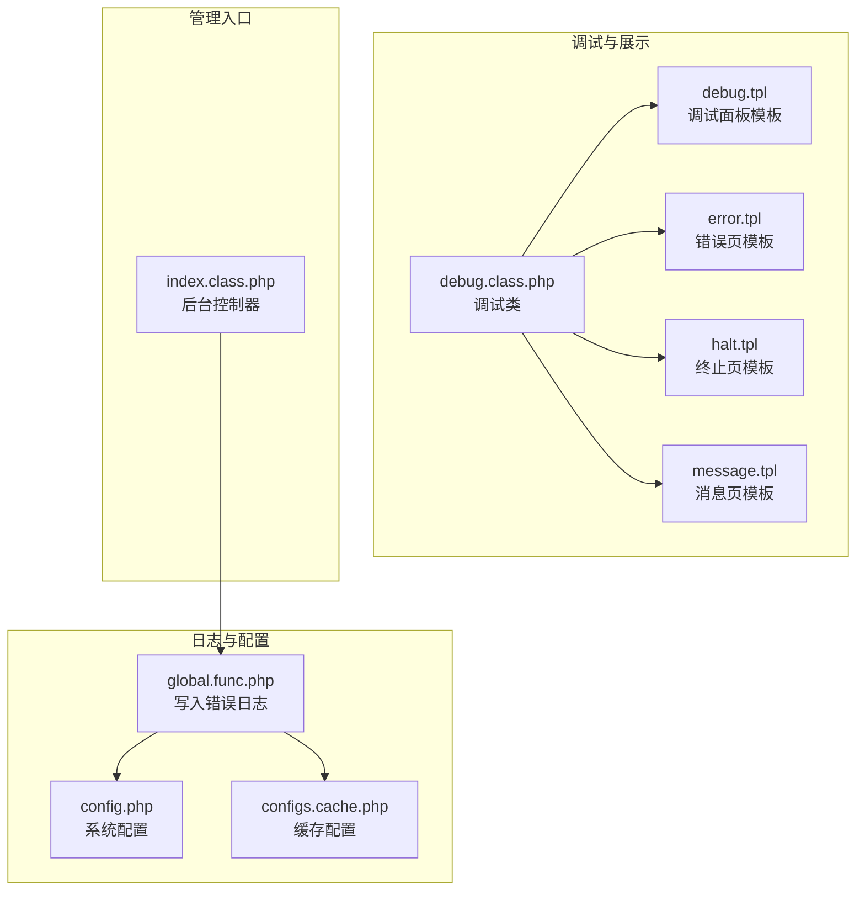
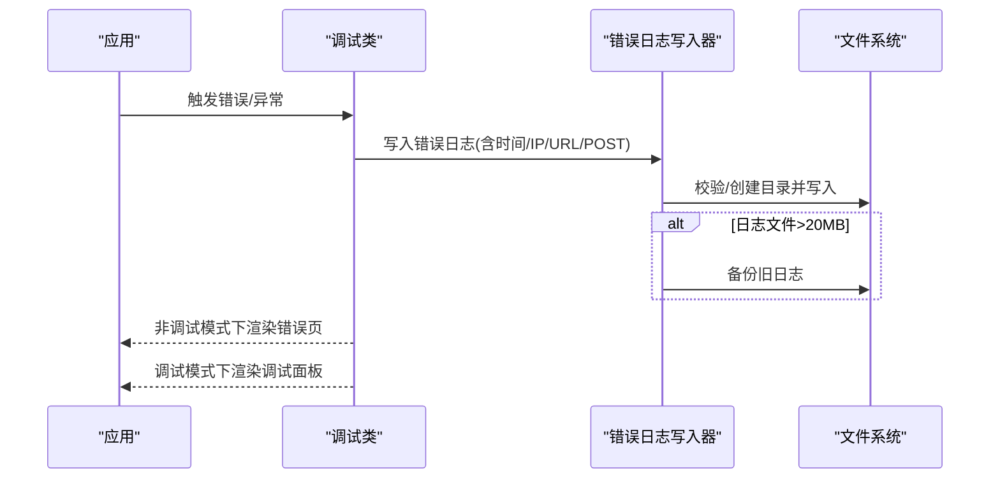
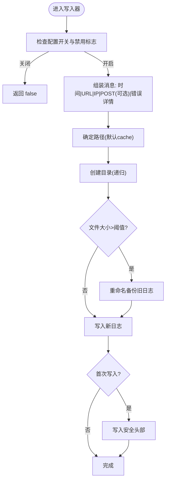
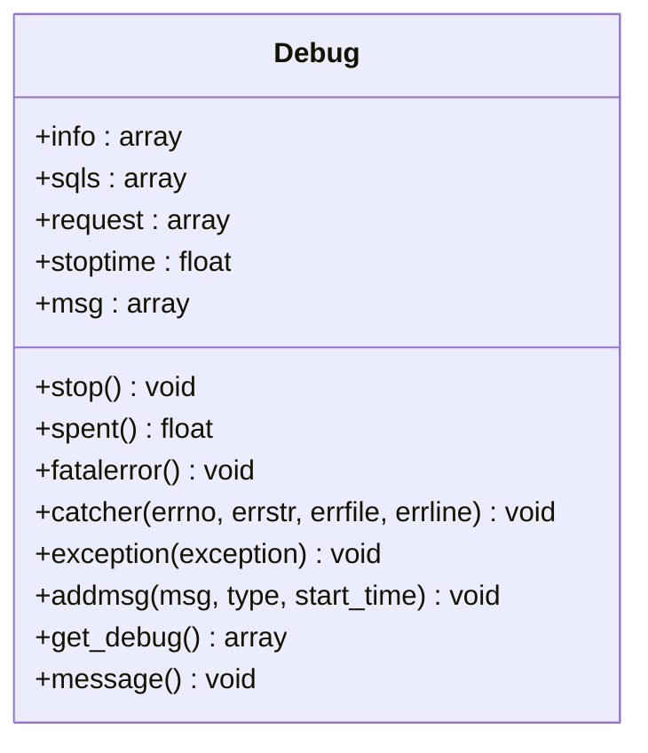
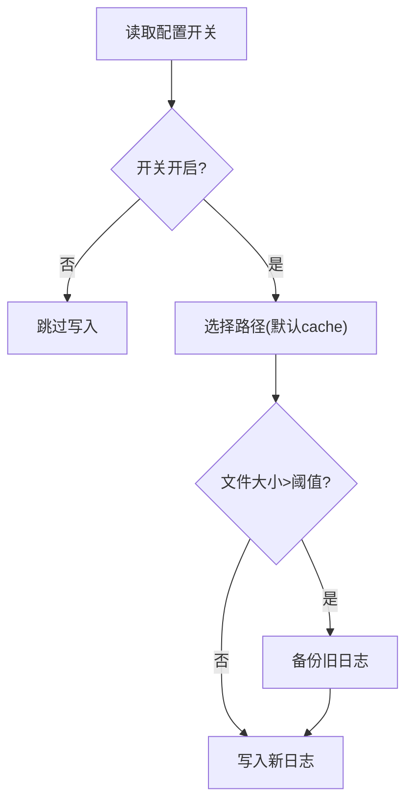
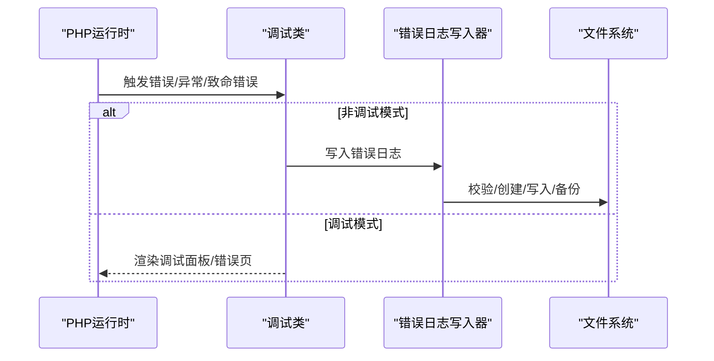
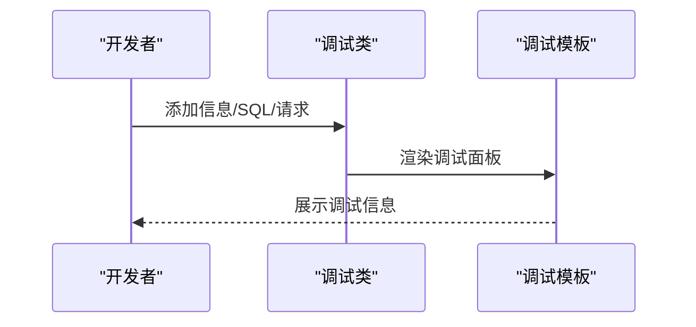
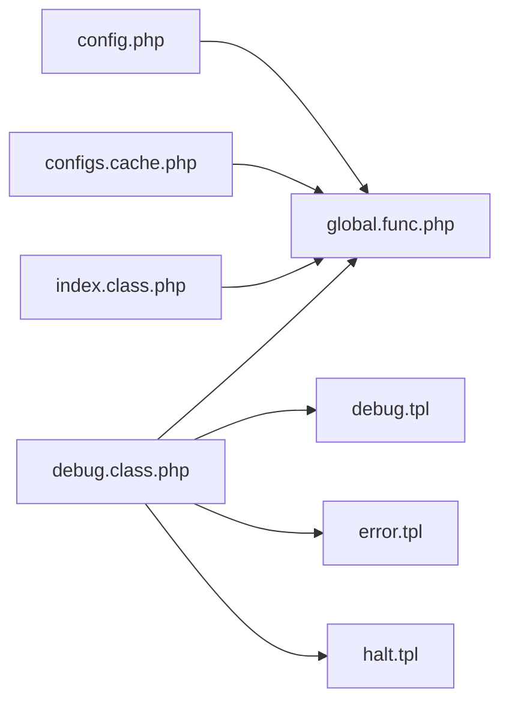

# 日志管理

<cite>
**本文引用的文件**
- [global.func.php](file://ryphp/core/function/global.func.php)
- [debug.class.php](file://ryphp/core/class/debug.class.php)
- [config.php](file://common/config/config.php)
- [configs.cache.php](file://cache/cache_file/configs.cache.php)
- [debug.tpl](file://ryphp/core/message/debug.tpl)
- [error.tpl](file://ryphp/core/message/error.tpl)
- [halt.tpl](file://ryphp/core/message/halt.tpl)
- [message.tpl](file://ryphp/core/message/message.tpl)
- [index.class.php](file://application/lry_admin_center/controller/index.class.php)
</cite>

## 目录
1. [简介](#简介)
2. [项目结构](#项目结构)
3. [核心组件](#核心组件)
4. [架构总览](#架构总览)
5. [详细组件分析](#详细组件分析)
6. [依赖关系分析](#依赖关系分析)
7. [性能考量](#性能考量)
8. [故障排查指南](#故障排查指南)
9. [结论](#结论)
10. [附录](#附录)

## 简介
本指南面向LRYBlog日志管理系统的使用者与维护者，系统性阐述日志类型与用途、日志配置策略、错误日志记录机制、调试日志的采集与展示、日志分析方法以及日志清理与存储优化建议。文档基于仓库中实际实现的源文件进行说明，帮助读者快速理解并高效运维日志体系。

## 项目结构
围绕日志管理的关键文件分布如下：
- 日志写入与配置：全局函数与配置文件
- 调试与错误展示：调试类与模板
- 管理入口：后台控制器对日志文件的访问

**图表来源**
- [global.func.php:834-858](file://ryphp/core/function/global.func.php#L834-L858)
- [config.php:7-8](file://common/config/config.php#L7-L8)
- [configs.cache.php:58-59](file://cache/cache_file/configs.cache.php#L58-L59)
- [debug.class.php:1-147](file://ryphp/core/class/debug.class.php#L1-L147)
- [debug.tpl:1-75](file://ryphp/core/message/debug.tpl#L1-L75)
- [error.tpl:1-179](file://ryphp/core/message/error.tpl#L1-L179)
- [halt.tpl:1-223](file://ryphp/core/message/halt.tpl#L1-L223)
- [message.tpl:1-277](file://ryphp/core/message/message.tpl#L1-L277)
- [index.class.php](file://application/lry_admin_center/controller/index.class.php#L92)

**章节来源**
- [global.func.php:834-858](file://ryphp/core/function/global.func.php#L834-L858)
- [config.php:7-8](file://common/config/config.php#L7-L8)
- [configs.cache.php:58-59](file://cache/cache_file/configs.cache.php#L58-L59)
- [debug.class.php:1-147](file://ryphp/core/class/debug.class.php#L1-L147)
- [debug.tpl:1-75](file://ryphp/core/message/debug.tpl#L1-L75)
- [error.tpl:1-179](file://ryphp/core/message/error.tpl#L1-L179)
- [halt.tpl:1-223](file://ryphp/core/message/halt.tpl#L1-L223)
- [message.tpl:1-277](file://ryphp/core/message/message.tpl#L1-L277)
- [index.class.php](file://application/lry_admin_center/controller/index.class.php#L92)

## 核心组件
- 错误日志写入器：统一的错误日志写入函数，负责格式化、落盘与轮转。
- 调试类：集中处理错误捕获、异常捕获、调试信息收集与展示。
- 配置系统：控制是否启用错误日志保存、日志文件路径等。
- 模板系统：提供错误页、调试面板、消息页等展示层。

**章节来源**
- [global.func.php:834-858](file://ryphp/core/function/global.func.php#L834-L858)
- [debug.class.php:1-147](file://ryphp/core/class/debug.class.php#L1-L147)
- [config.php:7-8](file://common/config/config.php#L7-L8)
- [configs.cache.php:58-59](file://cache/cache_file/configs.cache.php#L58-L59)
- [debug.tpl:1-75](file://ryphp/core/message/debug.tpl#L1-L75)
- [error.tpl:1-179](file://ryphp/core/message/error.tpl#L1-L179)
- [halt.tpl:1-223](file://ryphp/core/message/halt.tpl#L1-L223)
- [message.tpl:1-277](file://ryphp/core/message/message.tpl#L1-L277)

## 架构总览
日志管理由“配置—写入—展示—清理”闭环构成。配置项决定是否写入与写入位置；写入器负责格式化与落盘；调试类在非调试模式下将错误转化为日志并在调试模式下渲染调试面板；模板系统提供错误与调试的可视化界面。

**图表来源**
- [debug.class.php:56-112](file://ryphp/core/class/debug.class.php#L56-L112)
- [global.func.php:834-858](file://ryphp/core/function/global.func.php#L834-L858)
- [error.tpl:167-176](file://ryphp/core/message/error.tpl#L167-L176)
- [debug.tpl:1-75](file://ryphp/core/message/debug.tpl#L1-L75)

## 详细组件分析

### 错误日志写入器（write_error_log）
- 功能要点
  - 依据配置开关决定是否写入。
  - 自动追加时间、当前URL、客户端IP。
  - 若存在POST数据，将序列化后追加。
  - 使用固定分隔符拼接，便于后续解析。
  - 自动创建目录，若日志文件超过阈值则自动备份。
  - 首行写入安全保护语句，防止直接访问。
- 关键行为
  - 路径默认位于系统cache目录，可自定义。
  - 文件大小阈值为固定数值，超出则重命名备份。
  - 写入前检查可写性，失败返回false。
- 使用建议
  - 生产环境建议开启保存开关，便于问题追踪。
  - 定期监控日志文件大小，必要时调整阈值或增加磁盘空间。

**图表来源**
- [global.func.php:834-858](file://ryphp/core/function/global.func.php#L834-L858)

**章节来源**
- [global.func.php:814-858](file://ryphp/core/function/global.func.php#L814-L858)

### 调试类（debug）
- 错误捕获与致命错误处理
  - 捕获PHP错误时，在调试模式下直接渲染彩色错误信息；在非调试模式下写入错误日志并显示通用错误页。
  - 捕获致命错误时，记录错误类型、消息、文件与行号，并根据模式选择渲染或终止。
- 异常处理
  - 捕获未处理异常，非调试模式下写入错误日志并提示信息。
- 调试信息收集与展示
  - 收集信息、SQL与请求参数，支持在调试模式下渲染调试面板。
  - 调试面板模板提供折叠/展开、最小化、关闭等交互。
- 性能计时
  - 提供脚本耗时统计接口，便于性能分析。

**图表来源**
- [debug.class.php:1-147](file://ryphp/core/class/debug.class.php#L1-L147)

**章节来源**
- [debug.class.php:1-147](file://ryphp/core/class/debug.class.php#L1-L147)
- [debug.tpl:1-75](file://ryphp/core/message/debug.tpl#L1-L75)
- [error.tpl:167-176](file://ryphp/core/message/error.tpl#L167-L176)
- [halt.tpl:214-222](file://ryphp/core/message/halt.tpl#L214-L222)

### 日志类型与用途
- 访问日志
  - 用途：记录请求URL、IP、时间等，辅助流量分析与安全审计。
  - 实现：可通过在业务层记录请求事件实现，仓库未提供专用访问日志写入器。
- 错误日志
  - 用途：记录PHP错误、异常、致命错误，便于定位问题。
  - 实现：通过错误捕获与写入器统一落地。
- 调试日志
  - 用途：开发阶段收集信息、SQL与请求参数，辅助问题诊断。
  - 实现：调试类收集并通过模板渲染。
- 异常日志
  - 用途：记录未捕获异常，保障用户体验的同时保留技术细节。
  - 实现：异常捕获后写入错误日志或在调试模式下渲染。

**章节来源**
- [debug.class.php:56-112](file://ryphp/core/class/debug.class.php#L56-L112)
- [global.func.php:834-858](file://ryphp/core/function/global.func.php#L834-L858)

### 日志配置策略
- 开关与路径
  - 配置项：系统配置与缓存配置均包含错误日志保存开关，二者共同决定是否写入。
  - 默认路径：系统cache目录，可自定义。
- 日志级别与可见性
  - 非调试模式：错误与异常统一转化为错误页或调试信息，不直接暴露堆栈。
  - 调试模式：错误与异常以彩色信息展示，便于开发定位。
- 日志轮转机制
  - 当日志文件超过固定阈值时自动备份，避免单文件过大影响性能与管理。

**图表来源**
- [config.php:7-8](file://common/config/config.php#L7-L8)
- [configs.cache.php:58-59](file://cache/cache_file/configs.cache.php#L58-L59)
- [global.func.php:834-858](file://ryphp/core/function/global.func.php#L834-L858)

**章节来源**
- [config.php:7-8](file://common/config/config.php#L7-L8)
- [configs.cache.php:58-59](file://cache/cache_file/configs.cache.php#L58-L59)
- [global.func.php:834-858](file://ryphp/core/function/global.func.php#L834-L858)

### 错误日志记录机制
- 触发点
  - PHP错误：在非调试模式下统一写入错误日志。
  - 异常：未捕获异常在非调试模式下写入错误日志。
  - 致命错误：记录错误类型、消息、文件与行号。
- 写入内容
  - 时间、URL、IP、POST数据（如有）、错误类型与详情。
- 文件管理
  - 自动创建目录、写入安全头部、超过阈值自动备份。

**图表来源**
- [debug.class.php:56-112](file://ryphp/core/class/debug.class.php#L56-L112)
- [global.func.php:834-858](file://ryphp/core/function/global.func.php#L834-L858)

**章节来源**
- [debug.class.php:56-112](file://ryphp/core/class/debug.class.php#L56-L112)
- [global.func.php:834-858](file://ryphp/core/function/global.func.php#L834-L858)

### 调试日志的收集与展示
- 收集
  - 信息类：通过添加消息接口收集。
  - SQL类：记录SQL与执行耗时。
  - 请求类：记录URL与参数（区分GET/POST）。
- 展示
  - 调试面板模板提供折叠/展开、最小化/关闭等交互。
  - 错误页与终止页模板提供统一的错误呈现风格。

**图表来源**
- [debug.class.php:116-147](file://ryphp/core/class/debug.class.php#L116-L147)
- [debug.tpl:1-75](file://ryphp/core/message/debug.tpl#L1-L75)

**章节来源**
- [debug.class.php:116-147](file://ryphp/core/class/debug.class.php#L116-L147)
- [debug.tpl:1-75](file://ryphp/core/message/debug.tpl#L1-L75)

### 日志分析方法
- 解析思路
  - 分隔符：日志采用固定分隔符，解析时按分隔符切分即可还原字段。
  - 关键字段：时间、URL、IP、POST数据（若有）、错误类型与详情。
- 关键信息提取
  - 错误类型：通过错误类型字段快速识别PHP错误、异常或致命错误。
  - 请求上下文：结合URL与IP定位请求来源与路径。
  - 参数关联：若包含POST数据，可据此复现问题。
- 趋势分析
  - 按时间维度统计错误数量，识别峰值与波动。
  - 按错误类型统计占比，聚焦高频问题。
  - 结合URL与IP分析热点页面与可疑来源。

**章节来源**
- [global.func.php:834-858](file://ryphp/core/function/global.func.php#L834-L858)

### 日志清理策略与存储优化
- 清理策略
  - 自动轮转：超过阈值自动备份，避免单文件过大。
  - 手动清理：定期归档历史日志，删除过期备份。
- 存储优化
  - 分离日志目录：将日志置于独立磁盘分区，避免与应用目录争用空间。
  - 压缩归档：对历史日志进行压缩归档，降低存储成本。
  - 监控告警：对日志目录容量设置阈值告警，提前预警。

**章节来源**
- [global.func.php:849-850](file://ryphp/core/function/global.func.php#L849-L850)

## 依赖关系分析
- 配置依赖
  - 错误日志写入器依赖系统配置与缓存配置中的开关项。
- 控制流依赖
  - 调试类在错误/异常/致命错误发生时触发写入器或模板渲染。
- 展示依赖
  - 调试面板与错误页模板依赖调试类提供的数据。

**图表来源**
- [config.php:7-8](file://common/config/config.php#L7-L8)
- [configs.cache.php:58-59](file://cache/cache_file/configs.cache.php#L58-L59)
- [global.func.php:834-858](file://ryphp/core/function/global.func.php#L834-L858)
- [debug.class.php:1-147](file://ryphp/core/class/debug.class.php#L1-L147)
- [debug.tpl:1-75](file://ryphp/core/message/debug.tpl#L1-L75)
- [error.tpl:1-179](file://ryphp/core/message/error.tpl#L1-L179)
- [halt.tpl:1-223](file://ryphp/core/message/halt.tpl#L1-L223)
- [index.class.php](file://application/lry_admin_center/controller/index.class.php#L92)

**章节来源**
- [config.php:7-8](file://common/config/config.php#L7-L8)
- [configs.cache.php:58-59](file://cache/cache_file/configs.cache.php#L58-L59)
- [global.func.php:834-858](file://ryphp/core/function/global.func.php#L834-L858)
- [debug.class.php:1-147](file://ryphp/core/class/debug.class.php#L1-L147)
- [debug.tpl:1-75](file://ryphp/core/message/debug.tpl#L1-L75)
- [error.tpl:1-179](file://ryphp/core/message/error.tpl#L1-L179)
- [halt.tpl:1-223](file://ryphp/core/message/halt.tpl#L1-L223)
- [index.class.php](file://application/lry_admin_center/controller/index.class.php#L92)

## 性能考量
- 写入开销
  - 频繁写入可能带来IO压力，建议在高并发场景下评估写入频率与批量策略。
- 日志体积
  - 合理设置轮转阈值与保留策略，避免磁盘占满。
- 调试模式
  - 调试模式下会渲染调试面板，生产环境应关闭以减少额外开销。

## 故障排查指南
- 无法写入日志
  - 检查配置开关与禁用标志，确认路径可写。
  - 检查磁盘空间与权限。
- 日志过大
  - 查看轮转逻辑是否生效，确认阈值设置合理。
- 错误页未显示
  - 确认非调试模式下的错误页模板是否被正确渲染。
- 调试面板不出现
  - 检查调试模式开关与调试类的消息收集是否正常。

**章节来源**
- [global.func.php:834-858](file://ryphp/core/function/global.func.php#L834-L858)
- [debug.class.php:116-147](file://ryphp/core/class/debug.class.php#L116-L147)
- [error.tpl:167-176](file://ryphp/core/message/error.tpl#L167-L176)
- [debug.tpl:1-75](file://ryphp/core/message/debug.tpl#L1-L75)

## 结论
LRYBlog的日志管理体系以“配置—写入—展示—清理”为核心闭环：通过统一的错误日志写入器与调试类，实现了错误与异常的规范化记录与可视化展示；配合配置开关与自动轮转，兼顾了可用性与可维护性。建议在生产环境中开启日志保存、定期监控与清理，并结合日志分析持续优化系统稳定性与性能。

## 附录
- 日志格式字段顺序（按写入器拼接顺序）
  - 时间 | URL | IP | POST(可选) | 错误类型 | 详情
- 常用排查路径
  - 错误日志文件位置：系统cache目录（默认）
  - 调试面板模板：调试类渲染
  - 错误页模板：错误类渲染

**章节来源**
- [global.func.php:834-858](file://ryphp/core/function/global.func.php#L834-L858)
- [debug.class.php:116-147](file://ryphp/core/class/debug.class.php#L116-L147)
- [debug.tpl:1-75](file://ryphp/core/message/debug.tpl#L1-L75)
- [error.tpl:167-176](file://ryphp/core/message/error.tpl#L167-L176)
- [index.class.php](file://application/lry_admin_center/controller/index.class.php#L92)