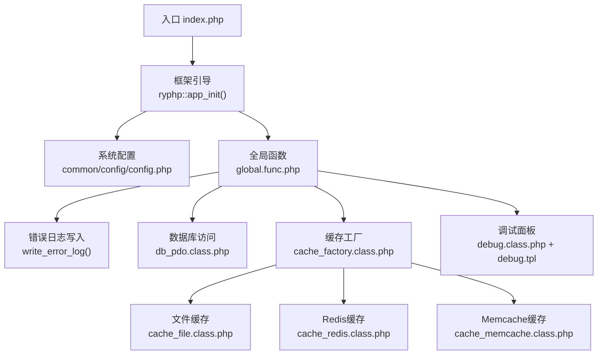
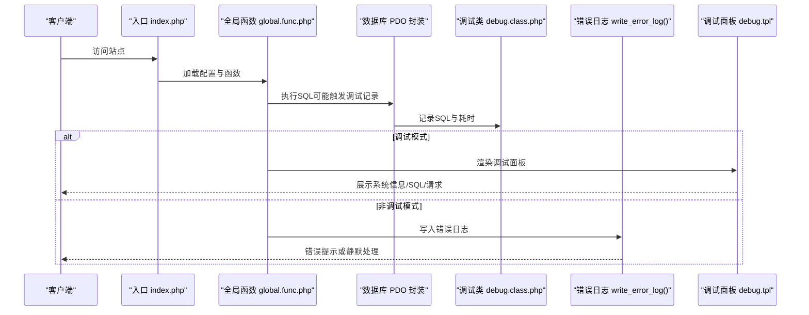
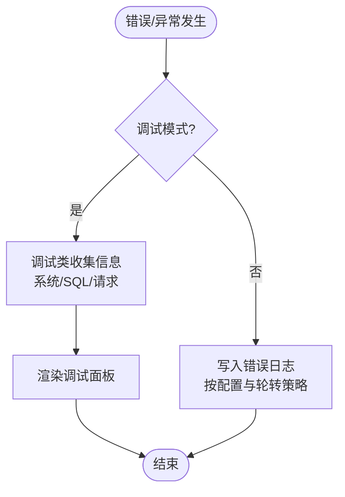
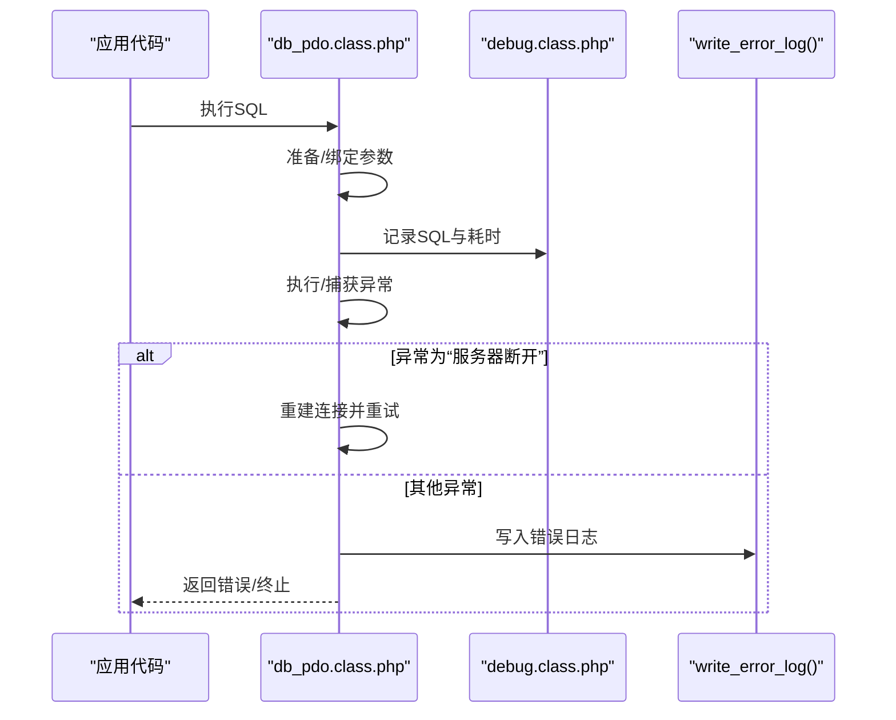
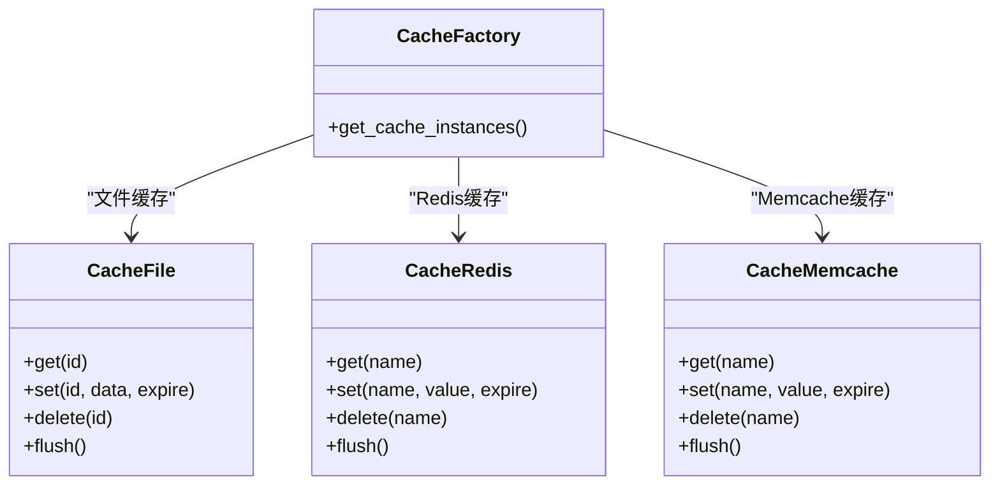
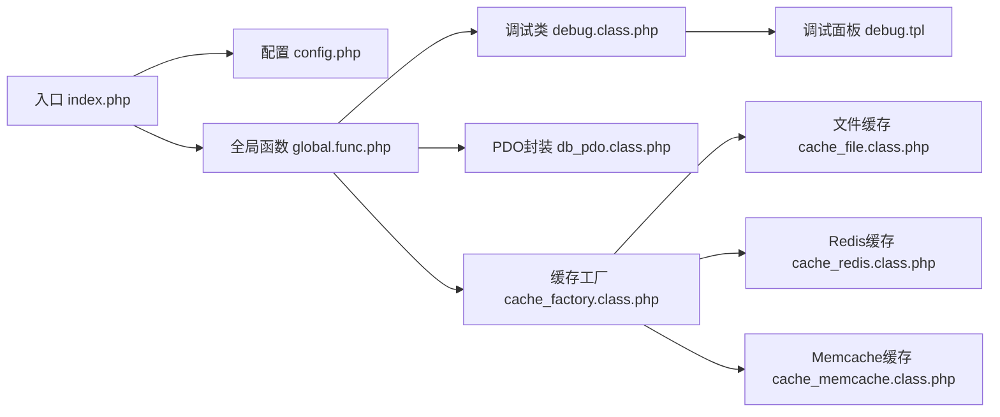

# 监控日志

<cite>
**本文引用的文件**
- [index.php](file://index.php)
- [config.php](file://common/config/config.php)
- [debug.class.php](file://ryphp/core/class/debug.class.php)
- [debug.tpl](file://ryphp/core/message/debug.tpl)
- [global.func.php](file://ryphp/core/function/global.func.php)
- [db_pdo.class.php](file://ryphp/core/class/db_pdo.class.php)
- [cache_factory.class.php](file://ryphp/core/class/cache_factory.class.php)
- [cache_file.class.php](file://ryphp/core/class/cache_file.class.php)
- [cache_redis.class.php](file://ryphp/core/class/cache_redis.class.php)
- [cache_memcache.class.php](file://ryphp/core/class/cache_memcache.class.php)
</cite>

## 目录
1. [简介](#简介)
2. [项目结构](#项目结构)
3. [核心组件](#核心组件)
4. [架构总览](#架构总览)
5. [详细组件分析](#详细组件分析)
6. [依赖关系分析](#依赖关系分析)
7. [性能考量](#性能考量)
8. [故障排查指南](#故障排查指南)
9. [结论](#结论)
10. [附录](#附录)

## 简介
本指南面向LRYBlog监控日志系统的运维与开发人员，围绕系统监控指标（服务器资源、应用性能、数据库性能）、日志管理策略（访问日志、错误日志、调试日志及轮转）、监控工具使用、告警机制、日志分析方法、故障诊断流程以及监控仪表板可视化方案，提供可操作的管理指导。文档基于仓库现有代码实现进行说明，重点覆盖调试面板、错误日志落盘、数据库SQL调试记录、缓存体系与配置等。

## 项目结构
LRYBlog采用单入口入口模式，核心框架位于ryphp目录，应用层位于application目录，公共配置位于common/config，前端静态资源位于common/static。监控与日志能力主要由框架内核与全局函数实现，数据库访问通过PDO封装，缓存支持文件、Redis、Memcache三种后端。

图表来源
- [index.php](file://index.php#L1-L18)
- [config.php](file://common/config/config.php#L1-L88)
- [global.func.php](file://ryphp/core/function/global.func.php#L835-L858)
- [db_pdo.class.php](file://ryphp/core/class/db_pdo.class.php#L1-L646)
- [cache_factory.class.php](file://ryphp/core/class/cache_factory.class.php#L1-L34)
- [cache_file.class.php](file://ryphp/core/class/cache_file.class.php#L1-L130)
- [cache_redis.class.php](file://ryphp/core/class/cache_redis.class.php#L1-L108)
- [cache_memcache.class.php](file://ryphp/core/class/cache_memcache.class.php#L1-L91)
- [debug.class.php](file://ryphp/core/class/debug.class.php#L1-L147)
- [debug.tpl](file://ryphp/core/message/debug.tpl#L1-L75)

章节来源
- [index.php](file://index.php#L1-L18)
- [config.php](file://common/config/config.php#L1-L88)

## 核心组件
- 调试与错误日志
  - 调试类负责收集系统信息、SQL执行记录、请求信息，并在调试模式下渲染调试面板；非调试模式下将错误写入日志文件。
  - 错误日志写入函数按配置控制是否启用，记录时间、URL、客户端IP、POST数据与错误详情，支持日志文件大小轮转。
- 数据库性能与SQL调试
  - PDO封装在执行SQL时记录SQL文本与耗时，配合调试类输出SQL执行明细，便于定位慢查询与异常SQL。
- 缓存体系
  - 工厂模式选择缓存后端（文件/Redis/Memcache），统一提供get/set/delete/flush接口，支持过期时间与命名空间前缀。
- 配置中心
  - 系统配置集中于配置文件，包含数据库、缓存、Cookie、队列、上传等配置项，支持按需启用/禁用。

章节来源
- [debug.class.php](file://ryphp/core/class/debug.class.php#L1-L147)
- [debug.tpl](file://ryphp/core/message/debug.tpl#L1-L75)
- [global.func.php](file://ryphp/core/function/global.func.php#L835-L858)
- [db_pdo.class.php](file://ryphp/core/class/db_pdo.class.php#L100-L124)
- [cache_factory.class.php](file://ryphp/core/class/cache_factory.class.php#L1-L34)
- [cache_file.class.php](file://ryphp/core/class/cache_file.class.php#L1-L130)
- [cache_redis.class.php](file://ryphp/core/class/cache_redis.class.php#L1-L108)
- [cache_memcache.class.php](file://ryphp/core/class/cache_memcache.class.php#L1-L91)
- [config.php](file://common/config/config.php#L1-L88)

## 架构总览
下图展示监控日志相关的关键交互：请求进入入口后，框架加载配置与全局函数，数据库访问通过PDO封装记录SQL与耗时，错误与异常通过调试类与日志函数落盘，调试面板在调试模式下渲染。

图表来源
- [index.php](file://index.php#L10-L18)
- [global.func.php](file://ryphp/core/function/global.func.php#L246-L253)
- [db_pdo.class.php](file://ryphp/core/class/db_pdo.class.php#L100-L124)
- [debug.class.php](file://ryphp/core/class/debug.class.php#L116-L137)
- [debug.tpl](file://ryphp/core/message/debug.tpl#L1-L75)
- [global.func.php](file://ryphp/core/function/global.func.php#L835-L858)

## 详细组件分析

### 调试与错误日志
- 调试类职责
  - 收集系统信息、SQL执行明细、请求参数，计算脚本耗时；在调试模式下渲染调试面板；非调试模式下将错误写入日志。
- 调试面板
  - 包含系统信息、SQL列表、请求详情、路由与会话信息等，支持展开/最小化/关闭。
- 错误日志写入
  - 控制开关来自配置；记录时间、URL、IP、POST数据与错误详情；当日志文件超过阈值时自动轮转；文件首行包含安全保护。

图表来源
- [debug.class.php](file://ryphp/core/class/debug.class.php#L75-L112)
- [debug.tpl](file://ryphp/core/message/debug.tpl#L22-L54)
- [global.func.php](file://ryphp/core/function/global.func.php#L835-L858)

章节来源
- [debug.class.php](file://ryphp/core/class/debug.class.php#L1-L147)
- [debug.tpl](file://ryphp/core/message/debug.tpl#L1-L75)
- [global.func.php](file://ryphp/core/function/global.func.php#L835-L858)

### 数据库性能与SQL调试
- SQL执行记录
  - PDO封装在执行SQL时记录SQL文本与起始时间，配合调试类输出带耗时的SQL明细，便于定位慢查询。
- 异常处理
  - 数据库异常在调试模式下直接展示，非调试模式下写入错误日志并返回通用错误提示。
- 连接与重试
  - 当检测到“服务器断开”错误时，尝试重建连接并重试执行。

图表来源
- [db_pdo.class.php](file://ryphp/core/class/db_pdo.class.php#L100-L124)
- [db_pdo.class.php](file://ryphp/core/class/db_pdo.class.php#L118-L122)
- [debug.class.php](file://ryphp/core/class/debug.class.php#L116-L127)
- [global.func.php](file://ryphp/core/function/global.func.php#L835-L858)

章节来源
- [db_pdo.class.php](file://ryphp/core/class/db_pdo.class.php#L100-L124)
- [db_pdo.class.php](file://ryphp/core/class/db_pdo.class.php#L492-L505)

### 缓存体系与配置
- 工厂模式
  - 根据配置选择缓存后端（文件/Redis/Memcache），提供统一接口。
- 文件缓存
  - 支持序列化/可执行文件两种存储模式，具备过期时间与目录管理。
- Redis/Memcache
  - 支持前缀、过期时间、持久连接等配置，提供get/set/delete/flush操作。

图表来源
- [cache_factory.class.php](file://ryphp/core/class/cache_factory.class.php#L1-L34)
- [cache_file.class.php](file://ryphp/core/class/cache_file.class.php#L1-L130)
- [cache_redis.class.php](file://ryphp/core/class/cache_redis.class.php#L1-L108)
- [cache_memcache.class.php](file://ryphp/core/class/cache_memcache.class.php#L1-L91)

章节来源
- [cache_factory.class.php](file://ryphp/core/class/cache_factory.class.php#L1-L34)
- [cache_file.class.php](file://ryphp/core/class/cache_file.class.php#L1-L130)
- [cache_redis.class.php](file://ryphp/core/class/cache_redis.class.php#L1-L108)
- [cache_memcache.class.php](file://ryphp/core/class/cache_memcache.class.php#L1-L91)

## 依赖关系分析
- 入口与配置
  - 入口文件定义调试开关与根路径，加载框架引导；系统配置集中于配置文件，被全局函数与各组件读取。
- 调试与日志
  - 调试类依赖全局函数提供的错误日志写入；调试面板依赖调试类数据。
- 数据库
  - 全局函数在HTTP请求外部调用时记录请求信息；PDO封装在执行SQL时记录SQL与耗时。
- 缓存
  - 缓存工厂根据配置选择具体实现，文件缓存依赖文件系统，Redis/Memcache依赖扩展。

图表来源
- [index.php](file://index.php#L10-L18)
- [config.php](file://common/config/config.php#L1-L88)
- [global.func.php](file://ryphp/core/function/global.func.php#L246-L253)
- [debug.class.php](file://ryphp/core/class/debug.class.php#L116-L137)
- [debug.tpl](file://ryphp/core/message/debug.tpl#L1-L75)
- [db_pdo.class.php](file://ryphp/core/class/db_pdo.class.php#L100-L124)
- [cache_factory.class.php](file://ryphp/core/class/cache_factory.class.php#L1-L34)
- [cache_file.class.php](file://ryphp/core/class/cache_file.class.php#L1-L130)
- [cache_redis.class.php](file://ryphp/core/class/cache_redis.class.php#L1-L108)
- [cache_memcache.class.php](file://ryphp/core/class/cache_memcache.class.php#L1-L91)

章节来源
- [index.php](file://index.php#L10-L18)
- [config.php](file://common/config/config.php#L1-L88)
- [global.func.php](file://ryphp/core/function/global.func.php#L246-L253)

## 性能考量
- 调试面板
  - 调试模式下会渲染调试面板并输出大量信息，生产环境应关闭调试模式以减少前端渲染与网络传输开销。
- 错误日志
  - 日志文件达到阈值后自动轮转，避免单文件过大影响IO；建议定期清理历史日志。
- 数据库
  - SQL执行耗时记录有助于发现慢查询；建议对热点SQL建立索引、优化WHERE条件与JOIN顺序。
- 缓存
  - 文件缓存适合小规模部署；Redis/Memcache具备更好的并发与内存管理能力，适合高并发场景。
- 配置
  - 合理设置缓存过期时间与前缀，避免缓存雪崩与污染；根据业务调整队列与上传策略。

## 故障排查指南
- 快速定位
  - 开启调试模式查看调试面板，确认系统信息、SQL执行明细与请求详情。
  - 查看错误日志文件，定位错误时间、URL、IP与错误描述。
- 根因分析
  - 数据库异常：检查日志中的SQL与错误信息，确认连接参数、权限与服务器状态；关注“服务器断开”类错误并验证重连逻辑。
  - 缓存异常：确认缓存后端可用性与扩展加载情况，检查前缀与过期时间配置。
- 解决方案
  - 调试模式仅限开发/测试环境使用；生产环境关闭调试模式，确保错误日志记录与统一错误提示。
  - 对慢SQL进行索引优化与查询重构；对缓存后端进行容量与性能评估。
  - 定期轮转与清理日志，避免磁盘占用过高。

章节来源
- [debug.class.php](file://ryphp/core/class/debug.class.php#L75-L112)
- [global.func.php](file://ryphp/core/function/global.func.php#L835-L858)
- [db_pdo.class.php](file://ryphp/core/class/db_pdo.class.php#L118-L122)
- [cache_redis.class.php](file://ryphp/core/class/cache_redis.class.php#L31-L33)
- [cache_memcache.class.php](file://ryphp/core/class/cache_memcache.class.php#L28-L30)

## 结论
LRYBlog监控日志体系以调试类与错误日志为核心，辅以数据库SQL调试记录与缓存配置，形成从应用到数据库的可观测闭环。通过合理配置与规范的日志轮转策略，可在保障生产稳定性的同时，快速定位问题并持续优化性能。建议在生产环境关闭调试模式，启用错误日志记录，并结合外部监控工具构建更全面的仪表板与告警体系。

## 附录

### 监控指标与管理策略
- 服务器资源监控
  - CPU、内存、磁盘、网络IO等基础指标；建议结合系统自带工具或第三方监控平台采集。
- 应用性能监控
  - 页面响应时间、吞吐量、错误率；利用调试面板与错误日志辅助定位异常。
- 数据库性能监控
  - QPS、慢查询、连接数、锁等待；结合SQL调试记录与数据库慢查询日志分析。
- 日志管理策略
  - 访问日志：建议由Web服务器生成并轮转。
  - 错误日志：系统内置错误日志写入，按配置启用与轮转。
  - 调试日志：仅在调试模式下输出，生产环境关闭。
- 告警机制
  - 基于错误日志数量、慢查询比例、数据库连接异常等阈值触发；通知方式可结合邮件/IM等。
- 日志分析方法
  - 解析错误日志字段（时间、URL、IP、错误详情），提取关键信息进行统计与趋势分析。
- 仪表板与可视化
  - 建议使用可视化工具聚合错误日志、数据库指标与应用指标，形成统一监控看板。

### 配置要点清单
- 调试开关
  - 入口文件定义调试开关，生产环境建议关闭。
- 错误日志
  - 配置项控制是否保存错误日志；日志文件大小阈值与轮转策略。
- 数据库
  - 连接参数、字符集、表前缀、扩展选择（PDO/MySQLi/MySQL）。
- 缓存
  - 缓存类型与后端参数（文件/Redis/Memcache），过期时间与前缀。
- Cookie/会话
  - 作用域、路径、生命周期、安全标志等。

章节来源
- [index.php](file://index.php#L10-L10)
- [config.php](file://common/config/config.php#L1-L88)
- [global.func.php](file://ryphp/core/function/global.func.php#L835-L858)
- [cache_file.class.php](file://ryphp/core/class/cache_file.class.php#L34-L46)
- [cache_redis.class.php](file://ryphp/core/class/cache_redis.class.php#L13-L22)
- [cache_memcache.class.php](file://ryphp/core/class/cache_memcache.class.php#L13-L20)