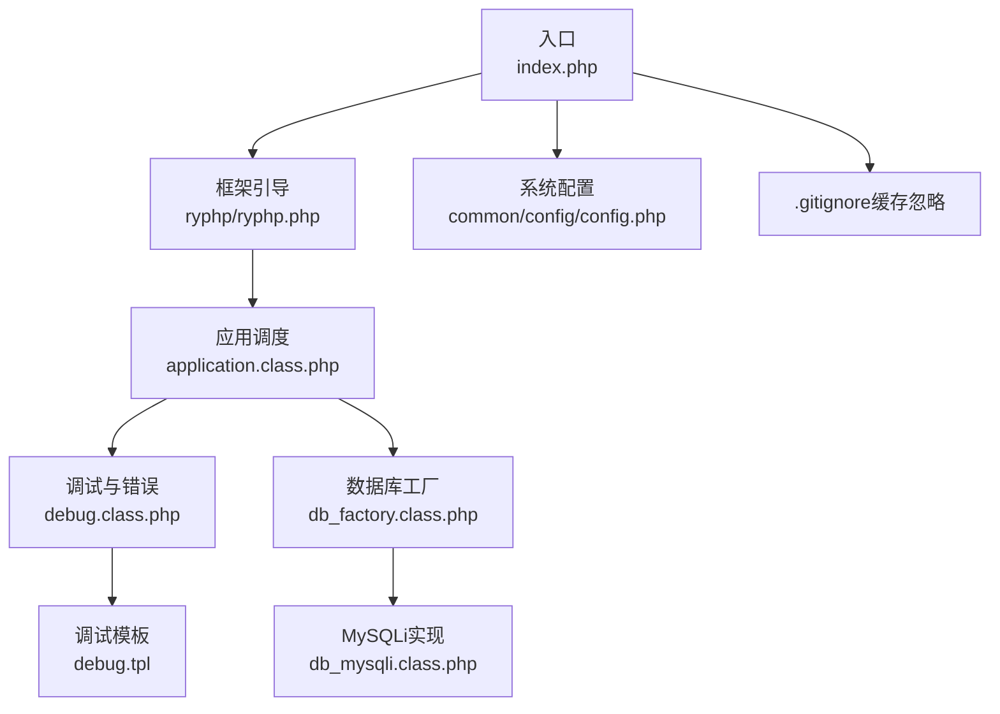
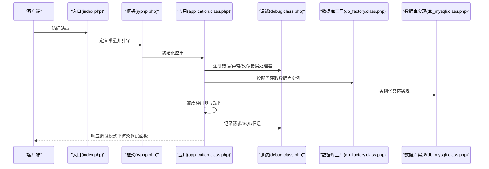
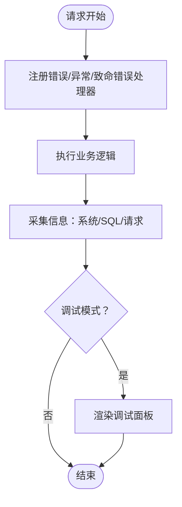
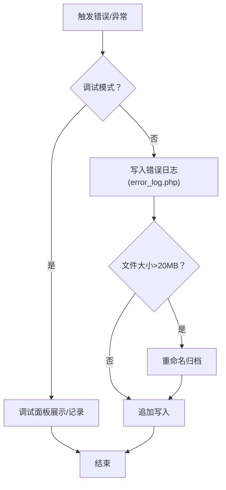
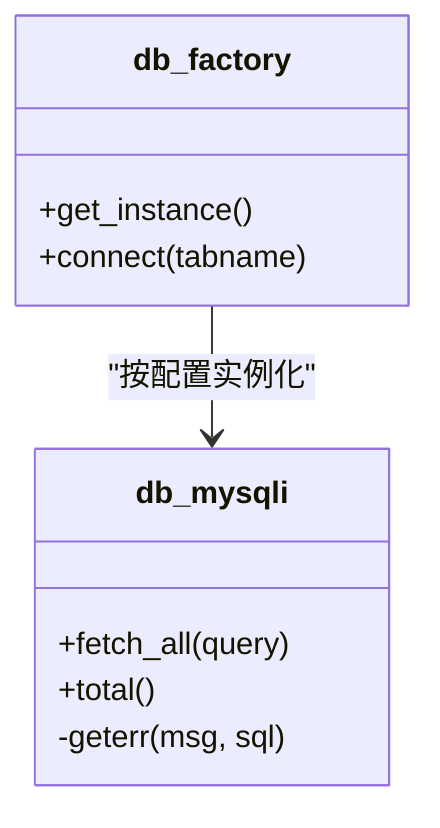
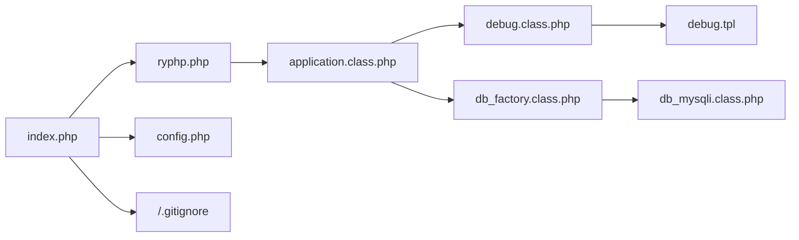

# 系统监控

<cite>
**本文引用的文件**
- [index.php](file://index.php)
- [ryphp.php](file://ryphp/ryphp.php)
- [application.class.php](file://ryphp/core/class/application.class.php)
- [debug.class.php](file://ryphp/core/class/debug.class.php)
- [debug.tpl](file://ryphp/core/message/debug.tpl)
- [global.func.php](file://ryphp/core/function/global.func.php)
- [config.php](file://common/config/config.php)
- [db_factory.class.php](file://ryphp/core/class/db_factory.class.php)
- [db_mysqli.class.php](file://ryphp/core/class/db_mysqli.class.php)
- [.gitignore](file://.gitignore)
</cite>

## 目录
1. [简介](#简介)
2. [项目结构](#项目结构)
3. [核心组件](#核心组件)
4. [架构总览](#架构总览)
5. [详细组件分析](#详细组件分析)
6. [依赖关系分析](#依赖关系分析)
7. [性能考量](#性能考量)
8. [故障排查指南](#故障排查指南)
9. [结论](#结论)
10. [附录](#附录)

## 简介
本指南面向LRYBlog系统，围绕服务器资源监控、应用性能监控、调试模式启用与配置、错误监控机制以及监控数据可视化展开，帮助运维与开发人员建立完善的监控体系与最佳实践。

## 项目结构
LRYBlog采用单入口与框架内核分离的结构：入口文件负责开启调试模式、定义常量并启动框架；框架内核负责路由、类加载、错误与异常处理、消息提示与调试面板渲染；系统配置集中于公共配置文件；数据库访问通过工厂模式按配置选择具体实现。

**图表来源**
- [index.php](file://index.php#L1-L18)
- [ryphp.php](file://ryphp/ryphp.php#L1-L204)
- [application.class.php](file://ryphp/core/class/application.class.php#L1-L118)
- [debug.class.php](file://ryphp/core/class/debug.class.php#L1-L147)
- [debug.tpl](file://ryphp/core/message/debug.tpl#L1-L75)
- [db_factory.class.php](file://ryphp/core/class/db_factory.class.php#L1-L50)
- [db_mysqli.class.php](file://ryphp/core/class/db_mysqli.class.php#L496-L540)
- [config.php](file://common/config/config.php#L1-L88)
- [.gitignore](file://.gitignore#L1-L6)

**章节来源**
- [index.php](file://index.php#L1-L18)
- [ryphp.php](file://ryphp/ryphp.php#L1-L204)
- [application.class.php](file://ryphp/core/class/application.class.php#L1-L118)
- [debug.class.php](file://ryphp/core/class/debug.class.php#L1-L147)
- [debug.tpl](file://ryphp/core/message/debug.tpl#L1-L75)
- [db_factory.class.php](file://ryphp/core/class/db_factory.class.php#L1-L50)
- [db_mysqli.class.php](file://ryphp/core/class/db_mysqli.class.php#L496-L540)
- [config.php](file://common/config/config.php#L1-L88)
- [.gitignore](file://.gitignore#L1-L6)

## 核心组件
- 调试与错误监控
  - 调试类负责记录系统信息、SQL执行明细、请求参数与耗时，并在调试模式下渲染调试面板。
  - 应用层注册致命错误、错误与异常处理器，统一拦截并按模式输出或落盘。
- 数据库监控
  - 工厂根据配置选择数据库实现；在调试模式下，错误直接呈现，非调试模式下写入错误日志并统一提示。
- 配置与常量
  - 入口定义调试开关与URL模式；框架定义系统起始时间、站点URL等；系统配置控制错误页、错误日志开关、数据库与缓存类型等。

**章节来源**
- [debug.class.php](file://ryphp/core/class/debug.class.php#L1-L147)
- [application.class.php](file://ryphp/core/class/application.class.php#L1-L118)
- [global.func.php](file://ryphp/core/function/global.func.php#L813-L858)
- [config.php](file://common/config/config.php#L1-L88)
- [index.php](file://index.php#L1-L18)
- [ryphp.php](file://ryphp/ryphp.php#L1-L204)

## 架构总览
下图展示从请求到响应的关键路径，以及调试与错误处理的介入点。

**图表来源**
- [index.php](file://index.php#L1-L18)
- [ryphp.php](file://ryphp/ryphp.php#L1-L204)
- [application.class.php](file://ryphp/core/class/application.class.php#L1-L118)
- [debug.class.php](file://ryphp/core/class/debug.class.php#L1-L147)
- [db_factory.class.php](file://ryphp/core/class/db_factory.class.php#L1-L50)
- [db_mysqli.class.php](file://ryphp/core/class/db_mysqli.class.php#L496-L540)

## 详细组件分析

### 调试模式与调试面板
- 启用与隐藏
  - 入口定义调试常量以开启调试模式；可通过隐藏常量在生产环境仍保留调试能力但不渲染面板。
- 调试信息采集
  - 记录系统信息、SQL语句及执行耗时、HTTP请求方法与参数。
- 调试面板渲染
  - 模板以悬浮窗形式展示，支持展开/最小化/关闭，包含运行耗时、路由信息、会话信息与框架版本等。

**图表来源**
- [application.class.php](file://ryphp/core/class/application.class.php#L1-L118)
- [debug.class.php](file://ryphp/core/class/debug.class.php#L1-L147)
- [debug.tpl](file://ryphp/core/message/debug.tpl#L1-L75)

**章节来源**
- [index.php](file://index.php#L1-L18)
- [debug.class.php](file://ryphp/core/class/debug.class.php#L1-L147)
- [debug.tpl](file://ryphp/core/message/debug.tpl#L1-L75)
- [application.class.php](file://ryphp/core/class/application.class.php#L1-L118)

### 错误监控与日志
- 致命错误捕获
  - 在脚本终止时检测最后错误，调试模式下直接呈现，否则写入错误日志并统一提示。
- 错误与异常处理
  - 普通错误与异常在调试模式下以彩色信息展示，在非调试模式下写入错误日志并统一提示。
- 错误日志落盘
  - 日志包含时间、URL、IP、POST数据与错误详情，自动创建目录、按大小轮转、首行保护。

**图表来源**
- [debug.class.php](file://ryphp/core/class/debug.class.php#L43-L112)
- [global.func.php](file://ryphp/core/function/global.func.php#L813-L858)

**章节来源**
- [debug.class.php](file://ryphp/core/class/debug.class.php#L43-L112)
- [global.func.php](file://ryphp/core/function/global.func.php#L813-L858)

### 数据库监控与性能
- 实现选择
  - 工厂根据配置选择mysql/mysqli/pdo实现，默认按配置加载。
- 错误处理
  - 调试模式下直接呈现MySQL错误详情，非调试模式下写入错误日志并统一提示；AJAX场景返回JSON错误。
- 性能采集
  - SQL执行耗时在调试模式下记录，便于定位慢查询。

**图表来源**
- [db_factory.class.php](file://ryphp/core/class/db_factory.class.php#L1-L50)
- [db_mysqli.class.php](file://ryphp/core/class/db_mysqli.class.php#L496-L540)

**章节来源**
- [db_factory.class.php](file://ryphp/core/class/db_factory.class.php#L1-L50)
- [db_mysqli.class.php](file://ryphp/core/class/db_mysqli.class.php#L496-L540)

### 配置与常量
- 调试与URL
  - 入口定义调试常量与URL模式；框架定义系统起始时间、站点URL等。
- 系统配置
  - 控制错误页、错误日志开关、数据库类型与连接参数、缓存类型与参数等。

**章节来源**
- [index.php](file://index.php#L1-L18)
- [ryphp.php](file://ryphp/ryphp.php#L1-L204)
- [config.php](file://common/config/config.php#L1-L88)

## 依赖关系分析
- 入口依赖框架引导；框架依赖应用调度；应用调度依赖调试与数据库工厂；调试依赖模板；数据库工厂依赖具体实现。
- 配置贯穿全局，影响错误日志、数据库与缓存行为。

**图表来源**
- [index.php](file://index.php#L1-L18)
- [ryphp.php](file://ryphp/ryphp.php#L1-L204)
- [application.class.php](file://ryphp/core/class/application.class.php#L1-L118)
- [debug.class.php](file://ryphp/core/class/debug.class.php#L1-L147)
- [debug.tpl](file://ryphp/core/message/debug.tpl#L1-L75)
- [db_factory.class.php](file://ryphp/core/class/db_factory.class.php#L1-L50)
- [db_mysqli.class.php](file://ryphp/core/class/db_mysqli.class.php#L496-L540)
- [config.php](file://common/config/config.php#L1-L88)
- [.gitignore](file://.gitignore#L1-L6)

**章节来源**
- [index.php](file://index.php#L1-L18)
- [ryphp.php](file://ryphp/ryphp.php#L1-L204)
- [application.class.php](file://ryphp/core/class/application.class.php#L1-L118)
- [debug.class.php](file://ryphp/core/class/debug.class.php#L1-L147)
- [debug.tpl](file://ryphp/core/message/debug.tpl#L1-L75)
- [db_factory.class.php](file://ryphp/core/class/db_factory.class.php#L1-L50)
- [db_mysqli.class.php](file://ryphp/core/class/db_mysqli.class.php#L496-L540)
- [config.php](file://common/config/config.php#L1-L88)
- [.gitignore](file://.gitignore#L1-L6)

## 性能考量
- 调试模式成本
  - 调试模式会记录SQL与请求信息并渲染面板，生产环境应关闭以降低开销。
- 错误日志轮转
  - 日志文件超过阈值自动归档，避免单文件过大影响IO。
- 缓存与数据库
  - 通过配置切换缓存与数据库实现，结合慢查询与错误日志定位瓶颈。

**章节来源**
- [debug.class.php](file://ryphp/core/class/debug.class.php#L1-L147)
- [global.func.php](file://ryphp/core/function/global.func.php#L813-L858)
- [config.php](file://common/config/config.php#L1-L88)

## 故障排查指南
- 开启调试模式
  - 在入口文件中启用调试常量，以便在页面底部看到调试面板与运行耗时。
- 查看调试面板
  - 面板包含系统信息、SQL明细、请求参数、路由与会话信息，便于快速定位问题。
- 错误日志定位
  - 非调试模式下错误写入日志文件，结合URL/IP与POST数据定位问题。
- 数据库错误
  - 调试模式下直接呈现MySQL错误详情；非调试模式下统一提示并记录日志。

**章节来源**
- [index.php](file://index.php#L1-L18)
- [debug.tpl](file://ryphp/core/message/debug.tpl#L1-L75)
- [debug.class.php](file://ryphp/core/class/debug.class.php#L43-L112)
- [global.func.php](file://ryphp/core/function/global.func.php#L813-L858)
- [db_mysqli.class.php](file://ryphp/core/class/db_mysqli.class.php#L514-L526)

## 结论
LRYBlog提供了完善的调试与错误监控基础：调试面板直观展示运行信息与SQL明细，错误与异常在不同模式下分别呈现或落盘，数据库实现可按配置切换并在调试模式下直接反馈错误。结合系统配置与缓存策略，可在保证可观测性的同时兼顾性能与稳定性。

## 附录

### 服务器资源监控指标建议
- CPU使用率
  - 使用系统自带工具或第三方监控平台定期采集CPU负载与进程级CPU占比，结合业务峰值时段分析。
- 内存占用
  - 关注PHP-FPM进程内存、系统可用内存与交换分区使用情况，识别内存泄漏或配置不足。
- 磁盘空间
  - 监控站点根目录、缓存目录与日志目录的剩余空间，设置阈值告警并定期清理。
- 网络流量
  - 统计入口带宽与各模块访问量，识别异常流量或DDoS迹象。

### 应用性能监控策略
- 页面加载时间
  - 以调试面板中的运行耗时为参考，结合前端性能指标（TTFB、FP、FCP、INP）评估整体体验。
- 数据库查询性能
  - 通过调试面板SQL明细定位慢查询，配合数据库慢查询日志与索引优化。
- 并发用户数与响应时间
  - 使用压测工具模拟并发，观察响应时间与错误率，结合日志定位瓶颈。

### 调试模式启用与配置
- 启用
  - 在入口文件中开启调试常量，确保仅在开发/测试环境启用。
- 隐藏调试面板
  - 可通过隐藏常量在保留调试能力的同时不在页面渲染面板。
- URL模式
  - 入口定义URL模式常量，影响URL生成策略，便于前后端联调与部署。

**章节来源**
- [index.php](file://index.php#L1-L18)
- [ryphp.php](file://ryphp/ryphp.php#L1-L204)
- [debug.class.php](file://ryphp/core/class/debug.class.php#L1-L147)

### 错误监控机制
- 致命错误捕获
  - 在脚本终止时检测最后错误，调试模式直接呈现，非调试模式写入日志并统一提示。
- 异常处理
  - 普通异常在调试模式下彩色展示，非调试模式写入日志并统一提示。
- 错误日志记录
  - 包含时间、URL、IP、POST数据与错误详情，自动轮转与保护。

**章节来源**
- [debug.class.php](file://ryphp/core/class/debug.class.php#L43-L112)
- [global.func.php](file://ryphp/core/function/global.func.php#L813-L858)

### 监控数据可视化与仪表板
- 调试信息模板
  - 调试面板模板提供交互式展示，适合开发阶段快速定位问题。
- 仪表板建议
  - 结合系统日志、错误日志与数据库慢查询日志，构建包含CPU、内存、磁盘、网络与业务指标的可视化看板。

**章节来源**
- [debug.tpl](file://ryphp/core/message/debug.tpl#L1-L75)
- [global.func.php](file://ryphp/core/function/global.func.php#L813-L858)

### 性能优化建议与最佳实践
- 生产环境关闭调试模式，避免额外开销。
- 合理配置缓存与数据库连接，利用慢查询与错误日志持续优化。
- 对热点接口与数据库查询进行压测与容量规划，确保高并发稳定运行。
- 定期清理缓存与日志，监控磁盘空间与日志轮转策略。