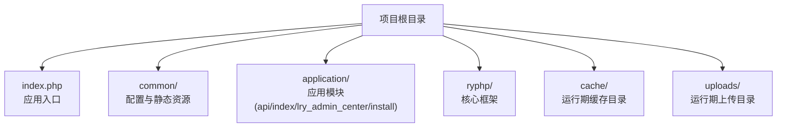
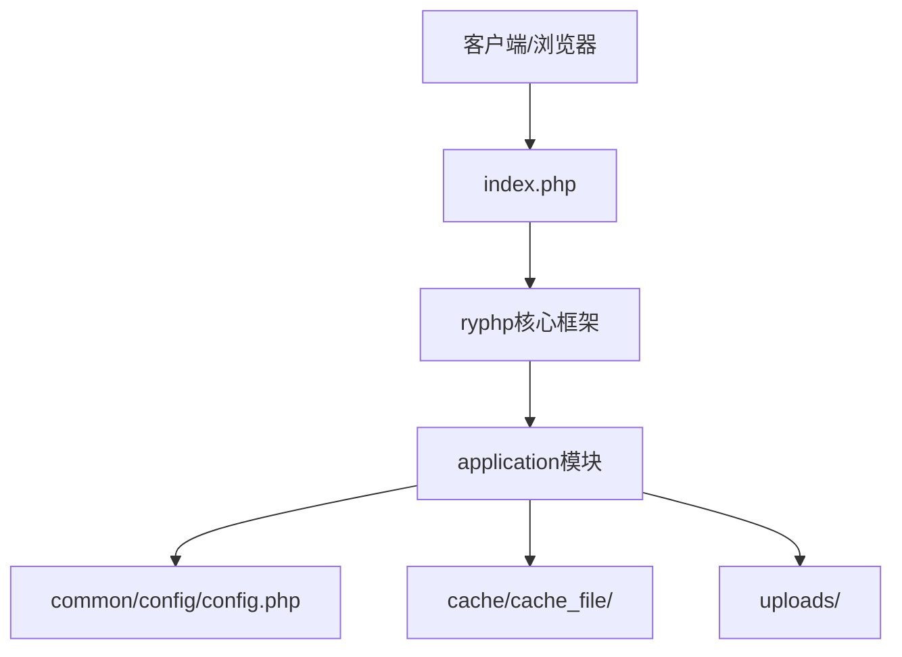
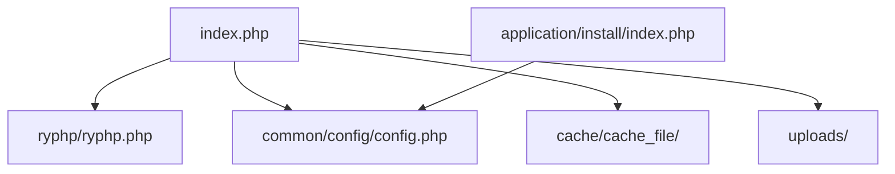

# 代码部署

<cite>
**本文引用的文件**
- [index.php](file://index.php)
- [common/config/config.php](file://common/config/config.php)
- [application/install/index.php](file://application/install/index.php)
- [application/install/templates/s2.php](file://application/install/templates/s2.php)
- [.gitignore](file://.gitignore)
- [README.md](file://README.md)
- [ryphp/core/class/cache_file.class.php](file://ryphp/core/class/cache_file.class.php)
- [ryphp/core/class/upload.class.php](file://ryphp/core/class/upload.class.php)
- [backup_mysql_claude.sh](file://backup_mysql_claude.sh)
- [restore_mysql_claude.sh](file://restore_mysql_claude.sh)
</cite>

## 目录
1. [简介](#简介)
2. [项目结构](#项目结构)
3. [核心组件](#核心组件)
4. [架构总览](#架构总览)
5. [详细组件分析](#详细组件分析)
6. [依赖关系分析](#依赖关系分析)
7. [性能考量](#性能考量)
8. [故障排查指南](#故障排查指南)
9. [结论](#结论)
10. [附录](#附录)

## 简介
本指南面向LRYBlog项目的运维与开发人员，提供两种部署方式的完整操作流程：FTP上传与Git部署，并结合代码库实际行为，明确目录结构、文件权限、符号链接、以及部署后的基础验证步骤。同时总结常见权限问题与最佳实践，帮助快速、稳定地完成上线。

## 项目结构
LRYBlog采用“前端入口 + 核心框架 + 应用模块 + 静态资源 + 缓存与上传目录”的组织方式。根目录包含应用入口、核心框架、应用模块、公共配置与静态资源等；缓存与上传目录在运行期动态生成，需具备写权限。

图表来源
- [index.php](file://index.php#L1-L18)
- [common/config/config.php](file://common/config/config.php#L1-L88)
- [application/install/index.php](file://application/install/index.php#L1-L373)

章节来源
- [index.php](file://index.php#L1-L18)
- [common/config/config.php](file://common/config/config.php#L1-L88)
- [application/install/index.php](file://application/install/index.php#L1-L373)

## 核心组件
- 应用入口与初始化
  - 入口文件负责常量定义、根路径与框架加载，并初始化应用。
- 配置中心
  - 系统配置集中于公共配置文件，包含数据库、缓存、上传、Cookie等关键项。
- 缓存与上传
  - 缓存类负责缓存文件的创建、读取与清理；上传类负责文件上传路径检查、权限校验与移动。
- 安装器
  - 安装流程包含环境检测、参数配置、数据库初始化与安装锁生成，期间会检测关键目录与文件的读写权限。

章节来源
- [index.php](file://index.php#L1-L18)
- [common/config/config.php](file://common/config/config.php#L1-L88)
- [ryphp/core/class/cache_file.class.php](file://ryphp/core/class/cache_file.class.php#L1-L130)
- [ryphp/core/class/upload.class.php](file://ryphp/core/class/upload.class.php#L1-L241)
- [application/install/index.php](file://application/install/index.php#L1-L373)

## 架构总览
LRYBlog采用“入口文件 → 核心框架 → 应用模块 → 数据库/文件系统”的典型PHP MVC结构。部署时需保证入口文件可访问、核心框架可加载、配置文件可写（安装阶段）、缓存与上传目录可写。

图表来源
- [index.php](file://index.php#L1-L18)
- [common/config/config.php](file://common/config/config.php#L1-L88)
- [ryphp/core/class/cache_file.class.php](file://ryphp/core/class/cache_file.class.php#L1-L130)
- [ryphp/core/class/upload.class.php](file://ryphp/core/class/upload.class.php#L1-L241)

## 详细组件分析

### FTP上传部署
- 适用场景
  - 无Git环境或希望直接覆盖文件的场景。
- 基本步骤
  - 准备：确保目标服务器具备PHP与Web服务器环境，数据库可用。
  - 上传：将仓库内所有文件与目录整体上传至站点根目录。
  - 权限：根据安装器与运行期需求，设置关键目录与文件权限。
  - 初始化：访问安装器完成数据库初始化与配置写入。
- 关键点
  - 安装器会在环境检测阶段列出需检查的目录与文件，包括缓存、上传、公共配置等。
  - 安装完成后会生成安装锁文件以阻止重复安装。

章节来源
- [application/install/templates/s2.php](file://application/install/templates/s2.php#L83-L127)
- [application/install/index.php](file://application/install/index.php#L15-L275)

### Git部署
- 适用场景
  - 需要版本控制与自动化部署的场景。
- 基本步骤
  - 在服务器上克隆仓库或配置Git钩子自动拉取。
  - 安装依赖（PHP扩展、数据库）。
  - 设置站点根目录指向仓库根目录。
  - 初始化：访问安装器完成数据库初始化与配置写入。
- 注意事项
  - .gitignore中排除了缓存目录，部署后需手动创建或由运行期自动生成。
  - README中提示可参考GIT代理配置文档（若网络受限）。

章节来源
- [.gitignore](file://.gitignore#L1-L8)
- [README.md](file://README.md#L1-L6)
- [application/install/index.php](file://application/install/index.php#L15-L275)

### 目录结构与权限要求
- cache/cache_file/
  - 用途：存放运行期缓存文件。
  - 权限：需可写，以便缓存类创建与写入缓存文件。
  - 行为依据：缓存类在写入前会创建目录并设置文件权限。
- uploads/
  - 用途：存放运行期上传的媒体文件。
  - 权限：需可写，以便上传类创建按日期划分的上传目录并移动文件。
  - 行为依据：上传类在检查路径时会尝试创建目录并设置权限。
- common/config/config.php
  - 用途：系统配置文件。
  - 权限：安装阶段需可写，以便安装器写入数据库与站点配置。
  - 行为依据：安装器在写入配置前会检查该文件的可写性。
- 其他目录
  - application/install/：安装器相关文件，部署后通常无需保留。
  - application/lry_admin_center/：后台管理模块，需可读。
  - common/static/：静态资源，需可读。

章节来源
- [ryphp/core/class/cache_file.class.php](file://ryphp/core/class/cache_file.class.php#L40-L46)
- [ryphp/core/class/cache_file.class.php](file://ryphp/core/class/cache_file.class.php#L103-L112)
- [ryphp/core/class/upload.class.php](file://ryphp/core/class/upload.class.php#L81-L94)
- [ryphp/core/class/upload.class.php](file://ryphp/core/class/upload.class.php#L155-L166)
- [application/install/index.php](file://application/install/index.php#L321-L335)
- [application/install/templates/s2.php](file://application/install/templates/s2.php#L83-L127)

### 符号链接的创建与作用
- 作用
  - 将运行期生成的目录（如cache、uploads）映射到独立挂载或共享存储，便于备份与扩容。
- 创建方法（示例）
  - 将线上真实目录作为源，将仓库中的对应目录替换为符号链接，指向真实目录。
  - 示例命令（请根据实际路径调整）：
    - mv cache cache.bak
    - ln -s /real/path/to/cache cache
    - mv uploads uploads.bak
    - ln -s /real/path/to/uploads uploads
- 注意事项
  - 确保Web进程用户对符号链接与目标目录均具备读写权限。
  - 部署后需验证缓存与上传功能正常。

[本节为通用实践说明，不直接分析具体文件，故无章节来源]

### 部署后的基本验证步骤
- 访问首页
  - 确认页面可正常加载，无500错误。
- 访问安装器
  - 若未完成安装，访问安装器进行初始化；若已安装，确认安装锁文件存在。
- 检查缓存与上传
  - 触发一次缓存写入或访问需要缓存的页面，确认cache目录下生成缓存文件。
  - 上传一张图片，确认uploads目录下生成按日期划分的子目录与文件。
- 配置文件
  - 确认common/config/config.php可读，安装阶段应已完成写入。
- 伪静态与重定向
  - 访问后台或特定页面，确认伪静态规则生效。

章节来源
- [application/install/index.php](file://application/install/index.php#L15-L275)
- [application/install/templates/s5.php](file://application/install/templates/s5.php#L1-L23)
- [ryphp/core/class/cache_file.class.php](file://ryphp/core/class/cache_file.class.php#L40-L46)
- [ryphp/core/class/upload.class.php](file://ryphp/core/class/upload.class.php#L81-L94)

## 依赖关系分析
- 入口依赖
  - index.php依赖ryphp核心框架入口文件，确保框架可加载。
- 配置依赖
  - 配置文件集中于common/config/config.php，被各模块读取。
- 运行期依赖
  - 缓存与上传目录在运行期动态生成，需具备写权限。
- 安装期依赖
  - 安装器在写入配置前会检查配置文件的可写性。

图表来源
- [index.php](file://index.php#L1-L18)
- [common/config/config.php](file://common/config/config.php#L1-L88)
- [application/install/index.php](file://application/install/index.php#L321-L335)

章节来源
- [index.php](file://index.php#L1-L18)
- [common/config/config.php](file://common/config/config.php#L1-L88)
- [application/install/index.php](file://application/install/index.php#L321-L335)

## 性能考量
- 缓存策略
  - 使用文件型缓存时，建议定期清理过期缓存，避免目录膨胀。
- 上传优化
  - 合理设置上传大小与类型白名单，减少无效请求。
- 静态资源
  - 将静态资源置于CDN或启用浏览器缓存，降低服务器压力。

[本节提供一般性建议，不直接分析具体文件，故无章节来源]

## 故障排查指南
- 缓存目录不可写
  - 现象：缓存类无法创建缓存文件或写入失败。
  - 排查：确认cache/cache_file/目录存在且具备写权限；必要时手动创建并赋予0755或0777权限。
  - 参考实现：缓存类在写入前会创建目录并设置文件权限。
- 上传目录不可写
  - 现象：上传类无法创建按日期划分的上传目录或移动文件失败。
  - 排查：确认uploads/目录具备写权限；必要时手动创建并赋予0755或0777权限。
  - 参考实现：上传类在检查路径时会尝试创建目录并设置权限。
- 配置文件不可写
  - 现象：安装器无法写入数据库与站点配置。
  - 排查：确认common/config/config.php具备写权限；安装完成后可按需回收权限。
  - 参考实现：安装器在写入配置前会检查该文件的可写性。
- 安装锁导致无法重复安装
  - 现象：安装器提示已安装并退出。
  - 排查：删除cache/install.lock后重试安装（注意备份数据）。
  - 参考实现：安装器在检测到安装锁时直接退出。
- 权限最佳实践
  - 目录：0755（rwxr-xr-x），文件：0644（rw-r–r–）；特殊写入场景（如安装、缓存、上传）可临时提升至0777，完成后回收。
  - 重要：避免长期保持0777，存在安全风险。

章节来源
- [ryphp/core/class/cache_file.class.php](file://ryphp/core/class/cache_file.class.php#L40-L46)
- [ryphp/core/class/cache_file.class.php](file://ryphp/core/class/cache_file.class.php#L103-L112)
- [ryphp/core/class/upload.class.php](file://ryphp/core/class/upload.class.php#L81-L94)
- [ryphp/core/class/upload.class.php](file://ryphp/core/class/upload.class.php#L155-L166)
- [application/install/index.php](file://application/install/index.php#L15-L275)
- [application/install/index.php](file://application/install/index.php#L321-L335)

## 结论
- 选择部署方式时，优先考虑Git部署以获得版本控制与自动化能力；若无Git环境，FTP上传亦可满足需求。
- 部署的关键在于正确设置cache、uploads与配置文件的权限，并在安装后进行基础验证。
- 遇到权限问题，遵循“临时提升、尽快回收”的原则，确保安全与稳定兼顾。

[本节为总结性内容，不直接分析具体文件，故无章节来源]

## 附录

### 数据库备份与恢复脚本
- 备份脚本
  - 功能：支持全库或单库备份，可选压缩、单事务、存储过程与触发器包含等。
  - 使用：./backup_mysql_claude.sh [数据库名] [选项]
- 恢复脚本
  - 功能：支持压缩与非压缩备份文件恢复，可选覆盖或删除后重建。
  - 使用：./restore_mysql_claude.sh <备份文件> [目标数据库名] [选项]

章节来源
- [backup_mysql_claude.sh](file://backup_mysql_claude.sh#L1-L392)
- [restore_mysql_claude.sh](file://restore_mysql_claude.sh#L1-L412)