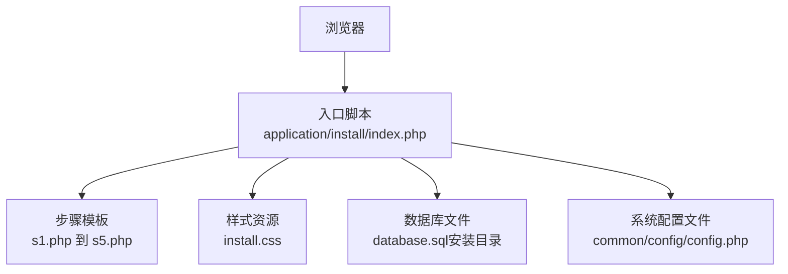
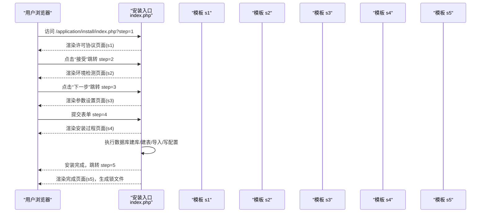
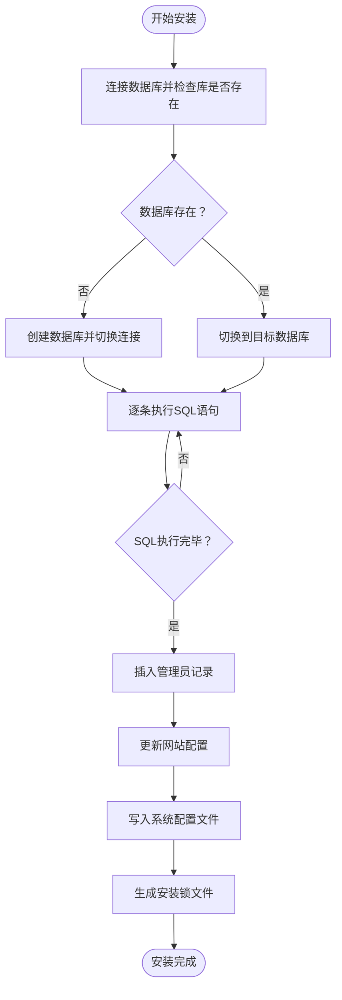
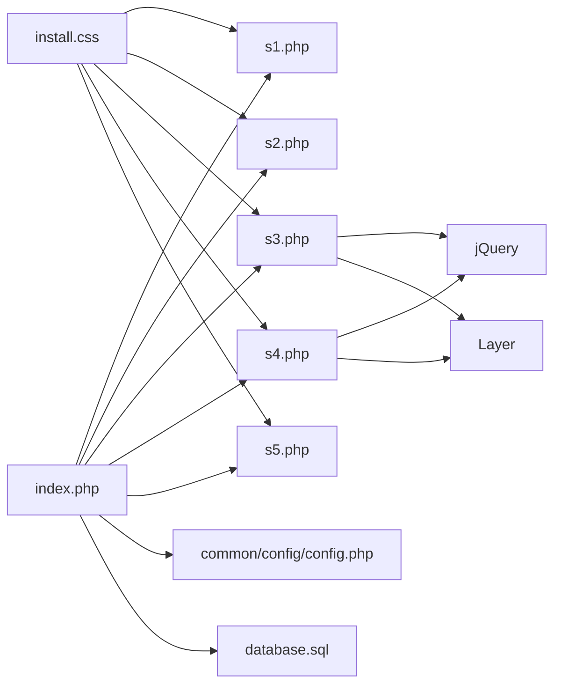

# 安装向导使用

<cite>
**本文引用的文件**
- [application/install/index.php](file://application/install/index.php)
- [application/install/templates/s1.php](file://application/install/templates/s1.php)
- [application/install/templates/s2.php](file://application/install/templates/s2.php)
- [application/install/templates/s3.php](file://application/install/templates/s3.php)
- [application/install/templates/s4.php](file://application/install/templates/s4.php)
- [application/install/templates/s5.php](file://application/install/templates/s5.php)
- [application/install/css/install.css](file://application/install/css/install.css)
- [common/config/config.php](file://common/config/config.php)
</cite>

## 目录
1. [简介](#简介)
2. [项目结构](#项目结构)
3. [核心组件](#核心组件)
4. [架构总览](#架构总览)
5. [详细组件分析](#详细组件分析)
6. [依赖关系分析](#依赖关系分析)
7. [性能考虑](#性能考虑)
8. [故障排除指南](#故障排除指南)
9. [结论](#结论)
10. [附录](#附录)

## 简介
本指南面向首次部署 LRYBlog 的用户，完整讲解“安装向导”的使用流程与注意事项。内容覆盖安装向导的启动方式、五步安装流程（许可协议、环境检测、参数设置、安装过程、安装完成）、各步骤中的选项与配置项（数据库配置、管理员账户设置等），并提供常见问题与解决方案、安装后的初始化设置与基本配置建议，以及安装失败的诊断方法与重试步骤。

## 项目结构
LRYBlog 的安装向导位于 application/install 目录，采用多模板页 + 单入口控制器的结构：
- 入口脚本：application/install/index.php
- 步骤模板：application/install/templates/s1.php 到 s5.php
- 样式：application/install/css/install.css
- 默认系统配置：common/config/config.php（安装完成后写入）

图示来源
- [application/install/index.php:1-373](file://application/install/index.php#L1-L373)
- [application/install/templates/s1.php:1-45](file://application/install/templates/s1.php#L1-L45)
- [application/install/templates/s2.php:1-135](file://application/install/templates/s2.php#L1-L135)
- [application/install/templates/s3.php:1-217](file://application/install/templates/s3.php#L1-L217)
- [application/install/templates/s4.php:1-73](file://application/install/templates/s4.php#L1-L73)
- [application/install/templates/s5.php:1-23](file://application/install/templates/s5.php#L1-L23)
- [application/install/css/install.css:1-219](file://application/install/css/install.css#L1-L219)
- [common/config/config.php:1-88](file://common/config/config.php#L1-L88)

章节来源
- [application/install/index.php:1-373](file://application/install/index.php#L1-L373)

## 核心组件
- 入口控制器：负责解析步骤参数、渲染对应模板、执行安装逻辑（数据库连接、建库、建表、导入数据、写入配置、生成锁文件等）。
- 步骤模板：分别承载许可协议、环境检测、参数设置、安装过程、安装完成五个阶段的界面与交互。
- 样式资源：统一的安装界面风格与按钮、表格、提示等视觉元素。
- 配置文件：安装完成后将数据库与系统参数写入 common/config/config.php。

章节来源
- [application/install/index.php:31-37](file://application/install/index.php#L31-L37)
- [application/install/index.php:116-129](file://application/install/index.php#L116-L129)
- [application/install/index.php:132-263](file://application/install/index.php#L132-L263)
- [application/install/index.php:265-275](file://application/install/index.php#L265-L275)
- [application/install/css/install.css:1-219](file://application/install/css/install.css#L1-L219)
- [common/config/config.php:1-88](file://common/config/config.php#L1-L88)

## 架构总览
安装向导采用单入口多步骤的前端控制流，后端通过 switch(step) 分发到不同模板与处理逻辑。安装过程的核心是数据库初始化与系统配置写入。

图示来源
- [application/install/index.php:31-37](file://application/install/index.php#L31-L37)
- [application/install/index.php:47-49](file://application/install/index.php#L47-L49)
- [application/install/index.php:51-114](file://application/install/index.php#L51-L114)
- [application/install/index.php:116-129](file://application/install/index.php#L116-L129)
- [application/install/index.php:132-263](file://application/install/index.php#L132-L263)
- [application/install/index.php:265-275](file://application/install/index.php#L265-L275)

## 详细组件分析

### 启动方式与访问路径
- 安装向导入口：http://你的域名/application/install/index.php
- 若系统已存在安装锁文件（cache/install.lock），将提示需先删除该文件方可重新安装。
- 安装完成后会自动创建安装锁文件并清理部分临时文件。

章节来源
- [application/install/index.php:15-17](file://application/install/index.php#L15-L17)
- [application/install/index.php:267-274](file://application/install/index.php#L267-L274)

### 步骤一：许可协议确认
- 内容：展示软件使用协议与免责声明。
- 操作：勾选“接受”后进入下一步。

章节来源
- [application/install/templates/s1.php:14-38](file://application/install/templates/s1.php#L14-L38)
- [application/install/templates/s1.php:40](file://application/install/templates/s1.php#L40)

### 步骤二：运行环境检测
- 检测项：
  - PHP 版本、MySQL/MariaDB 扩展（PDO 或 MySQLi）、GD、CURL、SESSION、伪静态（Rewrite）、上传大小、目录可读写等。
  - 目录检查：cache、uploads、common。
- 结果：若无错误则可进入下一步；若检测到错误，需按提示修复后再检测。

章节来源
- [application/install/index.php:55-114](file://application/install/index.php#L55-L114)
- [application/install/templates/s2.php:20-128](file://application/install/templates/s2.php#L20-L128)

### 步骤三：安装参数设置
- 数据库配置（必填）：
  - 数据库驱动类型：PDO_MYSQL（推荐）、MYSQLI。
  - 服务器地址：默认 127.0.0.1。
  - 端口：默认 3306。
  - 用户名、密码、数据库名。
  - 表前缀：默认 yzm_。
  - 存储引擎与字符集：MyISAM/InnoDB、utf8/utf8mb4。
- 网站配置（必填）：
  - 网站名称：默认 RYCMS演示站。
  - 网站域名：默认根据当前请求生成，需以 “/” 结尾。
- 管理员账户（必填）：
  - 管理员用户名：长度 3-20，字母开头，可含字母、数字、下划线。
  - 密码：长度 6-20。
- 行为：
  - 提交前会校验必填项与格式。
  - 通过 AJAX 测试数据库连接，失败则阻止提交。
  - 成功后进入安装过程页面。

章节来源
- [application/install/templates/s3.php:29-83](file://application/install/templates/s3.php#L29-L83)
- [application/install/templates/s3.php:85-111](file://application/install/templates/s3.php#L85-L111)
- [application/install/templates/s3.php:112-128](file://application/install/templates/s3.php#L112-L128)
- [application/install/templates/s3.php:167-211](file://application/install/templates/s3.php#L167-L211)
- [application/install/index.php:118-127](file://application/install/index.php#L118-L127)

### 步骤四：安装详细过程
- 行为：
  - 逐条执行 SQL 文件中的建表与数据插入。
  - 动态反馈安装进度（列表展示每步结果）。
  - 失败时弹窗提示具体错误信息。
- 完成后：
  - 写入系统配置文件 common/config/config.php。
  - 插入管理员记录与网站配置。
  - 自动跳转至完成页面。

图示来源
- [application/install/index.php:157-259](file://application/install/index.php#L157-L259)

章节来源
- [application/install/templates/s4.php:22-69](file://application/install/templates/s4.php#L22-L69)
- [application/install/index.php:132-263](file://application/install/index.php#L132-L263)

### 步骤五：安装完成
- 显示“安装完成，进入后台管理”链接。
- 提示进入后台后执行“批量更新URL”，否则部分功能可能异常。
- 提供官网与社区链接。

章节来源
- [application/install/templates/s5.php:13-18](file://application/install/templates/s5.php#L13-L18)
- [application/install/index.php:265-275](file://application/install/index.php#L265-L275)

## 依赖关系分析
- 入口脚本依赖：
  - 各步骤模板文件（s1-s5）。
  - 数据库文件 database.sql（位于安装目录）。
  - 系统配置文件 common/config/config.php（安装时写入）。
- 前端依赖：
  - jQuery 与 Layer 弹层组件用于交互与提示。
- 样式依赖：
  - install.css 统一界面风格。

图示来源
- [application/install/index.php:1-373](file://application/install/index.php#L1-L373)
- [application/install/templates/s1.php:1-45](file://application/install/templates/s1.php#L1-L45)
- [application/install/templates/s2.php:1-135](file://application/install/templates/s2.php#L1-L135)
- [application/install/templates/s3.php:1-217](file://application/install/templates/s3.php#L1-L217)
- [application/install/templates/s4.php:1-73](file://application/install/templates/s4.php#L1-L73)
- [application/install/templates/s5.php:1-23](file://application/install/templates/s5.php#L1-L23)
- [application/install/css/install.css:1-219](file://application/install/css/install.css#L1-L219)
- [common/config/config.php:1-88](file://common/config/config.php#L1-L88)

章节来源
- [application/install/index.php:23-28](file://application/install/index.php#L23-L28)
- [application/install/index.php:321-335](file://application/install/index.php#L321-L335)

## 性能考虑
- 安装过程为顺序执行 SQL，网络不稳定或数据库响应慢可能导致进度缓慢，建议保持稳定的网络与数据库连接。
- 若数据库体量较大，建议在安装前优化数据库性能与连接参数。
- 使用 PDO_MYSQL 驱动通常具备更好的兼容性与性能表现。

## 故障排除指南
- 安装锁文件导致无法重新安装
  - 现象：提示已运行安装，需删除 cache/install.lock。
  - 处理：通过 FTP 删除 cache/install.lock 后重试。
  - 参考：[application/install/index.php:15-17](file://application/install/index.php#L15-L17)
- PHP 版本过低
  - 现象：提示 PHP 版本过低，需升级到 5.4.0 或更高。
  - 处理：升级 PHP 版本后重试。
  - 参考：[application/install/index.php:21](file://application/install/index.php#L21)
- 缺少数据库文件
  - 现象：提示缺少数据库文件。
  - 处理：确保 application/install/database.sql 存在。
  - 参考：[application/install/index.php:25-28](file://application/install/index.php#L25-L28)
- 数据库连接失败
  - 现象：参数设置页测试数据库连接失败。
  - 处理：核对主机、端口、用户名、密码、数据库名；确保数据库服务可用且允许远程访问（如需）。
  - 参考：[application/install/templates/s3.php:142-211](file://application/install/templates/s3.php#L142-L211)
- 目录权限不足
  - 现象：环境检测显示 cache、uploads、common 等目录不可写。
  - 处理：将对应目录设置为可写（chmod 0755/0775），确保 Web 用户可写。
  - 参考：[application/install/templates/s2.php:83-128](file://application/install/templates/s2.php#L83-L128)
- 伪静态未开启
  - 现象：检测结果显示伪静态未开启。
  - 处理：根据提示开启伪静态模块并刷新检测。
  - 参考：[application/install/index.php:88-94](file://application/install/index.php#L88-L94)
- 安装中途报错
  - 现象：安装过程弹窗提示“安装失败”。
  - 处理：根据错误信息修正数据库配置或权限；必要时清理已创建的数据库与表，删除安装锁后重试。
  - 参考：[application/install/templates/s4.php:55-61](file://application/install/templates/s4.php#L55-L61)
- 安装完成后无法登录后台
  - 现象：后台登录失败或功能异常。
  - 处理：进入后台执行“内容管理-批量更新URL”，然后刷新缓存。
  - 参考：[application/install/templates/s5.php:15](file://application/install/templates/s5.php#L15)

## 结论
LRYBlog 安装向导提供了清晰的五步安装流程，涵盖许可确认、环境检测、参数设置、安装执行与完成提示。按照本指南逐步操作，结合故障排除建议，可顺利完成安装并进入后台进行初始化配置。

## 附录

### 安装完成后初始化设置与基本配置
- 登录后台后，优先执行“内容管理-批量更新URL”，确保伪静态与链接正常。
- 在“系统设置”中完善站点名称、关键词、描述等 SEO 基础信息。
- 根据需要调整上传目录权限与水印设置。
- 如启用 Redis 或 Memcache，可在 common/config/config.php 中配置相应缓存驱动。

章节来源
- [application/install/templates/s5.php:15](file://application/install/templates/s5.php#L15)
- [common/config/config.php:13-21](file://common/config/config.php#L13-L21)