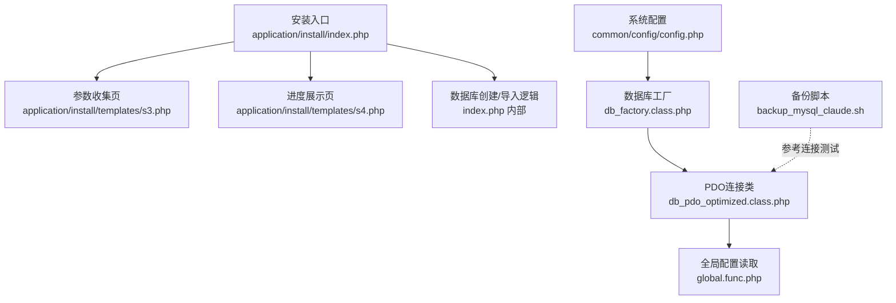
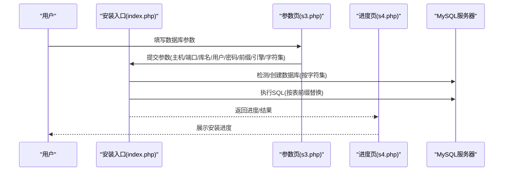
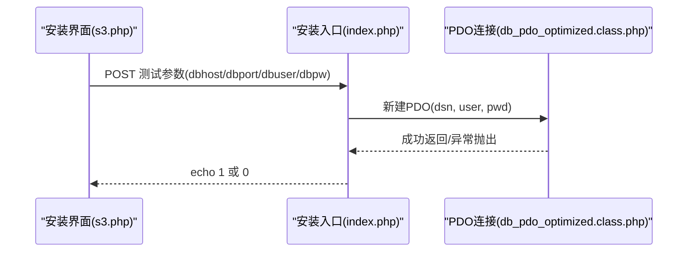
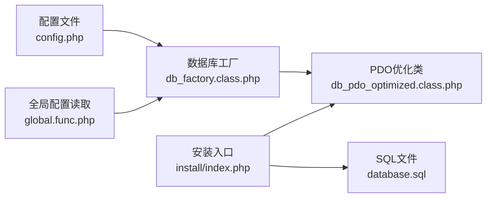

# 数据库配置

<cite>
**本文引用的文件**
- [common/config/config.php](file://common/config/config.php)
- [application/install/index.php](file://application/install/index.php)
- [application/install/templates/s3.php](file://application/install/templates/s3.php)
- [application/install/templates/s4.php](file://application/install/templates/s4.php)
- [ryphp/core/class/db_factory.class.php](file://ryphp/core/class/db_factory.class.php)
- [ryphp/core/class/db_pdo.class.php](file://ryphp/core/class/db_pdo.class.php)
- [ryphp/core/class/db_pdo_optimized.class.php](file://ryphp/core/class/db_pdo_optimized.class.php)
- [ryphp/core/class/DbException.class.php](file://ryphp/core/class/DbException.class.php)
- [ryphp/core/function/global.func.php](file://ryphp/core/function/global.func.php)
- [backup_mysql_claude.sh](file://backup_mysql_claude.sh)
</cite>

## 目录
1. [简介](#简介)
2. [项目结构](#项目结构)
3. [核心组件](#核心组件)
4. [架构总览](#架构总览)
5. [详细组件分析](#详细组件分析)
6. [依赖关系分析](#依赖关系分析)
7. [性能考虑](#性能考虑)
8. [故障排查指南](#故障排查指南)
9. [结论](#结论)
10. [附录](#附录)

## 简介
本指南面向LRYBlog数据库配置与部署，覆盖以下关键任务：
- MySQL数据库的创建与字符集、排序规则选择
- 数据库用户的创建与权限分配
- 数据库连接参数在系统中的配置方法
- 数据库表结构导入流程（含SQL文件执行与表前缀设置）
- 数据库连接测试方法与常见错误排查

本指南以仓库内安装脚本、数据库抽象层与配置文件为依据，确保步骤与实现一致。

## 项目结构
围绕数据库配置与安装，涉及的关键文件与职责如下：
- 安装入口与流程控制：application/install/index.php
- 安装界面（参数收集）：application/install/templates/s3.php
- 安装进度展示：application/install/templates/s4.php
- 系统数据库配置：common/config/config.php
- 数据库工厂与PDO适配：ryphp/core/class/db_factory.class.php、db_pdo*.class.php
- 全局配置读取：ryphp/core/function/global.func.php
- 数据库备份脚本（含连接测试参考）：backup_mysql_claude.sh

图表来源
- [application/install/index.php:116-222](file://application/install/index.php#L116-L222)
- [application/install/templates/s3.php:31-51](file://application/install/templates/s3.php#L31-L51)
- [application/install/templates/s4.php:28-69](file://application/install/templates/s4.php#L28-L69)
- [common/config/config.php:13-22](file://common/config/config.php#L13-L22)
- [ryphp/core/class/db_factory.class.php:11-50](file://ryphp/core/class/db_factory.class.php#L11-L50)
- [ryphp/core/class/db_pdo_optimized.class.php:74-111](file://ryphp/core/class/db_pdo_optimized.class.php#L74-L111)
- [ryphp/core/function/global.func.php:4-26](file://ryphp/core/function/global.func.php#L4-L26)
- [backup_mysql_claude.sh:194-198](file://backup_mysql_claude.sh#L194-L198)

章节来源
- [application/install/index.php:116-222](file://application/install/index.php#L116-L222)
- [application/install/templates/s3.php:31-51](file://application/install/templates/s3.php#L31-L51)
- [application/install/templates/s4.php:28-69](file://application/install/templates/s4.php#L28-L69)
- [common/config/config.php:13-22](file://common/config/config.php#L13-L22)
- [ryphp/core/class/db_factory.class.php:11-50](file://ryphp/core/class/db_factory.class.php#L11-L50)
- [ryphp/core/class/db_pdo_optimized.class.php:74-111](file://ryphp/core/class/db_pdo_optimized.class.php#L74-L111)
- [ryphp/core/function/global.func.php:4-26](file://ryphp/core/function/global.func.php#L4-L26)
- [backup_mysql_claude.sh:194-198](file://backup_mysql_claude.sh#L194-L198)

## 核心组件
- 系统数据库配置项：位于common/config/config.php，包含数据库类型、主机、端口、库名、用户名、密码、字符集、表前缀等。
- 安装阶段数据库创建与导入：install/index.php负责检测/创建数据库、按表前缀替换并执行SQL。
- 数据库工厂与PDO适配：db_factory根据配置选择具体驱动，db_pdo_optimized封装PDO连接与异常处理。
- 全局配置读取：C()函数统一读取配置，供工厂与PDO类使用。

章节来源
- [common/config/config.php:13-22](file://common/config/config.php#L13-L22)
- [application/install/index.php:132-222](file://application/install/index.php#L132-L222)
- [ryphp/core/class/db_factory.class.php:11-50](file://ryphp/core/class/db_factory.class.php#L11-L50)
- [ryphp/core/class/db_pdo_optimized.class.php:74-111](file://ryphp/core/class/db_pdo_optimized.class.php#L74-L111)
- [ryphp/core/function/global.func.php:4-26](file://ryphp/core/function/global.func.php#L4-L26)

## 架构总览
系统通过安装向导完成数据库初始化，随后由数据库工厂与PDO类负责运行期连接。

图表来源
- [application/install/index.php:132-222](file://application/install/index.php#L132-L222)
- [application/install/templates/s3.php:31-51](file://application/install/templates/s3.php#L31-L51)
- [application/install/templates/s4.php:28-69](file://application/install/templates/s4.php#L28-L69)

## 详细组件分析

### 数据库创建与字符集选择
- 安装阶段会根据提交的字符集参数创建数据库；若数据库不存在则创建，并使用指定字符集。
- 若字符集非utf8，SQL建表语句会被替换为utf8mb4，以兼容更广的字符范围。

章节来源
- [application/install/index.php:162-183](file://application/install/index.php#L162-L183)
- [application/install/index.php:202-206](file://application/install/index.php#L202-L206)

### 数据库用户创建与权限分配
- 安装界面提供数据库服务器、端口、用户名、密码输入；安装脚本通过PDO连接进行连通性测试。
- 仓库未内置自动创建MySQL用户与授权的逻辑，通常应在MySQL侧手动创建用户并授予相应权限，然后在安装界面填入对应凭据。

章节来源
- [application/install/templates/s3.php:40-51](file://application/install/templates/s3.php#L40-L51)
- [application/install/index.php:118-127](file://application/install/index.php#L118-L127)

### 数据库连接参数配置
- 系统默认配置项位于common/config/config.php，包含db_type、db_host、db_name、db_user、db_pwd、db_port、db_charset、db_prefix。
- 运行期通过C()函数读取配置，数据库工厂据此选择驱动并建立连接。

章节来源
- [common/config/config.php:13-22](file://common/config/config.php#L13-L22)
- [ryphp/core/function/global.func.php:4-26](file://ryphp/core/function/global.func.php#L4-L26)
- [ryphp/core/class/db_factory.class.php:38-49](file://ryphp/core/class/db_factory.class.php#L38-L49)

### 表结构导入与表前缀设置
- 安装流程读取application/install/database.sql，按提交的表前缀对建表语句进行替换，随后逐条执行。
- 对于非MyISAM存储引擎的场景，会将建表语句中的存储引擎替换为InnoDB；对于非utf8字符集，会将CHARSET=utf8替换为utf8mb4。

章节来源
- [application/install/index.php:23-28](file://application/install/index.php#L23-L28)
- [application/install/index.php:191-213](file://application/install/index.php#L191-L213)
- [application/install/index.php:202-206](file://application/install/index.php#L202-L206)

### 连接测试与异常处理
- 安装界面提供“测试数据库密码”功能，AJAX调用安装入口的测试接口，使用PDO尝试连接，返回1/0。
- PDO连接类在连接失败时抛出DbException，便于统一处理与提示。

图表来源
- [application/install/templates/s3.php:142-165](file://application/install/templates/s3.php#L142-L165)
- [application/install/index.php:118-127](file://application/install/index.php#L118-L127)
- [ryphp/core/class/db_pdo_optimized.class.php:87-97](file://ryphp/core/class/db_pdo_optimized.class.php#L87-L97)

章节来源
- [application/install/templates/s3.php:142-165](file://application/install/templates/s3.php#L142-L165)
- [application/install/index.php:118-127](file://application/install/index.php#L118-L127)
- [ryphp/core/class/db_pdo_optimized.class.php:87-97](file://ryphp/core/class/db_pdo_optimized.class.php#L87-L97)
- [ryphp/core/class/DbException.class.php:10-73](file://ryphp/core/class/DbException.class.php#L10-L73)

## 依赖关系分析
- 安装入口依赖安装模板与SQL文件；运行期依赖数据库工厂与PDO类。
- 数据库工厂依赖全局配置读取函数C()，从common/config/config.php读取数据库配置。
- PDO类负责实际连接与异常包装，工厂负责实例化与参数注入。

图表来源
- [common/config/config.php:13-22](file://common/config/config.php#L13-L22)
- [ryphp/core/class/db_factory.class.php:38-49](file://ryphp/core/class/db_factory.class.php#L38-L49)
- [ryphp/core/function/global.func.php:4-26](file://ryphp/core/function/global.func.php#L4-L26)
- [application/install/index.php:23-28](file://application/install/index.php#L23-L28)
- [ryphp/core/class/db_pdo_optimized.class.php:74-111](file://ryphp/core/class/db_pdo_optimized.class.php#L74-L111)

章节来源
- [common/config/config.php:13-22](file://common/config/config.php#L13-L22)
- [ryphp/core/class/db_factory.class.php:38-49](file://ryphp/core/class/db_factory.class.php#L38-L49)
- [ryphp/core/function/global.func.php:4-26](file://ryphp/core/function/global.func.php#L4-L26)
- [application/install/index.php:23-28](file://application/install/index.php#L23-L28)
- [ryphp/core/class/db_pdo_optimized.class.php:74-111](file://ryphp/core/class/db_pdo_optimized.class.php#L74-L111)

## 性能考虑
- 存储引擎：安装流程支持MyISAM与InnoDB；生产建议优先InnoDB以获得更好的并发与崩溃恢复能力。
- 字符集：建议使用utf8mb4以支持四字节字符（如emoji），安装流程在非utf8时会自动替换。
- 连接参数：PDO构造参数禁用模拟预处理与字符串化抓取，有助于提升安全性与一致性。

章节来源
- [application/install/templates/s3.php:71-83](file://application/install/templates/s3.php#L71-L83)
- [application/install/index.php:202-206](file://application/install/index.php#L202-L206)
- [ryphp/core/class/db_pdo_optimized.class.php:55-61](file://ryphp/core/class/db_pdo_optimized.class.php#L55-L61)

## 故障排查指南
- 连接失败
  - 使用安装界面的“测试数据库密码”功能确认凭据与网络可达性。
  - 参考备份脚本中的连接测试思路：检查MySQL服务状态、配置文件权限、以及使用mysql命令行验证连接。
- 字符集问题
  - 若出现乱码或插入失败，确认数据库/表字符集为utf8或utf8mb4；安装流程会在非utf8时替换建表字符集。
- 存储引擎问题
  - 若报错提示引擎不支持，确认目标MySQL版本支持InnoDB；安装流程会将MyISAM替换为InnoDB。
- 权限不足
  - 安装脚本未自动创建MySQL用户与授权，需在MySQL侧为系统用户授予数据库操作权限后再进行安装。
- 异常定位
  - PDO连接异常会被DbException捕获并携带类型与SQL上下文，便于定位。

章节来源
- [application/install/templates/s3.php:142-165](file://application/install/templates/s3.php#L142-L165)
- [backup_mysql_claude.sh:170-198](file://backup_mysql_claude.sh#L170-L198)
- [application/install/index.php:162-183](file://application/install/index.php#L162-L183)
- [ryphp/core/class/DbException.class.php:10-73](file://ryphp/core/class/DbException.class.php#L10-L73)

## 结论
- LRYBlog的数据库配置以安装向导为核心，结合系统配置文件与PDO抽象层完成初始化与运行期连接。
- 建议在MySQL侧先行创建用户并授予所需权限，安装时按需选择字符集与存储引擎，并通过内置测试功能验证连通性。
- 生产部署建议采用utf8mb4与InnoDB，以兼顾字符支持与稳定性。

## 附录

### 数据库配置项一览（来自系统配置）
- 数据库类型：pdo/mysqli/mysql
- 主机地址：127.0.0.1
- 端口：3306
- 数据库名：rycms
- 用户名：root
- 密码：lrysql01.
- 字符集：utf8
- 表前缀：rycms_

章节来源
- [common/config/config.php:13-22](file://common/config/config.php#L13-L22)