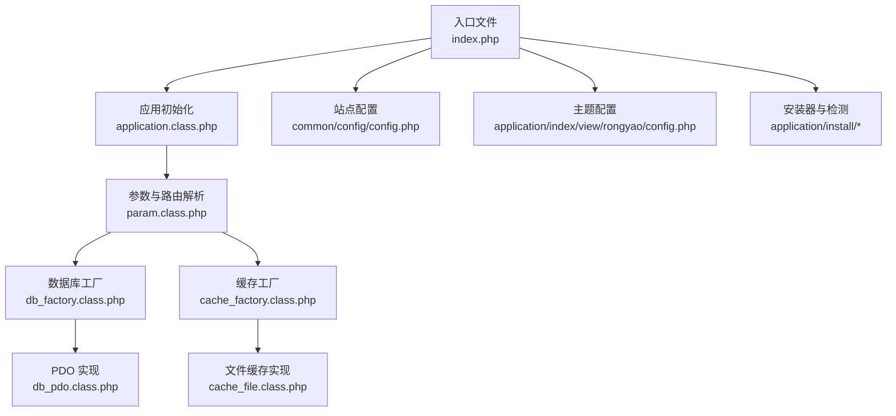
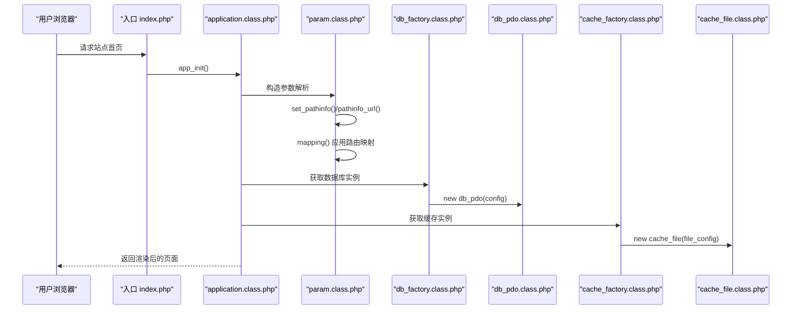
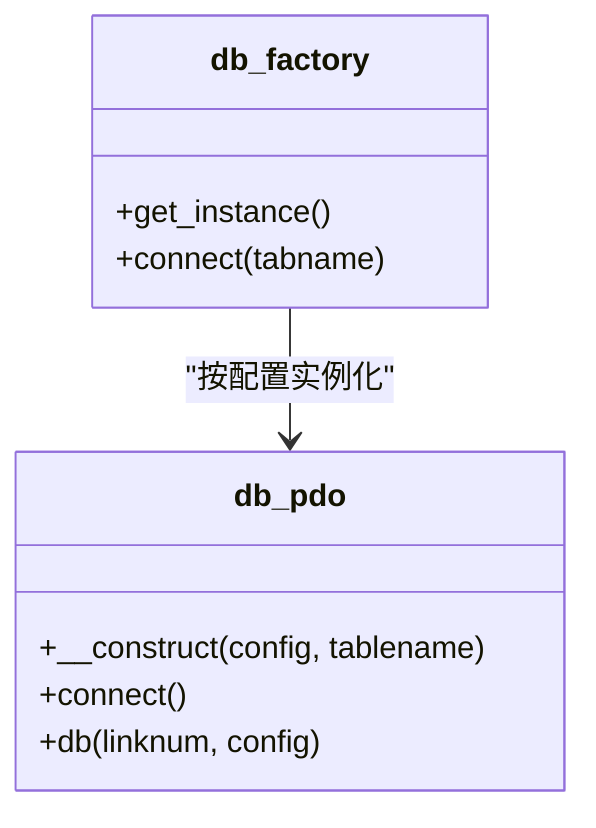
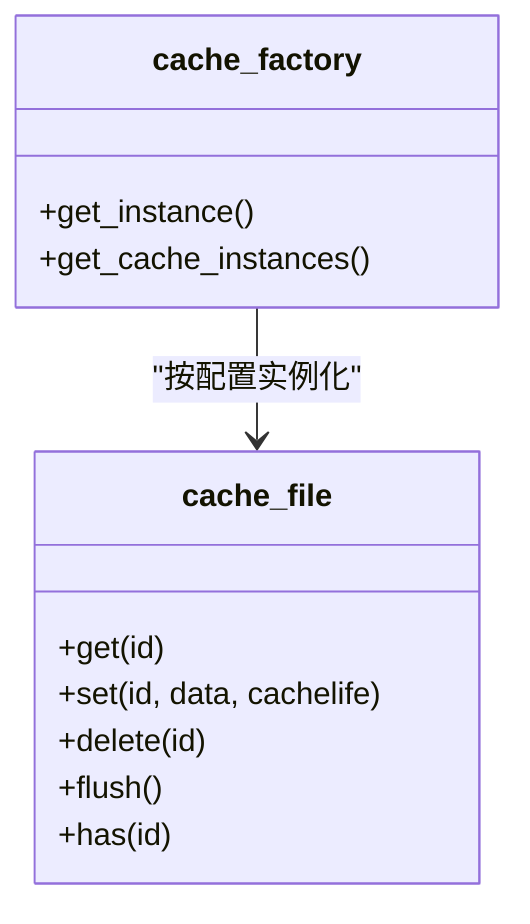
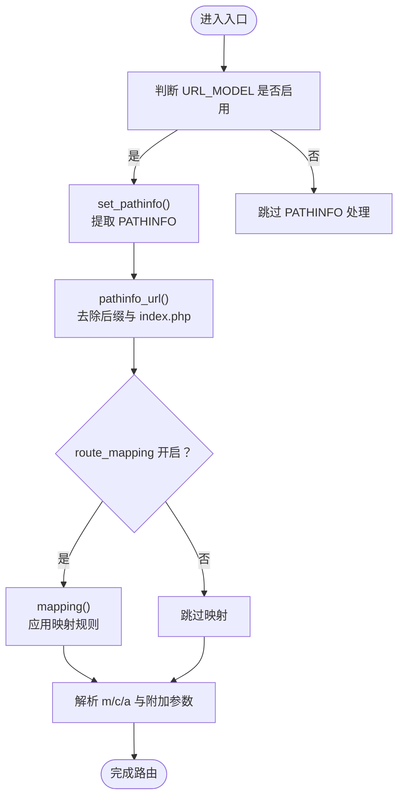
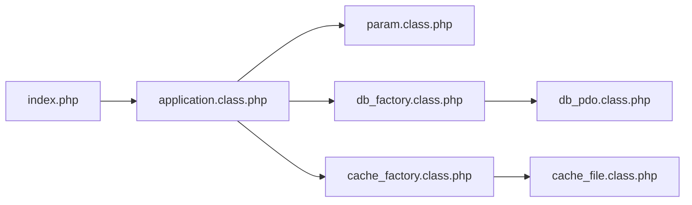

# 系统配置

<cite>
**本文引用的文件**
- [common/config/config.php](file://common/config/config.php)
- [index.php](file://index.php)
- [ryphp/core/class/param.class.php](file://ryphp/core/class/param.class.php)
- [ryphp/core/class/db_factory.class.php](file://ryphp/core/class/db_factory.class.php)
- [ryphp/core/class/db_pdo.class.php](file://ryphp/core/class/db_pdo.class.php)
- [ryphp/core/class/cache_factory.class.php](file://ryphp/core/class/cache_factory.class.php)
- [ryphp/core/class/cache_file.class.php](file://ryphp/core/class/cache_file.class.php)
- [application/index/view/rongyao/config.php](file://application/index/view/rongyao/config.php)
- [application/install/index.php](file://application/install/index.php)
- [application/install/templates/s2.php](file://application/install/templates/s2.php)
- [application/install/templates/s3.php](file://application/install/templates/s3.php)
- [ryphp/core/class/application.class.php](file://ryphp/core/class/application.class.php)
</cite>

## 目录
1. [简介](#简介)
2. [项目结构](#项目结构)
3. [核心组件](#核心组件)
4. [架构总览](#架构总览)
5. [详细组件分析](#详细组件分析)
6. [依赖关系分析](#依赖关系分析)
7. [性能考虑](#性能考虑)
8. [故障排查指南](#故障排查指南)
9. [结论](#结论)
10. [附录](#附录)

## 简介
本指南面向 LRYBlog 系统的部署与运维人员，围绕 config.php 配置文件展开，系统性说明数据库连接、缓存、路径与 URL 重写、Cookie、路由、语言、附件与水印、队列、以及安全与权限管理等配置项的作用、推荐值与最佳实践，并提供 Apache/Nginx 的 URL 重写示例、配置验证方法与常见错误的解决思路。

## 项目结构
LRYBlog 采用“入口文件 + 核心框架 + 应用层”的分层组织方式。系统入口在根目录的 index.php，核心路由与参数解析位于 rypHP 框架的 param.class.php；数据库与缓存通过工厂类按配置动态加载；站点主题与模板信息位于 application/index/view/{theme}/config.php；安装器提供环境检测与配置写入能力。

图表来源
- [index.php:1-18](file://index.php#L1-L18)
- [ryphp/core/class/application.class.php:1-118](file://ryphp/core/class/application.class.php#L1-L118)
- [ryphp/core/class/param.class.php:1-195](file://ryphp/core/class/param.class.php#L1-L195)
- [ryphp/core/class/db_factory.class.php:1-50](file://ryphp/core/class/db_factory.class.php#L1-L50)
- [ryphp/core/class/db_pdo.class.php:1-200](file://ryphp/core/class/db_pdo.class.php#L1-L200)
- [ryphp/core/class/cache_factory.class.php:1-84](file://ryphp/core/class/cache_factory.class.php#L1-L84)
- [ryphp/core/class/cache_file.class.php:1-130](file://ryphp/core/class/cache_file.class.php#L1-L130)
- [common/config/config.php:1-88](file://common/config/config.php#L1-L88)
- [application/index/view/rongyao/config.php:1-29](file://application/index/view/rongyao/config.php#L1-L29)
- [application/install/index.php:90-344](file://application/install/index.php#L90-L344)

章节来源
- [index.php:1-18](file://index.php#L1-L18)
- [ryphp/core/class/application.class.php:1-118](file://ryphp/core/class/application.class.php#L1-L118)

## 核心组件
本节聚焦 config.php 中的关键配置项，逐项解释其作用、取值范围与推荐值，并给出与系统运行密切相关的核心要点。

- 系统与站点基础
  - auth_key：系统密钥，用于加密与签名，建议随机生成且妥善保管。
  - error_page：非调试模式下的错误页面路径。
  - error_log_save：是否保存系统错误日志。
  - site_theme：默认主题目录名，需与主题目录一致。
  - url_html_suffix：伪静态后缀，默认 .html。
  - set_pathinfo：Nginx 默认不支持 PATHINFO，若启用 Nginx PATHINFO，需设为 true。

- 数据库配置
  - db_type：数据库驱动类型，支持 pdo、mysqli、mysql；推荐 pdo。
  - db_host/db_port：数据库服务器地址与端口。
  - db_name/db_user/db_pwd：数据库名、用户名与密码。
  - db_charset：字符集，建议 utf8 或 utf8mb4。
  - db_prefix：数据库表前缀，多站点隔离时建议区分。

- 路由配置
  - route_config：默认路由 m/c/a；支持按域名覆盖。
  - route_mapping：是否启用路由映射。
  - route_rules：自定义路由规则数组。

- Cookie 配置
  - cookie_domain：Cookie 作用域。
  - cookie_path：Cookie 作用路径。
  - cookie_ttl：生命周期，0 表示随会话。
  - cookie_pre：Cookie 前缀，同域名多系统需修改。
  - cookie_secure/cookie_httponly：安全传输与仅 HTTP 访问。

- 缓存配置
  - cache_type：缓存类型，支持 file、redis、memcache。
  - file_config：缓存目录、后缀、序列化模式。
  - redis_config/memcache_config：主机、端口、密码、选择库、超时、过期、持久连接、前缀。

- 队列配置
  - queue_connection：队列驱动，database 或 redis。
  - queue_name：队列名称。

- 语言与附件
  - language：语言，zh_cn/en_us。
  - upload_type：上传类型 host/qiniu/aliyun/tencent。
  - upload_file：上传目录（末尾不带斜杠）。
  - watermark_enable/name/position：水印开关、水印文件名与位置。

- 其他设置
  - sql_execute/edit_template：是否允许在线执行 SQL 与编辑模板。
  - admin_login_code：后台登录验证码开关。

章节来源
- [common/config/config.php:1-88](file://common/config/config.php#L1-L88)

## 架构总览
LRYBlog 的配置贯穿入口、路由、数据库与缓存四个关键环节。入口文件定义根路径与 URL 模式，随后由 application 初始化路由参数；param 解析 PATHINFO 并应用路由映射；数据库与缓存均通过工厂类按配置实例化。

图表来源
- [index.php:10-18](file://index.php#L10-L18)
- [ryphp/core/class/application.class.php:9-40](file://ryphp/core/class/application.class.php#L9-L40)
- [ryphp/core/class/param.class.php:7-151](file://ryphp/core/class/param.class.php#L7-L151)
- [ryphp/core/class/db_factory.class.php:11-50](file://ryphp/core/class/db_factory.class.php#L11-L50)
- [ryphp/core/class/db_pdo.class.php:26-42](file://ryphp/core/class/db_pdo.class.php#L26-L42)
- [ryphp/core/class/cache_factory.class.php:36-84](file://ryphp/core/class/cache_factory.class.php#L36-L84)
- [ryphp/core/class/cache_file.class.php:5-14](file://ryphp/core/class/cache_file.class.php#L5-L14)

## 详细组件分析

### 数据库配置与工厂
- 驱动选择与连接
  - db_factory 根据 db_type 动态加载对应驱动类，并将配置注入到具体实现。
  - db_pdo 使用 PDO 连接，支持错误模式与预处理绑定，便于安全与性能控制。
- 推荐实践
  - 生产环境使用独立数据库用户与最小权限。
  - 字符集建议 utf8mb4，避免表情符号存储问题。
  - 若使用主从或高可用，可在 db_factory 的 connect 流程中扩展连接池策略。

图表来源
- [ryphp/core/class/db_factory.class.php:11-50](file://ryphp/core/class/db_factory.class.php#L11-L50)
- [ryphp/core/class/db_pdo.class.php:26-56](file://ryphp/core/class/db_pdo.class.php#L26-L56)

章节来源
- [ryphp/core/class/db_factory.class.php:11-50](file://ryphp/core/class/db_factory.class.php#L11-L50)
- [ryphp/core/class/db_pdo.class.php:26-56](file://ryphp/core/class/db_pdo.class.php#L26-L56)
- [common/config/config.php:13-21](file://common/config/config.php#L13-L21)

### 缓存配置与工厂
- 类型与实现
  - cache_factory 根据 cache_type 选择 file/redis/memcache 实现。
  - cache_file 支持两种序列化模式：serialize 或可执行数组文件，具备过期与清理能力。
- 推荐实践
  - 开发环境可选 file；生产环境优先 redis，提升并发与共享能力。
  - 设置合理的 expire 与持久连接，避免频繁重建连接。
  - 确保 cache_dir 可写，避免缓存写入失败导致功能异常。

图表来源
- [ryphp/core/class/cache_factory.class.php:36-84](file://ryphp/core/class/cache_factory.class.php#L36-L84)
- [ryphp/core/class/cache_file.class.php:17-128](file://ryphp/core/class/cache_file.class.php#L17-L128)

章节来源
- [ryphp/core/class/cache_factory.class.php:36-84](file://ryphp/core/class/cache_factory.class.php#L36-L84)
- [ryphp/core/class/cache_file.class.php:17-128](file://ryphp/core/class/cache_file.class.php#L17-L128)
- [common/config/config.php:39-66](file://common/config/config.php#L39-L66)

### 路由与 URL 重写
- 参数解析与映射
  - param 在 URL_MODEL 启用时，通过 set_pathinfo 与 pathinfo_url 解析 PATHINFO，并在开启 route_mapping 时应用映射规则。
  - 映射规则来源于 set_mapping 生成的分类目录映射与自定义 route_rules。
- URL 伪静态后缀
  - url_html_suffix 控制伪静态后缀；PATHINFO 解析时会去除该后缀与 index.php。
- Nginx PATHINFO 支持
  - set_pathinfo 设为 true 时，系统将把请求 URI 转换为 PATHINFO，从而兼容 Nginx。

图表来源
- [ryphp/core/class/param.class.php:7-151](file://ryphp/core/class/param.class.php#L7-L151)
- [common/config/config.php:10-11](file://common/config/config.php#L10-L11)
- [common/config/config.php:23-29](file://common/config/config.php#L23-L29)

章节来源
- [ryphp/core/class/param.class.php:7-151](file://ryphp/core/class/param.class.php#L7-L151)
- [common/config/config.php:10-11](file://common/config/config.php#L10-L11)
- [common/config/config.php:23-29](file://common/config/config.php#L23-L29)

### 主题与站点信息
- 主题配置
  - application/index/view/rongyao/config.php 定义主题元信息与模板映射（分类、列表、内容页），确保模板文件名与配置一致。
- 站点基础信息
  - 站点名称、作者、版本等在主题配置中体现；实际站点名称、URL、描述等通常在后台管理中维护，但主题配置影响模板渲染与 SEO 元信息展示。

章节来源
- [application/index/view/rongyao/config.php:1-29](file://application/index/view/rongyao/config.php#L1-L29)

### 安装器与配置验证
- 环境检测
  - 安装器检测 PHP 版本、MySQL、伪静态、SESSION、GD/CURL、目录可读写等。
  - 对 common/config/config.php 的可读写状态进行检查，确保后续可写入配置。
- 配置写入
  - 安装器通过正则替换方式批量更新 config.php 中的键值，确保一次性完成配置变更。
- 数据库连通性测试
  - 在填写数据库信息后，前端调用 AJAX 测试数据库连接，失败时提示检查配置。

章节来源
- [application/install/templates/s2.php:1-135](file://application/install/templates/s2.php#L1-L135)
- [application/install/index.php:321-335](file://application/install/index.php#L321-L335)
- [application/install/templates/s3.php:131-217](file://application/install/templates/s3.php#L131-L217)

## 依赖关系分析
- 入口与应用
  - index.php 定义根路径与 URL 模式，随后调用框架初始化，建立全局常量与路由入口。
- 路由与控制器
  - application 根据解析出的 m/c/a 加载对应控制器与动作，若不存在则抛出错误页面。
- 数据库与缓存
  - db_factory 与 cache_factory 作为统一入口，按配置选择具体实现，降低耦合度。

图表来源
- [index.php:10-18](file://index.php#L10-L18)
- [ryphp/core/class/application.class.php:9-40](file://ryphp/core/class/application.class.php#L9-L40)
- [ryphp/core/class/param.class.php:7-151](file://ryphp/core/class/param.class.php#L7-L151)
- [ryphp/core/class/db_factory.class.php:11-50](file://ryphp/core/class/db_factory.class.php#L11-L50)
- [ryphp/core/class/db_pdo.class.php:26-56](file://ryphp/core/class/db_pdo.class.php#L26-L56)
- [ryphp/core/class/cache_factory.class.php:36-84](file://ryphp/core/class/cache_factory.class.php#L36-L84)
- [ryphp/core/class/cache_file.class.php:5-14](file://ryphp/core/class/cache_file.class.php#L5-L14)

章节来源
- [ryphp/core/class/application.class.php:9-40](file://ryphp/core/class/application.class.php#L9-L40)

## 性能考虑
- 缓存策略
  - 优先使用 redis/memcache，合理设置过期时间与持久连接，减少磁盘 IO。
  - file 缓存模式建议使用“可执行数组”模式以提升读取性能。
- 数据库连接
  - PDO 预处理与绑定可降低 SQL 注入风险并提升执行效率。
  - 生产环境建议开启连接池与只读分离。
- 路由与伪静态
  - 合理使用 route_mapping 与 route_rules，避免过多正则匹配导致解析耗时。
  - 伪静态后缀与 PATHINFO 的组合应与服务器配置保持一致，减少额外处理。

## 故障排查指南
- 无法访问或 404 页面
  - 检查 URL_MODEL 与 set_pathinfo 配置，确认服务器伪静态已开启。
  - 确认 route_mapping 与 route_rules 是否正确，必要时清空缓存映射。
- 数据库连接失败
  - 使用安装器提供的数据库连通性测试，核对 db_host/db_port/db_name/db_user/db_pwd/db_charset。
  - 检查数据库服务状态与网络连通性。
- 缓存写入失败
  - 确认 cache_dir 可写，file_config.mode 与后缀配置正确。
  - 如使用 redis/memcache，检查主机、端口、密码与网络连通。
- 上传与水印异常
  - 检查 upload_type 与 upload_file 目录权限，确保 uploads 可写。
  - 水印开关与水印文件路径需正确。
- 安装器报错
  - 关注安装器对 common/config/config.php 的可读写检查，必要时手动赋予 0777 权限。
  - 伪静态模块未开启会导致安装器检测失败，需按附录配置服务器重写规则。

章节来源
- [application/install/templates/s2.php:108-127](file://application/install/templates/s2.php#L108-L127)
- [application/install/index.php:321-335](file://application/install/index.php#L321-L335)
- [ryphp/core/class/application.class.php:108-115](file://ryphp/core/class/application.class.php#L108-L115)

## 结论
LRYBlog 的配置体系围绕 config.php 展开，涵盖数据库、缓存、路由、Cookie、语言、附件与队列等关键领域。通过合理设置与遵循本文的推荐实践，可显著提升系统稳定性、安全性与性能。部署时务必结合服务器环境完善 URL 重写与权限配置，并利用安装器完成初始验证。

## 附录

### URL 重写规则（Apache 与 Nginx）
- Apache（.htaccess）
  - 启用 rewrite_module，将所有请求转发至入口文件并保留 PATHINFO。
  - 示例规则请参考安装器的环境检测逻辑，确保伪静态模块已开启。
- Nginx
  - 将请求交由 PHP-FPM 处理，并在入口文件启用 PATHINFO 支持（set_pathinfo=true）。
  - 示例规则请参考安装器的环境检测逻辑，确保伪静态模块已开启。

章节来源
- [application/install/templates/s2.php:53-57](file://application/install/templates/s2.php#L53-L57)
- [common/config/config.php:10-11](file://common/config/config.php#L10-L11)

### 配置验证方法
- 使用安装器进行环境检测与配置写入，关注以下关键点：
  - 伪静态模块状态
  - 目录可读写（cache、uploads、common）
  - common/config/config.php 的可读写状态
  - 数据库连通性测试
- 在线验证
  - 通过安装器的数据库连通性测试接口，快速定位配置错误。

章节来源
- [application/install/templates/s2.php:1-135](file://application/install/templates/s2.php#L1-L135)
- [application/install/templates/s3.php:131-217](file://application/install/templates/s3.php#L131-L217)

### 常见配置错误与修复
- 伪静态未生效
  - 确认服务器已开启伪静态模块，Apache 使用 .htaccess，Nginx 需正确配置 location 与 fastcgi。
- PATHINFO 不工作（Nginx）
  - 在 config.php 中将 set_pathinfo 设为 true，并确保入口文件被 PHP 解释器处理。
- 缓存目录不可写
  - 修改 cache_dir 所在目录权限为 0777，或调整为 Web 用户可写。
- 数据库连接失败
  - 核对 db_host/db_port/db_name/db_user/db_pwd/db_charset，确保网络连通与用户权限。
- 主题模板缺失
  - 确认 application/index/view/rongyao/config.php 中的模板映射与实际文件一致。

章节来源
- [common/config/config.php:10-11](file://common/config/config.php#L10-L11)
- [ryphp/core/class/cache_file.class.php:40-42](file://ryphp/core/class/cache_file.class.php#L40-L42)
- [application/index/view/rongyao/config.php:1-29](file://application/index/view/rongyao/config.php#L1-L29)