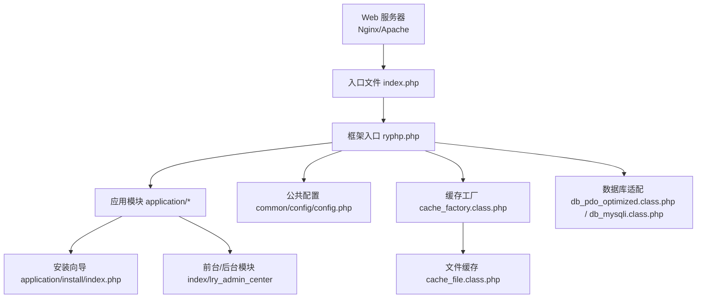
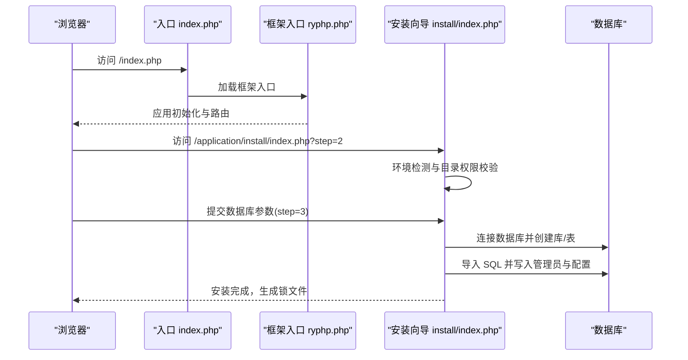
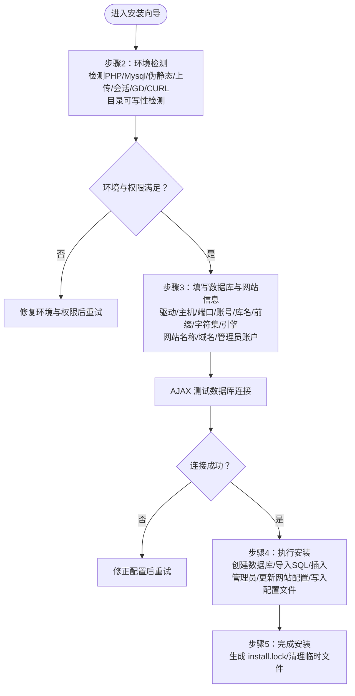
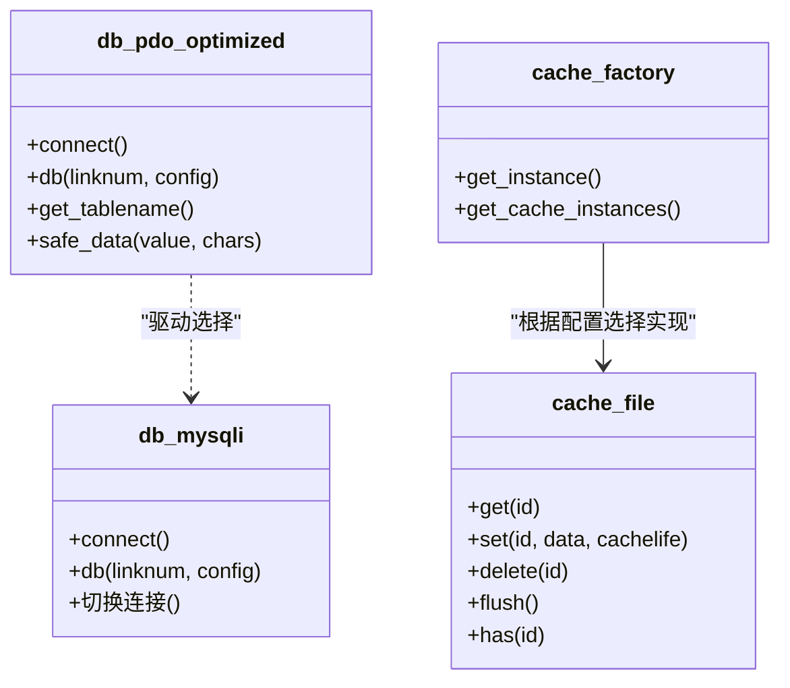
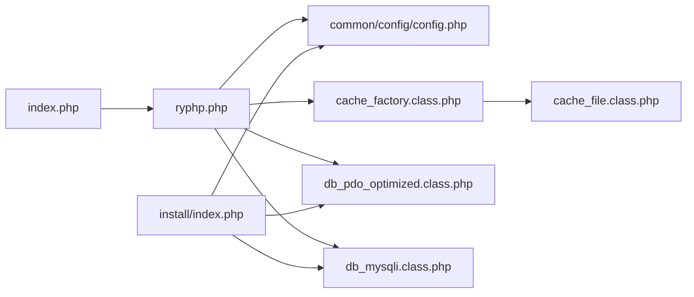

# 部署流程

<cite>
**本文引用的文件**
- [index.php](file://index.php)
- [ryphp.php](file://ryphp/ryphp.php)
- [config.php](file://common/config/config.php)
- [install/index.php](file://application/install/index.php)
- [install/s2.php](file://application/install/templates/s2.php)
- [install/s3.php](file://application/install/templates/s3.php)
- [install/s4.php](file://application/install/templates/s4.php)
- [cache_file.class.php](file://ryphp/core/class/cache_file.class.php)
- [cache_factory.class.php](file://ryphp/core/class/cache_factory.class.php)
- [db_pdo_optimized.class.php](file://ryphp/core/class/db_pdo_optimized.class.php)
- [db_mysqli.class.php](file://ryphp/core/class/db_mysqli.class.php)
- [backup_mysql_claude.sh](file://backup_mysql_claude.sh)
- [restore_mysql_claude.sh](file://restore_mysql_claude.sh)
- [.gitignore](file://.gitignore)
</cite>

## 目录
1. [简介](#简介)
2. [项目结构](#项目结构)
3. [核心组件](#核心组件)
4. [架构总览](#架构总览)
5. [详细组件分析](#详细组件分析)
6. [依赖关系分析](#依赖关系分析)
7. [性能考虑](#性能考虑)
8. [故障排除指南](#故障排除指南)
9. [结论](#结论)
10. [附录](#附录)

## 简介
本指南面向 LRYBlog 的部署与运维，覆盖以下关键环节：
- 代码部署：上传代码、设置目录权限、必要时创建符号链接
- 数据库部署：创建数据库、导入表结构、填充初始数据
- 配置文件调整：数据库连接、缓存、路径等
- 安装向导使用：环境检测、数据库配置、管理员账户创建
- 自动化与一键部署：脚本与最佳实践
- 部署验证：确保系统正常运行
- 常见问题与排障：定位与解决典型部署问题

## 项目结构
LRYBlog 采用 MVC 分层与框架入口设计，核心入口负责初始化框架与路由；安装向导位于 application/install 下，提供图形化安装流程；缓存与数据库适配由框架内核类实现。

**图表来源**
- [index.php](file://index.php#L1-L18)
- [ryphp.php](file://ryphp/ryphp.php#L83-L202)
- [config.php](file://common/config/config.php#L1-L88)
- [install/index.php](file://application/install/index.php#L1-L373)
- [cache_factory.class.php](file://ryphp/core/class/cache_factory.class.php#L36-L84)
- [cache_file.class.php](file://ryphp/core/class/cache_file.class.php#L1-L130)
- [db_pdo_optimized.class.php](file://ryphp/core/class/db_pdo_optimized.class.php#L87-L119)
- [db_mysqli.class.php](file://ryphp/core/class/db_mysqli.class.php#L31-L60)

**章节来源**
- [index.php](file://index.php#L1-L18)
- [ryphp.php](file://ryphp/ryphp.php#L83-L202)

## 核心组件
- 入口与框架初始化
  - 入口文件定义调试开关、根路径、URL 模式，并加载框架入口
  - 框架入口负责常量定义、函数库加载、类加载与应用初始化
- 配置中心
  - 系统配置、数据库配置、路由配置、Cookie 配置、缓存配置、队列配置、语言与附件配置等
- 缓存体系
  - 工厂模式根据配置选择 file/redis/memcache 实现
  - 文件缓存默认目录为 cache/cache_file
- 数据库适配
  - 支持 pdo、mysqli 两种驱动，PDO 为推荐
  - 提供连接建立、表名拼接与安全过滤等能力
- 安装向导
  - 步骤化安装：协议、环境检测、参数设置、安装过程、完成
  - 在线创建数据库、导入 SQL、写入配置、生成锁文件

**章节来源**
- [index.php](file://index.php#L10-L18)
- [ryphp.php](file://ryphp/ryphp.php#L83-L202)
- [config.php](file://common/config/config.php#L3-L87)
- [cache_factory.class.php](file://ryphp/core/class/cache_factory.class.php#L36-L84)
- [cache_file.class.php](file://ryphp/core/class/cache_file.class.php#L1-L130)
- [db_pdo_optimized.class.php](file://ryphp/core/class/db_pdo_optimized.class.php#L87-L119)
- [db_mysqli.class.php](file://ryphp/core/class/db_mysqli.class.php#L31-L60)
- [install/index.php](file://application/install/index.php#L45-L275)

## 架构总览
下图展示从 Web 请求到安装向导与数据库交互的关键流程。

**图表来源**
- [index.php](file://index.php#L10-L18)
- [ryphp.php](file://ryphp/ryphp.php#L88-L90)
- [install/index.php](file://application/install/index.php#L51-L275)

## 详细组件分析

### 安装向导工作流
安装向导通过多步骤页面引导完成环境检测、数据库配置、SQL 导入与管理员创建，并最终写入配置文件与生成锁文件。

**图表来源**
- [install/index.php](file://application/install/index.php#L51-L275)
- [install/s2.php](file://application/install/templates/s2.php#L83-L128)
- [install/s3.php](file://application/install/templates/s3.php#L20-L136)
- [install/s4.php](file://application/install/templates/s4.php#L28-L69)

**章节来源**
- [install/index.php](file://application/install/index.php#L45-L275)
- [install/s2.php](file://application/install/templates/s2.php#L1-L135)
- [install/s3.php](file://application/install/templates/s3.php#L1-L217)
- [install/s4.php](file://application/install/templates/s4.php#L1-L73)

### 数据库适配与连接
框架支持 PDO 与 MYSQLI 两种数据库驱动，PDO 为推荐。连接建立时根据配置构造 DSN，捕获异常并抛出自定义异常。

**图表来源**
- [db_pdo_optimized.class.php](file://ryphp/core/class/db_pdo_optimized.class.php#L87-L119)
- [db_mysqli.class.php](file://ryphp/core/class/db_mysqli.class.php#L31-L60)
- [cache_factory.class.php](file://ryphp/core/class/cache_factory.class.php#L36-L84)
- [cache_file.class.php](file://ryphp/core/class/cache_file.class.php#L1-L130)

**章节来源**
- [db_pdo_optimized.class.php](file://ryphp/core/class/db_pdo_optimized.class.php#L87-L119)
- [db_mysqli.class.php](file://ryphp/core/class/db_mysqli.class.php#L31-L60)
- [cache_factory.class.php](file://ryphp/core/class/cache_factory.class.php#L36-L84)
- [cache_file.class.php](file://ryphp/core/class/cache_file.class.php#L1-L130)

### 缓存配置与目录
- 缓存类型由配置决定，文件缓存默认目录为 cache/cache_file
- 工厂类根据配置动态加载对应缓存实现
- .gitignore 中包含缓存目录，部署时应确保该目录可写

**章节来源**
- [config.php](file://common/config/config.php#L39-L66)
- [cache_factory.class.php](file://ryphp/core/class/cache_factory.class.php#L36-L84)
- [cache_file.class.php](file://ryphp/core/class/cache_file.class.php#L4-L14)
- [.gitignore](file://.gitignore#L2-L4)

## 依赖关系分析
- 入口依赖框架入口；框架入口依赖公共函数与类加载机制
- 安装向导依赖模板与数据库连接；数据库连接依赖 PDO 或 MYSQLI
- 缓存工厂依赖配置与具体缓存实现类
- 安装向导在执行阶段直接写入配置文件与数据库

**图表来源**
- [index.php](file://index.php#L10-L18)
- [ryphp.php](file://ryphp/ryphp.php#L88-L90)
- [config.php](file://common/config/config.php#L3-L87)
- [cache_factory.class.php](file://ryphp/core/class/cache_factory.class.php#L36-L84)
- [cache_file.class.php](file://ryphp/core/class/cache_file.class.php#L1-L130)
- [db_pdo_optimized.class.php](file://ryphp/core/class/db_pdo_optimized.class.php#L87-L119)
- [db_mysqli.class.php](file://ryphp/core/class/db_mysqli.class.php#L31-L60)
- [install/index.php](file://application/install/index.php#L132-L260)

**章节来源**
- [index.php](file://index.php#L10-L18)
- [ryphp.php](file://ryphp/ryphp.php#L88-L90)
- [install/index.php](file://application/install/index.php#L132-L260)

## 性能考虑
- 缓存策略
  - 文件缓存适合小规模站点；生产环境建议使用 Redis 或 Memcache
  - 合理设置缓存过期时间与持久化策略
- 数据库驱动
  - 推荐使用 PDO；InnoDB 引擎具备更好的并发与崩溃恢复能力
- 伪静态与路径
  - URL 伪静态后缀与 PATHINFO 支持需结合 Web 服务器配置
- 上传与附件
  - 上传目录与水印配置影响资源管理与性能

[本节为通用指导，无需列出具体文件来源]

## 故障排除指南
- 安装向导提示“已运行安装”
  - 删除缓存中的 install.lock 后重试
  - 参考：安装向导在入口处检查锁文件并终止
- PHP 版本过低
  - 安装向导对 PHP 版本有最低要求，需升级至推荐版本
- 数据库连接失败
  - 使用安装向导的 AJAX 测试连接，确认主机、端口、账号、密码与库名
  - 检查数据库服务状态与网络连通性
- 目录权限不足
  - 安装向导会检测 cache、uploads、common 等目录的可读写
  - 确保 Web 用户对上述目录具有写权限
- 缓存目录不可写
  - 文件缓存默认目录 cache/cache_file 需要可写
  - 若使用 Redis/Memcache，需确保相应服务可用
- 配置文件无法写入
  - 安装向导会尝试修改 common/config/config.php，需确保其可写
- 伪静态未生效
  - 安装向导会检测伪静态模块，若未开启需按指引配置 Web 服务器

**章节来源**
- [install/index.php](file://application/install/index.php#L15-L17)
- [install/index.php](file://application/install/index.php#L21-L21)
- [install/index.php](file://application/install/index.php#L118-L127)
- [install/s2.php](file://application/install/templates/s2.php#L83-L128)
- [cache_file.class.php](file://ryphp/core/class/cache_file.class.php#L40-L42)
- [config.php](file://common/config/config.php#L42-L46)

## 结论
通过本指南，您可以完成 LRYBlog 的完整部署：从代码上传与权限设置，到数据库创建与表结构导入，再到配置文件调整与安装向导执行。建议优先使用安装向导完成首次部署，并在生产环境中启用 Redis 缓存与 InnoDB 引擎，同时完善 Web 服务器伪静态与安全配置。

[本节为总结性内容，无需列出具体文件来源]

## 附录

### 代码部署步骤
- 上传代码
  - 将项目代码上传至 Web 服务器文档根目录
- 设置目录权限
  - 确保 cache、uploads、common 目录可写
  - 若使用 Redis/Memcache，确保相应服务可用
- 符号链接（如需）
  - 如 Web 服务器文档根目录与项目根目录不一致，可创建符号链接指向项目根目录

**章节来源**
- [install/s2.php](file://application/install/templates/s2.php#L83-L128)
- [cache_file.class.php](file://ryphp/core/class/cache_file.class.php#L40-L42)

### 数据库部署步骤
- 创建数据库
  - 安装向导会自动检测并创建数据库（如具备权限）
- 导入表结构
  - 安装向导读取内置 SQL 并逐条执行，创建数据表
- 填充初始数据
  - 插入管理员账户与网站配置记录
- 写入配置文件
  - 更新 common/config/config.php 中的数据库与缓存配置

**章节来源**
- [install/index.php](file://application/install/index.php#L162-L189)
- [install/index.php](file://application/install/index.php#L191-L219)
- [install/index.php](file://application/install/index.php#L224-L259)
- [config.php](file://common/config/config.php#L13-L21)

### 配置文件调整方法
- 数据库连接
  - 修改 db_type、db_host、db_name、db_user、db_pwd、db_port、db_prefix、db_charset
- 缓存配置
  - 修改 cache_type 与 file_config/redis_config/memcache_config
- 路径与伪静态
  - 调整 url_html_suffix、set_pathinfo 等

**章节来源**
- [config.php](file://common/config/config.php#L13-L21)
- [config.php](file://common/config/config.php#L39-L66)
- [config.php](file://common/config/config.php#L10-L11)

### 安装向导使用说明
- 环境检测
  - 检查 PHP 版本、Mysql 扩展、GD、CURL、伪静态、上传、会话与目录权限
- 数据库配置
  - 填写数据库驱动、主机、端口、账号、密码、库名、表前缀、字符集与引擎
- 管理员账户创建
  - 设置管理员用户名与密码
- 完成安装
  - 安装完成后生成 install.lock 并清理临时文件

**章节来源**
- [install/s2.php](file://application/install/templates/s2.php#L28-L76)
- [install/s3.php](file://application/install/templates/s3.php#L29-L83)
- [install/s3.php](file://application/install/templates/s3.php#L118-L128)
- [install/index.php](file://application/install/index.php#L265-L275)

### 一键部署与自动化方案
- 使用安装向导
  - 通过浏览器访问安装向导，按步骤完成安装
- 数据库备份与恢复脚本
  - 备份脚本：支持压缩、单事务、 routines/triggers 等选项
  - 恢复脚本：支持 .sql 与 .sql.gz，自动检测与恢复

**章节来源**
- [backup_mysql_claude.sh](file://backup_mysql_claude.sh#L1-L392)
- [restore_mysql_claude.sh](file://restore_mysql_claude.sh#L1-L412)

### 部署验证步骤
- 访问首页
  - 确认页面正常加载且无报错
- 登录后台
  - 使用安装时创建的管理员账户登录后台
- 检查缓存
  - 确认缓存目录可写，缓存功能正常
- 数据库连通性
  - 在后台或通过安装向导再次测试数据库连接

**章节来源**
- [install/index.php](file://application/install/index.php#L118-L127)
- [cache_file.class.php](file://ryphp/core/class/cache_file.class.php#L40-L42)