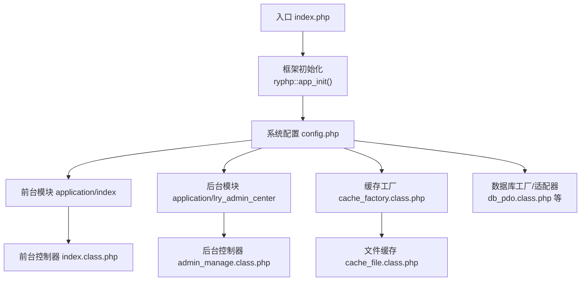
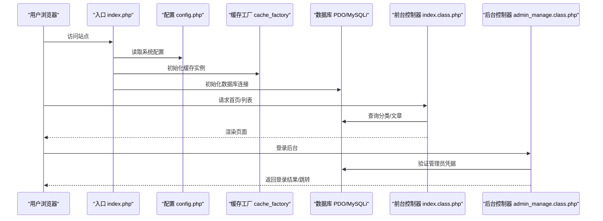
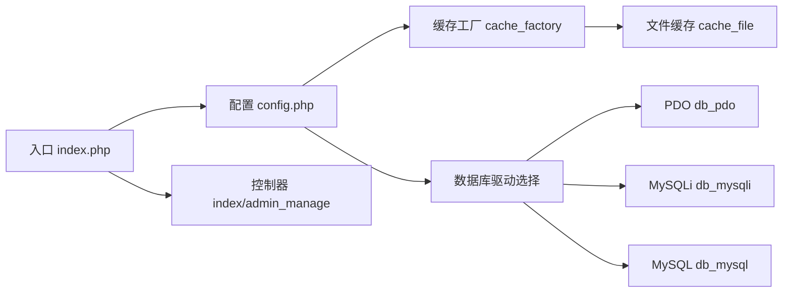

# 部署验证

<cite>
**本文引用的文件**
- [index.php](file://index.php)
- [config.php](file://common/config/config.php)
- [index.class.php](file://application/index/controller/index.class.php)
- [admin_manage.class.php](file://application/lry_admin_center/controller/admin_manage.class.php)
- [login.html](file://application/lry_admin_center/view/login.html)
- [index.html（后台首页）](file://application/lry_admin_center/view/index.html)
- [cache_file.class.php](file://ryphp/core/class/cache_file.class.php)
- [cache_factory.class.php](file://ryphp/core/class/cache_factory.class.php)
- [db_pdo.class.php](file://ryphp/core/class/db_pdo.class.php)
- [debug.class.php](file://ryphp/core/class/debug.class.php)
- [db_pdo_optimized.class.php](file://ryphp/core/class/db_pdo_optimized.class.php)
- [db_mysqli.class.php](file://ryphp/core/class/db_mysqli.class.php)
- [db_mysql.class.php](file://ryphp/core/class/db_mysql.class.php)
</cite>

## 目录
1. [简介](#简介)
2. [项目结构](#项目结构)
3. [核心组件](#核心组件)
4. [架构总览](#架构总览)
5. [详细组件验证](#详细组件验证)
6. [依赖关系分析](#依赖关系分析)
7. [性能考量](#性能考量)
8. [故障排查指南](#故障排查指南)
9. [结论](#结论)
10. [附录](#附录)

## 简介
本指南面向LRYBlog部署后的验证工作，覆盖前台功能验证、后台管理系统验证、缓存系统验证、数据库连接与性能测试、日志与错误排查，以及部署成功标志与后续优化建议。文档以仓库中的实际代码为依据，提供可操作的验证步骤与可视化图示。

## 项目结构
LRYBlog采用单入口入口模式，核心框架位于ryphp目录，应用分为前台与后台两套独立模块，缓存与数据库抽象由工厂类统一调度。

图表来源
- [index.php:1-18](file://index.php#L1-L18)
- [config.php:1-88](file://common/config/config.php#L1-L88)
- [cache_factory.class.php:1-84](file://ryphp/core/class/cache_factory.class.php#L1-L84)
- [db_pdo.class.php:1-646](file://ryphp/core/class/db_pdo.class.php#L1-L646)
- [index.class.php:1-18](file://application/index/controller/index.class.php#L1-L18)
- [admin_manage.class.php:1-105](file://application/lry_admin_center/controller/admin_manage.class.php#L1-L105)

章节来源
- [index.php:1-18](file://index.php#L1-L18)
- [config.php:1-88](file://common/config/config.php#L1-L88)

## 核心组件
- 入口与初始化：单入口加载框架并启动应用。
- 配置中心：集中管理数据库、缓存、路由、Cookie等系统级参数。
- 前台控制器：负责首页与文章列表等展示逻辑。
- 后台控制器：管理员列表、信息与密码修改等管理功能。
- 缓存系统：基于工厂模式选择文件/Redis/Memcache实现。
- 数据库层：PDO/MySQLi/MySQL三种驱动，统一抽象查询接口。
- 调试与日志：开发期调试与生产期错误日志记录。

章节来源
- [index.php:10-18](file://index.php#L10-L18)
- [config.php:13-87](file://common/config/config.php#L13-L87)
- [index.class.php:14-17](file://application/index/controller/index.class.php#L14-L17)
- [admin_manage.class.php:11-44](file://application/lry_admin_center/controller/admin_manage.class.php#L11-L44)
- [cache_factory.class.php:36-82](file://ryphp/core/class/cache_factory.class.php#L36-L82)
- [db_pdo.class.php:10-646](file://ryphp/core/class/db_pdo.class.php#L10-L646)
- [debug.class.php:1-147](file://ryphp/core/class/debug.class.php#L1-L147)

## 架构总览
以下序列图展示从浏览器请求到响应的关键流程，涵盖前台与后台登录场景。

图表来源
- [index.php:10-18](file://index.php#L10-L18)
- [config.php:13-87](file://common/config/config.php#L13-L87)
- [cache_factory.class.php:36-82](file://ryphp/core/class/cache_factory.class.php#L36-L82)
- [db_pdo.class.php:32-42](file://ryphp/core/class/db_pdo.class.php#L32-L42)
- [index.class.php:14-17](file://application/index/controller/index.class.php#L14-L17)
- [admin_manage.class.php:11-44](file://application/lry_admin_center/controller/admin_manage.class.php#L11-L44)

## 详细组件验证

### 前台功能验证
目标：确认首页访问、文章列表显示、文章详情页面可用。

- 首页访问
  - 步骤：直接访问站点根路径，观察是否进入前台首页。
  - 关注点：入口文件加载与框架初始化是否正常；调试模式下是否有异常输出。
  - 参考路径：[入口 index.php:10-18](file://index.php#L10-L18)

- 文章列表显示
  - 步骤：访问列表页，检查分页、排序、筛选是否生效。
  - 关注点：控制器中查询逻辑是否正确拼接条件；数据库连接是否成功。
  - 参考路径：[前台控制器 index.class.php:14-17](file://application/index/controller/index.class.php#L14-L17)，[PDO查询实现:365-377](file://ryphp/core/class/db_pdo.class.php#L365-L377)

- 文章详情页面
  - 步骤：访问某篇文章详情，检查标题、正文、SEO元信息等。
  - 关注点：模板渲染与静态资源加载；URL伪静态后缀配置。
  - 参考路径：[配置 URL后缀](file://common/config/config.php#L10)

- 部署成功标志（前台）
  - 页面能正常加载且无致命错误。
  - 控制台无未捕获异常或数据库连接错误。
  - 列表/详情数据来自数据库，非空或符合预期。

章节来源
- [index.php:10-18](file://index.php#L10-L18)
- [index.class.php:14-17](file://application/index/controller/index.class.php#L14-L17)
- [db_pdo.class.php:365-377](file://ryphp/core/class/db_pdo.class.php#L365-L377)
- [config.php:10](file://common/config/config.php#L10)

### 后台管理系统验证
目标：管理员登录、基本管理功能测试。

- 管理员登录
  - 步骤：访问后台登录页，输入用户名/密码/验证码，提交登录。
  - 关注点：AJAX提交、验证码刷新、登录成功跳转与失败提示。
  - 参考路径：[后台登录页 login.html:14-95](file://application/lry_admin_center/view/login.html#L14-L95)

- 基本管理功能
  - 管理员列表：支持按字段排序、按角色筛选、时间段搜索、关键词检索。
    - 参考路径：[后台管理控制器 admin_manage.class.php:11-44](file://application/lry_admin_center/controller/admin_manage.class.php#L11-L44)
  - 修改个人信息：校验邮箱格式，更新后刷新会话信息。
    - 参考路径：[修改信息逻辑:49-64](file://application/lry_admin_center/controller/admin_manage.class.php#L49-L64)
  - 修改密码：校验旧密码、密码格式，更新后销毁会话并清理Cookie。
    - 参考路径：[修改密码逻辑:70-103](file://application/lry_admin_center/controller/admin_manage.class.php#L70-L103)

- 后台首页与清缓存
  - 后台首页：包含锁屏、标签页、菜单等交互。
    - 参考路径：[后台首页模板:1-112](file://application/lry_admin_center/view/index.html#L1-L112)
  - 清理缓存：通过AJAX调用清理缓存接口。
    - 参考路径：[清缓存脚本片段:52-65](file://application/lry_admin_center/view/index.html#L52-L65)

- 部署成功标志（后台）
  - 登录页可正常加载，验证码可刷新。
  - 登录成功后跳转至后台首页，无权限错误。
  - 管理员列表可分页查看，搜索与排序正常。

章节来源
- [login.html:14-95](file://application/lry_admin_center/view/login.html#L14-L95)
- [admin_manage.class.php:11-103](file://application/lry_admin_center/controller/admin_manage.class.php#L11-L103)
- [index.html（后台首页）:52-65](file://application/lry_admin_center/view/index.html#L52-L65)

### 缓存系统验证
目标：验证缓存文件生成与缓存生效情况。

- 缓存类型与配置
  - 支持 file/redis/memcache 三类缓存，当前默认 file。
  - 文件缓存目录、后缀、序列化模式等由配置决定。
  - 参考路径：[缓存配置:39-66](file://common/config/config.php#L39-L66)，[缓存工厂:36-82](file://ryphp/core/class/cache_factory.class.php#L36-L82)

- 文件缓存行为
  - 生成：set(id, data, expire) 将数据写入缓存文件，支持两种存储模式。
  - 读取：get(id) 检查过期时间，返回内容或false。
  - 删除：delete(id) 删除指定缓存文件。
  - 清空：flush() 遍历目录删除所有缓存文件。
  - 参考路径：[文件缓存实现:17-128](file://ryphp/core/class/cache_file.class.php#L17-L128)

- 验证步骤
  - 在后台首页触发清缓存操作，观察返回状态与缓存目录变化。
  - 在业务逻辑中调用缓存读写，确认过期策略与内容一致性。
  - 若切换为redis/memcache，确保对应扩展已安装并配置正确。

- 部署成功标志（缓存）
  - 文件缓存目录存在且可写；set/get/delete/flush均可正常执行。
  - 后台清缓存按钮返回成功消息。

章节来源
- [config.php:39-66](file://common/config/config.php#L39-L66)
- [cache_factory.class.php:36-82](file://ryphp/core/class/cache_factory.class.php#L36-L82)
- [cache_file.class.php:17-128](file://ryphp/core/class/cache_file.class.php#L17-L128)
- [index.html（后台首页）:52-65](file://application/lry_admin_center/view/index.html#L52-L65)

### 数据库连接验证与性能测试
目标：验证数据库连通性、驱动选择与性能表现。

- 驱动选择与配置
  - 默认使用 PDO，支持 mysqli/mysql，可在配置中调整。
  - 参考路径：[数据库配置:14-21](file://common/config/config.php#L14-L21)，[PDO连接:32-42](file://ryphp/core/class/db_pdo.class.php#L32-L42)，[MySQLi连接:36-46](file://ryphp/core/class/db_mysqli.class.php#L36-L46)，[MySQL连接:52-80](file://ryphp/core/class/db_mysql.class.php#L52-L80)

- 连接与查询
  - PDO：构造DNS、建立连接、异常处理、预处理绑定、调试SQL记录。
    - 参考路径：[PDO核心实现:32-124](file://ryphp/core/class/db_pdo.class.php#L32-L124)
  - 优化版PDO：抛出DbException，便于上层捕获与处理。
    - 参考路径：[PDO优化实现:87-119](file://ryphp/core/class/db_pdo_optimized.class.php#L87-L119)

- 性能测试建议
  - 使用压测工具对首页、列表页、详情页进行并发访问，观察响应时间与错误率。
  - 开启调试模式，收集SQL执行耗时与总数，定位慢查询。
  - 参考路径：[调试记录SQL:116-128](file://ryphp/core/class/debug.class.php#L116-L128)

- 部署成功标志（数据库）
  - 首次访问无数据库连接错误；PDO/MySQLi连接成功。
  - 控制器查询返回数据，无语法错误或表不存在错误。

章节来源
- [config.php:14-21](file://common/config/config.php#L14-L21)
- [db_pdo.class.php:32-124](file://ryphp/core/class/db_pdo.class.php#L32-L124)
- [db_pdo_optimized.class.php:87-119](file://ryphp/core/class/db_pdo_optimized.class.php#L87-L119)
- [db_mysqli.class.php:36-46](file://ryphp/core/class/db_mysqli.class.php#L36-L46)
- [db_mysql.class.php:52-80](file://ryphp/core/class/db_mysql.class.php#L52-L80)
- [debug.class.php:116-128](file://ryphp/core/class/debug.class.php#L116-L128)

### 日志文件检查与错误排查
- 错误日志保存
  - 非调试模式下启用错误日志保存，便于问题追踪。
  - 参考路径：[错误日志开关](file://common/config/config.php#L8)

- 调试与异常处理
  - 调试模式下输出详细错误信息；异常捕获与最后错误处理。
  - 参考路径：[调试类:46-112](file://ryphp/core/class/debug.class.php#L46-L112)

- 排查步骤
  - 打开调试模式，复现问题，查看调试面板中的SQL与请求信息。
  - 检查数据库异常消息与堆栈，确认表名/字段是否存在。
  - 生产环境关注错误日志文件，避免敏感信息泄露。

章节来源
- [config.php:8](file://common/config/config.php#L8)
- [debug.class.php:46-112](file://ryphp/core/class/debug.class.php#L46-L112)

## 依赖关系分析
- 入口依赖配置与工厂；配置决定缓存与数据库类型；控制器依赖模型查询与视图渲染。
- 缓存工厂根据配置动态加载具体缓存实现，降低耦合。
- 数据库层提供统一接口，屏蔽底层差异。

图表来源
- [index.php:10-18](file://index.php#L10-L18)
- [config.php:14-66](file://common/config/config.php#L14-L66)
- [cache_factory.class.php:36-82](file://ryphp/core/class/cache_factory.class.php#L36-L82)
- [cache_file.class.php:1-130](file://ryphp/core/class/cache_file.class.php#L1-L130)
- [db_pdo.class.php:10-646](file://ryphp/core/class/db_pdo.class.php#L10-L646)
- [db_mysqli.class.php:31-60](file://ryphp/core/class/db_mysqli.class.php#L31-L60)
- [db_mysql.class.php:52-80](file://ryphp/core/class/db_mysql.class.php#L52-L80)

章节来源
- [index.php:10-18](file://index.php#L10-L18)
- [config.php:14-66](file://common/config/config.php#L14-L66)
- [cache_factory.class.php:36-82](file://ryphp/core/class/cache_factory.class.php#L36-L82)
- [cache_file.class.php:1-130](file://ryphp/core/class/cache_file.class.php#L1-L130)
- [db_pdo.class.php:10-646](file://ryphp/core/class/db_pdo.class.php#L10-L646)
- [db_mysqli.class.php:31-60](file://ryphp/core/class/db_mysqli.class.php#L31-L60)
- [db_mysql.class.php:52-80](file://ryphp/core/class/db_mysql.class.php#L52-L80)

## 性能考量
- 缓存策略
  - 使用文件缓存时，注意目录权限与磁盘IO；必要时迁移至Redis提升命中率与并发能力。
  - 合理设置缓存过期时间，避免陈旧数据。
- 数据库优化
  - 使用PDO预处理与绑定参数，减少SQL注入风险与解析开销。
  - 对高频查询建立索引，结合调试面板定位慢查询。
- 前后端分离
  - 静态资源走CDN，减少服务器带宽压力。
- 监控与压测
  - 定期进行并发压测，观察响应时间与错误率，及时扩容或优化。

## 故障排查指南
- 常见问题
  - 数据库连接失败：核对主机、端口、用户名、密码与字符集配置。
    - 参考路径：[PDO连接与异常:32-42](file://ryphp/core/class/db_pdo.class.php#L32-L42)
  - 缓存目录不可写：检查cache目录权限与磁盘空间。
    - 参考路径：[文件缓存写入:103-112](file://ryphp/core/class/cache_file.class.php#L103-L112)
  - 后台登录失败：检查验证码、用户名/密码、会话与Cookie设置。
    - 参考路径：[登录页AJAX:71-92](file://application/lry_admin_center/view/login.html#L71-L92)
- 调试与日志
  - 开启调试模式查看SQL与请求详情；生产环境关注错误日志文件。
    - 参考路径：[调试类:116-128](file://ryphp/core/class/debug.class.php#L116-L128)，[错误日志开关](file://common/config/config.php#L8)

章节来源
- [db_pdo.class.php:32-42](file://ryphp/core/class/db_pdo.class.php#L32-L42)
- [cache_file.class.php:103-112](file://ryphp/core/class/cache_file.class.php#L103-L112)
- [login.html:71-92](file://application/lry_admin_center/view/login.html#L71-L92)
- [debug.class.php:116-128](file://ryphp/core/class/debug.class.php#L116-L128)
- [config.php:8](file://common/config/config.php#L8)

## 结论
通过上述验证步骤，可全面确认LRYBlog部署后的前台展示、后台登录与管理、缓存与数据库运行状态。建议在生产环境关闭调试模式，启用错误日志保存，并持续监控性能指标，按需优化缓存与数据库配置。

## 附录
- 部署成功标志清单
  - 前台：首页/列表/详情可正常访问，无数据库错误。
  - 后台：登录页可访问，验证码可刷新，登录成功跳转。
  - 缓存：后台清缓存按钮返回成功，缓存目录可写。
  - 数据库：PDO/MySQLi连接成功，查询返回数据。
  - 日志：非调试模式下错误日志可写，调试模式下SQL与请求信息可查看。