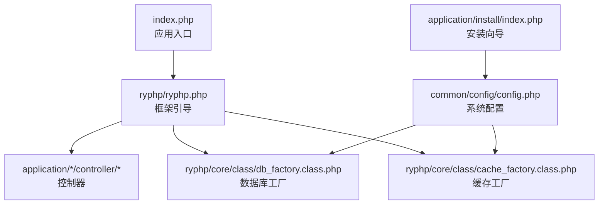
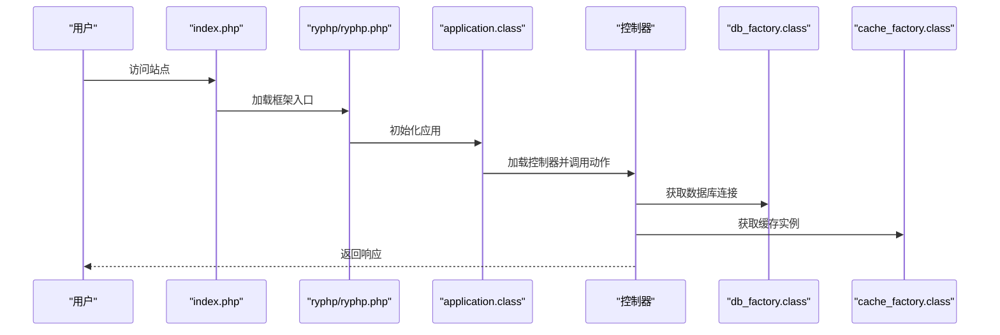
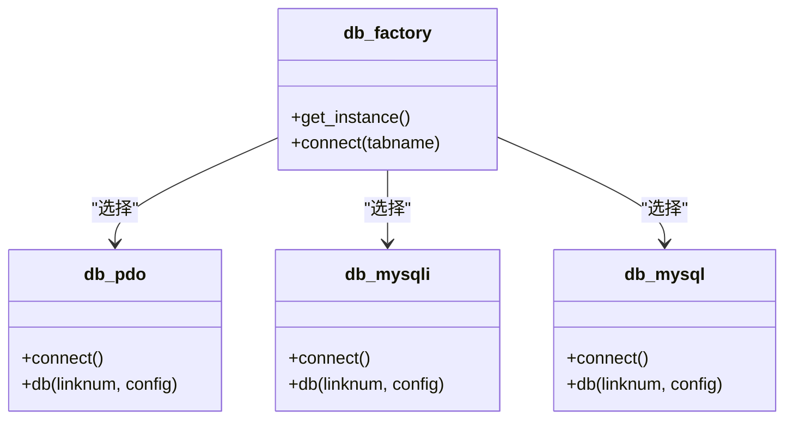
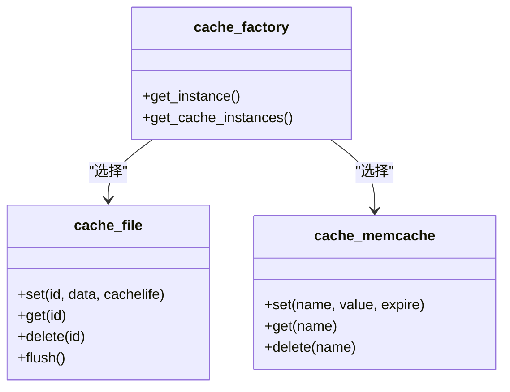
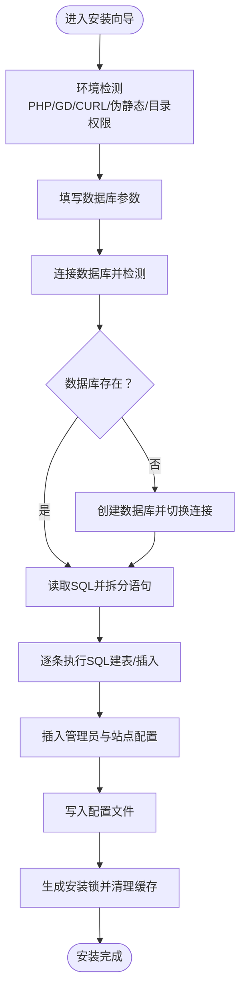
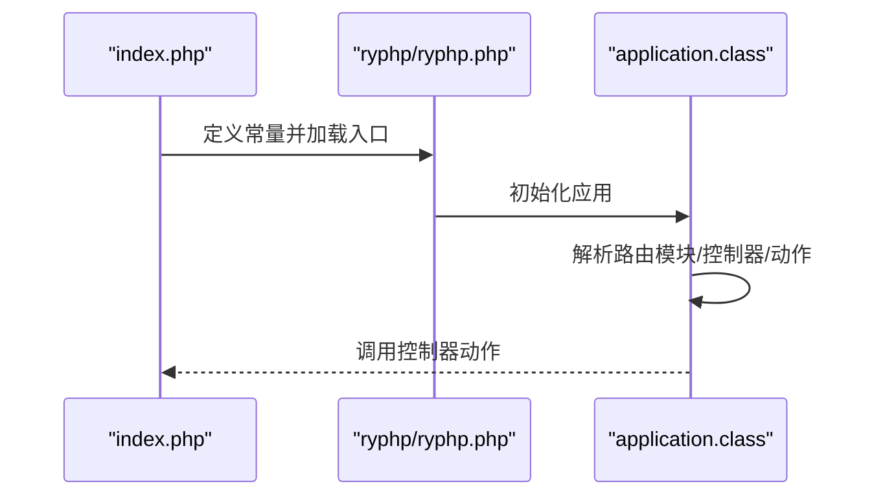
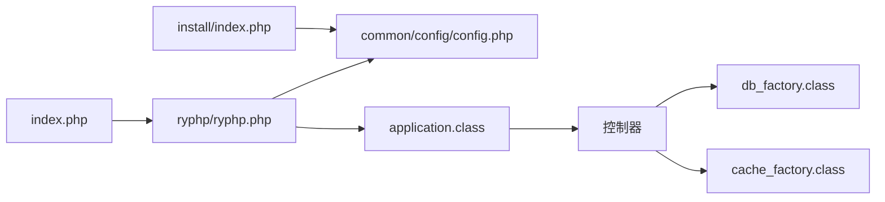
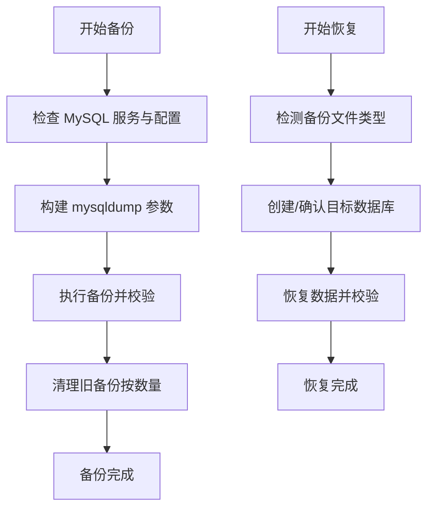

# 部署运维

<cite>
**本文引用的文件**
- [index.php](file://index.php)
- [common/config/config.php](file://common/config/config.php)
- [application/install/index.php](file://application/install/index.php)
- [application/install/templates/s2.php](file://application/install/templates/s2.php)
- [application/install/templates/s3.php](file://application/install/templates/s3.php)
- [backup_mysql_claude.sh](file://backup_mysql_claude.sh)
- [restore_mysql_claude.sh](file://restore_mysql_claude.sh)
- [ryphp/ryphp.php](file://ryphp/ryphp.php)
- [ryphp/core/class/db_factory.class.php](file://ryphp/core/class/db_factory.class.php)
- [ryphp/core/class/db_pdo.class.php](file://ryphp/core/class/db_pdo.class.php)
- [ryphp/core/class/db_mysqli.class.php](file://ryphp/core/class/db_mysqli.class.php)
- [ryphp/core/class/cache_factory.class.php](file://ryphp/core/class/cache_factory.class.php)
- [ryphp/core/class/cache_file.class.php](file://ryphp/core/class/cache_file.class.php)
- [ryphp/core/class/cache_memcache.class.php](file://ryphp/core/class/cache_memcache.class.php)
- [ryphp/core/class/application.class.php](file://ryphp/core/class/application.class.php)
- [application/index/controller/index.class.php](file://application/index/controller/index.class.php)
</cite>

## 目录
1. [简介](#简介)
2. [项目结构](#项目结构)
3. [核心组件](#核心组件)
4. [架构总览](#架构总览)
5. [详细组件分析](#详细组件分析)
6. [依赖关系分析](#依赖关系分析)
7. [性能考虑](#性能考虑)
8. [故障排查指南](#故障排查指南)
9. [结论](#结论)
10. [附录](#附录)

## 简介
本操作指南面向生产环境部署与运维，围绕 LRYBlog（基于 RYPHP 框架）提供从服务器环境准备、PHP 扩展与数据库配置、代码部署与权限设置、配置文件调整、数据库初始化、备份与恢复、性能优化、监控与日志、安全加固到常见问题排查与系统维护升级的全流程说明。文档同时给出关键流程的可视化图示，帮助不同技术背景的运维人员快速上手。

## 项目结构
LRYBlog 采用 MVC 架构与单入口设计，核心入口位于根目录的入口文件，系统配置集中于公共配置文件，安装向导位于 application/install 目录，数据库与缓存抽象通过工厂类实现，前端静态资源与后台管理界面分别组织在 common 与 lry_admin_center 中。

**图表来源**
- [index.php](file://index.php#L1-L18)
- [ryphp/ryphp.php](file://ryphp/ryphp.php#L83-L202)
- [ryphp/core/class/db_factory.class.php](file://ryphp/core/class/db_factory.class.php#L1-L50)
- [ryphp/core/class/cache_factory.class.php](file://ryphp/core/class/cache_factory.class.php#L1-L84)
- [common/config/config.php](file://common/config/config.php#L1-L88)
- [application/install/index.php](file://application/install/index.php#L1-L373)

**章节来源**
- [index.php](file://index.php#L1-L18)
- [ryphp/ryphp.php](file://ryphp/ryphp.php#L1-L204)
- [common/config/config.php](file://common/config/config.php#L1-L88)

## 核心组件
- 应用入口与框架引导：负责常量定义、时区设置、入口加载与应用初始化。
- 数据库层：通过工厂选择 PDO/MySQLi/Mysql 实现，统一连接与异常处理。
- 缓存层：支持 file/redis/memcache，工厂按配置动态加载具体实现。
- 安装向导：提供环境检测、参数配置、数据库初始化与配置写入。
- 配置中心：集中管理数据库、缓存、Cookie、上传、语言等系统参数。

**章节来源**
- [ryphp/ryphp.php](file://ryphp/ryphp.php#L83-L202)
- [ryphp/core/class/db_factory.class.php](file://ryphp/core/class/db_factory.class.php#L1-L50)
- [ryphp/core/class/cache_factory.class.php](file://ryphp/core/class/cache_factory.class.php#L1-L84)
- [application/install/index.php](file://application/install/index.php#L1-L373)
- [common/config/config.php](file://common/config/config.php#L1-L88)

## 架构总览
LRYBlog 的请求生命周期从入口文件开始，经框架引导加载系统类与配置，随后根据路由定位模块、控制器与动作，数据库与缓存通过工厂按配置实例化，最终渲染视图或返回数据。

**图表来源**
- [index.php](file://index.php#L10-L18)
- [ryphp/ryphp.php](file://ryphp/ryphp.php#L83-L202)
- [ryphp/core/class/application.class.php](file://ryphp/core/class/application.class.php#L1-L118)
- [ryphp/core/class/db_factory.class.php](file://ryphp/core/class/db_factory.class.php#L1-L50)
- [ryphp/core/class/cache_factory.class.php](file://ryphp/core/class/cache_factory.class.php#L1-L84)

## 详细组件分析

### 数据库配置与工厂
- 配置项：数据库类型、主机、端口、库名、用户名、密码、字符集、表前缀等。
- 工厂选择：根据配置选择 PDO/MySQLi/Mysql 实现；默认使用优化版 PDO。
- 连接参数：启用严格模式、禁用模拟预处理、设置字符集与错误模式。
- 异常处理：连接失败时抛出自定义异常或终止输出。

**图表来源**
- [ryphp/core/class/db_factory.class.php](file://ryphp/core/class/db_factory.class.php#L1-L50)
- [ryphp/core/class/db_pdo.class.php](file://ryphp/core/class/db_pdo.class.php#L1-L42)
- [ryphp/core/class/db_mysqli.class.php](file://ryphp/core/class/db_mysqli.class.php#L1-L60)

**章节来源**
- [common/config/config.php](file://common/config/config.php#L13-L21)
- [ryphp/core/class/db_factory.class.php](file://ryphp/core/class/db_factory.class.php#L11-L50)
- [ryphp/core/class/db_pdo.class.php](file://ryphp/core/class/db_pdo.class.php#L26-L42)
- [ryphp/core/class/db_mysqli.class.php](file://ryphp/core/class/db_mysqli.class.php#L23-L46)

### 缓存配置与工厂
- 配置项：缓存类型（file/redis/memcache），以及各自配置（如目录、主机、端口、前缀、过期等）。
- 工厂选择：按配置加载对应缓存实现，提供懒加载单例。
- 文件缓存：支持序列化与可执行数组两种存储模式，具备过期判断与批量清空能力。

**图表来源**
- [ryphp/core/class/cache_factory.class.php](file://ryphp/core/class/cache_factory.class.php#L1-L84)
- [ryphp/core/class/cache_file.class.php](file://ryphp/core/class/cache_file.class.php#L1-L130)
- [ryphp/core/class/cache_memcache.class.php](file://ryphp/core/class/cache_memcache.class.php#L1-L55)

**章节来源**
- [common/config/config.php](file://common/config/config.php#L39-L66)
- [ryphp/core/class/cache_factory.class.php](file://ryphp/core/class/cache_factory.class.php#L36-L84)
- [ryphp/core/class/cache_file.class.php](file://ryphp/core/class/cache_file.class.php#L17-L73)

### 安装向导与数据库初始化
- 环境检测：PHP 版本、GD/CURL、伪静态、目录可写、配置文件可写等。
- 参数设置：数据库类型、主机、端口、库名、用户名、密码、表前缀、字符集与引擎。
- 初始化流程：创建数据库、拆分 SQL、逐条执行建表与数据导入、写入配置文件、生成安装锁。

**图表来源**
- [application/install/index.php](file://application/install/index.php#L51-L275)
- [application/install/templates/s2.php](file://application/install/templates/s2.php#L1-L135)
- [application/install/templates/s3.php](file://application/install/templates/s3.php#L31-L51)

**章节来源**
- [application/install/index.php](file://application/install/index.php#L116-L275)
- [application/install/templates/s2.php](file://application/install/templates/s2.php#L28-L128)
- [application/install/templates/s3.php](file://application/install/templates/s3.php#L31-L51)

### 入口与路由
- 入口文件：定义调试开关、根路径、加载框架入口并初始化应用。
- 路由解析：框架引导时加载参数类，解析模块、控制器、动作，随后加载控制器并调用对应动作。

**图表来源**
- [index.php](file://index.php#L10-L18)
- [ryphp/ryphp.php](file://ryphp/ryphp.php#L83-L202)
- [ryphp/core/class/application.class.php](file://ryphp/core/class/application.class.php#L14-L40)

**章节来源**
- [index.php](file://index.php#L10-L18)
- [ryphp/ryphp.php](file://ryphp/ryphp.php#L83-L202)
- [ryphp/core/class/application.class.php](file://ryphp/core/class/application.class.php#L14-L40)

## 依赖关系分析
- 入口依赖框架引导，框架引导依赖系统类加载与配置。
- 控制器依赖数据库与缓存工厂，工厂再依赖具体实现类。
- 安装向导依赖配置文件写入与数据库连接。

**图表来源**
- [index.php](file://index.php#L10-L18)
- [ryphp/ryphp.php](file://ryphp/ryphp.php#L83-L202)
- [common/config/config.php](file://common/config/config.php#L1-L88)
- [ryphp/core/class/application.class.php](file://ryphp/core/class/application.class.php#L1-L118)
- [ryphp/core/class/db_factory.class.php](file://ryphp/core/class/db_factory.class.php#L1-L50)
- [ryphp/core/class/cache_factory.class.php](file://ryphp/core/class/cache_factory.class.php#L1-L84)
- [application/install/index.php](file://application/install/index.php#L1-L373)

**章节来源**
- [index.php](file://index.php#L10-L18)
- [ryphp/ryphp.php](file://ryphp/ryphp.php#L83-L202)
- [common/config/config.php](file://common/config/config.php#L1-L88)
- [ryphp/core/class/application.class.php](file://ryphp/core/class/application.class.php#L1-L118)

## 性能考虑
- PHP 配置优化
  - 推荐启用 OPcache 以减少脚本编译开销。
  - 合理设置内存限制与执行超时，避免长时间任务阻塞。
  - 关闭不必要的扩展，降低运行时负担。
- 数据库优化
  - 使用 PDO 并启用严格模式与禁用模拟预处理，提升一致性与安全性。
  - 建表时优先 InnoDB，合理设置字符集（如 utf8mb4）。
  - 对高频查询建立索引，避免全表扫描；定期分析慢查询日志。
- 缓存策略
  - 生产环境优先使用 Redis 或 Memcache，结合过期策略与键前缀。
  - 文件缓存适合小规模或无外部缓存服务场景，注意目录权限与清理策略。
- 静态资源与压缩
  - 启用 Gzip/Deflate 压缩与浏览器缓存头，减少带宽占用。
  - 合理组织静态资源，使用 CDN 加速热点资源。

[本节为通用性能建议，无需特定文件引用]

## 故障排查指南
- 安装阶段
  - 环境不满足：检查 PHP 版本、GD/CURL、伪静态与目录可写性。
  - 数据库连接失败：核对主机、端口、用户名、密码与字符集。
  - 配置写入失败：确保配置文件具备写权限。
- 运行阶段
  - 404/控制器不存在：检查路由参数与控制器文件是否存在。
  - 数据库连接异常：查看连接参数与服务状态，确认字符集与权限。
  - 缓存异常：检查缓存类型与配置，验证目录权限或服务可达性。
- 备份与恢复
  - 备份失败：检查 MySQL 服务状态、配置文件权限与 mysqldump 可用性。
  - 恢复失败：确认备份文件完整性与目标数据库名称合法性。

**章节来源**
- [application/install/index.php](file://application/install/index.php#L51-L120)
- [ryphp/core/class/application.class.php](file://ryphp/core/class/application.class.php#L108-L118)
- [ryphp/core/class/db_pdo.class.php](file://ryphp/core/class/db_pdo.class.php#L33-L42)
- [ryphp/core/class/cache_file.class.php](file://ryphp/core/class/cache_file.class.php#L40-L46)

## 结论
通过遵循本指南的部署与运维流程，结合数据库与缓存的合理配置、完善的备份恢复策略、性能优化与安全加固措施，可显著提升 LRYBlog 在生产环境中的稳定性与可维护性。建议在上线前完成全链路演练，并建立持续监控与应急响应机制。

[本节为总结性内容，无需特定文件引用]

## 附录

### 生产环境部署清单
- 服务器与系统
  - Linux 发行版（推荐稳定版本）
  - Web 服务器（Nginx/Apache）与 PHP-FPM
  - MySQL 5.7+/8.0（建议开启 GTID 与合理字符集）
- PHP 扩展
  - 必需：PDO_MySQL、GD、CURL、OPcache
  - 可选：Redis、Memcached
- 目录权限
  - cache、uploads、common/config（安装期间需可写，安装完成后降权）
- 配置要点
  - 数据库：主机、端口、库名、用户名、密码、字符集、表前缀
  - 缓存：类型与参数（Redis/Memcache 主机/端口/密码/前缀）
  - Cookie：域、路径、安全标志、HttpOnly
  - URL 与伪静态：根据 Web 服务器配置调整

**章节来源**
- [application/install/templates/s2.php](file://application/install/templates/s2.php#L28-L128)
- [common/config/config.php](file://common/config/config.php#L13-L86)

### 部署步骤
- 代码上传与权限
  - 上传代码至站点根目录
  - 设置目录权限：cache、uploads、common/config（安装后回收写权限）
- 配置文件调整
  - 修改数据库与缓存配置，确保与实际环境一致
- 数据库初始化
  - 通过安装向导创建数据库、执行建表与数据导入
- 生成安装锁与清理
  - 安装完成后生成安装锁并清理临时文件
- 验证与回滚
  - 访问首页与后台，确认功能正常；准备回滚脚本与备份

**章节来源**
- [application/install/index.php](file://application/install/index.php#L265-L275)
- [common/config/config.php](file://common/config/config.php#L13-L21)

### 备份与恢复策略
- 备份脚本
  - 使用增强版备份脚本，支持单库/全库、压缩、单事务、完整插入等选项
  - 自动清理旧备份，保留指定数量
- 恢复脚本
  - 支持 .sql 与 .sql.gz，自动检测文件类型与数据库名
  - 可选择覆盖或删除重建目标数据库
- 灾难恢复流程
  - 确认备份文件完整性与可读性
  - 在隔离环境验证恢复结果
  - 切换流量并监控业务指标

**图表来源**
- [backup_mysql_claude.sh](file://backup_mysql_claude.sh#L170-L391)
- [restore_mysql_claude.sh](file://restore_mysql_claude.sh#L210-L410)

**章节来源**
- [backup_mysql_claude.sh](file://backup_mysql_claude.sh#L1-L392)
- [restore_mysql_claude.sh](file://restore_mysql_claude.sh#L1-L412)

### 监控与日志管理
- 系统监控
  - CPU/内存/磁盘/网络使用率
  - PHP-FPM 进程数与队列长度
  - MySQL QPS、连接数、慢查询
- 错误日志
  - Web 服务器错误日志与访问日志
  - PHP 错误日志与框架调试输出
  - 数据库错误日志与慢查询日志
- 性能监控工具
  - APM/探针（如 X-Ray、New Relic 或自建 Prometheus）
  - 基础指标采集（Node Exporter/Telegraf）

[本节为通用监控建议，无需特定文件引用]

### 安全加固建议
- 防火墙与网络
  - 仅开放必要端口（80/443/SSH），限制来源 IP
- SSL/TLS
  - 申请并安装可信证书，强制 HTTPS
- 应用安全
  - 严格控制文件上传类型与大小，启用水印
  - 定期更新框架与依赖，修补已知漏洞
  - 启用 WAF（如 Nginx-ModSecurity）与入侵检测
- 备份安全
  - 备份文件加密存储，限制访问权限

[本节为通用安全建议，无需特定文件引用]

### 常见问题排查
- 页面空白或 500 错误
  - 检查 PHP 错误日志与框架调试输出
  - 核对数据库连接参数与字符集
- 图片上传失败
  - 检查 uploads 目录权限与 PHP 上传限制
  - 确认 GD 扩展与水印配置
- 缓存不生效
  - 检查缓存类型与配置，验证 Redis/Memcache 服务
  - 清理缓存目录或重启缓存服务

**章节来源**
- [ryphp/core/class/application.class.php](file://ryphp/core/class/application.class.php#L108-L118)
- [ryphp/core/class/cache_file.class.php](file://ryphp/core/class/cache_file.class.php#L40-L46)
- [common/config/config.php](file://common/config/config.php#L75-L81)

### 系统维护与升级
- 升级流程
  - 备份数据库与代码
  - 停止服务，替换代码，执行数据库迁移脚本
  - 启动服务并验证功能
- 日常维护
  - 定期清理缓存与日志
  - 监控磁盘空间与数据库健康
  - 更新安全补丁与依赖

[本节为通用维护建议，无需特定文件引用]